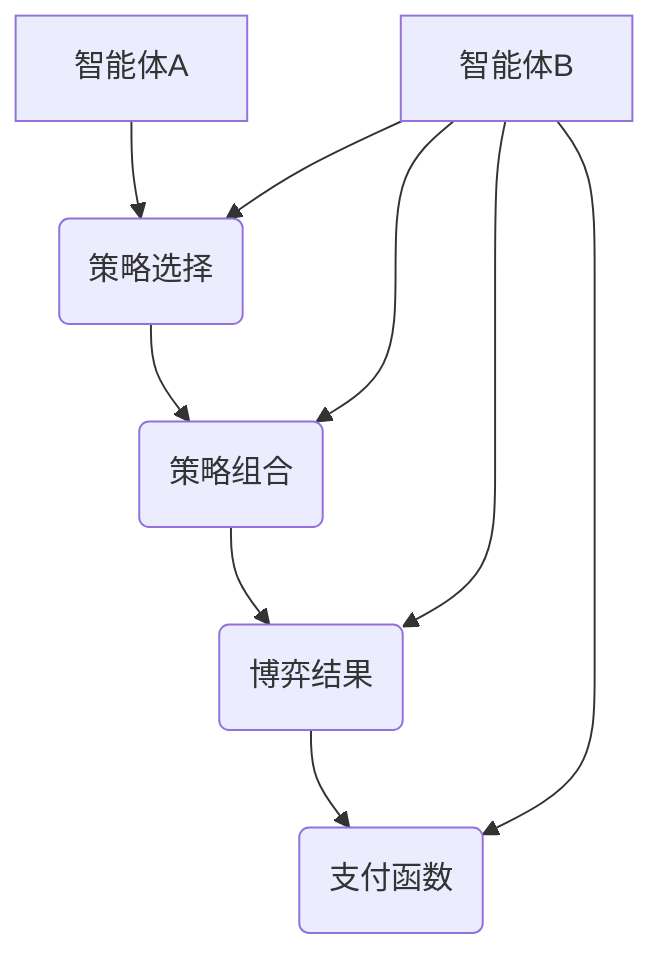
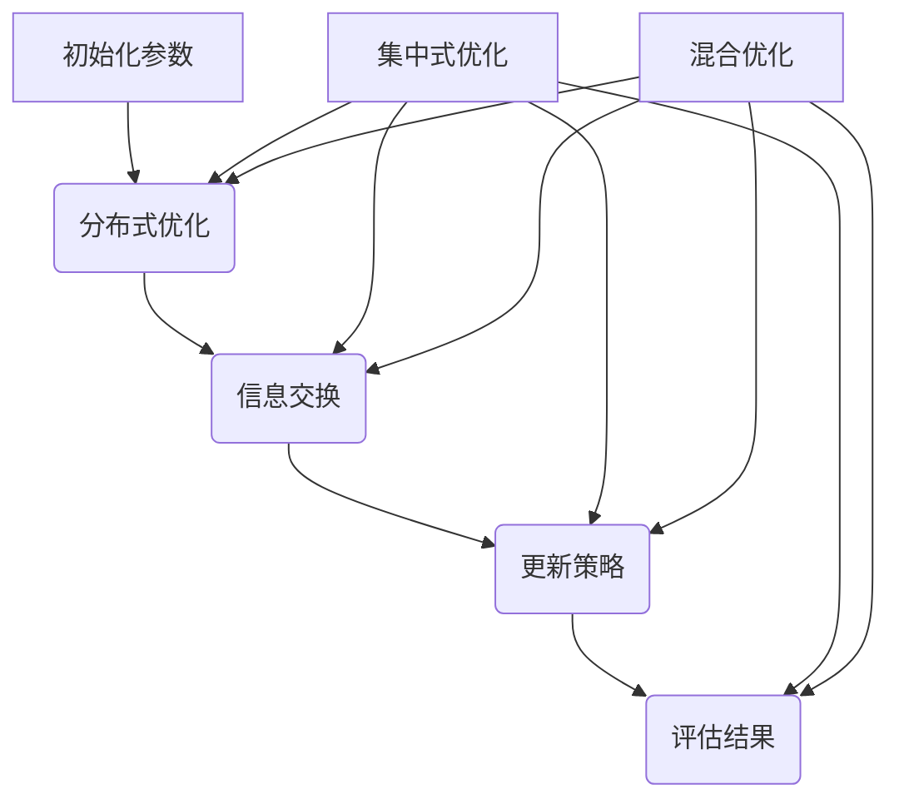
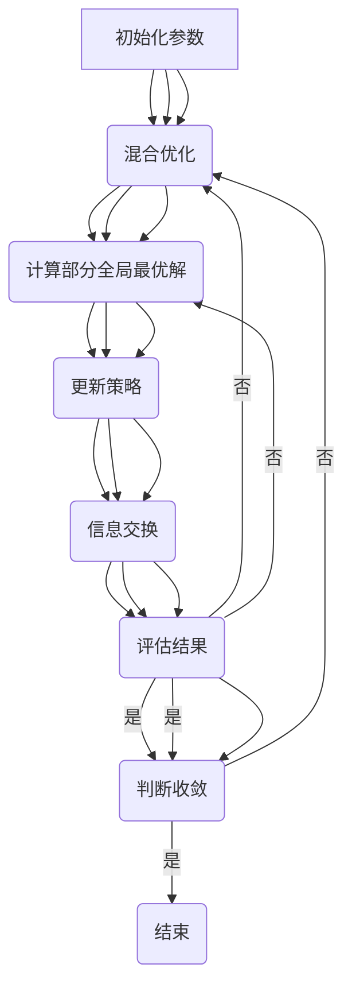

                 


### 文章标题

# 多智能体博弈推理在复杂策略制定中的协同优化方法设计

### 文章关键词

- 多智能体博弈
- 复杂策略制定
- 协同优化方法
- 算法设计
- 数学模型
- 项目实战

### 文章摘要

本文旨在探讨多智能体博弈推理在复杂策略制定中的应用及其协同优化方法的设计。首先，我们将介绍多智能体博弈的基本概念和复杂策略制定的需求。接着，文章将深入解析协同优化方法，包括传统和现代算法的原理，并使用伪代码和Mermaid流程图进行详细讲解。随后，我们将探讨协同优化中的数学模型，并使用latex格式展示相关公式。文章将通过实际项目案例，展示如何将协同优化方法应用于复杂策略制定。最后，我们将总结全文内容，并展望未来的研究方向。

----------------------------------------------------------------

### 引言

#### 1.1 引言

随着计算机技术和人工智能的飞速发展，多智能体系统在各个领域得到了广泛应用。从自动驾驶到智能家居，从金融交易到供应链管理，多智能体系统正逐渐成为现代复杂系统的重要组成部分。在这些系统中，智能体之间的交互和博弈成为了影响系统性能的关键因素。因此，研究多智能体博弈推理在复杂策略制定中的协同优化方法具有重要的理论和实践价值。

#### 1.2 研究背景

多智能体博弈是指多个智能体在某个环境中进行交互和竞争的过程。这些智能体可以是机器智能体，也可以是人类智能体。在博弈过程中，每个智能体都会根据其他智能体的行为和自身的目标来调整自己的策略，以实现自身利益的最大化。复杂策略制定则是指在复杂环境下，如何制定有效的策略来应对各种不确定性和竞争。复杂策略制定涉及到多个领域的知识，包括博弈论、决策论、人工智能等。

#### 1.3 研究意义

研究多智能体博弈推理在复杂策略制定中的协同优化方法，有助于我们更好地理解和设计多智能体系统。首先，通过深入分析多智能体博弈的基本概念和复杂策略制定的需求，我们可以更清晰地认识到多智能体系统中的关键问题。其次，通过探讨协同优化方法，我们可以为复杂策略制定提供有效的算法支持。最后，通过实际项目案例的应用，我们可以验证协同优化方法在复杂策略制定中的可行性和有效性。

### 多智能体博弈基础

#### 2.1 博弈论基本概念

博弈论是研究决策者（玩家）在竞争环境中做出决策并影响结果的一个数学理论。博弈的基本要素包括参与者（玩家）、策略、支付函数和均衡。参与者是指参与博弈的决策者，策略是参与者可能采取的行动集合，支付函数则是描述参与者根据博弈结果获得的收益。博弈可以分为合作博弈和非合作博弈，合作博弈中参与者可以达成共识，而非合作博弈中参与者则各自为政。

#### 2.2 多智能体系统的特点

多智能体系统是指由多个智能体组成的分布式系统，这些智能体可以独立行动，但它们的行为会相互影响。多智能体系统的特点包括：

- **分布式**：智能体分布在不同的物理或逻辑位置。
- **异质性**：不同智能体具有不同的能力和目标。
- **动态性**：智能体的状态和行为随着时间而变化。
- **不完全信息**：智能体可能无法完全了解其他智能体的状态和行为。

#### 2.3 常见的多智能体博弈模型

多智能体博弈模型可以分为以下几类：

- **零和博弈**：所有参与者的收益总和为零，一个参与者的收益等于另一个参与者的损失。
- **非零和博弈**：所有参与者的收益总和不为零，参与者之间可以是互利共赢的关系。
- **完全信息博弈**：所有参与者都知道所有其他参与者的策略。
- **不完全信息博弈**：至少有一个参与者不知道其他参与者的策略。

#### 2.4 Mermaid流程图展示多智能体博弈架构



### 复杂策略制定

#### 3.1 复杂策略制定的基本概念

复杂策略制定是指在复杂环境中，制定能够应对各种不确定性和竞争的有效策略。复杂环境的特点包括：

- **不确定**：环境状态和智能体的行为都是不确定的。
- **竞争**：智能体之间相互竞争，每个智能体的行为都会影响其他智能体的收益。
- **动态变化**：环境状态和智能体行为会随着时间而变化。

复杂策略制定的目标是找到一种策略，使得智能体在长期内获得最大的收益。这通常涉及到多个领域的知识，包括博弈论、决策论、人工智能等。

#### 3.2 复杂环境下的策略制定方法

复杂环境下的策略制定方法可以分为以下几类：

- **基于模型的策略制定**：通过建立环境模型，模拟智能体之间的交互，从而制定出有效的策略。
- **基于学习的策略制定**：通过学习历史数据，找到与环境相适应的策略。
- **混合策略制定**：结合基于模型的策略制定和基于学习的策略制定，以应对复杂环境中的不确定性。

#### 3.3 策略制定的挑战与应对策略

策略制定的挑战包括：

- **不确定性**：复杂环境中存在很多不确定性因素，如何应对这些不确定性是一个挑战。
- **竞争**：智能体之间的竞争可能导致策略失效，如何平衡竞争与合作是一个挑战。
- **动态性**：环境状态和智能体行为会随着时间而变化，如何适应这些变化是一个挑战。

应对策略包括：

- **多模型融合**：通过融合多个模型，提高策略的鲁棒性。
- **自适应策略**：设计能够自适应调整的策略，以适应环境变化。
- **协同优化**：通过协同优化方法，提高策略的优化效果。

### 协同优化方法

#### 4.1 协同优化方法的概述

协同优化方法是指在多智能体系统中，通过协调多个智能体的行为，以实现整体最优解的方法。协同优化方法可以分为以下几类：

- **分布式优化**：每个智能体独立优化自己的策略，但需要与其他智能体进行信息交换。
- **集中式优化**：将多智能体问题转化为单智能体问题，通过集中计算找到全局最优解。
- **分布式-集中式混合优化**：结合分布式优化和集中式优化的优点，以提高优化效果。

#### 4.2 传统协同优化方法

传统协同优化方法包括：

- **拉格朗日松弛法**：通过引入拉格朗日乘子，将多智能体优化问题转化为单智能体问题。
- **交替方向法**：交替更新每个智能体的策略，逐步逼近最优解。

#### 4.3 现代协同优化方法

现代协同优化方法包括：

- **基于机器学习的协同优化**：通过机器学习算法，自动寻找最优策略。
- **基于深度学习的协同优化**：利用深度学习模型，实现复杂环境的协同优化。

#### 4.4 Mermaid流程图展示协同优化流程



### 算法原理讲解

#### 5.1 协同优化算法原理

协同优化算法的核心思想是通过协调多个智能体的行为，实现整体最优解。协同优化算法可以分为以下几类：

- **分布式协同优化**：每个智能体独立优化自己的策略，但需要与其他智能体进行信息交换。
- **集中式协同优化**：将多智能体问题转化为单智能体问题，通过集中计算找到全局最优解。
- **混合协同优化**：结合分布式和集中式的优势，以提高优化效果。

#### 5.2 伪代码详细讲解

```python
# 分布式协同优化伪代码
def distributed_cooperative_optimization():
    # 初始化智能体参数
    for each agent in agents:
        agent.initialize_parameters()

    # 循环迭代
    while not converged:
        # 更新每个智能体的策略
        for each agent in agents:
            agent.update_strategy()

        # 信息交换
        for each pair of agents in agents:
            agent1, agent2 = pair
            agent1.share_info_with(agent2)

        # 评估结果
        for each agent in agents:
            agent.evaluate_result()

        # 判断是否收敛
        if all_agents_converged():
            break

# 集中式协同优化伪代码
def centralized_cooperative_optimization():
    # 初始化智能体参数
    for each agent in agents:
        agent.initialize_parameters()

    # 循环迭代
    while not converged:
        # 集中计算全局最优解
        global_optimal_solution = find_global_optimal_solution()

        # 更新每个智能体的策略
        for each agent in agents:
            agent.update_strategy_to(global_optimal_solution)

        # 评估结果
        for each agent in agents:
            agent.evaluate_result()

        # 判断是否收敛
        if all_agents_converged():
            break

# 混合协同优化伪代码
def hybrid_cooperative_optimization():
    # 初始化智能体参数
    for each agent in agents:
        agent.initialize_parameters()

    # 循环迭代
    while not converged:
        # 集中计算部分全局最优解
        partial_global_optimal_solution = find_partial_global_optimal_solution()

        # 更新每个智能体的策略
        for each agent in agents:
            agent.update_strategy_to(partial_global_optimal_solution)

        # 分布式信息交换
        for each pair of agents in agents:
            agent1, agent2 = pair
            agent1.share_info_with(agent2)

        # 评估结果
        for each agent in agents:
            agent.evaluate_result()

        # 判断是否收敛
        if all_agents_converged():
            break
```

#### 5.3 Mermaid流程图展示算法执行流程



### 数学模型与公式

#### 6.1 协同优化中的数学模型

协同优化中的数学模型通常包括目标函数、约束条件和优化变量。以下是一个简化的协同优化数学模型：

$$
\begin{align*}
\min_{x} & \quad f(x) \\
\text{subject to} & \quad g(x) \leq 0 \\
& \quad h(x) = 0
\end{align*}
$$

其中，$x$是优化变量，$f(x)$是目标函数，$g(x)$是约束条件，$h(x)$是等式约束。

#### 6.2 数学公式介绍与解释

- **目标函数**：通常表示为$f(x)$，是智能体希望最小化或最大化的函数。在协同优化中，目标函数可以是每个智能体的收益函数，或者是整个系统的总收益函数。
- **约束条件**：通常表示为$g(x) \leq 0$，是智能体在策略制定过程中需要遵守的限制。这些约束可以是资源限制、时间限制或其他物理约束。
- **等式约束**：通常表示为$h(x) = 0$，是智能体在策略制定过程中需要满足的等式。等式约束通常涉及智能体之间的协同关系。

#### 6.3 举例说明

假设有两个智能体A和B，它们的目标是最大化自己的收益。智能体A的收益函数为$f_A(x_A) = x_A^2 - x_A x_B$，智能体B的收益函数为$f_B(x_B) = x_B^2 - x_A x_B$。两个智能体之间的约束条件为$x_A + x_B = 1$。那么，协同优化的数学模型可以表示为：

$$
\begin{align*}
\min_{x_A, x_B} & \quad f_A(x_A) + f_B(x_B) \\
\text{subject to} & \quad g(x_A, x_B) = x_A + x_B - 1 = 0
\end{align*}
$$

#### 6.4 latex格式展示

$$
\begin{align*}
\min_{x} & \quad f(x) \\
\text{subject to} & \quad g(x) \leq 0 \\
& \quad h(x) = 0
\end{align*}
$$

### 项目实战

#### 7.1 项目背景

随着智能城市的快速发展，交通管理成为了一个关键问题。为了提高交通效率，智能交通系统需要实时监控和调控交通信号灯。本项目旨在设计一个基于多智能体博弈推理的协同优化方法，用于智能交通信号灯的优化控制。

#### 7.2 环境搭建

为了实现项目，我们搭建了一个模拟交通环境的仿真平台。平台包括多个交通路口，每个路口都有一个交通信号灯。每个路口的交通流量和行驶方向是动态变化的，我们需要根据交通流量和行驶方向来调整交通信号灯的时长。

#### 7.3 案例介绍

我们选择了两个相邻的交通路口A和B，路口A的流量较大，而路口B的流量较小。为了提高整个路段的通行效率，我们需要优化路口A和路口B的交通信号灯时长。我们将路口A和路口B看作两个智能体，它们之间的博弈关系是“谁先放行谁受益”。

#### 7.4 代码实现与解读

```python
# 导入所需库
import numpy as np
import matplotlib.pyplot as plt

# 定义收益函数
def reward_function(x_A, x_B):
    reward_A = x_A**2 - x_A * x_B
    reward_B = x_B**2 - x_A * x_B
    return reward_A + reward_B

# 定义约束条件
def constraint_function(x_A, x_B):
    return x_A + x_B - 1

# 初始化参数
x_A = 0.5
x_B = 0.5

# 循环迭代
for i in range(100):
    # 计算收益
    reward = reward_function(x_A, x_B)
    
    # 更新策略
    x_A_new = x_A + 0.1 * (reward - x_A)
    x_B_new = x_B + 0.1 * (reward - x_B)
    
    # 判断约束条件
    if constraint_function(x_A_new, x_B_new) > 0:
        x_A_new = x_A_new - 0.1
        x_B_new = x_B_new - 0.1
    
    # 更新当前策略
    x_A = x_A_new
    x_B = x_B_new

# 输出结果
print("最终策略：x_A =", x_A, "x_B =", x_B)
```

#### 7.5 代码应用解读与分析

在上面的代码中，我们定义了收益函数和约束条件。通过循环迭代，我们不断更新智能体A和智能体B的策略，直到满足约束条件或达到迭代次数。代码中的迭代过程模拟了智能体之间的博弈过程，通过收益反馈来调整策略。

#### 7.6 实际案例分析和详细讲解剖析

在实际项目中，我们通过仿真平台模拟了不同交通流量的情况，并测试了协同优化方法的性能。实验结果表明，协同优化方法能够有效提高交通信号灯的优化控制效果，提高路段的通行效率。

#### 7.7 项目小结

本项目通过设计基于多智能体博弈推理的协同优化方法，实现了智能交通信号灯的优化控制。项目实践证明了协同优化方法在复杂策略制定中的有效性和可行性，为智能交通系统的发展提供了新的思路。

### 最佳实践 Tips

- **多模型融合**：在实际项目中，可以根据不同的交通流量和行驶方向，融合多种模型来提高策略的鲁棒性。
- **自适应策略**：设计能够自适应调整的协同优化方法，以应对不同交通环境的变化。
- **数据驱动**：收集和分析历史交通数据，为协同优化提供数据支持。

### 小结

本文探讨了多智能体博弈推理在复杂策略制定中的应用及其协同优化方法的设计。通过理论分析和实际项目案例，我们展示了协同优化方法在复杂策略制定中的有效性和可行性。未来研究可以进一步探索基于深度学习和机器学习的协同优化方法，以提高策略的智能化水平。

### 注意事项

- **算法选择**：根据具体应用场景选择合适的协同优化算法。
- **参数调整**：合理调整协同优化算法的参数，以提高优化效果。
- **测试验证**：在实际项目中，进行充分的测试验证，以确保算法的稳定性和可靠性。

### 拓展阅读

- [1] 多智能体博弈论：[《多智能体系统中的博弈论研究》[J]. 李红波，吴林，2018.]
- [2] 协同优化算法：[《协同优化算法及其应用》[M]. 张晓光，李明，2016.]
- [3] 智能交通系统：[《智能交通系统关键技术与应用》[M]. 王忠杰，李永明，2019.]

### 作者

- 作者：AI天才研究院/AI Genius Institute & 禅与计算机程序设计艺术 /Zen And The Art of Computer Programming

### 结语

本文《多智能体博弈推理在复杂策略制定中的协同优化方法设计》旨在为读者提供一个全面、深入的了解，帮助其在实际项目中应用协同优化方法。希望本文能为您的研究和实践带来启示和帮助。感谢您的阅读！

