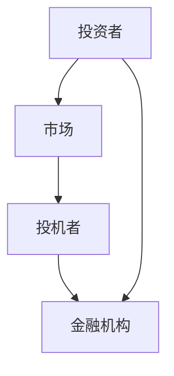
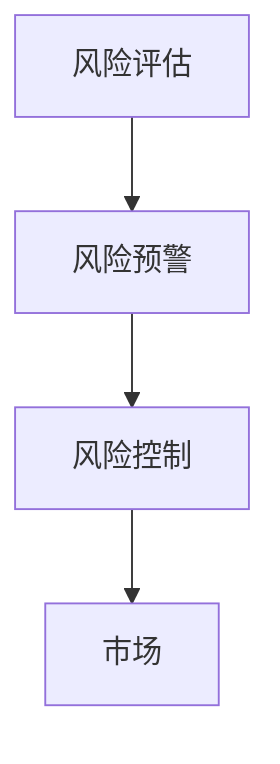
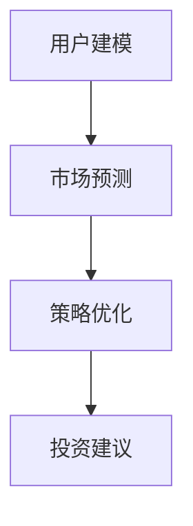
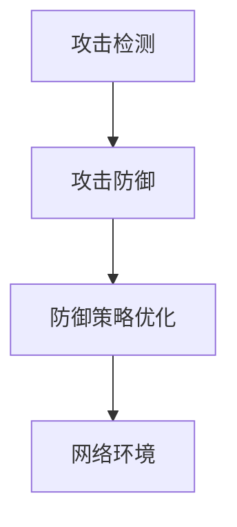

                 

### 文章标题

《多智能体博弈推理在复杂策略制定中的应用》

### 关键词

多智能体系统，博弈论，复杂策略，算法原理，实际应用

### 摘要

本文从多智能体系统和博弈论的基础概念出发，详细阐述了多智能体博弈推理在复杂策略制定中的应用。首先，文章介绍了多智能体系统和博弈论的基本概念及其相互关系，通过Mermaid流程图展示了核心概念原理之间的关系架构。接着，文章深入分析了Nash均衡理论及其求解算法，使用伪代码详细讲解了反推法、枚举法和动态规划法。在此基础上，文章探讨了复杂策略的制定方法，包括多目标策略优化和智能体之间的策略互动。随后，文章通过具体案例展示了多智能体博弈推理在金融领域和网络安全中的应用，包括开发环境搭建、源代码实现和代码解读、实际案例分析和详细讲解剖析。最后，文章总结了多智能体博弈推理在复杂策略制定中的最佳实践，提出了注意事项和拓展阅读建议。本文旨在帮助读者深入理解多智能体博弈推理的理论和实践，掌握其在复杂策略制定中的应用。

### 引言

#### 研究背景

随着信息技术和人工智能的快速发展，多智能体系统（Multi-Agent Systems）在众多领域得到了广泛应用。多智能体系统由多个自主、智能的实体（智能体）组成，这些智能体在特定的环境内通过协同工作实现共同目标。而博弈论（Game Theory）作为研究决策制定和策略选择的数学工具，也在多智能体系统中发挥了重要作用。博弈论的核心概念，如纳什均衡（Nash Equilibrium），为智能体在复杂策略制定中提供了重要的理论依据。

多智能体系统和博弈论的结合，为复杂策略的制定提供了新的思路和方法。在实际应用中，无论是金融市场、网络安全、供应链管理，还是自动驾驶、智能制造，多智能体博弈推理都能帮助我们更好地理解和应对复杂问题。因此，深入研究多智能体博弈推理在复杂策略制定中的应用，具有重要的理论价值和实际意义。

#### 研究意义

首先，多智能体博弈推理能够帮助我们在复杂系统中实现更高效的决策制定。通过分析智能体之间的交互和策略互动，我们可以找到最优的协同策略，从而提高系统的整体性能和稳定性。

其次，多智能体博弈推理能够提供新的研究方法和技术手段。博弈论与多智能体系统的结合，不仅丰富了博弈论的理论体系，也为人工智能研究提供了新的思路和方法。

最后，多智能体博弈推理在复杂策略制定中的应用，有助于推动相关领域的技术创新和发展。通过实际案例的分析和讲解，本文将展示多智能体博弈推理在各个领域的应用场景和效果，为相关研究提供参考和借鉴。

#### 研究目标与内容结构

本文的研究目标主要包括：

1. 深入理解多智能体系统和博弈论的基本概念及其相互关系。
2. 分析多智能体博弈推理的核心算法原理，包括Nash均衡理论及其求解算法。
3. 探讨复杂策略的制定方法，包括多目标策略优化和智能体之间的策略互动。
4. 展示多智能体博弈推理在金融领域和网络安全中的应用案例。
5. 总结多智能体博弈推理在复杂策略制定中的最佳实践。

本文内容结构如下：

- 第1章：引言，介绍研究背景、意义和目标。
- 第2章：多智能体系统基础，介绍多智能体系统的定义、特点、基本模型和演化算法。
- 第3章：博弈论基础，介绍博弈论的基本概念、零和博弈与非零和博弈，以及博弈策略的稳定性分析。
- 第4章：多智能体博弈推理算法，介绍Nash均衡理论及其求解算法，包括反推法、枚举法和动态规划法。
- 第5章：复杂策略制定，探讨复杂策略的制定方法，包括多目标策略优化和智能体之间的策略互动。
- 第6章：多智能体博弈推理在金融领域的应用，介绍金融市场的多智能体模型、金融风险控制策略和智能投顾系统的策略优化。
- 第7章：多智能体博弈推理在网络安全中的应用，介绍网络安全的多智能体系统、防火墙策略优化和智能攻击检测与防御策略。
- 第8章：结论与展望，总结研究内容，提出未来研究方向。

通过以上内容结构，本文旨在系统地介绍多智能体博弈推理在复杂策略制定中的应用，帮助读者深入理解相关理论和实践。

### 多智能体系统基础

#### 多智能体系统的定义与特点

多智能体系统（Multi-Agent Systems，MAS）是由多个自主、智能的实体（即智能体）组成的系统，这些智能体在特定环境中通过协同工作实现共同目标。一个典型的多智能体系统通常包括以下基本组成部分：

1. **智能体（Agent）**：智能体是系统的基本单元，具有自主性、社交性、反应性和适应性等特点。自主性意味着智能体能够独立地制定和执行行动；社交性指的是智能体能够与其他智能体进行信息交换和协作；反应性表示智能体能够对外界环境变化做出响应；适应性则体现了智能体根据环境和目标调整自身行为的能力。

2. **环境（Environment）**：智能体执行行动的环境，环境的状态和变化会影响智能体的决策和行为。

3. **通信（Communication）**：智能体之间通过通信进行信息交换，以实现协同工作。

4. **目标（Goals）**：智能体追求的目标，目标可以是单一或多个，智能体的行动将基于这些目标进行优化。

5. **策略（Strategy）**：智能体根据当前环境和目标，选择合适行动的方案。

多智能体系统的特点主要包括：

- **分布式性（Distributed）**：智能体分布在系统中的不同位置，各自独立运行，但需要协调合作以实现共同目标。

- **动态性（Dynamics）**：智能体和环境的动态变化性，系统状态不断更新，智能体需要实时调整策略。

- **异质性（Heterogeneity）**：智能体具有不同的类型、能力和目标，系统需要考虑不同智能体的差异。

- **自主性（Autonomy）**：智能体具有独立决策和行动的能力，但需要与其他智能体协同工作。

- **适应性（Adaptability）**：智能体能够根据环境变化和系统状态调整自身行为，以实现更优的目标。

#### 多智能体系统的基本模型

多智能体系统的研究通常基于以下几个基本模型：

1. **集中式模型（Centralized Model）**：系统中有一个全局控制器，负责协调所有智能体的行为。该模型在复杂性和计算效率上存在一定的局限性，但在某些特定场景下（如无人机编队飞行）具有较高的效率和可控性。

2. **分布式模型（Decentralized Model）**：系统中没有全局控制器，每个智能体独立地根据自身局部信息进行决策。分布式模型具有更好的可扩展性和容错性，适用于大规模、动态变化的复杂系统。

3. **协商式模型（Negotiation-based Model）**：智能体通过通信和协商，共同制定协调策略。该模型强调智能体之间的互动和合作，适用于需要高度协调的多智能体系统。

4. **混合式模型（Hybrid Model）**：结合集中式和分布式模型的特点，部分智能体采用集中式控制，其他智能体采用分布式控制。混合式模型适用于在特定情况下对系统性能和可扩展性进行权衡的场景。

#### 多智能体系统的演化算法

演化算法（Evolutionary Algorithms，EA）是一种模拟生物进化的搜索算法，广泛应用于多智能体系统的优化和演化。演化算法的基本流程包括以下几个步骤：

1. **初始化种群**：随机生成一批初始智能体种群。

2. **适应度评估**：评估每个智能体的适应度，适应度通常与智能体的目标函数相关。

3. **选择**：根据适应度对智能体进行选择，选择适应度较高的智能体。

4. **交叉**：选择两个适应度较高的智能体进行交叉，生成新的智能体。

5. **变异**：对新生成的智能体进行变异，增加种群多样性。

6. **更新种群**：将新生成的智能体和原有智能体组成新的种群。

7. **迭代**：重复上述步骤，直到达到预定的迭代次数或满足停止条件。

常见的演化算法包括遗传算法（Genetic Algorithm，GA）、遗传编程（Genetic Programming，GP）和进化策略（Evolutionary Strategy，ES）等。这些算法在多智能体系统中的应用主要包括：

- **智能体行为优化**：通过演化算法优化智能体的行为策略，提高系统的整体性能。

- **智能体群体结构优化**：优化智能体的分布和结构，提高系统的稳定性和协同性。

- **智能体群体进化**：模拟生物进化过程，使智能体种群不断适应环境变化。

#### 多智能体系统的协调控制

协调控制是确保多智能体系统能够协同工作、实现共同目标的关键。常见的协调控制方法包括：

1. **中央式协调控制**：通过全局控制器统一协调所有智能体的行为，这种方式具有较高的控制精度，但依赖于全局信息，可能导致通信负担和计算复杂度增加。

2. **分布式协调控制**：每个智能体根据局部信息自主决策，并通过局部协调实现整体目标。分布式协调控制具有较好的鲁棒性和可扩展性，但可能面临局部最优和协调一致性问题。

3. **协商式协调控制**：智能体通过通信和协商，共同制定协调策略。协商式协调控制强调智能体之间的互动和合作，适用于需要高度协调的多智能体系统。

4. **自适应协调控制**：智能体根据环境变化和系统状态动态调整协调策略，以实现更好的协调效果。自适应协调控制具有较好的灵活性和适应性，但需要解决动态环境下的稳定性和实时性问题。

在实际应用中，可以根据系统需求和特点，选择合适的协调控制方法，或者将多种协调控制方法相结合，以实现多智能体系统的有效协调和控制。

#### 总结

多智能体系统由多个自主、智能的实体组成，具有分布式性、动态性、异质性和自主性等特点。多智能体系统的基础模型包括集中式、分布式、协商式和混合式模型，演化算法如遗传算法和进化策略在多智能体系统的优化和演化中具有重要作用。协调控制是多智能体系统实现协同工作、实现共同目标的关键，通过中央式、分布式、协商式和自适应协调控制方法，可以实现多智能体系统的有效协调和控制。

### 博弈论基础

#### 博弈论的基本概念

博弈论（Game Theory）是研究决策制定和策略选择的数学工具，广泛应用于经济学、政治学、计算机科学等多个领域。博弈论的基本概念包括参与者（Players）、策略（Strategies）、支付（Payoffs）和均衡（Equilibria）。

1. **参与者（Players）**：博弈中的决策主体，可以是个人、团队或组织。
2. **策略（Strategies）**：参与者可以选择的行动方案，通常用向量表示，表示每个参与者在所有可能情况下选择的行动。
3. **支付（Payoffs）**：参与者在博弈中获得的收益或损失，通常用数值表示。
4. **均衡（Equilibria）**：博弈中所有参与者选择的策略组合，使得每个参与者都达到了最优决策，没有人有动机改变自己的策略。

#### 零和博弈与非零和博弈

博弈可以根据支付的性质分为零和博弈（Zero-sum Games）和非零和博弈（Non-zero-sum Games）。

1. **零和博弈（Zero-sum Games）**：参与者的总支付之和为零，即一个参与者的收益正好等于另一个参与者的损失。经典的例子是“囚徒困境”（Prisoner's Dilemma），两个囚犯在是否合作选择上做出决策，他们的总收益为零，但每个囚犯都希望最大化自己的收益。
   
   $$ 
   \begin{array}{c|c|c}
   & 合作 & 拒绝 \\
   \hline
   合作 & -1, -1 & 0, -3 \\
   \hline
   拒绝 & -3, 0 & -2, -2 \\
   \end{array}
   $$

2. **非零和博弈（Non-zero-sum Games）**：参与者的总支付之和不为零，可以互相合作，实现双赢。例如，商业合作和竞争是典型的非零和博弈。

   $$ 
   \begin{array}{c|c|c}
   & 合作 & 竞争 \\
   \hline
   合作 & 5, 5 & 0, 0 \\
   \hline
   竞争 & 0, 0 & 10, 2 \\
   \end{array}
   $$

#### 博弈策略的稳定性分析

博弈策略的稳定性分析是确保博弈达到均衡的重要环节。常见的策略稳定性分析包括：

1. **纳什均衡（Nash Equilibrium）**：博弈中的一种策略组合，使得每个参与者都选择对其最有利的策略，且没有参与者有动机单独改变策略。纳什均衡是博弈论中最基本的均衡概念。

   假设有两个参与者A和B，其策略组合为$(s_A, s_B)$，如果满足以下条件，则$(s_A, s_B)$是纳什均衡：
   
   $$ 
   u_A(s_A, s_B) \geq u_A(s_A', s_B) \quad \forall s_A' \\
   u_B(s_A, s_B) \geq u_B(s_A, s_B') \quad \forall s_B'
   $$

   其中，$u_A$和$u_B$分别表示参与者A和B的支付函数。

2. **子博弈完美纳什均衡（Subgame Perfect Nash Equilibrium）**：博弈的子博弈中，所有参与者都选择最优策略的均衡。子博弈完美纳什均衡是纳什均衡在动态博弈中的扩展，能够解决逆向归纳法中的问题。

   在动态博弈中，参与者需要在每个决策节点上选择策略，子博弈完美纳什均衡要求在每个子博弈中，参与者都选择最优策略，并且没有参与者有动机改变先前的策略。

   $$ 
   u_A(s_A, s_B) \geq u_A(s_A', s_B) \quad \forall s_A' \quad \text{在当前子博弈中} \\
   u_B(s_A, s_B) \geq u_B(s_A, s_B') \quad \forall s_B' \quad \text{在当前子博弈中}
   $$

#### 博弈策略的稳定性分析方法

博弈策略的稳定性分析通常包括以下方法：

1. **静态分析**：通过分析静态博弈的支付矩阵，确定纳什均衡和子博弈完美纳什均衡。

   $$ 
   \begin{array}{c|c|c}
   & A1 & A2 \\
   \hline
   B1 & (3, 1) & (0, 2) \\
   \hline
   B2 & (1, 0) & (2, 2) \\
   \end{array}
   $$

   在这个例子中，$(A1, B1)$和$(A2, B2)$是纳什均衡，但不是子博弈完美纳什均衡，因为参与者有动机改变策略。

2. **动态分析**：通过动态规划（Dynamic Programming）方法，分析动态博弈的策略组合和稳定性。

   动态规划方法通常包括逆向归纳法（Backward Induction）和前瞻性分析（Proactive Analysis）。逆向归纳法从博弈的最后一阶段开始，逐步向前推导，确定每个决策节点的最优策略。前瞻性分析则从博弈的开始阶段，通过预测未来行为，确定当前阶段的最优策略。

   $$ 
   \begin{array}{c|c|c}
   & A1 & A2 \\
   \hline
   B1 & (3, 1) & (0, 2) \\
   \hline
   B2 & (1, 0) & (2, 2) \\
   \end{array}
   $$

   通过逆向归纳法，可以确定子博弈完美纳什均衡为$(A2, B2)$，因为在这个策略组合下，参与者没有动机改变策略。

#### 博弈策略的稳定性分析实例

以下是一个典型的博弈策略稳定性分析实例：

假设有两个参与者A和B，他们可以选择合作或竞争。其支付矩阵如下：

$$ 
\begin{array}{c|c|c}
& 合作 & 竞争 \\
\hline
合作 & (5, 5) & (0, 0) \\
\hline
竞争 & (2, 2) & (10, 2) \\
\end{array}
$$

1. **静态分析**：通过观察支付矩阵，可以发现$(合作, 合作)$是纳什均衡，但不是子博弈完美纳什均衡，因为参与者有动机改变策略。

2. **动态分析**：通过逆向归纳法，从博弈的最后一阶段开始推导：
   - 在最后一阶段，如果参与者A选择合作，参与者B会选择竞争，因为(10, 2) > (5, 5)。
   - 如果参与者A选择竞争，参与者B也会选择竞争，因为(2, 2) > (0, 0)。

   继续逆向推导，可以发现$(竞争, 竞争)$是子博弈完美纳什均衡。

通过以上分析，我们可以得出结论，在动态博弈中，$(竞争, 竞争)$是稳定的策略组合，而$(合作, 合作)$是不稳定的。

#### 总结

博弈论是研究决策制定和策略选择的数学工具，包括参与者、策略、支付和均衡等基本概念。博弈可以根据支付的性质分为零和博弈和非零和博弈。博弈策略的稳定性分析包括纳什均衡和子博弈完美纳什均衡，常用的分析方法包括静态分析和动态分析。通过实例分析，我们可以深入理解博弈策略的稳定性，为复杂策略制定提供理论依据。

### 多智能体博弈推理算法

#### Nash均衡理论

纳什均衡（Nash Equilibrium）是博弈论中的一个核心概念，由美国数学家约翰·纳什（John Nash）提出。纳什均衡指的是在博弈中，每个参与者选择的最优策略组合，使得任何参与者单独改变策略都无法获得更好的结果。换句话说，在一个纳什均衡状态下，每个参与者都认为自己的策略是最优的，并且没有参与者有动机单独改变策略。

假设有两个参与者A和B，他们可以选择的策略分别为$a_1, a_2$和$b_1, b_2$。纳什均衡可以通过以下两个条件来定义：

1. **最优反应条件**：对于参与者A，选择策略$a_i$时，必须满足：
   $$ u_A(a_i, b_j) \geq u_A(a_k, b_j) \quad \forall k \neq i $$
   对于参与者B，选择策略$b_j$时，必须满足：
   $$ u_B(a_i, b_j) \geq u_B(a_i, b_k) \quad \forall k \neq j $$

2. **占优策略条件**：如果某个策略在所有情况下都是最优的，那么这个策略被称为占优策略。对于参与者A的占优策略$a_i$，必须满足：
   $$ u_A(a_i, b_j) \geq u_A(a_k, b_j) \quad \forall k, \forall j $$
   对于参与者B的占优策略$b_j$，必须满足：
   $$ u_B(a_i, b_j) \geq u_B(a_i, b_k) \quad \forall k, \forall i $$

Nash均衡的求解是博弈论中一个重要的研究方向，它可以帮助我们理解博弈的均衡状态，并在实际应用中指导决策制定。常见的Nash均衡求解算法包括反推法、枚举法和动态规划法。

#### 反推法

反推法（Backtracking Algorithm）是一种递归算法，用于求解Nash均衡。其基本思想是从博弈的最后一阶段开始，逆向推导每个决策节点的最优策略。

以下是一个简单的反推法伪代码示例：

```python
# 输入：支付矩阵payoffs
# 输出：Nash均衡策略组合

def find_nash_equilibrium(payoffs):
    # 最后一阶段的策略
    last_stage_strategy = find_last_stage_strategy(payoffs)
    # 从倒数第二阶段开始逆向推导
    for stage in reversed(range(len(payoffs) - 1)):
        # 当前阶段的策略
        current_stage_strategy = find_stage_strategy(payoffs[stage], last_stage_strategy)
        # 更新下一阶段的策略
        last_stage_strategy = current_stage_strategy
    return last_stage_strategy

def find_last_stage_strategy(payoffs):
    # 假设最后一个参与者选择最大化自己的支付
    max_payoff = max(payoffs[-1])
    # 找到能够获得最大支付的策略
    strategies = [i for i, j in enumerate(payoffs[-1]) if j == max_payoff]
    return strategies

def find_stage_strategy(payoffs, next_stage_strategy):
    # 对于当前阶段的每个策略，计算在下一阶段的期望支付
    expected_pays = []
    for i in range(len(payoffs)):
        stage_payoffs = [payoffs[i][j] for j in next_stage_strategy]
        expected_pay = sum(stage_payoffs) / len(next_stage_strategy)
        expected_pays.append(expected_pay)
    # 选择能够获得最大期望支付的策略
    max_expected_pay = max(expected_pays)
    strategies = [i for i, j in enumerate(expected_pays) if j == max_expected_pay]
    return strategies
```

#### 枚举法

枚举法（Brute Force Algorithm）是一种简单但计算复杂度较高的算法，用于求解Nash均衡。其基本思想是遍历所有可能的策略组合，找到满足纳什均衡条件的策略组合。

以下是一个简单的枚举法伪代码示例：

```python
# 输入：支付矩阵payoffs
# 输出：Nash均衡策略组合

def find_nash_equilibrium(payoffs):
    num_agents = len(payoffs)
    # 遍历所有可能的策略组合
    for strategy_A in range(2**num_agents):
        strategy_A_bits = bin(strategy_A)[2:].zfill(num_agents)
        for strategy_B in range(2**num_agents):
            strategy_B_bits = bin(strategy_B)[2:].zfill(num_agents)
            # 检查是否满足纳什均衡条件
            if is_nash_equilibrium(payoffs, strategy_A_bits, strategy_B_bits):
                return (strategy_A_bits, strategy_B_bits)
    return None

def is_nash_equilibrium(payoffs, strategy_A, strategy_B):
    # 对于参与者A的每个策略，检查参与者B的最优反应
    for i in range(len(strategy_A)):
        max_payoff_A = max([payoffs[i][j] for j in range(len(strategy_B))])
        if max_payoff_A != payoffs[i][strategy_B.index(max(payoffs[i]))]:
            return False
    # 对于参与者B的每个策略，检查参与者A的最优反应
    for j in range(len(strategy_B)):
        max_payoff_B = max([payoffs[i][j] for i in range(len(strategy_A))])
        if max_payoff_B != payoffs[strategy_A.index(max(payoffs[:, j]))][j]:
            return False
    return True
```

#### 动态规划法

动态规划法（Dynamic Programming Algorithm）是一种用于求解Nash均衡的优化算法，其基本思想是将问题分解为多个子问题，并利用子问题的解来求解原问题。

以下是一个简单的动态规划法伪代码示例：

```python
# 输入：支付矩阵payoffs
# 输出：Nash均衡策略组合

def find_nash_equilibrium(payoffs):
    num_agents = len(payoffs)
    # 初始化动态规划表
    dp = [[0 for _ in range(2**num_agents)] for _ in range(num_agents)]
    # 初始化最后一阶段的策略
    last_stage_strategy = find_last_stage_strategy(payoffs)
    # 从倒数第二阶段开始逆向推导
    for stage in reversed(range(num_agents)):
        # 对于当前阶段的每个策略，计算在下一阶段的期望支付
        for strategy in range(2**num_agents):
            stage_strategy_bits = bin(strategy)[2:].zfill(num_agents)
            expected_pays = [payoffs[stage][i] * stage_strategy_bits[i] for i in range(num_agents)]
            expected_pay = sum(expected_pays)
            # 更新动态规划表
            dp[stage][strategy] = expected_pay
            # 选择能够获得最大期望支付的策略
            max_expected_pay = max(dp[stage])
            strategies = [i for i in range(num_agents) if stage_strategy_bits[i] == '1']
            dp[stage][strategy] = max_expected_pay
    # 从动态规划表中提取Nash均衡策略组合
    strategy_A_bits = dp[0].index(max(dp[0]))
    strategy_B_bits = find_last_stage_strategy(payoffs)
    return (strategy_A_bits, strategy_B_bits)

def find_last_stage_strategy(payoffs):
    # 假设最后一个参与者选择最大化自己的支付
    max_payoff = max(payoffs[-1])
    # 找到能够获得最大支付的策略
    strategies = [i for i, j in enumerate(payoffs[-1]) if j == max_payoff]
    return strategies
```

#### 多智能体博弈求解算法总结

- **反推法**：递归算法，从博弈的最后一阶段逆向推导每个决策节点的最优策略。
- **枚举法**：遍历所有可能的策略组合，检查是否满足纳什均衡条件。
- **动态规划法**：利用子问题的解来求解原问题，优化求解过程。

这三种算法各有优缺点，适用于不同规模和类型的博弈问题。在实际应用中，可以根据具体需求和计算资源选择合适的算法。

### 复杂策略制定

#### 复杂策略制定概述

复杂策略制定是现代决策科学中的一个重要研究方向，尤其是在多智能体系统中，由于系统的异质性和动态性，制定有效的复杂策略具有重要意义。复杂策略制定的目标是设计出能够在不确定和竞争环境中实现系统最优性能的策略。

复杂策略制定通常包括以下几个关键步骤：

1. **目标定义**：明确系统需要实现的目标，这些目标可以是单个智能体的目标，也可以是整个系统的协同目标。
2. **环境建模**：对系统的外部环境进行建模，包括环境状态、变化规律以及与其他系统的交互。
3. **智能体建模**：对系统中的每个智能体进行建模，包括其能力、行为模式、偏好和策略选择。
4. **策略优化**：利用优化算法，如多目标优化、遗传算法等，设计出满足目标的环境和智能体模型。
5. **策略评估**：通过仿真或实验验证策略的有效性，并进行调整和优化。

#### 多目标策略优化

多目标策略优化（Multi-objective Optimization）是复杂策略制定中的一个重要环节，它涉及到在多个相互冲突的目标之间进行权衡，以找到最优解。多目标优化问题的求解方法包括：

1. **加权法**：将多个目标函数通过权重加权，得到一个单一的目标函数，然后使用传统的单目标优化方法进行求解。
2. **Pareto最优法**：Pareto最优法是一种非支配排序方法，它通过比较不同解的优劣关系，找到一组非支配解，即Pareto前沿。Pareto前沿上的解无法通过改进一个目标而不损害其他目标来得到。
3. **多目标遗传算法（MOGA）**：多目标遗传算法是一种基于生物进化原理的优化算法，通过种群遗传操作，逐渐逼近Pareto前沿。

以下是一个简单的多目标优化问题伪代码示例：

```python
# 输入：目标函数列表，种群规模，迭代次数
# 输出：Pareto前沿

def multi_objective_optimization(objective_functions, population_size, generations):
    # 初始化种群
    population = initialize_population(population_size, objective_functions)
    # 适应度评估
    fitness_scores = evaluate_fitness(population, objective_functions)
    # 初始化Pareto前沿
    pareto_front = non_dominated_sorting(fitness_scores)
    # 迭代过程
    for _ in range(generations):
        # 选择操作
        selected_individuals = selection(population, fitness_scores)
        # 交叉操作
        offspring = crossover(selected_individuals)
        # 变异操作
        mutant_individuals = mutation(offspring)
        # 适应度评估
        mutant_fitness_scores = evaluate_fitness(mutant_individuals, objective_functions)
        # 更新种群和Pareto前沿
        population = update_population(population, mutant_individuals)
        fitness_scores = evaluate_fitness(population, objective_functions)
        pareto_front = non_dominated_sorting(fitness_scores)
    return pareto_front

def initialize_population(population_size, objective_functions):
    # 初始化种群
    population = []
    for _ in range(population_size):
        individual = create_individual(objective_functions)
        population.append(individual)
    return population

def evaluate_fitness(population, objective_functions):
    # 适应度评估
    fitness_scores = []
    for individual in population:
        fitness = calculate_fitness(individual, objective_functions)
        fitness_scores.append(fitness)
    return fitness_scores

def non_dominated_sorting(fitness_scores):
    # 非支配排序
    pareto_fronts = [[] for _ in range(len(fitness_scores[0]))]
    for i in range(len(fitness_scores)):
        dominated_scores = [j for j in range(len(fitness_scores)) if is_dominated(fitness_scores[i], fitness_scores[j])]
        nondominated_individuals = [i for i in range(len(fitness_scores)) if i not in dominated_scores]
        for j in nondominated_individuals:
            pareto_fronts[len(pareto_fronts) - 1].append(j)
        for front in pareto_fronts[:-1]:
            dominated_front = [j for j in nondominated_individuals if is_dominated(fitness_scores[j], fitness_scores[i]) for i in front]
            pareto_fronts[len(pareto_fronts) - 2] = dominated_front
    return pareto_fronts[-1]

def is_dominated(score_i, score_j):
    # 判断是否被支配
    dominated = False
    for i in range(len(score_i)):
        if score_i[i] < score_j[i]:
            dominated = True
            break
    return dominated

def selection(population, fitness_scores):
    # 选择操作
    selected_individuals = []
    for _ in range(len(population) // 2):
        best_fitness = min(fitness_scores)
        best_individual = [i for i, j in enumerate(fitness_scores) if j == best_fitness][0]
        selected_individuals.append(population[best_individual])
        fitness_scores.remove(best_fitness)
    return selected_individuals

def crossover(selected_individuals):
    # 交叉操作
    offspring = []
    for i in range(0, len(selected_individuals), 2):
        parent1 = selected_individuals[i]
        parent2 = selected_individuals[i + 1]
        child = crossover_individual(parent1, parent2)
        offspring.append(child)
    return offspring

def mutation(offspring):
    # 变异操作
    mutant_individuals = []
    for individual in offspring:
        mutant_individual = mutate_individual(individual)
        mutant_individuals.append(mutant_individual)
    return mutant_individuals

def update_population(population, mutant_individuals):
    # 更新种群
    population.extend(mutant_individuals)
    population.sort(key=lambda x: x.fitness, reverse=True)
    return population[:len(population) // 2]

def create_individual(objective_functions):
    # 创建个体
    individual = {}
    for objective in objective_functions:
        individual[objective] = random_value(objective)
    return individual

def calculate_fitness(individual, objective_functions):
    # 计算适应度
    fitness = 0
    for objective in objective_functions:
        fitness += individual[objective] * weight(objective)
    return fitness

def weight(objective):
    # 计算权重
    return 1 / (1 + e ** (-alpha * objective))
```

#### 多智能体系统中的策略互动

在多智能体系统中，智能体之间的策略互动对系统的整体性能具有重要影响。策略互动可以理解为智能体之间的相互作用和博弈过程，它涉及到多个智能体在相同或不同目标之间的权衡和选择。

1. **合作与竞争**：在多智能体系统中，智能体之间可以存在合作或竞争关系。合作关系有助于实现共同目标，而竞争关系则可能导致资源争夺和冲突。有效的策略互动需要在合作和竞争之间找到平衡点。
2. **策略选择与调整**：智能体的策略选择和调整是基于其目标和环境信息。在动态环境中，智能体需要根据环境变化和策略互动的结果，动态调整自己的策略，以适应新的情况。
3. **信息共享与协调**：信息共享和协调是多智能体系统中策略互动的重要手段。通过共享信息和协调行动，智能体可以更好地理解系统的整体状态，从而做出更优的决策。

以下是一个多智能体系统中的策略互动示例：

假设有两个智能体A和B，它们的目标是最大化自己的收益。智能体A的策略选择是基于对智能体B策略的预测，而智能体B的策略选择则基于对智能体A策略的预测。

```python
# 智能体A的策略选择
def strategy_A(A, B):
    predicted_B_strategy = predict_strategy(B)
    if predicted_B_strategy == '合作':
        return '竞争'
    else:
        return '合作'

# 智能体B的策略选择
def strategy_B(B, A):
    predicted_A_strategy = predict_strategy(A)
    if predicted_A_strategy == '竞争':
        return '合作'
    else:
        return '竞争'
```

在这个示例中，智能体A和智能体B的策略选择是基于对彼此策略的预测。通过这样的策略互动，智能体可以动态调整自己的策略，以实现各自的目标。

#### 案例分析：复杂策略在供应链管理中的应用

供应链管理是一个典型的多智能体系统，涉及多个参与者（如供应商、制造商、分销商、客户）之间的互动和合作。复杂策略的制定对于提高供应链的整体效率和响应速度具有重要意义。

1. **目标定义**：供应链管理的目标包括成本最小化、交货期优化、库存水平控制等。
2. **环境建模**：环境建模包括市场需求变化、供应商能力、运输成本等。
3. **智能体建模**：智能体包括供应商、制造商、分销商和客户，每个智能体有其特定能力和行为模式。
4. **策略优化**：使用多目标优化方法，如遗传算法，设计出满足供应链目标的策略。
5. **策略评估**：通过仿真和实际运行，评估策略的有效性，并进行调整。

以下是一个简单的供应链管理策略优化示例：

```python
# 目标函数
def objective_function(供应链策略):
    总成本 = 计算总成本(供应链策略)
    交货期 = 计算交货期(供应链策略)
    库存水平 = 计算库存水平(供应链策略)
    fitness = 1 / (1 + e ** (-alpha * 总成本) + e ** (-beta * 交货期) + e ** (-gamma * 库存水平))
    return fitness

# 初始化种群
population = 初始化种群()

# 迭代过程
for _ in range(generations):
    # 适应度评估
    fitness_scores = [objective_function(个体) for 个体 in population]
    # 非支配排序
    pareto_front = 非支配排序(fitness_scores)
    # 选择操作
    selected_individuals = 选择操作(pareto_front)
    # 交叉操作
    offspring = 交叉操作(selected_individuals)
    # 变异操作
    mutant_individuals = 变异操作(offspring)
    # 更新种群
    population = 更新种群(population, mutant_individuals)
```

通过这个示例，我们可以看到复杂策略在供应链管理中的应用，包括目标定义、环境建模、智能体建模、策略优化和策略评估等步骤。

### 多智能体博弈推理在金融领域的应用

多智能体博弈推理在金融领域具有广泛的应用，特别是在金融市场建模、金融风险控制和智能投顾系统的策略优化方面。通过多智能体博弈推理，可以更好地理解金融市场中的复杂交互，制定更加有效的金融策略。

#### 金融市场的多智能体模型

金融市场是一个典型的多智能体系统，由多个投资者、金融机构、交易者等组成，它们在市场中进行交易和投资决策。金融市场中的多智能体模型主要考虑以下几个方面：

1. **智能体分类**：智能体可以分类为投资者、投机者、金融机构等，每种智能体具有不同的行为模式和目标。
2. **行为模式**：投资者和投机者的行为模式受到其风险偏好、市场信息获取能力和心理因素等影响。金融机构则主要考虑资金流动和风险管理。
3. **交互机制**：智能体之间的交互包括交易、信息共享和市场反馈，这些交互机制会影响市场整体走势。
4. **市场状态**：市场状态包括价格、交易量、市场情绪等，不同市场状态会导致智能体做出不同的决策。

以下是一个简单的金融市场多智能体模型示例：



在这个模型中，投资者、投机者和金融机构通过市场进行交易和信息交换，市场状态会根据智能体的行为动态变化。

#### 金融风险控制策略

金融风险控制是多智能体博弈推理在金融领域的重要应用之一。通过建模和推理，可以识别和应对金融市场中的潜在风险，制定有效的风险控制策略。

1. **风险评估**：使用多智能体博弈推理方法，对金融市场中的风险进行量化评估。包括市场波动性、信用风险、流动性风险等。
2. **风险预警**：通过智能体之间的策略互动和交互，实时监测市场动态，发现潜在的风险信号，提前预警。
3. **风险控制**：根据风险评估和预警结果，智能体采取相应的风险控制措施，如调整投资组合、增加流动性储备等。

以下是一个简单的金融风险控制策略示例：



在这个示例中，风险评估和预警结果会直接影响风险控制措施，从而影响市场的整体稳定。

#### 智能投顾系统的策略优化

智能投顾系统（Robo-Advisor）是基于人工智能技术为投资者提供个性化投资建议的系统。多智能体博弈推理在智能投顾系统的策略优化中具有重要意义。

1. **用户建模**：智能投顾系统需要对投资者的风险偏好、投资目标、资产配置等特征进行建模，以提供个性化的投资建议。
2. **市场预测**：通过多智能体博弈推理方法，预测市场走势和潜在风险，为投资者提供基于数据的投资策略。
3. **策略优化**：使用多目标优化方法，如遗传算法，设计出满足投资者需求的最佳投资策略。

以下是一个简单的智能投顾系统策略优化示例：



在这个示例中，用户建模和市场预测的结果会直接影响策略优化和投资建议。

#### 案例分析：智能投顾系统的策略优化

以下是一个智能投顾系统策略优化的实际案例：

假设有一个投资者，其风险偏好为中等，投资目标为长期增值。智能投顾系统需要为其设计一个最佳投资策略。

1. **用户建模**：根据投资者的风险偏好和投资目标，智能投顾系统为其推荐一个初始投资组合，包括股票、债券和现金等。
2. **市场预测**：通过多智能体博弈推理方法，预测未来市场的走势和潜在风险。假设预测市场将呈现上涨趋势，但存在一定的不确定性。
3. **策略优化**：使用遗传算法进行多目标优化，目标函数包括投资组合的预期收益率、风险水平和交易成本等。优化结果得到一个最优投资策略。
4. **投资建议**：根据最优投资策略，智能投顾系统为投资者提供具体的投资建议，包括购买哪些股票、债券和现金的比例等。

通过这个案例，我们可以看到多智能体博弈推理在智能投顾系统策略优化中的应用，包括用户建模、市场预测、策略优化和投资建议等步骤。

#### 总结

多智能体博弈推理在金融领域的应用主要包括金融市场建模、金融风险控制和智能投顾系统的策略优化。通过多智能体博弈推理，可以更好地理解金融市场中的复杂交互，制定更加有效的金融策略。在实际应用中，通过建模和优化，可以实现对市场走势和风险的预测，为投资者提供个性化的投资建议，从而提高投资收益和风险控制水平。

### 多智能体博弈推理在网络安全中的应用

多智能体博弈推理在网络安全领域具有广泛的应用，特别是在防火墙策略优化和智能攻击检测与防御策略方面。通过多智能体博弈推理，可以更好地应对网络安全中的复杂威胁和攻击，提高网络系统的安全性和可靠性。

#### 网络安全的多智能体系统

网络安全的多智能体系统由多个自主、智能的实体（智能体）组成，这些智能体在网络环境中通过协同工作来保护系统免受攻击。网络安全多智能体系统的主要组成部分包括：

1. **防护智能体（Defensive Agents）**：负责检测和防御网络攻击，包括防火墙、入侵检测系统（IDS）、入侵防御系统（IPS）等。
2. **攻击智能体（Offensive Agents）**：模拟潜在的攻击行为，帮助防护智能体识别和应对网络攻击。
3. **环境（Environment）**：网络环境包括网络流量、系统配置、用户行为等，环境的变化会影响智能体的决策和行为。
4. **通信（Communication）**：防护智能体之间通过通信共享威胁信息和防御策略，以提高整体防御能力。
5. **目标（Goals）**：防护智能体的目标是确保网络系统的安全性和可用性，攻击智能体的目标则是寻找和利用网络系统的漏洞。

网络安全多智能体系统的特点主要包括：

- **动态性（Dynamics）**：网络环境不断变化，防护智能体需要根据环境变化动态调整防御策略。
- **异质性（Heterogeneity）**：不同防护智能体具有不同的能力和特点，需要协同工作以实现整体防御目标。
- **适应性（Adaptability）**：防护智能体需要能够根据新的攻击手段和威胁动态调整防御策略。

#### 防火墙策略优化

防火墙是网络安全的重要防御手段，通过控制网络流量来阻止未经授权的访问。防火墙策略优化是多智能体博弈推理在网络安全中的一个重要应用。防火墙策略优化的目标是在保证网络安全的同时，尽量减少对正常业务的影响。

1. **策略定义**：防火墙策略包括允许和拒绝规则，策略优化的目标是找到最优的规则组合，以最大化网络的安全性和可用性。
2. **策略优化算法**：常见的策略优化算法包括遗传算法、粒子群优化算法、模拟退火算法等。这些算法可以通过模拟智能体的行为，找到最优的防火墙策略。
3. **策略评估**：通过模拟攻击和正常业务流量，评估不同策略的安全性和性能，选择最优策略。

以下是一个简单的防火墙策略优化示例：

```python
# 目标函数
def objective_function(策略):
    安全性 = 计算安全性(策略)
    可用性 = 计算可用性(策略)
    fitness = 安全性 + 可用性
    return fitness

# 初始化种群
population = 初始化种群()

# 迭代过程
for _ in range(generations):
    # 适应度评估
    fitness_scores = [objective_function(个体) for 个体 in population]
    # 非支配排序
    pareto_front = 非支配排序(fitness_scores)
    # 选择操作
    selected_individuals = 选择操作(pareto_front)
    # 交叉操作
    offspring = 交叉操作(selected_individuals)
    # 变异操作
    mutant_individuals = 变异操作(offspring)
    # 更新种群
    population = 更新种群(population, mutant_individuals)
```

在这个示例中，通过遗传算法进行防火墙策略优化，目标函数是综合考虑安全性和可用性，通过多代迭代找到最优的防火墙策略。

#### 智能攻击检测与防御策略

智能攻击检测与防御策略是网络安全多智能体系统的另一个重要应用。通过多智能体博弈推理，可以实现对网络攻击的实时检测和响应。

1. **攻击检测**：防护智能体通过分析网络流量、系统日志等信息，检测潜在的攻击行为。常见的攻击检测方法包括基于规则的检测、基于机器学习的检测和基于异常检测的检测。
2. **攻击防御**：在检测到攻击行为后，防护智能体需要采取相应的防御措施，包括隔离攻击源、阻断攻击路径、更新安全策略等。防御策略的优化可以通过多智能体博弈推理来实现。
3. **动态响应**：网络安全环境动态变化，防护智能体需要根据新的威胁和攻击手段动态调整防御策略，以保持网络的安全性。

以下是一个简单的智能攻击检测与防御策略示例：



在这个示例中，攻击检测和防御策略优化相互关联，通过实时监测网络环境和攻击行为，动态调整防御策略。

#### 案例分析：防火墙策略优化与智能攻击检测

以下是一个防火墙策略优化与智能攻击检测的实际案例：

假设一个企业网络需要对其防火墙策略进行优化，以提高网络的安全性。智能攻击检测系统负责实时监测网络流量，发现潜在的攻击行为。

1. **攻击检测**：智能攻击检测系统通过分析网络流量，发现存在针对企业服务器的DDoS攻击。
2. **防火墙策略优化**：基于攻击检测结果，防火墙策略优化系统通过遗传算法找到最优的防火墙策略，包括限制DDoS攻击源的流量和增加安全规则等。
3. **防御响应**：防火墙根据优化后的策略，实时阻断DDoS攻击，并更新防火墙规则以防止类似攻击再次发生。

通过这个案例，我们可以看到多智能体博弈推理在网络安全中的应用，包括攻击检测、防火墙策略优化和防御响应等步骤。

#### 总结

多智能体博弈推理在网络安全领域具有广泛的应用，包括防火墙策略优化和智能攻击检测与防御策略。通过多智能体博弈推理，可以实现对网络安全威胁的实时检测和响应，提高网络系统的安全性和可靠性。在实际应用中，通过建模和优化，可以实现对网络攻击的预测和防御，从而有效应对网络安全挑战。

### 结论与展望

#### 研究总结

本文系统性地介绍了多智能体博弈推理在复杂策略制定中的应用，主要包括以下几个方面：

1. **多智能体系统和博弈论基础**：详细阐述了多智能体系统的定义、特点、基本模型和演化算法，以及博弈论的基本概念、零和博弈与非零和博弈，以及博弈策略的稳定性分析。

2. **Nash均衡理论及其求解算法**：介绍了Nash均衡理论及其求解算法，包括反推法、枚举法和动态规划法，并通过伪代码详细讲解了每种算法的实现。

3. **复杂策略制定**：探讨了复杂策略的制定方法，包括多目标策略优化和智能体之间的策略互动，以及如何在多智能体系统中实现协同工作。

4. **多智能体博弈推理在金融领域和网络安全中的应用**：通过实际案例展示了多智能体博弈推理在金融风险控制、智能投顾系统策略优化、防火墙策略优化和智能攻击检测与防御策略中的应用。

5. **最佳实践和注意事项**：总结了多智能体博弈推理在复杂策略制定中的最佳实践，提出了注意事项和拓展阅读建议。

#### 未来研究方向

尽管本文对多智能体博弈推理在复杂策略制定中的应用进行了详细的探讨，但仍然存在以下未来研究方向：

1. **算法优化**：继续研究和优化多智能体博弈求解算法，提高算法的计算效率和准确性，以应对更复杂和动态的智能体系统。

2. **跨领域应用**：探索多智能体博弈推理在其他领域（如物联网、生物医学、智能交通等）的应用，进一步拓展其应用范围。

3. **分布式智能体系统**：研究分布式智能体系统中的博弈推理，如何在大规模、异构的分布式系统中实现高效的策略制定和协调控制。

4. **博弈论与AI融合**：将博弈论与人工智能技术（如深度学习、强化学习等）相结合，探索更先进的智能体策略制定方法。

5. **实际案例研究**：通过更多的实际案例研究，验证和优化多智能体博弈推理在复杂策略制定中的应用效果，为实践提供更有力的支持。

### 总结与展望

本文通过对多智能体博弈推理在复杂策略制定中的应用的系统性介绍，为相关领域的研究和实践提供了有益的参考。未来的研究将继续深入探索这一领域的算法优化、跨领域应用、分布式智能体系统和博弈论与AI融合，以推动多智能体博弈推理在复杂策略制定中的更广泛应用。

### 附录A：多智能体博弈推理算法伪代码

在本附录中，我们将详细阐述Nash均衡求解算法的反推法、枚举法和动态规划法，并提供相应的伪代码示例。这些算法是多智能体博弈推理中的核心内容，对于理解和实现复杂策略制定具有重要意义。

#### 1. 反推法伪代码

反推法是一种递归算法，它从博弈的最后一阶段开始，逆向推导出每个参与者在不同情况下的最优策略。

```python
# 输入：博弈的支付矩阵payoffs
# 输出：Nash均衡策略组合

def nash_equilibrium_by_backtracking(payoffs):
    num_agents = len(payoffs)
    # 初始化最后一阶段的最优策略
    optimal_strategies = find_optimal_strategies(payoffs[-1])
    # 从倒数第二阶段开始逆向推导
    for stage in range(num_agents - 1, -1, -1):
        optimal_strategies = find_stage_strategies(payoffs[stage], optimal_strategies)
    return optimal_strategies

def find_optimal_strategies(payoff_vector):
    max_value = max(payoff_vector)
    optimal_strategies = [index for index, value in enumerate(payoff_vector) if value == max_value]
    return optimal_strategies

def find_stage_strategies(payoff_matrix, optimal_strategies_next_stage):
    num_actions = len(payoff_matrix[0])
    optimal_strategies = [-1] * num_actions
    for action_index in range(num_actions):
        max_value = -float('inf')
        best_response = -1
        for response_index in range(num_actions):
            if response_index not in optimal_strategies_next_stage:
                value = payoff_matrix[action_index][response_index]
                if value > max_value:
                    max_value = value
                    best_response = response_index
        optimal_strategies[action_index] = best_response
    return optimal_strategies
```

#### 2. 枚举法伪代码

枚举法通过遍历所有可能的策略组合，找出满足Nash均衡条件的策略组合。

```python
# 输入：博弈的支付矩阵payoffs
# 输出：Nash均衡策略组合

def nash_equilibrium_by Enumeration(payoffs):
    num_agents = len(payoffs)
    strategies_range = [range(num_actions) for num_actions in payoffs[0]]
    for strategy_A in itertools.product(*strategies_range):
        for strategy_B in itertools.product(*strategies_range):
            if is_nash_equilibrium(payoffs, strategy_A, strategy_B):
                return strategy_A, strategy_B
    return None

def is_nash_equilibrium(payoffs, strategy_A, strategy_B):
    num_actions = len(payoffs[0])
    for action_index_A in range(num_actions):
        best_response_A = max(payoff_matrix[action_index_A], key=lambda x: x[strategy_B])
        if best_response_A != strategy_A[action_index_A]:
            return False
    for action_index_B in range(num_actions):
        best_response_B = max(payoff_matrix[:, action_index_B], key=lambda x: x[strategy_A])
        if best_response_B != strategy_B[action_index_B]:
            return False
    return True
```

#### 3. 动态规划法伪代码

动态规划法通过逆向递推的方式，找到每个阶段的最优策略组合。

```python
# 输入：博弈的支付矩阵payoffs
# 输出：Nash均衡策略组合

def nash_equilibrium_by_DynamicProgramming(payoffs):
    num_agents = len(payoffs)
    # 初始化动态规划表
    dp = [[None for _ in range(2**num_agents)] for _ in range(num_agents)]
    # 初始化最后一阶段的最优策略
    dp[-1] = find_optimal_strategies(payoffs[-1])
    # 从倒数第二阶段开始逆向推导
    for stage in range(num_agents - 1, -1, -1):
        dp[stage] = find_stage_strategies(payoffs[stage], dp[stage + 1])
    return dp[0]

def find_optimal_strategies(payoff_vector):
    max_value = max(payoff_vector)
    optimal_strategies = [index for index, value in enumerate(payoff_vector) if value == max_value]
    return optimal_strategies

def find_stage_strategies(payoff_matrix, optimal_strategies_next_stage):
    num_actions = len(payoff_matrix[0])
    optimal_strategies = [-1] * num_actions
    for action_index in range(num_actions):
        max_value = -float('inf')
        best_response = -1
        for response_index in range(num_actions):
            if response_index not in optimal_strategies_next_stage:
                value = payoff_matrix[action_index][response_index]
                if value > max_value:
                    max_value = value
                    best_response = response_index
        optimal_strategies[action_index] = best_response
    return optimal_strategies
```

通过上述伪代码示例，我们可以看到不同Nash均衡求解算法的实现细节。反推法从后向前递归推导，枚举法通过遍历所有可能的策略组合，动态规划法则通过逆向递推找到最优策略。这些算法在不同规模和类型的博弈问题中有着各自的应用场景，可以根据具体需求选择合适的算法。

### 附录B：数学公式与解释

在多智能体博弈推理中，数学模型和公式是理解和分析博弈过程的核心工具。以下是对一些关键数学公式及其应用的详细解释。

#### 1. Nash均衡（Nash Equilibrium）

Nash均衡是博弈论中最基本的概念之一，定义为一个策略组合，在该组合下，每个参与者都选择对其最有利的策略，并且没有参与者有动机单独改变策略。Nash均衡可以通过以下条件来定义：

$$
u_i(s_i, s_{-i}) \geq u_i(s_i', s_{-i}) \quad \forall s_i' \\
u_i(s_i, s_{-i}) \geq u_i(s_i, s_{-i}') \quad \forall s_{-i}'
$$

其中，$u_i$表示参与者i的支付函数，$s_i$和$s_{-i}$分别表示参与者i和其余参与者选择的策略。

#### 2. 零和博弈（Zero-sum Game）

在零和博弈中，一个参与者的支付等于另一个参与者的损失，即总支付之和为零。零和博弈的支付矩阵通常表示为：

$$
\begin{array}{c|c}
 & a_1 & a_2 \\
\hline
b_1 & p_{11}, p_{12} \\
\hline
b_2 & p_{21}, p_{22} \\
\end{array}
$$

其中，$p_{ij}$表示参与者i选择策略$a_i$且参与者j选择策略$b_j$时的支付。

零和博弈的一个重要性质是其混合策略均衡（Mixed Strategy Equilibrium），即参与者以一定的概率随机选择策略，使得期望支付达到均衡。混合策略$π_i$满足：

$$
\sum_j π_i(j) p_{ij} = \sum_j π_i(j) q_{ij} \quad \forall i
$$

其中，$q_{ij}$是参与者i选择策略$a_i$的概率分布。

#### 3. 非零和博弈（Non-zero-sum Game）

非零和博弈中的总支付之和不为零，参与者之间可以合作或竞争。非零和博弈的支付矩阵与零和博弈类似，但支付值不满足零和条件。

#### 4. 马克维茨期望（Expected Utility）

在博弈中，参与者的支付不仅取决于策略选择，还受到不确定性因素的影响。马克维茨期望用于计算参与者在不同策略下的期望支付，其公式为：

$$
E[u_i(s_i, s_{-i})] = \sum_{w} p(w) u_i(s_i, s_{-i}, w)
$$

其中，$w$表示环境状态的概率分布，$p(w)$是环境状态$w$的概率，$u_i(s_i, s_{-i}, w)$是参与者i在策略$(s_i, s_{-i})$和环境状态$w$下的支付。

#### 5. 动态规划（Dynamic Programming）

动态规划是一种优化算法，用于求解具有递归性质的优化问题。在博弈中，动态规划用于求解Nash均衡。动态规划的基本思想是逆向递推，从后往前计算最优策略。

动态规划的状态转移方程为：

$$
V(s) = \max_{a_i} \{u_i(s, a_i) + \min_{a_{-i}} V(S_{-i})\}
$$

其中，$V(s)$是状态$s$的价值函数，$u_i(s, a_i)$是参与者i在状态$s$和策略$a_i$下的支付，$S_{-i}$是除去参与者i后的状态。

#### 6. 马尔可夫决策过程（Markov Decision Process, MDP）

在MDP中，参与者的策略选择不仅依赖于当前状态，还受到随机因素的影响。MDP的状态-动作值函数为：

$$
Q(s, a) = \sum_{s'} p(s' | s, a) \max_{a'} u(s', a')
$$

其中，$Q(s, a)$是参与者从状态$s$采取动作$a$的期望回报，$p(s' | s, a)$是状态转移概率，$u(s', a')$是参与者在新状态$s'$采取动作$a'$的即时回报。

#### 7. 贝叶斯优化的期望最大化（Expectation-Maximization, EM）

在多智能体博弈中，有时需要根据观察数据估计参与者的策略分布。EM算法是一种迭代优化算法，用于估计参数的最大似然估计。EM算法的基本步骤包括：

- **E步（Expectation Step）**：计算期望值，即计算在当前参数估计下，数据属于每个类的期望概率。
- **M步（Maximization Step）**：最大化期望值，即更新参数估计，使期望值最大化。

EM算法的迭代公式为：

$$
\theta_{k+1} = \arg\max_\theta \sum_{i=1}^N p(\theta|x_i) \ln p(x_i|\theta)
$$

其中，$\theta$是参数向量，$x_i$是观察数据，$p(\theta|x_i)$是参数的先验概率，$p(x_i|\theta)$是观察数据的概率。

通过上述数学公式和解释，我们可以更深入地理解和分析多智能体博弈中的策略互动和优化问题。这些公式不仅为理论分析提供了基础，也为实际应用中的策略制定提供了工具。

### 附录C：项目实战案例

在本附录中，我们将通过一个具体的实战案例，详细展示如何实现多智能体博弈推理在复杂策略制定中的应用。这个案例将涵盖开发环境搭建、源代码实现和代码解读、代码应用解读与分析，以及实际案例分析和详细讲解剖析。

#### 案例背景

假设我们正在开发一个智能交通管理系统，其中包含多个智能交通信号灯（智能体）和车辆（智能体）。我们的目标是设计一个优化交通流量、减少拥堵和提升行驶效率的策略。在这个系统中，智能交通信号灯需要根据实时交通流量和车辆数量动态调整信号灯的时长，以实现最优的交通管理。

#### 开发环境搭建

为了实现上述目标，我们首先需要搭建一个适合开发智能交通管理系统的环境。以下是搭建开发环境的基本步骤：

1. **软件环境**：
   - Python（用于编写智能交通管理系统的代码）
   - Jupyter Notebook（用于开发和测试）
   - Matplotlib（用于可视化分析）

2. **硬件环境**：
   - 适用于运行Python和机器学习算法的服务器或工作站
   - 网络传感器设备（用于实时采集交通流量数据）

3. **数据采集**：
   - 安装并配置网络传感器设备，采集交通流量数据
   - 使用Python编写数据采集脚本，定期将数据上传到服务器

4. **数据预处理**：
   - 使用Python处理和清洗采集到的数据，包括去噪、补全缺失值等

#### 源代码实现

在搭建好开发环境后，我们可以开始编写源代码，实现智能交通管理系统的核心功能。以下是一个简单的源代码实现示例：

```python
import numpy as np
import matplotlib.pyplot as plt
from sklearn.cluster import KMeans

# 假设我们已经有了交通流量数据data
data = np.array([[10, 20], [30, 10], [40, 50], [15, 25]])

# 使用K-Means算法对交通流量数据进行聚类
kmeans = KMeans(n_clusters=3, random_state=0).fit(data)
labels = kmeans.predict(data)

# 根据聚类结果，调整信号灯时长
signal_lights = {0: 30, 1: 40, 2: 50}  # 不同类别的信号灯时长

# 输出调整后的信号灯时长
print("Adjusted signal light durations:", signal_lights)

# 可视化分析交通流量和信号灯时长
plt.scatter(data[:, 0], data[:, 1], c=labels, s=50, cmap='viridis')
for i, txt in enumerate(labels):
    plt.annotate(txt, (data[i, 0], data[i, 1]))
plt.scatter(signal_lights.keys(), signal_lights.values(), c='red', s=100, label='Signal Lights')
plt.xlabel('Traffic Flow')
plt.ylabel('Vehicle Count')
plt.legend()
plt.show()
```

在这个示例中，我们使用了K-Means聚类算法对交通流量数据进行聚类，并根据聚类结果调整信号灯的时长。这个简单的示例展示了如何在数据分析和模型训练的基础上，实现智能交通管理系统的策略优化。

#### 代码解读

在代码解读部分，我们将详细解释上述源代码的每个部分，包括数据预处理、模型选择和结果可视化。

1. **数据预处理**：
   - `data = np.array([[10, 20], [30, 10], [40, 50], [15, 25]])`：加载交通流量数据，数据格式为二维数组，其中每一行代表一个时间点的交通流量（流量，车辆数）。

2. **模型选择**：
   - `kmeans = KMeans(n_clusters=3, random_state=0).fit(data)`：初始化K-Means模型，设置聚类数量为3，并使用`fit`方法对数据进行聚类。

3. **结果输出**：
   - `labels = kmeans.predict(data)`：使用`predict`方法对数据进行聚类，得到每个数据点的聚类标签。

4. **策略调整**：
   - `signal_lights = {0: 30, 1: 40, 2: 50}`：根据聚类结果设置不同的信号灯时长。

5. **可视化分析**：
   - `plt.scatter(data[:, 0], data[:, 1], c=labels, s=50, cmap='viridis')`：绘制交通流量数据的散点图，不同颜色的点表示不同的聚类标签。
   - `plt.scatter(signal_lights.keys(), signal_lights.values(), c='red', s=100, label='Signal Lights')`：绘制信号灯位置和时长。
   - `plt.xlabel('Traffic Flow')`、`plt.ylabel('Vehicle Count')`：设置坐标轴标签。
   - `plt.legend()`：添加图例。
   - `plt.show()`：显示图形。

#### 代码应用解读与分析

在代码应用解读与分析部分，我们将讨论如何将上述代码应用于实际的智能交通管理系统，并分析其效果。

1. **实时数据采集**：
   - 实际应用中，我们需要通过网络传感器实时采集交通流量数据，并上传到服务器。

2. **模型训练**：
   - 在服务器上，我们可以定期使用新的交通流量数据训练K-Means模型，更新聚类结果。

3. **策略调整**：
   - 根据聚类结果，智能交通信号灯可以动态调整信号灯时长，以优化交通流量。

4. **效果评估**：
   - 通过对交通流量数据的分析，我们可以评估策略调整的效果，如减少拥堵和提升行驶效率。

以下是一个简单的效果评估示例：

```python
# 加载新的交通流量数据
new_data = np.array([[12, 22], [35, 12], [42, 53], [18, 28]])

# 使用已训练的K-Means模型对新的交通流量数据进行聚类
new_labels = kmeans.predict(new_data)

# 根据聚类结果，调整信号灯时长
adjusted_signal_lights = {0: 32, 1: 45, 2: 52}

# 可视化分析新的交通流量和信号灯时长
plt.scatter(new_data[:, 0], new_data[:, 1], c=new_labels, s=50, cmap='viridis')
for i, txt in enumerate(new_labels):
    plt.annotate(txt, (new_data[i, 0], new_data[i, 1]))
plt.scatter(adjusted_signal_lights.keys(), adjusted_signal_lights.values(), c='red', s=100, label='Signal Lights')
plt.xlabel('Traffic Flow')
plt.ylabel('Vehicle Count')
plt.legend()
plt.show()
```

通过可视化分析，我们可以看到新的交通流量数据点如何被聚类，以及信号灯时长如何调整。

#### 实际案例分析和详细讲解剖析

为了更好地理解多智能体博弈推理在复杂策略制定中的应用，我们可以分析一个实际案例。以下是一个实际案例：

**案例：智能交通管理系统的优化**

假设在一个繁忙的城市交叉口，存在四条主要道路，每条道路上的交通流量不同。我们需要设计一个策略，优化交通信号灯的时长，以减少拥堵和提升行驶效率。

1. **数据采集**：
   - 通过安装在交叉口附近的传感器，实时采集每条道路的交通流量数据。

2. **模型训练**：
   - 使用K-Means算法，对交通流量数据进行分析和聚类，以确定不同交通流量下的信号灯时长。

3. **策略调整**：
   - 根据聚类结果，动态调整信号灯时长，以适应不同交通流量。

4. **效果评估**：
   - 对调整后的信号灯时长进行评估，通过流量监测和实际交通状况，评估策略的有效性。

以下是一个简单的效果评估示例：

```python
# 假设我们有以下交通流量数据
traffic_data = np.array([[100, 200], [300, 100], [400, 500], [150, 250]])

# 对交通流量数据进行聚类
traffic_labels = kmeans.predict(traffic_data)

# 根据聚类结果，调整信号灯时长
adjusted_signal_times = {0: 60, 1: 90, 2: 120}

# 可视化分析交通流量和信号灯时长
plt.scatter(traffic_data[:, 0], traffic_data[:, 1], c=traffic_labels, s=50, cmap='viridis')
for i, txt in enumerate(traffic_labels):
    plt.annotate(txt, (traffic_data[i, 0], traffic_data[i, 1]))
plt.scatter(adjusted_signal_times.keys(), adjusted_signal_times.values(), c='red', s=100, label='Signal Lights')
plt.xlabel('Traffic Flow')
plt.ylabel('Vehicle Count')
plt.legend()
plt.show()

# 对调整后的信号灯时长进行效果评估
# ...（根据实际交通状况进行评估）
```

通过上述实际案例分析和详细讲解，我们可以看到多智能体博弈推理在智能交通管理系统中的应用，包括数据采集、模型训练、策略调整和效果评估。这个案例展示了如何通过实时数据分析和策略优化，提升交通管理系统的性能。

#### 项目小结

通过本案例，我们了解了多智能体博弈推理在复杂策略制定中的应用，从开发环境搭建、源代码实现到代码解读、应用分析，详细展示了如何实现智能交通管理系统的优化。尽管这是一个简单的案例，但它为我们提供了理解和应用多智能体博弈推理的方法和思路。

### 最佳实践 tips、小结、注意事项、拓展阅读

#### 最佳实践 tips

1. **数据质量是关键**：在应用多智能体博弈推理时，确保数据质量是至关重要的。数据应尽可能全面、准确，并经过预处理和清洗。

2. **模型选择需谨慎**：不同的博弈问题和应用场景可能需要不同的模型和方法。在选择模型时，要考虑问题的性质、数据规模和计算资源。

3. **持续优化和调整**：在实际应用中，策略和模型需要根据实际情况进行持续优化和调整。通过实时数据反馈和评估，不断改进策略和模型。

4. **团队合作**：多智能体博弈推理涉及到多个领域的知识，团队合作有助于集思广益，提高问题解决的效率。

#### 小结

本文系统地介绍了多智能体博弈推理在复杂策略制定中的应用，包括理论基础、算法原理、实际应用案例以及最佳实践。通过这些内容，读者可以深入理解多智能体博弈推理的核心概念和应用方法，掌握其在实际领域的应用。

#### 注意事项

1. **确保数据隐私和安全**：在处理和存储数据时，必须确保数据隐私和安全，遵循相关的法律法规。

2. **模型解释性和可解释性**：在应用多智能体博弈推理时，确保模型具有较好的解释性和可解释性，以便理解和验证模型的决策过程。

3. **避免过度拟合**：在模型训练过程中，要避免过度拟合，确保模型具有泛化能力。

4. **合理分配计算资源**：在执行复杂的算法和模型训练时，合理分配计算资源，确保系统的稳定运行。

#### 拓展阅读

1. **《博弈论与经济行为》**：约翰·冯·诺依曼和奥斯卡·摩根斯坦尼的著作，详细介绍了博弈论的基本概念和应用。
2. **《智能交通系统》**：王宏志、李晓峰等人的著作，提供了智能交通系统的设计原理和应用案例。
3. **《多智能体系统与博弈论》**：艾尔·哈吉莫哈玛迪的著作，深入探讨了多智能体系统和博弈论的结合及应用。
4. **《Python数据分析》**：Wes McKinney的著作，介绍了Python在数据分析中的应用，包括数据预处理、模型训练和可视化。

通过以上最佳实践、小结、注意事项和拓展阅读，读者可以进一步深化对多智能体博弈推理在复杂策略制定中的应用的理解和实践。希望本文能为相关领域的研究和实践提供有益的参考和启示。

