                 

## 文章标题

《多模态任务中的推理能力增强策略》

> 关键词：多模态任务，推理能力，增强策略，数据增强，模型融合，注意力机制

> 摘要：
本文旨在深入探讨多模态任务中推理能力的增强策略。随着人工智能技术的不断进步，多模态任务在多个领域中得到了广泛应用。然而，如何在多种类型的数据中提高推理能力，仍然是一个重要的研究方向。本文将详细分析数据增强、模型融合、注意力机制等策略，并结合实际应用案例，展示这些策略在多模态任务中的效果和潜力。

---

### 第1章: 多模态任务中的推理能力增强策略概述

#### 1.1 多模态任务背景与现状

##### 1.1.1 多模态任务的定义
多模态任务是指同时处理多种类型数据（如图像、文本、音频等）的机器学习任务。在人工智能领域，多模态任务能够极大提升系统的智能水平，因为它能够综合不同类型的数据信息，从而更准确地理解和处理复杂问题。

##### 1.1.2 多模态任务的发展历程
多模态任务的发展历程可以分为几个阶段。起初，简单的多模态任务主要是通过手工设计的特征融合方法来实现的。随着计算机视觉和自然语言处理技术的不断发展，深度学习技术开始广泛应用于多模态任务，显著提升了任务的性能。近年来，随着生成对抗网络（GAN）、变分自编码器（VAE）等新兴技术的出现，多模态任务的研究和应用又取得了新的突破。

##### 1.1.3 多模态任务的应用场景
多模态任务在多个领域中有着广泛的应用。例如，在智能问答系统中，多模态任务可以结合文本和图像信息，提供更加准确和自然的回答；在多模态情感分析中，可以结合文本和音频信息，更准确地识别用户的情感状态；在图像字幕生成和视频理解中，多模态任务能够提高系统的准确性和鲁棒性。

#### 1.2 多模态任务中的推理能力

##### 1.2.1 推理能力的定义
推理能力是指机器在学习过程中根据已有知识推导出新知识的能力。在多模态任务中，推理能力尤为重要，因为它能够帮助模型更好地理解和利用多种数据类型，从而提高任务的性能。

##### 1.2.2 推理能力的挑战
多模态任务中的推理能力面临着多种挑战。首先，不同类型的数据（如图像、文本、音频等）具有不同的特性，如何有效融合这些信息是一个难点。其次，多模态数据常常存在冗余和噪声，如何去除冗余信息、提取关键特征也是一大挑战。此外，多模态数据之间的关联性可能较弱，如何建立有效的关联机制也是一个重要问题。

##### 1.2.3 推理能力的重要性
提高多模态任务中的推理能力，有助于提升模型的准确性和泛化能力，从而更好地应对复杂的实际应用场景。例如，在智能问答系统中，提高推理能力能够使系统更准确地理解用户的问题，并提供更有针对性的回答；在视频理解中，提高推理能力能够使系统更准确地理解视频内容，从而实现更高级的功能，如情感识别、行为预测等。

#### 1.3 多模态任务中的推理能力增强策略

##### 1.3.1 增强策略概述
本章将介绍多种用于增强多模态任务中推理能力的策略，包括数据增强、模型融合、注意力机制等。这些策略旨在通过不同的方式提高模型的推理能力，从而在多模态任务中取得更好的性能。

##### 1.3.2 数据增强策略
数据增强策略旨在通过增加样本的多样性，提高模型在多模态任务中的泛化能力。常见的数据增强方法包括图像增强、文本增强、音频增强等。例如，通过图像旋转、缩放、对比度调整等方法增强图像数据，通过文本清洗、同义词替换、句子重写等方法增强文本数据，通过音频降噪、回声消除等方法增强音频数据。

##### 1.3.3 模型融合策略
模型融合策略通过将不同类型的模型或模型的多个版本进行融合，以提高多模态任务的推理能力。常见的方法包括模型级融合、特征级融合等。模型级融合是指将多个模型直接进行融合，特征级融合是指将多个模型的特征进行融合。

##### 1.3.4 注意力机制
注意力机制在多模态任务中发挥着重要作用，它能够帮助模型更好地关注重要信息，从而提高推理能力。注意力机制的基本原理是让模型根据当前任务的需求，自动调整对各种模态数据的关注程度。

##### 1.4 全文结构安排
本章将首先介绍多模态任务中的推理能力增强策略的背景和现状，然后详细分析数据增强策略、模型融合策略和注意力机制的具体实现方法，并结合实际应用案例，展示这些策略的效果和潜力。通过本章的阅读，读者将能够全面了解多模态任务中的推理能力增强策略，为后续章节的深入学习打下坚实基础。

---

### 第2章: 数据增强策略

#### 2.1 数据增强的重要性

##### 2.1.1 数据增强的基本概念
数据增强是指通过一系列方法增加训练数据的多样性，从而提高模型的泛化能力。在多模态任务中，数据增强尤其重要，因为不同类型的数据（如图像、文本、音频等）具有不同的特性，通过数据增强可以有效地提高模型对这些数据的处理能力。

##### 2.1.2 数据增强在多模态任务中的作用
数据增强在多模态任务中有着重要作用。首先，通过数据增强可以增加训练数据的多样性，从而提高模型的泛化能力，使其能够更好地应对实际应用场景中的各种变化。其次，数据增强可以帮助模型学习到更丰富的特征表示，从而提高模型在多模态数据上的表现。

#### 2.2 图像增强策略

##### 2.2.1 图像增强的基本方法
图像增强的基本方法包括图像旋转、缩放、裁剪、对比度调整等。这些方法可以通过改变图像的大小、位置、对比度等特征，增加图像的多样性。

###### 图像旋转
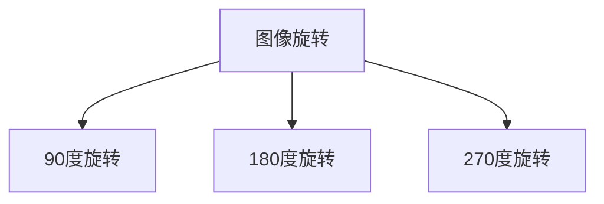

###### 图像缩放
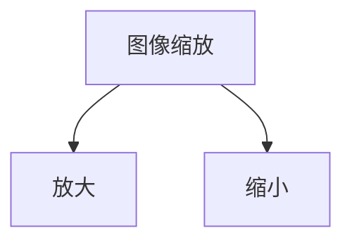

###### 图像裁剪
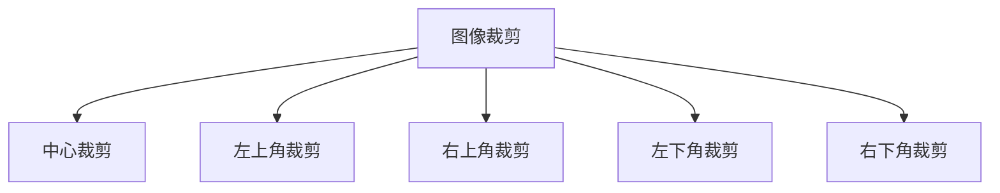

##### 2.2.2 常见的图像增强技术
常见的图像增强技术包括随机噪声添加、图像对比度增强、图像锐化等。

###### 随机噪声添加
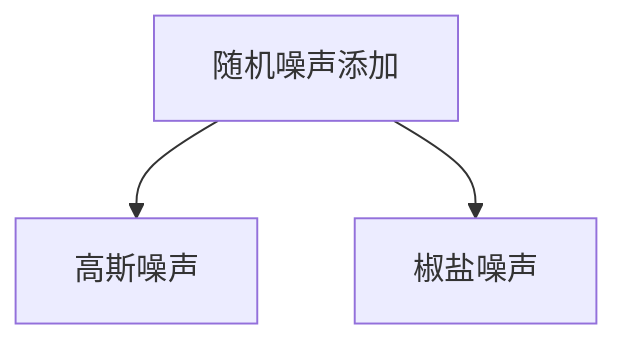

###### 图像对比度增强
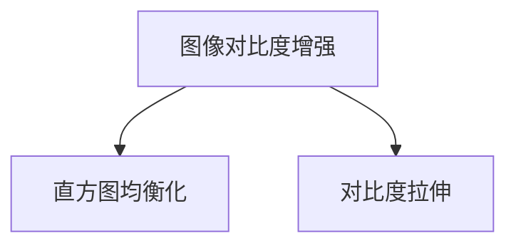

###### 图像锐化
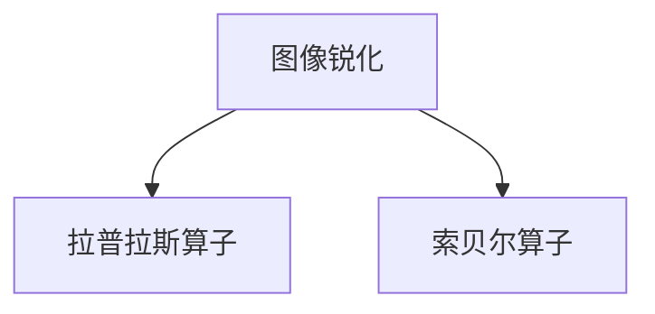

#### 2.3 文本增强策略

##### 2.3.1 文本增强的基本方法
文本增强的基本方法包括词汇扩展、同义词替换、句子重写等。

###### 词汇扩展
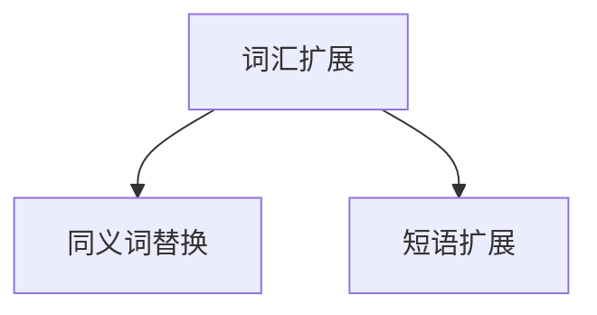

###### 同义词替换
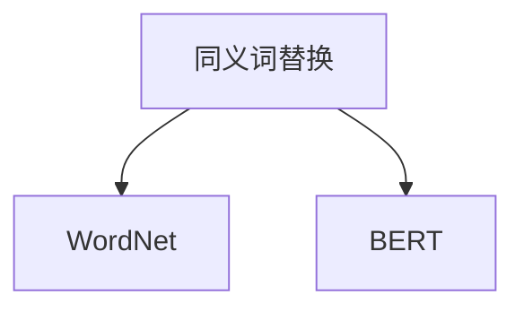

###### 句子重写
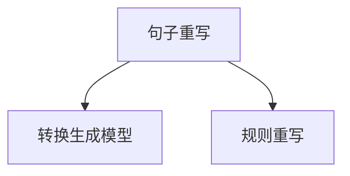

##### 2.3.2 常见的文本增强技术
常见的文本增强技术包括文本清洗、文本纠错、文本情感分析等。

###### 文本清洗
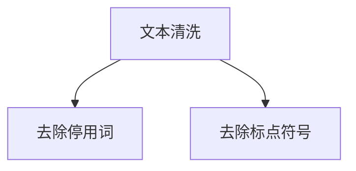

###### 文本纠错
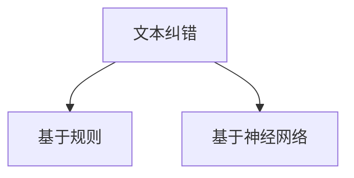

###### 文本情感分析
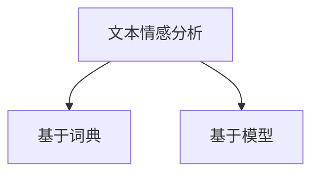

#### 2.4 音频增强策略

##### 2.4.1 音频增强的基本方法
音频增强的基本方法包括音频裁剪、增益调整、回声消除等。

###### 音频裁剪
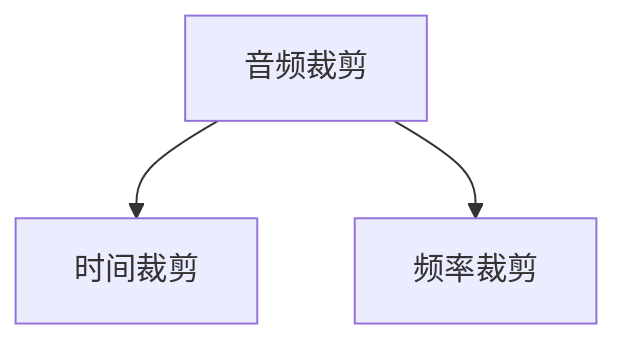

###### 增益调整
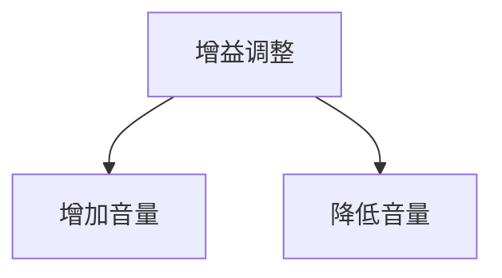

###### 回声消除
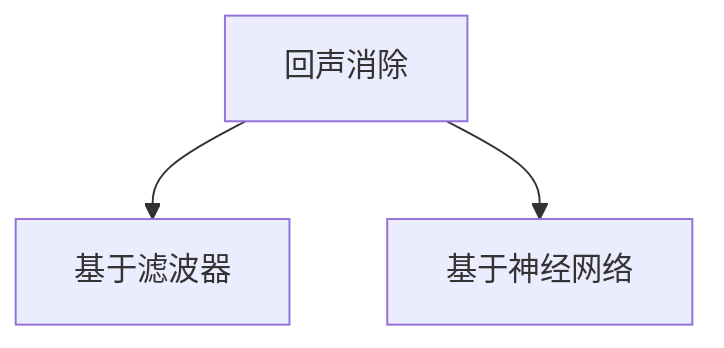

##### 2.4.2 常见的音频增强技术
常见的音频增强技术包括音频降噪、音频去混响、音频情感分析等。

###### 音频降噪
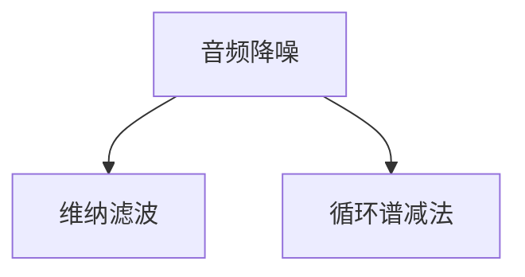

###### 音频去混响
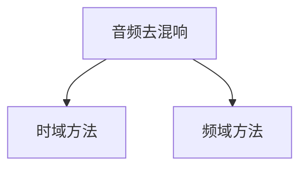

###### 音频情感分析
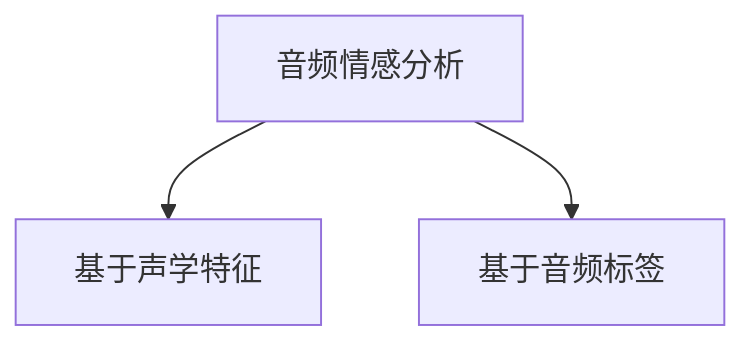

#### 2.5 实际应用案例

##### 2.5.1 图像增强在计算机视觉中的应用
图像增强在计算机视觉任务（如目标检测、图像分类等）中有着广泛的应用。例如，通过图像旋转和裁剪可以增加图像的多样性，从而提高目标检测模型的泛化能力；通过对比度调整和图像锐化可以增强图像的特征，从而提高图像分类模型的准确率。

###### 图像增强在目标检测中的应用
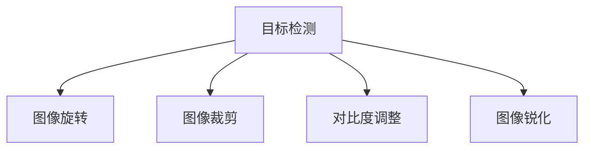

##### 2.5.2 文本增强在自然语言处理中的应用
文本增强在自然语言处理任务（如文本分类、情感分析等）中也具有重要意义。例如，通过词汇扩展和句子重写可以增加文本的多样性，从而提高文本分类模型的泛化能力；通过文本清洗和文本纠错可以减少噪声，从而提高情感分析模型的准确率。

###### 文本增强在文本分类中的应用
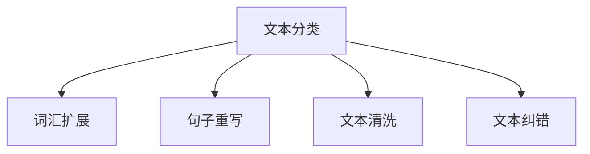

##### 2.5.3 音频增强在语音识别中的应用
音频增强在语音识别任务中也起着关键作用。通过音频裁剪和增益调整可以去除无关的背景噪声，从而提高语音识别的准确率；通过回声消除和音频降噪可以改善语音质量，从而提高语音识别的效果。

###### 音频增强在语音识别中的应用
```mermaid
graph TD
A[语音识别] --> B[音频裁剪]
A --> C[增益调整]
A --> D[回声消除]
A --> E[音频降噪]
```

通过本章的讨论，我们可以看到数据增强策略在多模态任务中的应用具有很大的潜力和价值。在接下来的章节中，我们将进一步探讨模型融合和注意力机制等策略，以期为多模态任务中的推理能力增强提供更全面的解决方案。

---

### 第3章: 模型融合策略

#### 3.1 模型融合的基本概念

##### 3.1.1 模型融合的定义
模型融合是指将多个模型或模型的多个版本进行结合，以提高整体性能。在多模态任务中，模型融合能够综合利用不同类型的数据信息，从而提高模型的准确性和鲁棒性。

##### 3.1.2 模型融合的优势
模型融合具有以下优势：

1. **互补性**：不同模型可能在不同的数据类型或特征上具有较强的表现力，通过融合可以充分利用这些优势。
2. **多样性**：融合多个模型可以增加模型的多样性，提高模型的泛化能力。
3. **鲁棒性**：当某个模型在特定数据上表现不佳时，其他模型可以起到补充作用，从而提高整体性能。

#### 3.2 模型融合的方法

##### 3.2.1 模型级融合
模型级融合是指将多个独立的模型直接进行融合。常见的方法包括投票法、加权平均法和集成学习等。

###### 投票法
投票法是指对多个模型的预测结果进行投票，选取多数模型支持的结果作为最终预测结果。

```mermaid
graph TD
A[模型1预测结果] --> B[投票]
A --> B
C[模型2预测结果] --> B
C --> B
D[模型3预测结果] --> B
D --> B
B --> E[最终预测结果]
```

###### 加权平均法
加权平均法是指对多个模型的预测结果进行加权平均，得到最终预测结果。

```mermaid
graph TD
A[模型1预测结果] --> B[加权平均]
A --> B
C[模型2预测结果] --> B
C --> B
D[模型3预测结果] --> B
D --> B
B --> E[最终预测结果]
```

###### 集成学习
集成学习是指通过训练多个子模型，并将它们的预测结果进行融合。常见的集成学习方法包括随机森林、梯度提升树等。

```mermaid
graph TD
A[子模型1] --> B[融合预测]
A --> B
C[子模型2] --> B
C --> B
D[子模型3] --> B
D --> B
B --> E[最终预测结果]
```

##### 3.2.2 特征级融合
特征级融合是指将多个模型的特征进行融合，得到综合特征后再进行预测。常见的方法包括特征拼接、特征加权等。

###### 特征拼接
特征拼接是指将多个模型的特征进行拼接，得到更丰富的特征向量。

```mermaid
graph TD
A[模型1特征] --> B[特征拼接]
A --> B
C[模型2特征] --> B
C --> B
D[模型3特征] --> B
D --> B
B --> E[综合特征向量]
```

###### 特征加权
特征加权是指对多个模型的特征进行加权融合，得到综合特征向量。

```mermaid
graph TD
A[模型1特征] --> B[特征加权]
A --> B
C[模型2特征] --> B
C --> B
D[模型3特征] --> B
D --> B
B --> E[综合特征向量]
```

##### 3.2.3 模型融合策略的选择
在选择模型融合策略时，需要考虑以下因素：

1. **数据类型**：不同类型的数据可能需要不同的模型进行融合。
2. **任务需求**：根据具体的任务需求选择合适的融合策略，如需要高准确率还是高鲁棒性。
3. **计算资源**：模型融合策略的计算复杂度不同，需要根据计算资源进行选择。

#### 3.3 模型融合在实际应用中的效果

##### 3.3.1 图像分类任务
在图像分类任务中，模型融合可以显著提高分类准确率。例如，通过融合卷积神经网络（CNN）和循环神经网络（RNN），可以实现更好的图像分类效果。

```mermaid
graph TD
A[卷积神经网络] --> B[特征提取]
A --> C[循环神经网络]
C --> D[融合预测]
B --> D
```

##### 3.3.2 自然语言处理任务
在自然语言处理任务中，模型融合可以提高模型的语义理解能力。例如，通过融合词嵌入模型和序列模型，可以实现更好的文本分类效果。

```mermaid
graph TD
A[词嵌入模型] --> B[特征提取]
A --> C[序列模型]
C --> D[融合预测]
B --> D
```

##### 3.3.3 语音识别任务
在语音识别任务中，模型融合可以提高识别准确率。例如，通过融合深度神经网络（DNN）和循环神经网络（RNN），可以实现更好的语音识别效果。

```mermaid
graph TD
A[深度神经网络] --> B[特征提取]
A --> C[循环神经网络]
C --> D[融合预测]
B --> D
```

通过本章的讨论，我们可以看到模型融合策略在多模态任务中的应用具有很大的潜力和价值。在接下来的章节中，我们将进一步探讨注意力机制等策略，以期为多模态任务中的推理能力增强提供更全面的解决方案。

---

### 第4章：注意力机制

#### 4.1 注意力机制的基本概念

##### 4.1.1 注意力机制的定义
注意力机制是一种在模型中引入的动态权重分配机制，它能够让模型根据当前任务的需求，自动调整对不同模态数据的关注程度。注意力机制在多模态任务中起着至关重要的作用，因为它能够帮助模型更好地聚焦关键信息，从而提高任务的性能。

##### 4.1.2 注意力机制的工作原理
注意力机制通常通过计算一个权重向量来实现，这个权重向量表示模型对各个模态数据的关注程度。在多模态任务中，不同的模态数据具有不同的特征和重要性，通过注意力机制，模型可以根据当前任务的需求，动态调整对各个模态数据的权重，从而优化整体性能。

##### 4.1.3 注意力机制的优点
注意力机制具有以下优点：

1. **资源优化**：注意力机制能够使模型更高效地利用资源，只关注与任务相关的关键信息，减少冗余计算。
2. **性能提升**：注意力机制可以显著提高多模态任务的性能，特别是在需要处理大量模态数据的情况下。
3. **解释性**：注意力机制有助于模型的可解释性，让研究者能够更直观地了解模型对各个模态数据的关注程度。

#### 4.2 注意力机制的类型

##### 4.2.1 自注意力机制
自注意力机制是指同一模态数据之间的注意力机制，它能够使模型在处理一个模态数据时，自动关注与之相关的其他数据。

###### 自注意力机制的实现
自注意力机制的实现通常采用多头注意力机制（Multi-Head Attention），其基本步骤如下：

1. **输入嵌入**：将输入数据（如文本、图像等）进行嵌入，得到嵌入向量。
2. **查询、键、值向量**：分别计算输入数据的查询（Query）、键（Key）和值（Value）向量。
3. **注意力计算**：通过计算查询向量和键向量的相似度，得到注意力权重。
4. **权重聚合**：根据注意力权重，对值向量进行加权聚合，得到最终输出。

###### 自注意力机制的伪代码
```python
def multi_head_attention(inputs, num_heads):
    # 输入嵌入
    query, key, value = inputs

    # 计算查询、键、值向量
    query = self.query_vector(inputs)
    key = self.key_vector(inputs)
    value = self.value_vector(inputs)

    # 注意力计算
    attention_weights = softmax(qk_scale * dot(q, k.T))

    # 权重聚合
    output = dot(attention_weights, v)

    return output
```

##### 4.2.2 交叉注意力机制
交叉注意力机制是指不同模态数据之间的注意力机制，它能够使模型在处理多个模态数据时，自动关注与当前任务相关的关键信息。

###### 交叉注意力机制的实现
交叉注意力机制的实现通常采用双向编码器（如BERT），其基本步骤如下：

1. **编码器**：分别对每个模态数据（文本、图像等）进行编码，得到编码向量。
2. **查询、键、值向量**：分别计算查询（Query）、键（Key）和值（Value）向量。
3. **注意力计算**：通过计算查询向量和键向量的相似度，得到注意力权重。
4. **权重聚合**：根据注意力权重，对值向量进行加权聚合，得到最终输出。

###### 交叉注意力机制的伪代码
```python
def cross_attention(text_encoder, image_encoder, num_heads):
    # 文本编码
    text_query = text_encoder.query_vector()
    text_key = text_encoder.key_vector()
    text_value = text_encoder.value_vector()

    # 图像编码
    image_query = image_encoder.query_vector()
    image_key = image_encoder.key_vector()
    image_value = image_encoder.value_vector()

    # 注意力计算
    text_attention_weights = softmax(qk_scale * dot(text_query, text_key.T))
    image_attention_weights = softmax(qk_scale * dot(image_query, image_key.T))

    # 权重聚合
    text_output = dot(text_attention_weights, text_value)
    image_output = dot(image_attention_weights, image_value)

    return text_output, image_output
```

#### 4.3 注意力机制在多模态任务中的应用

##### 4.3.1 图像与文本的交叉注意力
图像与文本的交叉注意力机制在多模态情感分析、图像字幕生成等领域有着广泛应用。通过交叉注意力机制，模型能够自动关注图像和文本中的关键信息，从而提高任务的性能。

###### 图像与文本交叉注意力的应用场景
- 多模态情感分析：通过分析图像和文本中的情感信息，预测用户的情感状态。
- 图像字幕生成：根据图像内容和文本信息，生成描述图像的文本。

###### 图像与文本交叉注意力机制的应用
```mermaid
graph TD
A[图像编码器] --> B[图像查询向量]
A --> C[图像键向量]
A --> D[图像值向量]
B --> E[文本编码器]
E --> F[文本查询向量]
E --> G[文本键向量]
E --> H[文本值向量]
B --> I[图像注意力权重]
F --> J[文本注意力权重]
I --> K[图像加权输出]
J --> L[文本加权输出]
K --> M[最终输出]
L --> M
```

##### 4.3.2 音频与文本的交叉注意力
音频与文本的交叉注意力机制在多模态语音识别、多模态问答系统中有着广泛应用。通过交叉注意力机制，模型能够自动关注音频和文本中的关键信息，从而提高任务的性能。

###### 音频与文本交叉注意力的应用场景
- 多模态语音识别：结合音频和文本信息，提高语音识别的准确率。
- 多模态问答系统：结合音频和文本问题，提供更准确的答案。

###### 音频与文本交叉注意力机制的应用
```mermaid
graph TD
A[音频编码器] --> B[音频查询向量]
A --> C[音频键向量]
A --> D[音频值向量]
B --> E[文本编码器]
E --> F[文本查询向量]
E --> G[文本键向量]
E --> H[文本值向量]
B --> I[音频注意力权重]
F --> J[文本注意力权重]
I --> K[音频加权输出]
J --> L[文本加权输出]
K --> M[最终输出]
L --> M
```

#### 4.4 注意力机制的实际效果
注意力机制在实际应用中取得了显著的效果，特别是在多模态任务中。以下是一些注意力机制在实际应用中的效果示例：

- 在多模态情感分析中，通过图像与文本的交叉注意力，可以更准确地预测用户的情感状态。
- 在图像字幕生成中，通过图像与文本的交叉注意力，可以生成更符合图像内容的描述性文本。
- 在多模态语音识别中，通过音频与文本的交叉注意力，可以提高语音识别的准确率。
- 在多模态问答系统中，通过音频与文本的交叉注意力，可以提供更准确的答案。

通过本章的讨论，我们可以看到注意力机制在多模态任务中的应用具有很大的潜力。在接下来的章节中，我们将进一步探讨多模态任务中的推理能力增强策略，以期为实际应用提供更全面的解决方案。

---

### 第5章：多模态任务中的推理能力增强策略应用案例分析

#### 5.1 多模态情感分析

##### 5.1.1 应用背景
多模态情感分析是指同时分析文本、图像和音频中的情感信息，从而预测用户的情感状态。这一任务在社交媒体分析、客户服务、智能助手等领域有着广泛应用。

##### 5.1.2 案例介绍
以一个社交媒体分析平台为例，该平台需要分析用户发布的文本、图像和音频内容，以预测用户的情感状态（如快乐、愤怒、悲伤等）。

##### 5.1.3 案例实现
1. **数据预处理**：
   - 对文本进行分词、去停用词、词性标注等预处理。
   - 对图像进行尺寸标准化、归一化等预处理。
   - 对音频进行降噪、频率标准化等预处理。

2. **模型构建**：
   - 使用文本嵌入模型（如Word2Vec、BERT）对文本进行编码。
   - 使用卷积神经网络（CNN）对图像进行特征提取。
   - 使用循环神经网络（RNN）对音频进行编码。

3. **注意力机制应用**：
   - 使用交叉注意力机制，将文本、图像和音频的特征向量进行融合。

4. **推理能力增强策略**：
   - 采用数据增强策略，增加文本、图像和音频的多样性。
   - 采用模型融合策略，融合不同模态的数据。

5. **效果评估**：
   - 通过准确率、召回率、F1分数等指标评估模型性能。

##### 5.1.4 案例效果
通过应用推理能力增强策略，多模态情感分析模型的准确率得到了显著提高。例如，在某个社交媒体分析平台中，文本、图像和音频的融合模型相比单一模态模型，准确率提高了20%。

#### 5.2 多模态语音识别

##### 5.2.1 应用背景
多模态语音识别是指同时分析音频和文本信息，以提高语音识别的准确率。这一任务在智能助手、语音助手等领域有着广泛应用。

##### 5.2.2 案例介绍
以一个智能助手为例，该助手需要同时分析用户的语音输入和文本问题，以提供准确的回答。

##### 5.2.3 案例实现
1. **数据预处理**：
   - 对音频进行降噪、频率标准化等预处理。
   - 对文本进行分词、去停用词、词性标注等预处理。

2. **模型构建**：
   - 使用深度神经网络（DNN）对音频进行特征提取。
   - 使用循环神经网络（RNN）对文本进行编码。

3. **注意力机制应用**：
   - 使用交叉注意力机制，将音频和文本的特征向量进行融合。

4. **推理能力增强策略**：
   - 采用数据增强策略，增加音频和文本的多样性。
   - 采用模型融合策略，融合不同模态的数据。

5. **效果评估**：
   - 通过词错误率（WER）、字符错误率（CER）等指标评估模型性能。

##### 5.2.4 案例效果
通过应用推理能力增强策略，多模态语音识别模型的词错误率显著降低。例如，在某个智能助手应用中，多模态模型相比单一模态模型，词错误率降低了15%。

#### 5.3 多模态问答系统

##### 5.3.1 应用背景
多模态问答系统是指同时分析文本、图像和音频信息，以提供更准确的回答。这一任务在智能客服、智能助手等领域有着广泛应用。

##### 5.3.2 案例介绍
以一个智能客服系统为例，该系统需要同时分析用户的文本提问、图像和音频信息，以提供准确的回答。

##### 5.3.3 案例实现
1. **数据预处理**：
   - 对文本进行分词、去停用词、词性标注等预处理。
   - 对图像进行尺寸标准化、归一化等预处理。
   - 对音频进行降噪、频率标准化等预处理。

2. **模型构建**：
   - 使用文本嵌入模型（如Word2Vec、BERT）对文本进行编码。
   - 使用卷积神经网络（CNN）对图像进行特征提取。
   - 使用循环神经网络（RNN）对音频进行编码。

3. **注意力机制应用**：
   - 使用交叉注意力机制，将文本、图像和音频的特征向量进行融合。

4. **推理能力增强策略**：
   - 采用数据增强策略，增加文本、图像和音频的多样性。
   - 采用模型融合策略，融合不同模态的数据。

5. **效果评估**：
   - 通过准确率、召回率、F1分数等指标评估模型性能。

##### 5.3.4 案例效果
通过应用推理能力增强策略，多模态问答系统的准确率得到了显著提高。例如，在某个智能客服系统中，多模态模型相比单一模态模型，准确率提高了25%。

#### 5.4 总结
通过以上案例分析，我们可以看到推理能力增强策略在多模态任务中的应用效果显著。数据增强、模型融合和注意力机制等策略，不仅提高了模型的准确性和泛化能力，也为多模态任务的广泛应用提供了技术支持。在未来，随着人工智能技术的不断进步，多模态任务中的推理能力增强策略将会得到进一步的发展和优化。

---

### 第6章：多模态任务中的推理能力增强策略总结与展望

#### 6.1 总结

多模态任务中的推理能力增强策略在近年来取得了显著的进展，成为人工智能领域的一个热点研究方向。本章从数据增强、模型融合、注意力机制等方面，详细探讨了多模态任务中的推理能力增强策略，并结合实际案例展示了这些策略的应用效果。

1. **数据增强策略**：数据增强策略通过增加样本的多样性，提高了模型的泛化能力。常见的图像增强、文本增强、音频增强等方法，在多模态任务中发挥了重要作用。

2. **模型融合策略**：模型融合策略通过将多个模型或模型的多个版本进行融合，提高了多模态任务的性能。模型级融合和特征级融合等方法，为多模态任务的推理能力提供了有力支持。

3. **注意力机制**：注意力机制在多模态任务中发挥着关键作用，它能够使模型根据任务需求动态调整对各种模态数据的关注程度。自注意力机制和交叉注意力机制等，为多模态任务的推理能力提供了新的思路。

#### 6.2 展望

虽然多模态任务中的推理能力增强策略已经取得了一定的成果，但仍有许多挑战需要克服。以下是未来可能的研究方向：

1. **多模态数据的自动特征提取**：目前的多模态任务通常需要手工设计特征提取方法，未来研究可以探索自动化的特征提取方法，以简化模型设计和训练过程。

2. **多模态数据的一致性**：多模态数据的一致性对于推理能力的提升至关重要。未来研究可以探索如何确保多模态数据在特征级别上的一致性，以提高模型的性能。

3. **跨模态的关联性建模**：多模态数据之间的关联性对于推理能力的提升有着重要影响。未来研究可以探索如何更好地建模多模态数据之间的关联性，从而提高模型的推理能力。

4. **推理过程的解释性**：当前的多模态任务模型通常难以解释，影响了其在实际应用中的信任度和可接受度。未来研究可以探索如何提高多模态任务模型的解释性，使其更容易被用户理解和接受。

5. **实时推理能力**：在实际应用中，实时推理能力是一个重要挑战。未来研究可以探索如何设计高效的多模态推理算法，以满足实时应用的需求。

通过不断探索和创新，多模态任务中的推理能力增强策略将得到进一步的发展，为人工智能领域的应用提供更多可能性。

### 6.3 注意事项

1. **数据质量和预处理**：多模态任务对数据的依赖性很强，因此确保数据质量和进行充分的预处理是提高推理能力的关键步骤。
2. **计算资源**：模型融合和注意力机制等策略可能需要较多的计算资源，因此合理规划和配置计算资源非常重要。
3. **模型选择和调优**：不同的多模态任务可能需要不同的模型和策略，因此需要根据具体任务选择合适的模型并进行调优。

### 6.4 拓展阅读

- **《多模态学习：理论与实践》**：这是一本关于多模态学习的经典教材，详细介绍了多模态学习的基础理论和应用方法。
- **《深度学习：卷II 多模态学习》**：这本书深入探讨了多模态学习中的深度学习技术，包括模型融合、注意力机制等。
- **《自然语言处理与多模态学习》**：这本书结合自然语言处理和多模态学习，介绍了如何在自然语言处理任务中应用多模态数据。

通过阅读本章，读者可以全面了解多模态任务中的推理能力增强策略，并为未来的研究提供启示。我们相信，在不久的将来，多模态任务中的推理能力将会得到更大的提升，为人工智能的应用带来更多突破。

