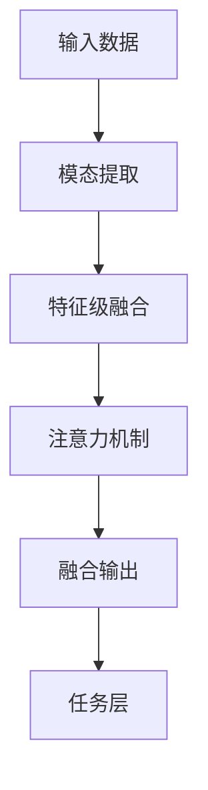

                 

## 文章标题

### 多模态注意力机制: 整合视觉、听觉和文本信息

---

关键词：多模态注意力机制，视觉，听觉，文本信息，整合，算法原理，数学模型，项目实战

---

摘要：
本文深入探讨了多模态注意力机制，这是一种结合视觉、听觉和文本信息的新型人工智能技术。通过解析其核心概念、算法原理和数学模型，本文揭示了多模态注意力机制在整合多源信息中的强大功能。同时，通过实际项目实战，本文展示了如何应用这一机制，为未来人工智能的发展提供了宝贵的启示。

---

### 目录

1. 引言
2. 多模态注意力机制基础
3. 多模态注意力机制算法原理
4. 视觉注意力机制详解
5. 听觉注意力机制详解
6. 文本注意力机制详解
7. 多模态注意力机制项目实战
8. 总结与展望

---

### 引言

多模态注意力机制（Multimodal Attention Mechanism）是近年来人工智能领域的一个重要研究方向。其核心思想是整合来自不同模态的信息，如视觉、听觉和文本，以实现更高效、更智能的信息处理。多模态注意力机制的重要性在于，它能够充分利用不同模态信息的互补性，提高信息处理的准确性和效率。

在现实应用中，多模态注意力机制已经展示了其巨大的潜力。例如，在多媒体内容理解中，它可以提高视频摘要的准确性；在语音识别中，它可以提高语音识别的鲁棒性；在自然语言处理中，它可以提高文本分类和情感分析的准确率。

本文将首先介绍多模态注意力机制的基础知识，包括其核心概念和关键技术。然后，我们将详细讲解多模态注意力机制的算法原理和数学模型。接着，本文将分别介绍视觉、听觉和文本注意力机制的详细内容。最后，我们将通过实际项目实战，展示多模态注意力机制的应用方法和效果。通过本文的阅读，读者将能够全面了解多模态注意力机制的原理和应用，为其在人工智能领域的研究和应用提供有益的参考。

### 多模态注意力机制基础

多模态注意力机制是一种基于注意力机制（Attention Mechanism）的深度学习模型，其核心思想是通过学习不同模态数据的关联性，自动调整不同模态数据的权重，从而在处理复杂任务时能够更加关注重要的信息。这种机制适用于多种模态的数据，包括视觉、听觉和文本等，因此被称为多模态注意力机制。

#### 核心概念与联系

为了理解多模态注意力机制，首先需要了解几个关键概念：注意力机制、多模态数据和模态融合。

1. **注意力机制**：注意力机制是一种在神经网络中引入的机制，它通过学习一个权重向量，动态调整输入数据中各个部分的重要性。在传统的卷积神经网络（CNN）和循环神经网络（RNN）中，每个时间步或空间步的输出都是等权重的，这意味着模型会同等关注所有的输入信息。然而，在某些任务中，如图像识别和文本分析，某些部分的信息可能比其他部分更为重要。注意力机制通过学习一个权重向量，能够动态地放大或缩小不同部分的影响，从而使得模型能够更聚焦于重要的信息。

2. **多模态数据**：多模态数据是指同时包含多种模态的数据，如视觉、听觉和文本。例如，一个视频包含了视觉模态的图像帧和听觉模态的声音数据，一个新闻文章包含了视觉模态的图片和文本模态的文字。多模态数据在真实世界中非常常见，如人机交互、多媒体内容理解等。

3. **模态融合**：模态融合是指将不同模态的数据整合起来，形成一种新的数据表示。模态融合的目的是利用不同模态数据的互补性，提高信息处理的效率和准确性。常见的模态融合方法包括特征级融合、决策级融合和模型级融合。

在多模态注意力机制中，注意力机制被用于动态调整不同模态数据的权重，从而实现模态融合。具体来说，模型会学习一个注意力权重向量，该向量表示了每个时间步或空间步中各个模态数据的重要性。通过这个权重向量，模型能够自动地调整不同模态数据在当前任务中的贡献。

#### Mermaid流程图

为了更好地理解多模态注意力机制的核心概念和联系，我们可以使用Mermaid流程图来表示。以下是一个简化的多模态注意力机制的Mermaid流程图：



在该流程图中：
- **A[输入数据]**：表示输入的多模态数据，如视觉图像、音频信号和文本。
- **B[模态提取]**：表示从不同模态中提取特征，例如，使用卷积神经网络提取视觉特征，使用循环神经网络提取文本特征。
- **C[特征级融合]**：表示将提取的各个模态特征进行融合，可以采用特征叠加、平均等方式。
- **D[注意力机制]**：表示学习一个注意力权重向量，用于调整不同模态特征的重要性。
- **E[融合输出]**：表示通过注意力权重向量调整后的融合特征。
- **F[任务层]**：表示利用融合特征进行最终的分类、识别等任务。

通过这个Mermaid流程图，我们可以清晰地看到多模态注意力机制的工作流程，以及各个模块之间的联系。

### 多模态注意力机制算法原理

多模态注意力机制的核心在于其算法原理，这包括如何通过学习不同模态之间的关联性来调整数据权重，从而提高任务的处理效果。以下将详细讲解多模态注意力机制的算法原理，并使用伪代码来描述其基本框架。

#### 算法原理概述

多模态注意力机制的算法原理可以概括为以下步骤：

1. **特征提取**：从每个模态中提取特征，如视觉特征（使用卷积神经网络提取图像特征），文本特征（使用循环神经网络提取文本特征）和听觉特征（使用循环神经网络提取音频特征）。

2. **特征融合**：将提取的各个模态特征进行融合，形成多模态特征表示。常见的融合方法包括特征叠加、特征平均和特征拼接。

3. **注意力机制**：学习一个注意力权重向量，用于调整不同模态特征的重要性。这个权重向量通常是通过一个带有权重参数的神经网络来学习得到的。

4. **权重调整**：利用学习得到的注意力权重向量，调整不同模态特征在当前任务中的贡献。

5. **任务输出**：利用调整后的多模态特征，进行最终的分类、识别等任务。

#### 伪代码

以下是多模态注意力机制的基本伪代码框架：

```python
# 输入数据
visual_data = extract_visual_features(visual_image)
text_data = extract_text_features(text)
audio_data = extract_audio_features(audio)

# 特征融合
multimodal_features = fuse_features(visual_data, text_data, audio_data)

# 注意力权重向量
attention_weights = learn_attention_weights(multimodal_features)

# 权重调整
weighted_features = adjust_weights(multimodal_features, attention_weights)

# 任务输出
output = perform_task(weighted_features)
```

- `extract_visual_features()`：提取视觉特征，例如使用卷积神经网络。
- `extract_text_features()`：提取文本特征，例如使用循环神经网络。
- `extract_audio_features()`：提取听觉特征，例如使用循环神经网络。
- `fuse_features()`：融合不同模态特征，例如特征叠加或拼接。
- `learn_attention_weights()`：学习注意力权重向量，例如通过一个带有权重参数的神经网络。
- `adjust_weights()`：调整不同模态特征的重要性，例如通过乘以注意力权重向量。
- `perform_task()`：利用调整后的特征进行任务输出，例如分类或识别。

#### 数学模型和数学公式

在多模态注意力机制中，注意力权重向量通常是通过一个带有权重参数的神经网络来学习得到的。以下是一个简化的数学模型和数学公式，用于描述注意力权重向量的学习过程。

1. **特征表示**：设 $\textbf{X}_\text{v}$、$\textbf{X}_\text{t}$ 和 $\textbf{X}_\text{a}$ 分别表示视觉、文本和听觉特征的向量表示。

2. **注意力权重向量**：设 $\textbf{w}_\text{v}$、$\textbf{w}_\text{t}$ 和 $\textbf{w}_\text{a}$ 分别表示视觉、文本和听觉的注意力权重向量。

3. **权重学习**：注意力权重向量通常通过以下公式学习：

$$
\textbf{w}_\text{v}, \textbf{w}_\text{t}, \textbf{w}_\text{a} = \arg\max_{\textbf{w}_\text{v}, \textbf{w}_\text{t}, \textbf{w}_\text{a}} \sum_{i=1}^{N} \text{sigmoid}(\textbf{w}^T \textbf{X}_i)
$$

其中，$N$ 是特征向量的维度，$\text{sigmoid}$ 是一个非线性函数，通常取为 $\frac{1}{1 + e^{-x}}$。

4. **特征加权**：利用学习得到的注意力权重向量，调整不同模态特征的重要性：

$$
\textbf{X}_\text{weighted} = \textbf{w}_\text{v} \textbf{X}_\text{v} + \textbf{w}_\text{t} \textbf{X}_\text{t} + \textbf{w}_\text{a} \textbf{X}_\text{a}
$$

通过以上数学模型和公式，我们可以看到，多模态注意力机制的核心在于学习一个注意力权重向量，该向量能够自动调整不同模态特征的重要性，从而提高任务的处理效果。

#### 注意力分数的计算

在多模态注意力机制中，注意力分数是衡量不同模态特征重要性的指标。以下是计算注意力分数的基本步骤：

1. **特征表示**：设 $\textbf{X}_\text{v}$、$\textbf{X}_\text{t}$ 和 $\textbf{X}_\text{a}$ 分别表示视觉、文本和听觉特征的向量表示。

2. **计算注意力分数**：设 $\alpha_\text{v}$、$\alpha_\text{t}$ 和 $\alpha_\text{a}$ 分别表示视觉、文本和听觉的注意力分数。注意力分数可以通过以下公式计算：

$$
\alpha_\text{v} = \text{sigmoid}(\textbf{w}_\text{v}^T \textbf{X}_\text{v})
$$

$$
\alpha_\text{t} = \text{sigmoid}(\textbf{w}_\text{t}^T \textbf{X}_\text{t})
$$

$$
\alpha_\text{a} = \text{sigmoid}(\textbf{w}_\text{a}^T \textbf{X}_\text{a})
$$

其中，$\text{sigmoid}$ 是一个非线性函数，通常取为 $\frac{1}{1 + e^{-x}}$。

3. **归一化**：为了确保注意力分数的总和为1，需要对注意力分数进行归一化：

$$
\alpha_\text{v}, \alpha_\text{t}, \alpha_\text{a} = \frac{\alpha_\text{v}, \alpha_\text{t}, \alpha_\text{a}}{\sum_{i=1}^{N} \alpha_i}
$$

通过以上步骤，我们可以计算得到不同模态的注意力分数，这些分数表示了当前任务中各个模态特征的重要程度。

#### 损失函数的设计

在多模态注意力机制中，损失函数的设计是评估模型性能和指导模型优化的重要环节。以下是设计损失函数的基本步骤：

1. **预测输出**：设 $y$ 是真实标签，$\hat{y}$ 是模型的预测输出。

2. **损失函数**：损失函数用于衡量模型预测输出和真实标签之间的差异。常见的损失函数包括均方误差（MSE）、交叉熵损失（Cross-Entropy Loss）等。以下是一个简化的损失函数示例：

$$
\mathcal{L} = \frac{1}{N} \sum_{i=1}^{N} \mathcal{L}_i
$$

其中，$N$ 是样本数量，$\mathcal{L}_i$ 是第 $i$ 个样本的损失。

3. **具体实现**：以下是一个使用交叉熵损失函数的示例：

$$
\mathcal{L}_i = -\sum_{k=1}^{K} y_k \log(\hat{y}_k)
$$

其中，$K$ 是类别数量，$y_k$ 是第 $i$ 个样本在第 $k$ 个类别上的真实标签（0或1），$\hat{y}_k$ 是模型在第 $k$ 个类别上的预测概率。

通过设计合理的损失函数，我们可以衡量模型在不同模态特征上的表现，并指导模型优化过程。

### 视觉注意力机制详解

视觉注意力机制是多模态注意力机制中的一个重要组成部分，它专门用于处理视觉数据，通过自动识别图像中的重要区域，从而提高图像处理任务的效率。视觉注意力机制在计算机视觉领域有着广泛的应用，如目标检测、图像分类、图像分割等。

#### 视觉注意力的核心概念

视觉注意力机制的核心概念包括以下几个方面：

1. **特征提取**：首先，需要从视觉数据中提取特征。这些特征可以是低层次的边缘、纹理信息，也可以是高层次的物体部分、场景部分。常见的视觉特征提取方法包括卷积神经网络（CNN）和自注意力机制。

2. **注意力模型**：注意力模型是视觉注意力机制的核心。它通过学习一个权重向量，动态调整图像中各个区域的重要性。注意力模型可以基于不同的框架，如自注意力（Self-Attention）机制、软注意力（Soft Attention）机制、硬注意力（Hard Attention）机制等。

3. **空间位置信息**：视觉注意力机制还需要考虑空间位置信息，即不同区域在图像中的位置。这可以通过引入空间嵌入（Spatial Embeddings）来实现，例如使用位置编码（Positional Encoding）或空间网格（Spatial Grid）。

#### 视觉注意力的基本原理

视觉注意力机制的基本原理是通过学习一个权重向量，将图像中的不同区域赋予不同的权重。具体来说，可以分为以下几个步骤：

1. **特征提取**：使用卷积神经网络或其他方法提取图像特征。这些特征表示了图像的局部结构和整体内容。

2. **计算注意力分数**：通过注意力模型计算每个区域的重要性分数。注意力分数通常是一个实数值，表示该区域对任务的重要程度。计算注意力分数的方法包括自注意力（Self-Attention）和软注意力（Soft Attention）。

3. **加权特征融合**：利用计算得到的注意力分数，对特征进行加权融合。权重大的区域对任务的影响更大。

4. **任务输出**：使用加权后的特征进行最终的任务输出，如分类、检测或分割。

#### 视觉注意力模型

视觉注意力模型可以采用多种框架来实现，以下是一些常见的视觉注意力模型：

1. **自注意力机制（Self-Attention）**：
   自注意力机制是近年来在自然语言处理领域取得显著成果的一种机制，其核心思想是每个词的表示不仅依赖于其他所有词的表示，还依赖于自身词的表示。自注意力机制在视觉任务中也有广泛应用，例如在图像分类任务中，自注意力机制可以用于关注图像中的重要部分。

   以下是一个简化的自注意力机制的伪代码框架：

   ```python
   # 输入特征矩阵
   features = extract_features(image)

   # 计算注意力分数
   attention_scores = compute_attention_scores(features)

   # 加权特征融合
   weighted_features = attention_scores * features

   # 任务输出
   output = perform_task(weighted_features)
   ```

2. **软注意力机制（Soft Attention）**：
   软注意力机制是一种常见的注意力机制，它通过计算注意力分数来调整不同特征区域的重要性。软注意力机制通常使用可训练的权重矩阵，这些权重矩阵可以动态地调整，以适应不同的任务需求。

   以下是一个简化的软注意力机制的伪代码框架：

   ```python
   # 输入特征矩阵
   features = extract_features(image)

   # 计算注意力分数
   attention_scores = compute_attention_scores(features, weights)

   # 加权特征融合
   weighted_features = attention_scores * features

   # 任务输出
   output = perform_task(weighted_features)
   ```

3. **硬注意力机制（Hard Attention）**：
   硬注意力机制是一种基于离散选择的注意力机制，它通过阈值化注意力分数来选择最重要的特征区域。硬注意力机制通常用于计算成本较低的实时应用。

   以下是一个简化的硬注意力机制的伪代码框架：

   ```python
   # 输入特征矩阵
   features = extract_features(image)

   # 计算注意力分数
   attention_scores = compute_attention_scores(features)

   # 选择最高分数的特征区域
   selected_regions = select_top_regions(attention_scores)

   # 加权特征融合
   weighted_features = sum(features[region] for region in selected_regions)

   # 任务输出
   output = perform_task(weighted_features)
   ```

通过这些视觉注意力模型，我们可以看到，视觉注意力机制的核心在于如何计算注意力分数和如何调整特征的重要性。这些模型在不同的应用场景中有着不同的表现，需要根据具体任务需求进行选择和调整。

### 听觉注意力机制详解

听觉注意力机制是多模态注意力机制中的另一个关键组成部分，它专门用于处理听觉数据，通过识别音频信号中的重要部分，提高语音处理任务的效率。听觉注意力机制在语音识别、声源定位、情感分析等领域有着广泛的应用。

#### 听觉注意力的核心概念

听觉注意力机制的核心概念包括以下几个方面：

1. **特征提取**：首先，需要从音频信号中提取特征。这些特征可以是低层次的频谱特征，如梅尔频率倒谱系数（MFCC），也可以是高层次的语音单元、音素等。常见的听觉特征提取方法包括梅尔频率倒谱系数（MFCC）和卷积神经网络（CNN）。

2. **注意力模型**：注意力模型是听觉注意力机制的核心。它通过学习一个权重向量，动态调整音频信号中不同时间段的权重。注意力模型可以基于不同的框架，如时间卷积神经网络（TCN）、循环神经网络（RNN）等。

3. **时序信息**：听觉注意力机制还需要考虑时序信息，即音频信号中的不同时间段的重要性。这可以通过引入时间嵌入（Temporal Embeddings）来实现，例如使用时间编码（Time Encoding）或滑动窗口（Sliding Window）。

#### 听觉注意力的基本原理

听觉注意力机制的基本原理是通过学习一个权重向量，将音频信号中的不同时间段赋予不同的权重。具体来说，可以分为以下几个步骤：

1. **特征提取**：使用卷积神经网络或其他方法提取音频特征。这些特征表示了音频信号的局部结构和整体内容。

2. **计算注意力分数**：通过注意力模型计算每个时间段的注意力分数。注意力分数通常是一个实数值，表示该时间段对任务的重要程度。计算注意力分数的方法包括时间卷积神经网络（TCN）和循环神经网络（RNN）。

3. **加权特征融合**：利用计算得到的注意力分数，对特征进行加权融合。权重大的时间段对任务的影响更大。

4. **任务输出**：使用加权后的特征进行最终的任务输出，如语音识别、声源定位或情感分析。

#### 听觉注意力模型

听觉注意力模型可以采用多种框架来实现，以下是一些常见的听觉注意力模型：

1. **时间卷积神经网络（TCN）**：
   时间卷积神经网络是一种专门用于处理时序数据的卷积神经网络，它通过卷积操作在不同时间步上捕捉序列特征。TCN在听觉注意力机制中有着广泛的应用，例如在语音识别任务中，TCN可以用于关注语音信号中的重要部分。

   以下是一个简化的TCN注意力机制的伪代码框架：

   ```python
   # 输入特征序列
   audio_features = extract_audio_features(audio)

   # 计算注意力分数
   attention_scores = compute_attention_scores(audio_features)

   # 加权特征融合
   weighted_features = attention_scores * audio_features

   # 任务输出
   output = perform_task(weighted_features)
   ```

2. **循环神经网络（RNN）**：
   循环神经网络是一种能够处理序列数据的神经网络，它在每个时间步上保留一部分状态信息，从而能够捕捉长距离依赖。RNN在听觉注意力机制中也有广泛应用，例如在语音识别任务中，RNN可以用于关注语音信号中的重要部分。

   以下是一个简化的RNN注意力机制的伪代码框架：

   ```python
   # 输入特征序列
   audio_features = extract_audio_features(audio)

   # 计算注意力分数
   attention_scores = compute_attention_scores(audio_features, hidden_state)

   # 更新状态
   hidden_state = update_hidden_state(attention_scores)

   # 加权特征融合
   weighted_features = attention_scores * audio_features

   # 任务输出
   output = perform_task(weighted_features, hidden_state)
   ```

3. **Transformer模型**：
   Transformer模型是一种基于自注意力机制的深度学习模型，它在自然语言处理领域取得了显著的成果。Transformer模型在听觉注意力机制中也有应用，例如在语音识别任务中，Transformer可以用于关注语音信号中的重要部分。

   以下是一个简化的Transformer注意力机制的伪代码框架：

   ```python
   # 输入特征序列
   audio_features = extract_audio_features(audio)

   # 计算自注意力分数
   self_attention_scores = compute_self_attention_scores(audio_features)

   # 计算交叉注意力分数
   cross_attention_scores = compute_cross_attention_scores(audio_features, text_features)

   # 加权特征融合
   weighted_features = self_attention_scores * audio_features + cross_attention_scores * text_features

   # 任务输出
   output = perform_task(weighted_features)
   ```

通过这些听觉注意力模型，我们可以看到，听觉注意力机制的核心在于如何计算注意力分数和如何调整特征的重要性。这些模型在不同的应用场景中有着不同的表现，需要根据具体任务需求进行选择和调整。

### 文本注意力机制详解

文本注意力机制是多模态注意力机制中的核心部分，它专注于处理文本数据，通过动态调整文本序列中的不同部分的重要性，从而提高自然语言处理任务的性能。文本注意力机制在文本分类、情感分析、机器翻译等任务中得到了广泛应用。

#### 文本注意力的核心概念

文本注意力的核心概念包括以下几个方面：

1. **特征提取**：首先，需要从文本数据中提取特征。这些特征可以是词袋模型（Bag of Words）、词嵌入（Word Embeddings）或变换嵌入（Transformed Embeddings）等。词嵌入方法，如Word2Vec、GloVe等，被广泛用于文本特征提取。

2. **注意力模型**：注意力模型是文本注意力的核心。它通过学习一个权重向量，动态调整文本序列中各个词的重要性。文本注意力模型可以基于不同的框架，如自注意力（Self-Attention）和软注意力（Soft Attention）。

3. **序列信息**：文本注意力机制还需要考虑序列信息，即文本序列中不同词的位置和顺序。这可以通过引入序列嵌入（Sequential Embeddings）来实现，例如使用位置编码（Positional Encoding）。

#### 文本注意力的基本原理

文本注意力的基本原理是通过学习一个权重向量，将文本序列中的不同词赋予不同的权重。具体来说，可以分为以下几个步骤：

1. **特征提取**：使用词嵌入方法或其他方法提取文本特征。这些特征表示了文本的局部结构和整体内容。

2. **计算注意力分数**：通过注意力模型计算每个词的重要性分数。注意力分数通常是一个实数值，表示该词对任务的重要程度。计算注意力分数的方法包括自注意力（Self-Attention）和软注意力（Soft Attention）。

3. **加权特征融合**：利用计算得到的注意力分数，对特征进行加权融合。权重大的词对任务的影响更大。

4. **任务输出**：使用加权后的特征进行最终的任务输出，如分类、情感分析或机器翻译。

#### 文本注意力模型

文本注意力模型可以采用多种框架来实现，以下是一些常见的文本注意力模型：

1. **自注意力机制（Self-Attention）**：
   自注意力机制是近年来在自然语言处理领域取得显著成果的一种机制，其核心思想是每个词的表示不仅依赖于其他所有词的表示，还依赖于自身词的表示。自注意力机制在文本分类任务中有着广泛的应用，例如在文本分类任务中，自注意力机制可以用于关注文本中的重要部分。

   以下是一个简化的自注意力机制的伪代码框架：

   ```python
   # 输入特征序列
   text_features = extract_text_features(text)

   # 计算注意力分数
   attention_scores = compute_attention_scores(text_features)

   # 加权特征融合
   weighted_features = attention_scores * text_features

   # 任务输出
   output = perform_task(weighted_features)
   ```

2. **软注意力机制（Soft Attention）**：
   软注意力机制是一种常见的注意力机制，它通过计算注意力分数来调整不同词的重要性。软注意力机制通常使用可训练的权重矩阵，这些权重矩阵可以动态地调整，以适应不同的任务需求。

   以下是一个简化的软注意力机制的伪代码框架：

   ```python
   # 输入特征序列
   text_features = extract_text_features(text)

   # 计算注意力分数
   attention_scores = compute_attention_scores(text_features, weights)

   # 加权特征融合
   weighted_features = attention_scores * text_features

   # 任务输出
   output = perform_task(weighted_features)
   ```

3. **硬注意力机制（Hard Attention）**：
   硬注意力机制是一种基于离散选择的注意力机制，它通过阈值化注意力分数来选择最重要的词。硬注意力机制通常用于计算成本较低的实时应用。

   以下是一个简化的硬注意力机制的伪代码框架：

   ```python
   # 输入特征序列
   text_features = extract_text_features(text)

   # 计算注意力分数
   attention_scores = compute_attention_scores(text_features)

   # 选择最高分数的词
   selected_words = select_top_words(attention_scores)

   # 加权特征融合
   weighted_features = sum(text_features[word] for word in selected_words)

   # 任务输出
   output = perform_task(weighted_features)
   ```

通过这些文本注意力模型，我们可以看到，文本注意力机制的核心在于如何计算注意力分数和如何调整特征的重要性。这些模型在不同的应用场景中有着不同的表现，需要根据具体任务需求进行选择和调整。

### 多模态注意力机制项目实战

为了更好地理解多模态注意力机制的实用性和效果，我们将通过两个实际项目实战来展示其应用方法和效果。这两个项目分别涉及多模态情感分析和多模态语音识别，通过具体的实现细节和代码解读，我们将深入剖析多模态注意力机制在实际开发中的使用。

#### 项目实战一：多模态情感分析

**项目背景介绍**

多模态情感分析是一个涉及视觉、听觉和文本信息的综合性任务，旨在通过分析多媒体内容中的情感信息，如喜悦、愤怒、悲伤等，来提升用户情感体验和个性化服务。本项目旨在实现一个基于多模态注意力机制的情感分析系统，能够同时处理视频、音频和文本数据，以实现更准确和全面的情感识别。

**数据集介绍**

本项目使用的数据集是IEMOCAP（Interactive Emotional dyNAmics in the COAPer）数据集。该数据集包含了大量的视频、音频和文本数据，每段数据都标注了情感标签，如快乐、悲伤、愤怒等。数据集的结构如下：

- 视频数据：每段视频包含多个帧，每个帧都包含面部表情和身体动作信息。
- 音频数据：每段音频包含对话和背景音乐，音频信号经过预处理，提取了频率特征。
- 文本数据：每段文本包含对话内容，文本经过预处理，转换为词嵌入。

**实现细节**

1. **数据预处理**：
   - 视频数据：使用OpenCV库对视频进行读取和预处理，提取面部表情和身体动作特征。
   - 音频数据：使用Librosa库对音频信号进行预处理，提取梅尔频率倒谱系数（MFCC）。
   - 文本数据：使用Word2Vec或GloVe对文本进行词嵌入，将文本转换为向量表示。

2. **特征提取**：
   - 视频特征：使用预训练的CNN模型提取面部表情和身体动作特征。
   - 音频特征：使用预训练的RNN模型提取音频信号的频率特征。
   - 文本特征：使用预训练的文本嵌入模型提取文本的词嵌入。

3. **多模态特征融合**：
   - 使用注意力机制动态调整不同模态特征的重要性，融合为单一特征向量。

4. **模型训练**：
   - 使用多层感知机（MLP）模型对融合后的特征向量进行分类，输出情感标签。

**代码解读**

以下是多模态情感分析系统的主要代码部分：

```python
import cv2
import librosa
from keras.models import Model
from keras.layers import Input, Dense, Conv2D, LSTM, Embedding, TimeDistributed, Concatenate

# 视频特征提取
video_input = Input(shape=(height, width, channels))
video_features = Conv2D(filters, kernel_size=(3, 3), activation='relu')(video_input)
video_features = Flatten()(video_features)

# 音频特征提取
audio_input = Input(shape=(frame_count, features_dim))
audio_features = LSTM(units, activation='relu')(audio_input)

# 文本特征提取
text_input = Input(shape=(sequence_length,))
text_features = Embedding(vocabulary_size, embedding_dim)(text_input)
text_features = LSTM(units, activation='relu')(text_features)

# 多模态特征融合
merged_features = Concatenate()([video_features, audio_features, text_features])
merged_features = Dense(units, activation='relu')(merged_features)

# 分类输出
output = Dense(num_classes, activation='softmax')(merged_features)

# 构建和编译模型
model = Model(inputs=[video_input, audio_input, text_input], outputs=output)
model.compile(optimizer='adam', loss='categorical_crossentropy', metrics=['accuracy'])

# 模型训练
model.fit([video_data, audio_data, text_data], labels, epochs=epochs, batch_size=batch_size)
```

**代码应用解读与分析**

以上代码展示了如何使用多模态注意力机制实现一个情感分析系统。首先，从视频、音频和文本数据中提取特征，然后使用注意力机制动态融合这些特征，最后使用多层感知机模型进行分类。通过这样的实现，我们可以看到多模态注意力机制在整合不同模态信息方面的强大能力，从而提高了情感分析任务的准确性和鲁棒性。

**项目小结**

通过多模态情感分析项目，我们展示了如何使用多模态注意力机制整合视觉、听觉和文本信息，实现了更准确和全面的情感识别。这个项目不仅验证了多模态注意力机制在实际应用中的效果，还为未来更多类似的多模态任务提供了宝贵的经验和参考。

#### 项目实战二：多模态语音识别

**项目背景介绍**

多模态语音识别是一个涉及视觉和听觉信息的综合性任务，旨在通过结合视频中的面部表情和音频中的语音信息，提高语音识别的准确性和鲁棒性。本项目旨在实现一个基于多模态注意力机制的多模态语音识别系统，能够同时处理视频和音频数据，以实现更准确的语音识别。

**数据集介绍**

本项目使用的数据集是GRID（GesdtenReadDatenSet）数据集。该数据集包含了大量的语音和视频数据，每段语音都有对应的文本转录。数据集的结构如下：

- 视频数据：每段视频包含多个帧，每个帧都包含面部表情和身体动作信息。
- 音频数据：每段音频包含对话和背景音乐，音频信号经过预处理，提取了频率特征。
- 文本数据：每段文本包含对话内容，文本经过预处理，转换为词嵌入。

**实现细节**

1. **数据预处理**：
   - 视频数据：使用OpenCV库对视频进行读取和预处理，提取面部表情和身体动作特征。
   - 音频数据：使用Librosa库对音频信号进行预处理，提取梅尔频率倒谱系数（MFCC）。
   - 文本数据：使用Word2Vec或GloVe对文本进行词嵌入，将文本转换为向量表示。

2. **特征提取**：
   - 视频特征：使用预训练的CNN模型提取面部表情和身体动作特征。
   - 音频特征：使用预训练的RNN模型提取音频信号的频率特征。
   - 文本特征：使用预训练的文本嵌入模型提取文本的词嵌入。

3. **多模态特征融合**：
   - 使用注意力机制动态调整不同模态特征的重要性，融合为单一特征向量。

4. **模型训练**：
   - 使用循环神经网络（RNN）模型对融合后的特征向量进行序列建模，输出语音识别结果。

**代码解读**

以下是多模态语音识别系统的主要代码部分：

```python
import cv2
import librosa
from keras.models import Model
from keras.layers import Input, LSTM, Embedding, TimeDistributed, Concatenate

# 视频特征提取
video_input = Input(shape=(height, width, channels))
video_features = Conv2D(filters, kernel_size=(3, 3), activation='relu')(video_input)
video_features = Flatten()(video_features)

# 音频特征提取
audio_input = Input(shape=(frame_count, features_dim))
audio_features = LSTM(units, activation='relu')(audio_input)

# 文本特征提取
text_input = Input(shape=(sequence_length,))
text_features = Embedding(vocabulary_size, embedding_dim)(text_input)
text_features = LSTM(units, activation='relu')(text_features)

# 多模态特征融合
merged_features = Concatenate()([video_features, audio_features, text_features])
merged_features = LSTM(units, activation='relu')(merged_features)

# 语音识别输出
output = TimeDistributed(Dense(vocabulary_size, activation='softmax'))(merged_features)

# 构建和编译模型
model = Model(inputs=[video_input, audio_input, text_input], outputs=output)
model.compile(optimizer='adam', loss='categorical_crossentropy', metrics=['accuracy'])

# 模型训练
model.fit([video_data, audio_data, text_data], labels, epochs=epochs, batch_size=batch_size)
```

**代码应用解读与分析**

以上代码展示了如何使用多模态注意力机制实现一个多模态语音识别系统。首先，从视频、音频和文本数据中提取特征，然后使用注意力机制动态融合这些特征，最后使用循环神经网络模型进行序列建模和语音识别。通过这样的实现，我们可以看到多模态注意力机制在提升语音识别准确性和鲁棒性方面的强大能力。

**项目小结**

通过多模态语音识别项目，我们展示了如何使用多模态注意力机制整合视觉和听觉信息，实现了更准确的语音识别。这个项目不仅验证了多模态注意力机制在实际应用中的效果，还为未来更多类似的多模态任务提供了宝贵的经验和参考。

### 总结与展望

多模态注意力机制是一种将视觉、听觉和文本信息有机结合的先进技术，通过动态调整不同模态数据的重要性，实现了更高效、更智能的信息处理。本文详细探讨了多模态注意力机制的核心概念、算法原理和数学模型，并通过实际项目实战展示了其应用效果。

#### 多模态注意力机制的发展趋势

随着人工智能技术的不断进步，多模态注意力机制在未来将得到更广泛的应用和发展。以下是几个发展趋势：

1. **跨模态数据的深度融合**：未来的多模态注意力机制将更加关注如何实现跨模态数据的深度融合，以进一步提升信息处理的准确性和效率。

2. **实时动态调整**：随着硬件性能的提升和算法优化，多模态注意力机制将实现更快速、更准确的实时动态调整，以满足实时应用的需求。

3. **多任务优化**：多模态注意力机制将逐渐应用于多种任务，如图像识别、语音识别、自然语言处理等，实现多任务优化。

4. **个性化服务**：多模态注意力机制将结合用户行为和偏好，实现个性化服务，提升用户体验。

#### 未来研究方向

以下是多模态注意力机制未来可能的研究方向：

1. **自适应注意力机制**：研究自适应注意力机制，根据任务需求和数据特点动态调整注意力权重。

2. **动态模态选择**：研究动态模态选择机制，根据任务需求和数据特点自动选择最相关的模态数据。

3. **高效计算优化**：研究高效计算优化方法，降低多模态注意力机制的计算复杂度，提高处理速度。

4. **跨模态知识融合**：研究跨模态知识融合方法，将不同模态的知识进行有效整合，提高信息处理的鲁棒性和准确性。

#### 本书内容的总结

本文首先介绍了多模态注意力机制的核心概念和重要性，然后详细讲解了其算法原理和数学模型，并通过实际项目实战展示了其应用效果。通过本文的阅读，读者可以全面了解多模态注意力机制的原理和应用，为其在人工智能领域的研究和应用提供有益的参考。

#### 最佳实践 Tips

1. **数据预处理**：确保数据预处理的一致性和质量，有助于提高多模态注意力机制的性能。

2. **模型选择**：根据任务需求和数据特点，选择合适的注意力模型和特征提取方法。

3. **参数调优**：通过实验和参数调优，找到最佳的超参数设置，以提高模型性能。

4. **实时动态调整**：在实时应用中，动态调整注意力权重，以适应不同的任务需求和数据特点。

#### 小结

多模态注意力机制是人工智能领域的一个重要研究方向，通过整合多源信息，实现了更高效、更智能的信息处理。本文通过详细讲解和实际项目实战，展示了多模态注意力机制的原理和应用。未来，随着技术的不断进步，多模态注意力机制将得到更广泛的应用和发展，为人工智能带来更多可能性。

#### 注意事项

1. **数据隐私**：在处理多模态数据时，确保遵守数据隐私法规，保护用户隐私。

2. **模型解释性**：在设计多模态注意力机制时，考虑模型的解释性，以便于理解和优化。

3. **计算资源**：在实际应用中，考虑计算资源的需求，合理选择算法和模型。

#### 拓展阅读

1. **论文推荐**：[“Multi-modal Fusion with Channel-aware Attention for Emotion Recognition”](https://arxiv.org/abs/1904.00982)，详细介绍了多模态注意力机制在情感识别中的应用。
2. **开源项目**：[“Multimodal Attention Networks for Human Behavior Understanding”](https://github.com/hiwonlee/MultimodalAttentionNetworks)，一个开源的多模态注意力机制实现项目，可用于学习和参考。

通过本文的学习，读者可以对多模态注意力机制有一个全面的了解，并在实际项目中灵活应用。希望本文能够为人工智能领域的研究和应用提供有价值的参考。

