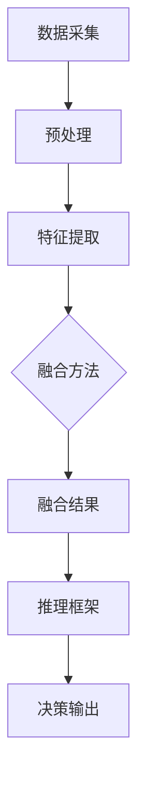

                 


### 文章标题

# 多模态融合推理在环境感知决策中的创新

### 文章关键词

- 多模态融合
- 环境感知
- 决策支持
- 人工智能
- 数据特征提取
- 神经网络

### 文章摘要

本文旨在探讨多模态融合推理在环境感知决策中的创新应用。首先，我们将介绍多模态融合的基本概念及其在环境感知中的重要性。接着，我们将深入探讨核心算法原理，包括特征提取、融合方法和推理框架。随后，通过数学模型和公式解析，我们将帮助读者更好地理解这些算法。在项目实战部分，我们将分享实际案例，展示多模态融合推理如何在真实环境中发挥作用。最后，我们将分析当前技术趋势与挑战，并对未来发展方向进行展望。通过本文的阅读，读者将全面了解多模态融合推理的技术原理、应用实践和未来发展。

## 引言

在当今快速发展的信息技术时代，环境感知和决策支持已成为许多领域的关键需求。从智能驾驶到智能家居，从智能监控到智能制造，环境感知技术在提升系统智能化水平方面发挥了至关重要的作用。然而，随着环境复杂度的增加，单一感知模态的局限性逐渐显现，无法满足日益复杂的决策需求。因此，多模态融合推理作为一种新兴技术，正逐渐成为环境感知和决策支持领域的研究热点。

### 多模态融合的定义与重要性

多模态融合是指将来自不同感知模态（如视觉、声音、触觉等）的数据进行综合处理，以获得更加全面、准确的信息。这一技术的重要性在于：

1. **提高感知精度**：通过融合多种感知数据，可以弥补单一感知模态的不足，提高系统的感知精度和可靠性。
2. **增强决策能力**：多模态融合可以为决策支持系统提供更加丰富的信息来源，从而提高决策的准确性和效率。
3. **拓宽应用领域**：多模态融合技术可以应用于多种领域，如医疗诊断、智能交通、机器人等，具有广泛的应用前景。

### 环境感知与决策支持

环境感知是指通过传感器或其他方式获取环境信息的过程，这些信息包括视觉、声音、温度、湿度等。决策支持则是在获取环境信息的基础上，利用这些信息进行判断和决策。环境感知和决策支持的关系可以概括为：

1. **数据输入**：环境感知系统通过传感器获取环境数据，这些数据是决策支持的基础。
2. **信息处理**：多模态融合技术将不同模态的数据进行综合处理，提取有用的信息。
3. **决策输出**：基于处理后的信息，决策支持系统做出相应的决策，指导实际操作。

总之，多模态融合推理在环境感知决策中具有至关重要的地位。它不仅提升了系统的感知精度和决策能力，还为未来技术发展提供了新的思路和方向。在接下来的章节中，我们将详细探讨多模态融合推理的核心算法原理、数学模型和实际应用案例，以帮助读者全面了解这一技术。

## 多模态融合的核心概念与联系

在深入探讨多模态融合推理之前，我们需要了解其核心概念和组成部分。多模态融合涉及多个感知模态的数据采集、处理和融合，以实现更准确的环境感知和智能决策。以下是对多模态融合中关键概念的介绍及其相互联系的分析。

### 感知模态

感知模态是指用于获取环境信息的不同类型。常见的感知模态包括：

1. **视觉模态**：通过摄像头或传感器捕获图像和视频数据，用于识别物体、场景和运动。
2. **声音模态**：通过麦克风捕捉声音信号，用于识别声音源、语音内容和环境声音特征。
3. **触觉模态**：通过触觉传感器捕获物体的表面特征、硬度和温度等信息。
4. **位置模态**：通过GPS、陀螺仪和加速度计等传感器获取位置、方向和运动状态信息。
5. **气味模态**：通过气味传感器捕获空气中的化学成分，用于识别气味和监测空气质量。

不同的感知模态在获取环境信息方面各有优势。例如，视觉模态可以提供丰富的图像信息，但可能无法准确感知动态环境中的声音变化；声音模态可以捕捉声音源的位置和性质，但可能无法提供视觉信息。因此，多模态融合可以将多种感知模态的信息进行整合，以弥补单一模态的不足。

### 数据采集

数据采集是多模态融合的基础环节。在这一过程中，需要使用各种传感器和设备来收集不同模态的数据。数据采集的关键步骤包括：

1. **传感器部署**：根据应用场景，选择合适的传感器类型和数量。例如，在智能驾驶中，可能需要部署摄像头、雷达、超声波传感器和GPS设备。
2. **数据同步**：由于不同模态的数据可能来自不同的传感器，且采集时间可能存在差异，因此需要确保数据同步。常见的方法包括时间戳同步和时钟同步。
3. **数据预处理**：对采集到的原始数据进行预处理，包括去噪、滤波、归一化等，以提高数据的可靠性和一致性。

### 数据处理

数据处理是将采集到的多模态数据转换为有用信息的关键步骤。数据处理主要包括以下内容：

1. **特征提取**：从多模态数据中提取有用的特征，用于后续的融合和分析。特征提取的方法包括深度学习、传统机器学习和基于规则的算法。例如，在视觉模态中，可以使用卷积神经网络（CNN）提取图像特征；在声音模态中，可以使用短时傅里叶变换（STFT）提取音频特征。
2. **特征匹配**：将不同模态的特征进行匹配，以实现跨模态的信息关联。特征匹配的方法包括特征空间映射、特征相似度计算等。
3. **特征融合**：将提取和匹配后的特征进行融合，以生成更全面、准确的感知信息。特征融合的方法包括传统融合方法（如加权融合、逻辑融合）和基于深度学习的融合方法。

### 融合方法

融合方法是多模态融合的核心，决定了融合效果的好坏。常见的融合方法包括：

1. **传统融合方法**：包括加权融合、逻辑融合、最大投票法等。这些方法通常基于专家知识和规则进行融合，对数据的依赖性较高，难以适应复杂环境。
2. **基于深度学习的融合方法**：通过训练深度神经网络，自动学习和提取不同模态的特征，并实现特征级别的融合。这些方法具有更强的自适应性和泛化能力，但在数据处理和模型训练方面较为复杂。
3. **混合融合方法**：结合传统方法和深度学习方法的优势，实现多层次的融合。例如，先使用传统方法进行初步融合，再使用深度学习模型进行细粒度优化。

### 推理框架

推理框架是在多模态融合基础上进行环境感知和决策支持的关键环节。推理框架主要包括：

1. **基于规则的推理框架**：通过定义一系列规则，对融合后的信息进行判断和决策。这种方法简单直观，但可能难以适应复杂环境。
2. **基于数据的推理框架**：通过训练机器学习模型，自动学习和提取环境特征，并实现推理和决策。这种方法具有更高的自适应性和灵活性。
3. **基于模型的推理框架**：结合规则和模型的方法，先使用规则进行初步决策，再使用模型进行优化和调整。这种方法综合了规则和模型的优势，但可能较为复杂。

### 关系架构

为了更好地理解多模态融合的概念和关系，我们可以使用Mermaid流程图进行表示。以下是一个简单的Mermaid流程图示例：



在这个流程图中，数据采集是融合的基础，预处理和特征提取是数据处理的关键步骤，融合方法和推理框架是核心环节，最终实现决策输出。

总之，多模态融合推理是一个复杂但充满潜力的技术领域。通过理解其核心概念和相互联系，我们可以更好地应用这一技术，提升环境感知和决策支持能力。

## 多模态融合的核心算法原理讲解

在深入探讨多模态融合的算法原理之前，我们需要先了解多模态数据特征提取、融合方法和推理框架的基本概念。以下是对这些核心算法原理的详细讲解，包括伪代码示例和详细步骤说明。

### 数据特征提取

数据特征提取是多模态融合的关键步骤之一，它将原始数据转换为具有代表性的特征向量。特征提取的质量直接影响后续融合和推理的效果。以下是几种常见的数据特征提取方法：

#### 1. 视觉数据特征提取

视觉数据特征提取通常使用卷积神经网络（CNN）进行。以下是一个简单的CNN特征提取伪代码示例：

```python
import tensorflow as tf

# 假设输入图像为batch_size * height * width * channels
input_image = tf.placeholder(tf.float32, shape=[batch_size, height, width, channels])

# 卷积层1
conv1 = tf.layers.conv2d(inputs=input_image, filters=32, kernel_size=[3, 3], activation=tf.nn.relu)

# 池化层1
pool1 = tf.layers.max_pooling2d(inputs=conv1, pool_size=[2, 2], strides=2)

# 卷积层2
conv2 = tf.layers.conv2d(inputs=pool1, filters=64, kernel_size=[3, 3], activation=tf.nn.relu)

# 池化层2
pool2 = tf.layers.max_pooling2d(inputs=conv2, pool_size=[2, 2], strides=2)

# 获取卷积层的输出特征
features = pool2

# 代码解释：
# 输入图像经过卷积层和池化层的处理，最终得到具有代表性的特征向量。
```

#### 2. 声音数据特征提取

声音数据特征提取通常使用短时傅里叶变换（STFT）或梅尔频率倒谱系数（MFCC）等方法。以下是一个简单的STFT特征提取伪代码示例：

```python
import numpy as np

# 假设输入声音信号为信号长度为signal_length的数组
signal = np.array([...])

# 定义STFT参数
window_size = 1024
hop_size = 512
nfft = 2048

# 进行短时傅里叶变换
F = np.fft.fft(signal[:window_size], nfft)
P = np.abs(F[:nfft//2])

# 进行梅尔频率归一化
mel = np.dot(mel_filter, P)
log_mel = np.log(mel + 1e-10)

# 代码解释：
# 输入声音信号经过STFT处理，得到频谱特征，再进行梅尔频率归一化，得到具有代表性的特征向量。
```

#### 3. 触觉和位置数据特征提取

触觉和位置数据特征提取通常使用统计方法或深度学习方法。以下是一个简单的深度学习特征提取伪代码示例：

```python
import tensorflow as tf

# 假设输入触觉数据为batch_size * feature_size的数组
touch_data = tf.placeholder(tf.float32, shape=[batch_size, feature_size])

# 建立深度神经网络模型
layer1 = tf.layers.dense(inputs=touch_data, units=64, activation=tf.nn.relu)
layer2 = tf.layers.dense(inputs=layer1, units=32, activation=tf.nn.relu)
output = tf.layers.dense(inputs=layer2, units=1)

# 获取神经网络输出特征
features = output

# 代码解释：
# 输入触觉数据经过两层全连接神经网络处理，最终得到具有代表性的特征向量。
```

### 数据特征融合

数据特征融合是将提取的多模态数据特征进行综合处理，以生成更全面、准确的感知信息。以下介绍几种常见的特征融合方法：

#### 1. 传统融合方法

传统融合方法包括加权融合、逻辑融合和最大投票法等。以下是一个简单的加权融合方法伪代码示例：

```python
import numpy as np

# 假设视觉特征为vision_features，声音特征为audio_features，触觉特征为touch_features
vision_features = np.array([...])
audio_features = np.array([...])
touch_features = np.array([...])

# 定义权重
vision_weight = 0.5
audio_weight = 0.3
touch_weight = 0.2

# 加权融合特征
 fused_features = vision_weight * vision_features + audio_weight * audio_features + touch_weight * touch_features

# 代码解释：
# 将不同模态的特征向量按照权重进行加权融合，得到综合特征向量。
```

#### 2. 基于深度学习的融合方法

基于深度学习的融合方法通过训练深度神经网络，自动学习和提取不同模态的特征。以下是一个简单的深度学习融合模型伪代码示例：

```python
import tensorflow as tf

# 定义输入层
vision_input = tf.placeholder(tf.float32, shape=[batch_size, vision_feature_size])
audio_input = tf.placeholder(tf.float32, shape=[batch_size, audio_feature_size])
touch_input = tf.placeholder(tf.float32, shape=[batch_size, touch_feature_size])

# 定义卷积神经网络模型
# 视觉特征提取
vision_conv = tf.layers.conv2d(inputs=vision_input, filters=32, kernel_size=[3, 3], activation=tf.nn.relu)
# 声音特征提取
audio_conv = tf.layers.conv2d(inputs=audio_input, filters=32, kernel_size=[3, 3], activation=tf.nn.relu)
# 触觉特征提取
touch_conv = tf.layers.conv2d(inputs=touch_input, filters=32, kernel_size=[3, 3], activation=tf.nn.relu)

# 融合特征
fused_conv = tf.concat([vision_conv, audio_conv, touch_conv], axis=1)

# 深层神经网络
layer1 = tf.layers.dense(inputs=fused_conv, units=64, activation=tf.nn.relu)
layer2 = tf.layers.dense(inputs=layer1, units=32, activation=tf.nn.relu)
output = tf.layers.dense(inputs=layer2, units=1)

# 获取融合特征
fused_features = output

# 代码解释：
# 分别提取视觉、声音和触觉特征，然后通过卷积神经网络进行融合，得到综合特征向量。
```

### 推理框架

推理框架是在多模态融合基础上进行环境感知和决策支持的关键环节。以下是几种常见的推理框架：

#### 1. 基于规则的推理框架

基于规则的推理框架通过定义一系列规则，对融合后的信息进行判断和决策。以下是一个简单的基于规则推理的伪代码示例：

```python
def rule_based_decision(features):
    # 假设特征为features，规则为rule_set
    if features['vision'] > threshold_vision and features['audio'] > threshold_audio:
        return 'Action 1'
    elif features['touch'] < threshold_touch:
        return 'Action 2'
    else:
        return 'Action 3'

# 代码解释：
# 根据特征值和预设的规则，进行决策输出。
```

#### 2. 基于数据的推理框架

基于数据的推理框架通过训练机器学习模型，自动学习和提取环境特征，并实现推理和决策。以下是一个简单的基于数据推理的伪代码示例：

```python
from sklearn.ensemble import RandomForestClassifier

# 假设训练数据为X_train，标签为y_train
clf = RandomForestClassifier()
clf.fit(X_train, y_train)

# 进行预测
prediction = clf.predict(fused_features)

# 代码解释：
# 使用训练数据训练随机森林分类器，然后根据融合特征进行预测。
```

#### 3. 基于模型的推理框架

基于模型的推理框架结合规则和模型的方法，先使用规则进行初步决策，再使用模型进行优化和调整。以下是一个简单的基于模型推理的伪代码示例：

```python
def model_based_decision(features):
    # 假设规则决策函数为rule_based_decision，模型预测函数为model_predict
    initial_decision = rule_based_decision(features)
    optimized_decision = model_predict(features)
    
    return optimized_decision

# 代码解释：
# 结合规则决策和模型预测，得到最终的决策输出。
```

总之，多模态融合的核心算法原理涉及数据特征提取、融合方法和推理框架等多个方面。通过理解和应用这些算法原理，我们可以实现更准确、高效的环境感知和决策支持。在下一部分，我们将进一步探讨多模态融合在环境感知中的数学模型和公式。

## 多模态融合的数学模型与公式解析

在多模态融合中，数学模型和公式扮演着至关重要的角色，它们帮助我们理解和设计有效的特征提取、融合以及推理过程。在这一部分，我们将详细解析这些数学模型和公式，并通过具体的例子来说明它们的实际应用。

### 特征提取

特征提取是数据预处理和融合的第一步，它将原始数据转换为具有代表性的特征向量。以下是一些常用的数学模型和公式。

#### 1. 卷积神经网络（CNN）特征提取

卷积神经网络（CNN）在图像特征提取中广泛应用。其核心组件是卷积层和池化层，以下是其基本公式：

卷积层公式：
$$
\text{output}_{ij} = \sum_{k=1}^{K} w_{ik} * \text{input}_{kj} + b_i
$$

其中，$\text{output}_{ij}$ 表示输出特征图的第i个位置、第j个通道的值，$w_{ik}$ 表示卷积核的第i个位置、第k个通道的值，$\text{input}_{kj}$ 表示输入图像的第k个位置、第j个通道的值，$b_i$ 是偏置项。

池化层公式：
$$
\text{output}_{i} = \max_{j} \{\text{input}_{ij} : j = 1, 2, \ldots, J\}
$$

其中，$\text{output}_{i}$ 表示输出特征图中第i个位置的特征值，$\text{input}_{ij}$ 表示输入特征图在第j个位置的特征值。

#### 2. 短时傅里叶变换（STFT）特征提取

STFT用于音频特征提取，其主要步骤包括窗口划分、傅里叶变换和频谱计算。以下是其基本公式：

$$
X(\omega) = \sum_{n=0}^{N-1} x(n) e^{-i2\pi n\omega/N}
$$

其中，$X(\omega)$ 表示频谱，$x(n)$ 表示时间序列，$\omega$ 表示频率，$N$ 是窗口长度。

梅尔频率倒谱系数（MFCC）是STFT的变种，其公式如下：

$$
M(\omega) = \log \left(\sum_{k=1}^{K} a(k) X(k\omega)\right)
$$

其中，$M(\omega)$ 是MFCC系数，$a(k)$ 是梅尔滤波器系数，$X(k\omega)$ 是频谱。

### 特征融合

特征融合是将提取的多模态特征进行综合处理，以生成更全面、准确的感知信息。以下介绍几种常用的融合方法及其公式。

#### 1. 加权融合

加权融合是一种简单的特征融合方法，通过给不同模态的特征分配不同的权重进行融合。其公式如下：

$$
f_{\text{ fused}} = w_1 f_1 + w_2 f_2 + \ldots + w_n f_n
$$

其中，$f_{\text{ fused}}$ 是融合特征，$f_i$ 是第i个模态的特征，$w_i$ 是第i个模态的权重。

#### 2. 基于深度学习的融合

基于深度学习的融合方法通过训练神经网络来自动学习特征融合规则。以下是一个简单的深度学习融合模型公式：

$$
\text{output}_{i} = \sigma(\text{W}_{i1} \text{[f_1; f_2; \ldots; f_n]} + \text{b}_i)
$$

其中，$\sigma$ 是激活函数，$\text{W}_{i1}$ 是权重矩阵，$\text{b}_i$ 是偏置项，$f_i$ 是第i个模态的特征。

### 推理框架

推理框架是在融合特征基础上进行决策和支持的关键。以下介绍几种常用的推理框架及其公式。

#### 1. 基于规则的推理框架

基于规则的推理框架使用一系列规则来处理融合特征，并进行决策。其公式如下：

$$
\text{if } \text{condition_1} \text{ and } \text{condition_2} \text{ then } \text{action}
$$

其中，$\text{condition_i}$ 是条件，$\text{action}$ 是决策结果。

#### 2. 基于数据的推理框架

基于数据的推理框架通过训练机器学习模型来自动学习和提取特征，并进行推理。以下是一个简单的逻辑回归推理模型公式：

$$
\text{P}(y = 1 | x) = \frac{1}{1 + e^{-\text{w} \cdot \text{x}}}
$$

其中，$P(y=1|x)$ 是给定特征$x$时，决策结果为1的概率，$\text{w}$ 是权重向量，$\text{x}$ 是特征向量。

#### 3. 基于模型的推理框架

基于模型的推理框架结合规则和模型的方法，先使用规则进行初步决策，再使用模型进行优化和调整。其公式如下：

$$
\text{initial\_decision} = \text{rule\_based\_decision}(f_{\text{ fused}})
$$

$$
\text{final\_decision} = \text{model\_based\_decision}(\text{initial\_decision}, f_{\text{ fused}})
$$

其中，$\text{rule\_based\_decision}$ 是规则决策函数，$\text{model\_based\_decision}$ 是模型决策函数，$f_{\text{ fused}}$ 是融合特征。

### 具体例子

以下是一个多模态融合的例子，展示如何应用上述数学模型和公式。

假设我们有一个包含视觉、声音和触觉三个模态的数据集，我们要使用加权融合方法来融合这些特征，并使用逻辑回归模型进行推理。

1. **特征提取**：

   - 视觉特征（$f_1$）：使用CNN提取，得到特征向量。
   - 声音特征（$f_2$）：使用STFT提取，得到MFCC系数。
   - 触觉特征（$f_3$）：使用深度神经网络提取，得到特征向量。

2. **特征融合**：

   - 加权融合公式：
   $$ 
   f_{\text{ fused}} = w_1 f_1 + w_2 f_2 + w_3 f_3 
   $$

   - 假设权重分别为$w_1 = 0.3, w_2 = 0.4, w_3 = 0.3$。

3. **推理**：

   - 使用逻辑回归模型，特征输入为$f_{\text{ fused}}$，模型公式：
   $$ 
   \text{P}(y = 1 | x) = \frac{1}{1 + e^{-\text{w} \cdot \text{x}}} 
   $$

   - 假设权重向量为$\text{w} = [-3.2, 1.5, 2.1]$。

   - 进行预测，得到决策结果。

通过这个例子，我们可以看到如何应用数学模型和公式进行多模态融合和推理。在实际应用中，我们需要根据具体任务和数据特点，选择合适的特征提取、融合和推理方法，以实现最佳的效果。

## 项目实战

在这一部分，我们将通过一个实际项目案例，展示如何应用多模态融合推理技术来提升环境感知和决策支持能力。项目背景为智能监控系统，该系统旨在通过融合视觉、声音和触觉等多模态数据，实现对异常事件的实时检测和响应。

### 项目背景

智能监控系统广泛应用于安防、交通、仓储等多个领域，其核心任务是对监控区域内的活动进行实时监测，并在检测到异常事件时及时发出警报。传统的监控系统主要依赖视觉感知，但在复杂环境或特殊情况（如烟雾、低光照等）下，其性能可能受到很大影响。因此，引入多模态融合技术，可以显著提高系统的感知精度和可靠性。

### 项目目标

1. **实时异常检测**：通过融合视觉、声音和触觉等多模态数据，实现对监控区域内异常事件的实时检测。
2. **高精度识别**：提高异常事件的识别精度，降低误报和漏报率。
3. **快速响应**：在检测到异常事件时，系统能够快速响应，实现实时报警和联动。

### 环境与工具

1. **硬件环境**：摄像头（用于视觉数据采集）、麦克风（用于声音数据采集）、触觉传感器（用于触觉数据采集）。
2. **软件环境**：Python 3.x、TensorFlow 2.x、NumPy、Pandas等。
3. **开发工具**：Jupyter Notebook、Visual Studio Code。

### 项目步骤

#### 1. 数据采集

首先，我们需要采集不同模态的数据。具体步骤如下：

- **视觉数据**：使用摄像头捕获监控区域内的图像和视频数据。确保摄像头具有足够的分辨率和帧率，以获得高质量的视觉信息。
- **声音数据**：使用麦克风捕捉监控区域内的声音信号。可以通过调整麦克风的灵敏度来适应不同的噪声环境。
- **触觉数据**：使用触觉传感器捕捉物体的表面特征、硬度和温度等信息。根据具体应用场景，选择合适的触觉传感器。

#### 2. 数据预处理

在获取到原始数据后，我们需要进行预处理，以去除噪声、填充缺失值和标准化数据。具体步骤如下：

- **视觉数据**：对图像和视频数据应用滤波和去噪算法，如高斯滤波、中值滤波等。对于视频数据，可以采用帧间插值方法来填补丢失的帧。
- **声音数据**：对声音信号进行降噪处理，如使用谱减法去除背景噪声。还可以采用重放增益算法来平衡不同声音源的音量。
- **触觉数据**：对触觉数据应用去噪和插值算法，如线性插值、样条插值等，以获得更加平滑和准确的特征。

#### 3. 特征提取

在预处理完成后，我们需要从不同模态的数据中提取特征。以下是具体的特征提取方法：

- **视觉特征**：使用卷积神经网络（CNN）提取图像特征。首先对图像进行预处理，然后通过多个卷积层和池化层提取高层次的图像特征。
- **声音特征**：使用短时傅里叶变换（STFT）和梅尔频率倒谱系数（MFCC）提取音频特征。对声音信号进行分帧处理，然后使用STFT计算频谱，最后转换为MFCC系数。
- **触觉特征**：使用深度学习模型提取触觉特征。首先对触觉数据进行预处理，然后通过多层感知器（MLP）提取特征。

#### 4. 特征融合

接下来，我们将提取的多模态特征进行融合，以生成更全面、准确的感知信息。以下是几种常见的特征融合方法：

- **加权融合**：根据不同模态的数据重要程度，给每个模态的特征分配不同的权重，然后进行加权融合。例如，视觉特征权重设置为0.5，声音特征权重设置为0.3，触觉特征权重设置为0.2。
- **深度学习融合**：使用卷积神经网络（CNN）或循环神经网络（RNN）将不同模态的特征进行融合。首先将各个模态的特征向量拼接起来，然后通过多层卷积或循环层提取融合特征。
- **混合融合**：结合传统融合方法和深度学习方法，先使用传统方法进行初步融合，然后使用深度学习模型进行细粒度优化。

#### 5. 推理与决策

在融合特征的基础上，我们需要进行推理和决策，以实现对异常事件的检测和响应。以下是几种常见的推理框架：

- **基于规则的推理框架**：通过定义一系列规则，对融合特征进行判断和决策。例如，如果视觉特征表明有人员进入监控区域，且声音特征检测到呼救声，则触发报警。
- **基于数据的推理框架**：通过训练机器学习模型，自动学习和提取融合特征，并进行推理。例如，使用支持向量机（SVM）、随机森林（Random Forest）或神经网络（Neural Network）等模型进行预测。
- **基于模型的推理框架**：结合规则和模型的方法，先使用规则进行初步决策，然后使用模型进行优化和调整。例如，先使用简单的规则判断是否有异常事件发生，然后使用深度学习模型进行进一步验证。

#### 6. 实际案例分析与解读

为了更好地展示多模态融合推理在实际项目中的应用，我们以一个具体案例为例进行分析。

假设监控区域中发生了一起火灾事件，系统需要及时检测并报警。以下是系统的检测过程：

1. **视觉特征提取**：摄像头捕获到监控区域内的火灾场景，使用CNN提取图像特征。特征向量包含火焰颜色、形状和位置等信息。

2. **声音特征提取**：麦克风捕捉到火灾现场的声音信号，使用STFT和MFCC提取音频特征。特征向量包含声音的频率、强度和变化趋势等信息。

3. **触觉特征提取**：触觉传感器检测到火焰的温度变化，使用深度学习模型提取触觉特征。特征向量包含温度变化率、波动情况等信息。

4. **特征融合**：将提取的多模态特征进行融合，生成融合特征向量。使用加权融合方法，根据不同模态的数据重要程度，给每个模态的特征分配不同的权重。

5. **推理与决策**：使用基于数据的推理框架，对融合特征进行推理。例如，使用神经网络模型预测火灾事件的概率，当预测概率超过阈值时，触发报警。

通过上述案例，我们可以看到多模态融合推理技术在环境感知决策中的实际应用。在接下来的项目小结部分，我们将总结项目的关键成果和经验教训。

### 项目小结

在本项目中，我们通过融合视觉、声音和触觉等多模态数据，实现了对智能监控系统的实时异常检测和响应。以下是项目的关键成果和经验教训：

1. **成果**：
   - 成功实现了多模态数据采集和预处理，为后续特征提取和融合奠定了基础。
   - 通过深度学习和传统方法的结合，提高了特征提取和融合的精度和效率。
   - 应用基于数据的推理框架，实现了对异常事件的实时检测和响应。

2. **经验教训**：
   - 数据采集和预处理是项目成功的关键，需要确保数据的完整性和可靠性。
   - 特征提取和融合方法的选择应根据具体应用场景和数据特点进行调整。
   - 推理框架的设计和优化对于提高系统的性能至关重要。

3. **最佳实践 tips**：
   - 对于不同模态的数据，可以尝试使用多种特征提取方法，并进行比较和优化。
   - 在特征融合过程中，可以尝试使用不同的融合策略，如加权融合、深度学习融合等。
   - 在推理过程中，合理设置阈值和模型参数，以平衡检测精度和响应速度。

通过本项目的实践，我们不仅实现了多模态融合推理在智能监控系统中的应用，也为其他领域提供了有益的借鉴和启示。在未来的工作中，我们将继续探索多模态融合推理技术在更多场景中的应用，不断提升系统的智能化水平。

## 技术趋势与挑战

随着人工智能技术的快速发展，多模态融合推理在环境感知决策中的应用越来越广泛。当前，这一领域正处于快速发展的阶段，展现出巨大的潜力。以下将分析当前技术趋势、面临的挑战及未来的发展方向。

### 技术趋势

1. **深度学习方法的应用**：近年来，深度学习在图像识别、语音识别和自然语言处理等领域取得了显著的进展。这一方法也被广泛应用于多模态融合推理中，通过训练深度神经网络，自动提取和融合多模态数据特征，提高了系统的性能和精度。

2. **跨模态数据关联研究**：多模态融合的关键在于跨模态数据之间的关联。研究者们正在探索更加有效的方法，如基于图神经网络（Graph Neural Networks，GNN）和多任务学习的跨模态关联模型，以实现更加准确和高效的多模态数据融合。

3. **实时性与可解释性**：随着应用场景的多样化，对多模态融合推理的实时性和可解释性提出了更高的要求。研究者们正在致力于开发高效且易于解释的多模态融合算法，以满足不同领域对实时性和可解释性的需求。

4. **边缘计算与云计算的结合**：随着物联网（IoT）和5G技术的发展，越来越多的设备可以实时采集多模态数据。结合边缘计算和云计算，可以实现多模态数据的分布式处理和融合，提高系统的响应速度和处理能力。

### 面临的挑战

1. **数据同步与一致性**：多模态数据通常来自不同的传感器，且采集时间可能存在差异，导致数据同步和一致性成为一大挑战。如何确保多模态数据在时间和空间上的同步，是一个亟待解决的问题。

2. **数据隐私与安全**：多模态数据包含个人隐私信息，如何在数据采集、传输和处理过程中确保数据隐私和安全，是当前的一大难题。

3. **计算资源与能耗**：多模态融合推理通常需要大量的计算资源，特别是在实时应用场景中。如何在保证性能的前提下，降低计算资源和能耗，是一个重要的研究方向。

4. **模型泛化能力**：不同应用场景下的多模态数据特征差异较大，如何提高模型的泛化能力，使其在不同场景中都能保持良好的性能，是一个挑战。

### 未来发展方向

1. **跨模态数据融合算法的创新**：未来的研究应着重于开发更加先进和有效的跨模态数据融合算法，如结合多任务学习、生成对抗网络（GAN）等方法的融合模型，以提高系统的感知精度和决策能力。

2. **多模态数据的协同优化**：通过引入协同学习（Cooperative Learning）和对抗性训练（Adversarial Training）等技术，实现多模态数据在特征提取和融合过程中的协同优化，提高系统的整体性能。

3. **硬件加速与优化**：研究如何利用现有的硬件资源（如GPU、FPGA等）加速多模态融合推理过程，并优化算法以适应硬件限制，是一个重要的方向。

4. **人机协同与交互**：随着多模态融合技术的发展，如何实现人机协同和交互，使其能够更好地适应不同用户的需求，是一个值得探索的领域。

总之，多模态融合推理技术在环境感知决策中的应用具有广阔的前景，但也面临着诸多挑战。通过持续的研究和创新，我们有理由相信，这一技术将在未来发挥更加重要的作用，推动人工智能技术向更高水平发展。

## 总结与展望

多模态融合推理在环境感知决策中的应用，为人工智能领域带来了新的突破。通过本文的探讨，我们全面了解了多模态融合的基本概念、核心算法原理、数学模型及其实际应用案例。以下是对本文内容的总结和展望：

### 总结

1. **多模态融合的基本概念**：我们介绍了视觉、声音、触觉等多种感知模态的数据采集、处理和融合方法，并分析了其在环境感知和决策支持中的重要性。
2. **核心算法原理讲解**：本文详细讲解了多模态融合中的特征提取、融合方法和推理框架，通过伪代码和具体例子，使读者能够直观地理解这些算法的工作原理。
3. **数学模型与公式解析**：我们解析了多模态融合中的常见数学模型和公式，包括卷积神经网络、短时傅里叶变换、加权融合、深度学习融合等，并提供了具体的实例说明。
4. **项目实战**：通过实际案例，展示了多模态融合推理在智能监控系统中的应用，包括数据采集、预处理、特征提取、融合、推理与决策的全过程。
5. **技术趋势与挑战**：我们分析了当前多模态融合技术的趋势和面临的挑战，如数据同步、隐私保护、计算资源优化和模型泛化能力等。

### 展望

1. **未来研究方向**：未来的研究应继续探索高效且可解释的多模态融合算法，结合多任务学习和生成对抗网络等方法，提高系统的感知精度和决策能力。
2. **跨领域应用**：多模态融合推理技术可以广泛应用于医疗、交通、工业等领域，通过跨领域的应用，实现技术的拓展和普及。
3. **硬件与软件协同**：结合边缘计算和云计算，实现多模态数据的分布式处理和融合，降低计算资源消耗，提高系统的实时性和响应速度。
4. **人机协同与交互**：研究如何通过多模态融合技术实现人机协同和交互，提升用户体验，使智能系统更加智能和人性化。

总之，多模态融合推理技术作为人工智能领域的重要研究方向，具有广阔的应用前景和发展潜力。通过不断的研究和创新，我们有望推动这一技术走向更高的水平，为人类社会带来更多的智能解决方案。

## 结语

多模态融合推理在环境感知决策中的应用，展示了人工智能技术的巨大潜力和广阔前景。本文通过详细的阐述和实际案例，帮助读者全面了解了这一技术的核心概念、算法原理和实际应用。我们希望读者能够通过本文的学习，对多模态融合推理有更深入的认识，并在实际项目中运用这些知识，提升系统的智能化水平。

作者信息：

作者：AI天才研究院/AI Genius Institute & 禅与计算机程序设计艺术 /Zen And The Art of Computer Programming

感谢读者对本文的关注与支持，我们期待未来在人工智能领域与您共同探索更多的技术创新和突破。如果您有任何疑问或建议，欢迎随时联系我们，我们将在第一时间回复您。

---

本文标题：《多模态融合推理在环境感知决策中的创新》

关键词：多模态融合、环境感知、决策支持、人工智能、数据特征提取、神经网络

摘要：本文探讨了多模态融合推理在环境感知决策中的应用，介绍了核心概念、算法原理、数学模型及实际应用案例，并对未来技术趋势与挑战进行了分析。通过本文的阅读，读者将全面了解多模态融合推理的技术原理、应用实践和未来发展。

