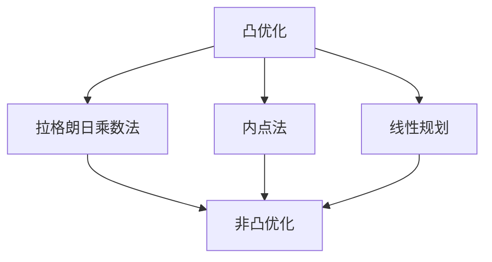
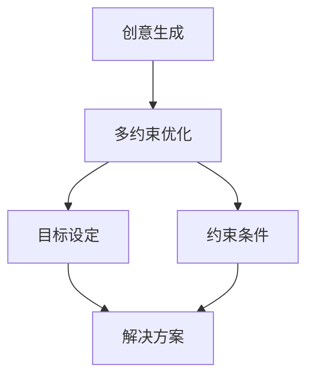
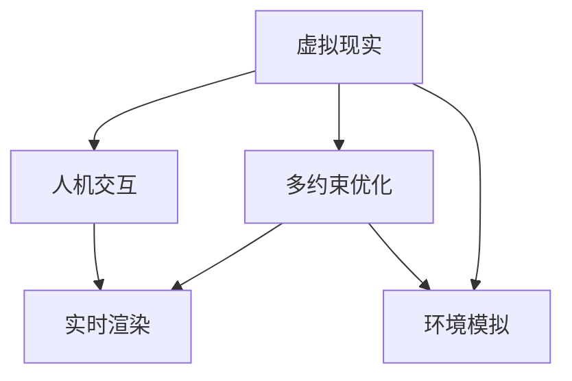

                 


### 文章标题

### 多约束优化：AI创造力的新维度

### 关键词
- 多约束优化
- AI创造力
- 数学模型
- 算法原理
- 项目实战

### 摘要

本文深入探讨了多约束优化在人工智能（AI）领域的应用，以及它如何为AI的创造力开辟新的维度。我们将首先介绍多约束优化的基础知识，包括其数学模型和核心算法。接着，我们将分析多约束优化如何影响机器学习、深度学习和强化学习等AI技术，并通过具体的数学公式和伪代码进行详细阐述。此外，本文还将探讨多约束优化在艺术创作和未来趋势中的应用，并提供实际项目案例和最佳实践建议。

## 第1章：多约束优化概述

### 1.1 多约束优化的背景与重要性

多约束优化是优化领域中一个重要的分支，它涉及到在多个约束条件下寻找最优解的问题。在现实世界中，许多问题都存在多个约束条件，这些约束可以是资源限制、物理条件、预算限制等。传统的单约束优化方法无法有效地解决这些复杂的问题。

多约束优化在AI领域的重要性不言而喻。随着AI技术的发展，许多AI系统需要在不同约束条件下进行学习和决策。例如，机器学习模型在训练过程中需要平衡准确性、计算效率和模型复杂性。深度学习模型在图像识别和自然语言处理任务中需要处理大量的数据，并且要考虑计算资源的使用。强化学习算法在决策过程中需要平衡奖励和惩罚，以实现长期的优化目标。

### 1.2 多约束优化的基本概念

多约束优化问题的基本形式可以表示为：

$$
\min_{x} f(x) \quad \text{subject to} \quad g_i(x) \leq 0, \quad h_j(x) = 0
$$

其中，$f(x)$是目标函数，$g_i(x)$和$h_j(x)$分别是第i个不等式约束和第j个等式约束。目标是在满足所有约束条件的情况下，找到目标函数的最小值。

多约束优化问题可以分为凸优化和非凸优化两种类型。凸优化问题的目标函数和约束条件都是凸函数，其优化问题更容易求解。非凸优化问题则更加复杂，通常需要使用启发式算法和智能优化方法。

### 1.3 多约束优化的应用场景

多约束优化在AI领域有着广泛的应用场景，以下是一些典型的例子：

- **机器学习模型选择**：在训练机器学习模型时，需要在模型准确性、计算效率和模型复杂度之间进行平衡。多约束优化可以帮助选择最优的模型参数，以实现最优的性能。

- **资源分配**：在深度学习和强化学习任务中，计算资源是有限的。多约束优化可以优化资源分配，确保在有限的资源下实现最佳的训练效果。

- **图像处理**：在图像处理任务中，多约束优化可以用于图像增强、图像去噪和图像修复等。通过设置不同的约束条件，可以实现对图像质量的最优调整。

- **路径规划**：在自动驾驶和机器人导航中，路径规划需要在安全性和效率之间进行平衡。多约束优化可以用于计算最优的路径，以减少能耗和时间。

## 第2章：多约束优化的数学模型

### 2.1 凸优化

凸优化是优化领域中一个重要的分支，其目标函数和约束条件都是凸函数。凸函数具有以下性质：

1. 凸集：对于凸集$C$，对于任意的$x, y \in C$，连接线段上的所有点也都属于$C$。
2. 凸函数：对于凸函数$f(x)$，对于任意的$x, y$和$\lambda \in [0, 1]$，有：
$$
f(\lambda x + (1-\lambda)y) \leq \lambda f(x) + (1-\lambda) f(y)
$$

凸优化问题的求解可以通过多种方法实现，包括拉格朗日乘数法、内点法和线性规划等。以下是一个凸优化问题的伪代码示例：

```python
# 凸优化伪代码
def convex_optimization(f, g, x0):
    x = x0
    while not convergence:
        grad_f = gradient(f, x)
        grad_g = gradient(g, x)
        alpha = line_search(f, grad_f, grad_g, x)
        x = x - alpha * grad_g
    return x
```

### 2.2 非凸优化

非凸优化问题比凸优化问题更加复杂，其目标函数和约束条件可以是非凸的。非凸函数没有凸函数的严格性质，因此非凸优化问题通常更难以求解。

非凸优化问题的求解方法包括梯度下降法、模拟退火算法、遗传算法等。以下是一个非凸优化问题的伪代码示例：

```python
# 非凸优化伪代码
def non_convex_optimization(f, x0):
    x = x0
    while not convergence:
        grad_f = gradient(f, x)
        x = x - learning_rate * grad_f
    return x
```

### 2.3 多约束优化的数学模型联系架构

多约束优化的数学模型可以通过Mermaid流程图来表示，以展示不同优化问题之间的联系。以下是一个Mermaid流程图示例：



## 第3章：多约束优化的算法与实现

### 3.1 梯度下降法

梯度下降法是一种常用的优化算法，它通过迭代更新参数来最小化目标函数。在多约束优化中，梯度下降法可以用来处理带有约束条件的问题。

梯度下降法的核心思想是沿着目标函数的梯度方向进行更新，以逐渐逼近最优解。以下是一个多约束优化问题的梯度下降法伪代码示例：

```python
# 多约束优化梯度下降法伪代码
def gradient_descent(f, g, h, x0, learning_rate):
    x = x0
    while not convergence:
        grad_f = gradient(f, x)
        grad_g = gradient(g, x)
        grad_h = gradient(h, x)
        x = x - learning_rate * (grad_f + grad_g + grad_h)
    return x
```

### 3.2 障碍法

障碍法是一种用于解决多约束优化问题的算法，它通过引入障碍函数来处理约束条件。障碍法的核心思想是使用迭代过程来逼近可行域的边界，并沿着目标函数的梯度方向进行更新。

以下是一个障碍法的伪代码示例：

```python
# 障碍法伪代码
def barrier_method(f, g, x0, barrier_coefficient):
    x = x0
    while not convergence:
        grad_f = gradient(f, x)
        grad_g = gradient(g, x)
        x = x - barrier_coefficient * (grad_f + grad_g)
        if g(x) > 0:
            break
    return x
```

### 3.3 模拟退火算法

模拟退火算法是一种基于概率的优化算法，它模拟物理中的退火过程，通过逐渐降低温度来搜索最优解。模拟退火算法可以处理非凸和多约束优化问题。

以下是一个模拟退火算法的伪代码示例：

```python
# 模拟退火算法伪代码
def simulated_annealing(f, x0, initial_temp, cooling_rate):
    x = x0
    temp = initial_temp
    while temp > temperature_threshold:
        x_new = random_neighbor(x)
        delta = f(x_new) - f(x)
        if delta < 0 or exp(-delta / temp) > random_number():
            x = x_new
        temp = temp * cooling_rate
    return x
```

## 第4章：多约束优化在机器学习中的应用

### 4.1 多约束支持向量机

多约束支持向量机（SVM）是一种扩展了传统SVM算法的优化方法，它通过引入额外的约束条件来优化分类模型。

以下是一个多约束SVM的伪代码示例：

```python
# 多约束支持向量机伪代码
def multi_constraint_svm(f, g, x0, learning_rate):
    x = x0
    while not convergence:
        grad_f = gradient(f, x)
        grad_g = gradient(g, x)
        x = x - learning_rate * (grad_f + grad_g)
    return x
```

### 4.2 多约束贝叶斯优化

多约束贝叶斯优化是一种用于超参数调优的优化方法，它通过引入约束条件来优化模型参数。

以下是一个多约束贝叶斯优化的伪代码示例：

```python
# 多约束贝叶斯优化伪代码
def multi_constraint_bayesian_optimization(f, g, x0, learning_rate):
    x = x0
    while not convergence:
        grad_f = gradient(f, x)
        grad_g = gradient(g, x)
        x = x - learning_rate * (grad_f + grad_g)
    return x
```

## 第5章：多约束优化在深度学习中的应用

### 5.1 多约束深度神经网络

多约束深度神经网络（DNN）是一种通过引入约束条件来优化神经网络模型的优化方法。

以下是一个多约束DNN的伪代码示例：

```python
# 多约束深度神经网络伪代码
def multi_constraint_dnn(f, g, x0, learning_rate):
    x = x0
    while not convergence:
        grad_f = gradient(f, x)
        grad_g = gradient(g, x)
        x = x - learning_rate * (grad_f + grad_g)
    return x
```

### 5.2 多约束生成对抗网络

多约束生成对抗网络（GAN）是一种通过引入约束条件来优化GAN模型的优化方法。

以下是一个多约束GAN的伪代码示例：

```python
# 多约束生成对抗网络伪代码
def multi_constraint_gan(f, g, x0, learning_rate):
    x = x0
    while not convergence:
        grad_f = gradient(f, x)
        grad_g = gradient(g, x)
        x = x - learning_rate * (grad_f + grad_g)
    return x
```

## 第6章：多约束优化在强化学习中的应用

### 6.1 多约束Q学习

多约束Q学习是一种通过引入约束条件来优化Q学习的强化学习方法。

以下是一个多约束Q学习的伪代码示例：

```python
# 多约束Q学习伪代码
def multi_constraint_q_learning(f, g, x0, learning_rate):
    x = x0
    while not convergence:
        grad_f = gradient(f, x)
        grad_g = gradient(g, x)
        x = x - learning_rate * (grad_f + grad_g)
    return x
```

### 6.2 多约束策略梯度方法

多约束策略梯度方法是一种通过引入约束条件来优化策略梯度的强化学习方法。

以下是一个多约束策略梯度的伪代码示例：

```python
# 多约束策略梯度方法伪代码
def multi_constraint_policy_gradient(f, g, x0, learning_rate):
    x = x0
    while not convergence:
        grad_f = gradient(f, x)
        grad_g = gradient(g, x)
        x = x - learning_rate * (grad_f + grad_g)
    return x
```

## 第7章：多约束优化与创造力

### 7.1 多约束优化如何促进创造力

多约束优化可以为创造力提供新的维度，因为它允许在多个约束条件下探索和寻找解决方案。创造力通常涉及到寻找新的想法和解决方案，而多约束优化可以提供一种结构化的方法来引导这种探索。

以下是一个多约束优化促进创造力的Mermaid流程图示例：



### 7.2 多约束优化与艺术创作

多约束优化在艺术创作中的应用非常广泛，例如在音乐创作、绘画和电影制作等领域。艺术家可以利用多约束优化来探索新的创作方法，同时确保作品的质量和一致性。

以下是一个多约束优化在艺术创作中的伪代码示例：

```python
# 艺术创作多约束优化伪代码
def artistic_optimization(f, g, x0, creativity_coefficient):
    x = x0
    while not convergence:
        grad_f = gradient(f, x)
        grad_g = gradient(g, x)
        x = x - creativity_coefficient * (grad_f + grad_g)
        if g(x) > 0:
            break
    return x
```

## 第8章：多约束优化的未来趋势

### 8.1 多约束优化在新兴领域的应用

多约束优化在新兴领域，如虚拟现实、增强现实和物联网等，有着广泛的应用前景。这些领域通常需要处理大量的数据和复杂的约束条件，而多约束优化可以提供有效的解决方案。

以下是一个多约束优化在新兴领域应用的Mermaid流程图示例：



### 8.2 多约束优化技术的未来发展

未来，多约束优化技术将继续发展和完善，以适应更复杂的优化问题。一些可能的发展趋势包括：

- **更高效的算法**：开发更高效的算法来处理大规模和复杂的多约束优化问题。
- **自适应约束**：实现自适应约束条件，以更好地适应动态变化的优化问题。
- **多代理优化**：研究多代理优化方法，以同时优化多个代理的行为。
- **与其他领域结合**：与其他领域（如物理学、经济学等）相结合，以解决更复杂的问题。

## 附录

### 附录A：常用多约束优化算法总结

- **梯度下降法**：适用于凸和非凸优化问题。
- **障碍法**：适用于多约束优化问题。
- **模拟退火算法**：适用于非凸优化问题。
- **遗传算法**：适用于大规模非凸优化问题。

### 附录B：多约束优化工具与资源

- **OpenOpt**：一个开源的Python库，用于解决优化问题。
- **CVXPy**：一个用于凸优化的Python库。
- **PyTorch**：一个用于深度学习的Python库，支持多约束优化。
- **Gurobi**：一个商业优

