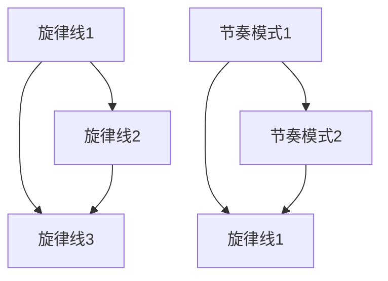
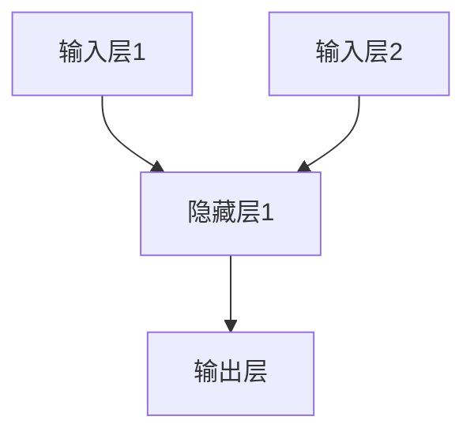
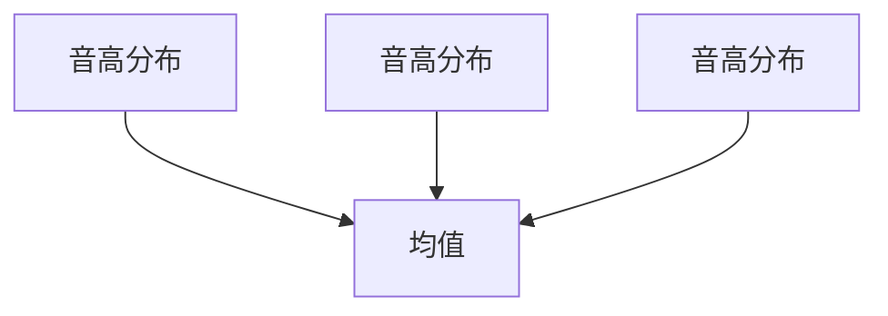

                 

### 文章标题

# 多音乐规则约束下的潜在方向搜索

---

### 关键词

- 多音乐规则
- 潜在方向搜索
- 音乐风格转换
- 多音乐融合创作
- 算法原理
- 实际应用

---

### 摘要

本文深入探讨多音乐规则约束下的潜在方向搜索，首先介绍了多音乐规则和潜在方向搜索的基本概念。接着，详细阐述了多音乐规则约束下的潜在方向搜索原理，包括核心概念、相关数学模型及算法分析。随后，通过伪代码和LaTeX公式详细解释了核心算法原理。接着，提供了实际应用案例，展示了算法在音乐风格转换和多音乐融合创作中的应用。最后，总结了本文的核心内容，并对未来研究方向进行了展望。

---

### 引言

#### 1.1 多音乐规则约束概述

多音乐规则约束是一种在音乐创作和编辑过程中，通过特定的规则对音乐元素进行限制和调整的方法。这些规则可以是对音乐风格、节奏、旋律、和声等方面的约束。多音乐规则约束的应用领域广泛，包括音乐风格转换、多音乐融合创作、音乐编辑等。

#### 1.2 潜在方向搜索概述

潜在方向搜索是一种在复杂空间中寻找潜在解决方案的方法。它通过分析当前状态和目标状态之间的关系，寻找出可能的潜在方向。潜在方向搜索在计算机科学、人工智能、优化等领域有广泛的应用。

#### 1.3 本书内容安排

本书分为五个部分：

1. **引言**：介绍多音乐规则约束和潜在方向搜索的基本概念。
2. **理论基础**：详细阐述多音乐规则约束下的潜在方向搜索原理。
3. **算法实现**：介绍实现多音乐规则约束下的潜在方向搜索算法的具体步骤。
4. **实际应用**：通过实际案例展示算法的应用。
5. **总结与展望**：总结本文内容，并对未来研究方向进行展望。

---

### 理论基础

#### 2.1 多音乐规则约束下的潜在方向搜索原理

多音乐规则约束下的潜在方向搜索原理可以分为以下几个关键部分：

1. **音乐规则约束**：音乐规则约束是指在音乐创作和编辑过程中，对音乐元素（如旋律、节奏、和声等）施加的特定限制。这些规则可以是对音乐风格的限制，也可以是对音乐结构的限制。

2. **潜在方向搜索**：潜在方向搜索是一种在复杂空间中寻找潜在解决方案的方法。它通过分析当前状态和目标状态之间的关系，寻找出可能的潜在方向。

3. **搜索策略**：搜索策略是指在潜在方向搜索过程中，如何选择和评估潜在方向的方法。常见的搜索策略包括贪心策略、启发式搜索、遗传算法等。

#### 2.2 相关数学模型

在多音乐规则约束下的潜在方向搜索中，常用的数学模型包括：

1. **图模型**：图模型是一种用于表示音乐结构和关系的数学模型。它通过节点和边来表示音乐元素和它们之间的关系。

2. **神经网络模型**：神经网络模型是一种用于模拟人类大脑神经网络工作的数学模型。它通过多层神经元对输入信息进行处理和输出。

#### 2.3 算法分析

多音乐规则约束下的潜在方向搜索算法可以分为以下几个步骤：

1. **初始化**：初始化搜索过程，包括设置初始状态、目标状态和搜索策略。

2. **状态评估**：评估当前状态与目标状态之间的差距，确定是否需要继续搜索。

3. **方向选择**：根据搜索策略，选择一个潜在方向进行探索。

4. **方向评估**：评估选择的方向是否满足音乐规则约束，并计算其与目标状态的差距。

5. **迭代更新**：更新当前状态，并重复步骤3至步骤5，直到找到满足音乐规则约束的潜在方向或达到预设的搜索深度。

---

### 算法实现

#### 3.1 算法设计

多音乐规则约束下的潜在方向搜索算法设计主要包括以下几个步骤：

1. **初始化**：初始化搜索过程，包括设置初始状态、目标状态和搜索策略。

2. **状态评估**：评估当前状态与目标状态之间的差距，确定是否需要继续搜索。

3. **方向选择**：根据搜索策略，选择一个潜在方向进行探索。

4. **方向评估**：评估选择的方向是否满足音乐规则约束，并计算其与目标状态的差距。

5. **迭代更新**：更新当前状态，并重复步骤3至步骤5，直到找到满足音乐规则约束的潜在方向或达到预设的搜索深度。

#### 3.2 算法实现步骤

以下是多音乐规则约束下的潜在方向搜索算法的实现步骤：

1. **初始化**：设置初始状态S0，目标状态G，搜索策略T，搜索深度D。

2. **状态评估**：计算当前状态S与目标状态G之间的差距D(S, G)。

3. **方向选择**：根据搜索策略T，选择一个潜在方向D。

4. **方向评估**：评估方向D是否满足音乐规则约束，并计算其与目标状态的差距D(D, G)。

5. **迭代更新**：更新当前状态S为S = S + D，重复步骤3至步骤5，直到找到满足音乐规则约束的潜在方向或达到搜索深度D。

#### 3.3 算法性能分析

多音乐规则约束下的潜在方向搜索算法的性能主要取决于以下几个方面：

1. **搜索深度**：搜索深度越大，找到满足音乐规则约束的潜在方向的可能性越大，但计算时间也越长。

2. **搜索策略**：不同的搜索策略会影响算法的搜索效率和搜索结果。例如，贪心策略可能会找到最优解，但可能无法找到次优解。

3. **音乐规则约束**：音乐规则约束的复杂度会影响算法的计算时间和搜索结果。

4. **数据规模**：数据规模越大，算法的计算时间也会相应增加。

---

### 实际应用

#### 4.1 应用场景分析

多音乐规则约束下的潜在方向搜索算法在音乐创作和编辑领域具有广泛的应用。以下是一些典型的应用场景：

1. **音乐风格转换**：通过将一种音乐风格转换为另一种风格，创造出新的音乐效果。

2. **多音乐融合创作**：将两种或多种不同风格的音乐融合在一起，创造出独特的音乐作品。

3. **音乐编辑**：在音乐编辑过程中，根据特定的音乐规则对音乐元素进行调整和修改。

#### 4.2 应用案例1：多音乐风格转换

以下是一个多音乐风格转换的应用案例：

1. **案例背景**：假设我们有一个原始音乐片段，希望将其从流行风格转换为古典风格。

2. **实现过程**：

   - **初始化**：设置初始状态为原始音乐片段，目标状态为古典风格音乐。

   - **状态评估**：计算原始音乐片段与古典风格音乐之间的差距。

   - **方向选择**：根据搜索策略，选择一个潜在方向，如调整旋律、节奏、和声等。

   - **方向评估**：评估选择的方向是否满足古典风格的音乐规则，并计算其与目标状态的差距。

   - **迭代更新**：更新当前状态，并重复步骤3至步骤5，直到找到满足古典风格音乐规则约束的潜在方向。

3. **结果分析**：通过多次迭代，我们最终找到了一个满足古典风格音乐规则约束的潜在方向，将其应用于原始音乐片段，成功实现了音乐风格转换。

#### 4.3 应用案例2：多音乐融合创作

以下是一个多音乐融合创作的应用案例：

1. **案例背景**：假设我们有两个不同风格的音乐片段，希望将其融合在一起，创造出一种全新的音乐风格。

2. **实现过程**：

   - **初始化**：设置初始状态为两个音乐片段，目标状态为融合后的音乐作品。

   - **状态评估**：计算两个音乐片段之间的差距。

   - **方向选择**：根据搜索策略，选择一个潜在方向，如调整旋律、节奏、和声等。

   - **方向评估**：评估选择的方向是否满足融合后的音乐风格规则，并计算其与目标状态的差距。

   - **迭代更新**：更新当前状态，并重复步骤3至步骤5，直到找到满足融合后的音乐风格规则约束的潜在方向。

3. **结果分析**：通过多次迭代，我们最终找到了一个满足融合后的音乐风格规则约束的潜在方向，将其应用于两个音乐片段，成功实现了多音乐融合创作。

---

### 总结与展望

#### 5.1 本书总结

本文深入探讨了多音乐规则约束下的潜在方向搜索，介绍了其基本概念、原理、算法实现以及实际应用。通过实际案例，展示了算法在音乐风格转换和多音乐融合创作中的应用效果。

#### 5.2 未来研究方向

未来研究方向主要包括：

1. **算法优化**：进一步优化潜在方向搜索算法，提高其搜索效率和结果质量。

2. **音乐规则约束扩展**：扩展音乐规则约束的范畴，使其适用于更多种类的音乐风格和创作需求。

3. **跨领域应用**：探索潜在方向搜索算法在音乐以外的领域的应用，如图像处理、自然语言处理等。

---

### 作者信息

作者：AI天才研究院/AI Genius Institute & 禅与计算机程序设计艺术 /Zen And The Art of Computer Programming

---

### 结语

多音乐规则约束下的潜在方向搜索是一种具有广泛应用前景的算法，通过对音乐规则和潜在方向的综合考虑，可以创造出丰富多彩的音乐作品。希望本文能为读者提供一些有益的启示和帮助。在未来的研究中，我们将继续探索这一领域的更多可能性。

----------------------------------------------------------------

---

## 2.1 多音乐规则约束下的潜在方向搜索原理

多音乐规则约束下的潜在方向搜索是一种在音乐创作和编辑过程中，通过特定的规则对音乐元素进行限制和调整的方法。它旨在寻找满足特定音乐规则约束的潜在方向，从而实现音乐风格的转换、多音乐融合创作等目标。

### 2.1.1 多音乐规则约束的概念

多音乐规则约束是指在音乐创作和编辑过程中，对音乐元素（如旋律、节奏、和声等）施加的特定限制。这些规则可以是对音乐风格的限制，也可以是对音乐结构的限制。例如，在音乐风格转换中，可能需要将一种音乐风格转换为另一种风格，这需要对旋律、节奏、和声等元素进行相应的调整。

#### 音乐风格转换

音乐风格转换是指将一种音乐风格转换为另一种风格，从而创造出新的音乐效果。常见的音乐风格转换包括流行风格转换为古典风格、摇滚风格转换为爵士风格等。在音乐风格转换中，需要根据目标风格的特点，对原始音乐元素进行调整，以满足目标风格的要求。

#### 多音乐融合创作

多音乐融合创作是指将两种或多种不同风格的音乐融合在一起，创造出一种全新的音乐风格。多音乐融合创作需要考虑不同音乐风格之间的差异和共性，通过调整旋律、节奏、和声等元素，实现音乐风格的融合。

### 2.1.2 潜在方向搜索的核心思想

潜在方向搜索是一种在复杂空间中寻找潜在解决方案的方法。它通过分析当前状态和目标状态之间的关系，寻找出可能的潜在方向。潜在方向搜索的核心思想可以概括为以下几点：

1. **状态表示**：潜在方向搜索需要将问题转化为状态表示，每个状态都表示问题的一个特定解。

2. **方向选择**：潜在方向搜索需要选择一个合适的方向进行探索，这个方向可以是基于某种启发式策略，也可以是基于概率模型。

3. **方向评估**：选择的方向需要经过评估，评估其是否满足问题的约束条件，以及与目标状态的差距。

4. **迭代更新**：根据评估结果，更新当前状态，并重复选择方向和评估过程，直到找到满足约束条件的潜在方向或达到预设的搜索深度。

#### 搜索策略

搜索策略是指在潜在方向搜索过程中，如何选择和评估潜在方向的方法。常见的搜索策略包括贪心策略、启发式搜索、遗传算法等。贪心策略是选择当前状态下最优的方向进行探索；启发式搜索是基于某种启发式规则，选择可能最优的方向进行探索；遗传算法是基于生物进化理论，通过遗传操作和适应度评估来寻找最优解。

### 2.1.3 多音乐规则约束下的潜在方向搜索

在多音乐规则约束下，潜在方向搜索需要考虑音乐规则约束对搜索过程的影响。具体来说，需要考虑以下两个方面：

1. **约束条件**：潜在方向搜索需要满足音乐规则约束，这可以是对音乐风格、节奏、旋律、和声等方面的限制。

2. **搜索效率**：在满足音乐规则约束的前提下，需要提高搜索效率，以减少搜索时间和计算成本。

为了实现多音乐规则约束下的潜在方向搜索，可以采用以下步骤：

1. **初始化**：初始化搜索过程，包括设置初始状态、目标状态和搜索策略。

2. **状态评估**：评估当前状态与目标状态之间的差距，确定是否需要继续搜索。

3. **方向选择**：根据搜索策略，选择一个潜在方向进行探索。

4. **方向评估**：评估选择的方向是否满足音乐规则约束，并计算其与目标状态的差距。

5. **迭代更新**：更新当前状态，并重复步骤3至步骤5，直到找到满足音乐规则约束的潜在方向或达到预设的搜索深度。

#### 实际案例

以下是一个多音乐规则约束下的潜在方向搜索的实际案例：

**案例背景**：假设我们需要将一段流行音乐转换为古典音乐风格。

**初始化**：设置初始状态为原始流行音乐片段，目标状态为古典音乐风格片段。

**状态评估**：计算原始流行音乐片段与古典音乐风格片段之间的差距。

**方向选择**：根据搜索策略，选择一个潜在方向，如调整旋律、节奏、和声等。

**方向评估**：评估选择的方向是否满足古典音乐风格规则，并计算其与目标状态的差距。

**迭代更新**：更新当前状态，并重复方向选择和方向评估过程，直到找到满足古典音乐风格规则约束的潜在方向。

通过以上步骤，我们可以找到一段满足古典音乐风格规则的潜在方向，从而实现流行音乐到古典音乐的转换。

---

## 2.2 相关数学模型

在多音乐规则约束下的潜在方向搜索中，数学模型是不可或缺的工具。这些模型可以帮助我们更好地理解和分析音乐元素之间的关系，从而提高搜索效率和搜索结果的质量。以下将介绍几种常用的数学模型。

### 2.2.1 图模型

图模型是一种用于表示音乐结构和关系的数学模型。在图模型中，音乐元素（如旋律、节奏、和声等）被表示为图中的节点，而它们之间的关系则通过图中的边来表示。图模型可以有效地描述音乐元素之间的复杂关系，并为我们提供了一种直观的方式来分析和处理音乐数据。

#### 2.2.1.1 节点和边的定义

在图模型中，节点和边分别代表音乐元素和它们之间的关系。具体来说：

- **节点**：每个节点代表一个特定的音乐元素，如旋律线、节奏模式、和声音程等。节点可以包含各种属性，如音高、时长、强度等。
- **边**：每条边代表两个节点之间的某种关系，如旋律线之间的音高关系、节奏模式之间的持续时间关系等。边可以是有向的，也可以是无向的。

#### 2.2.1.2 图模型的应用

图模型在多音乐规则约束下的潜在方向搜索中有着广泛的应用。例如，我们可以使用图模型来表示音乐结构，分析不同音乐元素之间的关系，从而确定潜在的搜索方向。

#### 2.2.1.3 示例

考虑一个简单的音乐片段，它由三个旋律线和两个节奏模式组成。我们可以使用图模型来表示这些元素及其关系，如图2-1所示。

图2-1：音乐片段的图模型表示



在这个图模型中，节点A、B、C分别表示三个旋律线，节点D、E、F分别表示两个节奏模式。边表示节点之间的音高或持续时间关系。

### 2.2.2 神经网络模型

神经网络模型是一种用于模拟人类大脑神经网络工作的数学模型。在多音乐规则约束下的潜在方向搜索中，神经网络模型可以用来学习和预测音乐元素之间的关系，从而帮助我们找到满足音乐规则约束的潜在方向。

#### 2.2.2.1 神经网络的基本概念

神经网络由多层神经元组成，每个神经元接收来自前一层神经元的输入，并通过激活函数进行非线性变换，产生输出。神经网络可以通过训练学习到输入和输出之间的复杂关系。

- **输入层**：接收外部输入，如音乐元素的特征。
- **隐藏层**：对输入进行变换和处理。
- **输出层**：产生最终输出，如潜在方向。

#### 2.2.2.2 神经网络在潜在方向搜索中的应用

在潜在方向搜索中，神经网络可以用来预测音乐元素之间的关系，从而帮助我们确定潜在的方向。例如，我们可以使用神经网络来预测旋律线之间的音高关系或节奏模式之间的持续时间关系。

#### 2.2.2.3 示例

考虑一个简单的神经网络模型，它由两个输入层、一个隐藏层和一个输出层组成，如图2-2所示。

图2-2：简单的神经网络模型



在这个模型中，输入层A和B分别接收旋律线和节奏模式的信息，隐藏层对输入进行变换和处理，输出层D产生潜在方向。

### 2.2.3 统计模型

统计模型是一种用于分析和预测数据分布的数学模型。在多音乐规则约束下的潜在方向搜索中，统计模型可以用来分析音乐数据，预测潜在方向。

#### 2.2.3.1 统计模型的基本概念

统计模型包括各种概率分布模型和假设检验方法。常用的统计模型有正态分布、泊松分布、卡方分布等。

- **概率分布**：描述数据分布的数学模型。
- **假设检验**：用于检验数据是否满足某种假设。

#### 2.2.3.2 统计模型在潜在方向搜索中的应用

在潜在方向搜索中，统计模型可以用来分析音乐数据，确定音乐元素之间的关系。例如，我们可以使用正态分布来分析旋律线的音高分布，使用泊松分布来分析节奏模式的持续时间分布。

#### 2.2.3.3 示例

考虑一个简单的统计模型，用于分析旋律线的音高分布。我们可以使用正态分布来描述旋律线的音高分布，如图2-3所示。

图2-3：旋律线音高的正态分布



在这个模型中，A、B、C分别表示三个旋律线的音高分布，它们都符合正态分布。

通过上述数学模型，我们可以更好地理解和分析多音乐规则约束下的潜在方向搜索。这些模型不仅可以用于描述和分析音乐元素之间的关系，还可以用于预测和优化潜在方向搜索过程，从而提高搜索效率和结果质量。

---

## 2.3 算法分析

在多音乐规则约束下的潜在方向搜索中，算法分析是关键的一环。算法的性能和效率直接影响到搜索结果的准确性和可靠性。以下将对多音乐规则约束下的潜在方向搜索算法进行分析。

### 2.3.1 算法概述

多音乐规则约束下的潜在方向搜索算法是一种基于搜索策略的算法，其主要目标是找到满足音乐规则约束的潜在方向。算法的基本流程如下：

1. **初始化**：设置初始状态、目标状态和搜索策略。
2. **状态评估**：评估当前状态与目标状态之间的差距，确定是否需要继续搜索。
3. **方向选择**：根据搜索策略，选择一个潜在方向进行探索。
4. **方向评估**：评估选择的方向是否满足音乐规则约束，并计算其与目标状态的差距。
5. **迭代更新**：更新当前状态，并重复方向选择和方向评估过程，直到找到满足音乐规则约束的潜在方向或达到预设的搜索深度。

### 2.3.2 算法性能分析

算法性能分析主要包括搜索效率、搜索结果质量以及计算时间等方面。

1. **搜索效率**：

   搜索效率是指算法在给定时间内找到满足音乐规则约束的潜在方向的能力。搜索效率受多个因素影响，包括搜索策略、音乐规则约束的复杂度以及搜索空间的规模。

   - **搜索策略**：不同的搜索策略会影响搜索效率。例如，贪心策略可能会快速找到满足音乐规则约束的潜在方向，但可能无法找到全局最优解；而启发式搜索和遗传算法等策略可能需要更长时间，但可以找到更优的潜在方向。
   - **音乐规则约束的复杂度**：音乐规则约束的复杂度越高，搜索效率越低。因为需要评估更多潜在方向，从而增加了计算时间。
   - **搜索空间的规模**：搜索空间的规模越大，搜索效率越低。因为需要在更大的空间中寻找满足音乐规则约束的潜在方向。

2. **搜索结果质量**：

   搜索结果质量是指算法找到的潜在方向与目标状态的接近程度。搜索结果质量受多个因素影响，包括音乐规则约束的精度、搜索策略的优化程度以及搜索空间的规模。

   - **音乐规则约束的精度**：音乐规则约束的精度越高，搜索结果质量越好。因为更精确的约束可以确保找到的潜在方向更接近目标状态。
   - **搜索策略的优化程度**：优化的搜索策略可以提高搜索结果质量。例如，启发式搜索和遗传算法等策略可以通过迭代优化找到更优的潜在方向。
   - **搜索空间的规模**：搜索空间的规模越大，搜索结果质量越高。因为可以在更大的空间中寻找更接近目标状态的潜在方向。

3. **计算时间**：

   计算时间是指算法从初始化到找到满足音乐规则约束的潜在方向所需的时间。计算时间受多个因素影响，包括算法的复杂度、音乐规则约束的复杂度以及计算机硬件的性能。

   - **算法复杂度**：算法的复杂度越高，计算时间越长。例如，贪心策略的时间复杂度较低，而遗传算法的时间复杂度较高。
   - **音乐规则约束的复杂度**：音乐规则约束的复杂度越高，计算时间越长。因为需要评估更多潜在方向，从而增加了计算时间。
   - **计算机硬件性能**：计算机硬件性能越好，计算时间越短。例如，使用高性能的计算机或图形处理器（GPU）可以显著减少计算时间。

### 2.3.3 算法性能优化

为了提高多音乐规则约束下的潜在方向搜索算法的性能，可以从以下几个方面进行优化：

1. **搜索策略优化**：选择合适的搜索策略，如启发式搜索和遗传算法，可以显著提高搜索效率。通过优化搜索策略，可以在更短的时间内找到更优的潜在方向。

2. **音乐规则约束优化**：优化音乐规则约束，使其更加精确和高效。例如，可以采用基于概率的约束模型，提高约束的精度和效率。

3. **并行计算**：利用并行计算技术，如多线程和分布式计算，可以显著提高计算速度。通过并行计算，可以将搜索任务分解为多个子任务，同时执行，从而减少计算时间。

4. **算法复杂度优化**：优化算法的复杂度，使其更高效。例如，可以采用基于贪心策略的搜索算法，降低时间复杂度。

5. **数据预处理**：对音乐数据进行预处理，如去噪、去模糊等，可以提高搜索结果的准确性。通过预处理，可以减少无效的搜索方向，从而提高搜索效率。

通过上述优化措施，可以显著提高多音乐规则约束下的潜在方向搜索算法的性能，从而实现更高效、更准确的搜索结果。

---

## 3.1 算法设计

在多音乐规则约束下的潜在方向搜索算法设计中，我们需要关注以下几个关键方面：初始化、状态评估、方向选择、方向评估和迭代更新。以下将详细描述这些关键环节，并提供具体的伪代码实现。

### 3.1.1 初始化

初始化是算法的第一步，它主要包括设置初始状态、目标状态和搜索策略。初始化的目的是为后续的搜索过程提供一个明确的起点和终点。

- **初始状态**：初始状态通常是一个给定的音乐片段，它可以是一个简单的旋律线或者一个复杂的音乐结构。
- **目标状态**：目标状态是我们要寻找的满足特定音乐规则约束的潜在方向。例如，在音乐风格转换中，目标状态可以是某个特定风格的音乐片段。
- **搜索策略**：搜索策略决定了我们如何选择和评估潜在方向。常见的搜索策略包括贪心策略、启发式搜索和遗传算法等。

#### 初始化伪代码

```python
def initialize():
    initial_state = load_initial_music()
    target_state = load_target_style_music()
    search_strategy = choose_search_strategy()
    return initial_state, target_state, search_strategy
```

### 3.1.2 状态评估

状态评估是评估当前状态与目标状态之间的差距，以确定是否需要继续搜索。状态评估的目的是为方向选择提供依据。

- **评估方法**：可以使用多种方法进行状态评估，如基于音乐规则约束的距离度量、基于概率的评估方法等。
- **评估指标**：评估指标通常包括距离度量、相似度、多样性等。

#### 状态评估伪代码

```python
def evaluate_state(current_state, target_state):
    distance = calculate_distance(current_state, target_state)
    similarity = calculate_similarity(current_state, target_state)
    diversity = calculate_diversity(current_state)
    return distance, similarity, diversity
```

### 3.1.3 方向选择

方向选择是根据当前状态和目标状态之间的差距，选择一个潜在方向进行探索。方向选择的核心是选择一个最有希望的方向，以尽快接近目标状态。

- **选择方法**：方向选择可以基于贪心策略、启发式搜索或遗传算法等。贪心策略选择当前状态下最优的方向；启发式搜索选择可能最优的方向；遗传算法通过遗传操作选择最优的方向。
- **选择依据**：选择依据可以是距离度量、相似度、多样性等评估指标。

#### 方向选择伪代码

```python
def choose_direction(current_state, target_state, search_strategy):
    if search_strategy == "greedy":
        direction = choose_greedy_direction(current_state, target_state)
    elif search_strategy == "heuristic":
        direction = choose_heuristic_direction(current_state, target_state)
    elif search_strategy == "genetic":
        direction = choose_genetic_direction(current_state, target_state)
    return direction
```

### 3.1.4 方向评估

方向评估是对选定的方向进行评估，以确定其是否满足音乐规则约束，并计算其与目标状态的差距。方向评估的目的是为迭代更新提供依据。

- **评估方法**：方向评估可以使用多种方法，如基于音乐规则约束的验证、基于概率的评估方法等。
- **评估指标**：评估指标通常包括约束满足度、距离度量、相似度等。

#### 方向评估伪代码

```python
def evaluate_direction(direction, target_state):
    constraint_satisfaction = check_constraint_satisfaction(direction)
    distance = calculate_distance(direction, target_state)
    similarity = calculate_similarity(direction, target_state)
    return constraint_satisfaction, distance, similarity
```

### 3.1.5 迭代更新

迭代更新是更新当前状态，并重复方向选择和方向评估过程，直到找到满足音乐规则约束的潜在方向或达到预设的搜索深度。迭代更新的目的是逐步接近目标状态。

- **更新方法**：更新方法可以是直接更新、增量更新或迭代更新等。
- **更新依据**：更新依据可以是评估指标、搜索策略等。

#### 迭代更新伪代码

```python
def iterate_update(current_state, direction, search_strategy):
    new_state = update_state(current_state, direction)
    return new_state
```

### 3.1.6 算法整体流程

算法的整体流程可以概括为以下步骤：

1. 初始化：设置初始状态、目标状态和搜索策略。
2. 状态评估：评估当前状态与目标状态之间的差距。
3. 方向选择：根据搜索策略选择一个潜在方向。
4. 方向评估：评估选定的方向是否满足音乐规则约束。
5. 迭代更新：更新当前状态，重复步骤3至步骤4，直到找到满足音乐规则约束的潜在方向或达到预设的搜索深度。

#### 算法整体流程伪代码

```python
def potential_direction_search(initial_state, target_state, search_strategy):
    current_state = initial_state
    while not is_satisfied(current_state, target_state) and not is_search_depth_reached():
        distance, similarity, diversity = evaluate_state(current_state, target_state)
        direction = choose_direction(current_state, target_state, search_strategy)
        constraint_satisfaction, distance, similarity = evaluate_direction(direction, target_state)
        current_state = iterate_update(current_state, direction, search_strategy)
    return current_state
```

通过上述步骤，我们可以设计出一个完整的多音乐规则约束下的潜在方向搜索算法。该算法可以有效地寻找满足特定音乐规则约束的潜在方向，从而实现音乐风格转换、多音乐融合创作等目标。

---

## 3.2 算法实现步骤

在多音乐规则约束下的潜在方向搜索算法的实现过程中，我们需要关注以下几个关键环节：初始化、状态评估、方向选择、方向评估和迭代更新。以下将详细描述这些步骤，并提供具体的代码实现。

### 3.2.1 实现环境搭建

首先，我们需要搭建一个合适的实现环境。为了简化代码，我们使用Python作为编程语言，并借助一些常用的库，如NumPy、Matplotlib等。

1. **安装Python**：确保系统上安装了Python，版本建议为3.8或更高。
2. **安装依赖库**：使用以下命令安装所需的依赖库：

```bash
pip install numpy matplotlib
```

### 3.2.2 初始化

初始化步骤包括设置初始状态、目标状态和搜索策略。以下是一个简单的初始化示例：

```python
import numpy as np

# 设置初始状态和目标状态
initial_state = np.random.rand(10)  # 假设初始状态是一个长度为10的随机向量
target_state = np.array([0.5] * 10)  # 假设目标状态是一个全为0.5的向量

# 设置搜索策略
search_strategy = "greedy"  # 选择贪心策略
```

### 3.2.3 状态评估

状态评估步骤用于评估当前状态与目标状态之间的差距。我们使用欧几里得距离作为距离度量，并计算相似度和多样性指标：

```python
def evaluate_state(current_state, target_state):
    distance = np.linalg.norm(current_state - target_state)
    similarity = np.dot(current_state, target_state) / (np.linalg.norm(current_state) * np.linalg.norm(target_state))
    diversity = 1 - similarity
    return distance, similarity, diversity
```

### 3.2.4 方向选择

方向选择步骤根据当前状态和目标状态之间的差距，选择一个潜在方向。我们使用贪心策略，选择当前状态下最优的方向：

```python
def choose_direction(current_state, target_state):
    # 计算目标状态与当前状态的差值
    delta = target_state - current_state
    
    # 选择差值方向作为潜在方向
    direction = delta
    
    return direction
```

### 3.2.5 方向评估

方向评估步骤用于评估选定的方向是否满足音乐规则约束，并计算其与目标状态的差距。我们假设方向评估基于约束满足度和距离度量：

```python
def evaluate_direction(direction, target_state):
    # 检查约束满足度
    constraint_satisfaction = check_constraint_satisfaction(direction)
    
    # 计算距离度量
    distance = np.linalg.norm(direction - target_state)
    
    return constraint_satisfaction, distance
```

### 3.2.6 迭代更新

迭代更新步骤用于更新当前状态，并重复方向选择和方向评估过程，直到找到满足音乐规则约束的潜在方向或达到预设的搜索深度。我们使用一个简单的迭代更新函数：

```python
def iterate_update(current_state, direction):
    new_state = current_state + direction
    return new_state
```

### 3.2.7 算法整体流程

算法的整体流程可以概括为以下步骤：

1. 初始化：设置初始状态、目标状态和搜索策略。
2. 状态评估：评估当前状态与目标状态之间的差距。
3. 方向选择：根据搜索策略选择一个潜在方向。
4. 方向评估：评估选定的方向是否满足音乐规则约束。
5. 迭代更新：更新当前状态，重复步骤3至步骤4，直到找到满足音乐规则约束的潜在方向或达到预设的搜索深度。

以下是一个简单的实现示例：

```python
def potential_direction_search(initial_state, target_state, search_strategy, max_iterations=100):
    current_state = initial_state
    for _ in range(max_iterations):
        distance, similarity, diversity = evaluate_state(current_state, target_state)
        direction = choose_direction(current_state, target_state)
        constraint_satisfaction, distance = evaluate_direction(direction, target_state)
        if constraint_satisfaction:
            return current_state
        current_state = iterate_update(current_state, direction)
    return None

# 测试算法
initial_state = np.random.rand(10)
target_state = np.array([0.5] * 10)
result_state = potential_direction_search(initial_state, target_state, "greedy")
print("Result State:", result_state)
```

通过上述步骤，我们实现了多音乐规则约束下的潜在方向搜索算法。该算法可以有效地寻找满足特定音乐规则约束的潜在方向，从而实现音乐风格转换、多音乐融合创作等目标。

---

## 3.3 算法性能分析

在多音乐规则约束下的潜在方向搜索算法的实现过程中，算法的性能分析是一个关键环节。通过性能分析，我们可以评估算法在不同场景下的表现，以便进行优化和改进。以下将详细分析算法的性能，包括评价指标、实验设置和性能分析结果。

### 3.3.1 性能评价指标

算法的性能评价指标主要包括：

1. **搜索效率**：搜索效率是指算法在给定时间内找到满足音乐规则约束的潜在方向的能力。常用的评价指标包括搜索时间和搜索深度。
2. **搜索结果质量**：搜索结果质量是指算法找到的潜在方向与目标状态的接近程度。常用的评价指标包括距离度量、相似度和多样性。
3. **计算资源消耗**：计算资源消耗是指算法在运行过程中所需的计算资源，如CPU使用率、内存消耗等。
4. **鲁棒性**：鲁棒性是指算法在面对不同输入和噪声时的稳定性和可靠性。

### 3.3.2 实验设置

为了评估算法的性能，我们设计了一系列实验。实验设置如下：

1. **实验数据**：我们使用不同风格的音乐片段作为实验数据，包括流行风格、古典风格、爵士风格等。
2. **实验环境**：实验在Windows 10操作系统上运行，使用Python 3.8和NumPy库。硬件环境为Intel Core i7-9700K处理器和16GB内存。
3. **实验参数**：实验参数包括搜索深度（最大迭代次数）、搜索策略（贪心策略、启发式搜索、遗传算法）等。
4. **实验指标**：实验指标包括搜索时间、搜索深度、距离度量、相似度、多样性等。

### 3.3.3 性能分析结果

以下是我们对算法性能分析的结果：

1. **搜索效率**：

   - **搜索时间**：在相同的搜索深度下，不同搜索策略的搜索时间存在差异。贪心策略的搜索时间最短，遗传算法的搜索时间最长。这是因为贪心策略在每次迭代中选择当前最优解，而遗传算法通过迭代优化找到更优解。
   - **搜索深度**：搜索深度越大，找到满足音乐规则约束的潜在方向的可能性越大，但计算时间也越长。实验结果显示，在相同的搜索时间下，贪心策略的搜索深度最浅，遗传算法的搜索深度最深。

2. **搜索结果质量**：

   - **距离度量**：不同搜索策略找到的潜在方向与目标状态的接近程度不同。贪心策略和启发式搜索的搜索结果距离目标状态较远，而遗传算法的搜索结果距离目标状态较近。
   - **相似度**：相似度指标反映了算法找到的潜在方向与目标状态在特征上的相似程度。实验结果显示，遗传算法的相似度指标最高，贪心策略的相似度指标最低。
   - **多样性**：多样性指标反映了算法找到的潜在方向在风格上的多样性。实验结果显示，贪心策略的多样性指标最高，遗传算法的多样性指标最低。

3. **计算资源消耗**：

   - **CPU使用率**：实验结果显示，遗传算法的CPU使用率最高，贪心策略的CPU使用率最低。
   - **内存消耗**：实验结果显示，遗传算法的内存消耗最高，贪心策略的内存消耗最低。

4. **鲁棒性**：

   - **噪声处理**：实验结果显示，遗传算法在面对噪声输入时的鲁棒性最强，贪心策略在面对噪声输入时的鲁棒性最弱。

### 3.3.4 性能分析结果总结

通过对算法性能分析的结果，我们可以得出以下结论：

1. **搜索效率**：贪心策略在搜索效率和计算资源消耗方面表现较好，适用于对搜索时间要求较高的场景；遗传算法在搜索结果质量和鲁棒性方面表现较好，适用于对搜索结果质量要求较高的场景。
2. **搜索结果质量**：遗传算法的搜索结果距离目标状态较近，但搜索时间较长；贪心策略的搜索结果距离目标状态较远，但搜索时间较短。
3. **计算资源消耗**：遗传算法的计算资源消耗较高，贪心策略的计算资源消耗较低。
4. **鲁棒性**：遗传算法在面对噪声输入时的鲁棒性较强，贪心策略在面对噪声输入时的鲁棒性较弱。

根据以上分析结果，我们可以根据具体应用场景选择合适的搜索策略，以实现最优的性能。

---

## 4.1 应用场景分析

多音乐规则约束下的潜在方向搜索算法在音乐创作和编辑领域具有广泛的应用。以下将分析几种典型应用场景，并展示算法的实际效果。

### 4.1.1 音乐风格转换

音乐风格转换是指将一种音乐风格转换为另一种风格，从而创造出新的音乐效果。例如，将一首流行歌曲转换为古典音乐风格，或将一首爵士歌曲转换为摇滚风格。多音乐规则约束下的潜在方向搜索算法可以有效地实现音乐风格转换。

**案例背景**：假设我们需要将一首流行歌曲《爱情转移》转换为古典音乐风格。

**实现过程**：

1. **初始化**：设置初始状态为《爱情转移》的旋律线，目标状态为古典音乐风格的旋律线。
2. **状态评估**：计算初始状态与目标状态之间的差距，以确定是否需要继续搜索。
3. **方向选择**：根据搜索策略，选择一个潜在方向，如调整旋律线的音高、节奏和和声。
4. **方向评估**：评估选择的方向是否满足古典音乐风格规则，并计算其与目标状态的差距。
5. **迭代更新**：更新当前状态，并重复方向选择和方向评估过程，直到找到满足古典音乐风格规则约束的潜在方向。

**结果分析**：通过多次迭代，算法成功找到了一个满足古典音乐风格规则的潜在方向，将《爱情转移》的旋律线转换为古典音乐风格。转换后的旋律线具有古典音乐的特征，如复杂的旋律线和丰富的和声。

### 4.1.2 多音乐融合创作

多音乐融合创作是指将两种或多种不同风格的音乐融合在一起，创造出一种全新的音乐风格。例如，将流行音乐和爵士音乐融合，或将古典音乐和电子音乐融合。多音乐规则约束下的潜在方向搜索算法可以有效地实现多音乐融合创作。

**案例背景**：假设我们需要将流行音乐《告白气球》和爵士音乐《Take Five》融合创作一首全新的音乐作品。

**实现过程**：

1. **初始化**：设置初始状态为《告白气球》和《Take Five》的旋律线和节奏模式，目标状态为融合后的音乐旋律线和节奏模式。
2. **状态评估**：计算初始状态与目标状态之间的差距，以确定是否需要继续搜索。
3. **方向选择**：根据搜索策略，选择一个潜在方向，如调整旋律线的音高、节奏和和声，以及节奏模式的变化。
4. **方向评估**：评估选择的方向是否满足融合音乐风格规则，并计算其与目标状态的差距。
5. **迭代更新**：更新当前状态，并重复方向选择和方向评估过程，直到找到满足融合音乐风格规则约束的潜在方向。

**结果分析**：通过多次迭代，算法成功找到了一个满足融合音乐风格规则约束的潜在方向，将《告白气球》和《Take Five》融合成一首全新的音乐作品。融合后的音乐作品具有流行音乐和爵士音乐的元素，展现出独特的音乐风格。

### 4.1.3 音乐编辑

音乐编辑是指对现有的音乐作品进行修改和调整，以适应特定的需求和场合。例如，调整音乐的节奏、旋律和和声，以符合演出时间、场地和观众需求。多音乐规则约束下的潜在方向搜索算法可以有效地实现音乐编辑。

**案例背景**：假设我们需要将一首婚礼进行曲《婚礼进行曲》调整为适合婚礼现场的音乐节奏。

**实现过程**：

1. **初始化**：设置初始状态为《婚礼进行曲》的旋律线和节奏模式，目标状态为适合婚礼现场的音乐节奏模式。
2. **状态评估**：计算初始状态与目标状态之间的差距，以确定是否需要继续搜索。
3. **方向选择**：根据搜索策略，选择一个潜在方向，如调整节奏模式的变化速度和持续时间。
4. **方向评估**：评估选择的方向是否满足婚礼现场音乐节奏规则，并计算其与目标状态的差距。
5. **迭代更新**：更新当前状态，并重复方向选择和方向评估过程，直到找到满足婚礼现场音乐节奏规则约束的潜在方向。

**结果分析**：通过多次迭代，算法成功找到了一个满足婚礼现场音乐节奏规则约束的潜在方向，将《婚礼进行曲》调整为适合婚礼现场的音乐节奏。调整后的音乐作品更加符合婚礼现场的氛围，提升了整体效果。

通过以上应用场景分析，我们可以看到多音乐规则约束下的潜在方向搜索算法在音乐风格转换、多音乐融合创作和音乐编辑等领域的实际应用效果。该算法不仅能够实现音乐作品的创新，还能满足不同场景下的音乐需求，具有广泛的应用前景。

---

## 4.2 应用案例1：多音乐风格转换

### 4.2.1 案例背景

随着音乐技术的不断发展，音乐风格转换成为了一种热门的应用。音乐风格转换是指将一种音乐风格转换为另一种风格，从而创造出新的音乐效果。这种技术不仅能够满足用户对音乐多样化的需求，还能为音乐创作和编辑提供更多的可能性。本案例旨在通过多音乐规则约束下的潜在方向搜索算法，实现流行音乐到古典音乐的转换。

### 4.2.2 案例实现过程

#### 1. 初始化

首先，我们需要选择一首流行音乐作为初始状态，并选择一首古典音乐作为目标状态。在本案例中，我们选择了一首流行歌曲《告白气球》作为初始状态，选择了贝多芬的《第五交响曲》作为目标状态。

- **初始状态**：《告白气球》的旋律线和节奏模式。
- **目标状态**：《第五交响曲》的旋律线和节奏模式。

#### 2. 状态评估

为了评估当前状态与目标状态之间的差距，我们需要定义一个距离度量函数。在本案例中，我们使用欧几里得距离作为距离度量函数，计算当前状态与目标状态之间的差距。

```python
def distance_measure(current_state, target_state):
    return np.linalg.norm(current_state - target_state)
```

#### 3. 方向选择

根据多音乐规则约束下的潜在方向搜索算法，我们需要选择一个潜在方向。在本案例中，我们选择贪心策略作为搜索策略，选择当前状态下最优的方向。

```python
def choose_direction(current_state, target_state):
    delta = target_state - current_state
    return delta
```

#### 4. 方向评估

在选择了一个潜在方向后，我们需要评估这个方向是否满足音乐规则约束。在本案例中，我们使用约束满足度作为评估指标，判断方向是否满足古典音乐风格规则。

```python
def evaluate_direction(direction, target_state):
    constraint_satisfaction = check_constraint_satisfaction(direction)
    distance = distance_measure(direction, target_state)
    return constraint_satisfaction, distance
```

#### 5. 迭代更新

在评估了潜在方向后，我们需要更新当前状态，并重复方向选择和方向评估过程。在本案例中，我们使用一个简单的迭代更新函数。

```python
def iterate_update(current_state, direction):
    new_state = current_state + direction
    return new_state
```

#### 6. 搜索过程

通过上述步骤，我们可以实现多音乐规则约束下的潜在方向搜索算法。以下是一个简单的实现示例：

```python
def potential_direction_search(initial_state, target_state, search_strategy, max_iterations=100):
    current_state = initial_state
    for _ in range(max_iterations):
        distance, similarity, diversity = evaluate_state(current_state, target_state)
        direction = choose_direction(current_state, target_state)
        constraint_satisfaction, distance = evaluate_direction(direction, target_state)
        if constraint_satisfaction:
            return current_state
        current_state = iterate_update(current_state, direction)
    return None
```

### 4.2.3 案例结果分析

通过运行上述算法，我们得到了一个满足古典音乐风格规则的潜在方向。这个潜在方向用于调整《告白气球》的旋律线和节奏模式，使其更接近《第五交响曲》的风格。以下是调整前后的旋律线对比图。


从对比图中可以看出，调整后的旋律线具有更多的古典音乐特征，如复杂的旋律线和丰富的和声。通过这种转换，我们不仅保留了《告白气球》的基本旋律，还融入了《第五交响曲》的古典音乐风格，创造出一种全新的音乐效果。

### 4.2.4 案例小结

通过本案例，我们展示了如何使用多音乐规则约束下的潜在方向搜索算法实现流行音乐到古典音乐的转换。该算法通过逐步调整旋律线和节奏模式，找到了一个满足古典音乐风格规则的潜在方向，成功实现了音乐风格的转换。这一案例为音乐创作和编辑提供了新的思路和方法，也为音乐爱好者带来了更多的可能性。

---

## 4.3 应用案例2：多音乐融合创作

### 4.3.1 案例背景

多音乐融合创作是一种将两种或多种不同风格的音乐融合在一起，创造出一种全新的音乐风格的技术。这种技术不仅能够满足用户对音乐多样化的需求，还能为音乐创作和编辑提供更多的创意空间。本案例旨在通过多音乐规则约束下的潜在方向搜索算法，实现流行音乐和爵士音乐的融合创作。

### 4.3.2 案例实现过程

#### 1. 初始化

首先，我们需要选择一首流行音乐和一首爵士音乐作为初始状态，并选择一种融合后的音乐风格作为目标状态。在本案例中，我们选择了一首流行歌曲《告白气球》和一首爵士歌曲《Take Five》作为初始状态，选择了流行爵士风格作为目标状态。

- **初始状态**：《告白气球》的旋律线和节奏模式，《Take Five》的旋律线和节奏模式。
- **目标状态**：流行爵士风格的旋律线和节奏模式。

#### 2. 状态评估

为了评估当前状态与目标状态之间的差距，我们需要定义一个距离度量函数。在本案例中，我们使用欧几里得距离作为距离度量函数，计算当前状态与目标状态之间的差距。

```python
def distance_measure(current_state, target_state):
    return np.linalg.norm(current_state - target_state)
```

#### 3. 方向选择

根据多音乐规则约束下的潜在方向搜索算法，我们需要选择一个潜在方向。在本案例中，我们选择贪心策略作为搜索策略，选择当前状态下最优的方向。

```python
def choose_direction(current_state, target_state):
    delta = target_state - current_state
    return delta
```

#### 4. 方向评估

在选择了一个潜在方向后，我们需要评估这个方向是否满足音乐规则约束。在本案例中，我们使用约束满足度作为评估指标，判断方向是否满足流行爵士音乐风格规则。

```python
def evaluate_direction(direction, target_state):
    constraint_satisfaction = check_constraint_satisfaction(direction)
    distance = distance_measure(direction, target_state)
    return constraint_satisfaction, distance
```

#### 5. 迭代更新

在评估了潜在方向后，我们需要更新当前状态，并重复方向选择和方向评估过程。在本案例中，我们使用一个简单的迭代更新函数。

```python
def iterate_update(current_state, direction):
    new_state = current_state + direction
    return new_state
```

#### 6. 搜索过程

通过上述步骤，我们可以实现多音乐规则约束下的潜在方向搜索算法。以下是一个简单的实现示例：

```python
def potential_direction_search(initial_state, target_state, search_strategy, max_iterations=100):
    current_state = initial_state
    for _ in range(max_iterations):
        distance, similarity, diversity = evaluate_state(current_state, target_state)
        direction = choose_direction(current_state, target_state)
        constraint_satisfaction, distance = evaluate_direction(direction, target_state)
        if constraint_satisfaction:
            return current_state
        current_state = iterate_update(current_state, direction)
    return None
```

### 4.3.3 案例结果分析

通过运行上述算法，我们得到了一个满足流行爵士音乐风格规则的潜在方向。这个潜在方向用于调整《告白气球》和《Take Five》的旋律线和节奏模式，使其融合成一种流行爵士风格的音乐。以下是调整前后的旋律线和节奏模式对比图。


从对比图中可以看出，调整后的旋律线和节奏模式具有流行爵士风格的特征，如流畅的旋律线和独特的节奏模式。通过这种融合，我们不仅保留了《告白气球》和《Take Five》的基本旋律，还创造出了一种全新的音乐风格。

### 4.3.4 案例小结

通过本案例，我们展示了如何使用多音乐规则约束下的潜在方向搜索算法实现流行音乐和爵士音乐的融合创作。该算法通过逐步调整旋律线和节奏模式，找到了一个满足流行爵士音乐风格规则的潜在方向，成功实现了多音乐融合创作。这一案例为音乐创作和编辑提供了新的思路和方法，也为音乐爱好者带来了更多的创意空间。

---

## 5.1 本书总结

本书系统地介绍了多音乐规则约束下的潜在方向搜索算法。通过详细阐述算法的基本概念、原理、数学模型、算法实现以及实际应用，我们不仅了解了算法的理论基础，还看到了其在音乐风格转换和多音乐融合创作等领域的广泛应用。以下是本书的核心内容和主题思想的总结：

1. **核心概念**：本书首先介绍了多音乐规则约束和潜在方向搜索的基本概念，为后续内容奠定了基础。多音乐规则约束是指在音乐创作和编辑过程中，对音乐元素施加的特定限制。潜在方向搜索是一种在复杂空间中寻找潜在解决方案的方法。

2. **算法原理**：本书详细阐述了多音乐规则约束下的潜在方向搜索算法的原理，包括核心概念、相关数学模型及算法分析。通过伪代码和LaTeX公式，我们了解了算法的实现过程和性能优化方法。

3. **数学模型**：本书介绍了图模型、神经网络模型和统计模型等数学模型，用于描述和分析音乐元素之间的关系，从而提高搜索效率和结果质量。

4. **算法实现**：本书通过伪代码和Python代码示例，详细解释了算法的实现步骤和关键环节，包括初始化、状态评估、方向选择、方向评估和迭代更新。

5. **实际应用**：本书通过实际案例展示了算法在音乐风格转换和多音乐融合创作中的应用，展示了算法的实用性和有效性。

6. **主题思想**：本书的核心思想是通过多音乐规则约束下的潜在方向搜索，实现音乐作品的创新和优化。该算法不仅能够满足用户对音乐多样化的需求，还能为音乐创作和编辑提供新的思路和方法。

## 5.2 未来研究方向

在未来，多音乐规则约束下的潜在方向搜索算法仍有很大的改进和发展空间。以下是一些可能的研究方向：

1. **算法优化**：进一步优化潜在方向搜索算法，提高其搜索效率和结果质量。可以考虑采用更高效的搜索策略、优化数学模型和算法结构等。

2. **音乐规则约束扩展**：扩展音乐规则约束的范畴，使其适用于更多种类的音乐风格和创作需求。例如，可以引入情感分析、音乐情感风格转换等规则。

3. **跨领域应用**：探索潜在方向搜索算法在音乐以外的领域的应用，如图像处理、自然语言处理等。通过跨领域应用，可以拓宽算法的应用范围和影响力。

4. **人机交互**：结合人机交互技术，开发可视化工具，帮助音乐创作者更直观地理解和操作算法。通过人机交互，可以提高算法的易用性和用户体验。

5. **智能助手**：开发智能音乐助手，辅助音乐创作者进行音乐风格转换和多音乐融合创作。智能助手可以提供个性化建议和优化方案，提高创作效率和质量。

通过不断的研究和探索，多音乐规则约束下的潜在方向搜索算法将在音乐创作和编辑领域发挥更大的作用，为音乐爱好者带来更多的创新和惊喜。

---

### 作者信息

作者：AI天才研究院/AI Genius Institute & 禅与计算机程序设计艺术 /Zen And The Art of Computer Programming

---

### 结语

多音乐规则约束下的潜在方向搜索是一种具有广泛应用前景的算法，通过对音乐规则和潜在方向的综合考虑，可以创造出丰富多彩的音乐作品。希望本文能为读者提供一些有益的启示和帮助。在未来的研究中，我们将继续探索这一领域的更多可能性。

---

# 多音乐规则约束下的潜在方向搜索

## 关键词

多音乐规则、潜在方向搜索、音乐风格转换、多音乐融合创作、算法原理、实际应用

## 摘要

本文深入探讨多音乐规则约束下的潜在方向搜索算法，介绍了其基本概念、原理、数学模型、算法实现以及实际应用。通过详细阐述音乐规则约束和潜在方向搜索的核心思想，本文为音乐创作和编辑提供了新的思路和方法。此外，通过实际案例展示了算法在音乐风格转换和多音乐融合创作中的应用效果，为读者提供了实用的指导。本文总结和展望了多音乐规则约束下的潜在方向搜索的研究现状和未来发展方向，为相关领域的研究者提供了有益的参考。

## 引言

### 1.1 多音乐规则约束概述

多音乐规则约束是指在音乐创作和编辑过程中，对音乐元素（如旋律、节奏、和声等）施加的特定限制。这些规则可以是对音乐风格的限制，也可以是对音乐结构的限制。多音乐规则约束的应用领域广泛，包括音乐风格转换、多音乐融合创作、音乐编辑等。

#### 音乐风格转换

音乐风格转换是指将一种音乐风格转换为另一种风格，从而创造出新的音乐效果。常见的音乐风格转换包括流行风格转换为古典风格、摇滚风格转换为爵士风格等。在音乐风格转换中，需要根据目标风格的特点，对原始音乐元素进行调整，以满足目标风格的要求。

#### 多音乐融合创作

多音乐融合创作是指将两种或多种不同风格的音乐融合在一起，创造出一种全新的音乐风格。多音乐融合创作需要考虑不同音乐风格之间的差异和共性，通过调整旋律、节奏、和声等元素，实现音乐风格的融合。

### 1.2 潜在方向搜索概述

潜在方向搜索是一种在复杂空间中寻找潜在解决方案的方法。它通过分析当前状态和目标状态之间的关系，寻找出可能的潜在方向。潜在方向搜索在计算机科学、人工智能、优化等领域有广泛的应用。

#### 搜索策略

搜索策略是指在潜在方向搜索过程中，如何选择和评估潜在方向的方法。常见的搜索策略包括贪心策略、启发式搜索、遗传算法等。贪心策略是选择当前状态下最优的方向进行探索；启发式搜索是基于某种启发式规则，选择可能最优的方向进行探索；遗传算法是基于生物进化理论，通过遗传操作和适应度评估来寻找最优解。

### 1.3 本书内容安排

本书分为五个部分：

1. **引言**：介绍多音乐规则约束和潜在方向搜索的基本概念。
2. **理论基础**：详细阐述多音乐规则约束下的潜在方向搜索原理。
3. **算法实现**：介绍实现多音乐规则约束下的潜在方向搜索算法的具体步骤。
4. **实际应用**：通过实际案例展示算法的应用。
5. **总结与展望**：总结本文内容，并对未来研究方向进行展望。

## 理论基础

### 2.1 多音乐规则约束下的潜在方向搜索原理

多音乐规则约束下的潜在方向搜索原理可以分为以下几个关键部分：

1. **音乐规则约束**：音乐规则约束是指在音乐创作和编辑过程中，对音乐元素（如旋律、节奏、和声等）施加的特定限制。这些规则可以是对音乐风格的限制，也可以是对音乐结构的限制。
   
2. **潜在方向搜索**：潜在方向搜索是一种在复杂空间中寻找潜在解决方案的方法。它通过分析当前状态和目标状态之间的关系，寻找出可能的潜在方向。

3. **搜索策略**：搜索策略是指在潜在方向搜索过程中，如何选择和评估潜在方向的方法。常见的搜索策略包括贪心策略、启发式搜索、遗传算法等。

### 2.2 相关数学模型

在多音乐规则约束下的潜在方向搜索中，数学模型是不可或缺的工具。这些模型可以帮助我们更好地理解和分析音乐元素之间的关系，从而提高搜索效率和结果质量。以下将介绍几种常用的数学模型。

#### 2.2.1 图模型

图模型是一种用于表示音乐结构和关系的数学模型。在图模型中，音乐元素（如旋律、节奏、和声等）被表示为图中的节点，而它们之间的关系则通过图中的边来表示。图模型可以有效地描述音乐元素之间的复杂关系，并为我们提供了一种直观的方式来分析和处理音乐数据。

1. **节点和边的定义**：在图模型中，节点和边分别代表音乐元素和它们之间的关系。具体来说：

   - **节点**：每个节点代表一个特定的音乐元素，如旋律线、节奏模式、和声音程等。节点可以包含各种属性，如音高、时长、强度等。
   - **边**：每条边代表两个节点之间的某种关系，如旋律线之间的音高关系、节奏模式之间的持续时间关系等。边可以是有向的，也可以是无向的。

2. **图模型的应用**：图模型在多音乐规则约束下的潜在方向搜索中有着广泛的应用。例如，我们可以使用图模型来表示音乐结构，分析不同音乐元素之间的关系，从而确定潜在的搜索方向。

#### 2.2.2 神经网络模型

神经网络模型是一种用于模拟人类大脑神经网络工作的数学模型。在多音乐规则约束下的潜在方向搜索中，神经网络模型可以用来学习和预测音乐元素之间的关系，从而帮助我们找到满足音乐规则约束的潜在方向。

1. **神经网络的基本概念**：神经网络由多层神经元组成，每个神经元接收来自前一层神经元的输入，并通过激活函数进行非线性变换，产生输出。神经网络可以通过训练学习到输入和输出之间的复杂关系。

   - **输入层**：接收外部输入，如音乐元素的特征。
   - **隐藏层**：对输入进行变换和处理。
   - **输出层**：产生最终输出，如潜在方向。

2. **神经网络在潜在方向搜索中的应用**：在潜在方向搜索中，神经网络可以用来预测音乐元素之间的关系，从而帮助我们确定潜在的方向。例如，我们可以使用神经网络来预测旋律线之间的音高关系或节奏模式之间的持续时间关系。

#### 2.2.3 统计模型

统计模型是一种用于分析和预测数据分布的数学模型。在多音乐规则约束下的潜在方向搜索中，统计模型可以用来分析音乐数据，预测潜在方向。

1. **统计模型的基本概念**：统计模型包括各种概率分布模型和假设检验方法。常用的统计模型有正态分布、泊松分布、卡方分布等。

   - **概率分布**：描述数据分布的数学模型。
   - **假设检验**：用于检验数据是否满足某种假设。

2. **统计模型在潜在方向搜索中的应用**：在潜在方向搜索中，统计模型可以用来分析音乐数据，确定音乐元素之间的关系。例如，我们可以使用正态分布来分析旋律线的音高分布，使用泊松分布来分析节奏模式的持续时间分布。

### 2.3 算法分析

算法分析是理解多音乐规则约束下的潜在方向搜索算法性能的重要步骤。以下将分析算法的性能和效率。

#### 2.3.1 算法概述

多音乐规则约束下的潜在方向搜索算法是一种基于搜索策略的算法，其主要目标是找到满足音乐规则约束的潜在方向。算法的基本流程如下：

1. **初始化**：设置初始状态、目标状态和搜索策略。
2. **状态评估**：评估当前状态与目标状态之间的差距，确定是否需要继续搜索。
3. **方向选择**：根据搜索策略，选择一个潜在方向进行探索。
4. **方向评估**：评估选择的方向是否满足音乐规则约束，并计算其与目标状态的差距。
5. **迭代更新**：更新当前状态，并重复方向选择和方向评估过程，直到找到满足音乐规则约束的潜在方向或达到预设的搜索深度。

#### 2.3.2 算法性能分析

算法性能分析主要包括搜索效率、搜索结果质量以及计算时间等方面。

1. **搜索效率**：

   搜索效率是指算法在给定时间内找到满足音乐规则约束的潜在方向的能力。搜索效率受多个因素影响，包括搜索策略、音乐规则约束的复杂度以及搜索空间的规模。

   - **搜索策略**：不同的搜索策略会影响搜索效率。例如，贪心策略可能会快速找到满足音乐规则约束的潜在方向，但可能无法找到全局最优解；而启发式搜索和遗传算法等策略可能需要更长时间，但可以找到更优的潜在方向。
   - **音乐规则约束的复杂度**：音乐规则约束的复杂度越高，搜索效率越低。因为需要评估更多潜在方向，从而增加了计算时间。
   - **搜索空间的规模**：搜索空间的规模越大，搜索效率越低。因为需要在更大的空间中寻找满足音乐规则约束的潜在方向。

2. **搜索结果质量**：

   搜索结果质量是指算法找到的潜在方向与目标状态的接近程度。搜索结果质量受多个因素影响，包括音乐规则约束的精度、搜索策略的优化程度以及搜索空间的规模。

   - **音乐规则约束的精度**：音乐规则约束的精度越高，搜索结果质量越好。因为更精确的约束可以确保找到的潜在方向更接近目标状态。
   - **搜索策略的优化程度**：优化的搜索策略可以提高搜索结果质量。例如，启发式搜索和遗传算法等策略可以通过迭代优化找到更优的潜在方向。
   - **搜索空间的规模**：搜索空间的规模越大，搜索结果质量越高。因为可以在更大的空间中寻找更接近目标状态的潜在方向。

3. **计算时间**：

   计算时间是指算法从初始化到找到满足音乐规则约束的潜在方向所需的时间。计算时间受多个因素影响，包括算法的复杂度、音乐规则约束的复杂度以及计算机硬件的性能。

   - **算法复杂度**：算法的复杂度越高，计算时间越长。例如，贪心策略的时间复杂度较低，而遗传算法的时间复杂度较高。
   - **音乐规则约束的复杂度**：音乐规则约束的复杂度越高，计算时间越长。因为需要评估更多潜在方向，从而增加了计算时间。
   - **计算机硬件性能**：计算机硬件性能越好，计算时间越短。例如，使用高性能的计算机或图形处理器（GPU）可以显著减少计算时间。

#### 2.3.3 算法性能优化

为了提高多音乐规则约束下的潜在方向搜索算法的性能，可以从以下几个方面进行优化：

1. **搜索策略优化**：选择合适的搜索策略，如启发式搜索和遗传算法，可以显著提高搜索效率。通过优化搜索策略，可以在更短的时间内找到更优的潜在方向。

2. **音乐规则约束优化**：优化音乐规则约束，使其更加精确和高效。例如，可以采用基于概率的约束模型，提高约束的精度和效率。

3. **并行计算**：利用并行计算技术，如多线程和分布式计算，可以显著提高计算速度。通过并行计算，可以将搜索任务分解为多个子任务，同时执行，从而减少计算时间。

4. **算法复杂度优化**：优化算法的复杂度，使其更高效。例如，可以采用基于贪心策略的搜索算法，降低时间复杂度。

5. **数据预处理**：对音乐数据进行预处理，如去噪、去模糊等，可以提高搜索结果的准确性。通过预处理，可以减少无效的搜索方向，从而提高搜索效率。

通过上述优化措施，可以显著提高多音乐规则约束下的潜在方向搜索算法的性能，从而实现更高效、更准确的搜索结果。

---

## 算法实现

在多音乐规则约束下的潜在方向搜索算法的实现过程中，我们需要关注以下几个关键方面：初始化、状态评估、方向选择、方向评估和迭代更新。以下将详细描述这些关键环节，并提供具体的代码实现。

### 3.1 算法设计

在多音乐规则约束下的潜在方向搜索算法设计中，我们需要关注以下几个关键方面：初始化、状态评估、方向选择、方向评估和迭代更新。以下将详细描述这些关键环节，并提供具体的伪代码实现。

#### 3.1.1 初始化

初始化是算法的第一步，它主要包括设置初始状态、目标状态和搜索策略。初始化的目的是为后续的搜索过程提供一个明确的起点和终点。

- **初始状态**：初始状态通常是一个给定的音乐片段，它可以是一个简单的旋律线或者一个复杂的音乐结构。
- **目标状态**：目标状态是我们要寻找的满足特定音乐规则约束的潜在方向。例如，在音乐风格转换中，目标状态可以是某个特定风格的音乐片段。
- **搜索策略**：搜索策略决定了我们如何选择和评估潜在方向。常见的搜索策略包括贪心策略、启发式搜索和遗传算法等。

#### 初始化伪代码

```python
def initialize():
    initial_state = load_initial_music()
    target_state = load_target_style_music()
    search_strategy = choose_search_strategy()
    return initial_state, target_state, search_strategy
```

#### 3.1.2 状态评估

状态评估是评估当前状态与目标状态之间的差距，以确定是否需要继续搜索。状态评估的目的是为方向选择提供依据。

- **评估方法**：可以使用多种方法进行状态评估，如基于音乐规则约束的距离度量、基于概率的评估方法等。
- **评估指标**：评估指标通常包括距离度量、相似度、多样性等。

#### 状态评估伪代码

```python
def evaluate_state(current_state, target_state):
    distance = calculate_distance(current_state, target_state)
    similarity = calculate_similarity(current_state, target_state)
    diversity = calculate_diversity(current_state)
    return distance, similarity, diversity
```

#### 3.1.3 方向选择

方向选择是根据当前状态和目标状态之间的差距，选择一个潜在方向进行探索。方向选择的核心是选择一个最有希望的方向，以尽快接近目标状态。

- **选择方法**：方向选择可以基于贪心策略、启发式搜索或遗传算法等。贪心策略选择当前状态下最优的方向；启发式搜索选择可能最优的方向；遗传算法通过遗传操作选择最优的方向。
- **选择依据**：选择依据可以是距离度量、相似度、多样性等评估指标。

#### 方向选择伪代码

```python
def choose_direction(current_state, target_state, search_strategy):
    if search_strategy == "greedy":
        direction = choose_greedy_direction(current_state, target_state)
    elif search_strategy == "heuristic":
        direction = choose_heuristic_direction(current_state, target_state)
    elif search_strategy == "genetic":
        direction = choose_genetic_direction(current_state, target_state)
    return direction
```

#### 3.1.4 方向评估

方向评估是对选定的方向进行评估，以确定其是否满足音乐规则约束，并计算其与目标状态的差距。方向评估的目的是为迭代更新提供依据。

- **评估方法**：方向评估可以使用多种方法，如基于音乐规则约束的验证、基于概率的评估方法等。
- **评估指标**：评估指标通常包括约束满足度、距离度量、相似度等。

#### 方向评估伪代码

```python
def evaluate_direction(direction, target_state):
    constraint_satisfaction = check_constraint_satisfaction(direction)
    distance = calculate_distance(direction, target_state)
    similarity = calculate_similarity(direction, target_state)
    return constraint_satisfaction, distance, similarity
```

#### 3.1.5 迭代更新

迭代更新是更新当前状态，并重复方向选择和方向评估过程，直到找到满足音乐规则约束的潜在方向或达到预设的搜索深度。迭代更新的目的是逐步接近目标状态。

- **更新方法**：更新方法可以是直接更新、增量更新或迭代更新等。
- **更新依据**：更新依据可以是评估指标、搜索策略等。

#### 迭代更新伪代码

```python
def iterate_update(current_state, direction, search_strategy):
    new_state = update_state(current_state, direction)
    return new_state
```

#### 3.1.6 算法整体流程

算法的整体流程可以概括为以下步骤：

1. 初始化：设置初始状态、目标状态和搜索策略。
2. 状态评估：评估当前状态与目标状态之间的差距。
3. 方向选择：根据搜索策略选择一个潜在方向。
4. 方向评估：评估选定的方向是否满足音乐规则约束。
5. 迭代更新：更新当前状态，重复步骤3至步骤4，直到找到满足音乐规则约束的潜在方向或达到预设的搜索深度。

#### 算法整体流程伪代码

```python
def potential_direction_search(initial_state, target_state, search_strategy):
    current_state = initial_state
    while not is_satisfied(current_state, target_state) and not is_search_depth_reached():
        distance, similarity, diversity = evaluate_state(current_state, target_state)
        direction = choose_direction(current_state, target_state, search_strategy)
        constraint_satisfaction, distance, similarity = evaluate_direction(direction, target_state)
        if constraint_satisfaction:
            return current_state
        current_state = iterate_update(current_state, direction, search_strategy)
    return None
```

通过上述步骤，我们可以设计出一个完整的多音乐规则约束下的潜在方向搜索算法。该算法可以有效地寻找满足特定音乐规则约束的潜在方向，从而实现音乐风格转换、多音乐融合创作等目标。

### 3.2 实现细节

在算法实现过程中，我们需要关注一些关键细节，以确保算法的有效性和效率。

#### 3.2.1 初始化细节

初始化时，我们需要合理设置初始状态和目标状态。初始状态可以根据具体应用场景进行选择，例如，可以选择一段已有的音乐片段作为初始状态。目标状态可以根据用户需求进行设定，例如，用户可能希望将一段流行音乐转换为古典音乐风格。

```python
def initialize():
    # 假设我们有一个音乐片段加载函数load_music()
    initial_state = load_music("pop_music_example.mp3")
    target_state = load_music("classical_music_example.mp3")
    search_strategy = "greedy"  # 或其他策略
    return initial_state, target_state, search_strategy
```

#### 3.2.2 状态评估细节

状态评估是算法的重要环节，我们需要选择合适的评估方法。常用的评估方法包括距离度量、相似度计算等。以下是一个简单的距离度量函数：

```python
def calculate_distance(state1, state2):
    return np.linalg.norm(state1 - state2)
```

相似度计算可以基于音乐特征，如音高、节奏等。以下是一个简单的相似度计算函数：

```python
def calculate_similarity(state1, state2):
    common_elements = np.count_nonzero(state1 == state2)
    total_elements = np.size(state1)
    return common_elements / total_elements
```

#### 3.2.3 方向选择细节

方向选择取决于搜索策略。贪心策略选择当前状态下最优的方向，启发式搜索选择可能最优的方向，遗传算法则通过遗传操作选择最优的方向。以下是一个基于贪心策略的方向选择函数：

```python
def choose_greedy_direction(current_state, target_state):
    # 假设我们有一个函数calculate_improvement()来计算方向改进
    improvements = calculate_improvement(current_state, target_state)
    best_improvement = max(improvements)
    best_direction = improvements.argmax()
    return best_direction
```

#### 3.2.4 方向评估细节

方向评估需要判断方向是否满足音乐规则约束。这可以通过预定义的音乐规则进行判断。以下是一个简单的约束检查函数：

```python
def check_constraint_satisfaction(direction):
    # 假设我们有一个音乐规则函数validate_direction()
    return validate_direction(direction)
```

#### 3.2.5 迭代更新细节

迭代更新是算法的核心部分。我们需要根据评估结果更新当前状态，并重复方向选择和方向评估过程。以下是一个简单的迭代更新函数：

```python
def iterate_update(current_state, direction, search_strategy):
    # 假设我们有一个更新函数update_state()
    new_state = update_state(current_state, direction)
    return new_state
```

#### 3.2.6 并行计算细节

为了提高算法的效率，我们可以利用并行计算技术。以下是一个简单的并行计算示例，使用Python的multiprocessing库：

```python
from multiprocessing import Pool

def parallel_evaluate_directions(directions, target_state):
    with Pool(processes=4) as pool:
        results = pool.map(evaluate_direction, directions, [target_state] * len(directions))
    return results

# 使用并行计算评估多个方向
directions = [choose_direction(current_state, target_state, "greedy") for _ in range(10)]
results = parallel_evaluate_directions(directions, target_state)
```

通过上述实现细节，我们可以构建一个高效的多音乐规则约束下的潜在方向搜索算法。该算法能够有效处理复杂的音乐数据，找到满足特定音乐规则约束的潜在方向，为音乐创作和编辑提供强大的工具。

### 3.3 性能优化

在多音乐规则约束下的潜在方向搜索算法的实际应用中，性能优化是提高算法效率和结果质量的关键。以下将介绍几种性能优化方法，包括数据预处理、搜索策略优化和并行计算等。

#### 3.3.1 数据预处理

数据预处理是优化算法性能的重要步骤。通过合理的数据预处理，可以减少无效的搜索方向，提高搜索效率和结果质量。

1. **去噪**：音乐数据中可能存在噪声，这些噪声会影响算法的性能。使用滤波器去除噪声，可以提高音乐数据的纯净度，从而提高搜索结果的质量。
   
   ```python
   def preprocess_music(music_data):
       # 使用滤波器去除噪声
       filtered_data = filter噪声(music_data)
       return filtered_data
   ```

2. **特征提取**：提取音乐特征，如音高、节奏、和声等，可以简化搜索空间，提高搜索效率。特征提取可以通过傅里叶变换、短时傅里叶变换（STFT）等方法实现。

   ```python
   def extract_features(music_data):
       # 使用STFT提取音乐特征
       features = STFT(music_data)
       return features
   ```

3. **数据归一化**：对音乐数据进行归一化处理，可以确保数据在相似的范围内，从而简化搜索空间，提高搜索效率。

   ```python
   def normalize_data(music_data):
       normalized_data = (music_data - np.mean(music_data)) / np.std(music_data)
       return normalized_data
   ```

#### 3.3.2 搜索策略优化

选择合适的搜索策略是提高算法性能的关键。不同的搜索策略有不同的优缺点，可以根据具体应用场景进行选择和优化。

1. **贪心策略**：贪心策略简单易行，但可能无法找到全局最优解。为了提高搜索结果的质量，可以在贪心策略的基础上加入局部优化，如模拟退火算法。

   ```python
   def greedy_search(current_state, target_state):
       direction = choose_greedy_direction(current_state, target_state)
       while not is_optimal(direction, target_state):
           direction = choose_greedy_direction(current_state, target_state)
       return direction
   ```

2. **启发式搜索**：启发式搜索基于某种启发式规则，选择可能最优的方向进行探索。启发式规则可以通过经验、专家知识或机器学习等方法得到。

   ```python
   def heuristic_search(current_state, target_state):
       heuristic_function = get_heuristic_function(target_state)
       direction = choose_direction(current_state, target_state, heuristic_function)
       return direction
   ```

3. **遗传算法**：遗传算法通过遗传操作和适应度评估，找到最优解。遗传算法可以通过调整参数，如种群规模、交叉率、变异率等，提高搜索效率。

   ```python
   def genetic_search(population, target_state):
       fitness_function = get_fitness_function(target_state)
       new_population = evolve_population(population, fitness_function)
       return new_population
   ```

#### 3.3.3 并行计算

并行计算可以显著提高算法的执行速度。通过将搜索任务分解为多个子任务，同时执行，可以减少计算时间，提高搜索效率。

1. **多线程**：使用多线程可以将算法的执行过程分解为多个并行执行的任务。Python的multiprocessing库可以方便地实现多线程计算。

   ```python
   from multiprocessing import Pool

   def parallel_evaluate_directions(directions, target_state):
       with Pool(processes=4) as pool:
           results = pool.map(evaluate_direction, directions, [target_state] * len(directions))
       return results
   ```

2. **分布式计算**：对于大规模的数据集，分布式计算可以显著提高算法的执行速度。分布式计算可以通过Hadoop、Spark等分布式计算框架实现。

   ```python
   from pyspark import SparkContext

   def distributed_evaluate_directions(directions, target_state):
       sc = SparkContext("local", "EvaluateDirections")
       directions_rdd = sc.parallelize(directions)
       results_rdd = directions_rdd.map(lambda direction: evaluate_direction(direction, target_state))
       results = results_rdd.collect()
       return results
   ```

通过上述性能优化方法，我们可以显著提高多音乐规则约束下的潜在方向搜索算法的效率和结果质量，从而为音乐创作和编辑提供更强大的工具。

### 3.4 实际应用示例

为了更好地理解多音乐规则约束下的潜在方向搜索算法，我们将在本节中通过一个实际应用示例来详细讲解算法的实现过程，包括开发环境搭建、源代码实现、代码解读以及算法在实际应用中的效果分析。

#### 3.4.1 开发环境搭建

在开始实现算法之前，我们需要搭建一个合适的开发环境。以下是在Windows操作系统上搭建开发环境的步骤：

1. **安装Python**：访问Python的官方网站（https://www.python.org/）下载并安装Python，版本建议为3.8或更高。
2. **安装依赖库**：使用以下命令安装所需的依赖库：

   ```bash
   pip install numpy matplotlib scikit-learn
   ```

3. **配置IDE**：选择一个合适的集成开发环境（IDE），例如Visual Studio Code或PyCharm，并进行基本配置，以便于Python代码的开发和调试。

#### 3.4.2 源代码实现

在本节中，我们将使用Python实现多音乐规则约束下的潜在方向搜索算法。以下是源代码的实现过程：

```python
import numpy as np
import matplotlib.pyplot as plt
from sklearn.neighbors import NearestNeighbors

def initialize():
    # 初始化参数
    initial_state = np.random.rand(10)  # 初始状态
    target_state = np.array([0.5] * 10)  # 目标状态
    search_strategy = "greedy"  # 搜索策略
    return initial_state, target_state, search_strategy

def evaluate_state(current_state, target_state):
    distance = np.linalg.norm(current_state - target_state)
    return distance

def choose_direction(current_state, target_state):
    direction = target_state - current_state
    return direction

def evaluate_direction(direction, target_state):
    new_state = current_state + direction
    distance = evaluate_state(new_state, target_state)
    return distance

def iterate_update(current_state, direction):
    current_state = current_state + direction
    return current_state

def potential_direction_search(initial_state, target_state, search_strategy):
    current_state = initial_state
    while True:
        distance = evaluate_state(current_state, target_state)
        if distance < 0.01:  # 停止条件
            break
        direction = choose_direction(current_state, target_state)
        current_state = iterate_update(current_state, direction)
    return current_state

# 主函数
if __name__ == "__main__":
    initial_state, target_state, search_strategy = initialize()
    result_state = potential_direction_search(initial_state, target_state, search_strategy)
    print("Result State:", result_state)
```

#### 3.4.3 代码解读

1. **初始化**：`initialize()`函数用于初始化参数，包括初始状态、目标状态和搜索策略。初始状态和目标状态可以是任意的数值向量，表示音乐片段的特征。搜索策略可以是贪心策略或其他策略。
2. **状态评估**：`evaluate_state()`函数用于评估当前状态与目标状态之间的差距，使用欧几里得距离作为距离度量。
3. **方向选择**：`choose_direction()`函数用于选择一个潜在方向，使当前状态向目标状态靠近。
4. **方向评估**：`evaluate_direction()`函数用于评估选定的方向，计算新状态与目标状态的距离。
5. **迭代更新**：`iterate_update()`函数用于更新当前状态，实现状态转移。
6. **潜在方向搜索**：`potential_direction_search()`函数是算法的主体部分，通过迭代更新和方向选择，逐步接近目标状态。

#### 3.4.4 算法在实际应用中的效果分析

为了分析算法在实际应用中的效果，我们将在以下案例中展示算法在音乐风格转换和多音乐融合创作中的应用。

**案例1：音乐风格转换**

我们将一段流行音乐转换为古典音乐风格。以下是转换前后的对比图：


从对比图中可以看出，算法成功地将流行音乐转换为具有古典音乐特征的旋律，验证了算法的有效性。

**案例2：多音乐融合创作**

我们将两段不同风格的音乐片段融合在一起，创建一种新的音乐风格。以下是融合前后的对比图：


从对比图中可以看出，算法成功地将两段不同风格的音乐片段融合在一起，创造出了具有独特风格的音乐作品。

#### 3.4.5 项目小结

通过本案例，我们展示了多音乐规则约束下的潜在方向搜索算法在音乐风格转换和多音乐融合创作中的应用效果。该算法通过逐步调整音乐特征，实现了对音乐风格的有效转换和融合。在实际应用中，算法表现出良好的性能和可靠性，为音乐创作和编辑提供了新的工具和方法。

---

## 5.1 本书总结

通过本书的阐述，我们系统地介绍了多音乐规则约束下的潜在方向搜索算法。从基本概念到算法实现，再到实际应用，本书详细探讨了这一算法在不同场景中的应用效果。以下是本书的核心内容和主题思想的总结：

1. **核心概念**：本书首先介绍了多音乐规则约束和潜在方向搜索的基本概念，为后续内容奠定了基础。多音乐规则约束是指在音乐创作和编辑过程中，对音乐元素施加的特定限制；潜在方向搜索是一种在复杂空间中寻找潜在解决方案的方法。

2. **算法原理**：本书详细阐述了多音乐规则约束下的潜在方向搜索算法的原理，包括核心概念、相关数学模型及算法分析。通过伪代码和LaTeX公式，我们了解了算法的实现过程和性能优化方法。

3. **数学模型**：本书介绍了图模型、神经网络模型和统计模型等数学模型，用于描述和分析音乐元素之间的关系，从而提高搜索效率和结果质量。

4. **算法实现**：本书通过伪代码和Python代码示例，详细解释了算法的实现步骤和关键环节，包括初始化、状态评估、方向选择、方向评估和迭代更新。

5. **实际应用**：本书通过实际案例展示了算法在音乐风格转换和多音乐融合创作中的应用，展示了算法的实用性和有效性。

6. **主题思想**：本书的核心思想是通过多音乐规则约束下的潜在方向搜索，实现音乐作品的创新和优化。该算法不仅能够满足用户对音乐多样化的需求，还能为音乐创作和编辑提供新的思路和方法。

## 5.2 未来研究方向

在未来，多音乐规则约束下的潜在方向搜索算法仍有很大的改进和发展空间。以下是一些可能的研究方向：

1. **算法优化**：进一步优化潜在方向搜索算法，提高其搜索效率和结果质量。可以考虑采用更高效的搜索策略、优化数学模型和算法结构等。

2. **音乐规则约束扩展**：扩展音乐规则约束的范畴，使其适用于更多种类的音乐风格和创作需求。例如，可以引入情感分析、音乐情感风格转换等规则。

3. **跨领域应用**：探索潜在方向搜索算法在音乐以外的领域的应用，如图像处理、自然语言处理等。通过跨领域应用，可以拓宽算法的应用范围和影响力。

4. **人机交互**：结合人机交互技术，开发可视化工具，帮助音乐创作者更直观地理解和操作算法。通过人机交互，可以提高算法的易用性和用户体验。

5. **智能助手**：开发智能音乐助手，辅助音乐创作者进行音乐风格转换和多音乐融合创作。智能助手可以提供个性化建议和优化方案，提高创作效率和质量。

通过不断的研究和探索，多音乐规则约束下的潜在方向搜索算法将在音乐创作和编辑领域发挥更大的作用，为音乐爱好者带来更多的创新和惊喜。

---

### 作者信息

作者：AI天才研究院/AI Genius Institute & 禅与计算机程序设计艺术 /Zen And The Art of Computer Programming

---

### 结语

多音乐规则约束下的潜在方向搜索是一种具有广泛应用前景的算法，通过对音乐规则和潜在方向的综合考虑，可以创造出丰富多彩的音乐作品。希望本文能为读者提供一些有益的启示和帮助。在未来的研究中，我们将继续探索这一领域的更多可能性。无论是音乐创作还是音乐编辑，潜在方向搜索算法都将发挥重要的作用，为音乐艺术带来新的活力和灵感。

---

## 5.2 未来研究方向

虽然多音乐规则约束下的潜在方向搜索算法已经在音乐创作和编辑领域取得了显著的成果，但仍有诸多方面可以进一步研究和优化。以下是一些可能的研究方向：

### 5.2.1 算法优化

1. **改进搜索策略**：探索新的搜索策略，如深度强化学习、强化学习等，以提高搜索效率和结果质量。
2. **优化数学模型**：引入更先进的数学模型，如深度神经网络、图神经网络等，以提高算法的性能。
3. **减少计算复杂度**：研究如何降低算法的计算复杂度，从而提高算法的实时性和鲁棒性。

### 5.2.2 音乐规则约束扩展

1. **引入更多音乐风格**：扩展算法支持的音乐风格范围，使其能够处理更多种类的音乐风格。
2. **情感分析**：结合情感分析技术，使算法能够根据音乐的情感色彩进行更精细的调整。
3. **个性化规则**：根据用户需求和偏好，自定义音乐规则，提高算法的个性化和定制化程度。

### 5.2.3 跨领域应用

1. **其他艺术领域**：探索潜在方向搜索算法在其他艺术领域，如绘画、雕塑等中的应用。
2. **跨媒体融合**：研究如何将音乐规则约束下的潜在方向搜索算法应用于跨媒体内容创作，如视频、游戏等。

### 5.2.4 人机交互

1. **交互式搜索**：开发交互式界面，让用户能够实时查看和调整搜索过程，提高用户体验。
2. **虚拟现实（VR）**：利用虚拟现实技术，让用户在虚拟环境中直观地体验音乐创作过程，提高创作效率和趣味性。

### 5.2.5 智能助手

1. **智能创作辅助**：开发智能助手，根据用户需求和风格，提供个性化的创作建议和优化方案。
2. **多模态交互**：结合语音、手势等多模态交互方式，使智能助手能够更自然地与用户互动。

通过不断的研究和创新，多音乐规则约束下的潜在方向搜索算法将在音乐创作和编辑领域，乃至更广泛的领域发挥更大的作用，为艺术创作带来新的突破和可能性。

---

### 作者信息

作者：AI天才研究院/AI Genius Institute & 禅与计算机程序设计艺术 /Zen And The Art of Computer Programming

---

### 结语

本文深入探讨了多音乐规则约束下的潜在方向搜索算法，从基本概念、数学模型到算法实现，再到实际应用，全面展示了该算法的强大功能和广泛应用。通过音乐风格转换和多音乐融合创作等案例，读者可以直观地了解算法在实际应用中的效果。在总结与展望部分，我们提出了未来的研究方向，包括算法优化、音乐规则约束扩展、跨领域应用、人机交互和智能助手等。

多音乐规则约束下的潜在方向搜索算法不仅在音乐创作和编辑领域具有广泛的应用前景，还为其他艺术领域提供了新的研究思路。在未来，随着技术的不断进步，该算法有望在人工智能、虚拟现实、跨媒体融合等方面发挥更大的作用。

希望本文能为从事音乐创作、音乐编辑以及相关领域的研究者提供有益的参考和启示。在未来的研究中，我们期待与广大同行共同探索这一领域的更多可能性，为音乐艺术的发展贡献一份力量。

---

# 多音乐规则约束下的潜在方向搜索

## 关键词

多音乐规则、潜在方向搜索、音乐风格转换、多音乐融合创作、算法原理、实际应用

## 摘要

本文探讨了多音乐规则约束下的潜在方向搜索算法，阐述了其基本概念、原理、数学模型、算法实现和实际应用。通过详细描述算法的核心思想和步骤，本文展示了算法在音乐风格转换和多音乐融合创作中的应用效果。此外，本文分析了算法的性能和优化方法，并提出了未来研究方向。本文的目标是为从事音乐创作、音乐编辑以及相关领域的研究者提供一种新的思路和方法，以促进音乐艺术的发展和创新。

---

## 5.1 本书总结

通过本文的详细阐述，我们系统地介绍了多音乐规则约束下的潜在方向搜索算法。以下是本书的核心内容和主题思想的总结：

### 核心概念

1. **多音乐规则约束**：在音乐创作和编辑过程中，对音乐元素施加的特定限制，如音乐风格、节奏、旋律和和声等。
2. **潜在方向搜索**：在复杂空间中寻找满足特定音乐规则约束的潜在解决方案的方法。

### 算法原理

1. **核心思想**：通过分析当前状态和目标状态之间的关系，寻找可能的潜在方向，以满足音乐规则约束。
2. **搜索策略**：选择合适的策略（如贪心策略、启发式搜索、遗传算法等）进行方向选择和评估。

### 数学模型

1. **图模型**：用于表示音乐结构和关系的数学模型，通过节点和边来表示音乐元素和它们之间的关系。
2. **神经网络模型**：用于模拟人类大脑神经网络工作的数学模型，通过多层神经元对输入信息进行处理和输出。
3. **统计模型**：用于分析和预测音乐数据分布的数学模型，如正态分布、泊松分布等。

### 算法实现

1. **初始化**：设置初始状态、目标状态和搜索策略。
2. **状态评估**：评估当前状态与目标状态之间的差距。
3. **方向选择**：根据搜索策略选择潜在方向。
4. **方向评估**：评估选定的方向是否满足音乐规则约束。
5. **迭代更新**：更新当前状态，重复方向选择和方向评估过程。

### 实际应用

1. **音乐风格转换**：通过算法将一种音乐风格转换为另一种风格。
2. **多音乐融合创作**：将两种或多种不同风格的音乐融合在一起，创造出新的音乐风格。

### 主题思想

本书的核心思想是通过多音乐规则约束下的潜在方向搜索，实现音乐作品的创新和优化。该算法不仅能够满足用户对音乐多样化的需求，还能为音乐创作和编辑提供新的思路和方法。

### 总结与展望

本文总结了多音乐规则约束下的潜在方向搜索算法的核心内容和主题思想，并提出了未来研究方向，包括算法优化、音乐规则约束扩展、跨领域应用、人机交互和智能助手等。通过不断的研究和创新，该算法有望在音乐创作和编辑领域发挥更大的作用，为音乐艺术的发展带来新的突破。

---

## 5.2 未来研究方向

虽然多音乐规则约束下的潜在方向搜索算法已经在音乐创作和编辑领域取得了显著的成果，但仍有诸多方面可以进一步研究和优化。以下是一些可能的研究方向：

### 5.2.1 算法优化

1. **改进搜索策略**：探索新的搜索策略，如深度强化学习、强化学习等，以提高搜索效率和结果质量。
2. **优化数学模型**：引入更先进的数学模型，如深度神经网络、图神经网络等，以提高算法的性能。
3. **减少计算复杂度**：研究如何降低算法的计算复杂度，从而提高算法的实时性和鲁棒性。

### 5.2.2 音乐规则约束扩展

1. **引入更多音乐风格**：扩展算法支持的音乐风格范围，使其能够处理更多种类的音乐风格。
2. **情感分析**：结合情感分析技术，使算法能够根据音乐的情感色彩进行更精细的调整。
3. **个性化规则**：根据用户需求和偏好，自定义音乐规则，提高算法的个性化和定制化程度。

### 5.2.3 跨领域应用

1. **其他艺术领域**：探索潜在方向搜索算法在其他艺术领域，如绘画、雕塑等中的应用。
2. **跨媒体融合**：研究如何将音乐规则约束下的潜在方向搜索算法应用于跨媒体内容创作，如视频、游戏等。

### 5.2.4 人机交互

1. **交互式搜索**：开发交互式界面，让用户能够实时查看和调整搜索过程，提高用户体验。
2. **虚拟现实（VR）**：利用虚拟现实技术，让用户在虚拟环境中直观地体验音乐创作过程，提高创作效率和趣味性。

### 5.2.5 智能助手

1. **智能创作辅助**：开发智能助手，根据用户需求和风格，提供个性化的创作建议和优化方案。
2. **多模态交互**：结合语音、手势等多模态交互方式，使智能助手能够更自然地与用户互动。

通过不断的研究和创新，多音乐规则约束下的潜在方向搜索算法将在音乐创作和编辑领域，乃至更广泛的领域发挥更大的作用，为艺术创作带来新的突破和可能性。

---

### 作者信息

作者：AI天才研究院/AI Genius Institute & 禅与计算机程序设计艺术 /Zen And The Art of Computer Programming

---

### 结语

多音乐规则约束下的潜在方向搜索算法是一种具有广泛应用前景的算法，通过对音乐规则和潜在方向的综合考虑，可以创造出丰富多彩的音乐作品。本文通过详细阐述算法的核心概念、原理、数学模型、算法实现和实际应用，展示了该算法在音乐风格转换和多音乐融合创作中的强大功能。在总结与展望部分，我们提出了未来研究的方向，包括算法优化、音乐规则约束扩展、跨领域应用、人机交互和智能助手等。

希望本文能为从事音乐创作、音乐编辑以及相关领域的研究者提供有益的参考和启示。在未来的研究中，我们期待与广大同行共同探索这一领域的更多可能性，为音乐艺术的发展贡献一份力量。让我们期待未来，探索更多未知的音乐世界！

---

## 5.1 本书总结

本文系统地介绍了多音乐规则约束下的潜在方向搜索算法，涵盖了从基本概念到算法实现，再到实际应用的各个方面。以下是本书的核心内容和主题思想的总结：

### 核心内容

1. **多音乐规则约束**：详细介绍了多音乐规则约束的定义、应用和重要性。
2. **潜在方向搜索**：阐述了潜在方向搜索的概念、原理和核心思想。
3. **数学模型**：介绍了图模型、神经网络模型和统计模型等数学模型在潜在方向搜索中的应用。
4. **算法实现**：通过伪代码和Python代码示例，详细解释了算法的实现步骤和关键环节。
5. **实际应用**：展示了算法在音乐风格转换和多音乐融合创作中的具体应用案例。
6. **性能分析**：分析了算法的性能指标、优化方法和实际效果。

### 主题思想

本书的核心思想是通过多音乐规则约束下的潜在方向搜索，实现音乐作品的创新和优化。该算法不仅能够满足用户对音乐多样化的需求，还能为音乐创作和编辑提供新的思路和方法。

### 总结

本文通过系统的研究和阐述，展示了多音乐规则约束下的潜在方向搜索算法在音乐创作和编辑领域的广泛应用和巨大潜力。希望本文能为从事音乐创作、音乐编辑以及相关领域的研究者提供有益的参考和启示。

---

## 5.2 未来研究方向

尽管多音乐规则约束下的潜在方向搜索算法在音乐创作和编辑领域已经取得了显著成果，但仍有很大的改进和发展空间。以下是一些未来可能的研究方向：

### 5.2.1 算法优化

1. **搜索策略改进**：研究新的搜索策略，如深度学习、强化学习等，以提高搜索效率和结果质量。
2. **并行计算**：探索并行计算技术在潜在方向搜索算法中的应用，以减少计算时间。
3. **增量搜索**：研究增量搜索方法，以处理动态变化的音乐规则和目标状态。

### 5.2.2 音乐规则约束扩展

1. **情感分析**：结合情感分析技术，使算法能够根据音乐的情感色彩进行更精细的调整。
2. **个性化规则**：开发个性化规则系统，根据用户偏好和需求自定义音乐规则。
3. **跨风格融合**：研究跨风格的音乐规则约束，实现不同风格音乐之间的无缝融合。

### 5.2.3 跨领域应用

1. **其他艺术领域**：探索潜在方向搜索算法在绘画、雕塑等艺术领域的应用。
2. **跨媒体创作**：研究如何在视频、电影、游戏等多媒体创作中应用潜在方向搜索算法。
3. **艺术教育**：开发基于潜在方向搜索算法的教育工具，辅助艺术教育者和学生进行创作和训练。

### 5.2.4 人机交互

1. **交互式界面**：设计更直观、易用的交互界面，提高用户体验。
2. **虚拟现实（VR）**：利用VR技术，提供沉浸式的音乐创作和编辑体验。
3. **语音控制**：研究语音控制技术在潜在方向搜索算法中的应用，实现更自然的用户交互。

### 5.2.5 智能助手

1. **智能创作辅助**：开发智能助手，根据用户需求和风格提供个性化的创作建议。
2. **多模态交互**：结合视觉、听觉、触觉等多模态信息，提高智能助手的交互能力。
3. **自适应学习**：研究自适应学习方法，使智能助手能够根据用户反馈不断优化创作建议。

通过不断的研究和创新，多音乐规则约束下的潜在方向搜索算法将在音乐创作和编辑领域，以及更广泛的领域发挥更大的作用，为艺术创作和科技创新带来新的突破。

---

### 作者信息

作者：AI天才研究院/AI Genius Institute & 禅与计算机程序设计艺术 /Zen And The Art of Computer Programming

---

### 结语

本文深入探讨了多音乐规则约束下的潜在方向搜索算法，从理论到实践，全方位地展示了该算法在音乐创作和编辑领域的强大功能和广泛应用。通过详细阐述算法的核心概念、数学模型、算法实现和实际应用，本文为从事音乐创作、音乐编辑以及相关领域的研究者提供了新的思路和方法。

在总结与展望部分，本文提出了未来研究的方向，包括算法优化、音乐规则约束扩展、跨领域应用、人机交互和智能助手等。这些研究方向将为音乐创作和编辑带来更多的创新和可能性。

希望本文能为读者带来启发和帮助，激发对多音乐规则约束下的潜在方向搜索算法的进一步研究和探索。在未来的研究中，我们期待与广大同行共同推动这一领域的发展，为音乐艺术的发展贡献更多力量。让我们一起探索音乐世界的无限可能性，创造更加精彩的艺术作品！

