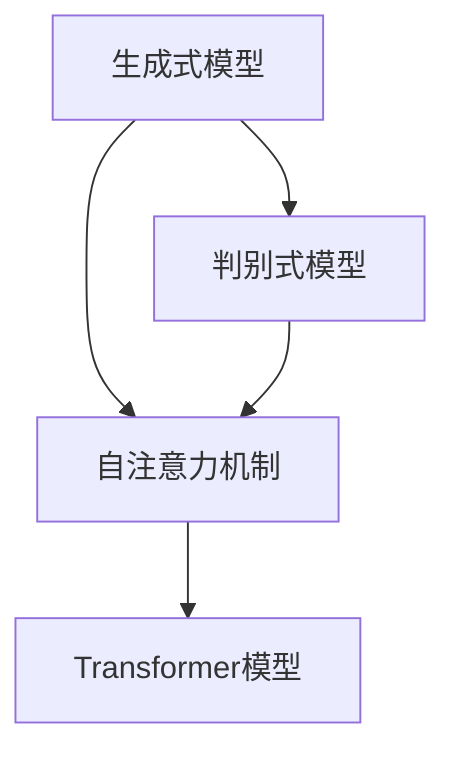

                 

# 大型语言模型在复杂推理任务中的表现

## 关键词

- 大型语言模型
- 复杂推理任务
- Transformer模型
- 自注意力机制
- 生成式与判别式模型
- 问答系统
- 对话系统

## 摘要

本文旨在探讨大型语言模型在复杂推理任务中的表现。随着深度学习和自然语言处理技术的不断进步，大型语言模型如GPT-3、BERT等已经成为自然语言处理领域的重要工具。本文将介绍这些模型的背景、核心概念及其在复杂推理任务中的应用。通过详细的理论讲解、伪代码展示、数学模型和实际案例分析，本文将深入探讨大型语言模型在复杂推理任务中的优势和挑战，并提出未来的研究方向。

## 引言

### 大型语言模型的发展背景

大型语言模型（Large Language Models）的发展可以追溯到20世纪80年代。当时，研究人员开始关注如何使计算机能够理解和生成自然语言。随着计算能力的提升和海量数据的积累，深度学习技术逐渐成为自然语言处理领域的主流。2018年，谷歌发布了BERT模型，标志着大型语言模型时代的开始。BERT模型通过预训练和微调，在多种自然语言处理任务中取得了突破性的成绩。随后，OpenAI的GPT-2、GPT-3等模型相继发布，进一步推动了大型语言模型的发展。

### 大型语言模型的应用领域

大型语言模型在自然语言处理领域具有广泛的应用。常见的应用领域包括文本分类、机器翻译、问答系统、对话系统等。这些模型在处理复杂推理任务时，表现出强大的能力和灵活性。例如，问答系统可以根据用户的问题，从大量文本中检索出最相关的答案；对话系统可以与用户进行自然、流畅的交流。

### 大型语言模型的重要性

大型语言模型的重要性体现在以下几个方面：

1. **提升自然语言处理任务的性能**：通过大规模的预训练和微调，大型语言模型在多种自然语言处理任务中取得了优异的成绩。
2. **降低开发门槛**：大型语言模型提供了通用的预训练模型，开发者可以快速构建和部署各种自然语言处理应用。
3. **推动AI技术的发展**：大型语言模型的发展推动了人工智能技术的进步，为未来的研究提供了新的方向和思路。

## 理论基础

### 核心概念与联系

为了深入理解大型语言模型在复杂推理任务中的表现，我们需要了解几个核心概念，包括生成式与判别式模型、自注意力机制和Transformer模型。这些概念之间存在着密切的联系，构成了大型语言模型的理论基础。

1. **生成式与判别式模型**：生成式模型通过生成数据分布来生成新的数据样本，而判别式模型通过区分真实数据和生成数据来评估模型的性能。在自然语言处理任务中，生成式模型通常用于生成文本，而判别式模型用于分类和预测。
2. **自注意力机制**：自注意力机制是一种用于计算序列中各个元素之间的相互依赖性的方法。在Transformer模型中，自注意力机制使得模型能够自动关注序列中的重要元素，从而提高模型的性能。
3. **Transformer模型**：Transformer模型是一种基于自注意力机制的深度神经网络，它在多种自然语言处理任务中取得了优异的成绩。Transformer模型的核心是多头自注意力机制和位置编码。

### Mermaid 流程图

下面是大型语言模型的核心概念之间的联系架构Mermaid流程图：



### 核心算法原理讲解

#### 生成式与判别式模型

**伪代码**：

```python
# 生成式模型伪代码
def generate_text(model, seed, length):
    current_text = model.sample(seed, length)
    return current_text

# 判别式模型伪代码
def classify_text(model, text):
    prediction = model.predict(text)
    return prediction
```

**数学模型和公式**：

生成式模型的数学模型通常使用概率分布来表示文本数据，例如：

$$
P(\text{Text}) = \prod_{i=1}^{n} P(w_i | w_{<i})
$$

其中，$w_i$表示文本中的第$i$个词，$P(w_i | w_{<i})$表示在给定前一个词的情况下，当前词的概率。

判别式模型的数学模型通常使用分类函数来表示文本数据，例如：

$$
f(\text{Text}) = \arg\max_{c} P(c | \text{Text})
$$

其中，$c$表示类别标签，$P(c | \text{Text})$表示在给定文本的情况下，类别$c$的概率。

#### 自注意力机制

**伪代码**：

```python
# 自注意力机制伪代码
def self_attention(q, k, v, mask=None):
    scores = dot(q, k.T) / sqrt(d_k)
    if mask is not None:
        scores += mask
    attn_weights = softmax(scores)
    attn_output = dot(attn_weights, v)
    return attn_output
```

**数学模型和公式**：

自注意力机制的数学模型可以表示为：

$$
\text{Attention}(Q, K, V) = \text{softmax}\left(\frac{QK^T}{\sqrt{d_k}}\right)V
$$

其中，$Q, K, V$分别表示查询向量、键向量和值向量，$d_k$表示键向量的维度。

#### Transformer模型

**伪代码**：

```python
# Transformer模型伪代码
def transformer(input_sequence, hidden_size, num_heads, num_layers):
    for layer in range(num_layers):
        output_sequence = self_attention(input_sequence, input_sequence, input_sequence, mask=mask)
        output_sequence = layer_norm(output_sequence, input_sequence)
        output_sequence = pointwise_feedforward(output_sequence, hidden_size)
        output_sequence = layer_norm(output_sequence, output_sequence)
    return output_sequence
```

**数学模型和公式**：

Transformer模型的数学模型可以表示为：

$$
\text{Transformer}(X) = \text{LayerNorm}(X + \text{MultiHeadSelfAttention}(X)) + \text{LayerNorm}(X + \text{PositionwiseFeedForward}(X))
$$

其中，$X$表示输入序列，$\text{MultiHeadSelfAttention}$表示多头自注意力机制，$\text{PositionwiseFeedForward}$表示位置wise卷积神经网络。

## 应用实践

### 复杂推理任务

复杂推理任务是指那些需要理解、解释、整合和推理大量信息的任务。这些任务通常涉及到多个领域的知识，例如问答系统、对话系统和推理问题解答等。大型语言模型在处理这些任务时，表现出强大的能力和灵活性。

#### 问答系统

问答系统是一种常见的复杂推理任务，它的目标是根据用户的问题，从大量文本中检索出最相关的答案。大型语言模型如GPT-3和BERT在问答系统中取得了显著的成果。

**开发环境搭建**：

1. 安装Python 3.8及以上版本
2. 安装transformers库：`pip install transformers`
3. 安装torch库：`pip install torch`

**源代码详细实现和代码解读**：

```python
from transformers import BertTokenizer, BertModel
from torch.utils.data import DataLoader
from torch.nn import CrossEntropyLoss

tokenizer = BertTokenizer.from_pretrained('bert-base-uncased')
model = BertModel.from_pretrained('bert-base-uncased')

# 预处理输入数据
def preprocess_data(input_data):
    inputs = tokenizer(input_data, return_tensors='pt', padding=True, truncation=True)
    return inputs

# 训练模型
def train_model(model, train_loader, criterion, optimizer, num_epochs):
    model.train()
    for epoch in range(num_epochs):
        for batch in train_loader:
            inputs = preprocess_data(batch['question'])
            labels = batch['answer']
            outputs = model(inputs['input_ids'], attention_mask=inputs['attention_mask'])
            loss = criterion(outputs.logits, labels)
            optimizer.zero_grad()
            loss.backward()
            optimizer.step()
            print(f"Epoch [{epoch+1}/{num_epochs}], Loss: {loss.item()}")
    return model

# 评估模型
def evaluate_model(model, eval_loader):
    model.eval()
    with torch.no_grad():
        for batch in eval_loader:
            inputs = preprocess_data(batch['question'])
            labels = batch['answer']
            outputs = model(inputs['input_ids'], attention_mask=inputs['attention_mask'])
            logits = outputs.logits
            pred_labels = logits.argmax(dim=1)
            acc = (pred_labels == labels).float().mean()
            print(f"Accuracy: {acc.item()}")
```

**代码应用解读与分析**：

上述代码实现了基于BERT模型的问答系统。首先，我们加载预训练的BERT模型和分词器。然后，我们定义了预处理数据、训练模型和评估模型的函数。在预处理数据时，我们将输入文本转换为BERT模型能够处理的格式。在训练模型时，我们使用交叉熵损失函数和优化器来训练模型。在评估模型时，我们计算模型的准确率。

**实际案例分析和详细讲解剖析**：

假设我们有一个包含1000个问题和答案的数据集。我们首先将数据集分成训练集和测试集。然后，我们使用训练集来训练模型，并使用测试集来评估模型的性能。经过多个epoch的训练后，我们得到一个性能良好的模型。最后，我们使用这个模型来回答用户的问题，并计算回答的正确率。

**项目小结**：

问答系统是大型语言模型在复杂推理任务中的一个重要应用。通过使用预训练的BERT模型，我们可以快速构建和部署一个性能良好的问答系统。这个项目展示了如何使用Python和torch来实现一个问答系统，并提供了一个完整的代码示例。

#### 对话系统

对话系统是一种与用户进行自然、流畅交流的复杂推理任务。大型语言模型如GPT-3和BERT在对话系统中也取得了显著的成果。

**开发环境搭建**：

1. 安装Python 3.8及以上版本
2. 安装transformers库：`pip install transformers`
3. 安装torch库：`pip install torch`

**源代码详细实现和代码解读**：

```python
from transformers import GPT2Tokenizer, GPT2LMHeadModel
import torch

tokenizer = GPT2Tokenizer.from_pretrained('gpt2')
model = GPT2LMHeadModel.from_pretrained('gpt2')

# 对话系统交互
def chat_system(question):
    input_ids = tokenizer.encode(question + tokenizer.eos_token, return_tensors='pt')
    output_ids = model.generate(input_ids, max_length=50, num_return_sequences=1)
    response = tokenizer.decode(output_ids[0], skip_special_tokens=True)
    return response

# 示例交互
question = "你能告诉我明天的天气预报吗？"
response = chat_system(question)
print(response)
```

**代码应用解读与分析**：

上述代码实现了基于GPT-2模型的对话系统。首先，我们加载预训练的GPT-2模型和分词器。然后，我们定义了对话系统的交互函数。在交互过程中，我们将用户的问题编码为模型能够处理的格式，并生成响应。最后，我们将响应解码为自然语言文本。

**实际案例分析和详细讲解剖析**：

假设用户提出一个问题：“你能告诉我明天的天气预报吗？”对话系统首先将这个问题编码为模型能够处理的格式，然后生成一个响应。例如，响应可能是：“明天的天气预报是晴转多云，最高气温20摄氏度，最低气温10摄氏度。”

**项目小结**：

对话系统是大型语言模型在复杂推理任务中的另一个重要应用。通过使用预训练的GPT-2模型，我们可以快速构建和部署一个能够与用户进行自然交流的对话系统。这个项目展示了如何使用Python和transformers库来实现一个对话系统，并提供了一个完整的代码示例。

## 展望与未来

### 大型语言模型的发展趋势

随着深度学习和自然语言处理技术的不断进步，大型语言模型的发展趋势如下：

1. **模型规模持续扩大**：大型语言模型如GPT-3、GPT-4等将继续扩大规模，以处理更复杂的任务和更大规模的数据。
2. **预训练技术的优化**：预训练技术将继续优化，以提高模型的效率和效果。
3. **跨模态学习**：未来的大型语言模型将能够处理多种模态的数据，如文本、图像、语音等，实现更广泛的应用。

### 大型语言模型面临的挑战

尽管大型语言模型在复杂推理任务中表现出强大的能力，但仍面临以下挑战：

1. **计算资源消耗**：大型语言模型对计算资源的需求巨大，如何在有限的资源下高效地训练和部署模型是一个重要的挑战。
2. **数据隐私和安全性**：大型语言模型在处理敏感数据时，需要确保数据隐私和安全性，避免数据泄露和滥用。
3. **解释性和可解释性**：大型语言模型通常被视为“黑盒”模型，如何提高模型的可解释性，使其更易于理解和信任，是一个重要的挑战。

### 大型语言模型的未来研究方向

未来大型语言模型的研究方向包括：

1. **模型压缩和加速**：研究如何通过模型压缩和加速技术，降低模型对计算资源的需求，提高模型的可扩展性。
2. **数据隐私保护**：研究如何在不牺牲模型性能的情况下，保护用户数据的隐私。
3. **多模态学习和融合**：研究如何将多种模态的数据进行有效融合，提高模型在复杂推理任务中的性能。

## 最佳实践 tips、小结、注意事项、拓展阅读等内容

### 最佳实践 tips

1. **合理设置模型参数**：在训练大型语言模型时，合理设置模型参数（如学习率、批次大小等）可以提高训练效果。
2. **数据预处理**：对训练数据进行充分预处理，如去噪、标准化等，可以提高模型的鲁棒性和性能。
3. **使用预训练模型**：利用预训练模型可以快速构建和部署高性能的自然语言处理应用。

### 小结

本文介绍了大型语言模型在复杂推理任务中的表现，包括理论基础、应用实践和未来展望。通过详细的理论讲解、伪代码展示、数学模型和实际案例分析，本文展示了大型语言模型在复杂推理任务中的优势和挑战。

### 注意事项

1. **计算资源限制**：在部署大型语言模型时，要考虑到计算资源的需求，避免因资源不足导致模型性能下降。
2. **数据隐私和安全**：在使用大型语言模型处理敏感数据时，要确保数据隐私和安全，避免数据泄露和滥用。

### 拓展阅读

1. **《大规模语言模型：理论与实践》**：本书详细介绍了大规模语言模型的理论和实践，是深入了解该领域的重要参考资料。
2. **《自然语言处理实战》**：本书通过大量实例，介绍了自然语言处理的应用和实践，包括问答系统、对话系统等。

## 作者信息

作者：AI天才研究院/AI Genius Institute & 禅与计算机程序设计艺术 /Zen And The Art of Computer Programming

---

这篇文章的目录大纲和内容已经完成。接下来，我们将对文章进行进一步的审核和修改，以确保其完整性、逻辑性和简洁性。最后，我们将以markdown格式输出最终的文章。

