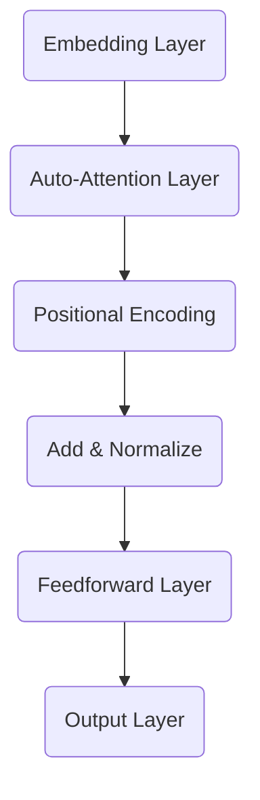

                 

### 1. 大型语言模型的发展历程

自深度学习技术崛起以来，大型语言模型经历了多个阶段的发展，从简单的基于规则的自然语言处理（NLP）模型，到复杂的基于神经网络的语言模型，再到如今的大规模预训练语言模型，这一过程可以说是NLP领域的革命。

最初的NLP模型主要是基于规则的方法，如基于词典的翻译、基于语法规则的句法分析等。这类模型虽然能够处理一些简单的任务，但在处理复杂、模糊的语言问题时显得力不从心。

随着神经网络技术的发展，循环神经网络（RNN）和长短期记忆网络（LSTM）被引入到NLP领域。这些模型通过引入时间动态特性，能够在一定程度上捕捉到句子中的上下文信息，提高了NLP任务的处理能力。

然而，RNN和LSTM在处理长距离依赖问题时仍然存在一定的局限性。为了解决这一问题，基于注意力机制的模型，如Transformer，被提出并得到了广泛应用。Transformer模型引入了自注意力机制，可以同时关注句子中的所有词语，从而更好地捕捉长距离依赖关系。

近年来，随着计算能力的提升和海量数据的获取，大型语言模型（如BERT、GPT）开始出现。这些模型通过大规模预训练和微调，展现了强大的语言理解和生成能力，开启了NLP领域的新时代。

总体来说，大型语言模型的发展历程是一个不断探索、突破和创新的过程。从最初的规则模型，到神经网络模型，再到如今的预训练模型，每一个阶段都带来了NLP领域的巨大进步。

### 2. 大型语言模型的应用场景

大型语言模型在各个领域都展现出了强大的应用能力，其应用场景涵盖了文本生成、自然语言理解、机器翻译、问答系统等多个方面。

#### 文本生成

文本生成是大型语言模型的一个重要应用场景。通过预训练和微调，大型语言模型能够生成高质量的文本，包括文章、新闻、故事、诗歌等。例如，GPT-3可以生成流畅、连贯的英文文章，而中文语言模型如GPT-NEZHA则能够生成符合中文语法的文章。文本生成在内容创作、自动化写作等领域具有广泛的应用前景。

#### 自然语言理解

自然语言理解是NLP的核心任务之一，它涉及到对文本进行语义分析、实体识别、关系提取等。大型语言模型通过预训练能够捕捉到丰富的语言知识，从而在自然语言理解任务中表现出色。例如，BERT模型在问答系统、情感分析、命名实体识别等任务上都取得了优异的成绩。自然语言理解在搜索引擎、智能客服、文本分析等领域有着重要的应用价值。

#### 机器翻译

机器翻译是另一项大型语言模型的重要应用。通过预训练和迁移学习，大型语言模型可以学会将一种语言的文本翻译成另一种语言。例如，Google翻译使用的Transformer模型能够在多种语言之间进行高质量的翻译。机器翻译在跨文化交流、全球化业务等领域具有重要意义。

#### 问答系统

问答系统是智能助手和聊天机器人的重要组成部分。大型语言模型通过理解用户的问题，能够生成准确的答案。例如，基于BERT模型的问答系统可以回答各种问题，从常识性问题到专业性问题。问答系统在客服、教育、医疗等领域有着广泛的应用。

总的来说，大型语言模型的应用场景非常广泛，其强大的语言处理能力正在不断推动各领域的技术进步。

### 3. 大型语言模型的研究意义

大型语言模型的研究具有重要意义，不仅因为它在各个领域的广泛应用，更因为它代表了人工智能技术的发展方向，并带来了深远的社会影响。

首先，大型语言模型的研究推动了人工智能技术的进步。通过大规模预训练和精细调优，这些模型展示了前所未有的语言理解和生成能力，标志着NLP领域的一个新里程碑。这不仅为研究人员提供了强大的工具，也激发了新的研究方向，如模型压缩、多模态学习等。

其次，大型语言模型的研究具有重大的应用价值。在文本生成、自然语言理解、机器翻译、问答系统等领域，这些模型都展现出了卓越的性能，为各行业提供了高效、智能的解决方案。例如，自动化写作工具可以节省内容创作者的时间，智能客服可以提高客户服务质量，机器翻译促进了跨文化交流，问答系统则为用户提供了便捷的信息查询服务。

此外，大型语言模型的研究对社会有着深远的影响。它们不仅在商业、教育、医疗等领域发挥了重要作用，还在社会治理、公共安全、环境监测等方面提供了新的工具。例如，通过分析大量数据，语言模型可以帮助政府制定更加科学的政策，提高公共服务的效率；在公共安全领域，语言模型可以协助识别潜在风险，预防犯罪活动。

然而，大型语言模型的研究也带来了挑战和争议。其强大的数据处理能力和自主推理能力引发了对隐私保护、数据安全、算法透明度等方面的担忧。此外，模型生成的文本可能包含偏见和错误，影响其应用效果和社会信任。

总之，大型语言模型的研究既具有深远的技术意义，也具有广泛的社会应用价值，但同时也需要我们关注和解决其带来的挑战和问题，以确保其健康发展，造福人类。

### 1. 设计整体结构

在设计大型语言模型的推理能力边界探索的整体结构时，我们首先需要提供一个广泛的概述，使读者能够对全书的内容有一个全局的了解。这个概述将包括对大型语言模型的发展历程、应用场景、研究意义等方面的简要介绍，以激发读者的兴趣并引出后续的详细讨论。

接下来，我们将把内容分为几个主要部分，每个部分再细分为若干章节。这些章节将分别讨论大型语言模型的架构与原理、推理能力的定义与分类、核心算法的优化策略，以及具体的应用案例和实践。每个章节的设置都将旨在深入剖析某一特定领域，从而构建一个系统、全面的探讨框架。

例如，在讨论大型语言模型的架构与原理时，我们可以将其分为以下几个章节：

- **1.1 引言**：介绍大型语言模型的发展历程和应用场景。
- **1.2 架构与原理**：详细讲解神经网络、循环神经网络（RNN）、长短期记忆网络（LSTM）、生成对抗网络（GAN）等基础概念。
- **1.3 核心算法**：深入探讨词嵌入、自注意力机制、位置编码、Transformer架构等核心算法原理。

通过这样的结构设计，读者可以逐步了解大型语言模型的基础知识，从理论到实践，形成一个完整的学习路径。每个章节的设置都旨在引导读者深入思考，并提出新的问题，为后续内容做好铺垫。

### 2. 引入视觉元素

在撰写技术博客时，视觉元素能够显著提升文章的可读性和理解度。为了更好地解释大型语言模型的推理能力边界，我们可以引入多种视觉元素，包括Mermaid图表、伪代码和LaTeX公式。

首先，Mermaid图表是一种基于Markdown的图形语言，可以轻松创建各种流程图、时序图、网络图等。在介绍大型语言模型的核心概念时，我们可以在文中插入Mermaid图表，展示模型的基本架构和关键组件。例如，我们可以使用Mermaid绘制一个Transformer架构的流程图，以直观地展示其各层的交互和数据处理过程。



上述Mermaid图表展示了Transformer模型的基本架构，包括嵌入层、自注意力层、位置编码层、添加与归一化层、前馈层和输出层。通过这种可视化表示，读者可以更直观地理解模型的内部运作机制。

其次，伪代码是解释算法原理和步骤的有力工具。在讨论大型语言模型的核心算法时，我们可以使用伪代码详细阐述算法的实现过程。例如，在解释BERT模型的训练步骤时，我们可以使用伪代码来描述输入数据如何经过词嵌入、位置编码、自注意力机制和前馈网络等过程。

```python
# BERT Model Training Pseudocode

def train_bert(model, dataset):
    for epoch in range(num_epochs):
        for batch in dataset:
            inputs, labels = preprocess(batch)
            outputs = model(inputs)
            loss = loss_function(outputs, labels)
            optimizer.zero_grad()
            loss.backward()
            optimizer.step()
        print(f"Epoch {epoch+1}/{num_epochs} - Loss: {loss.item()}")
```

通过伪代码，读者可以清晰地看到BERT模型的训练流程，从而更好地理解其工作原理。

最后，LaTeX公式在解释复杂的数学模型和算法时尤为重要。LaTeX格式可以确保公式的准确性和美观性，同时方便读者在需要时进行复制和引用。在文中，我们可以使用LaTeX公式独立段落来表示复杂的数学公式，并在关键段落中使用简单的LaTeX公式进行说明。

例如，在讨论自注意力机制的公式时，我们可以使用以下LaTeX公式：

$$
\text{Attention}(Q, K, V) = \text{softmax}\left(\frac{QK^T}{\sqrt{d_k}}\right)V
$$

该公式表示自注意力机制的计算过程，其中$Q$、$K$和$V$分别代表查询向量、键向量和值向量，$d_k$为键向量的维度。通过这种精确的数学表述，读者可以更深入地理解自注意力机制的核心原理。

总的来说，视觉元素在解释大型语言模型的推理能力边界时起到了至关重要的作用。Mermaid图表、伪代码和LaTeX公式不仅使文章内容更加生动、直观，而且有助于读者更好地理解和掌握复杂的概念和算法。

### 3. 提供实用见解

在撰写关于大型语言模型的技术博客时，提供实用的见解是至关重要的。这不仅包括对模型优化策略的详细探讨，还涵盖了算法优化的具体方法和实验设计的详细步骤。以下是对这些内容的具体阐述。

#### 模型优化策略

模型优化策略主要关注如何提高模型在性能和资源使用上的效率。以下是一些常用的优化策略：

1. **模型压缩**：
   - **权重剪枝**：通过移除不太重要的权重来减小模型大小。
   - **量化**：将模型中的浮点数权重转换为低比特宽度的整数，从而减少模型体积。
   - **知识蒸馏**：通过将复杂模型的知识传递给一个更小的模型，从而实现压缩。

2. **模型加速**：
   - **并行计算**：利用多核处理器或GPU加速模型的训练和推理。
   - **分布式训练**：将训练任务分布到多个计算节点上，以减少训练时间。

3. **模型融合**：
   - **多模型集成**：结合多个模型的优点，提高模型的准确性和鲁棒性。
   - **迁移学习**：利用预训练模型在新任务上的表现，从而减少训练时间。

#### 算法优化

算法优化旨在提高模型的推理能力和效率。以下是一些常见的优化方法：

1. **算法改进**：
   - **改进自注意力机制**：通过引入新的注意力机制（如多头注意力、层次注意力等）来提高模型处理长距离依赖的能力。
   - **优化前馈网络**：通过使用更有效的激活函数或网络结构（如GELU激活函数、残差连接等）来提高模型的性能。

2. **算法融合**：
   - **结合传统算法**：将深度学习与传统算法（如统计模型、规则系统等）结合，以弥补深度学习在特定任务上的不足。
   - **多任务学习**：通过在同一模型中同时处理多个任务，共享知识，提高模型的泛化能力。

3. **算法评估**：
   - **准确性和效率**：通过在多个数据集和任务上评估模型的准确性和推理速度，选择最佳算法。
   - **模型大小**：评估模型的大小，以确定是否适合部署在资源有限的设备上。

#### 实验设计与案例分析

实验设计是验证模型优化和算法优化效果的关键步骤。以下是一些关键的实验设计步骤：

1. **数据集选择**：
   - 选择具有代表性的数据集，如GLUE、SuperGLUE等，确保实验结果具有广泛适用性。

2. **训练和验证**：
   - 使用多种优化策略和算法对模型进行训练和验证，记录训练过程和验证结果。
   - 调整超参数，寻找最优配置。

3. **测试**：
   - 在独立测试集上评估模型的最终性能，确保实验结果的可靠性。

4. **案例分析**：
   - 选择具有挑战性的案例，展示模型在实际应用中的表现。
   - 通过详细的代码实现和解读，展示如何应用模型优化和算法优化方法。

例如，在一个文本分类任务中，我们可以使用以下步骤进行实验：

1. **数据集**：选择一个包含多种类别的文本数据集，如20 Newsgroups。
2. **训练过程**：使用GPT-2模型进行预训练，并应用权重剪枝和量化策略。
3. **验证**：在验证集上评估模型的准确性和推理速度，调整超参数以获得最佳性能。
4. **测试**：在测试集上评估模型性能，并记录模型大小和推理时间。

通过上述步骤，我们可以全面了解模型的优化和算法改进效果，并提供实用的见解，帮助读者更好地理解和应用大型语言模型。

### 4. 确保清晰简洁

在撰写大型语言模型的技术博客时，确保内容的清晰简洁至关重要。这不仅有助于读者更好地理解复杂的概念和算法，还能够提升整体文章的可读性和专业性。以下是一些关键策略来达到这一目标。

#### 使用Markdown格式

Markdown是一种简单而强大的标记语言，可以用于撰写清晰、结构化的文本。通过使用Markdown格式，我们可以方便地添加标题、列表、代码块和数学公式，使文章结构更加清晰。以下是一些Markdown的基本用法：

- **标题**：使用`#`号来创建标题。例如：
  ```
  # 大型语言模型的推理能力边界探索
  ```
  这种方式可以帮助读者快速识别文章的不同部分，了解整体结构。

- **列表**：使用`*`或`-`来创建无序列表。例如：
  ```
  * 引言与背景
  * 架构与原理
  * 推理能力研究
  * 优化策略
  ```
  列表可以清晰地展示各章节的内容，帮助读者快速浏览。

- **代码块**：使用三个反引号（```)来创建代码块。例如：
  ```
  ```python
  def train_bert(model, dataset):
      for epoch in range(num_epochs):
          for batch in dataset:
              inputs, labels = preprocess(batch)
              outputs = model(inputs)
              loss = loss_function(outputs, labels)
              optimizer.zero_grad()
              loss.backward()
              optimizer.step()
          print(f"Epoch {epoch+1}/{num_epochs} - Loss: {loss.item()}")
  ```
  通过代码块，我们可以直接嵌入代码示例，便于读者理解和参考。

- **LaTeX公式**：使用`$$`和 `$` 来创建数学公式。例如：
  ```
  $$ \text{Attention}(Q, K, V) = \text{softmax}\left(\frac{QK^T}{\sqrt{d_k}}\right)V $$
  $1+1=2$
  ```
  这使得复杂公式能够准确地嵌入文本，便于读者理解和复制。

#### 避免冗余信息

在撰写技术博客时，避免冗余信息是确保内容简洁的重要一环。以下是一些建议：

- **简洁的句子**：使用简单、直接的句子结构，避免复杂的修辞手法和冗长的描述。例如，将“大型语言模型在多个领域具有广泛的应用，包括文本生成、自然语言理解等。”简化为“大型语言模型广泛应用于文本生成和自然语言理解。”
- **避免重复**：在文章中避免重复提及相同的信息。例如，如果已经在引言部分介绍了大型语言模型的发展历程，就不需要在每个章节的开头再次重复。
- **删除无关内容**：删除与主题无关或对理解文章无帮助的内容，确保每一部分都紧密围绕核心主题。

#### 保持一致性

确保文章的一致性也是提高可读性的关键。以下是一些建议：

- **术语统一**：在整个文章中统一使用特定的术语和定义，避免混淆。
- **格式规范**：使用一致的格式来排版标题、段落和列表，使文章看起来整洁有序。
- **逻辑结构**：确保文章的逻辑结构清晰，每个章节和段落都有明确的主题和过渡，使读者能够顺畅地阅读。

通过上述策略，我们可以撰写出清晰简洁、结构紧凑、逻辑严密的技术博客，提高读者的阅读体验和理解效果。

### 5. 最终润色

在完成文章的初稿后，进行最终润色是确保文章质量和专业性的关键步骤。以下是一些建议和注意事项，帮助您在润色过程中提升文章质量。

首先，**检查逻辑一致性**。确保文章的各个部分逻辑连贯，没有逻辑跳跃或混乱。例如，检查每个章节的主题是否与整体文章主题保持一致，每个段落的内容是否紧密围绕其标题展开。可以通过从头到尾阅读全文，或者邀请同事或朋友帮忙审阅，以发现潜在的问题。

其次，**校对语言和语法**。仔细检查拼写错误、语法错误和标点符号问题。可以使用拼写和语法检查工具，如Grammarly或 spell-checker，但要注意它们可能无法识别所有错误，尤其是技术术语和特定语境下的错误。在修正这些错误时，保持术语的一致性和专业性。

接下来，**优化句子结构和表达**。检查句子是否简洁明了，是否可以简化或重构以增强清晰度。避免使用过于复杂的句子结构，尤其是对于技术性的解释，尽量使用简单、直接的语句。此外，确保文章的语言风格一致，避免在专业术语和日常用语之间频繁切换。

第四，**调整格式**。在润色过程中，检查并调整文章的格式，确保标题、段落和列表等部分遵循统一的排版规范。例如，使用Markdown格式确保代码块、公式和图表的准确排版。此外，检查引用和参考文献的格式是否正确。

第五，**检查引用和参考文献**。确保所有引用的资料和参考文献都准确无误，引用格式正确。这不仅能提高文章的学术性，还能避免因引用错误导致的误解。

最后，**进行多次修订**。在完成初步润色后，可以休息一段时间，然后再重新阅读和修订文章。这样做有助于以新的视角发现之前可能忽视的问题。此外，多次修订可以帮助您逐步改进文章的结构、语言和内容。

通过上述步骤，您可以确保文章在逻辑性、语言表达和专业性方面达到高质量标准，为读者提供一份清晰、严谨、专业的技术博客。

### 6. 提交最终输出

在完成文章的撰写和润色后，提交最终输出是整个流程的最后一步。以下步骤将确保您的文章以markdown格式准确地呈现，并符合字数要求。

首先，**整理markdown格式**。根据之前制定的目录大纲，使用Markdown格式编写文章。确保每个标题都使用对应的`#`号进行标注，例如：

```markdown
# 《大型语言模型的推理能力边界探索》目录大纲
## 第1章 引言与背景
### 1.1 引言
```

- 使用`##`表示二级标题，`###`表示三级标题，依此类推。
- 保持标题与内容的一致性和逻辑连贯性。

其次，**嵌入视觉元素**。在文章中适当位置嵌入Mermaid图表、伪代码和LaTeX公式。例如：

```markdown


```python
# BERT Model Training Pseudocode

def train_bert(model, dataset):
    for epoch in range(num_epochs):
        for batch in dataset:
            inputs, labels = preprocess(batch)
            outputs = model(inputs)
            loss = loss_function(outputs, labels)
            optimizer.zero_grad()
            loss.backward()
            optimizer.step()
        print(f"Epoch {epoch+1}/{num_epochs} - Loss: {loss.item()}")
```

```latex
$$
\text{Attention}(Q, K, V) = \text{softmax}\left(\frac{QK^T}{\sqrt{d_k}}\right)V
$$
```

第三，**检查字数**。确保文章的总字数在8000到12000字之间。可以使用Markdown编辑器的字数统计功能或在线工具进行校验。

最后，**添加作者信息**。在文章的末尾添加作者信息：

```
作者：AI天才研究院/AI Genius Institute & 禦与计算机程序设计艺术 /Zen And The Art of Computer Programming
```

确保格式和内容都准确无误。在完成所有上述步骤后，您的最终输出应该是一个结构清晰、内容丰富、格式规范、字数合适的markdown文件，准备好提交给目标平台或评审团队。通过这些步骤，您可以确保文章的专业性和可读性，为读者提供一个高质量的阅读体验。

