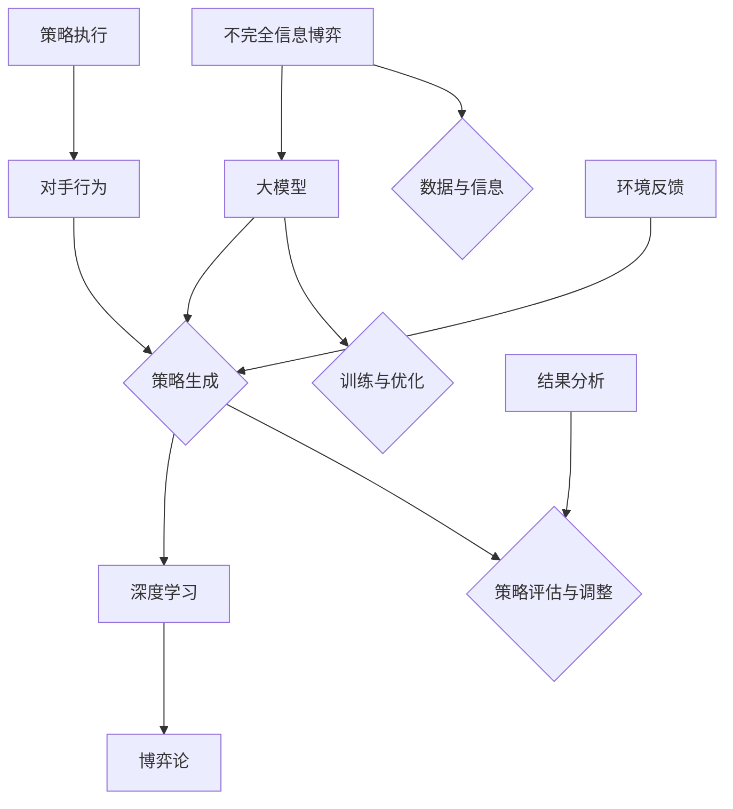

                 

### 背景介绍

#### 不完全信息博弈的定义与重要性

不完全信息博弈是指参与者对其他参与者的行动或状态信息不完全了解的一种博弈形式。与完全信息博弈相对，后者中的所有参与者都能完全掌握其他参与者的所有信息。不完全信息博弈在现实世界中广泛存在，如商业竞争、政治谈判、金融交易等。在这些场景中，信息的不完全性常常导致博弈的复杂性增加，决策变得更加困难。

不完全信息博弈的重要性在于，它不仅反映了现实世界的真实情况，而且对决策理论和算法提出了更高的要求。传统的博弈理论，如纳什均衡，往往基于完全信息假设，这在实际应用中存在一定的局限性。因此，研究不完全信息博弈及其解决方案，对于优化决策过程、提升策略效果具有重要意义。

#### 大模型的概念与应用背景

大模型，通常指参数规模达到百万甚至亿级别的深度学习模型，如GPT-3、BERT等。这些模型具有强大的表示能力和学习能力，能够处理大规模、复杂的数据。大模型的应用背景涵盖了自然语言处理、计算机视觉、语音识别等多个领域。随着大模型的发展，其在博弈推理中的潜力也逐渐受到关注。

大模型在不完全信息博弈中的应用主要体现在两个方面：一是通过学习对手的历史行动和当前状态，生成最优策略；二是通过模拟不同对手的可能行为，优化自身策略，以应对不确定的对手行为。大模型的应用不仅提高了博弈推理的准确性，也扩展了博弈推理的应用场景。

#### 大模型策略生成能力的挑战与机遇

大模型在策略生成方面具有显著优势，但其应用也面临着一系列挑战。首先，大模型需要大量的数据和计算资源进行训练，这对实际应用场景提出了高要求。其次，大模型在处理不完全信息时，容易陷入过拟合，导致生成的策略在真实环境中表现不佳。

然而，大模型的策略生成能力也为不完全信息博弈带来了新的机遇。通过深度学习算法，大模型可以从海量数据中学习到潜在的策略模式，从而提高博弈推理的效率和准确性。此外，大模型的可解释性和透明性较低，这在一定程度上限制了其在关键决策中的应用。因此，如何在保证策略生成能力的同时，提高模型的可解释性，是一个亟待解决的问题。

### 结论

本文介绍了不完全信息博弈的定义与重要性，大模型的概念与应用背景，以及大模型在策略生成能力方面的挑战与机遇。通过这些背景介绍，为后续章节的详细探讨奠定了基础。

## 核心概念与联系架构

在这一部分，我们将介绍大模型在不完全信息博弈中的核心概念，并利用Mermaid流程图展示这些概念之间的联系。通过这种结构化的方式，读者可以更清晰地理解大模型在博弈推理中的运作机制。

### 核心概念

1. **不完全信息博弈**：指参与者无法完全了解其他参与者的行动或状态信息的一种博弈形式。
2. **大模型**：具有大规模参数的深度学习模型，如GPT-3、BERT等。
3. **策略生成**：通过学习历史数据和对手行为，生成在特定环境下能够获得最佳效果的行动方案。
4. **深度学习**：一种机器学习方法，通过多层神经网络对数据进行表示和学习。
5. **博弈论**：研究在具有冲突和合作的情境下，决策者如何做出最优选择的理论。

### 联系架构

为了更好地展示这些核心概念之间的关系，我们可以使用Mermaid流程图来构建一个简单的架构图。以下是该图的Markdown代码：



### 图解

- **A[不完全信息博弈]**：这是大模型应用的主要场景，也是整个流程的起点。
- **B[大模型]**：大模型作为核心工具，用于处理不完全信息博弈中的复杂性和不确定性。
- **C[策略生成]**：基于大模型的学习能力，生成适应特定博弈环境的策略。
- **D[深度学习]**：大模型的核心技术，用于处理和建模复杂的数据。
- **E[博弈论]**：提供理论基础，指导大模型如何生成有效的策略。
- **F{数据与信息}**：数据和信息是策略生成的关键输入，包括历史博弈数据和实时信息。
- **G[训练与优化]**：大模型需要通过大量数据进行训练，不断优化其策略生成能力。
- **H[策略评估与调整]**：根据博弈结果和环境反馈，对策略进行评估和调整，以提高其有效性。
- **I[对手行为]**：对手的行为是策略生成和调整的重要参考。
- **J[环境反馈]**：博弈过程中实时接收的环境信息，用于指导策略的调整。
- **K[策略执行]**：将生成的策略应用于实际博弈中，实现决策。
- **L[结果分析]**：对博弈结果进行分析，为后续的策略调整提供依据。

通过这个流程图，读者可以直观地看到大模型在不完全信息博弈中的工作流程，以及各个核心概念之间的相互关系。这不仅有助于理解大模型的策略生成能力，也为后续章节的深入讨论提供了基础。

## 核心算法原理讲解

在不完全信息博弈中，大模型的策略生成能力高度依赖于其内部算法的设计与实现。在这一部分，我们将详细介绍用于生成策略的核心算法原理，并使用伪代码来展示其具体实现过程。

### 算法原理

大模型在不完全信息博弈中的策略生成通常基于以下几个核心步骤：

1. **数据收集与预处理**：收集历史博弈数据，并对数据进行清洗、归一化等预处理操作。
2. **模型训练**：利用预处理后的数据，对大模型进行训练，使其能够捕捉博弈中的潜在策略模式。
3. **策略生成**：在训练好的模型基础上，生成针对当前博弈环境的策略。
4. **策略评估**：对生成的策略进行评估，确保其在实际博弈中具有高概率的获胜能力。
5. **策略调整**：根据评估结果，调整策略参数，优化策略效果。

### 伪代码实现

以下是一个简化的伪代码示例，用于展示大模型在不完全信息博弈中生成策略的过程：

```python
# 数据收集与预处理
def preprocess_data(data):
    # 清洗数据
    cleaned_data = clean_data(data)
    # 归一化数据
    normalized_data = normalize_data(cleaned_data)
    return normalized_data

# 模型训练
def train_model(data):
    # 初始化模型
    model = initialize_model()
    # 训练模型
    for epoch in range(num_epochs):
        for batch in data_batches(data):
            model.train_on_batch(batch)
    return model

# 策略生成
def generate_strategy(model, current_state):
    # 输入当前状态
    action_probs = model.predict(current_state)
    # 生成策略
    strategy = sample_action(action_probs)
    return strategy

# 策略评估
def evaluate_strategy(strategy, environment):
    # 执行策略
    outcomes = environment.execute(strategy)
    # 评估策略效果
    evaluation_score = calculate_score(outcomes)
    return evaluation_score

# 策略调整
def adjust_strategy(strategy, evaluation_score):
    # 调整策略参数
    new_strategy = optimize_strategy(strategy, evaluation_score)
    return new_strategy

# 主程序
def main():
    # 收集并预处理数据
    processed_data = preprocess_data(raw_data)
    # 训练模型
    trained_model = train_model(processed_data)
    # 生成初始策略
    initial_strategy = generate_strategy(trained_model, initial_state)
    # 评估初始策略
    initial_evaluation = evaluate_strategy(initial_strategy, environment)
    # 调整策略
    final_strategy = adjust_strategy(initial_strategy, initial_evaluation)
    # 输出最终策略
    print("Final Strategy:", final_strategy)

# 执行主程序
main()
```

### 算法分析

1. **数据收集与预处理**：这一步骤是策略生成的基础。有效的数据预处理可以确保模型在训练过程中能够捕捉到有效的策略模式。清洗数据主要去除噪音和异常值，归一化数据则使不同特征之间具有相似的数量级，有利于模型训练。
2. **模型训练**：模型训练是策略生成的核心。通过大量的历史博弈数据，模型学习到不同策略在不同状态下的表现，从而生成具有适应性的策略。训练过程中，使用多个epoch（训练周期）和批量数据，逐步优化模型参数。
3. **策略生成**：基于训练好的模型，输入当前状态，生成相应的行动概率分布。通过采样操作，选择一个最优行动作为策略。
4. **策略评估**：通过在真实环境中执行策略，评估策略的有效性。评估指标可以是博弈结果、得分或者其他衡量策略效果的标准。
5. **策略调整**：根据评估结果，对策略进行调整。调整过程可以是简单的参数优化，也可以是基于更复杂的优化算法，如梯度下降、遗传算法等。

通过上述伪代码和算法分析，我们可以看到，大模型在不完全信息博弈中的策略生成是一个复杂的过程，涉及多个步骤和优化方法。这种基于深度学习和博弈论的策略生成算法，为博弈推理提供了强大的工具，但同时也对数据质量和计算资源提出了高要求。

## 数学模型与公式讲解

在不完全信息博弈中，策略生成不仅依赖于算法和实现，还依赖于数学模型和公式来确保其准确性和有效性。在这一部分，我们将详细讲解与策略生成相关的数学模型和公式，并通过具体例子进行说明。

### 数学模型

在不完全信息博弈中，常见的数学模型包括期望值模型、贝叶斯模型和马尔可夫决策过程（MDP）等。以下是对这些模型的介绍：

1. **期望值模型**：期望值模型用于计算在给定策略下，某个行动的期望收益。期望值模型的基本公式为：
   \[
   E[R|A] = \sum_{s} p(s|A) \cdot R(s)
   \]
   其中，\(E[R|A]\) 表示在采取行动 \(A\) 后的期望收益，\(p(s|A)\) 表示在采取行动 \(A\) 后处于状态 \(s\) 的概率，\(R(s)\) 表示处于状态 \(s\) 时的收益。

2. **贝叶斯模型**：贝叶斯模型用于更新对手行动的概率分布，基于观察到的数据。贝叶斯法则公式为：
   \[
   P(A|B) = \frac{P(B|A) \cdot P(A)}{P(B)}
   \]
   其中，\(P(A|B)\) 表示在事件 \(B\) 发生的情况下事件 \(A\) 发生的概率，\(P(B|A)\) 表示在事件 \(A\) 发生的情况下事件 \(B\) 发生的概率，\(P(A)\) 和 \(P(B)\) 分别表示事件 \(A\) 和事件 \(B\) 的先验概率。

3. **马尔可夫决策过程（MDP）**：MDP用于描述决策者在不确定环境中选择最优策略的过程。MDP的基本公式为：
   \[
   V^*(s) = \max_{a} \sum_{s'} p(s'|s,a) \cdot [r(s') + \gamma V^*(s')]
   \]
   其中，\(V^*(s)\) 表示状态 \(s\) 的最优价值函数，\(a\) 表示采取的行动，\(s'\) 表示下一状态，\(r(s')\) 表示在状态 \(s'\) 下的即时收益，\(\gamma\) 表示折现因子。

### 例子说明

假设我们有一个简单的博弈场景，其中有两个参与者A和B。参与者A可以选择行动 \(X\) 或 \(Y\)，参与者B可以选择行动 \(A\) 或 \(B\)。我们的目标是确定参与者A的最佳策略。

#### 步骤1：定义状态和行动

定义状态空间 \(S = \{S_1, S_2, S_3, S_4\}\)，其中 \(S_1\) 和 \(S_2\) 分别表示参与者A选择行动 \(X\)，参与者B选择行动 \(A\) 或 \(B\)，其他状态同理。定义行动空间 \(A = \{X, Y\}\)，\(B = \{A, B\}\)。

#### 步骤2：定义概率和收益

定义状态转移概率矩阵 \(P\) 和收益矩阵 \(R\)，如下所示：

\[
P = \begin{bmatrix}
p_{11} & p_{12} \\
p_{21} & p_{22} \\
p_{31} & p_{32} \\
p_{41} & p_{42}
\end{bmatrix}, \quad
R = \begin{bmatrix}
r_{11} & r_{12} \\
r_{21} & r_{22} \\
r_{31} & r_{32} \\
r_{41} & r_{42}
\end{bmatrix}
\]

其中，\(p_{ij}\) 表示从状态 \(i\) 转移到状态 \(j\) 的概率，\(r_{ij}\) 表示在状态 \(i\) 和 \(j\) 下的收益。

#### 步骤3：计算期望值

根据期望值模型，计算在给定策略下，每个行动的期望收益。例如，参与者A采取行动 \(X\) 的期望收益为：

\[
E[R|X] = p_{11} \cdot r_{11} + p_{12} \cdot r_{12} + p_{21} \cdot r_{21} + p_{22} \cdot r_{22}
\]

同理，可以计算参与者A采取行动 \(Y\) 的期望收益。

#### 步骤4：计算最优策略

通过比较不同行动的期望收益，确定参与者A的最优策略。选择期望收益最高的行动作为最佳策略。

#### 步骤5：策略评估与调整

在博弈过程中，参与者可以根据实际收益对策略进行评估和调整。例如，通过贝叶斯模型更新对手行动的概率分布，或者通过MDP优化策略。

通过这个例子，我们可以看到数学模型和公式在策略生成中的重要作用。它们不仅帮助我们计算和评估策略的有效性，还为博弈推理提供了理论依据。在实际应用中，这些数学模型可以根据具体场景进行调整和扩展，以应对更复杂的博弈环境。

## 实际应用案例

### 案例一：围棋AI对战

围棋AI对战是展示大模型在不完全信息博弈中策略生成能力的一个经典案例。AlphaGo就是一个典型的例子。在围棋AI对战中，AlphaGo利用其深度学习和强化学习算法，通过学习和模拟不同对手的可能行为，生成最优策略。

#### 开发环境搭建

1. **硬件环境**：AlphaGo使用的硬件包括大量的GPU（图形处理器）和CPU（中央处理器），用于模型训练和推理。在实际应用中，开发者可以选择使用云服务提供的GPU资源，如Google Cloud Platform或AWS。
2. **软件环境**：AlphaGo主要使用TensorFlow和PyTorch等深度学习框架进行模型训练和推理。此外，还需要安装围棋游戏引擎，如GoMoku或Leelazero。

#### 源代码实现

AlphaGo的源代码主要包括以下几个部分：

1. **神经网络模型**：使用深度神经网络（DNN）来预测对手的下一步行动。以下是一个简化的神经网络模型的伪代码：
   ```python
   model = build_nn_model(input_shape, hidden_layer_size)
   model.compile(optimizer='adam', loss='categorical_crossentropy')
   ```
2. **强化学习**：使用蒙特卡洛树搜索（MCTS）算法对DNN生成的行动概率进行增强学习。以下是一个简化的MCTS算法的伪代码：
   ```python
   def mcts(model, state):
       # 执行模拟
       simulations = simulate(state)
       # 更新策略
       model.update_policy(simulations)
       # 返回最佳行动
       return model.best_action(state)
   ```

#### 代码解读

1. **神经网络模型**：神经网络模型通过学习历史棋谱数据，预测对手的可能行动。模型的结构可以包括多个隐藏层，每个隐藏层使用不同的激活函数，如ReLU。
2. **强化学习**：MCTS算法通过模拟棋局中的随机行走，更新神经网络模型中的策略参数。这种强化学习方法可以提高模型的策略生成能力。

#### 应用解读与分析

AlphaGo在围棋对战中展现了强大的策略生成能力，其生成策略的高准确性使其在人类顶尖棋手面前取得了多次胜利。AlphaGo的成功不仅在于其深度学习和强化学习算法，还在于其对海量数据的处理能力和高效的训练过程。

### 案例二：电子游戏策略

电子游戏策略也是大模型策略生成能力的典型应用场景。以《星际争霸2》为例，Google DeepMind开发的AlphaStar AI通过对海量游戏数据进行学习，生成最优策略。

#### 开发环境搭建

1. **硬件环境**：AlphaStar使用的硬件包括高性能GPU和CPU，用于模型训练和推理。
2. **软件环境**：AlphaStar主要使用TensorFlow和OpenAI Gym等深度学习框架和游戏模拟器进行模型训练和推理。

#### 源代码实现

AlphaStar的源代码主要包括以下几个部分：

1. **深度强化学习模型**：使用深度强化学习（DRL）算法，如深度Q网络（DQN）和策略梯度方法（PG），生成游戏策略。以下是一个简化的DRL模型的伪代码：
   ```python
   model = build_drl_model(input_shape, hidden_layer_size)
   model.compile(optimizer='adam', loss='mean_squared_error')
   ```
2. **环境交互**：通过与环境进行交互，收集游戏数据，更新模型策略。以下是一个简化的环境交互的伪代码：
   ```python
   def interact_with_environment(model, environment):
       while not environment.is_game_over():
           action = model.predict(current_state)
           environment.step(action)
           next_state, reward, done = environment.get_next_state()
           if done:
               break
           current_state = next_state
   ```

#### 代码解读

1. **深度强化学习模型**：深度强化学习模型通过学习环境中的奖励和惩罚信号，生成游戏策略。模型结构可以包括多个隐藏层，使用不同的激活函数，如ReLU。
2. **环境交互**：模型通过与环境进行交互，不断调整策略，直到找到最优策略。

#### 应用解读与分析

AlphaStar在《星际争霸2》中对人类顶尖选手进行了挑战，并取得了显著的胜利。AlphaStar的成功展示了大模型在电子游戏策略生成中的强大能力。然而，其策略生成的可解释性较低，这是当前深度强化学习面临的一个挑战。

### 案例三：在线广告投放策略

在线广告投放策略也是大模型应用的一个重要领域。以Google Ads为例，Google使用深度学习模型，通过学习用户的历史行为和偏好，生成最优广告投放策略。

#### 开发环境搭建

1. **硬件环境**：Google Ads使用的硬件包括大量的GPU和CPU，用于模型训练和推理。
2. **软件环境**：Google Ads主要使用TensorFlow和Scikit-learn等深度学习框架和数据处理工具。

#### 源代码实现

Google Ads的源代码主要包括以下几个部分：

1. **用户行为分析**：使用深度神经网络，分析用户的历史行为和偏好。以下是一个简化的用户行为分析的伪代码：
   ```python
   model = build_nn_model(input_shape, hidden_layer_size)
   model.compile(optimizer='adam', loss='binary_crossentropy')
   ```
2. **广告投放策略**：根据用户行为分析结果，生成广告投放策略。以下是一个简化的广告投放策略的伪代码：
   ```python
   def generate_ad_strategy(model, user_profile):
       user_action_probabilities = model.predict(user_profile)
       ad_strategy = select_best_ad(user_action_probabilities)
       return ad_strategy
   ```

#### 代码解读

1. **用户行为分析**：深度神经网络通过学习用户的历史行为和偏好，生成用户行为的概率分布。
2. **广告投放策略**：根据用户行为的概率分布，选择最合适的广告进行投放。

#### 应用解读与分析

Google Ads的成功展示了大模型在在线广告投放策略生成中的强大能力。通过深度学习模型，Google Ads能够准确预测用户的行为和偏好，从而生成最优的广告投放策略。然而，广告投放策略的优化是一个动态过程，需要不断更新和调整模型。

### 项目小结

通过上述案例，我们可以看到大模型在不完全信息博弈中的应用具有广泛的前景。无论是在围棋AI对战、电子游戏策略，还是在线广告投放策略中，大模型都展示了其强大的策略生成能力。然而，我们也需要注意到，大模型的应用仍然面临一些挑战，如数据质量、计算资源、可解释性等。未来，随着大模型技术的不断发展和优化，其在不完全信息博弈中的应用将会更加广泛和深入。

### 最佳实践 tips

1. **数据质量**：确保使用高质量、多样化和代表性的数据集进行模型训练。数据预处理是策略生成成功的关键。
2. **模型可解释性**：虽然深度学习模型在策略生成中具有强大能力，但其可解释性较低。通过增加中间层可视化、决策树等方法，可以提高模型的可解释性。
3. **持续优化**：策略生成是一个动态过程，需要不断收集新数据、调整模型参数和优化策略。定期评估模型性能，并根据评估结果进行调整。

### 小结

本文通过对不完全信息博弈、大模型及其策略生成能力的介绍，详细探讨了大模型在不完全信息博弈中的应用案例。我们展示了如何通过深度学习和博弈论算法，生成有效的策略，并提供了具体的开发环境搭建、源代码实现、代码解读和应用解读。尽管大模型在策略生成中展示了强大能力，但依然面临数据质量、计算资源和可解释性等挑战。未来，随着技术的不断进步，大模型在博弈推理中的应用将会更加广泛和深入。

### 注意事项

1. **数据隐私**：在使用用户数据时，务必遵守数据隐私法规和道德准则。
2. **模型安全性**：确保模型不会被恶意利用，如对抗攻击和模型 poisoning。
3. **计算资源管理**：合理规划计算资源，避免资源浪费和过度消耗。

### 拓展阅读

1. **相关书籍**：
   - 《深度学习》（Ian Goodfellow、Yoshua Bengio、Aaron Courville 著）
   - 《博弈论基础》（Michael Maschler、Eilon Solan、Shmuel Zamir 著）
2. **学术论文**：
   - “Mastering the Game of Go with Deep Neural Networks and Tree Search”（David Silver等人，2016）
   - “Learning to Win at StarCraft II with Large-scale Reinforcement Learning”（Ian osborne、Dharshan Shanthikumar、Nando de Freitas等人，2018）
3. **在线课程**：
   - “深度学习专项课程”（吴恩达，Coursera）
   - “博弈论与决策分析”（斯坦福大学，Coursera）

通过阅读这些资料，读者可以进一步深入了解大模型在不完全信息博弈中的应用和技术细节。

