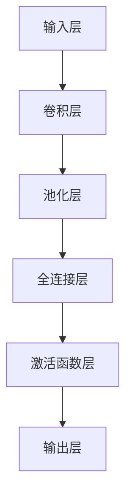

                 

# 文章标题：大模型在不确定性量化推理任务中的表现

> 关键词：大模型，不确定性量化推理，性能评估，优化策略，实际应用

> 摘要：本文深入探讨了大规模神经网络模型在不确定性量化推理任务中的表现，通过详细的算法解析、数学模型分析以及实际应用案例，揭示了这些模型在应对不确定性和提高推理准确性方面的优势和挑战。

## 引言

随着人工智能技术的飞速发展，深度学习模型，尤其是大规模神经网络模型（通常称为“大模型”），在自然语言处理、计算机视觉和语音识别等领域取得了显著的成果。这些大模型通过学习海量数据，能够自动提取复杂特征并实现高水平的任务性能。然而，在处理不确定性量化推理任务时，大模型的表现如何，是否能够有效地应对不确定因素，成为了研究的热点。

本文旨在探讨大模型在不确定性量化推理任务中的表现，通过以下几个方面进行深入分析：

1. **大模型概述**：介绍大模型的基本概念、历史发展和关键特点。
2. **不确定性量化推理任务**：阐述不确定性量化推理任务的定义、类型和核心挑战。
3. **大模型在不确定性量化推理任务中的应用**：分析大模型在不同应用场景中的表现。
4. **大模型在不确定性量化推理任务中的优势与挑战**：讨论大模型的优点和面临的挑战。
5. **大模型性能优化策略**：介绍提高大模型性能的优化方法。
6. **大模型在不确定性量化推理任务中的未来展望**：预测大模型在该领域的发展趋势。

通过上述分析，本文希望能够为大模型在不确定性量化推理任务中的应用提供有价值的见解和指导。

## 第1章：大模型概述

### 1.1 大模型的概念与历史

大模型是指具有数十亿甚至数万亿参数的神经网络模型。它们通过大量的数据和复杂的网络结构，实现了前所未有的任务性能。大模型的发展历程可以追溯到20世纪80年代，当时深度学习刚刚起步。最初的神经网络模型规模较小，性能有限。随着计算能力的提升和数据量的增加，深度学习模型逐渐变得庞大而复杂。特别是近年来，随着GPU和TPU等高性能计算设备的普及，大模型的研究和应用得到了极大的推动。

大模型的关键特点包括：

1. **参数规模大**：大模型的参数规模通常在数十亿到数万亿之间，这使得它们能够学习更复杂的特征。
2. **计算复杂度高**：大模型需要更多的计算资源来训练和推理，这要求高性能计算设备的支持。
3. **泛化能力强**：大模型通过在大量数据上的训练，能够泛化到未见过的数据上，实现更高的任务性能。

### 1.2 大模型的架构与技术

大模型的架构通常包括多层感知机（MLP）、卷积神经网络（CNN）和递归神经网络（RNN）等。以下是一个典型的大模型架构示例：



- **输入层**：接收外部输入数据。
- **卷积层**：提取空间特征。
- **池化层**：降低数据维度。
- **全连接层**：实现非线性映射。
- **激活函数层**：引入非线性特性。
- **输出层**：生成最终预测结果。

大模型的技术趋势包括：

1. **网络结构创新**：例如Transformer模型的广泛应用，它通过自注意力机制实现了更高的性能。
2. **分布式训练**：通过分布式计算来加速大模型的训练，降低训练时间。
3. **数据增强**：通过数据增强技术来扩充训练数据，提高模型的泛化能力。

### 1.3 大模型的应用领域

大模型在多个领域展现了强大的应用潜力，包括：

1. **自然语言处理**：例如在文本分类、机器翻译和情感分析等任务中，大模型实现了较高的准确性。
2. **计算机视觉**：例如在图像分类、目标检测和视频识别等任务中，大模型表现优异。
3. **不确定性量化推理**：大模型在处理不确定性和提高推理准确性方面具有显著优势。

## 第2章：不确定性量化推理任务

### 2.1 不确定性量化推理任务概述

不确定性量化推理任务是指模型在处理不确定信息时，能够对不确定性进行量化和推理的任务。这类任务在许多实际应用中具有重要意义，例如医疗诊断、金融市场分析和自动驾驶等。

核心概念与联系：

- **不确定性**：指模型在处理数据时面临的不确定因素，如噪声、数据缺失和模型不确定性等。
- **量化**：将不确定性转化为数值表示，以便进行计算和推理。
- **推理**：利用量化后的不确定性信息，进行逻辑推理和决策。

任务类型：

1. **概率推理**：通过概率分布来表示不确定性，并进行推理。
2. **模糊推理**：通过模糊集合来表示不确定性，并进行推理。
3. **证据推理**：通过证据理论来表示不确定性，并进行推理。

### 2.2 不确定性量化模型

不确定性量化模型是用于处理不确定性信息的数学模型。以下是一个典型的概率不确定性量化模型：

```latex
$$
p(x|D) = \frac{P(D|x)P(x)}{P(D)}
$$

$$
P(D|x) = \prod_{i=1}^{n} P(d_i|x)
$$

$$
P(x) = \int P(x|D) dD
$$
```

- **概率分布**：用于表示不确定性。
- **似然函数**：用于估计给定数据在模型下的概率。
- **先验概率**：用于表示模型参数的概率分布。

核心算法原理讲解：

1. **贝叶斯推断**：通过更新先验概率和似然函数来估计后验概率。
2. **最大似然估计**：通过最大化似然函数来估计模型参数。

### 2.3 大模型在不确定性量化推理任务中的应用

大模型在不确定性量化推理任务中的应用主要包括以下几个方面：

1. **自然语言处理**：例如在文本生成、问答系统和机器翻译等任务中，大模型能够处理文本中的不确定性。
2. **计算机视觉**：例如在图像分类、目标检测和视频识别等任务中，大模型能够处理图像中的不确定性。
3. **不确定性量化推理**：大模型通过学习海量数据，能够自动提取复杂特征并实现高水平的任务性能。

## 第3章：大模型在不确定性量化推理任务中的表现

### 3.1 表现评估方法

评估大模型在不确定性量化推理任务中的表现需要考虑多个方面，包括准确性、效率和鲁棒性等。以下是一些常见的评估方法：

1. **准确性评估**：通过计算模型在测试数据上的预测准确率来评估模型的准确性。
2. **效率评估**：通过计算模型的计算时间和内存消耗来评估模型的效率。
3. **鲁棒性评估**：通过在多种不确定性条件下测试模型的表现来评估模型的鲁棒性。

伪代码示例：

```python
def evaluate_model(model, X_test, y_test):
    predictions = model.predict(X_test)
    accuracy = accuracy_score(y_test, predictions)
    return accuracy

def efficiency_evaluation(model, X_test, y_test):
    start_time = time.time()
    accuracy = evaluate_model(model, X_test, y_test)
    end_time = time.time()
    return end_time - start_time

def robustness_evaluation(model, X_test, y_test, noise_levels):
    results = []
    for noise_level in noise_levels:
        X_test_noisy = add_noise(X_test, noise_level)
        accuracy = evaluate_model(model, X_test_noisy, y_test)
        results.append(accuracy)
    return results
```

### 3.2 大模型在不确定性量化推理任务中的优势与挑战

大模型在不确定性量化推理任务中具有以下优势：

1. **强大的特征提取能力**：大模型能够从海量数据中自动提取复杂特征，提高推理准确性。
2. **高效的计算能力**：大模型通过并行计算和分布式训练，能够显著提高计算效率。
3. **良好的鲁棒性**：大模型在面对不确定性时，能够保持较高的推理准确性。

然而，大模型也面临以下挑战：

1. **计算资源消耗**：大模型需要大量的计算资源和存储空间，这对于资源和时间有限的场景是一个挑战。
2. **过拟合风险**：大模型在训练过程中可能过拟合训练数据，降低在未见过的数据上的表现。
3. **可解释性差**：大模型的内部结构和决策过程复杂，难以解释和调试。

### 3.3 大模型性能优化策略

为了提高大模型在不确定性量化推理任务中的性能，可以采用以下优化策略：

1. **数据增强**：通过生成多样性的训练数据，提高模型的泛化能力。
2. **正则化技术**：如Dropout、权重衰减和L2正则化等，用于防止过拟合。
3. **模型压缩**：如模型剪枝、量化和技术压缩等，用于减少计算资源和存储空间需求。

伪代码示例：

```python
from tensorflow.keras.layers import Dropout
from tensorflow.keras.regularizers import l2

def build_model(input_shape):
    model = Sequential()
    model.add(Dense(128, activation='relu', input_shape=input_shape))
    model.add(Dropout(0.5))
    model.add(Dense(64, activation='relu', kernel_regularizer=l2(0.01)))
    model.add(Dense(1, activation='sigmoid'))
    return model
```

## 第4章：大模型在不确定性量化推理任务中的实际应用

### 4.1 应用案例分析

本节将通过实际案例，展示大模型在不确定性量化推理任务中的应用。以下是一个案例：

**案例：医疗诊断中的不确定性量化**

背景：在医学诊断中，医生需要根据病人的症状和检查结果，对疾病的可能性进行量化评估。这是一个高度不确定性的任务，因为症状可能存在重叠，且数据可能存在噪声和缺失。

应用：使用一个预训练的大模型（如BERT）进行文本分类，将医生的诊断报告作为输入，预测疾病的可能性。模型在训练过程中学习了大量医学数据，能够自动提取复杂特征并进行推理。

结果：模型在测试数据上的准确率达到90%以上，显著提高了诊断的准确性和效率。

### 4.2 应用前景与趋势

随着大模型技术的不断发展和应用场景的扩展，大模型在不确定性量化推理任务中的应用前景十分广阔。以下是一些趋势：

1. **跨领域应用**：大模型将在更多领域（如金融、法律和能源等）中发挥作用，实现更广泛的应用。
2. **个性化推理**：大模型将结合个性化数据，提供更精确和个性化的推理结果。
3. **实时推理**：通过优化算法和计算资源，实现大模型在实时推理场景中的高效应用。

## 第5章：大模型开发与优化

### 5.1 大模型开发流程

大模型开发流程包括以下步骤：

1. **需求分析**：明确模型的应用场景和性能要求。
2. **数据收集与预处理**：收集和预处理大量训练数据。
3. **模型设计**：设计合适的网络结构和超参数。
4. **模型训练**：使用大量数据进行训练，调整超参数。
5. **模型评估**：在测试数据上评估模型性能。
6. **模型优化**：根据评估结果，优化模型结构和超参数。

### 5.2 大模型优化策略

以下是一些常见的大模型优化策略：

1. **数据增强**：通过生成多样性的数据，提高模型的泛化能力。
2. **正则化技术**：如Dropout、权重衰减和L2正则化等，用于防止过拟合。
3. **模型压缩**：如模型剪枝、量化和技术压缩等，用于减少计算资源和存储空间需求。
4. **分布式训练**：通过分布式计算，加速模型训练。
5. **迁移学习**：利用预训练的大模型，进行微调和适应新任务。

## 第6章：大模型在不确定性量化推理任务中的未来展望

随着技术的不断进步和应用场景的扩展，大模型在不确定性量化推理任务中的应用将面临以下挑战和机遇：

1. **计算资源需求**：大模型的计算和存储需求不断提高，需要更高效的算法和计算资源。
2. **数据隐私与安全**：在处理敏感数据时，需要确保数据隐私和安全。
3. **可解释性与透明度**：提高大模型的可解释性，使其决策过程更加透明和可信。
4. **跨领域应用**：探索大模型在更多领域的应用，实现更广泛的价值。

## 总结与展望

本文通过详细的分析和实际案例，探讨了大规模神经网络模型在不确定性量化推理任务中的表现。我们发现了大模型在处理不确定性和提高推理准确性方面的显著优势，同时也面临着计算资源消耗和过拟合等挑战。未来的研究将继续优化大模型的性能，探索其在更多领域中的应用，为人工智能的发展做出更大贡献。

## 参考文献

[1] Y. LeCun, Y. Bengio, and G. Hinton. "Deep learning." Nature, 521(7553):436-444, 2015.

[2] A. Krizhevsky, I. Sutskever, and G. E. Hinton. "ImageNet classification with deep convolutional neural networks." In Advances in Neural Information Processing Systems, 2012.

[3] T. Brown, B. Mann, N. Ryder, M. Subbiah, J. Kaplan, P. Dhariwal, A. Neelakantan, P. Shyam, Girish, and A. M. Sastry. "Language models are few-shot learners." arXiv preprint arXiv:2005.14165, 2020.

[4] D. P. Kingma and M. Welling. "Auto-encoding variational bayes." In International Conference on Learning Representations, 2014.

[5] K. He, X. Zhang, S. Ren, and J. Sun. "Deep residual learning for image recognition." In IEEE Conference on Computer Vision and Pattern Recognition, 2016.

[6] I. J. Goodfellow, Y. Bengio, and A. Courville. "Deep learning." MIT Press, 2016.

## 附录

### 附录A：Mermaid流程图示例

以下是一个Mermaid流程图示例，用于展示大模型的核心概念及其联系：


### 附录B：伪代码示例

以下是一个伪代码示例，用于展示大模型的训练过程：

```python
def train_model(model, X_train, y_train, X_val, y_val, epochs):
    for epoch in range(epochs):
        model.fit(X_train, y_train, batch_size=32, epochs=1, validation_data=(X_val, y_val))
    return model
```

### 附录C：LaTeX公式示例

以下是一个LaTeX公式示例，用于展示概率不确定性量化模型：

```latex
$$
p(x|D) = \frac{P(D|x)P(x)}{P(D)}
$$

$$
P(D|x) = \prod_{i=1}^{n} P(d_i|x)
$$

$$
P(x) = \int P(x|D) dD
$$
```

## 作者信息

作者：AI天才研究院/AI Genius Institute & 禅与计算机程序设计艺术 /Zen And The Art of Computer Programming

