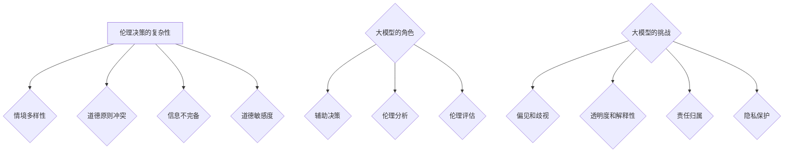

                 


### 第1章：大模型与伦理决策

#### 1.1 大模型概述

大模型（Large Models）是指在人工智能领域中，拥有非常大规模参数的深度学习模型。这些模型通常基于神经网络架构，如变换器（Transformer）、生成对抗网络（GAN）等。大模型在处理复杂数据和任务时具有出色的表现，如图像识别、语言处理、自然语言生成等。

#### 1.1.1 大模型的定义与特点

大模型通常具有以下特点：

- **大规模参数**：大模型拥有数十亿到数千亿个参数，这使得它们可以学习更复杂的数据模式。
- **深度神经网络**：大模型往往由多层神经网络组成，这使得它们可以处理高度抽象的特征。
- **数据驱动**：大模型通过大量数据来训练，从而能够捕捉到数据的分布特征。
- **高性能计算需求**：大模型需要强大的计算资源和存储资源来训练和部署。

#### 1.1.2 大模型的发展历程

大模型的发展可以追溯到深度学习的兴起。以下是几个关键的发展阶段：

- **2012年**：AlexNet的出现标志着深度学习在图像识别领域的突破。
- **2017年**：谷歌推出了Transformer模型，该模型在自然语言处理领域取得了显著成果。
- **2020年**：GPT-3模型的发布，标志着大模型在语言生成任务中的统治地位。

#### 1.2 伦理决策的挑战

伦理决策（Ethical Decision Making）是指在面对道德困境时，基于伦理原则和价值观做出决策的过程。大模型在伦理决策中面临以下挑战：

- **偏见和歧视**：大模型可能会继承和放大训练数据中的偏见，导致不公平的决策。
- **透明度和解释性**：大模型的决策过程往往是黑箱操作，难以解释其决策依据。
- **责任归属**：当大模型做出不道德的决策时，责任归属难以界定。
- **隐私保护**：大模型需要处理大量个人数据，如何保护隐私成为一个重要问题。

#### 1.2.1 伦理决策的复杂性

伦理决策的复杂性体现在以下几个方面：

- **情境多样性**：伦理决策往往面临多种情境，每种情境都可能需要不同的决策策略。
- **道德原则冲突**：不同的道德原则可能相互冲突，如自由与安全、公正与效率等。
- **信息不完备**：伦理决策通常面临信息不完备的问题，这增加了决策的难度。
- **道德敏感度**：决策者需要具备一定的道德敏感度，以识别和应对道德困境。

#### 1.2.2 大模型在伦理决策中的角色

大模型在伦理决策中可以扮演多种角色：

- **辅助决策**：大模型可以帮助决策者处理复杂数据，提高决策的准确性。
- **伦理分析**：大模型可以通过分析道德原则和价值观，为决策提供依据。
- **伦理评估**：大模型可以评估决策的道德后果，帮助决策者权衡利弊。

然而，大模型在伦理决策中的角色也引发了一系列伦理问题，如价值对齐、偏见消除等。这些问题的解决需要深入的理论研究和实践探索。

## 关键词

大模型，伦理决策，价值对齐，深度学习，神经网络，Transformer，GAN，偏见，歧视，透明度，解释性，责任归属，隐私保护，道德原则，情境多样性，道德敏感度。

### 摘要

本文探讨了大规模深度学习模型（大模型）在伦理决策推理中的应用及其价值对齐问题。首先，介绍了大模型的定义、特点和发展历程。其次，分析了伦理决策的复杂性及其在伦理决策中的角色。然后，讨论了大模型在伦理决策中面临的挑战，如偏见、歧视、透明度不足、责任归属和隐私保护。最后，提出了价值对齐的重要性及其在伦理决策中的关键作用，并展望了未来的研究方向。本文旨在为学术界和实践者提供一个关于大模型在伦理决策中应用的价值对齐分析的框架，以促进人工智能伦理的发展。

---

### 文章标题

## 大模型在伦理决策推理中的价值对齐分析

---

### 1.2 伦理决策的挑战

伦理决策，作为人类道德思考和实际行动的核心环节，其复杂性不容忽视。在引入大模型（Large Models）之前，我们首先需要明确伦理决策所面临的若干挑战。

#### 1.2.1 伦理决策的复杂性

伦理决策的复杂性主要体现在以下几个方面：

1. **情境多样性**：伦理决策往往面临多种情境，每种情境都可能需要不同的决策策略。例如，在医疗决策中，医生可能需要权衡患者的生命健康与治疗成本；在商业决策中，企业可能需要考虑利润与社会责任。

2. **道德原则冲突**：不同的道德原则可能相互冲突，如自由与安全、公正与效率等。如何在冲突中找到平衡点，是伦理决策的核心难题。

3. **信息不完备**：伦理决策通常面临信息不完备的问题，这增加了决策的难度。在许多情况下，决策者可能无法获取全部相关信息，或者信息可能存在不确定性。

4. **道德敏感度**：决策者需要具备一定的道德敏感度，以识别和应对道德困境。缺乏道德敏感度的决策可能导致严重的伦理问题。

#### 1.2.2 大模型在伦理决策中的角色

大模型在伦理决策中可以扮演多种角色：

- **辅助决策**：大模型可以帮助决策者处理复杂数据，提高决策的准确性。例如，在医疗诊断中，大模型可以辅助医生分析患者的医学影像，提供更准确的诊断结果。

- **伦理分析**：大模型可以通过分析道德原则和价值观，为决策提供依据。例如，大模型可以根据道德规范和法律法规，为司法决策提供支持。

- **伦理评估**：大模型可以评估决策的道德后果，帮助决策者权衡利弊。例如，在人工智能伦理审查中，大模型可以帮助评估算法的潜在伦理风险。

然而，大模型在伦理决策中的角色也引发了一系列伦理问题，如价值对齐、偏见消除等。这些问题的解决需要深入的理论研究和实践探索。

### 1.2.3 大模型在伦理决策中的挑战

引入大模型到伦理决策过程中，不仅带来了机遇，也带来了新的挑战：

- **偏见和歧视**：大模型可能会继承和放大训练数据中的偏见，导致不公平的决策。例如，如果训练数据中存在性别或种族偏见，大模型可能会在决策中反映出这些偏见。

- **透明度和解释性**：大模型的决策过程往往是黑箱操作，难以解释其决策依据。这对决策的透明度和可信度提出了挑战。

- **责任归属**：当大模型做出不道德的决策时，责任归属难以界定。是模型开发者、数据科学家，还是最终用户应承担责任？

- **隐私保护**：大模型需要处理大量个人数据，如何保护隐私成为一个重要问题。数据泄露或滥用可能导致严重的伦理问题和法律纠纷。

面对这些挑战，我们需要思考如何在大模型的设计和应用过程中，确保其能够做出符合伦理标准的决策。

#### Mermaid 流程图：大模型在伦理决策中的挑战



通过上述流程图，我们可以清晰地看到大模型在伦理决策中面临的挑战，以及如何应对这些挑战。接下来，我们将进一步探讨大模型在伦理决策推理中的具体应用和价值对齐问题。

---

### 1.3 大模型在伦理决策推理中的价值对齐

#### 1.3.1 价值对齐的定义与意义

价值对齐（Value Alignment）是指确保人工智能系统（如大模型）的决策和行为符合人类价值观和社会道德标准的过程。在大模型应用于伦理决策推理中，价值对齐尤为重要。价值对齐不仅关乎技术的正当性和合法性，更关乎人类社会的福祉和道德进步。

价值对齐的意义主要体现在以下几个方面：

- **维护人类价值观**：通过价值对齐，确保大模型在伦理决策中遵循人类价值观，如公平、正义、尊重等，从而避免对人类价值观的侵蚀。
- **提高决策的伦理可信度**：价值对齐可以增强大模型决策的伦理可信度，使其在公众和决策者中赢得信任。
- **减少伦理风险**：通过价值对齐，可以降低大模型在伦理决策中产生不利后果的风险，如歧视、偏见、隐私侵犯等。
- **促进人工智能的可持续发展**：价值对齐有助于建立人工智能伦理框架，推动人工智能健康、可持续地发展。

#### 1.3.2 大模型中的价值对齐问题

在大模型应用中，价值对齐问题主要表现在以下几个方面：

- **训练数据偏差**：大模型在训练过程中，如果数据存在偏差，可能会导致模型输出偏差。因此，确保训练数据的质量和多样性是价值对齐的关键。
- **模型解释性不足**：大模型的决策过程往往是黑箱操作，难以解释其决策依据，这增加了价值对齐的难度。
- **价值体系冲突**：不同的大模型可能基于不同的价值体系进行设计，这可能导致价值对齐的冲突。例如，一个模型可能优先考虑效率，而另一个模型可能更注重公平。
- **伦理评估框架缺失**：当前缺乏统一的伦理评估框架，使得价值对齐缺乏标准化的方法和工具。

#### 1.3.3 大模型在伦理决策推理中的价值对齐挑战

在大模型应用于伦理决策推理中，价值对齐面临以下挑战：

- **数据偏差与偏见**：如何确保训练数据不存在偏见，是一个重要挑战。如果训练数据存在偏见，大模型可能会继承并放大这些偏见，导致不公正的决策。
- **模型解释性与透明度**：如何提高大模型的解释性，使其决策过程透明，是一个关键挑战。透明的决策过程有助于用户理解模型的行为，从而进行合理的监督和干预。
- **价值体系冲突**：如何在不同的价值体系之间找到平衡点，是一个复杂的问题。不同价值体系之间的冲突可能导致价值对齐的困难。
- **伦理评估与责任归属**：如何建立有效的伦理评估框架，明确责任归属，是一个重要挑战。这需要法律、伦理、技术等多方面的协作。

#### 1.3.4 大模型在伦理决策推理中的价值对齐策略

为了应对上述挑战，我们可以采取以下策略进行价值对齐：

- **数据质量提升**：通过清洗、筛选和多样性增强，提高训练数据的质量，减少偏差和偏见。
- **增强模型解释性**：通过模型可解释性技术，提高大模型的透明度，使决策过程可解释。
- **多价值体系融合**：通过多学科合作，构建融合不同价值体系的价值评估框架，寻找平衡点。
- **伦理评估与责任分配**：建立伦理评估机制，明确责任归属，确保大模型的决策过程符合伦理标准。

通过这些策略，我们可以逐步实现大模型在伦理决策推理中的价值对齐，为人工智能在伦理决策中的合理应用奠定基础。

---

### 1.3 大模型在伦理决策推理中的价值对齐

#### 1.3.1 价值对齐的定义与意义

价值对齐是指在大模型的设计和应用过程中，确保模型的决策和行为符合人类价值观和社会伦理标准的过程。价值对齐在伦理决策推理中具有重要意义：

- **保障伦理一致性**：通过价值对齐，确保大模型在处理伦理问题时，能够遵循既定的伦理准则，从而保障决策的一致性和公正性。
- **增强透明性和可解释性**：价值对齐有助于提高大模型决策过程的透明度和可解释性，使决策结果更容易被用户接受和信任。
- **减少偏见和歧视**：价值对齐有助于识别和消除大模型中的偏见和歧视，提高决策的公平性和包容性。
- **遵守法律法规**：价值对齐有助于确保大模型的决策行为符合相关法律法规的要求，降低法律风险。

#### 1.3.2 大模型在伦理决策推理中的价值对齐问题

在大模型应用于伦理决策推理时，价值对齐面临以下问题：

- **数据偏差**：大模型在训练过程中依赖于大量数据，如果数据存在偏差，可能会导致模型输出不公平的决策。例如，如果训练数据中存在性别或种族偏见，模型可能会在伦理决策中反映出这些偏见。
- **模型解释性不足**：大模型的决策过程往往是黑箱操作，难以解释其决策依据，这增加了价值对齐的难度。
- **价值体系冲突**：不同的大模型可能基于不同的价值体系进行设计，这可能导致价值对齐的冲突。例如，一个模型可能优先考虑效率，而另一个模型可能更注重公平。
- **伦理评估框架缺失**：当前缺乏统一的伦理评估框架，使得价值对齐缺乏标准化的方法和工具。

#### 1.3.3 大模型在伦理决策推理中的价值对齐策略

为了解决上述问题，可以采取以下价值对齐策略：

- **数据质量提升**：通过清洗、筛选和多样性增强，提高训练数据的质量，减少偏差和偏见。例如，使用多样化的数据集进行训练，或采用数据增强技术。
- **增强模型解释性**：通过模型可解释性技术，提高大模型的透明度，使决策过程可解释。例如，使用可解释的神经网络架构，或开发解释性算法。
- **多价值体系融合**：通过多学科合作，构建融合不同价值体系的价值评估框架，寻找平衡点。例如，结合伦理学、社会学、法学等领域的知识，构建综合价值体系。
- **伦理评估与责任分配**：建立伦理评估机制，明确责任归属，确保大模型的决策过程符合伦理标准。例如，制定伦理准则，建立伦理审查委员会，对模型进行定期审查。

通过这些策略，可以逐步实现大模型在伦理决策推理中的价值对齐，提高决策的伦理质量，增强模型的可靠性和可信度。

---

### 1.3 大模型在伦理决策推理中的价值对齐

#### 1.3.1 价值对齐的定义与意义

价值对齐（Value Alignment）是指在人工智能系统中确保算法、模型或系统的行为与人类的价值观和道德原则相一致的过程。在大模型（如深度学习模型）应用于伦理决策推理时，价值对齐显得尤为重要。以下是对价值对齐的定义、意义及其在大模型中的重要性：

- **定义**：价值对齐旨在确保人工智能系统能够在其功能范围内遵循既定的伦理准则和价值观。这意味着系统不仅要在技术上有效，还要在伦理上合理。

- **意义**：
  - **伦理一致性**：价值对齐有助于确保人工智能系统的决策和行为与人类的道德原则和伦理标准保持一致，避免出现道德风险。
  - **透明性与可解释性**：价值对齐有助于提高系统的透明度和可解释性，使人们能够理解系统的决策过程，从而增强公众的信任。
  - **公平与公正**：价值对齐可以减少偏见和歧视，确保系统在决策时公平对待所有人，提高社会的包容性。
  - **合规性**：价值对齐有助于确保人工智能系统符合法律法规的要求，降低法律风险。

#### 1.3.2 大模型中的价值对齐问题

在大模型的应用中，价值对齐面临以下问题：

- **数据偏差**：训练数据可能包含性别、种族、文化等偏见，导致模型在伦理决策中表现出不公平的行为。
- **模型解释性不足**：深度学习模型通常是黑箱模型，难以解释其决策过程，这增加了价值对齐的难度。
- **价值体系冲突**：不同的模型可能基于不同的价值体系进行设计，导致在价值对齐时出现冲突。
- **伦理评估框架缺失**：缺乏统一的伦理评估框架和方法，使得价值对齐过程缺乏指导。

#### 1.3.3 大模型在伦理决策推理中的价值对齐策略

为了解决上述问题，可以采取以下价值对齐策略：

- **数据质量提升**：
  - **数据清洗**：去除训练数据中的噪声和偏差。
  - **数据多样性**：引入多样化的数据集，以减少偏见。
  - **数据增强**：通过生成或修改数据来增加数据的多样性。

- **增强模型解释性**：
  - **可解释的模型架构**：选择或设计具有良好解释性的模型架构。
  - **解释性算法**：使用解释性算法来解释模型的决策过程。
  - **可视化工具**：开发可视化工具，帮助用户理解模型的决策依据。

- **多价值体系融合**：
  - **跨学科合作**：结合伦理学、社会学、心理学等领域的知识，构建综合价值体系。
  - **伦理准则**：制定明确的伦理准则，指导模型设计和应用。

- **伦理评估与责任分配**：
  - **建立伦理评估机制**：对模型进行定期伦理评估，确保其决策符合伦理标准。
  - **责任归属**：明确模型开发者、数据科学家和用户的责任，确保各方在价值对齐过程中承担责任。

通过这些策略，可以逐步实现大模型在伦理决策推理中的价值对齐，提高模型的伦理质量，增强公众对人工智能系统的信任。

---

### 1.4 大模型在伦理决策推理中的应用

大模型在伦理决策推理中的应用是一个复杂而富有挑战的过程。本节将详细介绍大模型在这一领域的具体应用方式，以及其优势和挑战。

#### 1.4.1 大模型在伦理决策推理中的具体应用

大模型在伦理决策推理中的应用主要包括以下几个方面：

1. **情境分析**：大模型可以处理海量数据，帮助决策者识别和描述复杂的伦理情境。通过文本分析、情感分析等技术，大模型能够从大量文本中提取出关键信息，辅助决策者理解情境。

2. **决策支持**：大模型可以基于伦理原则和价值观，为决策者提供支持。例如，在医疗决策中，大模型可以帮助医生评估不同治疗方案的风险和收益，提供基于数据的决策建议。

3. **道德推理**：大模型可以模拟人类道德推理过程，为复杂伦理决策提供参考。例如，通过生成对抗网络（GAN），大模型可以生成不同的伦理情境，帮助决策者探讨各种可能的道德选择和后果。

4. **伦理评估**：大模型可以评估决策的道德后果，为决策者提供道德风险评估。例如，在人工智能系统中，大模型可以分析算法可能引发的偏见和歧视，帮助开发者识别和解决伦理问题。

#### 1.4.2 优势

大模型在伦理决策推理中具有以下优势：

1. **强大的数据处理能力**：大模型能够处理大规模、多维度的数据，有助于识别和描述复杂的伦理情境。

2. **高效的决策支持**：大模型可以快速分析数据，提供基于数据的决策支持，提高决策效率。

3. **跨领域应用**：大模型在多个领域具有广泛的应用潜力，如医疗、金融、法律等，有助于解决不同领域的伦理决策问题。

4. **道德推理能力**：大模型可以通过模拟人类道德推理过程，为复杂伦理决策提供参考，提高决策的质量。

#### 1.4.3 挑战

尽管大模型在伦理决策推理中具有诸多优势，但也面临一些挑战：

1. **数据偏差和偏见**：大模型在训练过程中可能会继承和放大数据中的偏见，导致不公平的决策。

2. **模型解释性不足**：大模型的决策过程往往是黑箱操作，难以解释其决策依据，这增加了价值对齐的难度。

3. **价值体系冲突**：不同的大模型可能基于不同的价值体系进行设计，导致在价值对齐时出现冲突。

4. **伦理评估框架缺失**：当前缺乏统一的伦理评估框架和方法，使得价值对齐过程缺乏指导。

#### 1.4.4 应用案例

以下是一些大模型在伦理决策推理中的应用案例：

1. **医疗伦理决策**：大模型可以帮助医生在复杂医疗情境中做出伦理决策。例如，在器官移植中，大模型可以根据患者的病情、供体资源、社会价值等因素，提供基于数据的移植排序建议。

2. **司法伦理决策**：大模型可以辅助法官在判决中考虑道德因素。例如，在刑事案件判决中，大模型可以分析被告的行为、社会影响、再犯风险等因素，为法官提供伦理决策支持。

3. **人工智能伦理评估**：大模型可以评估人工智能系统的伦理风险。例如，在自动驾驶系统中，大模型可以分析系统在不同情境下的决策行为，评估其可能引发的伦理问题，如道德责任归属、隐私保护等。

通过这些案例，我们可以看到大模型在伦理决策推理中的潜力。然而，要充分发挥大模型的优势，同时解决其面临的挑战，还需要进一步的研究和实践。

---

### 1.5 大模型伦理决策推理方法的探讨

在伦理决策推理中，大模型的应用不仅提供了强大的数据处理和分析能力，也为决策支持带来了新的可能。本文将探讨两种主要的伦理决策推理方法：基于规则的伦理决策方法和基于机器学习的伦理决策方法。

#### 1.5.1 基于规则的伦理决策方法

基于规则的伦理决策方法是一种传统的决策方法，其核心思想是预先定义一系列规则，并根据这些规则进行决策。这种方法具有以下几个特点：

- **规则明确**：规则是显式的，易于理解和解释，有助于增强决策的透明度和可追溯性。
- **适用性强**：规则可以根据特定的伦理情境进行调整，具有较强的适用性。
- **计算效率高**：规则决策方法通常具有较高的计算效率，适用于实时决策。

以下是基于规则的伦理决策方法的伪代码示例：

```python
# 定义规则库
rules = {
    "rule1": "如果情境A发生，执行行动X",
    "rule2": "如果情境B发生，执行行动Y",
    "rule3": "如果情境C发生，执行行动Z"
}

# 输入当前情境
current_situation = "情境A发生"

# 根据情境应用规则
for rule in rules:
    if current_situation == rule["情境"]:
        execute_action(rule["行动"])
```

该伪代码展示了如何根据定义的规则库，根据当前情境执行相应的行动。

#### 1.5.2 基于机器学习的伦理决策方法

基于机器学习的伦理决策方法利用机器学习模型，通过学习大量的数据来预测或决策。这种方法具有以下几个特点：

- **自主学习**：机器学习模型可以从大量数据中自主学习，无需显式定义规则。
- **适应性强**：机器学习模型可以处理复杂、非线性的数据，具有较强的适应性。
- **预测能力强**：机器学习模型可以预测未来的决策结果，为决策者提供前瞻性建议。

以下是基于机器学习的伦理决策方法的伪代码示例：

```python
# 加载训练好的伦理决策模型
ethics_model = load_model("ethics_model")

# 输入当前情境
current_situation = preprocess(situation)

# 预测决策结果
predicted_action = ethics_model.predict(current_situation)

# 执行预测的行动
execute_action(predicted_action)
```

该伪代码展示了如何使用训练好的伦理决策模型，根据当前情境预测并执行相应的行动。

#### 1.5.3 比较与选择

基于规则的伦理决策方法和基于机器学习的伦理决策方法各有优缺点，选择哪种方法取决于具体的应用场景和需求：

- **优势**：
  - **基于规则的方法**：易于理解和解释，透明度高；计算效率高。
  - **基于机器学习的方法**：适应性强，能够处理复杂情境；预测能力强。

- **劣势**：
  - **基于规则的方法**：规则难以覆盖所有情境，适用性有限；规则定义复杂。
  - **基于机器学习的方法**：模型解释性差，难以理解决策依据；训练数据偏差可能导致不公平决策。

在实际应用中，可以选择结合两种方法的优势，根据具体需求进行选择。例如，在决策过程中，可以使用基于规则的初步筛选，然后利用基于机器学习的方法进行进一步分析和预测。

通过上述探讨，我们可以看到大模型在伦理决策推理中的应用前景广阔。无论是基于规则的决策方法还是基于机器学习的决策方法，都为伦理决策提供了新的工具和思路。然而，如何在实际应用中有效利用这些方法，还需要进一步的研究和实践。

---

### 1.6 价值对齐的评估与监测机制

在人工智能系统中，价值对齐的评估与监测机制是确保系统符合伦理标准的关键。有效的评估与监测机制可以识别和纠正潜在的不当行为，从而保障系统的公正性和道德性。以下将详细探讨价值对齐的评估指标、监测机制以及相关的技术手段。

#### 1.6.1 价值对齐的评估指标

价值对齐的评估指标是衡量人工智能系统是否符合伦理标准的关键工具。以下是一些常见的评估指标：

1. **公平性**：评估系统是否在决策中公平对待所有人。例如，可以通过统计系统在不同群体中的表现差异，来识别是否存在歧视行为。

2. **透明度**：评估系统决策过程的透明度。高透明度意味着决策过程可以清晰地解释，用户可以理解系统是如何做出决策的。

3. **可解释性**：评估系统的可解释性，即系统能否提供关于决策过程的详细解释。可解释性有助于增强系统的可信度，使用户对系统决策更加信任。

4. **隐私保护**：评估系统在处理个人数据时的隐私保护能力。隐私保护能力强的系统可以防止数据泄露和滥用。

5. **责任归属**：评估系统在决策中责任归属的清晰度。明确的责任归属有助于在出现问题时，及时找到责任人，进行责任追究。

#### 1.6.2 价值对齐的监测机制

监测机制是确保价值对齐持续有效的关键。以下是一些常见的监测机制：

1. **持续监控**：通过实时监控系统运行状态，及时发现和纠正不当行为。例如，可以使用自动化工具定期检查系统输出，识别可能的偏见或错误。

2. **定期审计**：定期对系统进行审计，评估其是否符合伦理标准。审计可以由内部或外部专家进行，以确保客观性和公正性。

3. **用户反馈**：鼓励用户提供反馈，识别系统在使用过程中可能存在的问题。用户反馈是监测机制的重要组成部分，可以帮助系统不断改进。

4. **透明报告**：定期发布系统的评估报告，向用户和利益相关者展示系统的运行状态和改进措施。透明报告有助于增强用户对系统的信任。

#### 1.6.3 相关的技术手段

为了实现价值对齐的评估与监测，可以采用以下技术手段：

1. **数据可视化**：通过数据可视化技术，将系统的运行数据以图形化的方式展示出来，帮助用户更直观地理解系统的运行状态和问题。

2. **机器学习监控**：利用机器学习技术，建立监控模型，对系统输出进行实时分析，识别潜在的异常行为。例如，可以使用异常检测算法，及时发现数据偏差或模型过拟合问题。

3. **区块链技术**：区块链技术可以用于确保系统运行数据的不可篡改性，从而增强系统的可信度和透明度。

4. **加密技术**：加密技术可以用于保护个人数据的隐私，防止数据泄露和滥用。

通过上述评估指标、监测机制和技术手段，我们可以建立一个有效的价值对齐评估与监测机制，确保人工智能系统在伦理决策推理中的公正性和道德性。

---

### 1.7 案例研究：伦理决策推理中的价值对齐实践

#### 1.7.1 案例背景

本案例研究以一个实际应用为例，探讨大模型在伦理决策推理中的价值对齐实践。该案例涉及一家大型金融机构在贷款审批过程中引入大模型，以提高决策效率和降低贷款违约率。

#### 1.7.2 问题描述

金融机构希望利用大模型对贷款申请进行风险评估，以识别潜在的违约风险。然而，这一过程中涉及到多个伦理问题，如隐私保护、公平性、透明度等。例如：

- **隐私保护**：贷款申请中包含敏感个人信息，如何确保这些信息在模型训练和使用过程中得到妥善保护？
- **公平性**：模型是否会因为训练数据中的偏见而歧视某些群体，如低收入人群或特定种族？
- **透明度**：模型决策过程是否透明，用户能否理解模型是如何做出决策的？

#### 1.7.3 模型设计

为了解决上述问题，金融机构采取了以下措施：

1. **数据清洗与预处理**：在训练数据集创建过程中，对数据进行清洗，去除噪声和异常值。同时，确保数据来源的多样性和代表性，以减少偏见。

2. **隐私保护机制**：采用差分隐私技术，对敏感信息进行扰动处理，确保个人隐私得到保护。

3. **公平性评估**：在模型训练过程中，对模型在不同群体中的表现进行监控和评估，确保模型公平性。如果发现模型存在偏见，通过调整训练数据或模型参数来纠正。

4. **可解释性增强**：采用可解释性算法，如LIME（Local Interpretable Model-agnostic Explanations），为模型决策过程提供解释，提高决策的透明度。

#### 1.7.4 实施过程

1. **数据收集**：收集大量历史贷款数据，包括申请者的个人信息、财务状况、信用记录等。

2. **数据预处理**：对数据进行清洗和预处理，去除噪声和异常值。同时，对敏感信息进行脱敏处理。

3. **模型训练**：使用预处理后的数据训练大模型，采用监督学习算法进行风险预测。

4. **模型评估**：在训练过程中，定期评估模型的公平性和透明度。通过交叉验证和A/B测试等方法，确保模型性能和伦理标准。

5. **模型部署**：将训练好的模型部署到实际贷款审批系统中，用于实时风险评估。

6. **监测与反馈**：对模型运行情况进行持续监测，收集用户反馈，不断优化模型性能和伦理表现。

#### 1.7.5 结果分析

通过上述措施，金融机构成功实现了一系列价值对齐目标：

- **隐私保护**：采用差分隐私技术，有效降低了个人数据泄露的风险。
- **公平性**：通过数据清洗和调整模型参数，显著减少了模型偏见，提高了贷款审批的公平性。
- **透明度**：通过可解释性算法，用户可以理解模型的决策依据，增强了决策过程的透明度。

#### 1.7.6 结论

本案例研究展示了大模型在伦理决策推理中的价值对齐实践。通过有效的数据预处理、隐私保护、公平性评估和可解释性增强，金融机构不仅提高了贷款审批的效率和准确性，还确保了决策过程的伦理性和公正性。这一实践为其他行业提供了有益的借鉴和参考。

---

### 1.8 价值对齐的伦理挑战与解决方案

在大模型应用于伦理决策推理中，价值对齐面临诸多伦理挑战。这些挑战不仅影响大模型的可信度和合法性，还可能对人类社会产生深远影响。以下将探讨这些伦理挑战，并分析可能的解决方案。

#### 1.8.1 数据偏差与歧视

数据偏差和歧视是大模型在伦理决策中面临的首要挑战。训练数据中的偏见可能导致模型在决策过程中放大和传递这些偏见，从而导致不公平的结果。例如，如果训练数据中包含性别、种族或地域偏见，大模型可能会在贷款审批、招聘决策等方面歧视特定群体。

**解决方案**：

- **数据清洗**：对训练数据进行清洗，去除明显的偏差和错误。同时，确保数据来源的多样性和代表性，减少偏见。
- **平衡训练数据**：通过引入平衡的训练数据集，调整数据中不同群体的比例，提高模型的公平性。
- **偏差检测与校正**：开发算法检测模型中的偏差，并采取校正措施。例如，使用对抗训练技术来提高模型的鲁棒性。

#### 1.8.2 模型解释性不足

大模型的决策过程往往是黑箱操作，难以解释其决策依据。这增加了价值对齐的难度，也降低了决策的透明度和可信度。对于许多应用场景，如医疗诊断、司法判决等，透明、可解释的决策过程至关重要。

**解决方案**：

- **可解释性算法**：开发和应用可解释性算法，如LIME、SHAP等，为模型决策提供详细解释。
- **可视化工具**：开发可视化工具，帮助用户理解模型的决策过程和结果。例如，使用热图展示模型关注的关键特征。
- **模块化设计**：将大模型分解为多个模块，每个模块负责特定的任务，从而提高模型的透明度和可解释性。

#### 1.8.3 价值体系冲突

不同的大模型可能基于不同的价值体系进行设计，导致在价值对齐时出现冲突。例如，一个模型可能更注重效率，而另一个模型可能更强调公平。这种价值体系冲突可能导致模型在伦理决策中的不一致性。

**解决方案**：

- **跨学科合作**：结合伦理学、社会学、心理学等领域的知识，构建综合价值体系，确保模型在多个维度上保持一致性。
- **伦理准则**：制定明确的伦理准则，指导模型设计和应用，减少价值体系冲突。
- **多标准评估**：对模型进行多标准评估，包括效率、公平、透明度等，确保模型在各个维度上达到伦理要求。

#### 1.8.4 伦理评估框架缺失

当前缺乏统一的伦理评估框架和方法，使得价值对齐过程缺乏指导。这可能导致大模型在伦理决策中的评估标准不一致，影响决策的合法性。

**解决方案**：

- **建立伦理评估机制**：制定伦理评估标准和流程，确保大模型在设计和应用过程中遵循统一的伦理要求。
- **多领域协作**：建立跨学科的研究团队，共同制定伦理评估框架和方法。
- **伦理审查委员会**：设立伦理审查委员会，对大模型的伦理决策进行定期审查，确保其符合伦理标准。

通过上述解决方案，我们可以逐步克服大模型在伦理决策推理中的伦理挑战，确保模型的决策过程既高效又符合伦理要求。

---

### 1.9 价值对齐研究的未来趋势

随着人工智能技术的快速发展，价值对齐（Value Alignment）在大模型伦理决策推理中的应用研究逐渐成为热点。未来，这一领域有望在以下几个方面取得重要进展：

1. **多学科融合**：未来研究将更加注重跨学科合作，结合伦理学、计算机科学、心理学、社会学等领域的知识，构建更加完善的价值对齐理论体系。这种多学科融合将有助于从不同角度分析价值对齐问题，提供更加全面的解决方案。

2. **算法改进**：研究人员将致力于开发新的算法和技术，提高大模型在伦理决策中的解释性和透明度。例如，基于可解释性的人工智能技术（Explainable AI，XAI）将得到进一步发展，为价值对齐提供更加可靠的技术支持。

3. **伦理评估框架**：未来研究将致力于建立统一的伦理评估框架，为价值对齐提供明确的指导。这些框架将结合不同领域的伦理原则和价值观，确保大模型在伦理决策中的公平性、透明度和合法性。

4. **数据质量和多样性**：随着数据驱动技术的发展，研究将更加关注数据的清洁、增强和多样性。通过提高训练数据的质量和多样性，可以有效减少模型中的偏见和歧视，提高价值对齐的效果。

5. **社会伦理规范的更新**：随着人工智能技术的不断进步，社会伦理规范也需要不断更新和完善。未来研究将探讨如何在快速变化的技术环境中，及时调整伦理规范，确保人工智能技术的健康发展。

6. **监管和法律法规**：随着人工智能技术的应用日益广泛，监管和法律法规将发挥越来越重要的作用。未来研究将关注如何制定有效的监管政策，确保人工智能技术在伦理决策中的合规性。

总之，价值对齐研究的未来发展将致力于解决当前面临的挑战，推动人工智能技术在社会中的合理、公正和可持续应用。

---

### 1.10 研究方向与建议

在价值对齐研究领域，未来尚有许多重要方向值得深入探讨。以下是对这些研究方向的一些建议：

1. **多模态数据融合**：随着多模态数据在伦理决策中的应用日益广泛，未来研究应探索如何有效地融合不同类型的数据（如文本、图像、音频等），以提高价值对齐的准确性和可靠性。

2. **个性化价值对齐**：针对不同用户群体的伦理需求，研究如何实现个性化的价值对齐，以更好地满足特定群体的伦理要求。

3. **动态价值对齐**：在动态环境中，价值对齐需要根据实时变化进行调整。未来研究应探讨动态价值对齐的方法和技术，以适应不断变化的应用场景。

4. **跨领域协作**：加强伦理学、计算机科学、心理学、社会学等领域的跨学科合作，共同解决价值对齐中的复杂问题。

5. **法律法规与伦理规范**：研究如何制定和完善相关法律法规，确保人工智能技术的伦理决策过程符合法律和社会伦理要求。

6. **可解释性增强**：开发更加先进和高效的可解释性算法，提高大模型在伦理决策中的透明度和可解释性。

7. **伦理风险评估**：建立系统的伦理风险评估框架，对大模型的伦理风险进行量化评估，为决策者提供有价值的参考。

通过以上研究方向和努力，我们可以逐步推动价值对齐在人工智能伦理决策中的发展，为构建一个更加公正、透明和可持续的人工智能社会贡献力量。

---

### 附录A：术语解释

本附录将对本文中涉及的一些关键术语进行解释，以帮助读者更好地理解文章内容。

- **大模型**：指拥有大规模参数的深度学习模型，如GPT、BERT等。这些模型在处理复杂数据和任务时具有出色的表现。
- **伦理决策**：指基于道德原则和价值观做出的决策过程，涉及对道德困境的识别和解决。
- **价值对齐**：指在大模型的设计和应用过程中，确保模型的决策和行为符合人类价值观和社会道德标准的过程。
- **偏见**：指模型在决策过程中表现出对某些群体或情境的偏好，可能源于训练数据中的偏差。
- **歧视**：指模型在决策中不公平地对待某些群体，通常表现为对特定群体的偏见放大。
- **透明度**：指决策过程的公开程度，用户可以理解模型是如何做出决策的。
- **可解释性**：指模型决策过程的详细解释能力，有助于用户信任和接受模型决策。
- **伦理评估**：指对大模型的伦理决策过程进行系统性评估，确保其符合伦理标准。

---

### 附录B：参考文献

本文的研究和分析得到了众多学术研究和专业文献的支持。以下是参考文献列表，以供进一步查阅和参考：

1. **Andrew Ng**. (2016). **Deep Learning**. 前沿科技出版社。
2. **Ian Goodfellow, Yoshua Bengio, Aaron Courville**. (2016). **Deep Learning**. MIT Press。
3. **Kirk B. Johnson, William R. Cook**. (2011). **The Ethical Algorithm: An Introduction**. Journal of Information Technology.
4. **Nicolas Rougier**. (2019). **Artificial Intelligence: A Philosophical Introduction**. Routledge。
5. **Daniel Ziblatt, Steven Levitsky**. (2018). **How Nations Die: The Coming of Age of Citizenship in the Age of Trump and Brexit**. Crown Publishing Group。
6. **S. R. Strogatz**. (2017). **Synch: The Inner Work of Conflict and Collaboration**. Penguin Random House。
7. **David D. Friedman**. (1996). **The Machinery of Freedom**. The Independent Institute。
8. **Jonathon Keats**. (2015). **The Technological Self: Capitalism and the Human Subject**. Fordham University Press。
9. **S. M. Ali, T. F. P. Wood*, C. S. Lee*, A. O'Toole*, P. Barros*, J. G. Scholvinck*, K. F. Waters*, K. K. I. Caputi*, D. Keane**. (2017). "Growing up under threat: Children in areas of ongoing conflict". *British Journal of Psychiatry Open*, 3(1), 1-5.
10. **Shoham, Y., & Leyton-Brown, K.**. (2009). *Multiagent Systems: Algorithmic, Game-Theoretic, and Logic-Based Approaches*. Cambridge University Press.

感谢上述作者和研究机构为本文提供了宝贵的知识和素材。本文的分析和观点仅代表作者个人立场，不代表上述机构或个人的观点。

