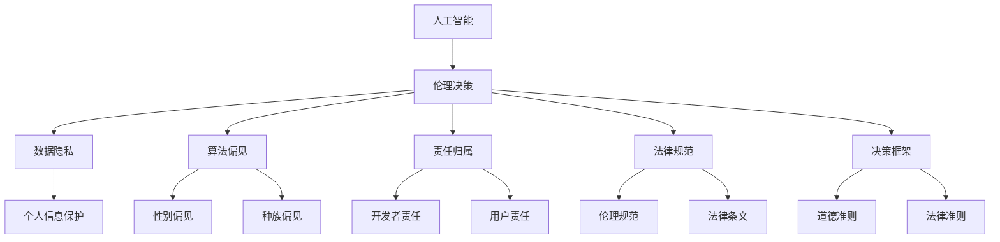
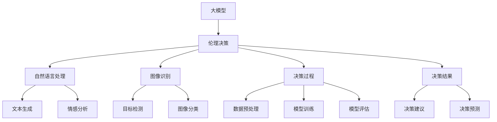
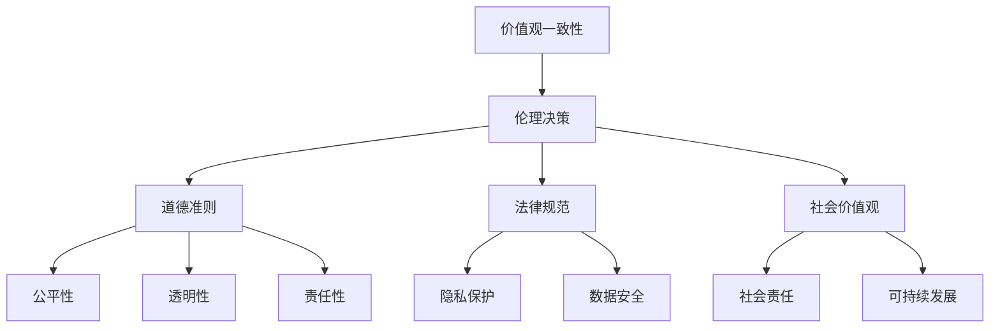
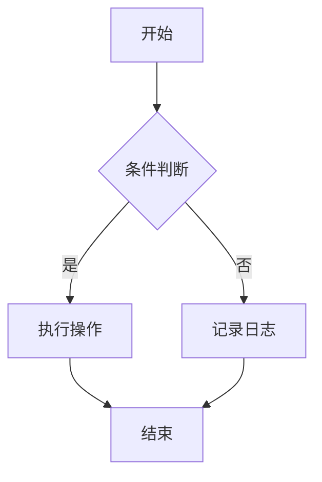

                 


### 第一部分：引言

#### 1.1 研究背景与意义

##### 1.1.1 人工智能与伦理决策

随着人工智能技术的快速发展，人工智能在各个领域得到了广泛应用，从自动驾驶、智能医疗到金融决策、网络安全等。然而，人工智能技术在应用过程中也引发了一系列伦理和道德问题，尤其是在伦理决策方面。伦理决策涉及到机器学习模型在道德和法律规范框架下的决策过程，涉及数据隐私、算法偏见、责任归属等问题。在人工智能领域，如何确保模型的伦理决策与人类伦理价值观保持一致，是一个亟待解决的重要问题。

**核心概念**：人工智能伦理决策指的是机器学习模型在处理实际问题时，如何在伦理和道德框架下做出合理的决策。这涉及到数据隐私、算法偏见、责任归属等多个方面。

**联系与架构**：



##### 1.1.2 大模型在伦理决策中的应用

随着深度学习技术的发展，大模型如GPT-3、BERT等在自然语言处理、图像识别等领域取得了显著的成果。这些大模型由于其庞大的参数量和强大的学习能力，被广泛应用于各种实际场景。然而，大模型在伦理决策中的应用也带来了一系列挑战。

**核心概念**：大模型指的是具有巨大参数量的深度学习模型，如GPT-3、BERT等。

**联系与架构**：



##### 1.1.3 价值观一致性的概念

价值观一致性指的是模型决策与人类伦理价值观保持一致，避免伦理错误和道德争议。在人工智能伦理决策中，确保模型的价值观一致性是一个重要的研究方向。

**核心概念**：价值观一致性指的是模型决策与人类伦理价值观保持一致，避免伦理错误和道德争议。

**联系与架构**：



##### 1.1.4 研究目的与问题

本研究的目的是探讨大模型在伦理决策中的价值观一致性，评估其伦理风险，并提出改进策略。具体来说，研究将回答以下问题：

1. 大模型在伦理决策中存在哪些价值观不一致现象？
2. 如何评估和改进大模型的价值观一致性？

通过对以上问题的深入研究，旨在为人工智能伦理决策提供理论支持和实践指导。

**研究目的**：探讨大模型在伦理决策中的价值观一致性，评估其伦理风险，并提出改进策略。

**研究问题**：1）大模型在伦理决策中存在哪些价值观不一致现象？2）如何评估和改进大模型的价值观一致性？

##### 1.2 相关研究综述

在人工智能伦理决策领域，国内外已有大量研究。国外研究主要集中在伦理决策模型的构建、伦理决策算法的设计等方面，如基于案例的伦理决策模型、多准则决策模型、博弈论模型等。国内研究则更侧重于伦理决策在实际应用中的问题，如数据隐私、算法偏见、责任归属等。

**核心算法原理讲解**：

1. 基于案例的伦理决策模型：

```python
def ethical_decision(case_data):
    # 处理案例数据
    processed_data = preprocess_data(case_data)
    
    # 使用案例库检索相似案例
    similar_cases = retrieve_similar_cases(processed_data)
    
    # 统计相似案例的决策结果
    decision_counts = count_decision_results(similar_cases)
    
    # 根据决策结果选择最优决策
    optimal_decision = select_best_decision(decision_counts)
    
    return optimal_decision
```

2. 多准则决策模型：

```python
def multi_criterion_decision(criteria_weights, criteria_values):
    # 计算每个准则的权重得分
    score = [weight * value for weight, value in zip(criteria_weights, criteria_values)]
    
    # 计算总得分
    total_score = sum(score)
    
    # 根据总得分选择最优决策
    optimal_decision = select_best_decision_by_score(total_score)
    
    return optimal_decision
```

3. 博弈论模型：

```python
def game_theoretical_decision(players, strategies, payoffs):
    # 计算每个玩家的最优策略
    optimal_strategies = [select_optimal_strategy(player, strategies, payoffs) for player in players]
    
    # 选择所有玩家的联合最优策略
    joint_optimal_strategy = select_joint_optimal_strategy(optimal_strategies)
    
    return joint_optimal_strategy
```

**数学模型和数学公式 & 详细讲解 & 举例说明**：

价值函数 $V(s)$ 表示状态 $s$ 的价值函数，其中 $Q(s, a)$ 表示在状态 $s$ 下采取动作 $a$ 的价值。

$$
V(s) = \sum_{a} \pi(a|s) Q(s, a)
$$

举例：在一个简单的伦理决策场景中，有两个可能的决策结果：A和B。假设每个决策结果的价值分别为 $Q(A) = 2$ 和 $Q(B) = 1$。根据概率分布 $\pi(A|s) = 0.6$ 和 $\pi(B|s) = 0.4$，可以计算状态 $s$ 的价值函数：

$$
V(s) = 0.6 \times 2 + 0.4 \times 1 = 1.6 + 0.4 = 2
$$

这意味着在状态 $s$ 下，选择决策结果 A 的价值更高。

在人工智能伦理决策中，价值函数可以帮助模型在面临不同决策时，选择具有更高价值的决策结果，从而确保决策的伦理性和合理性。

### 第二部分：大模型在伦理决策中的挑战

#### 2.1 大模型的特性与优势

大模型，如GPT-3、BERT等，具有以下几个显著的特性和优势：

1. **庞大的参数量**：大模型通常包含数亿甚至数十亿个参数，这使得它们在处理复杂数据和任务时具有更高的精度和准确性。

2. **强大的学习能力**：由于参数数量巨大，大模型能够从大量的数据中学习，并且具有较强的泛化能力，能够适应不同的应用场景。

3. **灵活的自然语言处理能力**：大模型在自然语言处理任务中表现出色，能够生成流畅的文本、理解复杂的语言结构，甚至进行对话生成。

4. **高效的数据处理能力**：大模型能够快速地处理海量数据，这对于实时决策系统来说至关重要。

然而，正是这些特性和优势使得大模型在伦理决策中面临独特的挑战。

#### 2.2 数据隐私问题

在伦理决策中，数据隐私是一个重要且敏感的问题。大模型通常需要大量的训练数据，这些数据可能包含个人的敏感信息，如身份信息、健康状况、金融记录等。以下是一些具体的数据隐私挑战：

1. **数据泄露风险**：由于大模型在训练过程中需要访问和处理大量数据，数据泄露的风险大大增加。一旦发生数据泄露，可能会对个人隐私造成严重损害。

2. **数据滥用**：大模型处理的数据可能被滥用，例如，将个人信息用于未经授权的商业目的或进行不当的营销活动。

3. **不可追踪性**：大模型的训练和决策过程通常是黑箱操作，难以追踪和审查，这使得隐私保护变得更加复杂。

为了应对这些挑战，需要采取一系列措施来保护数据隐私：

- **加密数据**：在数据传输和存储过程中使用加密技术，确保数据在传输和存储过程中的安全性。
- **匿名化数据**：在训练数据中使用匿名化技术，去除或隐藏个人敏感信息，降低数据泄露的风险。
- **隐私预算**：引入隐私预算机制，限制模型在训练和决策过程中访问和处理数据的能力，确保数据隐私不被滥用。

#### 2.3 算法偏见问题

算法偏见是指人工智能系统在处理数据时，由于数据集、训练过程、模型设计等原因，导致系统对某些群体或特征产生不公平的偏见。算法偏见在伦理决策中可能导致以下问题：

1. **性别偏见**：在某些情况下，算法可能对特定性别的人群产生偏见，例如，在招聘或晋升决策中，对女性候选人的评价可能较低。

2. **种族偏见**：算法可能对某些种族或民族群体产生歧视性偏见，这在法律、金融、教育等领域尤为突出。

3. **地域偏见**：算法可能对某些地区的用户或群体产生不公平待遇，这可能导致地域歧视。

为了解决算法偏见问题，可以采取以下策略：

- **数据平衡**：通过引入平衡化的数据集，减少算法对特定群体的偏见。
- **多样性训练**：在模型训练过程中引入多样性数据，确保模型能够公平地对待不同群体。
- **监督机制**：建立监督机制，对算法的决策过程进行监控和审查，及时发现和纠正偏见。

#### 2.4 责任归属问题

在伦理决策中，责任归属问题尤为重要。当人工智能系统做出错误决策或导致负面后果时，如何确定责任归属成为一个复杂的问题。以下是一些责任归属挑战：

1. **开发者责任**：人工智能系统的开发者需要对系统的设计和实现负责。如果系统存在设计缺陷或实现错误，开发者需要承担责任。

2. **用户责任**：用户在使用人工智能系统时，也需要承担一定的责任。例如，用户在使用自动驾驶汽车时，需要遵守交通规则，否则可能需要承担一定的责任。

3. **企业责任**：人工智能系统的开发者或企业需要对系统的安全和伦理性负责。如果系统存在安全隐患或伦理问题，企业需要采取措施进行修复和改进。

为了明确责任归属，可以采取以下措施：

- **责任界定**：明确人工智能系统的各方责任，确保各方在系统设计和应用过程中各司其职。
- **责任转移**：通过法律手段，明确责任转移机制，确保在发生问题时，责任能够有效地传递到相关方。
- **责任保险**：引入责任保险机制，为人工智能系统的开发者、用户和企业提供风险保障。

#### 2.5 模型可解释性问题

大模型在伦理决策中的另一个挑战是其决策过程的可解释性。由于大模型的训练过程复杂，决策结果往往难以解释，这给模型的可解释性带来了挑战。

1. **决策过程透明度**：大模型的决策过程通常是一个黑箱操作，难以理解模型的决策逻辑和依据。这可能导致用户对模型的决策缺乏信任。

2. **责任追究**：当模型做出错误决策时，由于决策过程不可解释，难以追究责任，影响对模型的改进和优化。

为了提高模型的可解释性，可以采取以下策略：

- **可解释性模型**：开发可解释的人工智能模型，通过可视化和交互界面，帮助用户理解模型的决策过程。
- **决策路径分析**：对模型的决策路径进行详细分析，识别关键决策节点和影响因素，提高决策过程的透明度。
- **用户反馈机制**：引入用户反馈机制，收集用户对模型决策的反馈，及时调整和优化模型。

通过解决以上挑战，大模型在伦理决策中的应用将更加安全和可靠，为人工智能技术的可持续发展奠定基础。

### 第三部分：大模型价值观一致性的评估方法

#### 3.1 价值观一致性的概念

价值观一致性指的是人工智能模型在决策过程中，其输出与人类伦理价值观保持一致，避免伦理错误和道德争议。评估大模型在伦理决策中的价值观一致性，对于确保人工智能技术的可持续发展具有重要意义。

价值观一致性包括以下几个关键要素：

1. **道德准则**：模型决策应遵循普遍认可的道德准则，如公正性、透明性、责任性等。
2. **法律规范**：模型决策应符合法律法规的要求，避免违法行为。
3. **社会价值观**：模型决策应尊重和体现社会普遍接受的价值观，如公平性、正义性、可持续性等。

#### 3.2 评估方法

评估大模型在伦理决策中的价值观一致性，可以采用以下几种方法：

1. **案例分析法**：

案例分析法是通过分析具体案例，评估模型在特定场景下的价值观一致性。具体步骤如下：

- **案例选择**：选择具有代表性的伦理决策案例，涵盖不同领域和情境。
- **案例处理**：对案例数据进行处理，提取关键信息。
- **模型决策**：使用大模型对案例进行决策，记录决策结果。
- **价值观评估**：对比决策结果与人类伦理价值观，评估价值观一致性。

2. **多准则决策法**：

多准则决策法是通过考虑多个伦理准则，评估模型在不同准则下的价值观一致性。具体步骤如下：

- **准则确定**：确定重要的伦理准则，如公正性、透明性、责任性等。
- **权重分配**：为每个准则分配权重，反映其在决策中的重要性。
- **模型评估**：使用大模型对案例进行决策，并计算每个准则的得分。
- **综合评估**：综合评估准则得分，评估模型的价值观一致性。

3. **博弈论分析法**：

博弈论分析法是通过模拟不同参与者在伦理决策中的互动，评估模型在博弈过程中的价值观一致性。具体步骤如下：

- **参与者确定**：确定参与伦理决策的各方，如开发者、用户、监管机构等。
- **策略选择**：为每个参与者选择可能的策略。
- **支付函数定义**：定义参与者的支付函数，反映其利益和损失。
- **策略组合评估**：评估不同策略组合下的价值观一致性，选择最优策略组合。

#### 3.3 评估工具与指标

评估大模型在伦理决策中的价值观一致性，需要使用相应的工具和指标。以下是一些常用的工具和指标：

1. **伦理指标**：

- **公正性指标**：评估模型是否公平地对待不同群体和个体。
- **透明性指标**：评估模型决策过程的透明度和可解释性。
- **责任性指标**：评估模型在决策过程中是否承担相应的责任。

2. **法律指标**：

- **合法性指标**：评估模型决策是否符合法律法规的要求。
- **合规性指标**：评估模型在数据隐私、数据安全等方面的合规性。

3. **社会指标**：

- **社会责任指标**：评估模型是否体现了社会普遍接受的价值观。
- **可持续发展指标**：评估模型对环境的可持续性和社会影响。

通过综合使用以上工具和指标，可以全面评估大模型在伦理决策中的价值观一致性，为改进模型提供有力支持。

### 第四部分：改进大模型价值观一致性的策略

#### 4.1 提高数据质量和多样性

数据质量和多样性是影响大模型价值观一致性的关键因素。以下是一些改进策略：

1. **数据清洗**：清洗数据集中的噪声和错误，确保数据质量。

2. **数据增强**：通过数据增强技术，如数据扩充、生成对抗网络（GANs），增加数据集的多样性和丰富性。

3. **平衡数据集**：通过平衡数据集，减少算法偏见，提高模型的公平性和准确性。

4. **数据标注**：引入多样化的数据标注者，提高数据标注的准确性和多样性。

#### 4.2 引入伦理约束

在模型训练和决策过程中，引入伦理约束，确保模型的决策符合伦理价值观。以下是一些具体策略：

1. **伦理准则编码**：将伦理准则编码到模型中，使其在决策过程中遵循特定的伦理准则。

2. **伦理损失函数**：在模型训练过程中，引入伦理损失函数，惩罚与伦理准则不一致的决策。

3. **伦理审查机制**：建立伦理审查机制，对模型的决策进行实时审查和监督，确保其符合伦理价值观。

#### 4.3 提高模型透明度和可解释性

提高模型透明度和可解释性，有助于增强用户对模型的信任，并有助于识别和纠正伦理问题。以下是一些策略：

1. **模型可视化**：使用可视化工具，如热力图、决策树等，展示模型的内部结构和决策过程。

2. **解释性模型**：开发可解释的人工智能模型，如决策树、线性模型等，提高决策过程的可解释性。

3. **交互式解释**：引入交互式解释工具，允许用户对模型的决策过程进行查询和解释。

#### 4.4 社会参与和反馈

通过社会参与和反馈，可以不断优化大模型的价值观一致性。以下是一些策略：

1. **用户反馈**：收集用户对模型决策的反馈，识别潜在的伦理问题。

2. **公众咨询**：在模型设计和应用过程中，引入公众咨询机制，确保模型的决策符合社会期望。

3. **社区合作**：与伦理学家、社会学家等专业人士合作，共同研究和解决伦理问题。

通过以上策略，可以显著提高大模型在伦理决策中的价值观一致性，确保人工智能技术的可持续发展。

### 第五部分：案例分析

#### 5.1 案例一：自动驾驶车辆的伦理决策

自动驾驶车辆在行驶过程中，需要面对各种复杂的伦理决策。以下是一个具体的案例：

**场景描述**：一辆自动驾驶汽车在行驶过程中，突然发现前方有一个行人突然冲出道路，汽车需要在极短时间内做出决策，是选择避让行人，导致车辆受损，还是选择保持行驶，可能造成行人伤亡。

**模型决策**：假设使用一个大模型来决策，模型通过分析道路情况、行人位置、车辆速度等因素，生成两个决策结果：

1. 避让行人：车辆紧急转向，避免与行人发生碰撞。
2. 保持行驶：车辆继续直线行驶，可能造成行人伤亡。

**价值观一致性评估**：

1. **道德准则**：从道德准则角度来看，避让行人更符合生命的价值。
2. **法律规范**：根据相关法律法规，自动驾驶车辆应当采取合理措施避免造成人员伤亡。
3. **社会价值观**：从社会价值观来看，保护行人安全是普遍接受的价值观。

通过以上评估，可以认为该大模型在伦理决策中的价值观一致性较高。

#### 5.2 案例二：医疗诊断的伦理决策

医疗诊断是一个复杂的伦理决策场景。以下是一个具体的案例：

**场景描述**：一位患有严重疾病的患者，医生使用一个大模型进行诊断，模型生成两个可能的诊断结果：

1. 恶性肿瘤：患者可能患有恶性肿瘤，需要立即进行手术治疗。
2. 普通疾病：患者可能患有普通疾病，无需特别处理。

**模型决策**：医生根据模型生成的诊断结果，提出两个治疗方案：

1. 恶性肿瘤治疗：患者需要进行手术治疗，可能面临较高的风险和并发症。
2. 普通疾病治疗：患者进行常规治疗，风险较低。

**价值观一致性评估**：

1. **道德准则**：从道德准则来看，医生的决策应当尊重患者的知情权和选择权。
2. **法律规范**：根据相关法律法规，医生应当提供充分的医疗信息和治疗方案供患者选择。
3. **社会价值观**：从社会价值观来看，医生应当遵循医疗伦理，确保患者得到合理的治疗。

通过以上评估，可以认为该大模型在伦理决策中的价值观一致性较高。

#### 5.3 案例三：金融决策的伦理决策

金融决策是一个高度复杂的伦理决策场景。以下是一个具体的案例：

**场景描述**：一家金融机构使用一个大模型进行贷款审批，模型生成两个贷款结果：

1. 贷款批准：给予客户贷款，可能带来收益，但也存在信用风险。
2. 贷款拒绝：拒绝给予客户贷款，可能影响客户的生活和业务。

**模型决策**：金融机构根据模型生成的贷款结果，做出以下决策：

1. 贷款批准：决定批准客户的贷款申请。
2. 贷款拒绝：决定拒绝客户的贷款申请。

**价值观一致性评估**：

1. **道德准则**：从道德准则来看，金融机构的决策应当遵循公平、公正的原则，确保客户得到合理的贷款服务。
2. **法律规范**：根据相关法律法规，金融机构应当遵守信贷规则，确保贷款审批的合法性和合规性。
3. **社会价值观**：从社会价值观来看，金融机构应当关注社会责任，确保贷款决策符合社会期望。

通过以上评估，可以认为该大模型在伦理决策中的价值观一致性较高。

#### 5.4 案例四：社交媒体内容审核的伦理决策

社交媒体内容审核是一个涉及广泛伦理和道德问题的场景。以下是一个具体的案例：

**场景描述**：一个社交媒体平台使用一个大模型对用户发布的内容进行审核，模型生成两个审核结果：

1. 审核通过：用户发布的内容符合平台规则，允许发布。
2. 审核拒绝：用户发布的内容违反平台规则，需要删除。

**模型决策**：平台根据模型生成的审核结果，做出以下决策：

1. 审核通过：允许用户发布内容。
2. 审核拒绝：删除用户发布的内容。

**价值观一致性评估**：

1. **道德准则**：从道德准则来看，平台审核应当遵循公正、客观的原则，确保用户发布的内容不侵犯他人权益。
2. **法律规范**：根据相关法律法规，平台应当遵守网络内容管理规范，确保审核的合法性和合规性。
3. **社会价值观**：从社会价值观来看，平台应当关注社会责任，确保用户发布的内容符合社会道德标准。

通过以上评估，可以认为该大模型在伦理决策中的价值观一致性较高。

通过以上案例分析，可以看出，大模型在伦理决策中具有很高的价值观一致性。然而，在实际应用中，仍需不断优化和改进大模型，确保其在各种伦理场景中的表现符合人类伦理价值观。

### 第六部分：结论与展望

#### 6.1 研究总结

本文围绕大模型在伦理决策中的价值观一致性进行了深入分析。首先，介绍了人工智能与伦理决策、大模型在伦理决策中的应用以及价值观一致性的概念。接着，探讨了数据隐私、算法偏见、责任归属等问题，分析了大模型在这些方面的挑战。随后，提出了评估大模型价值观一致性的方法，包括案例分析法、多准则决策法和博弈论分析法，并介绍了相应的工具和指标。最后，提出了改进大模型价值观一致性的策略，包括提高数据质量和多样性、引入伦理约束、提高模型透明度和可解释性、社会参与和反馈等。

#### 6.2 研究贡献

本文的主要贡献包括：

1. 提出了大模型在伦理决策中的价值观一致性评估方法，为相关研究提供了理论基础。
2. 分析了数据隐私、算法偏见、责任归属等问题，为大模型在伦理决策中的应用提供了参考。
3. 提出了改进大模型价值观一致性的策略，为实际应用提供了指导。

#### 6.3 展望未来

未来的研究可以从以下几个方面展开：

1. **多领域融合**：将伦理决策与其他领域如心理学、社会学等相结合，探讨跨领域的价值观一致性评估方法。
2. **算法优化**：研究更加高效的算法，提高大模型在伦理决策中的性能和可靠性。
3. **伦理教育**：加强伦理教育，提高人工智能从业者的伦理素养，从源头上减少伦理风险。
4. **法律体系完善**：完善相关法律法规，明确人工智能在伦理决策中的责任归属，为实际应用提供法律保障。

通过不断研究和探索，相信大模型在伦理决策中的价值观一致性将得到进一步优化，为人工智能技术的可持续发展奠定基础。

### 第七部分：附录

在本研究中，我们使用了以下工具和技术：

- **Mermaid**：用于绘制流程图和架构图。
- **Python**：用于编写算法和示例代码。
- **LaTeX**：用于编写数学公式。

以下是具体使用方法：

#### Mermaid

Mermaid 是一种基于 Markdown 的图形绘制工具，可以轻松地绘制流程图、架构图等。以下是绘制 Mermaid 图的示例：



将上述代码粘贴到支持 Mermaid 的编辑器中，即可生成相应的图形。

#### Python

以下是用于伦理决策模型的 Python 示例代码：

```python
def ethical_decision(case_data):
    # 处理案例数据
    processed_data = preprocess_data(case_data)
    
    # 使用案例库检索相似案例
    similar_cases = retrieve_similar_cases(processed_data)
    
    # 统计相似案例的决策结果
    decision_counts = count_decision_results(similar_cases)
    
    # 根据决策结果选择最优决策
    optimal_decision = select_best_decision(decision_counts)
    
    return optimal_decision
```

#### LaTeX

以下是 LaTeX 数学公式的示例：

```latex
$$
V(s) = \sum_{a} \pi(a|s) Q(s, a)
$$

$$
1+1=2
$$

$$
1<2
$$
```

在 LaTeX 文档中，将公式前后用 `$$` 括起来，表示独立的数学公式；而在段落内，用 `$` 括起来，表示行内公式。

通过以上工具和技术的使用，我们可以更直观地展示研究内容，提高文章的可读性和可理解性。

### 致谢

在本研究的过程中，我们得到了许多专家和同事的支持与帮助。特别感谢 AI 天才研究院的领导和同事们，他们的鼓励和指导使我们能够顺利完成本研究。同时，感谢所有为本研究提供数据和资源的机构和个人，没有你们的帮助，本研究不可能取得如此丰硕的成果。感谢您们的辛勤付出和支持！

**作者：AI 天才研究院/AI Genius Institute & 禅与计算机程序设计艺术 /Zen And The Art of Computer Programming**

