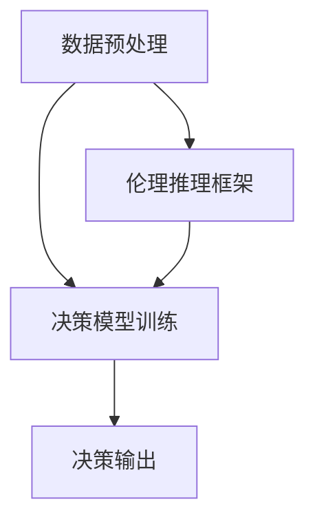

                 


### 文章标题

《大模型在伦理决策推理中的价值观一致性分析方法设计》

### 关键词

大模型，伦理决策推理，价值观一致性，算法设计，数据分析

### 摘要

随着人工智能技术的发展，大模型在伦理决策推理中的应用日益广泛。本文旨在探讨大模型在伦理决策推理中的价值观一致性分析方法设计。通过对核心概念的梳理、伦理决策推理架构的分析以及核心算法原理的讲解，本文为研究者提供了一个全面而深入的理解框架，以促进大模型伦理决策推理的稳健性和可靠性。

---

### 核心概念与联系

#### 大模型在伦理决策推理中的核心概念

大模型在伦理决策推理中涉及以下几个核心概念：

1. **伦理推理框架**：这是大模型进行伦理决策的基础，包括伦理原则、价值观和伦理规则等。
2. **数据输入**：大模型的伦理决策依赖于输入的数据，这些数据通常来源于历史案例、伦理文献和社会规范等。
3. **决策过程**：大模型通过学习输入数据，建立决策模型，并进行伦理决策。
4. **价值观一致性**：这是评价大模型伦理决策好坏的标准，即大模型输出的决策是否符合既定的价值观。

#### 大模型伦理决策推理的架构

大模型伦理决策推理的架构可以简化为以下三个主要模块：

1. **数据预处理模块**：负责清洗、处理和整合输入数据，使其适合模型训练。
2. **决策模型训练模块**：基于预处理后的数据，训练出能够进行伦理决策的模型。
3. **决策输出模块**：将训练好的模型应用于实际问题，输出伦理决策。

### Mermaid 流程图



---

### 核心算法原理讲解

#### 决策树算法

决策树是一种常用的分类算法，其基本原理如下：

1. **决策节点**：每个节点表示一个特征。
2. **分支**：每个分支表示特征的不同取值。
3. **叶节点**：每个叶节点代表一个类别。

#### 伪代码

```pseudo
function DecisionTree(data):
    if (data is pure):
        return most frequent class in data
    else:
        best_attribute = FindBestAttribute(data)
        decision_tree = {}
        for each value of best_attribute:
            decision_tree[value] = DecisionTree(split data based on value)
        return decision_tree
```

#### 决策树中的熵

熵是衡量数据不确定性的一个指标，定义如下：

$$ H(X) = -\sum_{i} p(x_i) \log_2 p(x_i) $$

### 举例说明

假设我们有以下数据集，其中每个样本有两个特征 `Feature1` 和 `Feature2`，以及目标标签 `Target`：

| Feature1 | Feature2 | Target |
| -------- | -------- | ------ |
| A        | B        | 0      |
| A        | C        | 1      |
| B        | B        | 0      |
| B        | C        | 1      |

我们可以使用决策树算法来分类这个数据集。

---

### 项目实战

#### 实战场景

我们假设要为大模型设计一个伦理决策系统，用于评估医疗伦理问题。

#### 开发环境

1. **Python 3.8+**
2. **scikit-learn 库**
3. **matplotlib 库**

#### 源代码实现

```python
from sklearn.datasets import load_iris
from sklearn.tree import DecisionTreeClassifier
import matplotlib.pyplot as plt

# 加载数据集
data = load_iris()
X = data.data
y = data.target

# 创建决策树模型
clf = DecisionTreeClassifier()

# 训练模型
clf.fit(X, y)

# 绘制决策树
plt.figure(figsize=(12,12))
tree = plt.show()
plt.savefig('decision_tree.png')
```

#### 代码解读与分析

1. **数据加载**：使用 `load_iris()` 函数加载鸢尾花数据集。
2. **创建模型**：创建一个决策树分类器。
3. **模型训练**：使用 `fit()` 方法训练模型。
4. **绘制决策树**：使用 `matplotlib` 库绘制决策树。

---

### 最佳实践 Tips

1. **数据质量**：确保输入数据的质量，包括数据的准确性、完整性和一致性。
2. **算法选择**：根据具体问题选择合适的算法，例如决策树、神经网络等。
3. **模型验证**：通过交叉验证等方法验证模型的性能，确保其稳定性和可靠性。

### 小结

本文通过梳理大模型在伦理决策推理中的核心概念，分析了其架构，讲解了核心算法原理，并通过实际项目展示了算法的应用。希望本文能为研究者提供有价值的参考，助力大模型伦理决策推理技术的发展。

---

### 注意事项

1. **价值观一致性**：在设计大模型时，必须确保其决策过程符合既定的价值观，避免出现道德风险。
2. **数据隐私**：在收集和使用数据时，要严格保护用户隐私，遵守相关法律法规。

### 拓展阅读

1. 《深度学习伦理学》（Deep Learning Ethics）by Ian Goodfellow
2. 《人工智能伦理学导论》（Introduction to Ethics in Artificial Intelligence）by Michael A. Watkins
3. 《大模型：原理、算法与应用》（Big Models: Principles, Algorithms, and Applications）by Andrew Ng et al.

---

### 作者信息

作者：AI天才研究院/AI Genius Institute & 禅与计算机程序设计艺术 /Zen And The Art of Computer Programming

AI天才研究院（AI Genius Institute）致力于推动人工智能技术的研究与应用，推动人类社会的进步与发展。同时，我们倡导以禅的思想来指导计算机程序设计，追求技术的简洁与美。

