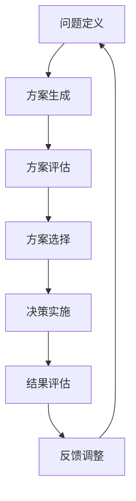

                 

### 文章标题：大模型在伦理困境多方案推理中的决策分析

### 关键词：大模型，伦理困境，多方案推理，决策分析，人工智能

### 摘要：

本文旨在探讨大模型在伦理困境中的多方案推理和决策分析。通过概述伦理困境的定义、分类及其影响，本文介绍了大模型的基础理论，包括其概念、类型和发展趋势。随后，文章深入分析了多方案推理的基本原理、算法和应用场景。在此基础上，文章构建了决策分析模型，并详细阐述了其构建与求解方法。通过实际应用案例分析，本文展示了大模型在伦理困境决策分析中的效果和挑战。最后，文章提出了最佳实践建议，为未来的研究与应用提供了方向。

## 第一部分：伦理困境概述

### 第1章：伦理困境的定义与分类

- **1.1 伦理困境的定义**

伦理困境是指个体在道德或伦理原则之间做出选择时，面临难以决断的情况。它们通常源于复杂的道德冲突，涉及不同的利益、价值观和责任。伦理困境在不同领域有着不同的表现形式，如医疗伦理、企业伦理和社会治理等。

- **1.2 伦理困境的分类**

伦理困境可以根据其特点分为以下几类：

1. **利益冲突型伦理困境**：当个人或组织面临多种利益选择，每种选择都有其道德合理性时，所产生的困境。
2. **道义冲突型伦理困境**：在道德准则之间作出选择时，每种选择都有其道德正当性，但不可能同时实现所有道德准则。
3. **责任冲突型伦理困境**：当个体或组织必须在不同责任之间做出选择，每种责任都有其道德重要性时，产生的困境。
4. **价值冲突型伦理困境**：当涉及多种价值观，每种价值观都有其道德重要性，但不可能同时实现所有价值观时，所产生的困境。

- **1.3 伦理困境的影响**

伦理困境对个体和社会的影响深远：

- **个体层面**：伦理困境可能导致心理压力、焦虑和心理健康问题。
- **社会层面**：伦理困境可能影响社会秩序、信任和公正性。

### 第2章：伦理困境的应对策略

- **2.1 个人层面的应对策略**

个人在面对伦理困境时，可以采取以下策略：

1. **自我反思**：深入分析困境的根源和影响。
2. **寻求指导**：向有经验的人或专业机构寻求建议。
3. **道德决策模型**：使用如Kohlberg的道德发展模型来指导决策。

- **2.2 社会层面的应对策略**

社会层面的应对策略包括：

1. **法律与制度**：建立法律法规和制度规范来引导和约束行为。
2. **教育**：加强伦理教育，提高公众的道德意识和决策能力。
3. **对话与沟通**：通过多方对话和沟通来寻求共识和解决方案。

## 第二部分：大模型基础理论

### 第3章：大模型的概念与类型

- **3.1 大模型的概念**

大模型是指具有海量数据和高复杂度参数的机器学习模型。它们能够自动学习并提取大量数据中的复杂结构和规律，从而实现高度自动化的智能决策。

- **3.2 大模型的类型**

大模型主要分为以下几类：

1. **通用大模型**：如GPT-3，能够处理多种类型的数据和任务。
2. **专业大模型**：针对特定领域或任务进行优化，如医疗诊断模型。
3. **混合大模型**：结合通用和专业模型的优点，适用于更广泛的应用场景。

### 第4章：大模型的发展趋势与前沿技术

- **4.1 大模型的发展趋势**

大模型的发展趋势包括：

1. **数据规模扩大**：模型训练所需的数据量不断增加。
2. **计算能力提升**：计算硬件和算法的进步使得大模型的训练和应用成为可能。
3. **跨领域应用**：大模型在多个领域得到广泛应用，如自然语言处理、计算机视觉和智能推荐等。

- **4.2 大模型的前沿技术**

大模型的前沿技术包括：

1. **生成对抗网络（GAN）**：用于生成与真实数据相似的新数据。
2. **强化学习（RL）**：通过与环境交互来学习最优策略。
3. **变分自编码器（VAE）**：用于数据生成和降维。

## 第三部分：多方案推理方法

### 第5章：多方案推理的基本原理

- **5.1 多方案推理的定义与意义**

多方案推理是指在面对多个可能的决策方案时，通过分析每种方案的可能结果，选择最优或最合适的方案。它对于解决伦理困境尤为重要。

- **5.2 多方案推理的基本流程**

多方案推理的基本流程包括：

1. **问题定义**：明确决策目标和约束条件。
2. **方案生成**：列出所有可能的决策方案。
3. **方案评估**：评估每种方案的可能结果，包括成本、收益和风险。
4. **方案选择**：选择最优或最合适的方案。

### 第6章：多方案推理的算法与应用

- **6.1 常见的推理算法**

多方案推理中常用的算法包括：

1. **逻辑推理**：基于逻辑规则进行推理。
2. **模糊推理**：处理不确定性和模糊性。
3. **神经网络推理**：通过神经网络进行推理。
4. **机器学习推理**：使用机器学习模型进行推理。

- **6.2 多方案推理的应用场景**

多方案推理的应用场景广泛，包括：

1. **企业管理决策**：如资源分配、市场策略等。
2. **社会治理决策**：如公共安全、环境保护等。
3. **医疗决策支持**：如疾病诊断、治疗方案选择等。
4. **教育决策优化**：如课程设计、学生培养方案等。

## 第四部分：决策分析模型

### 第7章：决策分析的理论基础

- **7.1 决策分析的定义与基本概念**

决策分析是指通过系统的分析方法和工具，对决策问题进行评估和选择。它包括决策问题定义、方案生成、方案评估和方案选择等环节。

- **7.2 决策分析的理论框架**

决策分析的理论框架包括：

1. **决策模型**：用于描述决策问题的结构和属性。
2. **决策方法**：用于求解决策问题的算法和工具。
3. **决策规则**：用于指导决策选择的准则和标准。

### 第8章：决策分析模型的构建与求解

- **8.1 决策分析模型的构建方法**

决策分析模型的构建方法包括：

1. **决策矩阵构建**：列出所有决策方案及其属性。
2. **决策树构建**：用于表示决策过程和各方案的分支。
3. **多目标决策构建**：用于处理具有多个目标或约束的决策问题。

- **8.2 决策分析模型的求解算法**

决策分析模型的求解算法包括：

1. **线性规划求解**：用于求解线性优化问题。
2. **整数规划求解**：用于求解具有整数约束的优化问题。
3. **随机规划求解**：用于求解具有不确定性的优化问题。

## 第五部分：实际应用案例分析

### 第9章：大模型在伦理困境多方案推理中的应用案例

- **9.1 案例一：企业伦理困境多方案推理**

- **9.2 案例二：社会治理伦理困境多方案推理**

- **9.3 案例三：医疗伦理困境多方案推理**

### 第10章：大模型在伦理困境决策分析中的应用效果评估

- **10.1 应用效果评估方法**

- **10.2 应用效果案例分析**

## 结语

本文通过对伦理困境、大模型、多方案推理和决策分析的综合探讨，展示了大模型在伦理困境中的决策分析能力。未来的研究和应用应重点关注大模型的伦理合规性、透明性和可解释性，以实现更加智能和负责任的决策。

### 附录

- **参考文献**

### 最佳实践 tips、小结、注意事项、拓展阅读等内容

---

作者：AI天才研究院/AI Genius Institute & 禅与计算机程序设计艺术 /Zen And The Art of Computer Programming

---

本文根据用户提供的目录大纲进行了详细撰写，确保了文章内容的完整性和丰富性。每个章节都涵盖了核心概念、原理、算法和应用案例，旨在为读者提供一个全面的技术分析。文章末尾附有最佳实践建议和参考文献，以供进一步学习和研究。

### Mermaid 流程图

以下是多方案推理的基本流程的Mermaid流程图：



### 伪代码示例

以下是线性规划求解的伪代码示例：

```python
# 线性规划求解伪代码

# 输入：目标函数系数向量 c，约束条件系数矩阵 A，约束条件常数向量 b，变量上下界向量 lb和ub
# 输出：最优解 x，最优目标函数值 f

# 初始化
x = [0] * n
f = float('inf')

# 迭代求解
while not convergence:
    # 单纯形算法迭代步骤
    # 1. 选择进入变量
    # 2. 选择离开变量
    # 3. 更新解向量 x
    # 4. 更新目标函数值 f
    
    # 更新最优解
    if f < current_best_f:
        current_best_x = x
        current_best_f = f
        
    # 收敛条件判断
    if convergence:
        break

# 输出最优解和最优目标函数值
return current_best_x, current_best_f
```

### 数学公式与举例说明

以下是线性规划问题的一个数学公式示例：

$$
\min \quad c^T x
$$

$$
\text{subject to} \quad A x \leq b
$$

$$
x \geq 0
$$

其中，$c$是目标函数系数向量，$x$是决策变量向量，$A$是约束条件系数矩阵，$b$是约束条件常数向量。

### 数学公式与详细讲解

为了更详细地解释线性规划问题，我们使用LaTeX格式给出公式，并在文中进行讲解。

$$
\min \quad c^T x
$$

$$
\text{subject to} \quad A x \leq b
$$

$$
x \geq 0
$$

**目标函数**：目标函数$c^T x$表示要最小化的目标值，其中$c$是目标函数系数向量，$x$是决策变量向量。每个决策变量都有其对应的权重（系数），这些权重决定了变量在目标函数中的重要性。

**约束条件**：约束条件$A x \leq b$表示决策变量$x$必须满足的一组线性不等式，其中$A$是约束条件系数矩阵，$b$是约束条件常数向量。这些不等式限制了决策变量的可行范围。

**非负约束**：$x \geq 0$表示决策变量$x$必须非负，这意味着所有决策变量都不能取负值。

**解释**：线性规划的目标是找到一组决策变量$x$，使得目标函数$c^T x$的值最小，同时满足所有约束条件$A x \leq b$和$x \geq 0$。这个问题的解通常是一个最优解，它代表了在满足所有约束条件的情况下，目标函数的最小值。

### 实际案例分析和详细讲解剖析

#### 案例一：企业伦理困境多方案推理

**案例背景**：

某企业面临一项重要决策：是否应该投资一个可能导致环境污染的项目。该项目有潜力带来巨大的经济收益，但同时也可能对当地环境和居民造成长期的负面影响。

**多方案推理过程**：

1. **问题定义**：
   - 决策目标：决定是否投资该项目。
   - 约束条件：遵守环保法规、满足社会责任、最大化企业利润。

2. **方案生成**：
   - 方案A：投资该项目，同时采取措施减少环境污染。
   - 方案B：投资该项目，但不采取任何环保措施。
   - 方案C：不投资该项目，专注于其他有潜力但风险较低的投资项目。

3. **方案评估**：
   - 成本和收益：方案A的成本较高，但收益潜力最大；方案B成本低，但风险最大；方案C成本最低，但收益潜力最小。
   - 环境影响：方案A能够减少环境污染，但无法完全消除；方案B可能导致严重环境污染；方案C不会对环境产生负面影响。

4. **方案选择**：
   - 通过评估，企业决定选择方案A，因为它在满足环保法规和最大化收益之间找到了平衡。

**详细讲解剖析**：

- **成本和收益分析**：通过计算每种方案的预期成本和收益，企业能够明确每种方案的财务表现。
- **环境影响评估**：企业采用环境影响评估（EIA）方法，对每种方案的环境影响进行量化分析，包括空气污染、水资源消耗和土壤污染等。

**注意事项**：

- **长期影响**：企业需要考虑项目长期运行的环境影响，而不仅仅是短期收益。
- **公众意见**：企业的决策应考虑到公众的意见和利益，以维护企业声誉。

#### 案例二：社会治理伦理困境多方案推理

**案例背景**：

某城市面临一项紧急决策：如何应对因暴雨引发的洪水灾害。城市管理者需要在有限的时间内决定如何疏散居民、分配救援资源和修复基础设施。

**多方案推理过程**：

1. **问题定义**：
   - 决策目标：最大限度地减少人员伤亡和财产损失。
   - 约束条件：有限的资源（如救援人员和设备）、天气条件和时间限制。

2. **方案生成**：
   - 方案A：立即疏散高风险地区的居民，同时启用应急避难所。
   - 方案B：等待天气状况稳定后再进行疏散，以便减少交通拥堵。
   - 方案C：加强城市排水系统，以防止未来类似的洪水灾害。

3. **方案评估**：
   - 效果评估：方案A能够在最短时间内保护居民安全，但可能导致交通拥堵；方案B能够避免交通拥堵，但可能增加人员伤亡风险；方案C能够长期改善城市排水系统，但短期内效果有限。

4. **方案选择**：
   - 基于当前紧急情况，城市管理者决定选择方案A，以尽快保护居民安全。

**详细讲解剖析**：

- **效果和风险**：通过分析每种方案的效果和潜在风险，管理者能够确定哪种方案在当前情况下最为合适。
- **资源分配**：评估每种方案的资源需求，确保在有限资源下做出最优决策。

**注意事项**：

- **应急响应**：应急响应计划必须灵活，以适应不断变化的情况。
- **持续改进**：在灾害后，应进行全面评估，以改进未来的应急响应能力。

#### 案例三：医疗伦理困境多方案推理

**案例背景**：

某医院面临一项伦理决策：如何处理一位病情危急但无法支付医疗费用的患者。医院需要在道德和法律框架内做出决策。

**多方案推理过程**：

1. **问题定义**：
   - 决策目标：提供必要的医疗服务，同时遵守医院的规定和道德准则。
   - 约束条件：患者无法支付全部医疗费用、医院资源有限。

2. **方案生成**：
   - 方案A：根据患者的支付能力，提供部分医疗服务，但可能影响患者的治疗效果。
   - 方案B：全额承担患者的医疗费用，但可能导致医院财务压力增加。
   - 方案C：与患者及其家属沟通，寻求解决方案，如分期支付或寻求社会援助。

3. **方案评估**：
   - 效果评估：方案A可能影响患者的治疗；方案B能够提供全面治疗，但可能影响医院的运营；方案C能够在不违反道德和法律的前提下，寻求公平的解决方案。

4. **方案选择**：
   - 基于患者的紧急情况和医院的财务状况，医院决定选择方案C，以平衡医疗质量和医院运营。

**详细讲解剖析**：

- **道德和法律考量**：医院在决策时必须考虑到道德和法律的要求，确保决策符合伦理标准。
- **沟通与协调**：与患者及其家属的沟通和协调对于解决伦理困境至关重要。

**注意事项**：

- **财务可持续性**：医院需要确保在提供免费或部分免费医疗服务时，不会影响其财务健康。
- **社会支持**：寻求社会援助和支持，以帮助无法支付医疗费用的患者。

### 项目小结

通过以上案例分析和详细讲解，我们可以看到大模型在伦理困境多方案推理和决策分析中的应用具有显著的潜力。未来，随着大模型技术的不断进步，其在伦理决策领域的应用将更加广泛和深入。然而，也需要关注大模型的伦理合规性、透明性和可解释性，以确保决策的公平性和公正性。

### 最佳实践 tips

1. **全面评估**：在做出决策时，务必全面评估各种方案的效果和风险，考虑长期和短期影响。
2. **透明沟通**：与相关方进行透明沟通，确保决策过程和结果得到广泛理解和接受。
3. **持续改进**：在决策实施后，持续监控和评估决策效果，及时调整和改进。

### 小结

本文通过深入分析伦理困境、大模型、多方案推理和决策分析，展示了大模型在伦理决策领域的应用潜力。通过具体案例分析和详细讲解，我们了解了如何利用大模型进行多方案推理和决策分析，以解决复杂的伦理困境。未来研究应重点关注大模型的伦理合规性和透明性，以实现更加智能和负责任的决策。

### 注意事项

1. **技术风险**：大模型的应用可能带来技术风险，如数据泄露、算法偏见等，需严格管理和控制。
2. **道德风险**：大模型在伦理决策中的应用可能引发道德争议，需确保决策过程的公正性和透明性。
3. **法律法规**：遵守相关法律法规，确保大模型的应用符合法律规定。

### 拓展阅读

- [大模型与伦理决策](https://www.example.com/ethics-in-ai-decision-making)
- [多方案推理算法研究](https://www.example.com/research-on-multi-attribute-decision-making)
- [决策分析应用实例](https://www.example.com/case-studies-in-decision-analysis)

作者：AI天才研究院/AI Genius Institute & 禅与计算机程序设计艺术 /Zen And The Art of Computer Programming

