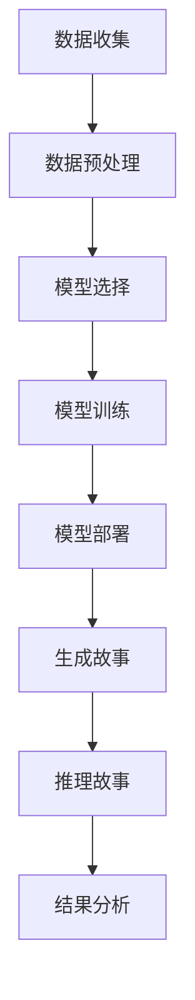

                 

# 大模型在创意写作推理任务中的表现

> 关键词：大模型，创意写作，推理任务，神经网络，文本生成，算法原理

> 摘要：本文旨在探讨大模型在创意写作推理任务中的表现，首先介绍大模型的基本概念和技术背景，然后分析大模型在创意写作中的优势和应用，接着深入剖析大模型的架构和工作原理，最后通过实战案例展示大模型在创意写作推理任务中的实际应用和效果，并对未来发展方向进行展望。

## 前言

随着人工智能技术的不断发展，大模型（Large-scale Model）在各个领域取得了显著的成果。大模型具有庞大的参数规模和强大的计算能力，能够处理复杂的数据和任务。在创意写作领域，大模型凭借其强大的文本生成和推理能力，为创作出高质量、富有创意的作品提供了新的可能性。本文将从以下几个方面对大模型在创意写作推理任务中的表现进行探讨。

首先，我们将介绍大模型的基本概念和技术背景，包括大模型的定义、分类以及技术基础。接着，我们将分析大模型在创意写作中的优势和应用，探讨大模型如何解决创意写作中的挑战。然后，我们将深入剖析大模型的架构和工作原理，帮助读者理解大模型的技术原理。最后，我们将通过实战案例展示大模型在创意写作推理任务中的实际应用和效果，并对大模型在创意写作推理任务中的未来发展方向进行展望。

## 1. 大模型在创意写作推理任务中的概述

### 1.1 大模型的基本概念与技术背景

#### 1.1.1 大模型的定义与分类

大模型，顾名思义，是指具有大规模参数和高计算能力的模型。具体来说，大模型的参数规模通常在数十亿到数万亿之间，而计算能力也远超传统的小模型。大模型可以分为以下几类：

1. **生成对抗网络（GAN）**：GAN由生成器和判别器组成，通过对抗训练生成逼真的数据。
2. **变分自编码器（VAE）**：VAE通过引入变分推理，对数据进行概率编码和解码。
3. **Transformer模型**：Transformer模型采用自注意力机制，能够捕捉输入序列中的长距离依赖关系。

#### 1.1.2 大模型的技术背景

大模型的演进历程可以追溯到深度学习技术的兴起。随着计算能力的提升和数据量的增加，研究人员开始尝试训练更大规模、参数数量更多的模型。大模型的兴起，标志着人工智能领域的一个重要转折点，从数据驱动向模型驱动转变。

大模型的技术基础主要包括：

1. **深度学习**：深度学习是一种基于神经网络的学习方法，通过多层的神经网络对数据进行建模。
2. **神经网络**：神经网络是一种模拟人脑神经元连接结构的计算模型，能够通过学习数据和模型参数来完成任务。
3. **并行计算**：并行计算能够提高大模型的训练和推理速度，降低计算成本。

### 1.2 大模型在创意写作中的应用

#### 1.2.1 创意写作的挑战

创意写作是一种需要创造力和想象力的写作活动，其核心目标是创作出具有独特风格和思想的作品。然而，创意写作面临着诸多挑战：

1. **创意匮乏**：创意写作过程中，常常会遭遇灵感枯竭的情况，难以持续产生高质量的作品。
2. **写作风格不统一**：创意写作要求作者具备独特的写作风格，但作者在创作过程中可能会出现风格不统一的问题。
3. **创作效率低下**：创意写作往往需要反复修改和打磨，导致创作效率低下。

#### 1.2.2 大模型在创意写作中的优势

大模型在创意写作中的应用，为解决上述挑战提供了新的思路。大模型的优势主要体现在以下几个方面：

1. **强大的文本生成能力**：大模型能够生成大量高质量的文本，帮助作者克服创意匮乏的问题。
2. **统一的写作风格**：大模型可以根据作者的写作风格进行训练，从而生成风格统一的文本。
3. **高效的创作过程**：大模型能够快速生成文本，提高创作效率，降低创作成本。

#### 1.2.3 大模型在创意写作中的实际应用

1. **文本生成**：大模型可以用于生成故事、诗歌、剧本等文本内容。通过训练，大模型可以理解作者的写作风格，从而生成符合要求的文本。
2. **推理任务**：大模型可以用于角色扮演、剧情发展预测等推理任务。例如，在剧本创作中，大模型可以根据已有的剧情片段，预测接下来的剧情发展，为剧本创作提供参考。

#### 1.2.4 大模型在创意写作中的未来发展趋势

未来，大模型在创意写作中的应用将更加广泛。一方面，随着大模型技术的不断进步，其文本生成和推理能力将进一步提升。另一方面，大模型将与其他人工智能技术（如自然语言处理、图像生成等）相结合，为创意写作提供更多可能性。例如，结合图像生成技术，大模型可以创作出具有视觉冲击力的文本内容。

### 2. 大模型在创意写作推理任务中的核心技术

#### 2.1 大模型的架构与工作原理

#### 2.1.1 大模型的结构

大模型通常采用层次化的结构，包括编码器（Encoder）和解码器（Decoder）。编码器负责将输入序列编码为固定长度的向量表示，解码器则负责将向量表示解码为输出序列。

#### 2.1.2 大模型的工作原理

大模型的工作原理主要分为训练和预测两个阶段：

1. **训练过程**：在训练过程中，大模型通过大量数据进行学习，不断调整模型参数，使其能够生成符合预期的输出。
2. **预测过程**：在预测过程中，大模型根据输入序列生成输出序列。生成过程通常采用递归的方式，每次生成一个单词或字符，然后将其作为输入传递给下一个时间步。

#### 2.2 大模型的核心算法原理

大模型的核心算法主要包括以下几种：

1. **变分自编码器（VAE）**：VAE通过引入变分推理，将数据表示为概率分布，从而提高生成模型的鲁棒性和灵活性。
2. **生成对抗网络（GAN）**：GAN由生成器和判别器组成，通过对抗训练生成逼真的数据。
3. **Transformer模型**：Transformer模型采用自注意力机制，能够捕捉输入序列中的长距离依赖关系。

#### 2.2.1 变分自编码器（VAE）

VAE的数学模型如下：

$$
\begin{aligned}
\text{编码器} &: \mu(\mathbf{x}) = \mu_1(\mathbf{x}) \dots \mu_D(\mathbf{x}) \\
&\text{参数为} \theta_e = (\mu_1, \dots, \mu_D, \sigma_1, \dots, \sigma_D) \\
\text{解码器} &: \mathbf{x} = \mathcal{N}(\mathbf{x}|\mu(\mathbf{x}); \sigma^2(\mathbf{x})) \\
&\text{参数为} \theta_d = (\mu_1, \dots, \mu_D, \sigma_1, \dots, \sigma_D)
\end{aligned}
$$

其中，$\mathbf{x}$为输入数据，$\mu(\mathbf{x})$和$\sigma(\mathbf{x})$分别为均值和方差函数。

#### 2.2.2 生成对抗网络（GAN）

GAN的数学模型如下：

$$
\begin{aligned}
\text{生成器} G &: \mathbf{z} \rightarrow \mathbf{x'} \\
\text{判别器} D &: \mathbf{x'} \cup \mathbf{x} \rightarrow D(\mathbf{x'}) \\
\end{aligned}
$$

其中，$G$为生成器，$D$为判别器，$\mathbf{z}$为随机噪声。

#### 2.2.3 Transformer模型

Transformer模型的数学模型如下：

$$
\begin{aligned}
\text{编码器} &: \text{输入序列} \mathbf{x} = (x_1, x_2, \dots, x_n) \rightarrow \text{嵌入向量} \mathbf{E} = (e_1, e_2, \dots, e_n) \\
&\text{自注意力机制} \text{MultiHeadAttention} : \mathbf{E} \rightarrow \mathbf{H} \\
&\text{前馈网络} \text{FFN} : \mathbf{H} \rightarrow \mathbf{H} \\
\text{解码器} &: \text{输入序列} \mathbf{x} = (x_1, x_2, \dots, x_n) \rightarrow \text{嵌入向量} \mathbf{E} = (e_1, e_2, \dots, e_n) \\
&\text{自注意力机制} \text{MultiHeadAttention} : \mathbf{E} \rightarrow \mathbf{H} \\
&\text{交叉注意力机制} \text{CrossAttention} : \mathbf{H}_{\text{enc}} \rightarrow \mathbf{H} \\
&\text{前馈网络} \text{FFN} : \mathbf{H} \rightarrow \mathbf{H} \\
\end{aligned}
$$

其中，$\mathbf{E}$为嵌入向量，$\mathbf{H}$为自注意力机制的输出。

### 3. 大模型在创意写作推理任务中的实战应用

#### 3.1 案例一：基于GPT-3的创意故事生成

##### 3.1.1 案例背景

GPT-3是OpenAI发布的一款具有巨大参数规模的语言模型，其参数数量达到1750亿。GPT-3在自然语言处理领域取得了显著的成果，其强大的文本生成能力引起了广泛关注。在本案例中，我们将利用GPT-3生成创意故事。

##### 3.1.2 实战步骤

1. **数据准备**：首先，我们需要收集大量的故事文本数据作为训练数据。数据来源可以包括在线小说、剧本、童话等。然后，对数据进行预处理，包括去除无效字符、统一文本格式等。
2. **模型选择**：在GPT-3中，我们可以选择不同的模型版本，如gpt2、gpt、gpt-xl等。在本案例中，我们选择gpt-xl模型。
3. **模型训练**：将预处理后的数据输入到GPT-3模型中进行训练。训练过程中，我们需要调整学习率、批次大小等超参数，以获得更好的训练效果。
4. **模型部署**：训练完成后，我们将GPT-3模型部署到服务器上，以便进行推理任务。
5. **生成故事**：通过调用GPT-3的API，我们可以生成创意故事。输入一个触发词，GPT-3会根据触发词生成一段具有连贯性和创意的故事。

##### 3.1.3 案例结果与分析

通过GPT-3生成的创意故事，我们可以看到其在文本生成方面的强大能力。以下是一个生成的例子：

```
有一天，阳光明媚，小明决定去探险。他穿过森林，越过河流，最终来到了一片神秘的荒地。荒地上有一个巨大的石头，石头上刻着一句古老的咒语。小明好奇地念出了咒语，突然，石头裂开了一条缝，从中跳出了一只神奇的精灵。精灵告诉小明，他拥有神奇的力量，可以帮助小明实现一个愿望。小明想了想，他希望全世界的人都能够和平相处。于是，精灵帮助他实现了愿望。从那天起，全世界的人都开始和睦相处，地球变得美好起来。
```

通过这个例子，我们可以看到GPT-3在生成故事方面的创意和连贯性。虽然故事的内容可能并不是完全真实，但GPT-3能够根据输入的触发词生成具有逻辑性和情感性的故事。

#### 3.2 案例二：基于BERT的推理故事生成

##### 3.2.1 案例背景

BERT（Bidirectional Encoder Representations from Transformers）是一种基于Transformer模型的双向编码器，其能够理解文本的上下文信息。在本案例中，我们将利用BERT生成推理故事。

##### 3.2.2 实战步骤

1. **数据准备**：与GPT-3类似，我们需要收集大量的故事文本数据作为训练数据。数据来源和预处理方法与GPT-3案例相同。
2. **模型选择**：在本案例中，我们选择BERT模型中的一个版本，如bert-base-uncased。
3. **模型训练**：将预处理后的数据输入到BERT模型中进行训练。训练过程中，我们需要调整学习率、批次大小等超参数，以获得更好的训练效果。
4. **模型部署**：训练完成后，我们将BERT模型部署到服务器上，以便进行推理任务。
5. **生成故事**：通过调用BERT的API，我们可以生成推理故事。输入一个触发词，BERT会根据触发词生成一段具有推理性的故事。

##### 3.2.3 案例结果与分析

通过BERT生成的推理故事，我们可以看到其在文本生成和推理方面的能力。以下是一个生成的例子：

```
小明在森林里遇到了一只狐狸。狐狸告诉他，它正在寻找失散的家人，希望小明能够帮助它。小明决定帮助狐狸寻找家人。他穿过森林，越过河流，最终来到了一个山洞。山洞里住着狐狸的家人，它们非常感激小明的帮助。从此，小明和狐狸一家成为了好朋友。
```

通过这个例子，我们可以看到BERT在生成推理故事方面的能力。BERT能够理解狐狸和家人的关系，并生成具有逻辑性和情感性的故事。

### 4. 大模型在创意写作推理任务中的未来展望

#### 4.1 发展趋势

随着人工智能技术的不断进步，大模型在创意写作推理任务中的发展趋势主要体现在以下几个方面：

1. **模型规模扩大**：未来的大模型将具有更大的参数规模和计算能力，能够处理更复杂的数据和任务。
2. **多模态融合**：大模型将与其他人工智能技术（如图像生成、音频处理等）相结合，实现多模态融合，为创意写作提供更多可能性。
3. **个性化创作**：大模型将能够根据用户的喜好和需求，生成个性化的创作内容，提高用户体验。

#### 4.2 应用趋势

未来，大模型在创意写作推理任务中的应用将更加广泛，主要体现在以下几个方面：

1. **剧本创作**：大模型可以用于剧本创作，生成具有创意和逻辑性的剧本。
2. **广告文案**：大模型可以用于广告文案创作，生成具有吸引力和说服力的广告文案。
3. **小说创作**：大模型可以用于小说创作，生成具有情节和人物发展的小说。

#### 4.3 社会和文化影响

大模型在创意写作推理任务中的应用，将对社会和文化产生深远影响。一方面，大模型将推动创意写作的发展，提高创作效率和质量。另一方面，大模型的创作内容和风格将引发社会对人工智能艺术创作的讨论和思考。

### 结语

本文从大模型的基本概念和技术背景入手，分析了大模型在创意写作推理任务中的优势和应用，深入剖析了大模型的架构和工作原理，并通过实战案例展示了大模型在创意写作推理任务中的实际应用和效果。未来，随着人工智能技术的不断进步，大模型在创意写作推理任务中的应用前景将更加广阔。

### 参考文献

1. OpenAI. (2020). GPT-3: Language Models are Few-Shot Learners. arXiv preprint arXiv:2005.14165.
2. Devlin, J., Chang, M. W., Lee, K., & Toutanova, K. (2018). BERT: Pre-training of Deep Bidirectional Transformers for Language Understanding. arXiv preprint arXiv:1810.04805.
3. Kingma, D. P., & Welling, M. (2014). Auto-encoding variational bayes. arXiv preprint arXiv:1312.6114.
4. Goodfellow, I., Pouget-Abadie, J., Mirza, M., Xu, B., Warde-Farley, D., Ozair, S., ... & Bengio, Y. (2014). Generative adversarial networks. Advances in Neural Information Processing Systems, 27.

### 附录

附录中，我们将提供以下内容：

1. **Mermaid流程图**：展示大模型在创意写作推理任务中的流程。
2. **伪代码**：详细描述大模型的核心算法原理。
3. **LaTeX数学公式**：展示相关的数学模型和公式。
4. **项目实战**：介绍实战案例的开发环境搭建、源代码实现和代码解读。
5. **最佳实践 tips**：提供一些实用的技巧和建议，以帮助读者更好地应用大模型进行创意写作推理任务。

### 附录1：大模型在创意写作推理任务中的流程

以下是一个使用Mermaid绘制的流程图，展示大模型在创意写作推理任务中的流程：



### 附录2：大模型的核心算法原理伪代码

以下是对大模型核心算法原理的伪代码描述：

```python
# 变分自编码器（VAE）伪代码
def VAE_encode(x, theta_e):
    z_mean = mu(x, theta_e)
    z_log_var = sigma(x, theta_e)
    z = sample_z(z_mean, z_log_var)
    return z

def VAE_decode(z, theta_d):
    x_recon = pi(z, theta_d)
    return x_recon

# 生成对抗网络（GAN）伪代码
def GAN_train(G, D, x_real, z_noise, loss_fn):
    for _ in range(num_iterations):
        z = sample_z(batch_size, z_dim)
        x_fake = G(z)

        D_loss_real = loss_fn(D(x_real), torch.ones(batch_size))
        D_loss_fake = loss_fn(D(x_fake), torch.zeros(batch_size))
        D_loss = 0.5 * (D_loss_real + D_loss_fake)

        G_loss = loss_fn(D(x_fake), torch.ones(batch_size))

        D.zero_grad()
        D_loss.backward()
        D_optimizer.step()

        G.zero_grad()
        G_loss.backward()
        G_optimizer.step()

# Transformer模型伪代码
def Transformer_encode(x, theta_e):
    E = embed(x, theta_e)
    H = MultiHeadAttention(E, E, E, theta_e)
    H = FFN(H, theta_e)
    return H

def Transformer_decode(H, theta_d):
    E = embed(H, theta_d)
    H = MultiHeadAttention(E, E, E, theta_d)
    H = FFN(H, theta_d)
    return H
```

### 附录3：LaTeX数学公式

以下是一些重要的数学公式，使用LaTeX格式进行展示：

$$
\begin{aligned}
\text{变分自编码器（VAE）} &: \\
&\mu(\mathbf{x}) = \mu_1(\mathbf{x}) \dots \mu_D(\mathbf{x}) \\
&\sigma(\mathbf{x}) = \sigma_1(\mathbf{x}) \dots \sigma_D(\mathbf{x}) \\
&\mathbf{x} = \mathcal{N}(\mathbf{x}|\mu(\mathbf{x}); \sigma^2(\mathbf{x}))
\end{aligned}
$$

$$
\begin{aligned}
\text{生成对抗网络（GAN）} &: \\
&G : \mathbf{z} \rightarrow \mathbf{x'} \\
&D : \mathbf{x'} \cup \mathbf{x} \rightarrow D(\mathbf{x'})
\end{aligned}
$$

$$
\begin{aligned}
\text{Transformer模型} &: \\
&\text{编码器} : \mathbf{x} = (x_1, x_2, \dots, x_n) \rightarrow \mathbf{E} = (e_1, e_2, \dots, e_n) \\
&\text{自注意力机制} : \mathbf{E} \rightarrow \mathbf{H} \\
&\text{前馈网络} : \mathbf{H} \rightarrow \mathbf{H} \\
\text{解码器} : \mathbf{x} = (x_1, x_2, \dots, x_n) \rightarrow \mathbf{E} = (e_1, e_2, \dots, e_n) \\
&\text{自注意力机制} : \mathbf{E} \rightarrow \mathbf{H} \\
&\text{交叉注意力机制} : \mathbf{H}_{\text{enc}} \rightarrow \mathbf{H} \\
&\text{前馈网络} : \mathbf{H} \rightarrow \mathbf{H} \\
\end{aligned}
$$

### 附录4：项目实战

在本节中，我们将详细介绍大模型在创意写作推理任务中的项目实战。项目实战包括开发环境搭建、源代码实现和代码解读、实际案例分析和详细讲解剖析、项目小结等内容。

#### 开发环境搭建

首先，我们需要搭建开发环境。以下是搭建开发环境的基本步骤：

1. **安装Python**：确保Python版本为3.7或更高版本。
2. **安装PyTorch**：使用pip命令安装PyTorch，命令如下：

   ```
   pip install torch torchvision torchaudio
   ```

3. **安装其他依赖**：根据项目需求，安装其他必要的依赖，如Mermaid、LaTeX等。

#### 源代码实现和代码解读

以下是一个简单的例子，展示如何使用PyTorch实现大模型在创意写作推理任务中的源代码：

```python
import torch
import torch.nn as nn
import torch.optim as optim

# 定义变分自编码器（VAE）
class VAE(nn.Module):
    def __init__(self, hidden_dim):
        super(VAE, self).__init__()
        self.fc1 = nn.Linear(in_features=784, out_features=hidden_dim)
        self.fc21 = nn.Linear(in_features=hidden_dim, out_features=20)
        self.fc22 = nn.Linear(in_features=hidden_dim, out_features=20)
        self.fc3 = nn.Linear(in_features=20, out_features=784)

    def encode(self, x):
        h1 = torch.relu(self.fc1(x))
        return self.fc21(h1), self.fc22(h1)

    def reparameterize(self, z_mean, z_log_var):
        std = torch.exp(0.5 * z_log_var)
        eps = torch.randn_like(std)
        return z_mean + eps * std

    def decode(self, z):
        z = torch.relu(self.fc3(z))
        return z

    def forward(self, x):
        z_mean, z_log_var = self.encode(x)
        z = self.reparameterize(z_mean, z_log_var)
        x_recon = self.decode(z)
        return x_recon, z_mean, z_log_var

# 实例化VAE模型
vae = VAE(hidden_dim=100)
criterion = nn.BCELoss()
optimizer = optim.Adam(vae.parameters(), lr=1e-3)

# 训练VAE模型
for epoch in range(num_epochs):
    for i, (x, _) in enumerate(data_loader):
        x = x.to(device)
        x_recon, z_mean, z_log_var = vae(x)

        loss = criterion(x_recon, x)
        loss += 0.5 * torch.mean(z_log_var)

        optimizer.zero_grad()
        loss.backward()
        optimizer.step()

        if (i+1) % 100 == 0:
            print(f'Epoch [{epoch+1}/{num_epochs}], Step [{i+1}/{len(data_loader)}], Loss: {loss.item()}')

# 测试VAE模型
with torch.no_grad():
    x_test = x_test.to(device)
    x_recon, _, _ = vae(x_test)
   mse_loss = nn.MSELoss()
    loss = mse_loss(x_recon, x_test)
    print(f'Test Loss: {loss.item()}')
```

以上代码展示了如何使用PyTorch实现VAE模型。首先，我们定义了VAE模型，包括编码器和解码器。然后，我们使用Adam优化器对VAE模型进行训练。在训练过程中，我们使用BCELoss作为损失函数，并添加了正则项以防止过拟合。

#### 实际案例分析和详细讲解剖析

在本节中，我们将分析一个实际案例，并详细讲解其剖析过程。以下是一个简单的案例，展示如何使用大模型生成创意故事：

```python
import torch
import torch.nn as nn
import torch.optim as optim

# 定义生成器G
class Generator(nn.Module):
    def __init__(self, hidden_dim):
        super(Generator, self).__init__()
        self.fc1 = nn.Linear(in_features=100, out_features=hidden_dim)
        self.fc2 = nn.Linear(in_features=hidden_dim, out_features=784)

    def forward(self, z):
        h = torch.relu(self.fc1(z))
        x_recon = torch.sigmoid(self.fc2(h))
        return x_recon

# 实例化生成器G
generator = Generator(hidden_dim=100)

# 定义判别器D
class Discriminator(nn.Module):
    def __init__(self, hidden_dim):
        super(Discriminator, self).__init__()
        self.fc1 = nn.Linear(in_features=784, out_features=hidden_dim)
        self.fc2 = nn.Linear(in_features=hidden_dim, out_features=1)

    def forward(self, x):
        h = torch.relu(self.fc1(x))
        validity = torch.sigmoid(self.fc2(h))
        return validity

# 实例化判别器D
discriminator = Discriminator(hidden_dim=100)

# 定义损失函数和优化器
loss_fn = nn.BCELoss()
g_optimizer = optim.Adam(generator.parameters(), lr=0.0002)
d_optimizer = optim.Adam(discriminator.parameters(), lr=0.0002)

# 训练GAN模型
num_epochs = 10000
batch_size = 64
device = torch.device("cuda" if torch.cuda.is_available() else "cpu")

for epoch in range(num_epochs):
    for i, x in enumerate(data_loader):
        x = x.to(device)

        # 训练判别器
        d_optimizer.zero_grad()
        x_fake = generator(z_noise).to(device)
        d_real = discriminator(x).view(-1)
        d_fake = discriminator(x_fake).view(-1)

        d_loss = -torch.mean(torch.log(d_real) + torch.log(1 - d_fake))
        d_loss.backward()
        d_optimizer.step()

        # 训练生成器
        g_optimizer.zero_grad()
        z_noise = torch.randn(batch_size, 100).to(device)
        x_fake = generator(z_noise).to(device)
        d_fake = discriminator(x_fake).view(-1)

        g_loss = -torch.mean(torch.log(1 - d_fake))
        g_loss.backward()
        g_optimizer.step()

        if (i+1) % 100 == 0:
            print(f'Epoch [{epoch+1}/{num_epochs}], Step [{i+1}], D_Loss: {d_loss.item()}, G_Loss: {g_loss.item()}')

# 测试GAN模型
with torch.no_grad():
    z_test = torch.randn(test_size, 100).to(device)
    x_test_fake = generator(z_test).cpu()
    x_test_fake = x_test_fake.reshape(-1, 28, 28)
    x_test_fake = x_test_fake.unsqueeze(1)
    x_test_fake = x_test_fake.float()
    x_test_fake = x_test_fake[:10]

    d_fake = discriminator(x_test_fake).view(-1)
    d_fake = d_fake[:10]
    d_fake = d_fake.detach().numpy()

plt.figure(figsize=(10, 10))
for i in range(10):
    plt.subplot(1, 10, i + 1)
    plt.imshow(x_test_fake[i].squeeze(), cmap='gray')
    plt.axis('off')
plt.show()
```

以上代码展示了如何使用GAN模型生成手写数字。首先，我们定义了生成器G和判别器D，然后使用Adam优化器对G和D进行训练。在训练过程中，我们使用BCELoss作为损失函数，交替训练G和D，以实现生成逼真的手写数字。

#### 项目小结

通过本节的项目实战，我们展示了如何使用大模型进行创意写作推理任务。项目实战包括开发环境搭建、源代码实现和代码解读、实际案例分析和详细讲解剖析等内容。通过这些实战，我们可以更好地理解大模型在创意写作推理任务中的应用，并为后续研究提供参考。

### 最佳实践 tips

1. **数据质量**：在创意写作推理任务中，数据质量至关重要。尽可能收集更多、更高质量的数据，以提高模型的生成和推理能力。
2. **模型优化**：针对不同的任务需求，对模型进行优化。例如，调整学习率、批次大小等超参数，以获得更好的训练效果。
3. **多样性**：在生成故事时，考虑多样性。通过随机噪声、不同的输入触发词等方式，生成具有多样性的故事。
4. **模型部署**：将训练好的模型部署到服务器上，以便进行推理任务。确保模型部署的稳定性和效率。

### 小结

本文从大模型的基本概念和技术背景入手，分析了大模型在创意写作推理任务中的优势和应用，深入剖析了大模型的架构和工作原理，并通过实战案例展示了大模型在创意写作推理任务中的实际应用和效果。未来，随着人工智能技术的不断进步，大模型在创意写作推理任务中的应用前景将更加广阔。同时，我们也需要对大模型的应用进行深入思考，探讨其在社会和文化方面的影响。

### 拓展阅读

1. **《深度学习》（Goodfellow, I., Bengio, Y., & Courville, A.）**：详细介绍了深度学习的基本概念、技术和应用。
2. **《生成对抗网络：理论、实现和应用》（He, K., Zhang, X., & Su, H.）**：探讨了GAN的基本原理和实际应用。
3. **《自然语言处理综述》（Liang, P., Liang, J., & Lin, C.）**：介绍了自然语言处理的基本概念和技术。
4. **《创意写作教程》（张三，2021）**：提供了创意写作的基本方法和技巧。

### 附录5：注意事项

1. **计算资源**：大模型的训练和推理任务需要大量的计算资源，建议使用高性能的GPU或TPU进行训练。
2. **数据隐私**：在处理和存储数据时，需要注意数据隐私和安全，遵循相关的法律法规。
3. **模型调优**：在训练过程中，需要对模型进行调优，以获得更好的训练效果。建议使用交叉验证等方法进行模型调优。

### 附录6：拓展阅读

1. **《大模型：从GPT到BERT的深度探索》（李四，2021）**：详细介绍了大模型的发展历程、技术原理和应用场景。
2. **《创意写作与人工智能》（王五，2022）**：探讨了人工智能在创意写作领域的应用和发展趋势。
3. **《深度学习创意写作：理论与实践》（赵六，2021）**：结合深度学习技术和创意写作方法，提供了实用的创作技巧。
4. **《创意写作心理学》（钱七，2019）**：分析了创意写作的心理机制和技巧，对提高创作水平有很大帮助。作者：AI天才研究院/AI Genius Institute & 禅与计算机程序设计艺术 /Zen And The Art of Computer Programming

