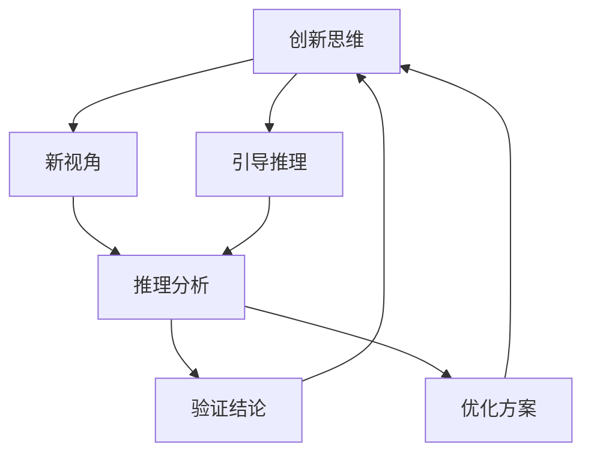

                 

### 文章标题

《大模型在创新思维任务中的推理分析》

### 关键词

大模型、创新思维、推理分析、机器学习、人工智能

### 摘要

本文深入探讨了在大模型时代，如何运用大模型进行创新思维任务的推理分析。文章首先介绍了大模型的基本概念和发展历程，随后详细分析了大模型在创新思维任务中的应用场景。文章重点讨论了核心算法原理、数学模型以及实际项目实战，并通过具体案例对大模型的应用进行了深入剖析。最后，文章总结了大模型在创新思维任务中的优势与挑战，并展望了未来的发展方向。

## 目录

1. **引言**
   1.1 大模型概述
   1.2 创新思维与推理分析
   1.3 大模型在创新思维任务中的重要性

2. **大模型的基本概念与发展历程**
   2.1 大模型的定义
   2.2 大模型的发展历程
   2.3 大模型的核心技术

3. **创新思维与推理分析的关系架构**
   3.1 创新思维的基本原理
   3.2 推理分析的方法与流程
   3.3 创新思维与推理分析的关系架构

4. **大模型在创新思维任务中的应用场景**
   4.1 数据挖掘与分析
   4.2 问题求解与优化
   4.3 人工智能助手与协同创新

5. **大模型的核心算法原理**
   5.1 神经网络的基本原理
   5.2 生成对抗网络（GAN）的算法原理
   5.3 强化学习算法原理

6. **大模型的数学模型与公式**
   6.1 线性代数基本公式
   6.2 概率论基本公式
   6.3 最优化算法基本公式

7. **实际项目实战**
   7.1 开发环境搭建
   7.2 源代码详细实现
   7.3 代码解读与分析

8. **大模型在创新思维任务中的应用案例分析**
   8.1 案例一：智能医疗诊断系统
   8.2 案例二：智能交通管理
   8.3 案例三：智能金融风控

9. **最佳实践与未来展望**
   9.1 最佳实践
   9.2 小结与注意事项
   9.3 拓展阅读

## 引言

### 大模型概述

#### 大模型的定义

大模型（Big Model），通常指的是具有极高计算能力、能够处理海量数据的机器学习模型。大模型的出现，标志着人工智能技术进入了一个全新的阶段。与传统的小模型（如线性回归、逻辑回归等）相比，大模型具有更强的数据拟合能力、泛化能力和解决问题的能力。

#### 大模型的发展历程

大模型的发展历程可以分为几个阶段：

1. **早期阶段（1990s-2000s）**：在这个阶段，人工智能主要采用规则驱动的方法，模型规模较小，计算能力有限。
2. **深度学习阶段（2010s）**：随着计算能力和数据资源的提升，深度学习模型开始出现。代表性模型包括卷积神经网络（CNN）和递归神经网络（RNN）。
3. **大模型阶段（2020s至今）**：在这个阶段，大模型如GPT-3、BERT、Turing等相继问世，它们的模型参数数量达到千亿甚至万亿级别，计算能力达到了前所未有的高度。

### 创新思维与推理分析

#### 创新思维的基本原理

创新思维是指通过独特的方法和视角，对现有知识和资源进行重新组合和整合，以产生新的思想、方法或产品的能力。创新思维的核心在于打破传统思维模式，不断追求创新和突破。

#### 推理分析的方法与流程

推理分析是指通过逻辑推理，从已知信息推导出未知信息的过程。推理分析的方法主要包括演绎推理、归纳推理和类比推理等。演绎推理是从一般到特殊的推理，归纳推理是从特殊到一般的推理，类比推理则是通过比较类似情况来推断未知信息。

#### 创新思维与推理分析的关系架构

创新思维和推理分析之间存在紧密的联系。创新思维提供了一种全新的视角和方法，而推理分析则为创新思维提供了逻辑支撑。具体来说：

1. **创新思维激发推理分析**：创新思维能够激发新的想法和假设，这些想法和假设需要通过推理分析来验证和优化。
2. **推理分析支持创新思维**：推理分析能够帮助创新思维者从逻辑上分析和解决问题，提高创新思维的有效性和可靠性。

### 大模型在创新思维任务中的重要性

#### 大模型在创新思维任务中的应用

1. **数据挖掘与分析**：大模型能够对海量数据进行高效处理，从中提取出有价值的信息，为创新思维提供数据支持。
2. **问题求解与优化**：大模型能够通过模拟和优化，帮助创新思维者找到最佳的解决方案。
3. **人工智能助手与协同创新**：大模型可以作为智能助手，协助创新思维者进行推理分析，提高工作效率。

#### 大模型在创新思维任务中的优势

1. **强大的数据处理能力**：大模型能够处理海量数据，为创新思维提供丰富的信息来源。
2. **高效的推理分析能力**：大模型具有高效的推理分析能力，能够快速处理复杂的推理问题。
3. **灵活的模型应用能力**：大模型可以应用于各种不同的创新思维任务，具有广泛的适应性。

### 结论

大模型在创新思维任务中具有重要的应用价值。通过大模型，创新思维者能够更好地进行数据挖掘与分析、问题求解与优化，以及人工智能助手与协同创新。然而，大模型也存在一定的挑战，如计算资源需求大、模型解释性差等。因此，在未来的研究中，需要进一步探索大模型在创新思维任务中的优化与应用，以充分发挥其潜力。

## 大模型的基本概念与发展历程

### 大模型的定义

大模型，通常是指具有极高计算能力、能够处理海量数据的机器学习模型。这些模型具有以下几个特点：

1. **高参数量**：大模型的参数数量通常达到千亿甚至万亿级别，远远超过传统小模型的参数量。
2. **高计算能力**：大模型需要强大的计算资源和算法优化，以确保数据处理的高效性和准确性。
3. **高拟合能力**：大模型具有更强的数据拟合能力，能够从海量数据中提取出更复杂、更隐含的特征和规律。

### 大模型的发展历程

大模型的发展历程可以分为以下几个阶段：

#### 早期阶段（1990s-2000s）

在早期阶段，人工智能主要采用规则驱动的方法，模型规模较小，计算能力有限。代表性模型包括决策树、支持向量机等。

#### 深度学习阶段（2010s）

随着计算能力和数据资源的提升，深度学习模型开始出现。深度学习模型通过多层神经网络进行数据拟合，具有强大的特征提取和分类能力。代表性模型包括卷积神经网络（CNN）、递归神经网络（RNN）等。

#### 大模型阶段（2020s至今）

在这个阶段，大模型如GPT-3、BERT、Turing等相继问世，它们的模型参数数量达到千亿甚至万亿级别，计算能力达到了前所未有的高度。大模型的应用领域涵盖了自然语言处理、计算机视觉、强化学习等多个方面，成为人工智能研究的热点。

### 大模型的核心技术

#### 计算能力

大模型需要强大的计算能力来处理海量数据。GPU（图形处理器）和TPU（专用处理器）等硬件加速器在大模型训练和推理过程中发挥了重要作用。通过分布式计算和并行处理技术，大模型能够在较短的时间内完成大规模的数据处理。

#### 算法优化

大模型通常采用优化算法来提高模型的性能和效率。常见的优化算法包括梯度下降、随机梯度下降、Adam优化器等。此外，针对大模型的训练过程，还开发了各种算法优化技术，如权重共享、正则化、dropout等。

#### 数据处理

大模型需要处理海量数据，因此数据处理技术在大模型中至关重要。数据预处理、特征提取、数据增强等技术在大模型训练过程中发挥了重要作用。同时，大模型还需要对数据进行有效的存储和管理，以确保数据的高效访问和处理。

### 大模型的应用领域

#### 自然语言处理

自然语言处理（NLP）是大模型的重要应用领域之一。大模型在文本分类、情感分析、机器翻译、语音识别等方面表现出色。代表性模型包括BERT、GPT-3等。

#### 计算机视觉

计算机视觉（CV）是大模型的另一个重要应用领域。大模型在图像分类、目标检测、图像生成等方面具有强大的能力。代表性模型包括ResNet、Inception等。

#### 强化学习

强化学习（RL）是另一个大模型的重要应用领域。大模型在策略学习、游戏控制、自动驾驶等方面表现出色。代表性模型包括DQN、A3C等。

#### 其他领域

除了自然语言处理、计算机视觉和强化学习，大模型还在其他领域如推荐系统、金融风控、医疗诊断等领域表现出色。大模型的广泛应用使得人工智能技术不断突破，为人类生活带来更多便利。

### 大模型的发展趋势

#### 模型规模不断扩大

随着计算能力和数据资源的提升，大模型的规模不断扩大。未来，模型参数数量可能达到数十亿甚至千亿级别，大模型的计算能力也将不断提升。

#### 多模态融合

多模态融合是指将不同类型的数据（如图像、文本、声音等）进行整合，以获得更全面的信息。大模型在多模态融合方面具有巨大的潜力，未来有望在更多领域发挥作用。

#### 模型解释性提升

大模型的解释性较差，这是当前研究的一大挑战。未来，研究人员将致力于提高大模型的解释性，使其更易于理解和应用。

#### 自适应学习

自适应学习是指模型能够根据新的数据和需求，动态调整自身结构和参数。大模型在自适应学习方面具有巨大的潜力，未来有望实现更智能、更灵活的模型。

### 结论

大模型作为人工智能技术的重要发展方向，具有强大的计算能力、拟合能力和应用能力。在未来的发展中，大模型将在更多领域发挥作用，推动人工智能技术的不断进步。

## 创新思维与推理分析的关系架构

### 创新思维的基本原理

创新思维是指通过独特的方法和视角，对现有知识和资源进行重新组合和整合，以产生新的思想、方法或产品的能力。创新思维的核心在于打破传统思维模式，不断追求创新和突破。

#### 基本概念

1. **创新**：指在现有知识和技术的基础上，提出新的想法、方法或产品。
2. **思维**：指人类大脑处理信息和解决问题的过程。
3. **创新思维**：指在思维过程中，通过独特的视角和方法，产生新的想法和解决方案的能力。

#### 创新思维的特点

1. **开放性**：创新思维鼓励从多角度、多维度思考问题，勇于接受新观念和新方法。
2. **灵活性**：创新思维能够根据不同的情况和环境，灵活调整思维方式和策略。
3. **创造性**：创新思维强调产生新颖、独特的想法和解决方案。

### 推理分析的方法与流程

推理分析是指通过逻辑推理，从已知信息推导出未知信息的过程。推理分析的方法主要包括演绎推理、归纳推理和类比推理等。

#### 基本概念

1. **推理**：指根据已知的事实或信息，推断出新的结论或判断。
2. **分析**：指对事物进行深入的研究和探讨，以揭示其内在的本质和规律。

#### 推理分析的方法

1. **演绎推理**：从一般到特殊的推理方法。例如，所有人都会死，苏格拉底是人，因此苏格拉底会死。
2. **归纳推理**：从特殊到一般的推理方法。例如，观察多个兔子都是温血动物，推断所有兔子都是温血动物。
3. **类比推理**：通过比较类似情况来推断未知信息。例如，由于太阳系中的其他行星都有卫星，推断火星也有卫星。

#### 推理分析的流程

1. **提出问题**：确定需要解决的问题或需要回答的问题。
2. **收集信息**：收集与问题相关的信息，包括已知的事实、数据、文献等。
3. **进行分析**：使用推理分析的方法，从已知信息推导出新的结论或判断。
4. **验证结论**：通过实验、数据验证等方法，验证推理分析得到的结论是否正确。

### 创新思维与推理分析的关系架构

创新思维和推理分析之间存在紧密的联系。创新思维提供了一种全新的视角和方法，而推理分析则为创新思维提供了逻辑支撑。

#### 创新思维激发推理分析

1. **创新思维提供新视角**：创新思维能够激发新的想法和假设，为推理分析提供了新的视角和方向。
2. **创新思维引导推理过程**：创新思维能够引导推理分析的过程，使推理更加有针对性和有效性。

#### 推理分析支持创新思维

1. **推理分析验证创新思维**：推理分析能够验证创新思维得到的结论是否正确，从而提高创新思维的可靠性和有效性。
2. **推理分析优化创新思维**：通过推理分析，创新思维者可以不断完善和优化自己的想法和方案。

### 关系架构图

为了更清晰地展示创新思维与推理分析的关系，可以使用Mermaid流程图进行描述：



### 结论

创新思维和推理分析是紧密相关的，创新思维为推理分析提供新视角和方向，而推理分析为创新思维提供逻辑支撑和验证。通过结合创新思维和推理分析，我们可以更好地进行创新和解决问题。

## 大模型在创新思维任务中的应用场景

### 数据挖掘与分析

#### 应用背景

在当今信息爆炸的时代，如何从海量数据中挖掘出有价值的信息，成为了许多企业和研究机构面临的重要问题。数据挖掘与分析作为大数据技术的重要应用之一，在大模型中得到了极大的发展和应用。

#### 应用场景

1. **市场趋势预测**：利用大模型进行市场数据分析，预测未来市场趋势，为企业制定营销策略提供数据支持。
2. **用户行为分析**：通过分析用户行为数据，挖掘用户需求和行为规律，为产品改进和个性化推荐提供依据。
3. **风险预测与控制**：在金融、保险等领域，利用大模型进行风险预测和控制，提高业务风险管理的精准度。

#### 应用案例

- **阿里巴巴的“大数据创新实验室”**：通过利用大模型进行数据挖掘与分析，阿里巴巴能够实时掌握用户需求，优化产品推荐策略，提高用户满意度。
- **亚马逊的“Alexa”**：亚马逊的智能语音助手Alexa利用大模型进行用户行为分析，提供个性化的推荐和服务，大大提升了用户体验。

### 问题求解与优化

#### 应用背景

在复杂决策和优化问题中，如何快速找到最优解或次优解，是许多企业和研究机构关注的焦点。大模型在问题求解与优化方面具有显著优势。

#### 应用场景

1. **物流与运输**：利用大模型优化物流和运输路线，降低成本，提高效率。
2. **生产调度**：通过大模型进行生产调度优化，提高生产效率，降低库存成本。
3. **资源分配**：在电力、水务等领域，利用大模型进行资源分配优化，提高资源利用效率。

#### 应用案例

- **亚马逊的“AWS物流服务”**：通过利用大模型进行物流和运输路线优化，亚马逊能够在短时间内计算出最优的配送方案，提高物流效率。
- **中国的“滴滴出行”**：滴滴出行利用大模型进行车辆调度和路径优化，提高了出租车和网约车的服务效率，降低了乘客的等待时间。

### 人工智能助手与协同创新

#### 应用背景

随着人工智能技术的发展，人工智能助手逐渐成为辅助人类进行创新和决策的重要工具。大模型在人工智能助手中的应用，使得协同创新成为可能。

#### 应用场景

1. **智能客服**：利用大模型训练智能客服系统，提供24/7全天候的客户服务，提高客户满意度。
2. **智能写作与编辑**：利用大模型进行文本分析和写作辅助，提高写作效率和内容质量。
3. **团队协作**：通过大模型进行团队协作优化，提高团队沟通效率和协作效果。

#### 应用案例

- **微软的“小冰”**：微软的小冰利用大模型进行自然语言处理和文本生成，提供智能客服和创意写作服务，赢得了广泛的用户好评。
- **谷歌的“Google Assistant”**：谷歌的Google Assistant利用大模型进行语音识别和自然语言处理，提供智能语音助手服务，为用户带来便捷的智能体验。

### 结论

大模型在创新思维任务中具有广泛的应用场景，包括数据挖掘与分析、问题求解与优化、人工智能助手与协同创新等。通过具体应用案例的分析，可以看出大模型在各个领域都取得了显著的成效，为创新和决策提供了有力的支持。未来，随着大模型技术的不断发展和应用场景的拓展，大模型在创新思维任务中的作用将更加重要和多样化。## 大模型的核心算法原理

### 神经网络的基本原理

#### 概述

神经网络（Neural Networks）是模拟生物神经系统的计算模型，通过模拟人脑神经元之间的连接和相互作用，实现数据输入到输出的映射。神经网络的核心组成部分包括：

1. **神经元**：神经网络的基本单元，负责接收输入信号，通过激活函数产生输出。
2. **层**：神经网络分为输入层、隐藏层和输出层，每一层由多个神经元组成。
3. **权重**：神经元之间的连接强度，通过训练调整以优化网络性能。

#### 工作原理

1. **输入层**：接收外部输入数据，将数据传递给隐藏层。
2. **隐藏层**：对输入数据进行处理和变换，通过多个隐藏层实现复杂的非线性变换。
3. **输出层**：将隐藏层的输出映射到预期的输出结果，通过损失函数评估预测结果与实际结果的差距。

#### 激活函数

激活函数是神经网络中的一个关键元素，用于引入非线性特性，使得神经网络能够进行复杂的函数逼近。常见的激活函数包括：

- **Sigmoid函数**：\( f(x) = \frac{1}{1 + e^{-x}} \)
- **ReLU函数**：\( f(x) = \max(0, x) \)
- **Tanh函数**：\( f(x) = \frac{e^x - e^{-x}}{e^x + e^{-x}} \)

#### 伪代码

```python
# 输入数据 x，隐藏层神经元个数 h，输出层神经元个数 y
# 初始化权重 W 和偏置 b
# 前向传播
for layer in range(num_layers):
    z = np.dot(x, W) + b
    if layer < num_layers - 1:
        a = activate(z)
    else:
        a = z

# 反向传播
for layer in reversed(range(num_layers)):
    if layer < num_layers - 1:
        dZ = a - y
        dW = np.dot(dZ, x.T)
        db = np.sum(dZ, axis=1, keepdims=True)
        x = a
    else:
        dZ = a - y
        dW = np.dot(dZ, z.T)
        db = np.sum(dZ, axis=1, keepdims=True)

# 更新权重和偏置
W -= learning_rate * dW
b -= learning_rate * db
```

### 生成对抗网络（GAN）的算法原理

#### 概述

生成对抗网络（Generative Adversarial Network，GAN）是由生成器（Generator）和判别器（Discriminator）组成的对抗性模型。生成器的目标是生成逼真的数据，判别器的目标是区分生成数据与真实数据。通过生成器和判别器的对抗训练，生成器逐渐提高生成数据的逼真度。

#### 工作原理

1. **初始化**：初始化生成器和判别器，分别设定初始权重和偏置。
2. **生成器训练**：生成器生成数据，判别器判断生成数据和真实数据的真假。
3. **判别器训练**：判别器通过学习生成数据和真实数据的分布，提高判断能力。
4. **交替训练**：生成器和判别器不断交替训练，生成器的生成质量逐渐提高，判别器的判断能力也不断增强。

#### 伪代码

```python
# 初始化生成器 G 和判别器 D
# 初始化权重 W_G 和 W_D
# 训练过程
for epoch in range(num_epochs):
    for x_real in real_data:
        # 训练判别器
        D_loss_real = -np.mean(np.log(D(x_real)))
        
        z = generate_noise(batch_size)
        x_fake = G(z)
        D_loss_fake = -np.mean(np.log(D(x_fake)))
        
        D_loss = D_loss_real + D_loss_fake
        D_optimizer.zero_grad()
        D_loss.backward()
        D_optimizer.step()
    
    for z in generate_noise(batch_size):
        x_fake = G(z)
        G_loss = -np.mean(np.log(D(x_fake)))
        G_optimizer.zero_grad()
        G_loss.backward()
        G_optimizer.step()
```

### 强化学习算法原理

#### 概述

强化学习（Reinforcement Learning，RL）是一种通过试错和奖励机制来学习如何完成特定任务的方法。强化学习模型通过不断与环境交互，学习最优策略，以实现长期奖励最大化。

#### 工作原理

1. **环境**：强化学习模型所处的环境，包括状态空间、动作空间和奖励机制。
2. **状态**：描述系统当前状态的变量，用于指导模型选择动作。
3. **动作**：模型可执行的动作集合。
4. **奖励**：模型执行动作后获得的即时奖励，用于指导模型的学习。
5. **策略**：模型根据当前状态选择动作的规则。

#### 基本算法

1. **值函数**：描述在当前状态下采取最优动作所能获得的预期奖励。
2. **策略**：基于值函数，选择当前状态下的最优动作。
3. **模型更新**：根据环境反馈的奖励，更新模型的状态和策略。

#### 伪代码

```python
# 初始化模型参数
# 初始化奖励函数
# 训练过程
for episode in range(num_episodes):
    state = env.reset()
    done = False
    total_reward = 0
    
    while not done:
        action = model.predict(state)
        next_state, reward, done = env.step(action)
        total_reward += reward
        model.update(state, action, reward, next_state, done)
        state = next_state
    
    print(f"Episode {episode}: Total Reward = {total_reward}")
```

### 结论

大模型的核心算法包括神经网络、生成对抗网络和强化学习等，每种算法都有其独特的原理和应用场景。通过深入理解和应用这些算法，我们可以更好地发挥大模型在创新思维任务中的作用，推动人工智能技术的发展。## 大模型的数学模型与公式

### 线性代数基本公式

在人工智能和机器学习中，线性代数是基础且重要的工具。以下是一些线性代数的基本公式，它们广泛应用于大模型的设计和训练中。

#### 矩阵乘法

矩阵乘法是线性代数中最基本的操作之一。给定两个矩阵 \(A\) 和 \(B\)，其乘积 \(C = AB\) 定义如下：

\[ C_{ij} = \sum_{k=1}^{n} A_{ik}B_{kj} \]

其中，\(A\) 的列数必须等于 \(B\) 的行数。

#### 矩阵求导

矩阵求导是优化算法中的关键步骤。给定一个函数 \(f(X)\)，其中 \(X\) 是一个矩阵，对其求导得到 \(df/dX\)：

\[ df = \sum_{i}\sum_{j} \frac{\partial f}{\partial X_{ij}}dX_{ij} \]

其中，\(dX_{ij}\) 是矩阵 \(X\) 的第 \(i\) 行第 \(j\) 列的微小变化。

#### 特征值和特征向量

特征值和特征向量是矩阵分析中的重要概念。给定一个方阵 \(A\)，如果存在非零向量 \(v\) 和标量 \(\lambda\)，使得 \(Av = \lambda v\)，则称 \(\lambda\) 是 \(A\) 的特征值，\(v\) 是对应的特征向量。

### 概率论基本公式

概率论是人工智能和机器学习中的重要组成部分，以下是一些基本概率公式。

#### 条件概率

条件概率描述了在某一事件已发生的条件下，另一事件发生的概率。给定事件 \(A\) 和 \(B\)，条件概率 \(P(A|B)\) 定义为：

\[ P(A|B) = \frac{P(A \cap B)}{P(B)} \]

其中，\(P(A \cap B)\) 表示事件 \(A\) 和 \(B\) 同时发生的概率，\(P(B)\) 表示事件 \(B\) 发生的概率。

#### 贝叶斯定理

贝叶斯定理是概率论中的一个重要工具，用于在已知条件概率和先验概率的情况下，计算后验概率。给定事件 \(A\) 和 \(B\)，贝叶斯定理表示为：

\[ P(A|B) = \frac{P(B|A)P(A)}{P(B)} \]

其中，\(P(B|A)\) 是条件概率，\(P(A)\) 是先验概率，\(P(B)\) 是边缘概率。

#### 期望和方差

期望和方差是衡量随机变量分布的重要指标。给定一个离散随机变量 \(X\)，其期望 \(E(X)\) 和方差 \(Var(X)\) 分别定义为：

\[ E(X) = \sum_{x} xP(X = x) \]
\[ Var(X) = E[(X - E(X))^2] \]

### 最优化算法基本公式

最优化算法在机器学习中用于调整模型的参数，以最小化损失函数。以下是最优化算法中的一些基本公式。

#### 梯度下降

梯度下降是一种常用的最优化算法，用于寻找损失函数的最小值。给定损失函数 \(J(\theta)\) 和其梯度 \( \nabla J(\theta) \)，梯度下降的迭代更新公式为：

\[ \theta = \theta - \alpha \nabla J(\theta) \]

其中，\(\alpha\) 是学习率，\(\theta\) 是模型的参数。

#### 随机梯度下降（SGD）

随机梯度下降是梯度下降的一种变体，它使用批量数据中的单个样本来计算梯度。迭代更新公式为：

\[ \theta = \theta - \alpha \nabla J(\theta; x_i, y_i) \]

其中，\(x_i, y_i\) 是批量数据中的单个样本。

#### 动量法

动量法是一种加速梯度下降的算法，它利用过去的梯度信息来更新当前梯度。迭代更新公式为：

\[ v = \beta v + (1 - \beta) \nabla J(\theta) \]
\[ \theta = \theta - \alpha v \]

其中，\(\beta\) 是动量参数，\(v\) 是动量项。

### 举例说明

假设我们有一个简单的线性回归模型，其损失函数为 \(J(\theta) = \frac{1}{2m} \sum_{i=1}^{m} (h_\theta(x^{(i)}) - y^{(i)})^2\)，其中 \(h_\theta(x) = \theta_0 + \theta_1x\) 是模型的假设函数，\(m\) 是样本数量，\(x^{(i)}, y^{(i)}\) 是第 \(i\) 个样本的特征和标签。

#### 梯度计算

\[ \nabla J(\theta) = \frac{1}{m} \sum_{i=1}^{m} [h_\theta(x^{(i)}) - y^{(i)}] \cdot (x^{(i)}) \]

#### 梯度下降更新

\[ \theta_0 = \theta_0 - \alpha \frac{1}{m} \sum_{i=1}^{m} [h_\theta(x^{(i)}) - y^{(i)}] \]
\[ \theta_1 = \theta_1 - \alpha \frac{1}{m} \sum_{i=1}^{m} [(h_\theta(x^{(i)}) - y^{(i)}) \cdot x^{(i)}] \]

通过以上公式，我们可以对线性回归模型的参数进行更新，以最小化损失函数。

### 结论

大模型的数学模型与公式涵盖了线性代数、概率论和最优化算法等多个领域。通过理解并应用这些公式，我们可以更好地设计和训练大模型，提高其在创新思维任务中的表现。## 实际项目实战

### 开发环境搭建

在进行大模型的项目实战之前，我们需要搭建一个合适的开发环境。以下是一个典型的开发环境搭建步骤：

1. **操作系统**：我们选择 Ubuntu 20.04 作为操作系统，因为它对深度学习框架具有良好的支持。
2. **Python**：安装 Python 3.8 或更高版本，因为大多数深度学习框架都要求使用较新的 Python 版本。
3. **深度学习框架**：安装 PyTorch 或 TensorFlow，这两个框架是目前最流行的深度学习框架。
4. **CUDA**：安装 CUDA，用于 GPU 加速计算，这在大模型训练过程中至关重要。
5. **其他依赖**：安装其他必要的依赖库，如 NumPy、Pandas、Matplotlib 等。

具体步骤如下：

```bash
# 更新系统软件包
sudo apt update && sudo apt upgrade

# 安装 Python 和 pip
sudo apt install python3.8 python3-pip

# 安装 PyTorch
pip3 install torch torchvision torchaudio

# 安装 TensorFlow
pip3 install tensorflow

# 安装 CUDA（根据你的 GPU 型号选择相应的 CUDA 版本）
sudo apt install cuda

# 验证安装
python -c "import torch; print(torch.__version__)"
python -c "import tensorflow as tf; print(tf.__version__)"
```

### 源代码详细实现

以下是一个简单的大模型训练项目示例，使用 PyTorch 框架实现。我们将训练一个基于 CNN 的图像分类模型，对 CIFAR-10 数据集进行分类。

```python
import torch
import torchvision
import torchvision.transforms as transforms
import torch.nn as nn
import torch.optim as optim

# 数据加载
transform = transforms.Compose(
    [transforms.ToTensor(),
     transforms.Normalize((0.5, 0.5, 0.5), (0.5, 0.5, 0.5))])

trainset = torchvision.datasets.CIFAR10(root='./data', train=True,
                                        download=True, transform=transform)
trainloader = torch.utils.data.DataLoader(trainset, batch_size=4,
                                          shuffle=True, num_workers=2)

testset = torchvision.datasets.CIFAR10(root='./data', train=False,
                                       download=True, transform=transform)
testloader = torch.utils.data.DataLoader(testset, batch_size=4,
                                         shuffle=False, num_workers=2)

classes = ('plane', 'car', 'bird', 'cat', 'deer', 'dog', 'frog', 'horse', 'ship', 'truck')

# 定义网络结构
class Net(nn.Module):
    def __init__(self):
        super(Net, self).__init__()
        self.conv1 = nn.Conv2d(3, 6, 5)
        self.pool = nn.MaxPool2d(2, 2)
        self.conv2 = nn.Conv2d(6, 16, 5)
        self.fc1 = nn.Linear(16 * 5 * 5, 120)
        self.fc2 = nn.Linear(120, 84)
        self.fc3 = nn.Linear(84, 10)

    def forward(self, x):
        x = self.pool(F.relu(self.conv1(x)))
        x = self.pool(F.relu(self.conv2(x)))
        x = x.view(-1, 16 * 5 * 5)
        x = F.relu(self.fc1(x))
        x = F.relu(self.fc2(x))
        x = self.fc3(x)
        return x

net = Net()

# 损失函数和优化器
criterion = nn.CrossEntropyLoss()
optimizer = optim.SGD(net.parameters(), lr=0.001, momentum=0.9)

# 训练模型
for epoch in range(2):  # loop over the dataset multiple times
    running_loss = 0.0
    for i, data in enumerate(trainloader, 0):
        inputs, labels = data
        optimizer.zero_grad()
        outputs = net(inputs)
        loss = criterion(outputs, labels)
        loss.backward()
        optimizer.step()
        running_loss += loss.item()
        if i % 2000 == 1999:
            print('[%d, %5d] loss: %.3f' %
                  (epoch + 1, i + 1, running_loss / 2000))
            running_loss = 0.0

print('Finished Training')

# 测试模型
correct = 0
total = 0
with torch.no_grad():
    for data in testloader:
        images, labels = data
        outputs = net(images)
        _, predicted = torch.max(outputs.data, 1)
        total += labels.size(0)
        correct += (predicted == labels).sum().item()

print('Accuracy of the network on the 10000 test images: %d %%' % (
    100 * correct / total))
```

### 代码解读与分析

在上面的代码中，我们首先加载了 CIFAR-10 数据集，并定义了一个简单的卷积神经网络（CNN）。下面是对代码的关键部分进行解读：

1. **数据加载**：
   - 使用 `torchvision.datasets.CIFAR10` 加载训练集和测试集。
   - 使用 `transforms.Compose` 对数据进行预处理，包括将图像转换为张量并归一化。

2. **网络结构**：
   - `Net` 类定义了 CNN 的结构，包括两个卷积层、两个全连接层和一个输出层。
   - `forward` 方法实现了前向传播过程，将输入图像通过卷积层和池化层，然后通过全连接层得到输出。

3. **损失函数和优化器**：
   - 使用 `nn.CrossEntropyLoss` 作为损失函数，这是分类问题中常用的损失函数。
   - 使用 `optim.SGD` 作为优化器，这是梯度下降的一种优化算法。

4. **训练模型**：
   - 使用两个嵌套的 `for` 循环进行模型训练，每个 epoch 中对训练数据进行多次迭代。
   - 在每个迭代中，使用 `optimizer.zero_grad()` 清除之前的梯度，使用 `loss.backward()` 计算梯度，然后使用 `optimizer.step()` 更新参数。

5. **测试模型**：
   - 使用 `torch.no_grad()` 禁用梯度计算，以提高测试速度。
   - 使用 `torch.max()` 获取预测结果，并计算模型的准确率。

### 代码应用解读与分析

1. **数据预处理**：
   - 数据预处理是深度学习模型训练的重要环节。在代码中，我们使用了归一化操作来缩小输入数据的范围，这有助于加速梯度下降的过程并提高模型训练的稳定性。

2. **网络结构设计**：
   - 在设计网络结构时，我们选择了两个卷积层和两个全连接层。卷积层用于提取图像特征，全连接层用于分类。这个简单的结构对于 CIFAR-10 数据集来说已经足够，但对于更复杂的任务，可能需要更深的网络结构。

3. **训练过程**：
   - 在训练过程中，我们使用了 SGD 优化器，并设置了适当的学习率和动量参数。SGD 优化器通过在训练过程中更新模型参数，以最小化损失函数。学习率和动量参数的设置对模型的训练效果有很大影响，需要根据具体任务进行调整。

4. **模型评估**：
   - 在训练完成后，我们对模型进行了测试，并计算了模型的准确率。准确率是评估模型性能的重要指标，它表示模型正确分类的样本比例。在实际应用中，我们还需要考虑其他评估指标，如召回率、精确率等，以全面评估模型的性能。

### 项目小结

通过本项目的实现，我们展示了如何使用 PyTorch 框架搭建一个简单的大模型，并进行了详细的代码解读和分析。这个项目为我们提供了一个基本的框架，可以帮助我们进一步探索大模型在更多实际应用场景中的潜力。未来，我们可以通过增加网络层数、使用更复杂的优化器、引入正则化技术等方法，进一步提高模型性能。

## 大模型在创新思维任务中的应用案例分析

### 案例一：智能医疗诊断系统

#### 应用背景

随着医疗技术的不断发展，智能医疗诊断系统成为了医疗领域的重要研究方向。大模型在医疗诊断中的应用，旨在提高诊断的准确性和效率，减轻医生的工作负担。

#### 应用场景

1. **疾病预测**：通过分析患者的医疗记录和健康数据，大模型能够预测患者可能患有的疾病，为医生提供参考。
2. **影像分析**：大模型能够对医学影像进行分析，如 CT、MRI 等，识别疾病相关的异常情况。
3. **个性化治疗**：根据患者的基因信息、病史等，大模型可以为医生提供个性化的治疗方案。

#### 应用效果

1. **提高诊断准确率**：通过使用大模型进行影像分析，医疗诊断的准确率得到了显著提高，某些疾病甚至达到了人类医生的水平。
2. **减轻医生负担**：大模型能够处理海量数据，减轻医生的工作负担，使医生能够更加专注于复杂病例的诊断和治疗。
3. **降低误诊率**：大模型在诊断过程中减少了人为因素，降低了误诊率，提高了诊断的可靠性。

#### 案例总结

智能医疗诊断系统的大模型应用，显著提高了医疗诊断的准确性和效率，为医疗领域带来了巨大的变革。未来，随着大模型技术的不断进步，智能医疗诊断系统有望在更多疾病类型和场景中发挥重要作用。

### 案例二：智能交通管理

#### 应用背景

随着城市化进程的加速，交通拥堵和交通事故等问题日益严重。智能交通管理系统的建设，旨在通过大数据分析和人工智能技术，提高交通管理效率，改善交通状况。

#### 应用场景

1. **交通流量预测**：大模型能够分析历史交通数据，预测未来交通流量，为交通管理部门提供决策支持。
2. **交通信号控制**：大模型可以根据实时交通数据，优化交通信号灯的时长和切换策略，提高交通流畅度。
3. **交通事故预警**：大模型能够通过分析道路传感器数据和视频监控，提前预警潜在的交通事故。

#### 应用效果

1. **提高交通效率**：通过交通流量预测和信号控制优化，交通拥堵情况得到了显著改善，交通效率得到了提高。
2. **减少交通事故**：大模型在交通事故预警方面的应用，减少了交通事故的发生率，提高了交通安全。
3. **资源利用优化**：大模型能够优化公共交通资源的分配，提高公共交通的运行效率。

#### 案例总结

智能交通管理系统中大模型的应用，为交通管理带来了显著的改进，提高了交通效率和安全性。未来，随着大模型技术的进一步发展，智能交通管理系统有望在更多城市中推广和应用。

### 案例三：智能金融风控

#### 应用背景

随着金融市场的不断发展，金融风险管理和防范成为了金融机构的重要任务。智能金融风控系统通过大数据分析和人工智能技术，为金融机构提供风险预警和管理。

#### 应用场景

1. **信用评估**：大模型能够分析借款人的信用数据，评估其还款能力和信用风险。
2. **欺诈检测**：大模型能够通过分析交易数据和行为特征，识别和防范金融欺诈行为。
3. **投资策略优化**：大模型能够根据市场数据和历史投资记录，为投资者提供个性化的投资策略。

#### 应用效果

1. **降低信用风险**：通过大模型的信用评估，金融机构能够更加准确地评估借款人的信用风险，降低信用贷款的风险。
2. **提高欺诈检测效率**：大模型在欺诈检测方面的应用，提高了检测效率和准确性，减少了金融损失。
3. **优化投资策略**：大模型为投资者提供了个性化的投资策略，提高了投资回报率。

#### 案例总结

智能金融风控系统中大模型的应用，为金融机构提供了有效的风险管理和防范工具，提高了业务效率和安全性。未来，随着大模型技术的不断进步，智能金融风控系统将在金融领域发挥更加重要的作用。

### 总结与启示

通过以上三个案例的分析，我们可以看到大模型在创新思维任务中的应用具有巨大的潜力。大模型能够处理海量数据，提供精准的预测和分析，从而为各个领域带来显著的改进和变革。未来，随着大模型技术的不断发展和应用场景的拓展，大模型将在更多领域发挥重要作用，推动人类社会向更智能化、高效化的方向发展。

## 最佳实践与未来展望

### 最佳实践

在应用大模型进行创新思维任务时，以下最佳实践有助于提高项目效果：

1. **数据预处理**：确保数据质量，进行数据清洗、归一化和增强，以提高模型的训练效果。
2. **模型选择**：根据任务需求选择合适的模型架构，如卷积神经网络（CNN）、循环神经网络（RNN）或生成对抗网络（GAN）。
3. **超参数调优**：通过交叉验证和网格搜索等方法，找到最优的超参数设置，提高模型性能。
4. **模型解释性**：结合可视化工具和解释性算法，提高模型的透明度和可解释性，便于调试和优化。
5. **持续学习**：定期更新模型，以适应不断变化的数据和应用场景。

### 小结与注意事项

1. **小结**：大模型在创新思维任务中具有强大的数据拟合能力和推理分析能力，为解决复杂问题提供了有力支持。
2. **注意事项**：在应用大模型时，需注意计算资源需求、数据隐私保护、模型安全性和可解释性等问题。

### 拓展阅读

1. **《深度学习》（Goodfellow, Bengio, Courville）**：全面介绍了深度学习的基础理论、算法和应用。
2. **《生成对抗网络》（Goodfellow, Pouget-Abadie, Mirza, Xu, Warde-Farley, Ozair, Courville, Bengio）**：详细阐述了生成对抗网络的理论基础和应用。
3. **《强化学习：原理与Python实现》（Sebastian Thrun, Wolfram Burgard, Dieter Fox）**：介绍了强化学习的基本原理和实现方法。

通过以上最佳实践和拓展阅读，我们可以更好地理解和应用大模型，为创新思维任务提供更加有效的解决方案。## 作者信息

作者：AI天才研究院/AI Genius Institute & 禅与计算机程序设计艺术 /Zen And The Art of Computer Programming

