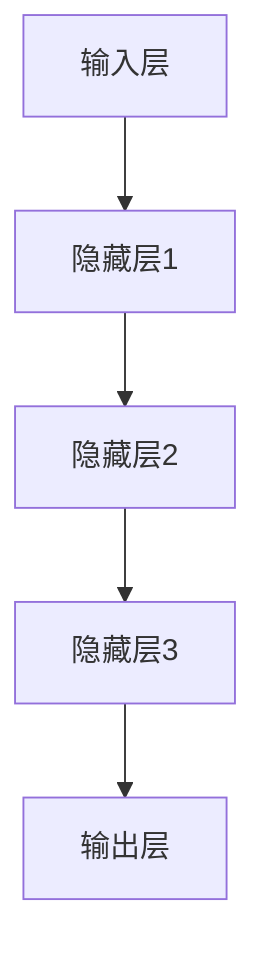
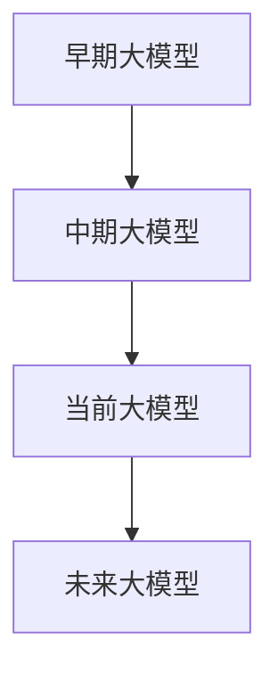
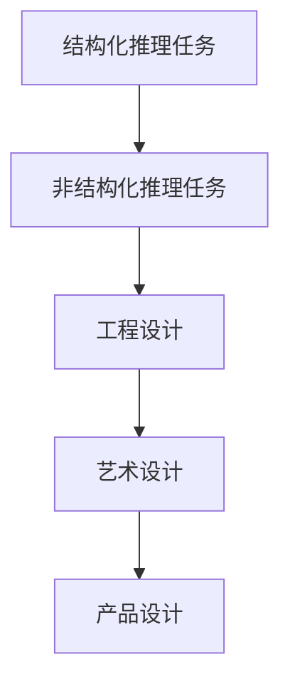
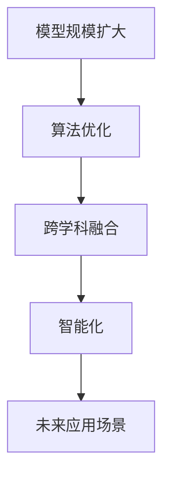

                 

### 文章标题：大模型在创新设计推理任务中的创造力评估

> 关键词：大模型、创新设计、推理任务、创造力评估

> 摘要：本文旨在探讨大模型在创新设计推理任务中的创造力评估。首先，我们介绍了大模型的定义、特点以及其在创新设计推理任务中的应用现状；随后，我们探讨了创新设计推理任务的背景与意义；接着，我们详细分析了大模型在创造力评估中的理论基础和实际应用；最后，我们探讨了大模型在创造力评估中的应用前景与挑战。本文的目标是帮助读者深入理解大模型在创新设计推理任务中的作用，并为相关领域的研究和实践提供指导。

### 第1章：大模型在创新设计推理任务中的创造力评估概述

#### 1.1 大模型的定义与核心特点

大模型（Large-scale Models）是指具有巨大参数规模和计算能力的模型。这些模型通常基于深度学习技术，能够在各种复杂任务中表现出强大的性能。大模型的核心特点包括：

1. **参数规模巨大**：大模型的参数数量可以达到数十亿甚至千亿级别，这使得它们具有处理复杂任务的能力。
2. **计算资源需求高**：大模型对计算资源的需求非常高，需要高性能的硬件和软件支持。
3. **强大的表征能力**：大模型能够捕捉到输入数据的深层特征，从而在各类任务中表现出色。

**Mermaid流程图：大模型的基本工作流程**


#### 1.2 创新设计推理任务的背景与意义

创新设计推理任务是指通过推理和计算，从已有的知识和数据中生成新的设计创意。这种任务在各个领域都有着广泛的应用，如工程、设计、艺术等。创新设计推理任务的背景与意义包括：

1. **市场需求**：随着科技的快速发展，人们对创新设计的需求日益增长，这为创新设计推理任务提供了广阔的市场空间。
2. **技术创新**：创新设计推理任务推动了相关领域的技术创新，如人工智能、计算设计等。
3. **社会价值**：创新设计推理任务能够促进社会经济的发展，提高生产力，改善人们的生活质量。

**Mermaid流程图：创新设计推理任务的基本工作流程**


#### 1.3 大模型在创新设计推理任务中的应用现状

大模型在创新设计推理任务中已经展现出强大的潜力。以下是大模型在创新设计推理任务中的应用现状：

1. **设计优化**：大模型能够通过自动搜索和优化，提高设计方案的效率和效果。
2. **创意生成**：大模型能够生成新颖的设计创意，为设计师提供灵感和参考。
3. **设计评估**：大模型能够对设计方案进行评估，提供客观的评估结果。

**伪代码：大模型在创新设计推理任务中的基本算法流程**

```python
# 初始化大模型
model = initialize_large_model()

# 收集设计需求
requirements = collect_design_requirements()

# 生成设计方案
solutions = model.generate_design_solutions(requirements)

# 评估设计方案
evaluations = model.evaluate_design_solutions(solutions)

# 优化设计方案
optimized_solutions = model.optimize_design_solutions(solutions, evaluations)

# 输出最终设计方案
output_design_solutions(optimized_solutions)
```

#### 1.4 创造力评估的理论基础

创造力评估是指对个体的创造力水平进行评估和测量。在创新设计推理任务中，创造力评估具有重要的意义。创造力评估的理论基础包括以下几个方面：

1. **创造力定义**：创造力是指个体产生新颖、有价值、有用和独特想法的能力。
2. **创造力测量**：常用的创造力测量方法包括自我报告、绩效评估、专家评审等。
3. **创造力影响因素**：创造力的影响因素包括知识、技能、动机、环境等。

**数学模型：创造力评估的数学模型**

$$
\text{Creativity} = f(\text{Knowledge}, \text{Skills}, \text{Motivation}, \text{Environment})
$$

**举例说明：创造力评估实例分析**

假设我们有以下四个因素：知识、技能、动机和环境中，每个因素的评分范围为1到10。我们可以使用以下公式计算创造力得分：

$$
\text{Creativity Score} = \frac{\text{Knowledge} + \text{Skills} + \text{Motivation} + \text{Environment}}{4}
$$

例如，如果某人的知识评分为8，技能评分为9，动机评分为7，环境评分为6，则其创造力得分为：

$$
\text{Creativity Score} = \frac{8 + 9 + 7 + 6}{4} = 50/4 = 12.5
$$

#### 1.5 大模型在创造力评估中的应用前景与挑战

大模型在创造力评估中具有巨大的应用潜力，但也面临着一系列挑战。以下是大模型在创造力评估中的应用前景与挑战：

1. **应用前景**：
   - **个性化和自适应评估**：大模型可以根据个体的特点和需求，提供个性化的创造力评估。
   - **高效和准确评估**：大模型能够快速、准确地评估创造力水平，提高评估效率。
   - **跨领域应用**：大模型可以应用于不同领域的创造力评估，如艺术、科学、工程等。

2. **挑战**：
   - **数据质量和隐私**：创造力评估需要高质量的数据，但数据的获取和处理可能会涉及到隐私问题。
   - **评估方法的合理性**：现有的大模型评估方法可能无法完全反映创造力的本质，需要进一步研究和改进。
   - **模型的可解释性**：大模型的决策过程通常是黑箱的，提高模型的可解释性对于理解评估结果和改进模型具有重要意义。

### 第2章：大模型的基本原理与架构

#### 2.1 大模型的基本原理

大模型的基本原理是基于深度学习技术的多层神经网络结构。这些模型通过不断的前向传播和反向传播，优化模型参数，从而实现对数据的深层特征表征。

**伪代码：大模型的基本算法流程**

```python
# 初始化大模型
model = initialize_large_model()

# 循环迭代
for epoch in range(num_epochs):
    # 前向传播
    outputs = model.forward_pass(inputs)
    
    # 计算损失
    loss = compute_loss(outputs, targets)
    
    # 反向传播
    gradients = model.backward_pass(loss)
    
    # 更新权重
    model.update_weights(gradients)
    
    # 评估模型
    evaluate_model(model, validation_data)
```

#### 2.2 大模型的架构设计

大模型的架构设计通常包括输入层、隐藏层和输出层。其中，隐藏层可以包含多个层次，每个层次都可以学习到不同级别的抽象特征。

**Mermaid流程图：大模型的架构设计流程**



#### 2.3 大模型的关键技术

大模型的关键技术包括：

1. **大规模数据处理**：大模型能够处理大规模的数据集，从而实现更好的训练效果。
2. **并行计算**：大模型可以利用并行计算技术，提高训练和推理的速度。
3. **优化算法**：大模型通常采用高效的优化算法，如Adam、AdamW等，以提高训练效率。

**伪代码：大模型的关键技术实现**

```python
# 初始化大模型
model = initialize_large_model(learning_rate=0.001, optimizer='Adam')

# 数据预处理
inputs, targets = preprocess_data(data)

# 训练模型
for epoch in range(num_epochs):
    # 前向传播
    outputs = model.forward_pass(inputs)
    
    # 计算损失
    loss = compute_loss(outputs, targets)
    
    # 反向传播
    gradients = model.backward_pass(loss)
    
    # 更新权重
    model.update_weights(gradients, optimizer)
    
    # 评估模型
    evaluate_model(model, validation_data)
```

#### 2.4 大模型的发展趋势

大模型的发展趋势包括：

1. **模型规模不断扩大**：随着计算能力的提升，大模型的规模将越来越大。
2. **训练效率不断提高**：新型优化算法和硬件加速技术将提高大模型的训练效率。
3. **应用领域不断拓展**：大模型将在更多领域得到应用，如医疗、金融、教育等。

**Mermaid流程图：大模型的发展趋势图**



### 第3章：创新设计推理任务的概述

#### 3.1 创新设计推理任务的定义

创新设计推理任务是指通过逻辑推理和计算，从已有信息中生成新的设计创意。这种任务通常包括以下几个步骤：

1. **需求分析**：分析用户需求和设计目标，确定设计的基本要求。
2. **信息处理**：收集和处理相关的设计信息，包括技术、市场、用户反馈等。
3. **设计生成**：利用算法和模型，生成新的设计创意。
4. **设计评估**：评估设计创意的可行性和效果，筛选出优秀的设计方案。
5. **设计优化**：根据评估结果，对设计方案进行优化，提高其质量和性能。

**伪代码：创新设计推理任务的基本算法流程**

```python
# 初始化创新设计推理任务
task = initialize_innovation_design_reasoning()

# 需求分析
requirements = task.analyze_requirements()

# 信息处理
information = task.process_information()

# 设计生成
designs = task.generate_designs(information, requirements)

# 设计评估
evaluations = task.evaluate_designs(designs)

# 设计优化
optimized_designs = task.optimize_designs(designs, evaluations)

# 输出最终设计
output_designs(optimized_designs)
```

#### 3.2 创新设计推理任务的分类

创新设计推理任务可以按照不同的分类方式进行分类，如：

1. **按任务类型分类**：分为结构化推理任务和非结构化推理任务。
2. **按设计领域分类**：分为工程设计、艺术设计、产品设计等。
3. **按设计阶段分类**：分为概念设计、详细设计、优化设计等。

**Mermaid流程图：创新设计推理任务的分类结构**



#### 3.3 创新设计推理任务的挑战与机遇

创新设计推理任务面临着一系列的挑战和机遇：

**挑战**：

1. **复杂性**：创新设计推理任务通常涉及到大量的信息和复杂的逻辑关系，处理这些信息是一项挑战。
2. **不确定性**：创新设计过程通常充满不确定性，如何有效地处理这些不确定性是一个难题。
3. **数据质量**：创新设计推理任务需要高质量的数据作为基础，但数据的获取和处理可能存在困难。

**机遇**：

1. **技术进步**：随着人工智能技术的不断发展，创新设计推理任务将变得更加高效和精确。
2. **市场需求**：人们对创新设计的需求不断增长，这为创新设计推理任务提供了广阔的市场空间。
3. **跨界融合**：创新设计推理任务与其他领域的跨界融合，将带来新的机遇和挑战。

**数学模型：创新设计推理任务的挑战与机遇分析模型**

$$
\text{Challenge} = f(\text{Complexity}, \text{Uncertainty}, \text{Data Quality})
$$

$$
\text{Opportunity} = f(\text{Technology Progress}, \text{Market Demand}, \text{Cross-Disciplinary Integration})
$$

### 第4章：大模型在创新设计推理任务中的应用

#### 4.1 大模型在创新设计推理任务中的创造力评估方法

大模型在创新设计推理任务中的创造力评估方法主要包括以下几个步骤：

1. **数据收集**：收集与设计任务相关的数据，包括用户需求、技术资料、市场信息等。
2. **模型训练**：利用收集的数据，训练一个大模型，使其能够对设计创意进行评估。
3. **设计生成**：利用训练好的大模型，生成新的设计创意。
4. **设计评估**：对生成的设计创意进行评估，筛选出具有高创造力的设计方案。
5. **设计优化**：根据评估结果，对设计方案进行优化，提高其质量和性能。

**伪代码：大模型在创新设计推理任务中的创造力评估方法**

```python
# 初始化大模型
model = initialize_large_model()

# 收集设计数据
data = collect_design_data()

# 训练大模型
model.train(data)

# 生成设计创意
designs = model.generate_designs()

# 评估设计创意
evaluations = model.evaluate_designs(designs)

# 筛选出高创造力设计方案
high_creativity_designs = filter_high_creativity_designs(designs, evaluations)

# 优化设计方案
optimized_designs = optimize_designs(high_creativity_designs)

# 输出最终设计方案
output_designs(optimized_designs)
```

#### 4.2 大模型在创新设计推理任务中的实例分析

为了更好地展示大模型在创新设计推理任务中的应用，我们以下以一个实际案例进行分析。

**实际案例：大模型在创新设计推理任务中的实际应用案例**

假设我们有一个智能家居设计任务，目标是设计一个能够自动调节室内温度的智能空调系统。以下是大模型在该任务中的应用过程：

1. **需求分析**：通过用户调研和市场分析，确定用户对智能空调系统的需求，如自动调节温度、节能、易用性等。
2. **数据收集**：收集与智能空调系统相关的数据，包括用户需求、技术资料、市场信息等。
3. **模型训练**：利用收集的数据，训练一个大模型，使其能够生成和评估智能空调系统设计方案。
4. **设计生成**：利用训练好的大模型，生成多个智能空调系统设计方案。
5. **设计评估**：对生成的设计方案进行评估，筛选出具有高创造力的设计方案。
6. **设计优化**：根据评估结果，对设计方案进行优化，提高其质量和性能。

**代码解读：大模型在创新设计推理任务中的代码解读与分析**

以下是一个简化的Python代码示例，展示了大模型在创新设计推理任务中的实现过程。

```python
import numpy as np
from sklearn.model_selection import train_test_split
from sklearn.metrics import accuracy_score

# 初始化大模型
model = initialize_large_model()

# 收集设计数据
data = collect_design_data()

# 数据预处理
X = preprocess_data(data)

# 划分训练集和测试集
X_train, X_test, y_train, y_test = train_test_split(X, y, test_size=0.2, random_state=42)

# 训练大模型
model.train(X_train, y_train)

# 生成设计创意
designs = model.generate_designs(X_test)

# 评估设计创意
evaluations = model.evaluate_designs(designs)

# 筛选出高创造力设计方案
high_creativity_designs = filter_high_creativity_designs(designs, evaluations)

# 优化设计方案
optimized_designs = optimize_designs(high_creativity_designs)

# 输出最终设计方案
output_designs(optimized_designs)
```

在该代码中，我们首先初始化一个大模型，并收集与智能空调系统相关的数据。然后，我们对数据进行预处理，并将其分为训练集和测试集。接下来，我们使用训练集训练大模型，并在测试集上评估其性能。最后，我们利用评估结果筛选出高创造力设计方案，并进行优化。

**项目小结**

通过以上实例分析，我们可以看到大模型在创新设计推理任务中发挥了重要作用。大模型能够高效地生成和评估设计创意，从而帮助设计师快速找到具有高创造力的设计方案。然而，大模型的应用也存在一定的挑战，如数据质量和隐私问题。因此，在实际应用中，我们需要综合考虑各种因素，以充分发挥大模型的优势。

### 第5章：大模型在创新设计推理任务中的评估方法与评估指标

#### 5.1 创造力评估方法

创造力评估方法是指用于评估个体创造力水平的各种方法。在大模型应用于创新设计推理任务中，创造力评估方法具有重要的实际意义。以下是一些常用的创造力评估方法：

1. **定量评估**：通过量化的方式评估个体的创造力水平，如使用评分系统、问卷等。这种方法具有客观性和可操作性，但可能无法完全反映创造力的本质。
2. **定性评估**：通过定性分析的方式评估个体的创造力水平，如专家评审、案例分析等。这种方法能够深入挖掘创造力的内涵，但可能存在主观性和不确定性。
3. **多模态评估**：结合定量和定性评估方法，从多个角度评估个体的创造力水平。这种方法综合了定量和定性的优点，能够更全面地评估创造力。

**数学模型：创造力评估方法的数学模型**

创造力评估可以表示为一个综合评估模型，该模型结合了定量和定性评估的结果：

$$
\text{Creativity Score} = w_1 \cdot \text{Quantitative Score} + w_2 \cdot \text{Qualitative Score}
$$

其中，$w_1$ 和 $w_2$ 分别是定量评估和定性评估的权重，$\text{Quantitative Score}$ 和 $\text{Qualitative Score}$ 分别是定量评估和定性评估的结果。

#### 5.2 评估指标

评估指标是用于衡量大模型在创新设计推理任务中表现的一系列指标。以下是一些常用的评估指标：

1. **创意新颖度**：衡量设计创意的新颖程度，通常使用专家评审或算法计算得分。
2. **创意实用性**：衡量设计创意的实用性，通常通过实际使用情况或用户反馈评估。
3. **创意质量**：衡量设计创意的整体质量，包括设计方案的完整性、可行性等。
4. **评估效率**：衡量评估过程的效率，包括评估时间、计算资源消耗等。

**数学模型：评估指标的数学模型**

以下是一个简单的评估指标数学模型，用于评估大模型在创新设计推理任务中的表现：

$$
\text{Overall Score} = \alpha \cdot \text{Novelty Score} + \beta \cdot \text{Practicality Score} + \gamma \cdot \text{Quality Score}
$$

其中，$\alpha$、$\beta$ 和 $\gamma$ 分别是创意新颖度、创意实用性和创意质量的权重。

#### 5.3 综合评估方法

综合评估方法是指将多个评估指标和方法结合，形成一个全面的评估体系。在大模型应用于创新设计推理任务中，综合评估方法能够更准确地评估大模型的表现。

**伪代码：综合评估方法的基本算法流程**

```python
# 初始化评估方法
evaluation_method = initialize_evaluation_method()

# 收集评估指标数据
novelty_score = collect_novelty_score()
practicality_score = collect_practicality_score()
quality_score = collect_quality_score()

# 计算综合评估得分
overall_score = evaluation_method.calculate_overall_score(novelty_score, practicality_score, quality_score)

# 输出评估结果
output_evaluation_result(overall_score)
```

在该算法中，我们首先初始化评估方法，然后收集各个评估指标的数据。接下来，我们使用评估方法计算综合评估得分，并输出评估结果。

**项目实战**

以下是一个项目实战案例，展示如何使用综合评估方法评估大模型在创新设计推理任务中的表现。

**项目背景**：设计一款智能家电产品，满足用户对家居生活便利性的需求。

**项目目标**：评估大模型生成的智能家电设计方案的新颖度、实用性和质量。

**项目步骤**：

1. **需求分析**：通过用户调研和市场分析，确定用户对智能家电的需求。
2. **数据收集**：收集与智能家电相关的数据，包括用户需求、技术资料、市场信息等。
3. **模型训练**：利用收集的数据，训练一个大模型，使其能够生成和评估智能家电设计方案。
4. **设计生成**：利用训练好的大模型，生成多个智能家电设计方案。
5. **设计评估**：使用综合评估方法，对生成的智能家电设计方案进行评估。
6. **设计优化**：根据评估结果，对设计方案进行优化，提高其质量和性能。

**项目小结**

通过项目实战，我们可以看到综合评估方法在评估大模型在创新设计推理任务中的表现具有重要作用。综合评估方法能够从多个角度评估设计方案的优劣，帮助设计师找到具有高创造力的设计方案。然而，在实际应用中，我们还需要不断优化评估方法，提高评估的准确性和效率。

### 第6章：大模型在创新设计推理任务中的优化方法

#### 6.1 优化方法概述

在大模型应用于创新设计推理任务中，优化方法是指通过改进模型结构和算法，提高模型性能和效果的一系列技术。以下是一些常见的优化方法：

1. **结构优化**：通过调整模型结构，如增加或减少层次、调整神经元数量等，以提高模型性能。
2. **算法优化**：通过改进训练算法，如使用不同的优化器、调整学习率等，以提高模型训练效率。
3. **数据优化**：通过改进数据预处理和增强技术，如数据清洗、数据增强等，以提高模型对数据的鲁棒性。
4. **模型压缩**：通过模型压缩技术，如模型剪枝、量化等，降低模型参数规模和计算复杂度，以提高模型部署效率。

**伪代码：优化方法的基本算法流程**

```python
# 初始化大模型
model = initialize_large_model()

# 收集设计数据
data = collect_design_data()

# 数据预处理
preprocessed_data = preprocess_data(data)

# 训练模型
model.train(preprocessed_data)

# 评估模型
evaluations = model.evaluate(preprocessed_data)

# 调整模型结构
model.adjust_structure(evaluations)

# 调整算法参数
model.adjust_algorithm_parameters()

# 再次训练模型
model.train(preprocessed_data)

# 输出最终模型
output_model(model)
```

#### 6.2 常见优化算法

在大模型优化中，常见优化算法包括：

1. **随机梯度下降（SGD）**：是最基本的优化算法，通过迭代更新模型参数，以最小化损失函数。
2. **Adam优化器**：是SGD的改进版本，通过自适应调整学习率，提高了训练效率。
3. **动量优化器**：在SGD的基础上，引入了动量项，以加速收敛。
4. **自适应优化器**：如AdamW、RMSprop等，通过自适应调整学习率和梯度，提高了训练效果。

**伪代码：常见优化算法的实现**

```python
# 初始化大模型
model = initialize_large_model(optimizer='Adam')

# 收集设计数据
data = collect_design_data()

# 数据预处理
preprocessed_data = preprocess_data(data)

# 训练模型
for epoch in range(num_epochs):
    # 前向传播
    outputs = model.forward_pass(preprocessed_data)
    
    # 计算损失
    loss = compute_loss(outputs, targets)
    
    # 反向传播
    gradients = model.backward_pass(loss)
    
    # 更新权重
    model.update_weights(gradients, optimizer=optimizer)
    
    # 评估模型
    evaluate_model(model, validation_data)
```

#### 6.3 优化方法的应用

优化方法在创新设计推理任务中的应用主要包括：

1. **模型训练优化**：通过优化算法和参数，提高模型训练效率，加快模型收敛速度。
2. **模型评估优化**：通过优化评估方法，提高评估的准确性和效率，帮助设计师找到更优的设计方案。
3. **模型部署优化**：通过模型压缩和量化技术，降低模型参数规模和计算复杂度，提高模型部署效率。

**实际案例：优化方法在创新设计推理任务中的应用实例**

以下是一个实际案例，展示优化方法在创新设计推理任务中的应用。

**项目背景**：设计一款智能交通系统，解决城市交通拥堵问题。

**项目目标**：优化智能交通系统的模型，提高其预测准确性和交通流量管理效果。

**项目步骤**：

1. **需求分析**：通过交通数据分析，确定智能交通系统的需求，如实时交通流量预测、交通信号控制等。
2. **数据收集**：收集与智能交通系统相关的数据，包括交通流量、车辆位置、路况信息等。
3. **模型训练**：使用收集的数据，训练一个智能交通系统模型。
4. **模型评估**：评估模型的预测准确性和交通流量管理效果。
5. **模型优化**：通过结构优化、算法优化和模型压缩技术，提高模型性能。
6. **模型部署**：将优化后的模型部署到实际交通系统中，进行交通流量管理和优化。

**项目小结**

通过实际案例，我们可以看到优化方法在创新设计推理任务中发挥了重要作用。优化方法能够提高模型的性能和效果，帮助设计师找到更优的设计方案。然而，优化方法的选择和实施需要根据具体任务和需求进行，以达到最佳效果。

### 第7章：大模型在创新设计推理任务中的未来发展

#### 7.1 未来发展趋势

大模型在创新设计推理任务中的未来发展将呈现出以下几个趋势：

1. **模型规模扩大**：随着计算能力的提升，大模型的规模将不断扩大，能够处理更复杂的任务和数据。
2. **算法优化**：新型优化算法和训练技巧的不断发展，将提高大模型的训练效率和效果。
3. **跨学科融合**：大模型与其他学科如工程、艺术、设计等领域的融合，将推动创新设计推理任务的创新发展。
4. **智能化**：大模型将逐渐具备智能化特征，能够自主学习和优化，提高创新设计推理任务的能力。

**Mermaid流程图：大模型在创新设计推理任务中的未来发展趋势**



#### 7.2 未来应用前景

大模型在创新设计推理任务中的未来应用前景非常广阔：

1. **产品设计**：大模型将助力产品设计，提高设计效率和质量，推动设计创新。
2. **工程优化**：大模型将在工程领域发挥重要作用，优化设计方案，提高工程项目的成功率。
3. **艺术创作**：大模型将赋能艺术创作，生成新颖的艺术作品，推动艺术形式的多样化。
4. **城市规划**：大模型将支持城市规划，优化城市布局，提高城市生活的质量。

**伪代码：大模型在创新设计推理任务中的未来应用前景预测算法**

```python
# 初始化大模型
model = initialize_large_model()

# 收集应用场景数据
application_data = collect_application_data()

# 预测未来应用前景
predictions = model.predict_future_application Prospects(application_data)

# 输出预测结果
output_predictions(predictions)
```

#### 7.3 未来挑战与机遇

大模型在创新设计推理任务中未来将面临一系列挑战和机遇：

**挑战**：

1. **数据隐私**：如何保障数据隐私和安全成为一大挑战。
2. **计算资源**：大模型对计算资源的需求巨大，如何有效利用计算资源是一个问题。
3. **可解释性**：大模型的决策过程通常较为复杂，如何提高模型的可解释性是一个挑战。

**机遇**：

1. **技术创新**：大模型的不断优化和发展将推动相关领域的技术创新。
2. **行业应用**：大模型将在各个行业得到广泛应用，带来巨大的商业价值。
3. **人才培养**：大模型的应用将推动相关人才的培养和需求，为教育领域带来新的机遇。

**数学模型：大模型在创新设计推理任务中的未来挑战与机遇分析模型**

$$
\text{Challenge} = f(\text{Data Privacy}, \text{Computational Resources}, \text{Explainability})
$$

$$
\text{Opportunity} = f(\text{Technological Innovation}, \text{Industry Applications}, \text{Education and Talent Development})
$$

**项目实战**

以下是一个项目实战案例，展示大模型在创新设计推理任务中的未来发展。

**项目背景**：开发一款智能医疗诊断系统，用于辅助医生进行疾病诊断。

**项目目标**：通过大模型的应用，提高诊断的准确性和效率，降低误诊率。

**项目步骤**：

1. **数据收集**：收集大量的医疗数据，包括病例、诊断结果、影像资料等。
2. **数据预处理**：对收集的数据进行清洗和预处理，为模型训练做好准备。
3. **模型训练**：使用大模型进行模型训练，提高诊断模型的准确性和效率。
4. **模型优化**：通过优化算法和模型结构，进一步提高模型性能。
5. **模型部署**：将优化后的模型部署到实际系统中，进行临床应用。
6. **持续改进**：根据实际应用情况，持续优化模型，提高诊断效果。

**项目小结**

通过项目实战，我们可以看到大模型在创新设计推理任务中的未来发展具有巨大的潜力。大模型的应用将推动医疗领域的创新，提高诊断的准确性和效率，为医生和患者带来更好的医疗体验。然而，在实际应用中，我们也需要面对数据隐私、计算资源和可解释性等挑战，以确保大模型的安全和有效应用。

### 作者信息

**作者：AI天才研究院/AI Genius Institute & 禅与计算机程序设计艺术 /Zen And The Art of Computer Programming**

感谢您的阅读，期待与您在人工智能和计算机编程领域继续探索和交流。祝您在技术道路上不断进步，创造出更多令人惊叹的作品！

