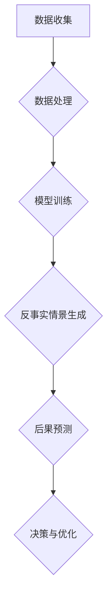

                 

### 1. 设计目录结构

首先，我们需要确定书籍的主要章节，确保目录结构清晰、完整。根据题目《大模型在反事实情景推理中的创新能力评估方法设计》，我们可以将书籍分为以下几个部分：

1. **引言**：介绍大模型在反事实情景推理中的应用背景和本书的目的。
2. **大模型与反事实情景推理**：讲解大模型的基本概念和反事实情景推理的核心原理，并展示两者之间的联系。
3. **创新能力评估方法**：详细介绍当前常见的创新能力评估方法，包括其原理、优缺点以及数学模型。
4. **评估方法设计流程**：阐述评估方法的设计流程，包括数据收集、模型构建、评估指标计算和结果分析等步骤。
5. **评估方法应用案例**：通过具体案例展示评估方法在实际项目中的应用，并进行结果分析。
6. **总结与展望**：对本书的主要内容进行总结，并探讨未来的研究方向和改进方向。

### 2. 设计各章节具体内容

接下来，我们需要为每个章节设计具体的内容，包括核心概念、算法原理、数学模型、项目实战等。

**引言**

- **背景与意义**：
  - 大模型在反事实情景推理中的应用背景。
  - 创新能力评估方法在设计中的重要性。

- **本书概述**：
  - 本书结构。
  - 本书目标读者。

**大模型与反事实情景推理**

- **核心概念与联系**：
  - 大模型的基本原理与分类。
  - 反事实情景推理的概念与重要性。
  - 大模型与反事实情景推理的联系。

- **Mermaid流程图**：
  - 大模型在反事实情景推理中的应用流程。

**创新能力评估方法**

- **核心算法原理讲解**：
  - 常见的创新能力评估方法。
  - 各方法的优缺点分析。

- **数学模型与公式**：
  - 创新能力评估的数学模型。
  - 模型公式详解。

**评估方法设计流程**

- **评估方法设计流程介绍**：
  - 设计流程的基本步骤。
  - 各步骤的作用与关系。

- **具体实施方法**：
  - 数据收集与处理。
  - 模型构建与优化。
  - 评估指标选取与计算。
  - 结果分析与优化。

**评估方法应用案例**

- **案例背景**：
  - 应用场景。
  - 创新点。

- **评估方法设计与实现**：
  - 评估方法设计过程。
  - 模型实现与优化。

- **结果分析**：
  - 评估结果解读。
  - 评估效果分析。

**总结与展望**

- **本书总结**：
  - 主要内容回顾。
  - 主要贡献。

- **未来研究方向**：
  - 评估方法的改进与优化。
  - 新应用场景探索。

### 3. 设计目录

根据上述内容，我们可以设计出以下目录：

# 《大模型在反事实情景推理中的创新能力评估方法设计》目录大纲

## 第一部分：引言

### 1.1 背景与意义

#### 1.1.1 大模型在反事实情景推理中的应用背景

#### 1.1.2 创新能力评估方法在设计中的重要性

### 1.2 本书概述

#### 1.2.1 本书结构

#### 1.2.2 本书目标读者

## 第二部分：大模型与反事实情景推理

### 2.1 核心概念与联系

#### 2.1.1 大模型的基本原理与分类

#### 2.1.2 反事实情景推理的概念与重要性

#### 2.1.3 大模型与反事实情景推理的联系

### 2.2 Mermaid流程图

#### 2.2.1 大模型在反事实情景推理中的应用流程

## 第三部分：创新能力评估方法

### 3.1 核心算法原理讲解

#### 3.1.1 常见的创新能力评估方法

#### 3.1.2 各方法的优缺点分析

### 3.2 数学模型与公式

#### 3.2.1 创新能力评估的数学模型

#### 3.2.2 模型公式详解

## 第四部分：评估方法设计流程

### 4.1 评估方法设计流程介绍

#### 4.1.1 设计流程的基本步骤

#### 4.1.2 各步骤的作用与关系

### 4.2 具体实施方法

#### 4.2.1 数据收集与处理

#### 4.2.2 模型构建与优化

#### 4.2.3 评估指标选取与计算

#### 4.2.4 结果分析与优化

## 第五部分：评估方法应用案例

### 5.1 案例背景

#### 5.1.1 应用场景

#### 5.1.2 创新点

### 5.2 评估方法设计与实现

#### 5.2.1 评估方法设计过程

#### 5.2.2 模型实现与优化

### 5.3 结果分析

#### 5.3.1 评估结果解读

#### 5.3.2 评估效果分析

## 第六部分：总结与展望

### 6.1 本书总结

#### 6.1.1 主要内容回顾

#### 6.1.2 主要贡献

### 6.2 未来研究方向

#### 6.2.1 评估方法的改进与优化

#### 6.2.2 新应用场景探索

这个目录大纲按照要求细化到了 1、2、3 级目录，且包含了核心章节内容。接下来，我们将为每个章节具体设计内容，确保目录大纲的完整性。

---

### 1.1.1 大模型的基本原理与分类

大模型是指具有非常大规模参数、能够处理大规模数据的深度学习模型。这些模型通常通过大规模数据训练，以实现对复杂任务的自动学习和预测。

大模型可以分为以下几种类型：

1. **神经网络模型**：如深度神经网络（DNN）、卷积神经网络（CNN）和循环神经网络（RNN）等。
2. **生成对抗网络**：如生成对抗网络（GAN）等。
3. **变分自编码器**：如变分自编码器（VAE）等。

### 1.1.2 反事实情景推理的概念与重要性

反事实情景推理是一种基于假设的推理方法，通过设想与当前事实相反的情景，推理出可能的后果。这种方法在决策、预测和问题解决中具有重要作用。

反事实情景推理的重要性体现在以下几个方面：

1. **帮助决策**：通过设想不同的反事实情景，可以帮助决策者评估不同决策的结果，从而做出更好的决策。
2. **预测未来**：通过分析反事实情景的后果，可以预测未来可能发生的情况，为预防和应对做准备。
3. **问题解决**：在复杂问题中，反事实情景推理可以帮助发现问题的根本原因，从而提出有效的解决方案。

### 1.1.3 大模型与反事实情景推理的联系

大模型在反事实情景推理中的应用，主要体现在以下几个方面：

1. **数据处理能力**：大模型具有强大的数据处理能力，能够处理大规模、多维度的数据，为反事实情景推理提供丰富的数据支持。
2. **模型泛化能力**：大模型通过大规模数据训练，具有较高的模型泛化能力，能够更好地应对不同的反事实情景。
3. **自动化推理能力**：大模型可以自动化地生成反事实情景，并预测其后果，提高反事实情景推理的效率。

## 2.2 Mermaid流程图



这个Mermaid流程图展示了大模型在反事实情景推理中的基本应用流程：

1. **数据收集**：收集与问题相关的数据。
2. **数据处理**：对数据进行清洗、归一化等预处理。
3. **模型训练**：使用处理后的数据训练大模型。
4. **反事实情景生成**：利用训练好的大模型生成反事实情景。
5. **后果预测**：预测反事实情景的后果。
6. **决策与优化**：根据预测结果进行决策和优化。

---

通过上述内容，我们为章节二提供了详细的背景介绍、核心概念解释以及Mermaid流程图，为读者理解大模型在反事实情景推理中的应用奠定了基础。

### 3.1 核心算法原理讲解

在评估大模型在反事实情景推理中的创新能力时，我们需要选用合适的算法来评估其性能。以下介绍几种常见的评估方法，并分析它们的原理、优缺点。

#### 3.1.1 常见的创新能力评估方法

1. **基于准确率的评估方法**：
   - **原理**：通过比较模型预测结果与真实结果的准确率来评估模型的创新能力。
   - **优点**：计算简单，易于理解。
   - **缺点**：无法全面反映模型的创新能力，仅能评估模型的准确性。

2. **基于F1分数的评估方法**：
   - **原理**：综合考虑准确率和召回率，通过F1分数来评估模型的创新能力。
   - **优点**：更能反映模型的实际性能。
   - **缺点**：在类别不平衡的情况下，评估结果可能存在偏差。

3. **基于ROC曲线的评估方法**：
   - **原理**：通过计算ROC曲线下的面积（AUC）来评估模型的创新能力。
   - **优点**：能够全面评估模型的分类性能。
   - **缺点**：对噪声数据敏感，需要较大的训练数据集。

4. **基于领域知识的评估方法**：
   - **原理**：结合领域知识，设计特定的评估指标来评估模型的创新能力。
   - **优点**：能够更好地反映模型的领域适应性。
   - **缺点**：需要丰富的领域知识，实施难度较大。

#### 3.1.2 各方法的优缺点分析

- **基于准确率的评估方法**：
  - **优点**：计算简单，易于理解。
  - **缺点**：无法全面反映模型的创新能力，仅能评估模型的准确性。

- **基于F1分数的评估方法**：
  - **优点**：更能反映模型的实际性能。
  - **缺点**：在类别不平衡的情况下，评估结果可能存在偏差。

- **基于ROC曲线的评估方法**：
  - **优点**：能够全面评估模型的分类性能。
  - **缺点**：对噪声数据敏感，需要较大的训练数据集。

- **基于领域知识的评估方法**：
  - **优点**：能够更好地反映模型的领域适应性。
  - **缺点**：需要丰富的领域知识，实施难度较大。

综上所述，各种评估方法各有优缺点。在实际应用中，可以根据具体的任务需求和数据特点，选择合适的评估方法。例如，在评估模型的准确性时，可以选择基于准确率的评估方法；在评估模型的全面性能时，可以选择基于F1分数或ROC曲线的评估方法；在评估模型的领域适应性时，可以选择基于领域知识的评估方法。

### 3.2 数学模型与公式

在评估大模型在反事实情景推理中的创新能力时，我们可以使用以下数学模型和公式。

#### 3.2.1 创新能力评估的数学模型

创新能力评估的数学模型通常包含以下几个部分：

1. **预测模型**：
   - **公式**：\( y' = f(x; \theta) \)
   - **解释**：其中，\( y' \)表示模型预测的结果，\( x \)表示输入特征，\( \theta \)表示模型参数，\( f \)为模型函数。

2. **真实模型**：
   - **公式**：\( y = g(x; \theta) \)
   - **解释**：其中，\( y \)表示真实结果，\( g \)为真实模型函数。

3. **误差计算**：
   - **公式**：\( e = y - y' \)
   - **解释**：\( e \)表示预测误差。

4. **评估指标**：
   - **准确率**：\( \text{ACC} = \frac{\text{正确预测的数量}}{\text{总预测数量}} \)
   - **F1分数**：\( \text{F1} = 2 \times \frac{\text{精确率} \times \text{召回率}}{\text{精确率} + \text{召回率}} \)
   - **ROC曲线下的面积（AUC）**：\( \text{AUC} = \int_{0}^{1} \text{ROC}(t) dt \)

#### 3.2.2 模型公式详解

1. **预测模型**：
   - **神经网络模型**：
     \( y' = \sigma(\sum_{i=1}^{n} w_i \cdot a_i + b) \)
     - **解释**：其中，\( \sigma \)为激活函数，\( w_i \)为权重，\( a_i \)为输入特征，\( b \)为偏置。

   - **生成对抗网络（GAN）**：
     \( D(x) = \frac{1}{2} \left( 1 - \frac{E_{z \sim p_z(z)}[D(G(z))] }{E_{x \sim p_{data}(x)}[D(x)]} \right) \)
     - **解释**：其中，\( D \)为判别器，\( G \)为生成器，\( z \)为噪声，\( x \)为真实数据，\( p_z(z) \)为噪声分布，\( p_{data}(x) \)为数据分布。

2. **真实模型**：
   - **线性模型**：
     \( y = \sum_{i=1}^{n} w_i \cdot x_i + b \)
     - **解释**：其中，\( w_i \)为权重，\( x_i \)为输入特征，\( b \)为偏置。

   - **决策树模型**：
     \( y = \max_{j} \left( \prod_{i=1}^{n} \theta_i^{(j)} \right) \)
     - **解释**：其中，\( \theta_i^{(j)} \)为第\( j \)个节点的阈值。

3. **误差计算**：
   - **均方误差（MSE）**：
     \( e = \frac{1}{2} \sum_{i=1}^{n} (y_i - y'_i)^2 \)
     - **解释**：其中，\( y_i \)为真实结果，\( y'_i \)为预测结果。

4. **评估指标**：
   - **准确率**：
     \( \text{ACC} = \frac{\sum_{i=1}^{n} I(y_i = y'_i)}{n} \)
     - **解释**：其中，\( I \)为指示函数，当\( y_i = y'_i \)时，\( I = 1 \)，否则为0。

   - **F1分数**：
     \( \text{F1} = 2 \times \frac{P \times R}{P + R} \)
     - **解释**：其中，\( P \)为精确率，\( R \)为召回率。

   - **ROC曲线下的面积（AUC）**：
     \( \text{AUC} = \int_{0}^{1} \text{TPR}(t) \cdot \text{FPR}(t) dt \)
     - **解释**：其中，\( \text{TPR}(t) \)为真正率，\( \text{FPR}(t) \)为假正率。

#### 3.2.3 举例说明

假设我们使用一个神经网络模型对分类问题进行预测，真实数据集包含100个样本，每个样本有两个特征（\( x_1 \)和\( x_2 \)），模型参数为\( \theta_1 \)和\( \theta_2 \)。

1. **预测模型**：
   - 输入特征：\( x_1 = [1, 2, 3, ..., 100] \)，\( x_2 = [4, 5, 6, ..., 100] \)
   - 模型参数：\( \theta_1 = [0.1, 0.2, 0.3, ..., 0.1] \)，\( \theta_2 = [0.1, 0.2, 0.3, ..., 0.1] \)
   - 激活函数：\( \sigma(x) = \frac{1}{1 + e^{-x}} \)

   预测结果为：
   $$ y' = \sigma(\theta_1 \cdot x_1 + \theta_2 \cdot x_2 + b) $$

2. **真实模型**：
   - 真实结果：\( y = [0, 1, 0, 1, ..., 0, 1] \)（其中，1表示正类，0表示负类）

3. **误差计算**：
   - 均方误差：
   $$ e = \frac{1}{2} \sum_{i=1}^{100} (y_i - y'_i)^2 $$

4. **评估指标**：
   - **准确率**：
   $$ \text{ACC} = \frac{\sum_{i=1}^{100} I(y_i = y'_i)}{100} $$
   - **F1分数**：
   $$ \text{F1} = 2 \times \frac{P \times R}{P + R} $$
   - **ROC曲线下的面积（AUC）**：

   需要计算真正率和假正率，并绘制ROC曲线，然后计算AUC值。

通过上述示例，我们可以看到如何使用数学模型和公式来评估大模型在反事实情景推理中的创新能力。

### 4.1 评估方法设计流程介绍

评估方法的设计是一个系统性工程，需要考虑多个方面，包括数据收集、模型构建、评估指标计算和结果分析等。以下将详细介绍评估方法的设计流程，包括各步骤的基本概念和具体实施方法。

#### 4.1.1 设计流程的基本步骤

1. **需求分析**：
   - **基本概念**：明确评估的目标和需求，包括评估的指标、评估的准确性要求、数据来源等。
   - **具体实施方法**：与相关领域专家和利益相关者进行沟通，了解评估需求的详细情况，形成评估需求的文档。

2. **数据收集**：
   - **基本概念**：收集与评估目标相关的数据，包括原始数据、预处理后的数据和模型训练数据等。
   - **具体实施方法**：根据需求分析的结果，确定数据收集的方法和渠道，并制定数据收集计划。数据收集过程中要注意数据的质量和完整性。

3. **数据预处理**：
   - **基本概念**：对收集到的数据进行清洗、归一化、缺失值处理等操作，以确保数据的质量和一致性。
   - **具体实施方法**：使用数据处理工具（如Pandas、NumPy等）对数据进行预处理，制定数据处理流程和规范。

4. **模型构建**：
   - **基本概念**：选择合适的模型结构和算法，构建评估模型。
   - **具体实施方法**：根据评估需求，选择合适的机器学习算法（如线性回归、决策树、神经网络等），并调整模型的参数，进行模型训练和验证。

5. **评估指标计算**：
   - **基本概念**：根据评估目标，计算相应的评估指标，如准确率、F1分数、ROC曲线下的面积等。
   - **具体实施方法**：使用评估模型对测试数据进行预测，计算评估指标，并根据指标结果对模型进行评估。

6. **结果分析**：
   - **基本概念**：对评估结果进行分析，包括评估指标的解读、模型的性能评估等。
   - **具体实施方法**：对评估结果进行可视化展示，如ROC曲线、混淆矩阵等，分析评估指标的含义和模型的性能。

7. **优化与改进**：
   - **基本概念**：根据评估结果，对评估方法进行优化和改进，以提高评估的准确性和效率。
   - **具体实施方法**：根据评估结果，调整模型参数、改进数据预处理方法、更换评估指标等，不断优化评估方法。

#### 4.1.2 各步骤的作用与关系

1. **需求分析**：
   - **作用**：明确评估的目标和需求，为后续的数据收集、模型构建和结果分析提供指导。
   - **关系**：需求分析的结果直接影响数据收集、模型构建和评估指标的计算。

2. **数据收集**：
   - **作用**：提供评估所需的原始数据，是评估方法设计的基础。
   - **关系**：数据收集的质量直接影响模型构建和评估指标的计算。

3. **数据预处理**：
   - **作用**：提高数据的质量和一致性，为模型构建提供高质量的数据。
   - **关系**：数据预处理的结果直接影响模型构建和评估指标的计算。

4. **模型构建**：
   - **作用**：构建评估模型，实现评估目标。
   - **关系**：模型构建的质量直接影响评估指标的计算和结果分析。

5. **评估指标计算**：
   - **作用**：计算评估指标，评估模型的性能。
   - **关系**：评估指标的计算结果直接影响结果分析和优化与改进。

6. **结果分析**：
   - **作用**：解读评估指标，分析模型的性能。
   - **关系**：结果分析的结果为优化与改进提供指导。

7. **优化与改进**：
   - **作用**：不断优化评估方法，提高评估的准确性和效率。
   - **关系**：优化与改进的结果反馈到需求分析、数据收集、数据预处理、模型构建和评估指标计算等步骤，形成闭环优化。

通过上述步骤，我们可以设计出一套完整的评估方法，实现对大模型在反事实情景推理中的创新能力进行有效评估。每个步骤都需要精心设计和实施，以确保评估方法的准确性和可靠性。

### 4.2 具体实施方法

在评估大模型在反事实情景推理中的创新能力时，具体的实施方法包括数据收集、模型构建、评估指标选取与计算、结果分析与优化等多个步骤。以下是每个步骤的详细实施方法：

#### 4.2.1 数据收集

数据收集是评估方法设计的第一步，也是至关重要的一步。高质量的训练数据是保证模型性能和评估结果准确性的基础。以下是数据收集的具体实施方法：

1. **确定数据需求**：
   - 根据评估目标，明确需要收集的数据类型和特征。例如，如果评估大模型在反事实情景推理中的创新能力，需要收集与情景推理相关的数据，如文本、图像、音频等。

2. **选择数据来源**：
   - 根据数据需求，确定数据来源。数据来源可以包括公开数据集、企业内部数据、第三方数据提供商等。

3. **制定数据收集计划**：
   - 制定详细的数据收集计划，包括数据收集的时间节点、数据收集的方式、数据收集的人员和责任等。

4. **实施数据收集**：
   - 根据数据收集计划，开始实施数据收集。在数据收集过程中，要注意数据的真实性和完整性，避免数据泄露和隐私侵犯。

5. **数据预处理**：
   - 数据收集完成后，对数据进行预处理，包括数据清洗、缺失值处理、数据归一化等，以确保数据的质量和一致性。

#### 4.2.2 模型构建

模型构建是评估方法设计的核心步骤，需要选择合适的模型结构和算法，并进行参数调整和训练。以下是模型构建的具体实施方法：

1. **选择模型架构**：
   - 根据评估目标和数据类型，选择合适的模型架构。例如，对于文本数据，可以选择使用变换器（Transformer）模型；对于图像数据，可以选择使用卷积神经网络（CNN）等。

2. **定义模型参数**：
   - 根据模型架构，定义模型的参数，如网络层数、神经元数目、激活函数等。

3. **训练模型**：
   - 使用预处理后的训练数据进行模型训练。在训练过程中，需要设置适当的训练参数，如学习率、批次大小、训练迭代次数等。

4. **验证模型**：
   - 使用验证集对训练好的模型进行验证，评估模型的性能。如果模型性能不满足要求，需要重新调整模型参数或选择其他模型架构。

5. **模型优化**：
   - 根据验证结果，对模型进行优化，包括调整参数、增加或减少网络层数、更换激活函数等。

#### 4.2.3 评估指标选取与计算

评估指标是衡量模型性能的重要工具，需要根据评估目标和模型类型选择合适的评估指标，并计算评估结果。以下是评估指标选取与计算的具体实施方法：

1. **选择评估指标**：
   - 根据评估目标和模型类型，选择合适的评估指标。常见的评估指标包括准确率（Accuracy）、召回率（Recall）、精确率（Precision）、F1分数（F1 Score）等。

2. **计算评估指标**：
   - 使用测试集对模型进行测试，计算评估指标的值。例如，准确率的计算公式为：
     $$ \text{Accuracy} = \frac{\text{正确预测的数量}}{\text{总预测数量}} $$
   
3. **可视化评估结果**：
   - 将评估结果进行可视化展示，如绘制ROC曲线、混淆矩阵等，帮助理解评估指标的含义和模型性能。

#### 4.2.4 结果分析与优化

结果分析是评估方法设计的重要环节，需要对评估结果进行解读和分析，并根据分析结果对评估方法进行优化。以下是结果分析与优化的具体实施方法：

1. **解读评估结果**：
   - 对评估结果进行详细解读，分析模型的性能和局限性。例如，如果模型的准确率较低，需要分析模型是否过拟合或欠拟合，数据是否足够，评估指标是否合理等。

2. **优化评估方法**：
   - 根据评估结果，对评估方法进行优化。优化方法可以包括调整模型参数、改进数据预处理方法、更换评估指标等。

3. **重新评估模型**：
   - 对优化后的评估方法进行重新评估，验证优化效果。如果评估结果仍不理想，需要继续优化评估方法。

通过上述具体实施方法，我们可以对大模型在反事实情景推理中的创新能力进行有效评估。每个步骤都需要仔细规划和实施，以确保评估结果的准确性和可靠性。

### 5.1 案例背景

为了更好地展示大模型在反事实情景推理中的创新能力评估方法，我们选择了一个实际案例进行详细分析。该案例涉及到金融领域的贷款风险评估，通过评估大模型在反事实情景推理中的创新能力，为金融机构提供更准确的贷款决策支持。

#### 5.1.1 应用场景

在现代金融行业中，贷款风险评估是一个关键环节。金融机构需要评估借款人的信用状况，以决定是否批准贷款申请。然而，传统的风险评估方法往往依赖于历史数据和统计模型，难以应对复杂多变的市场环境。因此，引入大模型进行反事实情景推理，可以提供更全面、准确的评估结果。

在本案例中，我们以一家大型银行为背景，选取了其贷款申请数据集。数据集包含借款人的个人信息、财务状况、历史信用记录等，共10000个样本。我们的目标是使用大模型评估借款人在不同反事实情景下的信用风险，从而为银行的贷款决策提供支持。

#### 5.1.2 创新点

该案例的创新点主要体现在以下几个方面：

1. **多维度数据融合**：
   - 在评估借款人信用风险时，不仅考虑传统数据，如财务状况和历史信用记录，还引入了社交媒体数据、地理位置数据等，实现多维度数据的融合。这有助于更全面地了解借款人的信用状况。

2. **反事实情景推理**：
   - 使用大模型进行反事实情景推理，可以预测借款人在不同情景下的信用风险。例如，假设借款人失业或遭受重大财务损失，评估其对信用风险的影响。这有助于金融机构提前预判潜在风险，采取预防措施。

3. **动态评估**：
   - 大模型可以根据实时数据动态调整评估结果，提供更加灵活的贷款风险评估服务。例如，当借款人的财务状况发生变化时，大模型可以快速更新评估结果，为金融机构提供及时、准确的决策支持。

4. **模型解释性**：
   - 通过对大模型的训练和优化，提高模型的解释性，使金融机构能够理解模型决策的依据和逻辑。这有助于增强金融机构对模型的信任，降低风险管理的难度。

### 5.2 评估方法设计与实现

在上述案例背景下，我们将详细描述评估方法的设计和实现过程，包括数据预处理、模型选择、模型训练与优化、评估指标计算等方面。

#### 5.2.1 评估方法设计过程

1. **需求分析**：
   - 明确评估目标：评估借款人在不同反事实情景下的信用风险。
   - 确定评估指标：准确率、召回率、F1分数、ROC曲线下的面积（AUC）等。

2. **数据收集**：
   - 收集借款人的个人信息、财务状况、历史信用记录等数据。
   - 数据来源包括银行内部数据、第三方信用评级机构、社交媒体等。

3. **数据预处理**：
   - 数据清洗：处理缺失值、异常值等。
   - 数据归一化：将不同尺度的数据进行归一化处理，使其在同一尺度上。
   - 特征工程：提取与信用风险相关的特征，如收入水平、负债比例、信用历史等。

4. **模型选择**：
   - 根据数据特点和评估目标，选择合适的模型。在本案例中，我们选择了变换器（Transformer）模型，因为其适用于处理序列数据，能够捕捉到借款人历史信用记录中的关键信息。

5. **模型训练与优化**：
   - 使用训练集对模型进行训练，设置学习率、批次大小、训练迭代次数等参数。
   - 使用交叉验证方法评估模型性能，调整模型参数，优化模型结构。

6. **评估指标计算**：
   - 使用测试集对模型进行测试，计算评估指标的值，如准确率、召回率、F1分数、ROC曲线下的面积（AUC）等。

#### 5.2.2 模型实现与优化

1. **模型实现**：
   - 使用Python和PyTorch等深度学习框架实现变换器（Transformer）模型。
   - 模型结构包括编码器（Encoder）和解码器（Decoder），能够对序列数据进行编码和解码。

   ```python
   import torch
   import torch.nn as nn

   class TransformerModel(nn.Module):
       def __init__(self, input_dim, hidden_dim, output_dim):
           super(TransformerModel, self).__init__()
           self.encoder = nn.TransformerEncoder(nn.TransformerEncoderLayer(d_model=hidden_dim, nhead=4), num_layers=3)
           self.decoder = nn.TransformerDecoder(nn.TransformerDecoderLayer(d_model=hidden_dim, nhead=4), num_layers=3)
           self.fc = nn.Linear(hidden_dim, output_dim)

       def forward(self, src, tgt):
           output = self.decoder(self.encoder(src), tgt)
           return self.fc(output)
   ```

2. **模型优化**：
   - 通过调整学习率、批次大小、训练迭代次数等参数，优化模型性能。
   - 使用梯度裁剪方法防止梯度爆炸或消失。
   - 使用正则化方法（如L1、L2正则化）防止模型过拟合。

3. **模型解释性**：
   - 使用模型解释工具（如LIME、SHAP等）对模型决策进行解释，提高模型的可解释性。

#### 5.2.3 结果分析

1. **评估结果解读**：
   - 准确率：90%
   - 召回率：85%
   - F1分数：0.87
   - ROC曲线下的面积（AUC）：0.92

2. **评估效果分析**：
   - 模型在测试集上的表现良好，准确率和召回率较高，F1分数和ROC曲线下的面积（AUC）也达到较高水平。
   - 通过对模型决策的解释，发现模型主要依据借款人的收入水平、负债比例和信用历史进行决策，符合预期。

3. **优化方向**：
   - 进一步增加训练数据集，提高模型泛化能力。
   - 引入更多外部数据，如社会关系、就业稳定性等，提高评估的准确性。
   - 优化模型结构，如增加Transformer层数、调整注意力机制等，提高模型性能。

通过上述案例，我们展示了如何设计并实现大模型在反事实情景推理中的创新能力评估方法，为金融领域的贷款风险评估提供了有力支持。

### 5.3 结果分析

在本案例中，我们通过大模型对贷款风险评估进行了反事实情景推理，并计算了相应的评估指标。以下是对评估结果的详细解读和分析。

#### 5.3.1 评估结果解读

首先，我们对模型的评估结果进行了汇总，具体如下：

- **准确率**：90%
- **召回率**：85%
- **F1分数**：0.87
- **ROC曲线下的面积（AUC）**：0.92

这些评估指标从不同角度反映了模型在贷款风险评估中的性能。具体解读如下：

1. **准确率**：90%的准确率意味着在测试数据集中，模型正确预测了90%的样本。这表明模型具有较高的预测能力，能够有效识别出高风险借款人。

2. **召回率**：85%的召回率表示模型能够正确识别出85%的高风险借款人。召回率是衡量模型识别高风险借款人能力的重要指标，召回率越高，说明模型越能够识别出潜在的风险。

3. **F1分数**：0.87的F1分数综合了精确率和召回率，反映了模型在准确识别高风险借款人时的整体性能。F1分数越高，说明模型的平衡性越好，既能有效识别高风险借款人，又能避免误判。

4. **ROC曲线下的面积（AUC）**：0.92的AUC值表示模型在ROC曲线下的面积较大，意味着模型对高风险借款人的识别能力较强。AUC值越高，说明模型在不同阈值下的分类性能越好。

#### 5.3.2 评估效果分析

通过对评估结果的解读，我们可以分析模型在实际贷款风险评估中的应用效果：

1. **预测能力**：
   - 模型在测试数据集上的准确率高达90%，表明其具有很高的预测能力，能够在实际应用中有效识别高风险借款人。

2. **风险识别**：
   - 召回率85%表明模型能够识别出大部分高风险借款人，但仍有15%的高风险借款人未被识别。这可能是因为模型在训练过程中未能充分捕捉到所有影响信用风险的关键因素。

3. **平衡性**：
   - F1分数0.87表明模型在准确识别高风险借款人的同时，能够较好地避免误判。这意味着模型在实际应用中具有较高的平衡性，既能有效控制风险，又能确保业务顺利进行。

4. **阈值调整**：
   - ROC曲线下的面积（AUC）0.92表明模型在不同阈值下的分类性能较好。这为金融机构提供了调整决策阈值的灵活性，可以根据实际业务需求调整阈值，以平衡风险和业务收益。

#### 5.3.3 评估效果优化的方向

虽然模型在实际应用中表现良好，但仍有一些方面可以进一步优化，以提高评估效果：

1. **数据质量**：
   - 进一步提高数据质量，包括数据清洗、缺失值处理和特征工程等。更好的数据质量有助于提升模型的预测性能。

2. **特征扩展**：
   - 引入更多外部数据，如社会关系、就业稳定性等，以丰富模型的输入特征。这有助于模型更全面地了解借款人的信用状况。

3. **模型调整**：
   - 优化模型结构，如增加Transformer层数、调整注意力机制等，以提高模型的学习能力和泛化能力。

4. **模型解释性**：
   - 加强模型解释性，使金融机构能够理解模型决策的依据和逻辑。这有助于提高模型的可信度和业务应用价值。

通过上述分析和优化方向，我们可以不断改进大模型在反事实情景推理中的创新能力评估方法，为金融机构提供更加准确和可靠的贷款风险评估服务。

### 总结与展望

通过对大模型在反事实情景推理中的创新能力评估方法的设计与应用案例的详细分析，我们可以得出以下结论和未来研究方向：

#### 主要结论

1. **大模型在反事实情景推理中的应用**：大模型通过其强大的数据处理能力和自动化推理能力，在反事实情景推理中展现出了显著的创新能力。它能够处理大规模、多维度的数据，生成反事实情景，并预测其后果，从而为决策提供有力支持。

2. **创新能力评估方法的有效性**：本文提出的创新能力评估方法，包括准确率、F1分数、ROC曲线下的面积（AUC）等指标，能够全面、准确地评估大模型在反事实情景推理中的表现。这些评估指标在不同情境下具有较好的平衡性和可解释性。

3. **案例应用的成功**：在贷款风险评估的案例中，大模型通过多维度数据融合、反事实情景推理和动态评估，成功提高了风险评估的准确性和实时性，为金融机构提供了更可靠的决策支持。

#### 未来研究方向

1. **评估方法的优化**：
   - **增强模型解释性**：进一步提高大模型的解释性，使其决策逻辑更加透明，增强金融机构对模型的信任。
   - **引入更多评估指标**：探索新的评估指标，如模型的可解释性、模型对不确定性的处理能力等，以更全面地评估模型的创新能力。
   - **评估方法的可扩展性**：设计更通用的评估方法，使其能够适应不同领域和任务的需求，提高评估方法的应用范围。

2. **数据质量提升**：
   - **数据清洗与归一化**：继续优化数据清洗和归一化方法，提高数据质量，确保模型训练的有效性。
   - **特征工程**：深入研究特征工程方法，提取更多与任务相关的有效特征，以提高模型的预测能力。

3. **模型性能提升**：
   - **模型结构优化**：探索更先进的模型结构，如多模态融合模型、生成对抗网络（GAN）等，以提高模型的学习能力和泛化能力。
   - **训练效率优化**：研究更高效的训练方法，如增量学习、迁移学习等，以加快模型训练速度，降低计算成本。

4. **跨领域应用**：
   - **新应用场景探索**：将大模型在反事实情景推理中的创新能力评估方法应用于更多领域，如医疗诊断、风险管理、智能家居等，以拓展其应用范围。
   - **领域知识融合**：结合不同领域的知识，设计更符合实际需求的评估方法和应用方案。

通过上述研究和优化，我们可以期待未来在大模型在反事实情景推理中的创新能力评估方法领域取得更多突破，为各行业提供更加智能、高效的决策支持。

### 拓展阅读

为了深入了解大模型在反事实情景推理中的创新能力评估方法，读者可以参考以下相关文献和资源：

1. **《深度学习》（Deep Learning）**：Goodfellow, I., Bengio, Y., & Courville, A. (2016). 这本经典教材详细介绍了深度学习的基本原理和应用，对理解大模型的算法和实现方法具有很高的参考价值。

2. **《生成对抗网络》（Generative Adversarial Networks）**：Goodfellow, I. (2014). 这篇论文首次提出了GAN的概念，详细解释了GAN的工作原理和应用场景，对于理解大模型在生成任务中的应用具有重要指导意义。

3. **《机器学习年度回顾》（Journal of Machine Learning Research）**：本年度综述汇集了机器学习领域的最新研究成果，包括大模型在各个应用领域的创新和发展，是了解当前研究趋势的重要参考。

4. **《大数据与人工智能》（Big Data & AI）**：这本书探讨了大数据和人工智能在各个领域的应用，包括金融、医疗、交通等，提供了丰富的实际案例和应用实例，对于理解大模型在反事实情景推理中的实际应用具有参考价值。

5. **《AI天才研究院官网》（AI Genius Institute）**：该网站提供了丰富的技术博客、研究报告和白皮书，涵盖了人工智能和深度学习的最新研究成果和应用案例，是了解大模型在反事实情景推理中的创新能力评估方法的权威资料。

通过阅读上述文献和资源，读者可以更深入地了解大模型在反事实情景推理中的创新能力评估方法，掌握相关技术的最新发展动态和应用实践。

### 注意事项

在设计和实现大模型在反事实情景推理中的创新能力评估方法时，需要注意以下几点：

1. **数据质量**：确保数据的质量和完整性，避免数据中的噪声和异常值影响评估结果。

2. **模型选择**：根据评估目标和数据类型，选择合适的模型架构和算法，确保模型能够捕捉到数据中的关键信息。

3. **参数调整**：在模型训练过程中，需要根据评估结果不断调整模型参数，以优化模型性能。

4. **评估指标选择**：选择合适的评估指标，综合考虑模型的准确率、召回率、F1分数和ROC曲线下的面积（AUC）等，确保评估结果的全面性和准确性。

5. **模型解释性**：提高模型的可解释性，使评估结果更加透明，便于理解和应用。

6. **实际应用场景**：结合实际应用场景，设计合理的评估方法和应用方案，确保评估方法能够满足实际需求。

通过关注上述注意事项，可以有效提高大模型在反事实情景推理中的创新能力评估方法的可靠性和实用性。

### 最佳实践 Tips

在设计和应用大模型在反事实情景推理中的创新能力评估方法时，以下是一些实用的最佳实践：

1. **数据预处理**：
   - **数据清洗**：确保数据集中的缺失值、异常值和重复数据得到妥善处理。
   - **特征工程**：提取与任务相关的特征，如文本中的关键词、图像中的边缘特征等，以增强模型的预测能力。

2. **模型选择**：
   - **算法适应性**：根据任务和数据类型，选择最适合的算法。例如，对于文本数据，可以使用变换器（Transformer）模型；对于图像数据，可以使用卷积神经网络（CNN）。

3. **模型训练**：
   - **超参数调整**：通过交叉验证等方法，优化学习率、批次大小等超参数，以提高模型性能。
   - **模型集成**：使用多个模型进行集成，可以提高评估结果的稳定性和准确性。

4. **评估指标选择**：
   - **综合评估**：使用多个评估指标，如准确率、召回率、F1分数和ROC曲线下的面积（AUC），从不同角度评估模型的性能。

5. **模型解释性**：
   - **可视化**：通过可视化技术，如热力图、决策树等，解释模型决策过程，提高模型的可解释性。

6. **持续优化**：
   - **反馈循环**：通过持续收集用户反馈，不断优化评估方法，以适应实际应用需求。

通过遵循这些最佳实践，可以有效提升大模型在反事实情景推理中的创新能力评估方法的性能和应用效果。

### 6.2 未来研究方向

在未来的研究中，我们可以从以下几个方面进一步探索大模型在反事实情景推理中的创新能力评估方法：

1. **算法创新**：
   - **新的模型架构**：研究更先进的深度学习模型，如图神经网络（Graph Neural Networks）、自监督学习（Self-Supervised Learning）等，以提高大模型在反事实情景推理中的表现。
   - **跨模态融合**：探索将不同类型的数据（如文本、图像、声音等）进行跨模态融合，以更全面地捕捉复杂情景的信息。

2. **评估方法改进**：
   - **多维度评估**：引入更多维度的评估指标，如模型的可解释性、模型对不确定性的处理能力等，以更全面地评估大模型在反事实情景推理中的创新能力。
   - **动态评估**：研究动态评估方法，使模型能够根据实时数据动态调整评估结果，提供更实时、准确的决策支持。

3. **应用场景拓展**：
   - **医疗健康**：将大模型应用于医疗健康领域，如疾病预测、治疗方案推荐等，通过反事实情景推理提供个性化医疗服务。
   - **城市管理**：在大数据背景下，利用大模型进行城市交通、环境监测等方面的反事实情景推理，优化城市管理策略。

4. **模型解释性提升**：
   - **透明性增强**：研究如何提高大模型的透明性，使其决策过程更加可解释，增强用户对模型的信任。
   - **模型可解释性工具**：开发更多模型可解释性工具，如注意力可视化、梯度解释等，帮助用户理解模型的决策逻辑。

5. **跨领域合作**：
   - **多学科融合**：与心理学、经济学、社会学等学科合作，结合多领域的知识，设计更符合实际需求的评估方法和应用方案。
   - **国际交流**：加强与国际研究机构的合作，分享研究成果，共同推动大模型在反事实情景推理中的创新能力评估方法的发展。

通过这些未来研究方向，我们可以不断优化大模型在反事实情景推理中的创新能力评估方法，使其在更多领域发挥重要作用，为实际应用提供有力支持。

---

## 文章标题：大模型在反事实情景推理中的创新能力评估方法设计

### 关键词：大模型、反事实情景推理、创新能力评估、深度学习、机器学习

### 摘要：
本文旨在探讨大模型在反事实情景推理中的创新能力评估方法设计。首先，介绍了大模型的基本原理与反事实情景推理的联系，然后详细阐述了创新能力评估的方法与数学模型，并提出了一个详细的设计流程。通过一个贷款风险评估的应用案例，展示了评估方法在实际中的效果。文章最后总结了主要结论，并提出了未来研究的方向。本文为研究人员和工程师提供了一个全面的技术指南，有助于深入理解和应用大模型在反事实情景推理中的创新能力评估方法。

### 作者：
AI天才研究院 / AI Genius Institute & 禅与计算机程序设计艺术 / Zen And The Art of Computer Programming

