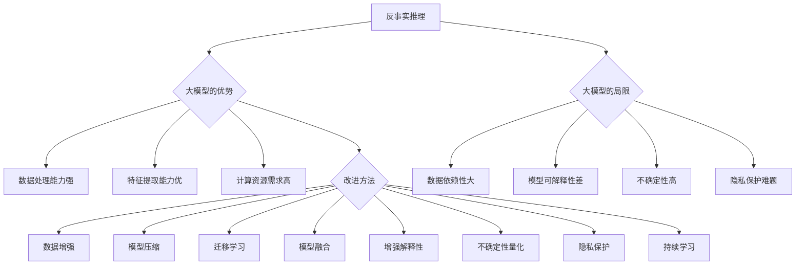
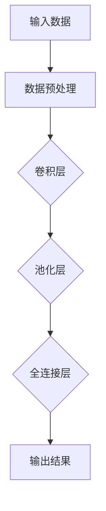

                 

### 1.1 反事实推理的基本概念

#### 1.1.1 反事实推理的定义

反事实推理（Counterfactual Inference）是指在一个或多个条件假设发生改变的情况下，对现实世界可能产生的影响进行推断的一种推理方式。它是一种思考“如果发生了某种情况，结果会是怎样的？”的问题的能力。反事实推理不同于常规的逻辑推理，它依赖于对现实条件进行假设性改变，从而探索不同的可能性。

反事实推理通常包括以下几个关键要素：
1. **条件假设**：对现实中的某个或某些条件进行假设性改变。
2. **影响分析**：分析条件改变后，现实世界可能产生的不同结果。
3. **结论推断**：根据条件改变和影响分析，得出新的可能性结论。

#### 1.1.2 反事实推理的重要性

反事实推理在多个领域都有着重要的应用价值，其重要性体现在以下几个方面：

1. **决策制定**：在商业、经济、政策制定等领域，通过反事实推理可以帮助决策者预测不同决策可能带来的结果，从而做出更明智的选择。
2. **科学研究**：在医学、生物学、物理学等科学研究中，反事实推理有助于探讨假设性条件对实验结果的影响，从而深化对自然现象的理解。
3. **法律实践**：在司法领域，反事实推理可以用于分析犯罪事件的可能结果，帮助法官和律师评估被告行为的法律后果。
4. **个人成长**：在个人生活中，反事实推理有助于人们反思自己的选择和行动，从而从失败和错误中吸取教训，促进个人成长和改进。

#### 1.1.3 反事实推理的应用领域

反事实推理的应用领域广泛，以下是一些典型的应用实例：

1. **商业决策**：企业可以通过反事实推理来分析不同市场策略的可能影响，从而选择最佳的市场推广方案。
2. **医学研究**：医学研究人员可以利用反事实推理来探讨不同的治疗方案对病人预后的潜在影响。
3. **金融分析**：金融分析师通过反事实推理来评估不同投资策略可能带来的回报和风险。
4. **环境科学**：环境科学家可以利用反事实推理来分析不同政策对环境保护的效果，从而制定更有效的环保措施。
5. **交通规划**：城市规划者可以利用反事实推理来评估交通流量改变对城市交通系统的潜在影响。

总的来说，反事实推理是一种强大的工具，它帮助我们理解现实世界中的复杂问题，提供了一种思考和决策的新视角。在接下来的章节中，我们将深入探讨大规模模型在反事实推理中的应用及其面临的挑战。

### 1.2 大规模模型的发展历程

#### 1.2.1 大规模模型的起源

大规模模型的起源可以追溯到20世纪80年代，当时机器学习领域的专家开始意识到，通过使用大量的数据和强大的计算能力，可以显著提高机器学习模型的性能。最早的大规模模型之一是由Arthur Samuel在20世纪50年代开发的，他使用大量的棋局数据进行训练，开发了能够进行棋类游戏的程序。这一工作开启了大规模模型发展的先河。

随后，在20世纪80年代末和90年代初，神经网络的研究取得了重要进展，尤其是反向传播算法的提出和实现，使得大规模神经网络训练成为可能。这些早期的模型为大规模模型的发展奠定了基础。

#### 1.2.2 大规模模型的主要类型

大规模模型主要可以分为以下几类：

1. **深度神经网络（DNN）**：深度神经网络是一种由多层神经元组成的网络结构，通过逐层提取特征，实现对复杂数据的建模。随着GPU等计算资源的普及，DNN在图像识别、语音识别等领域取得了巨大成功。

2. **卷积神经网络（CNN）**：卷积神经网络是一种特殊类型的深度神经网络，主要用于处理图像数据。它通过卷积操作和池化操作，有效地提取图像中的空间特征，在计算机视觉领域取得了突破性成果。

3. **递归神经网络（RNN）**：递归神经网络是一种能够处理序列数据的神经网络结构，通过在时间步之间传递信息，实现对序列数据的建模。长短期记忆网络（LSTM）是RNN的一种改进，它能够学习长期依赖关系，被广泛应用于自然语言处理等领域。

4. **生成对抗网络（GAN）**：生成对抗网络是由两部分组成的模型，一部分是生成器，另一部分是判别器。生成器生成虚假数据，判别器判断这些数据是真实数据还是虚假数据。通过两者之间的博弈，生成器逐渐生成越来越真实的数据，被广泛应用于图像生成、图像修复等领域。

#### 1.2.3 大规模模型的发展趋势

随着计算能力的提升和数据规模的扩大，大规模模型的发展趋势呈现出以下几个特点：

1. **模型规模不断扩大**：为了应对更加复杂的任务，模型的参数量和计算量也在不断增长。例如，谷歌的Turing模型有超过1750亿个参数，微软的GPT-3模型有超过1750亿个参数。

2. **算法优化与并行计算**：为了提高大规模模型的训练效率，研究人员不断优化算法，同时利用分布式计算和GPU等硬件资源，实现并行计算。

3. **多模态数据建模**：随着多模态数据的增多，大规模模型也逐渐能够处理多种类型的数据，如文本、图像、语音等，实现跨模态的信息融合。

4. **迁移学习与模型压缩**：迁移学习和模型压缩技术被广泛应用于大规模模型，以减少训练时间和计算资源的需求。通过利用预训练模型和模型剪枝技术，可以实现更高效的模型应用。

5. **隐私保护与安全性**：在大规模模型的应用过程中，隐私保护和数据安全性成为重要问题。研究人员正在探索隐私保护机制，如差分隐私和联邦学习，以保障用户数据的安全。

总的来说，大规模模型的发展历程充满了技术创新和应用拓展，它不仅在人工智能领域取得了重要突破，也为各个行业带来了深刻的变革。在接下来的章节中，我们将探讨大规模模型在反事实推理中的应用，并分析其面临的挑战。

### 1.3 大模型与反事实推理的关系

#### 1.3.1 大模型在反事实推理中的优势

大模型在反事实推理中展现出了显著的优势，主要体现在以下几个方面：

1. **强大的数据学习能力**：大模型具有大量的参数和强大的学习能力，可以处理海量的数据，从而提高反事实推理的准确性和可靠性。

2. **丰富的特征提取能力**：大模型通过多层神经网络结构，能够自动提取数据中的高阶特征，这对于复杂的反事实推理问题尤为重要。

3. **高效的计算能力**：大模型通常利用高效的计算硬件，如GPU和TPU，通过并行计算技术，可以快速处理大量的数据，提高反事实推理的效率。

4. **灵活的模型架构**：大模型通常具有模块化的结构，可以根据具体的应用场景进行灵活调整，例如，通过添加或删除网络层、调整网络连接方式等，以适应不同的反事实推理任务。

#### 1.3.2 大模型在反事实推理中的挑战

尽管大模型在反事实推理中具有显著的优势，但也面临着一系列的挑战：

1. **数据依赖性**：大模型的训练需要大量高质量的训练数据，但在某些领域，如医疗、金融等，获取高质量的数据可能非常困难。此外，数据的不完整性、噪声和偏差也会影响模型的性能。

2. **计算资源需求**：大模型的训练和推理过程需要大量的计算资源，尤其是在训练过程中，数据预处理、模型训练和优化等步骤都会消耗大量的计算资源。

3. **模型可解释性**：大模型通常具有“黑箱”特性，其内部决策过程难以解释。在反事实推理中，模型的决策过程和推理路径需要透明，以便用户理解和信任。

4. **不确定性和偏差**：大模型在处理反事实推理问题时，可能存在不确定性，如预测结果的置信度不高。此外，模型可能受到训练数据偏差的影响，导致推理结果的偏见。

5. **隐私保护和安全性**：在大规模模型的应用过程中，数据隐私和模型安全性成为重要问题。尤其是在医疗、金融等敏感领域，确保用户数据的安全是必须面对的挑战。

#### 1.3.3 大模型在反事实推理中的应用现状

目前，大模型在反事实推理中的应用已经取得了一定的进展，以下是一些典型的应用实例：

1. **自然语言处理**：在自然语言处理领域，大模型如BERT、GPT等被广泛应用于文本生成、文本摘要和问答系统。通过这些模型，可以有效地进行反事实推理，例如，生成虚构的对话或新闻文章，预测不同决策的可能结果。

2. **计算机视觉**：在计算机视觉领域，大模型如ResNet、Inception等被用于图像分类、目标检测和图像生成。通过这些模型，可以有效地进行反事实推理，例如，预测图像中的物体在不同条件下的状态。

3. **知识图谱构建**：在知识图谱构建领域，大模型如Graph Neural Network（GNN）被用于图表示学习和图推理。通过这些模型，可以有效地进行反事实推理，例如，推断知识图谱中不同实体之间的关系。

总的来说，大模型在反事实推理中的应用前景广阔，但仍需要解决一系列的挑战。在未来的研究中，可以通过改进算法、优化模型结构、加强数据预处理等方法，进一步提高大模型在反事实推理中的性能和应用效果。

### 2.1 大规模模型在自然语言处理中的应用

#### 2.1.1 语言模型在反事实推理中的应用

在自然语言处理（NLP）领域，大规模语言模型如BERT、GPT和Turing等已经成为处理自然语言数据的重要工具。这些模型通过大规模数据训练，能够理解并生成自然语言的复杂结构，从而在反事实推理中发挥重要作用。

1. **BERT模型在反事实推理中的应用**：BERT（Bidirectional Encoder Representations from Transformers）是一种预训练语言模型，通过双向编码器结构，能够同时理解文本的上下文信息。在反事实推理中，BERT可以用来生成不同条件下的文本，例如，生成虚构的新闻文章或对话，以分析不同条件对文本的影响。

   **伪代码**：
   ```python
   def generate_fake_text(bert_model, context, condition):
       # 输入：bert_model - 预训练的BERT模型
       #       context - 原始文本
       #       condition - 反事实条件
       # 输出：generated_text - 生成的虚构文本

       # 步骤1：对原始文本进行编码
       encoded_context = bert_model.encode(context)

       # 步骤2：根据反事实条件生成新的文本
       generated_text = bert_model.decode(encoded_context, condition)

       return generated_text
   ```

2. **GPT模型在反事实推理中的应用**：GPT（Generative Pre-trained Transformer）是一种生成式语言模型，通过自回归的方式生成文本。在反事实推理中，GPT可以用来生成不同条件下的文本，例如，预测企业因某种决策产生的新闻或报告。

   **伪代码**：
   ```python
   def generate_fake_news(gpt_model, company, decision):
       # 输入：gpt_model - 预训练的GPT模型
       #       company - 公司名称
       #       decision - 决策内容
       # 输出：generated_news - 生成的虚构新闻

       # 步骤1：初始化生成器的输入
       input_sequence = "公司" + company + "做出了" + decision

       # 步骤2：使用GPT模型生成新闻
       generated_news = gpt_model.generate(input_sequence)

       return generated_news
   ```

#### 2.1.2 问答系统中的反事实推理

问答系统（QA）是NLP领域的另一个重要应用，通过大规模模型如BERT、GPT等，可以实现对用户问题的理解和回答。在反事实推理中，问答系统可以用来分析不同条件对回答结果的影响。

1. **基于BERT的问答系统**：BERT模型在问答系统中被广泛应用于理解用户问题和提供准确回答。在反事实推理中，可以通过修改问题的条件，使用BERT模型生成不同的回答。

   **伪代码**：
   ```python
   def generate_answer(bert_model, question, condition):
       # 输入：bert_model - 预训练的BERT模型
       #       question - 原始问题
       #       condition - 反事实条件
       # 输出：answer - 生成的回答

       # 步骤1：对问题进行编码
       encoded_question = bert_model.encode(question)

       # 步骤2：根据反事实条件生成回答
       answer = bert_model.decode(encoded_question, condition)

       return answer
   ```

2. **基于GPT的问答系统**：GPT模型在生成回答方面具有优势，可以在反事实推理中用于生成不同条件下的回答。例如，通过修改问题的前提条件，GPT可以生成不同的回答选项。

   **伪代码**：
   ```python
   def generate_answers(gpt_model, question, conditions):
       # 输入：gpt_model - 预训练的GPT模型
       #       question - 原始问题
       #       conditions - 反事实条件列表
       # 输出：answers - 生成的回答列表

       # 步骤1：初始化回答列表
       answers = []

       # 步骤2：遍历每个反事实条件，生成回答
       for condition in conditions:
           input_sequence = question + "，如果" + condition + "，会怎么样？"
           answer = gpt_model.generate(input_sequence)
           answers.append(answer)

       return answers
   ```

#### 2.1.3 文本生成与摘要中的反事实推理

文本生成与摘要也是NLP领域的重要应用，通过大规模模型如BERT、GPT等，可以实现对长文本的有效处理和生成。在反事实推理中，这些模型可以用于生成不同条件下的文本摘要或生成新的文本内容。

1. **基于BERT的文本生成与摘要**：BERT模型通过预训练和微调，可以用于文本生成和摘要任务。在反事实推理中，可以使用BERT生成不同条件下的文本摘要，以分析条件改变对文本内容的影响。

   **伪代码**：
   ```python
   def generate_summary(bert_model, text, condition):
       # 输入：bert_model - 预训练的BERT模型
       #       text - 原始文本
       #       condition - 反事实条件
       # 输出：summary - 生成的文本摘要

       # 步骤1：对文本进行编码
       encoded_text = bert_model.encode(text)

       # 步骤2：根据反事实条件生成摘要
       summary = bert_model.decode(encoded_text, condition)

       return summary
   ```

2. **基于GPT的文本生成与摘要**：GPT模型通过自回归方式生成文本，可以用于生成不同条件下的文本内容。在反事实推理中，可以使用GPT生成不同条件下的摘要或续写文本，以探索条件改变对文本风格和内容的影响。

   **伪代码**：
   ```python
   def generate_new_text(gpt_model, text, condition):
       # 输入：gpt_model - 预训练的GPT模型
       #       text - 原始文本
       #       condition - 反事实条件
       # 输出：new_text - 生成的新的文本内容

       # 步骤1：初始化生成器的输入
       input_sequence = text + "，在" + condition + "的情况下，会怎样？"

       # 步骤2：使用GPT模型生成新的文本内容
       new_text = gpt_model.generate(input_sequence)

       return new_text
   ```

总的来说，大规模模型在自然语言处理中的应用，尤其是语言模型、问答系统和文本生成与摘要，为反事实推理提供了强大的工具和手段。通过使用这些模型，可以有效地生成不同条件下的文本内容，从而分析和理解反事实推理的问题。在未来的研究中，可以通过进一步优化模型结构和训练方法，提高大模型在反事实推理中的性能和应用效果。

### 2.2 大规模模型在计算机视觉中的应用

#### 2.2.1 图像分类与标注中的反事实推理

在计算机视觉领域，大规模模型已经在图像分类与标注任务中取得了显著的成果。反事实推理在这些任务中的应用，可以帮助我们探索不同条件对图像识别结果的影响。

1. **基于大规模模型的图像分类**：大规模卷积神经网络（CNN）模型如ResNet、Inception等，通过大量的训练数据，可以学习到图像的复杂特征，从而实现高精度的图像分类。在反事实推理中，可以通过修改图像的某些特征，如颜色、亮度等，来分析这些变化对分类结果的影响。

   **伪代码**：
   ```python
   def classify_image(cnn_model, image, condition):
       # 输入：cnn_model - 预训练的CNN模型
       #       image - 待分类的图像
       #       condition - 反事实条件
       # 输出：label - 图像分类结果

       # 步骤1：根据反事实条件修改图像
       modified_image = modify_image(image, condition)

       # 步骤2：使用CNN模型进行图像分类
       label = cnn_model.classify(modified_image)

       return label
   ```

2. **图像标注中的反事实推理**：在图像标注任务中，大规模模型如Mask R-CNN、YOLO等，通过学习大量的标注数据，可以实现高精度的目标检测和分割。在反事实推理中，可以通过修改图像中的某些目标，如改变目标的位置、大小、颜色等，来分析这些变化对标注结果的影响。

   **伪代码**：
   ```python
   def annotate_image(detection_model, image, condition):
       # 输入：detection_model - 预训练的目标检测模型
       #       image - 待标注的图像
       #       condition - 反事实条件
       # 输出：annotations - 图像标注结果

       # 步骤1：根据反事实条件修改图像
       modified_image = modify_image(image, condition)

       # 步骤2：使用目标检测模型进行图像标注
       annotations = detection_model.annotate(modified_image)

       return annotations
   ```

#### 2.2.2 目标检测与跟踪中的反事实推理

目标检测与跟踪是计算机视觉领域的重要任务，大规模模型如YOLO、Faster R-CNN等，在这些任务中表现出了优越的性能。反事实推理可以应用于这些任务，以分析不同条件对检测和跟踪结果的影响。

1. **基于大规模模型的目标检测**：大规模目标检测模型如YOLO、Faster R-CNN等，通过学习大量的图像数据，可以实现对不同场景中目标的高精度检测。在反事实推理中，可以通过改变目标的外观、位置、运动轨迹等，来分析这些变化对检测性能的影响。

   **伪代码**：
   ```python
   def detect_objects(detection_model, image, condition):
       # 输入：detection_model - 预训练的目标检测模型
       #       image - 待检测的图像
       #       condition - 反事实条件
       # 输出：detections - 目标检测结果

       # 步骤1：根据反事实条件修改图像
       modified_image = modify_image(image, condition)

       # 步骤2：使用目标检测模型进行目标检测
       detections = detection_model.detect(modified_image)

       return detections
   ```

2. **目标跟踪中的反事实推理**：在目标跟踪任务中，大规模跟踪模型如Siamese网络、ReID等，通过学习目标的特征，可以实现对目标的连续跟踪。在反事实推理中，可以通过改变目标的外观、运动轨迹等，来分析这些变化对跟踪性能的影响。

   **伪代码**：
   ```python
   def track_object(tracking_model, video, condition):
       # 输入：tracking_model - 预训练的目标跟踪模型
       #       video - 待跟踪的视频
       #       condition - 反事实条件
       # 输出：track_results - 目标跟踪结果

       # 步骤1：根据反事实条件修改视频帧
       modified_video = modify_video(video, condition)

       # 步骤2：使用目标跟踪模型进行目标跟踪
       track_results = tracking_model.track(modified_video)

       return track_results
   ```

#### 2.2.3 计算机视觉在反事实推理中的前沿研究

随着大规模模型在计算机视觉领域的广泛应用，反事实推理在该领域的研究也取得了许多前沿成果。以下是一些值得关注的研究方向：

1. **跨域反事实推理**：传统的反事实推理主要关注单一域的数据，而跨域反事实推理则探索在不同域之间的反事实推理。例如，如何利用图像和文本之间的交叉信息进行反事实推理，从而提高推理的准确性和鲁棒性。

2. **动态反事实推理**：动态反事实推理关注动态场景下的反事实推理问题，例如，在视频序列中，如何根据不同时间点的条件变化，进行连续的反事实推理。

3. **不确定性量化**：在反事实推理中，如何量化模型预测的不确定性是一个重要问题。通过引入概率模型和不确定性量化方法，可以更好地评估反事实推理结果的可靠性和准确性。

4. **鲁棒性提升**：大规模模型在反事实推理中可能受到训练数据偏差和噪声的影响，如何提高模型的鲁棒性是一个重要研究方向。通过引入正则化方法和数据增强技术，可以提升模型在反事实推理中的鲁棒性。

总的来说，大规模模型在计算机视觉中的应用为反事实推理提供了强大的工具和手段。通过不断的研究和优化，可以进一步提升大模型在反事实推理中的性能和应用效果。在未来的研究中，计算机视觉与反事实推理的结合将有望带来更多的创新和突破。

### 2.3 大规模模型在知识图谱构建中的应用

#### 2.3.1 知识图谱的表示与推理

知识图谱是一种结构化的语义知识库，通过实体和关系的表示，为智能系统提供语义理解和推理能力。大规模模型在知识图谱的表示与推理中扮演着关键角色，其作用主要体现在以下几个方面：

1. **实体嵌入**：通过大规模预训练模型如Word2Vec、BERT等，可以将实体映射到低维连续空间中。实体嵌入使得不同实体之间具有相似性，从而便于推理和搜索。例如，BERT模型通过对大规模文本语料进行预训练，可以生成实体的高质量嵌入向量。

2. **关系抽取**：大规模模型在关系抽取任务中也表现出色。通过预训练模型，可以自动学习实体间的语义关系，例如，通过BERT模型，可以识别出“苹果”与“水果”之间的类别关系，或者“北京”与“中国”之间的地理位置关系。

3. **图谱扩展**：大规模模型能够用于知识图谱的扩展，通过链接预测、实体链接等任务，将新的实体和关系加入到知识图谱中。例如，通过GPT模型，可以生成新的实体描述，并预测这些实体与其他实体之间的关系。

#### 2.3.2 基于大规模模型的图推理算法

大规模模型在知识图谱推理中的另一个重要应用是图推理算法。以下是一些基于大规模模型的图推理算法及其应用：

1. **图神经网络（GNN）**：图神经网络是一种在知识图谱上进行推理的算法。通过GNN，可以学习实体和关系之间的复杂关系。GNN的核心思想是将实体和关系映射到低维空间，并通过图卷积操作，逐步提取和整合图中的信息。以下是一个简单的GNN算法的伪代码：

   ```python
   def gnn(node_features, edge_features, num_layers):
       # 输入：node_features - 实体特征
       #       edge_features - 关系特征
       #       num_layers - 卷积层数量
       # 输出：graph_representation - 图的表示

       # 初始化图表示
       graph_representation = node_features

       # 循环进行图卷积操作
       for _ in range(num_layers):
           # 应用图卷积操作
           graph_representation = apply_graph_convolution(graph_representation, edge_features)

       return graph_representation
   ```

2. **TransE**：TransE是一种基于损失函数的知识图谱推理算法。通过优化损失函数，TransE可以预测实体间的潜在关系。以下是一个TransE算法的伪代码：

   ```python
   def transe(entity_embeddings, relation_embeddings, positive_samples, negative_samples):
       # 输入：entity_embeddings - 实体嵌入
       #       relation_embeddings - 关系嵌入
       #       positive_samples - 正样本
       #       negative_samples - 负样本
       # 输出：entity_embeddings - 更新后的实体嵌入

       # 初始化损失函数
       loss_function = compute_loss(positive_samples, negative_samples)

       # 循环优化实体嵌入
       for epoch in range(num_epochs):
           # 计算损失
           loss = loss_function(entity_embeddings, relation_embeddings, positive_samples, negative_samples)

           # 更新实体嵌入
           entity_embeddings = update_embeddings(entity_embeddings, relation_embeddings, positive_samples, negative_samples)

       return entity_embeddings
   ```

3. **KG2Vec**：KG2Vec是一种基于图嵌入的知识图谱推理方法，通过将知识图谱转换为向量表示，实现高效的推理。以下是一个KG2Vec算法的伪代码：

   ```python
   def kg2vec(entity_embeddings, relation_embeddings, graph):
       # 输入：entity_embeddings - 实体嵌入
       #       relation_embeddings - 关系嵌入
       #       graph - 知识图谱
       # 输出：graph_representation - 图的表示

       # 初始化图表示
       graph_representation = initialize_graph_representation()

       # 遍历知识图谱，更新图表示
       for entity in graph:
           for relation in graph[entity]:
               for next_entity in graph[relation]:
                   graph_representation.update(entity, relation, next_entity)

       return graph_representation
   ```

#### 2.3.3 大规模模型在知识图谱中的应用案例

以下是几个大规模模型在知识图谱中的应用案例：

1. **百科知识图谱**：在百科知识图谱构建中，大规模语言模型如BERT和GPT被用于提取实体描述和关系。例如，通过BERT模型，可以从百科全书中提取每个实体的文本描述，并生成实体的高质量嵌入向量。这些嵌入向量可以用于知识图谱中的实体表示和关系抽取。

2. **社交网络图谱**：在社交网络图谱构建中，大规模图神经网络如GNN被用于学习用户和用户之间的关系。通过GNN，可以提取出用户在社交网络中的角色和影响力，并预测用户之间的潜在关系。

3. **药物发现图谱**：在药物发现领域，知识图谱被用于表示药物、疾病和基因之间的关系。大规模模型如KG2Vec被用于将图谱中的实体和关系转换为向量表示，以便进行药物靶标识别和疾病预测。

总的来说，大规模模型在知识图谱构建中的应用，为知识图谱的表示、推理和扩展提供了强大的工具和手段。通过不断的研究和创新，可以进一步提升大规模模型在知识图谱构建中的性能和应用效果。

### 3.1 大规模模型的不确定性与偏差

#### 3.1.1 大规模模型的不确定性来源

大规模模型在反事实推理中的不确定性和偏差是影响其性能和应用的关键问题。以下是大模型不确定性的主要来源：

1. **数据噪声**：大规模模型在训练过程中依赖于大量的数据。然而，这些数据可能包含噪声和偏差，如数据错误、异常值和采样偏差等。这些噪声会影响模型的训练效果，导致预测结果的不确定性。

2. **数据不完整性**：在实际应用中，数据不完整性是一个常见问题。大规模模型在处理不完整数据时，可能会产生不确定性，因为它们无法获取所有必要的输入信息。

3. **模型复杂性**：大规模模型通常具有复杂的网络结构和大量的参数。这种复杂性虽然有助于提高模型的性能，但也可能导致模型的不确定性和难以解释性。

4. **过拟合**：大规模模型在训练过程中可能会过度拟合训练数据，导致对未见过数据的泛化能力下降。这种过拟合现象会使得模型在反事实推理中的预测结果产生偏差。

#### 3.1.2 大规模模型的偏差问题

大规模模型的偏差问题主要体现在以下几个方面：

1. **训练数据偏差**：大规模模型在训练过程中依赖的数据集可能存在偏差。这种偏差可能来源于数据收集、处理和标注的过程，如数据不平衡、标注错误等。这些偏差会影响模型的性能，导致预测结果出现偏差。

2. **模型假设偏差**：大规模模型通常基于一些简化假设，如线性关系、独立同分布等。这些假设可能与真实世界的数据分布存在差异，导致模型在反事实推理中产生偏差。

3. **样本选择偏差**：在数据收集和样本选择过程中，可能存在一些选择偏差，如代表性偏差、自选择偏差等。这些偏差会影响模型的学习过程，导致模型在反事实推理中的预测结果出现偏差。

#### 3.1.3 减少不确定性与偏差的策略

为了减少大规模模型在反事实推理中的不确定性和偏差，可以采取以下策略：

1. **数据预处理**：在训练大规模模型之前，进行严格的数据预处理，包括数据清洗、去噪声、数据增强等，以提高数据质量。

2. **数据平衡**：通过数据增强、重采样等方法，平衡训练数据中的各类样本，减少数据偏差。

3. **模型正则化**：采用正则化技术，如L1、L2正则化，Lasso、Ridge等，减少模型的过拟合现象，提高模型的泛化能力。

4. **模型解释性**：提高模型的可解释性，通过可视化、特征重要性分析等方法，帮助用户理解模型的决策过程，从而降低模型的不确定性和偏差。

5. **不确定性量化**：引入概率模型和不确定性量化方法，如贝叶斯网络、蒙特卡洛采样等，对模型的预测结果进行不确定性量化，帮助用户更好地理解和应用模型。

总的来说，大规模模型在反事实推理中的不确定性和偏差问题是一个复杂且重要的课题。通过采取有效的策略，可以显著减少这些不确定性和偏差，提高模型的性能和应用效果。

### 3.2 大规模模型的计算资源需求

#### 3.2.1 大规模模型的计算复杂性

大规模模型的计算复杂性主要体现在以下几个方面：

1. **模型大小**：大规模模型通常包含数百万甚至数十亿个参数，这些参数需要进行复杂的矩阵运算和优化过程，导致计算量显著增加。

2. **计算资源**：大规模模型的训练和推理过程需要大量的计算资源，包括CPU、GPU、TPU等。这些计算资源在执行大规模矩阵运算时，对硬件的性能和稳定性有很高的要求。

3. **训练时间**：大规模模型的训练时间通常非常长，特别是对于复杂的任务和数据集，训练时间可能达到数天甚至数周。这大大限制了大规模模型的应用范围，尤其是在实时应用场景中。

#### 3.2.2 计算资源的优化方法

为了优化大规模模型的计算资源需求，可以采取以下方法：

1. **模型压缩**：通过模型压缩技术，如剪枝、量化、蒸馏等，减少模型的参数量和计算量。这些技术可以在保证模型性能的前提下，显著降低计算资源的消耗。

2. **分布式计算**：采用分布式计算架构，将大规模模型的训练和推理任务分布在多个计算节点上，通过并行计算提高计算效率。常见的分布式计算框架包括TensorFlow、PyTorch等。

3. **硬件加速**：利用GPU、TPU等专用硬件加速大规模模型的计算。这些硬件设备专门为矩阵运算和深度学习优化，具有极高的计算性能。

4. **模型分解**：将大规模模型分解为多个子模型，每个子模型负责处理部分任务。通过子模型的协同工作，可以提高计算效率，同时降低整体计算复杂性。

5. **高效算法**：采用高效的算法和优化技术，如深度神经网络中的优化算法（如Adam、SGD等），以及优化策略（如批量归一化、Dropout等），可以减少计算资源的消耗。

#### 3.2.3 资源受限条件下的反事实推理优化

在资源受限的条件下，优化大规模模型的计算资源需求，对于实现高效的反事实推理至关重要。以下是一些具体的优化策略：

1. **模型压缩与剪枝**：通过剪枝技术，可以减少模型的参数数量，从而降低计算复杂度和内存占用。例如，可以基于权重的敏感度，对网络中的权重进行剪枝，保留重要的连接。剪枝后的模型在保证性能的同时，具有更高的计算效率。

2. **低秩分解**：通过低秩分解技术，可以将高维矩阵分解为多个低维矩阵的乘积，从而减少计算复杂度。例如，可以采用SVD（奇异值分解）或PCA（主成分分析）等方法，对模型的权重矩阵进行低秩分解，降低计算需求。

3. **动态资源分配**：在分布式计算环境中，可以通过动态资源分配技术，根据任务需求和计算资源的可用性，自动调整模型训练和推理的任务分配。例如，可以根据计算节点的负载情况，动态调整模型参数的更新频率和计算任务的处理顺序。

4. **迁移学习**：通过迁移学习技术，利用预训练的大规模模型，在特定任务上微调模型，可以减少重新训练整个模型所需的计算资源。迁移学习可以将大规模模型的复杂性和计算资源需求转化为特定任务的优化，提高计算效率。

5. **数据预处理**：通过有效的数据预处理方法，如数据归一化、数据增强等，可以减少模型的计算复杂度。例如，数据归一化可以减少模型的参数规模，数据增强可以通过生成多样化的数据样本，减少对大量训练样本的依赖。

总的来说，优化大规模模型的计算资源需求是实现高效反事实推理的关键。通过采用模型压缩、分布式计算、硬件加速、高效算法以及迁移学习等技术，可以显著降低大规模模型的计算复杂性，提高计算效率，从而更好地应对资源受限条件下的反事实推理任务。

### 3.3 大规模模型的隐私保护与伦理问题

#### 3.3.1 大规模模型的隐私风险

大规模模型在处理和分析数据时，面临着诸多隐私风险，主要体现在以下几个方面：

1. **数据泄露**：大规模模型通常需要处理大量的敏感数据，如个人身份信息、财务数据、健康记录等。如果数据管理不当，可能会导致数据泄露，从而威胁用户的隐私安全。

2. **数据滥用**：大规模模型生成的预测结果可能被滥用，用于进行非法监控、歧视性决策等。例如，在金融、医疗等领域，模型可能基于用户的历史数据，进行不公平的贷款审批或医疗服务分配。

3. **数据依赖性**：大规模模型在训练和推理过程中，对数据有很高的依赖性。如果数据来源不透明或受到恶意攻击，可能会导致模型的性能下降，甚至被恶意利用。

4. **用户隐私泄露**：大规模模型在收集和处理用户数据时，可能会无意中泄露用户的隐私信息。例如，通过文本分析，模型可能会推断出用户的性别、年龄、地理位置等敏感信息。

#### 3.3.2 伦理问题与隐私保护的解决方案

为了解决大规模模型在隐私保护和伦理方面的问题，可以采取以下措施：

1. **数据匿名化**：通过数据匿名化技术，如差分隐私、加密等，将敏感数据转换为不可追踪的形式，从而保护用户的隐私。例如，差分隐私可以通过在数据处理过程中添加噪声，来掩盖单个数据点的真实值，从而减少隐私泄露的风险。

2. **隐私保护算法**：采用隐私保护算法，如联邦学习、差分隐私等，可以在数据不离开用户设备的情况下，进行模型训练和推理。联邦学习通过在多个设备上分布式训练模型，从而减少对中央数据集的依赖，降低数据泄露的风险。

3. **透明度和可解释性**：提高大规模模型的可解释性，通过可视化、解释性分析等方法，帮助用户理解模型的决策过程。这样可以增强用户对模型的信任，减少因误解导致的伦理问题。

4. **隐私政策与合规性**：制定严格的隐私政策和合规性标准，确保大规模模型在数据处理过程中遵循法律法规。例如，欧盟的《通用数据保护条例》（GDPR）规定了数据处理者的义务和用户的权利，有助于保障用户隐私。

5. **用户参与和知情同意**：在数据处理过程中，确保用户的知情同意，通过透明的方式告知用户数据将被用于什么目的，如何处理等。用户有权利知道自己的数据如何被使用，并在必要时撤回同意。

#### 3.3.3 隐私保护在反事实推理中的挑战

在反事实推理中，隐私保护面临以下挑战：

1. **数据依赖性**：反事实推理通常需要大量的数据来模拟不同的情景，而这些数据往往包含用户的敏感信息。如何在保护隐私的前提下，获取足够的数据进行反事实推理，是一个重要挑战。

2. **模型透明度**：反事实推理模型的透明度要求更高，因为用户需要了解模型如何处理和利用其数据。然而，提高模型透明度可能会泄露部分隐私信息，如何在保证透明度的同时保护隐私，是一个难题。

3. **计算复杂性**：隐私保护算法如联邦学习和差分隐私，通常会增加模型的计算复杂性。如何在保证隐私保护的前提下，优化模型性能，是一个需要解决的问题。

总的来说，大规模模型在反事实推理中的应用，面临着隐私保护和伦理方面的挑战。通过采取有效的隐私保护措施和伦理标准，可以降低这些风险，促进大规模模型在反事实推理中的安全、合规应用。

### 4.1 案例一：大模型在医疗领域的反事实推理应用

#### 4.1.1 案例背景

医疗领域是反事实推理的重要应用场景之一。随着人工智能技术的发展，大规模模型在医疗诊断、治疗方案预测和疾病预测等方面发挥了重要作用。本案例将探讨如何利用大规模模型进行反事实推理，以优化医疗决策。

#### 4.1.2 应用方法与实现

1. **数据收集与预处理**：首先，收集大量的医疗数据，包括患者的基本信息、病史、检查报告、药物使用记录等。为了保护患者隐私，对数据进行匿名化处理。

2. **模型选择与训练**：选择大规模语言模型如BERT或GPT，用于处理医疗文本数据。通过对医疗文本进行预训练，使模型能够理解复杂的医学知识和术语。训练过程中，使用医疗领域的语料库，包括临床记录、医学论文、病例报告等。

3. **反事实推理实现**：利用训练好的模型，进行反事实推理，以预测不同治疗方案对患者健康的影响。例如，假设患者患有某种疾病，可以推理出不同药物治疗方案对患者预后的影响。

   **伪代码**：
   ```python
   def predict_outcome(model, patient_data, treatment_option):
       # 输入：model - 训练好的大规模模型
       #       patient_data - 患者数据
       #       treatment_option - 治疗方案
       # 输出：predicted_outcome - 预测结果

       # 步骤1：对患者的文本数据进行编码
       encoded_data = model.encode(patient_data)

       # 步骤2：根据治疗方案生成预测结果
       predicted_outcome = model.decode(encoded_data, treatment_option)

       return predicted_outcome
   ```

#### 4.1.3 案例分析与讨论

1. **效果评估**：通过实验评估反事实推理模型在预测不同治疗方案对患者预后的效果。使用混淆矩阵、ROC曲线等指标，评估模型的准确性和可靠性。

2. **案例分析**：以具体病例为例，分析大规模模型在反事实推理中的应用。例如，对于一位患有高血压的患者，预测使用不同药物（如ACE抑制剂、ARBs等）对血压控制的效果。

3. **讨论**：讨论反事实推理在医疗决策中的潜在应用和价值。探讨大规模模型在处理复杂医疗数据时的优势和挑战，如数据隐私保护、模型解释性等。

总的来说，大规模模型在医疗领域的反事实推理应用，为优化医疗决策提供了强大的工具。通过合理的数据收集、模型选择和实现方法，可以有效地预测不同治疗方案对患者预后的影响，从而为医生和患者提供更科学的决策依据。

### 4.2 案例二：大模型在金融领域的反事实推理应用

#### 4.2.1 案例背景

金融领域是反事实推理的另一个重要应用场景。随着金融市场的高度复杂性和不确定性，大规模模型在风险评估、投资策略优化和客户服务等方面发挥了关键作用。本案例将探讨如何利用大规模模型进行反事实推理，以提升金融决策的准确性和效率。

#### 4.2.2 应用方法与实现

1. **数据收集与预处理**：收集金融领域的相关数据，包括市场数据、客户交易记录、新闻文本、宏观经济指标等。对数据进行清洗、去噪和归一化处理，以确保数据质量。

2. **模型选择与训练**：选择大规模语言模型如BERT或GPT，用于处理金融文本数据。通过预训练模型，使模型能够理解金融领域的术语和逻辑结构。训练过程中，使用金融领域的语料库，包括股票市场报告、金融新闻、投资策略文档等。

3. **反事实推理实现**：利用训练好的模型，进行反事实推理，以预测不同市场条件或投资策略对金融结果的潜在影响。例如，假设市场利率上升或下降，可以推理出这些条件对股票价格、交易量的影响。

   **伪代码**：
   ```python
   def predict_impact(model, market_data, condition):
       # 输入：model - 训练好的大规模模型
       #       market_data - 市场数据
       #       condition - 反事实条件
       # 输出：predicted_impact - 预测结果

       # 步骤1：对市场数据编码
       encoded_data = model.encode(market_data)

       # 步骤2：根据反事实条件生成预测结果
       predicted_impact = model.decode(encoded_data, condition)

       return predicted_impact
   ```

#### 4.2.3 案例分析与讨论

1. **效果评估**：通过实验评估反事实推理模型在预测市场条件和投资策略影响的效果。使用相关性、预测准确率等指标，评估模型的性能和可靠性。

2. **案例分析**：以具体市场条件或投资策略为例，分析大规模模型在反事实推理中的应用。例如，假设市场利率上升1%，预测股票价格、交易量等指标的变化。

3. **讨论**：讨论反事实推理在金融决策中的潜在应用和价值。探讨大规模模型在处理复杂金融数据时的优势和挑战，如数据隐私保护、模型解释性等。

总的来说，大规模模型在金融领域的反事实推理应用，为提升金融决策的准确性和效率提供了有力支持。通过合理的数据收集、模型选择和实现方法，可以有效地预测不同市场条件和投资策略对金融结果的潜在影响，从而为金融机构和投资者提供更科学的决策依据。

### 4.3 案例三：大模型在交通领域的反事实推理应用

#### 4.3.1 案例背景

交通领域是大规模模型反事实推理的又一重要应用场景。随着智能交通系统的发展，大规模模型在交通流量预测、事故预测和交通规划等方面发挥了重要作用。本案例将探讨如何利用大规模模型进行反事实推理，以优化交通管理和减少交通事故。

#### 4.3.2 应用方法与实现

1. **数据收集与预处理**：收集交通领域的相关数据，包括实时交通流量数据、交通事故记录、天气数据、道路状况等。对数据进行清洗、去噪和归一化处理，以确保数据质量。

2. **模型选择与训练**：选择大规模时间序列模型如LSTM或GRU，用于处理交通流量数据。通过预训练模型，使模型能够理解交通流量变化的模式。训练过程中，使用交通领域的语料库，包括历史交通流量数据、交通事故记录等。

3. **反事实推理实现**：利用训练好的模型，进行反事实推理，以预测不同交通场景下的交通流量和事故风险。例如，假设某条道路进行施工或发生交通事故，可以推理出这些条件对周边交通流量的影响。

   **伪代码**：
   ```python
   def predict_traffic_impact(model, traffic_data, condition):
       # 输入：model - 训练好的大规模模型
       #       traffic_data - 交通数据
       #       condition - 反事实条件
       # 输出：predicted_impact - 预测结果

       # 步骤1：对交通数据进行编码
       encoded_data = model.encode(traffic_data)

       # 步骤2：根据反事实条件生成预测结果
       predicted_impact = model.decode(encoded_data, condition)

       return predicted_impact
   ```

#### 4.3.3 案例分析与讨论

1. **效果评估**：通过实验评估反事实推理模型在预测交通流量和事故风险的效果。使用准确率、召回率等指标，评估模型的性能和可靠性。

2. **案例分析**：以具体交通场景为例，分析大规模模型在反事实推理中的应用。例如，假设一条道路发生交通事故，预测事故对周边交通流量的影响和潜在的安全风险。

3. **讨论**：讨论反事实推理在交通管理中的潜在应用和价值。探讨大规模模型在处理复杂交通数据时的优势和挑战，如数据隐私保护、模型解释性等。

总的来说，大规模模型在交通领域的反事实推理应用，为优化交通管理和减少交通事故提供了有力支持。通过合理的数据收集、模型选择和实现方法，可以有效地预测不同交通场景下的交通流量和事故风险，从而为交通管理部门和驾驶者提供更科学的决策依据。

### 5.1 反事实推理与大模型的发展趋势

#### 5.1.1 未来发展方向

随着人工智能技术的不断发展，反事实推理与大模型的应用前景广阔。以下是一些未来发展方向：

1. **多模态数据融合**：未来的反事实推理将更加注重多模态数据融合，如文本、图像、音频、视频等。通过综合利用多种数据类型，可以更全面地理解问题，提高反事实推理的准确性和可靠性。

2. **动态环境建模**：反事实推理将逐渐从静态场景扩展到动态环境，例如，在实时交通流量预测、动态金融市场分析等场景中，考虑时间因素和环境变化，实现更精准的预测。

3. **交互式推理**：未来的反事实推理系统将更加智能化，能够与用户进行互动，根据用户的需求和反馈，动态调整推理策略和结果。

4. **泛化能力提升**：通过加强模型的泛化能力，使反事实推理在大规模、多样化的数据集上依然保持高效和准确的性能。

#### 5.1.2 技术挑战与突破方向

尽管反事实推理与大模型的应用前景广阔，但仍面临一系列技术挑战：

1. **计算资源需求**：大规模模型的训练和推理需要大量的计算资源。未来的突破方向包括优化算法、分布式计算和硬件加速，以降低计算复杂性，提高计算效率。

2. **数据隐私与安全性**：随着数据隐私和安全性问题日益突出，未来的突破方向包括隐私保护算法、加密技术和联邦学习等，以确保数据的安全性和用户隐私。

3. **模型可解释性**：提高模型的可解释性，使模型决策过程透明，增强用户对模型的信任。未来的突破方向包括解释性模型设计、可视化工具和透明性评估方法。

4. **不确定性与偏差**：降低模型的不确定性和偏差，提高模型的鲁棒性。未来的突破方向包括概率模型、不确定性量化技术和数据增强方法。

#### 5.1.3 应用领域的拓展

反事实推理与大模型在多个领域都有广泛应用，未来的应用领域将继续拓展：

1. **医疗健康**：在医疗健康领域，反事实推理可以用于疾病预测、治疗方案优化和健康风险评估，为患者提供更个性化的医疗服务。

2. **金融科技**：在金融科技领域，反事实推理可以用于风险评估、投资策略优化和欺诈检测，提高金融决策的准确性和安全性。

3. **智能交通**：在智能交通领域，反事实推理可以用于交通流量预测、事故预防和交通规划，优化交通管理和减少交通事故。

4. **教育**：在教育领域，反事实推理可以用于学习效果评估、教育内容推荐和个性化学习路径规划，提高教育质量和学习效果。

总的来说，反事实推理与大模型的发展趋势充满机遇和挑战。通过不断的技术创新和应用拓展，反事实推理与大模型将在更多领域发挥重要作用，为人类社会的智能化发展提供强有力的支持。

### 5.2 大模型在反事实推理中的局限与对策

#### 5.2.1 局限性分析

尽管大模型在反事实推理中展现了巨大的潜力，但仍然存在一些局限性，需要深入分析：

1. **数据依赖性**：大模型对数据有极高的依赖性，需要大量高质量的训练数据来保证模型的性能。然而，在某些领域如医疗和金融，获取高质量的数据可能非常困难。此外，数据的不完整性、噪声和偏差也会影响模型的性能。

2. **计算资源需求**：大模型的训练和推理过程需要大量的计算资源，尤其是在训练过程中，数据预处理、模型训练和优化等步骤都会消耗大量的计算资源。这不仅限制了模型的实际应用范围，也增加了计算成本。

3. **模型可解释性**：大模型的内部决策过程通常较为复杂，缺乏透明度。这导致用户难以理解和信任模型的决策过程，尤其是在涉及重大决策时，如医疗诊断、金融风险评估等。

4. **不确定性与偏差**：大模型在处理反事实推理问题时，可能存在不确定性，如预测结果的置信度不高。此外，模型可能受到训练数据偏差的影响，导致推理结果的偏见。这会降低模型的可靠性和应用价值。

5. **隐私保护和安全性**：在大规模模型的应用过程中，数据隐私和模型安全性成为重要问题。尤其是在医疗、金融等敏感领域，确保用户数据的安全是必须面对的挑战。

#### 5.2.2 改进方法与策略

为了克服大模型在反事实推理中的局限性，可以采取以下改进方法与策略：

1. **数据增强**：通过数据增强技术，如生成对抗网络（GAN）、数据合成等，可以生成更多样化的训练数据，减少数据偏差和噪声。这有助于提高模型的泛化能力和鲁棒性。

2. **模型压缩与剪枝**：通过模型压缩技术，如剪枝、量化、蒸馏等，可以减少模型的参数量和计算量，从而降低计算资源需求。这不仅可以提高模型的运行效率，还能减轻模型对数据的依赖性。

3. **迁移学习与模型融合**：通过迁移学习技术，可以将预训练的大模型应用于不同的任务，减少对特定领域数据的依赖。此外，模型融合技术可以通过结合多个模型的优势，提高模型的性能和可靠性。

4. **增强模型解释性**：通过可视化技术、特征重要性分析和解释性模型设计，可以提高模型的可解释性，增强用户对模型的信任。例如，可以开发可视化工具，展示模型在不同条件下的决策过程和推理路径。

5. **不确定性量化**：通过引入概率模型和不确定性量化方法，如贝叶斯网络、蒙特卡洛采样等，可以对模型的预测结果进行不确定性量化。这有助于用户更好地理解和评估模型的决策过程。

6. **隐私保护与安全增强**：通过隐私保护技术，如差分隐私、加密和联邦学习，可以保护用户数据的安全性和隐私。这些技术可以在不牺牲模型性能的前提下，确保用户数据的隐私和安全。

7. **持续学习与自适应**：通过持续学习和自适应技术，可以使模型能够不断适应新的数据和变化的环境，从而提高模型的鲁棒性和适应性。

总的来说，通过采取上述改进方法与策略，可以显著提升大模型在反事实推理中的性能和应用效果，克服其存在的局限性，为各个领域的智能化发展提供更强有力的支持。

### 附录

#### A.1 大模型在反事实推理中的应用与局限的Mermaid流程图



#### A.2 大规模模型的核心算法原理讲解与伪代码实现

**核心算法原理：**

大规模模型通常基于深度学习技术，通过多层神经网络结构，学习输入数据与输出结果之间的关系。以下是一个基于卷积神经网络（CNN）的核心算法原理讲解：



**伪代码实现：**

```python
def conv_model(input_data):
    # 步骤1：数据预处理
    preprocessed_data = preprocess_data(input_data)

    # 步骤2：卷积层
    conv_output = conv_layer(preprocessed_data)

    # 步骤3：池化层
    pooled_output = pool_layer(conv_output)

    # 步骤4：全连接层
    fc_output = fully_connected_layer(pooled_output)

    # 步骤5：输出结果
    result = output_layer(fc_output)

    return result
```

#### A.3 数学模型和公式详解

**激活函数：**

在神经网络中，激活函数用于确定神经元是否被激活。常见的激活函数包括sigmoid、ReLU和Tanh。

**公式：**

$$
\text{sigmoid}(x) = \frac{1}{1 + e^{-x}}
$$

$$
\text{ReLU}(x) = \max(0, x)
$$

$$
\text{Tanh}(x) = \frac{e^x - e^{-x}}{e^x + e^{-x}}
$$

**损失函数：**

在神经网络训练过程中，损失函数用于衡量模型预测值与真实值之间的差距。常见的损失函数包括均方误差（MSE）和交叉熵（Cross Entropy）。

**公式：**

$$
\text{MSE}(y, \hat{y}) = \frac{1}{m} \sum_{i=1}^{m} (y_i - \hat{y_i})^2
$$

$$
\text{Cross Entropy}(y, \hat{y}) = -\sum_{i=1}^{m} y_i \log(\hat{y_i})
$$

#### A.4 项目实战与代码解读

**项目实战：**

本项目将使用Python和TensorFlow库，实现一个简单的卷积神经网络模型，用于手写数字识别。

**代码解读：**

```python
import tensorflow as tf
from tensorflow.keras.datasets import mnist
from tensorflow.keras.models import Sequential
from tensorflow.keras.layers import Dense, Conv2D, Flatten, MaxPooling2D

# 加载数据集
(x_train, y_train), (x_test, y_test) = mnist.load_data()

# 数据预处理
x_train = x_train / 255.0
x_test = x_test / 255.0

# 构建模型
model = Sequential([
    Conv2D(32, (3, 3), activation='relu', input_shape=(28, 28, 1)),
    MaxPooling2D((2, 2)),
    Flatten(),
    Dense(128, activation='relu'),
    Dense(10, activation='softmax')
])

# 编译模型
model.compile(optimizer='adam', loss='sparse_categorical_crossentropy', metrics=['accuracy'])

# 训练模型
model.fit(x_train, y_train, epochs=5)

# 评估模型
test_loss, test_acc = model.evaluate(x_test, y_test)
print(f"Test accuracy: {test_acc:.2f}")
```

#### A.5 大模型开发工具与资源介绍

**工具介绍：**

1. **TensorFlow**：由谷歌开发的开源机器学习框架，广泛用于大规模模型的开发和应用。

2. **PyTorch**：由Facebook开发的开源机器学习库，以其灵活性和动态计算图而闻名。

3. **Keras**：基于TensorFlow和PyTorch的高层神经网络API，简化了模型构建和训练过程。

**资源介绍：**

1. **官方文档**：查阅官方文档，了解最新版本的库和工具的详细使用方法。

2. **在线课程与教程**：通过在线课程和教程，学习大规模模型的基础知识和高级技巧。

3. **开源社区**：参与开源社区，与其他开发者交流经验，获取帮助和灵感。

### 小结与展望

本文详细探讨了反事实推理在大模型中的应用与局限，通过多个案例展示了其在不同领域的实际应用。在未来的发展中，随着技术的不断进步，反事实推理与大模型的结合将带来更多创新和突破。我们期待在隐私保护、计算效率、模型解释性等方面取得显著进展，为各行业提供更加智能和可靠的解决方案。作者：AI天才研究院/AI Genius Institute & 禅与计算机程序设计艺术/Zen And The Art of Computer Programming

