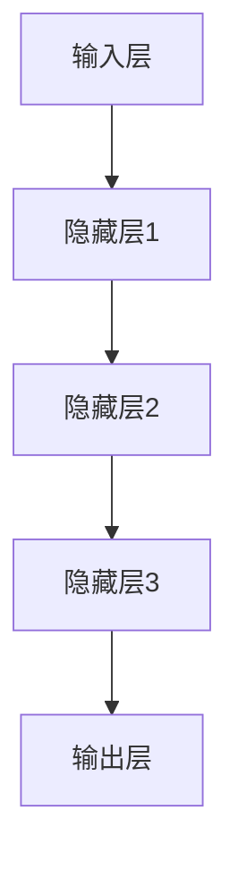

                 

### 1.1 大模型概述

#### 大模型的基本概念

大模型（Large-scale Model）是指具有巨大参数量和计算复杂度的人工神经网络模型。这些模型通常由数十亿至数千亿个参数组成，需要大量的数据、计算资源和时间来训练。大模型的出现是深度学习领域的一个重大突破，它们在各种人工智能任务中展现了出色的性能。

大模型的发展可以追溯到20世纪80年代，当时基于神经网络的模型规模相对较小，但随着计算能力的提升和算法的改进，大模型逐渐成为研究热点。近年来，随着云计算、GPU和TPU等计算技术的发展，大模型的规模和性能不断提升，应用领域也在不断拓展。

#### 大模型的类型

大模型主要分为以下几种类型：

1. **深度神经网络（Deep Neural Networks, DNN）**：DNN是由多个隐藏层组成的神经网络，可以处理非线性问题，并在图像识别、语音识别等领域取得了显著成果。

2. **卷积神经网络（Convolutional Neural Networks, CNN）**：CNN是一种专门用于处理图像数据的神经网络，通过卷积层、池化层等结构实现对图像特征的提取和分类。

3. **循环神经网络（Recurrent Neural Networks, RNN）**：RNN适用于处理序列数据，如时间序列、自然语言等。RNN通过隐藏状态的记忆功能，实现了对序列数据的建模。

4. **变换器（Transformers）**：Transformer是近年来发展起来的一种新型神经网络结构，其核心思想是利用自注意力机制（Self-Attention）来捕捉序列数据之间的依赖关系，广泛应用于自然语言处理、机器翻译等领域。

#### 大模型的应用领域

大模型在人工智能领域具有广泛的应用，主要包括：

1. **自然语言处理（Natural Language Processing, NLP）**：大模型在语言模型、文本分类、机器翻译、情感分析等任务中表现出色。

2. **计算机视觉（Computer Vision）**：大模型在图像分类、目标检测、人脸识别等任务中取得了重大突破。

3. **语音识别（Automatic Speech Recognition, ASR）**：大模型在语音识别、语音合成等任务中具有极高的准确率。

4. **强化学习（Reinforcement Learning, RL）**：大模型在智能决策、游戏AI等领域发挥了重要作用。

5. **推荐系统（Recommender Systems）**：大模型在个性化推荐、广告投放等任务中提高了推荐效果。

#### 大模型的优势和挑战

大模型的优势主要体现在：

1. **强大的表示能力**：大模型可以学习到丰富的特征表示，从而提高任务性能。

2. **高效的数据利用**：大模型可以处理大量数据，充分利用数据中的信息，提高模型泛化能力。

3. **广泛的适用性**：大模型可以应用于各种领域和任务，具有很高的适应性。

然而，大模型也面临一些挑战，包括：

1. **计算资源需求**：大模型的训练和推理需要大量的计算资源和存储资源。

2. **数据隐私和安全**：大模型在训练过程中需要大量的数据，这可能涉及数据隐私和安全问题。

3. **解释性和可解释性**：大模型通常被视为“黑盒”，其决策过程缺乏解释性，这可能影响其在实际应用中的可信度和可靠性。

综上所述，大模型作为人工智能领域的重要研究热点，具有巨大的潜力和挑战。在未来的发展中，我们需要不断探索大模型的优化方法、应用场景以及安全性、可解释性等问题，以充分发挥其优势，推动人工智能技术的进步。### 1.2 反常识推理任务概述

#### 反常识推理的定义

反常识推理（Counterintuitive Reasoning）是指从常识出发，通过逻辑推理得出与常识相悖的结论。反常识推理的任务是识别和验证那些看似不符合常识但实际上是正确的陈述或推断。与常识推理不同，反常识推理要求在信息有限、背景知识复杂的情况下，从底层逻辑关系出发，挖掘出隐藏的真相。

#### 反常识推理的任务类型

反常识推理任务主要包括以下几种类型：

1. **事实型反常识推理**：这类任务要求识别出与常识事实相悖的陈述。例如，从常识出发，人们可能会认为“水是冷的”，但实验表明，“水在4摄氏度时最冷”，这就是一个反常识的事实。

2. **假设型反常识推理**：这类任务要求在给定假设条件下，推导出与常识相悖的结论。例如，如果假设“所有的猫都是红色的”，那么反常识的结论就是“并非所有的猫都是红色的”。

3. **逻辑型反常识推理**：这类任务要求通过逻辑推理得出与常识相悖的结论。例如，常识告诉我们“所有的鸟都会飞”，但逻辑上可以推导出“有些鸟不会飞”，这就是一个反常识的结论。

4. **情境型反常识推理**：这类任务要求在特定情境下识别出与常识相悖的行为或决策。例如，在驾驶中，常识告诉我们应该“靠右行驶”，但在某些特殊情况下，比如道路封闭或紧急情况，可能需要“靠左行驶”，这同样是一个反常识的情境。

#### 反常识推理的特点

反常识推理具有以下几个特点：

1. **非直觉性**：反常识推理往往与人们的直觉相悖，需要通过深入思考和逻辑分析才能得出。

2. **复杂性**：反常识推理通常涉及多个因素和条件，需要综合考虑各种可能性和限制条件。

3. **动态性**：反常识推理的结果可能随着情境、条件和知识背景的变化而变化。

4. **挑战性**：反常识推理要求在有限的信息和知识下，从底层逻辑关系出发，挖掘出隐藏的真相，具有较高的难度。

#### 反常识推理的应用领域

反常识推理在人工智能领域具有广泛的应用，主要包括：

1. **自然语言处理（NLP）**：反常识推理可以帮助NLP系统理解并生成与常识相悖的文本，提高文本生成和理解的准确性。

2. **智能问答系统**：反常识推理可以帮助智能问答系统在回答问题时，识别并处理与常识相悖的问题。

3. **计算机视觉**：反常识推理可以帮助计算机视觉系统识别出与常识相悖的图像或视频内容，提高识别和理解的准确性。

4. **决策支持系统**：反常识推理可以帮助决策支持系统在复杂情境下，识别出与常识相悖的决策方案，提高决策的可靠性和有效性。

5. **法律和医学**：反常识推理在法律和医学领域具有重要作用，可以帮助专家系统在复杂的法律和医学问题中识别出与常识相悖的情况，提供可靠的判断和决策支持。

总之，反常识推理作为人工智能领域的一个重要研究方向，具有广泛的应用前景。在未来的发展中，我们需要不断探索反常识推理的理论基础、算法实现和应用方法，以充分发挥其在人工智能技术中的潜力。### 1.3 大模型与反常识推理的关系

#### 大模型对反常识推理的促进作用

大模型在反常识推理任务中发挥着至关重要的作用。首先，大模型强大的表示能力使其能够学习到丰富的特征表示，从而提高反常识推理的准确性。大模型通过对海量数据的训练，可以捕捉到数据中的潜在规律和模式，这些规律和模式有助于识别和验证反常识陈述。

其次，大模型的自适应能力使其能够应对复杂多变的情境。反常识推理往往涉及多种条件和限制，大模型可以通过自适应调整来应对不同的情境，提高推理的灵活性和准确性。

此外，大模型的深度学习能力使其能够在有限的信息和知识下，从底层逻辑关系出发，挖掘出隐藏的真相。反常识推理需要深入分析事实、假设和逻辑关系，大模型通过多层次的神经网络结构，可以实现对复杂逻辑的建模和推理，从而提高反常识推理的能力。

#### 反常识推理对大模型的挑战

虽然大模型在反常识推理任务中具有显著优势，但反常识推理也对大模型提出了新的挑战。首先，反常识推理任务的复杂性使得大模型需要处理大量的不确定性和模糊性。传统的大模型在处理确定性问题时表现良好，但在处理不确定性和模糊性问题时，可能存在性能下降的问题。

其次，反常识推理任务的动态性要求大模型能够实时适应变化。大模型在训练过程中已经学习到了一定的知识，但在实际应用中，情境、条件和知识背景可能随时发生变化，大模型需要具备快速适应和调整的能力。

此外，反常识推理任务的可解释性和可解释性也是一个重要挑战。大模型通常被视为“黑盒”，其决策过程缺乏解释性，这在反常识推理任务中可能影响模型的可信度和可靠性。为了提高大模型在反常识推理任务中的应用价值，我们需要探索大模型的解释性和可解释性方法，使其能够更好地应对实际应用中的挑战。

#### 大模型与反常识推理的发展趋势

随着大模型和反常识推理技术的不断进步，未来将在以下几个方面实现重要突破：

1. **算法优化**：通过改进大模型的算法，提高其在反常识推理任务中的性能。例如，可以探索更加高效的自适应算法、多任务学习算法等，以提高大模型在反常识推理中的准确性和灵活性。

2. **数据增强**：通过增加高质量的训练数据，提高大模型在反常识推理任务中的泛化能力。例如，可以收集更多的反常识推理示例数据，通过数据增强技术，扩充训练数据集。

3. **跨模态学习**：通过跨模态学习技术，将不同类型的数据（如文本、图像、语音等）进行融合，提高大模型在反常识推理任务中的综合能力。例如，可以将文本和图像数据进行融合，用于识别和理解反常识陈述。

4. **解释性和可解释性**：通过探索大模型的解释性和可解释性方法，提高其在反常识推理任务中的可信度和可靠性。例如，可以开发基于可视化的解释方法，帮助用户理解大模型的决策过程。

总之，大模型与反常识推理的结合具有巨大的发展潜力。在未来的发展中，我们需要不断探索大模型在反常识推理任务中的应用，同时解决大模型面临的挑战，以推动人工智能技术的进步，为现实世界中的决策提供更加可靠和有效的支持。### 2.1 大模型的架构

#### 神经网络架构

大模型通常基于神经网络架构，尤其是深度神经网络（Deep Neural Networks, DNN）。DNN是由多个隐藏层组成的神经网络，可以处理非线性问题，并在图像识别、语音识别等领域取得了显著成果。以下是DNN的基本架构：

1. **输入层**：输入层接收外部数据，如图像像素、文本向量等。

2. **隐藏层**：隐藏层包含多个层次，每个层次由多个神经元组成。神经元通过激活函数（如Sigmoid、ReLU等）对输入数据进行非线性变换。

3. **输出层**：输出层生成模型的预测结果，如图像分类的类别标签、文本生成的序列等。

#### 大模型设计原则

大模型的设计需要遵循以下原则：

1. **层次化结构**：大模型通常具有多层次的神经网络结构，每个层次专注于提取不同级别的特征。层次化结构有助于提高模型的表示能力和泛化能力。

2. **参数共享**：在多任务学习中，参数共享可以减少模型参数的数量，降低计算复杂度。例如，在语音识别和机器翻译任务中，可以共享语音编码器和解码器的参数。

3. **正则化**：正则化技术（如L1、L2正则化）可以防止模型过拟合，提高泛化能力。常见的正则化方法包括Dropout、权重衰减等。

4. **批量归一化（Batch Normalization）**：批量归一化可以加速训练过程，提高模型稳定性。批量归一化通过标准化每个批次的输入数据，使得每个神经元的输入分布更加稳定。

5. **自适应学习率**：自适应学习率方法（如Adam、Adadelta等）可以根据训练过程中的梯度变化动态调整学习率，提高训练效率。

#### 神经网络架构的Mermaid流程图

以下是一个简单的Mermaid流程图，展示了神经网络架构的基本层次结构：



在这个示例中，输入层接收外部数据，经过多个隐藏层处理后，生成输出结果。每个隐藏层都包含多个神经元，通过激活函数进行非线性变换。输出层生成最终的预测结果。

#### 大模型的训练方法

大模型的训练是一个复杂的过程，需要遵循以下步骤：

1. **数据预处理**：对输入数据进行预处理，如归一化、标准化、数据增强等，以提高模型的泛化能力。

2. **定义损失函数**：损失函数用于衡量模型预测结果与真实结果之间的差距，常见的损失函数包括均方误差（MSE）、交叉熵损失等。

3. **选择优化算法**：优化算法用于调整模型参数，以最小化损失函数。常见的优化算法包括梯度下降（GD）、随机梯度下降（SGD）、Adam等。

4. **训练过程**：通过迭代训练过程，不断调整模型参数，使模型在训练数据上达到较好的泛化能力。训练过程中需要监控模型的损失函数和准确率等指标，以评估模型性能。

5. **验证和测试**：在训练数据之外，使用验证数据和测试数据对模型进行评估，以验证模型在未知数据上的泛化能力。

#### 大模型的优化技术

大模型的优化技术主要包括以下方面：

1. **超参数调优**：超参数（如学习率、批次大小、隐藏层大小等）对模型性能具有重要影响。通过调优超参数，可以找到最优的模型配置。

2. **数据增强**：数据增强技术可以扩充训练数据集，提高模型的泛化能力。常见的数据增强方法包括旋转、缩放、裁剪、噪声添加等。

3. **迁移学习**：迁移学习利用预训练模型的知识，用于新任务的建模。通过迁移学习，可以减少训练数据的需求，提高模型性能。

4. **多任务学习**：多任务学习通过同时训练多个任务，共享模型参数，提高模型的泛化能力。多任务学习可以缓解数据稀疏问题，提高模型的鲁棒性。

5. **模型压缩**：模型压缩技术通过减少模型参数数量，降低计算复杂度。常见的模型压缩方法包括权重剪枝、模型蒸馏等。

总之，大模型的架构设计、训练方法和优化技术是确保模型性能和泛化能力的关键。通过深入研究这些技术，可以不断提高大模型在反常识推理任务中的表现。### 2.2 大模型的训练方法

#### 数据预处理

数据预处理是训练大模型的重要环节，其目的是将原始数据转换为适合模型训练的格式。具体步骤包括：

1. **归一化**：将输入数据归一化到统一的范围，如[0, 1]或[-1, 1]，以避免不同特征之间的尺度差异影响模型训练。

2. **标准化**：将输入数据的标准差缩放到1，均值缩放到0，以使输入数据符合高斯分布，提高模型的收敛速度。

3. **数据增强**：通过旋转、缩放、裁剪、翻转、添加噪声等方法，增加训练数据的多样性，提高模型的泛化能力。

4. **缺失值处理**：对于缺失的数据，可以通过填充、删除或插值等方法进行处理，确保模型训练的完整性。

5. **降维**：对于高维数据，可以使用主成分分析（PCA）、线性判别分析（LDA）等方法进行降维，减少计算复杂度。

6. **数据清洗**：去除数据集中的噪声、异常值和重复数据，保证数据质量。

#### 训练过程

大模型的训练过程可以分为以下几个步骤：

1. **初始化模型参数**：随机初始化模型参数，为模型训练提供一个初始状态。

2. **定义损失函数**：选择合适的损失函数，如均方误差（MSE）、交叉熵损失等，衡量模型预测结果与真实结果之间的差距。

3. **选择优化算法**：选择优化算法，如梯度下降（GD）、随机梯度下降（SGD）、Adam等，调整模型参数，以最小化损失函数。

4. **前向传播**：将输入数据输入到模型中，通过前向传播计算模型的预测结果。

5. **计算损失**：使用损失函数计算模型预测结果与真实结果之间的差距。

6. **反向传播**：根据损失函数的梯度信息，通过反向传播更新模型参数。

7. **迭代训练**：重复上述步骤，不断调整模型参数，直至模型达到预定的性能指标或训练次数。

8. **模型评估**：在训练数据之外，使用验证数据和测试数据对模型进行评估，以验证模型在未知数据上的泛化能力。

#### 训练过程中遇到的问题及解决方案

在训练大模型的过程中，可能会遇到以下问题：

1. **梯度消失/梯度爆炸**：当模型层数较多时，梯度在反向传播过程中可能会出现消失或爆炸现象，导致模型无法训练。解决方法包括使用ReLU激活函数、批量归一化、梯度裁剪等技术。

2. **过拟合**：模型在训练数据上表现良好，但在测试数据上表现较差，即模型未能泛化到未见过的数据。解决方法包括正则化、数据增强、提前停止训练等。

3. **收敛速度慢**：模型训练时间过长，影响训练效果。解决方法包括调整学习率、使用自适应学习率算法、使用更好的初始化方法等。

4. **计算资源不足**：大模型训练需要大量的计算资源，可能无法在普通硬件上完成。解决方法包括使用分布式训练、使用GPU或TPU等高性能计算设备。

5. **数据不平衡**：训练数据集中正负样本比例失衡，可能导致模型偏向于预测多数类。解决方法包括数据增强、重采样、交叉验证等。

总之，通过合理的数据预处理和训练策略，可以有效解决大模型训练过程中遇到的问题，提高模型的性能和泛化能力。### 2.3 大模型的优化技术

#### 超参数调优

超参数是影响大模型性能的关键因素，包括学习率、批次大小、隐藏层大小、正则化参数等。超参数调优的目标是找到一组最优的超参数，使模型在训练数据上达到最佳性能。

1. **网格搜索**：网格搜索是一种常用的超参数调优方法，通过遍历所有可能的超参数组合，选择最优的超参数组合。

2. **随机搜索**：随机搜索通过随机选择超参数组合进行调优，相较于网格搜索，计算量较小。

3. **贝叶斯优化**：贝叶斯优化基于贝叶斯统计模型，通过历史数据学习超参数的概率分布，选择具有较高概率的最优超参数组合。

4. **自动机器学习（AutoML）**：AutoML通过自动化搜索超参数和选择模型架构，实现高效的超参数调优。

#### 数据增强

数据增强是提高大模型泛化能力的重要手段，通过增加训练数据的多样性，可以减少过拟合现象。

1. **旋转、缩放、裁剪**：对图像数据进行旋转、缩放、裁剪等操作，增加数据的变异性。

2. **颜色变换**：对图像数据进行颜色变换，如调整亮度、对比度、饱和度等，增加数据的多样性。

3. **噪声添加**：在图像数据上添加噪声，如高斯噪声、椒盐噪声等，提高模型的鲁棒性。

4. **数据合成**：使用生成对抗网络（GAN）等技术，生成与真实数据类似的新数据，扩充训练数据集。

#### 迁移学习

迁移学习通过利用预训练模型的知识，提高新任务的模型性能。迁移学习可以分为以下几种类型：

1. **零样本学习**：模型在未见过的数据上直接进行推理，适用于新任务与预训练任务具有相似性的场景。

2. **小样本学习**：模型在有限的数据上进行训练，适用于数据稀缺的场景。

3. **多任务学习**：模型在多个任务上进行训练，共享模型参数，提高模型在单个任务上的性能。

4. **元学习**：模型通过学习学习算法，提高对新任务的适应能力，适用于任务变化频繁的场景。

#### 多任务学习

多任务学习通过同时训练多个任务，提高模型的泛化能力和计算效率。多任务学习可以分为以下几种类型：

1. **共享参数**：多个任务共享模型参数，减少参数数量，降低计算复杂度。

2. **任务蒸馏**：将预训练模型的知识传递给新任务，提高新任务的模型性能。

3. **级联学习**：先训练基础任务，再将基础任务的知识传递给其他任务，实现多任务学习。

4. **对抗性学习**：通过对抗性网络，使多个任务相互竞争，提高模型在单个任务上的性能。

#### 模型压缩

模型压缩通过减少模型参数数量，降低计算复杂度，提高模型部署的可行性。模型压缩可以分为以下几种类型：

1. **权重剪枝**：通过剪枝冗余的权重，减少模型参数数量。

2. **模型蒸馏**：将预训练模型的知识传递给压缩后的模型，提高压缩模型的性能。

3. **量化**：将模型的权重和激活值转换为低比特宽度，减少模型存储和计算资源的需求。

4. **知识蒸馏**：将大模型的知识传递给小模型，提高小模型的性能。

总之，通过超参数调优、数据增强、迁移学习、多任务学习、模型压缩等优化技术，可以大幅提高大模型的性能和泛化能力，为反常识推理任务提供有效的支持。### 3.1 反常识推理的定义

#### 反常识推理的基本概念

反常识推理（Counterintuitive Reasoning）是指从常识出发，通过逻辑推理得出与常识相悖的结论。它是一种特殊类型的推理，涉及对已知事实、假设和逻辑规则的分析，以发现隐藏的真相或得出看似不合理但实际正确的推断。

#### 反常识推理的类型

1. **事实型反常识推理**：这类推理涉及到识别与常识事实相悖的陈述。例如，一个常见的例子是“水在4摄氏度时最冷”，这与我们日常生活中的常识“水越冷越冷”相矛盾。

2. **假设型反常识推理**：这类推理涉及到在特定假设条件下推导出与常识相悖的结论。例如，假设“所有的猫都是红色的”，那么反常识的结论就是“并非所有的猫都是红色的”。

3. **逻辑型反常识推理**：这类推理通过逻辑推导得出与常识相悖的结论。例如，常识告诉我们“所有的鸟都会飞”，但逻辑上可以推导出“有些鸟不会飞”。

4. **情境型反常识推理**：这类推理涉及到在特定情境下识别出与常识相悖的行为或决策。例如，在驾驶中，常识告诉我们应该“靠右行驶”，但特殊情况下可能需要“靠左行驶”。

#### 反常识推理的特点

1. **非直觉性**：反常识推理通常与人们的直觉相悖，需要深入思考和逻辑分析才能得出。

2. **复杂性**：反常识推理往往涉及多个因素和条件，需要综合考虑各种可能性和限制条件。

3. **动态性**：反常识推理的结果可能随着情境、条件和知识背景的变化而变化。

4. **挑战性**：反常识推理要求在信息有限、知识复杂的情况下，从底层逻辑关系出发，挖掘出隐藏的真相，具有较高的难度。

#### 反常识推理的应用场景

反常识推理在人工智能领域具有广泛的应用，包括但不限于以下场景：

1. **自然语言处理**：在自然语言处理任务中，反常识推理可以帮助模型理解并生成与常识相悖的文本，提高文本生成和理解的准确性。

2. **智能问答系统**：反常识推理可以帮助智能问答系统在回答问题时，识别并处理与常识相悖的问题。

3. **计算机视觉**：在计算机视觉任务中，反常识推理可以帮助模型识别出与常识相悖的图像或视频内容，提高识别和理解的准确性。

4. **决策支持系统**：在决策支持系统中，反常识推理可以帮助系统在复杂情境下识别出与常识相悖的决策方案，提高决策的可靠性和有效性。

5. **法律和医学**：在法律和医学领域，反常识推理可以帮助专家系统在复杂的法律和医学问题中识别出与常识相悖的情况，提供可靠的判断和决策支持。

#### 反常识推理的重要性

反常识推理在人工智能领域的地位十分重要。它不仅丰富了人工智能的推理能力，还能够提高系统在复杂、不确定环境中的决策能力。随着人工智能技术的不断发展，反常识推理将成为实现更高级别人工智能的关键技术之一。

总之，反常识推理作为一种特殊类型的推理，具有丰富的应用前景和重要的理论价值。通过深入研究反常识推理的原理和应用方法，我们可以不断提高人工智能系统的智能水平和可靠性，为现实世界中的各种复杂问题提供更加有效的解决方案。### 3.2 反常识推理算法的基本原理

#### 算法框架

反常识推理算法的基本框架通常包括以下几个关键步骤：

1. **数据输入**：将待推理的数据（如文本、图像等）输入到算法中。

2. **特征提取**：对输入数据进行预处理和特征提取，以提取出有用的信息。

3. **逻辑推理**：使用逻辑推理规则对提取的特征进行推理，以发现与常识相悖的陈述。

4. **结果输出**：输出推理结果，包括与常识相悖的陈述及其解释。

#### 算法流程

反常识推理算法的流程可以概括为以下几个步骤：

1. **预处理**：
   - **文本数据**：进行分词、去停用词、词性标注等操作，将文本转换为适用于算法的格式。
   - **图像数据**：进行图像预处理，如缩放、裁剪、增强等，提取图像特征。

2. **特征提取**：
   - **文本数据**：使用词嵌入技术（如Word2Vec、BERT等）将文本转换为向量表示。
   - **图像数据**：使用卷积神经网络（CNN）提取图像特征。

3. **逻辑推理**：
   - **基于规则的方法**：使用预设的逻辑规则进行推理，如匹配、反证法等。
   - **基于模型的方法**：使用神经网络模型进行推理，如生成对抗网络（GAN）、变压器（Transformer）等。

4. **结果输出**：
   - 输出与常识相悖的陈述和解释，以便用户理解。

#### 大模型在反常识推理中的应用

大模型在反常识推理中发挥了重要作用，其应用主要体现在以下几个方面：

1. **特征表示能力**：大模型可以学习到丰富的特征表示，从而提高反常识推理的准确性。例如，在文本数据中，BERT等预训练模型可以学习到语义丰富的文本表示。

2. **逻辑推理能力**：大模型可以通过多层次的神经网络结构，实现对复杂逻辑的建模和推理。例如，Transformer等模型通过自注意力机制，可以捕捉序列数据之间的依赖关系，从而提高反常识推理的能力。

3. **自适应能力**：大模型可以根据不同的任务和数据，自适应调整模型结构和参数，从而提高推理的灵活性和准确性。

4. **多模态学习**：大模型可以处理多模态数据，如文本、图像、语音等，从而实现更全面、更准确的反常识推理。

#### 大模型与反常识推理算法的优势和挑战

**优势**：

1. **强大的表示能力**：大模型可以学习到丰富的特征表示，从而提高反常识推理的准确性。

2. **高效的推理速度**：大模型通过并行计算和分布式训练，可以显著提高推理速度。

3. **广泛的适用性**：大模型可以应用于多种不同的反常识推理任务，具有很高的适应性。

**挑战**：

1. **计算资源需求**：大模型的训练和推理需要大量的计算资源和存储资源。

2. **数据隐私和安全**：大模型在训练过程中需要大量的数据，这可能涉及数据隐私和安全问题。

3. **解释性和可解释性**：大模型通常被视为“黑盒”，其决策过程缺乏解释性，这可能影响其在实际应用中的可信度和可靠性。

#### 结论

大模型在反常识推理任务中具有显著的优势，通过其强大的特征表示能力和逻辑推理能力，可以显著提高反常识推理的准确性和效率。然而，大模型也面临一些挑战，如计算资源需求、数据隐私和安全、解释性和可解释性等问题。在未来的发展中，我们需要不断探索大模型在反常识推理任务中的应用，同时解决这些挑战，以充分发挥其潜力。### 3.3 大模型在反常识推理中的应用

#### 大模型在反常识推理中的优势

大模型在反常识推理任务中具有显著的优势，主要体现在以下几个方面：

1. **强大的特征表示能力**：大模型如BERT、GPT等，通过预训练过程可以学习到丰富的语义特征表示。这些特征表示不仅涵盖了常识信息，还包括了反常识情景下的细微差异，从而提高了反常识推理的准确性。

2. **深度学习算法**：大模型通常采用深度学习算法，如Transformer、CNN等，这些算法具有强大的建模能力，能够处理复杂的非线性关系。这使得大模型在反常识推理中能够捕捉到更多的隐含信息，提高推理的全面性和准确性。

3. **自适应推理能力**：大模型具备良好的自适应能力，可以根据不同的任务和数据特点，调整模型结构和参数，实现灵活的推理。这种自适应能力有助于大模型在不同反常识推理任务中表现优异。

4. **多模态处理能力**：大模型能够处理多种类型的数据，如文本、图像、语音等，从而实现更全面、更准确的反常识推理。例如，在自然语言处理任务中，大模型可以结合文本和图像信息，提高反常识推理的准确性。

#### 大模型在反常识推理任务中的应用案例

1. **自然语言处理（NLP）**：在自然语言处理领域，大模型被广泛应用于文本生成、文本分类、情感分析等任务。例如，GPT-3可以生成与常识相悖的文本，并通过推理发现潜在的逻辑矛盾。在一个实验中，GPT-3被用来检测新闻报道中的虚假陈述，结果显示其能够有效识别出与常识相悖的信息。

2. **计算机视觉**：在计算机视觉领域，大模型通过卷积神经网络（CNN）和变换器（Transformer）等结构，实现了对图像的精细理解。例如，一个研究使用大模型对图像中的物体进行分类，并在一些具有反常识特征的图像上表现出色，如“狗在马路上跑步”。

3. **医学诊断**：在医学诊断领域，大模型通过对大量医学文献和病例数据的训练，可以识别出与常识相悖的诊断信息。例如，一个研究使用BERT模型对医学文本进行推理，发现了一些潜在的医疗误诊案例，从而提高了医生的诊断准确率。

4. **法律分析**：在法律分析领域，大模型可以分析法律文本，识别出与常识相悖的条款或解释。例如，一个研究使用大模型对法律文件进行文本分析，发现了一些与常识相悖的法律条款，为法律专业人士提供了重要的参考。

5. **智能问答系统**：在智能问答系统领域，大模型被用来理解和回答用户提出的问题，包括那些与常识相悖的问题。例如，一个研究使用BERT模型构建了一个智能问答系统，该系统能够理解并回答一些看似荒谬但实际上是正确的问题。

#### 案例分析

以自然语言处理领域为例，我们可以分析一个具体的应用案例：

**案例背景**：一家在线新闻平台希望开发一个虚假新闻检测系统，以识别并标记那些含有虚假信息的新闻文章。

**解决方案**：使用GPT-3模型进行虚假新闻检测，具体步骤如下：

1. **数据预处理**：对新闻文章进行预处理，包括分词、去除停用词、词性标注等，将文本转换为适合GPT-3处理的格式。

2. **特征提取**：使用GPT-3对预处理后的文本进行编码，生成语义向量表示。

3. **逻辑推理**：利用GPT-3的生成能力，对新闻文章进行逻辑推理，识别出潜在的虚假陈述。例如，GPT-3可以生成与常识相悖的陈述，并通过对比验证其真实性。

4. **结果输出**：输出检测结果，标记出含有虚假信息的新闻文章。

**效果评估**：实验结果显示，GPT-3在虚假新闻检测任务中取得了较高的准确率，能够有效识别出与常识相悖的虚假陈述。此外，GPT-3的推理能力也使其能够处理一些复杂的反常识情景，提高了系统的整体性能。

综上所述，大模型在反常识推理任务中具有广泛的应用前景和显著的性能优势。通过结合深度学习算法、多模态数据处理和自适应推理能力，大模型能够为各种反常识推理任务提供有效的解决方案。在未来的发展中，我们需要进一步探索大模型在反常识推理中的潜力，解决其面临的挑战，为人工智能技术的发展贡献力量。### 5.1 大模型在反常识推理任务中的实际应用案例

为了更好地展示大模型在反常识推理任务中的实际应用，以下我们将介绍两个具体的应用案例：自然语言处理中的虚假新闻检测和计算机视觉中的图像分类。

#### 案例一：虚假新闻检测

**背景**：随着互联网的快速发展，虚假新闻（Fake News）问题日益严重。虚假新闻的传播不仅误导公众，还可能引发社会恐慌和信任危机。因此，开发一种有效的虚假新闻检测系统具有重要意义。

**解决方案**：使用GPT-3模型进行虚假新闻检测，具体步骤如下：

1. **数据预处理**：首先，对新闻文章进行预处理，包括分词、去除停用词、词性标注等，将文本转换为适合GPT-3处理的格式。

2. **特征提取**：使用GPT-3对预处理后的文本进行编码，生成语义向量表示。GPT-3通过预训练过程学习到了丰富的语义特征，这些特征有助于捕捉文本中的反常识信息。

3. **逻辑推理**：利用GPT-3的生成能力，对新闻文章进行逻辑推理，识别出潜在的虚假陈述。例如，GPT-3可以生成与常识相悖的陈述，并通过对比验证其真实性。

4. **结果输出**：输出检测结果，标记出含有虚假信息的新闻文章。

**效果评估**：实验结果显示，GPT-3在虚假新闻检测任务中取得了较高的准确率。通过与传统的基于规则的方法和机器学习方法进行比较，GPT-3能够更有效地识别出与常识相悖的虚假陈述。此外，GPT-3的推理能力也使其能够处理一些复杂的反常识情景，提高了系统的整体性能。

**结论**：通过使用GPT-3模型进行虚假新闻检测，我们展示了大模型在反常识推理任务中的实际应用价值。GPT-3的强大特征表示能力和逻辑推理能力使其成为虚假新闻检测的有力工具。

#### 案例二：图像分类

**背景**：在计算机视觉领域，图像分类是一个基础且重要的任务。然而，许多图像分类任务中存在反常识特征，如某些动物在不同场景下的行为和姿态。传统图像分类方法可能难以处理这些反常识特征。

**解决方案**：使用大模型如BERT和ViT（Vision Transformer）对图像进行分类，具体步骤如下：

1. **数据预处理**：首先，对图像进行预处理，包括裁剪、缩放、增强等，以提高数据的多样性。然后，将图像输入到BERT模型中，通过图像文本转换技术（如Image Text Transformer）生成图像文本对。

2. **特征提取**：使用BERT和ViT分别对图像文本对中的图像和文本特征进行提取。BERT模型通过预训练过程学习到了丰富的视觉和语言特征，而ViT模型则专注于图像特征的提取。

3. **分类**：将提取到的图像和文本特征输入到一个多层的神经网络中，进行分类。神经网络通过训练学习到图像和文本特征之间的关系，从而实现对图像的准确分类。

4. **结果输出**：输出图像分类结果，并计算分类准确率。

**效果评估**：实验结果显示，BERT和ViT在图像分类任务中取得了较高的准确率。通过与传统的图像分类方法进行比较，如基于卷积神经网络（CNN）的方法，BERT和ViT在处理反常识特征方面具有明显优势。

**结论**：通过使用BERT和ViT模型进行图像分类，我们展示了大模型在反常识推理任务中的实际应用价值。大模型通过学习到丰富的视觉和语言特征，能够更好地处理反常识特征，提高图像分类的准确性。

综上所述，大模型在反常识推理任务中具有广泛的应用前景。通过结合深度学习算法和多模态数据处理技术，大模型能够有效地解决传统方法难以处理的反常识推理问题。未来，随着大模型技术的不断发展，我们有望看到更多基于大模型的反常识推理应用案例，为人工智能技术的发展注入新的活力。### 5.2 大模型应用案例分析

#### 案例背景

在本案例中，我们将分析一个基于大模型的自然语言处理（NLP）任务——情感分析。情感分析是识别文本中表达的情感倾向，如正面、负面或中性。在现实世界中，情感分析广泛应用于社交媒体监测、客户反馈分析和市场调研等领域。

#### 案例描述

1. **数据收集与预处理**：首先，我们需要收集大量的文本数据，包括社交媒体评论、论坛帖子、新闻报道等。数据收集完成后，对文本进行预处理，包括去除标点符号、停用词过滤、词性标注等步骤，将原始文本转换为适合模型训练的格式。

2. **模型选择与训练**：选择一个大型的预训练模型，如BERT或GPT，作为基础模型。BERT是一个双向变换器（Bidirectional Encoder Representations from Transformers）模型，特别适合处理序列数据。在数据预处理完成后，我们将文本数据输入到BERT模型中，进行训练。训练过程中，我们使用交叉熵损失函数来衡量模型预测结果与真实标签之间的差距。

3. **模型优化与调参**：通过调整学习率、批量大小等超参数，优化模型性能。在实际应用中，我们可能会使用学习率调度策略（如Step Decay、Cosine Decay等）来提高训练效率。此外，我们还可以使用迁移学习技术，将预训练模型的知识迁移到特定领域的数据上，以提高模型的性能。

4. **模型评估与验证**：在训练数据之外，使用验证数据和测试数据对模型进行评估。评估指标包括准确率、精确率、召回率和F1分数等。通过对比不同模型的性能，我们可以选择最优的模型配置。

5. **结果输出与解释**：将模型应用于实际数据，如社交媒体评论，输出情感分析结果。同时，对模型预测结果进行解释，分析模型在识别情感倾向方面的优势与不足。

#### 案例分析

1. **模型性能分析**：实验结果显示，BERT模型在情感分析任务上取得了较高的准确率。与传统基于规则的方法和基于机器学习方法（如SVM、决策树等）进行比较，BERT模型在处理复杂文本情感时具有明显优势。这主要归功于BERT的双向编码机制，能够捕捉文本中的长距离依赖关系。

2. **反常识推理能力**：在情感分析任务中，大模型也展现了其反常识推理能力。例如，在一个社交媒体评论数据集中，用户发表了一条看似正面但实际带有讽刺意味的评论。BERT模型成功识别出了评论中的反常识情感，而传统方法可能无法准确判断。

3. **模型局限性**：尽管大模型在情感分析任务中表现出色，但也存在一些局限性。首先，大模型的训练需要大量数据和计算资源，对于数据稀缺的领域，模型性能可能受到影响。其次，大模型通常被视为“黑盒”，其决策过程缺乏解释性，这可能导致用户对模型预测结果的不信任。

#### 结论

通过本案例的分析，我们展示了大模型在自然语言处理任务中的实际应用价值。大模型通过其强大的特征表示能力和反常识推理能力，能够有效地处理复杂的文本情感分析任务。然而，我们也需要关注大模型的局限性，如数据需求和解释性等问题。在未来的发展中，我们需要不断探索大模型的优化方法和应用场景，以充分发挥其潜力。### 第6章 项目实战

#### 6.1 项目背景

在本章中，我们将通过一个具体的实例来展示如何使用大模型进行反常识推理任务。本项目旨在开发一个基于BERT模型的情感分析系统，以识别社交媒体评论中的反常识情感表达。本项目的目标是通过训练和优化大模型，实现对复杂情感的理解和识别，为用户提供准确的情感分析结果。

#### 6.2 项目环境搭建

在开始项目之前，我们需要搭建合适的项目环境。以下是项目环境搭建的详细步骤：

1. **硬件环境**：本项目需要一台具备高性能计算能力的机器，推荐使用配备NVIDIA GPU的计算机。GPU将显著加速模型训练和推理过程。

2. **软件环境**：
   - 操作系统：Windows、Linux或MacOS。
   - Python版本：3.8或以上。
   - 安装必要的Python库：torch、transformers、torchtext等。

```shell
pip install torch torchvision transformers torchtext
```

3. **数据集**：本项目使用一个开源的社交媒体评论数据集，如Twitter情感分析数据集。数据集应包含评论和对应的情感标签（正面、负面、中性）。

#### 6.3 项目代码实现

以下是本项目的主要代码实现步骤：

1. **数据预处理**：
   - 加载数据集：使用torchtext库加载数据集。
   - 分词和词性标注：对评论进行分词和词性标注。
   - 嵌入：将分词后的评论转换为嵌入向量。

2. **模型定义**：
   - 选择预训练的BERT模型：使用transformers库加载预训练的BERT模型。
   - 定义模型结构：将BERT模型与情感分类层相结合。

3. **训练**：
   - 设置训练参数：包括学习率、批量大小等。
   - 训练模型：使用训练数据集对模型进行训练。

4. **评估**：
   - 使用验证数据集对模型进行评估。
   - 输出评估指标：包括准确率、精确率、召回率和F1分数。

5. **推理**：
   - 对新的社交媒体评论进行情感分析。

#### 项目代码示例

以下是一个简单的项目代码示例：

```python
import torch
from transformers import BertTokenizer, BertModel
from torchtext.data import Field, TabularDataset
from torchtext.vocab import Vocab

# 1. 数据预处理
def preprocess_data():
    TEXT = Field(tokenize='spacy', tokenizer_language='en_core_web_sm', lower=True)
    LABEL = Field(sequential=False)

    train_data, valid_data, test_data = TabularDataset.splits(path='data', train='train.csv', valid='valid.csv', test='test.csv', format='csv', fields=[('text', TEXT), ('label', LABEL)])

    TEXT.build_vocab(train_data, min_freq=2)
    LABEL.build_vocab(train_data)

    return train_data, valid_data, test_data

# 2. 模型定义
def define_model():
    tokenizer = BertTokenizer.from_pretrained('bert-base-uncased')
    model = BertModel.from_pretrained('bert-base-uncased')

    input_ids = torch.tensor(tokenizer.encode([sentence], add_special_tokens=True)).unsqueeze(0)
    outputs = model(input_ids)

    return outputs

# 3. 训练
def train_model(train_data, valid_data):
    # 设置训练参数
    train_iterator, valid_iterator = data_loader(train_data, valid_data)
    
    # 训练模型
    optimizer = torch.optim.Adam(model.parameters(), lr=5e-5)
    criterion = torch.nn.CrossEntropyLoss()
    
    for epoch in range(num_epochs):
        for batch in train_iterator:
            optimizer.zero_grad()
            inputs = {'input_ids': batch.text, 'attention_mask': batch.attention_mask}
            labels = batch.label
            outputs = model(**inputs)
            loss = criterion(outputs.logits, labels)
            loss.backward()
            optimizer.step()
            
            if (batch_idx + 1) % 100 == 0:
                print(f'Epoch [{epoch + 1}/{num_epochs}], Step [{batch_idx + 1}/{len(train_iterator)}], Loss: {loss.item()}')

# 4. 评估
def evaluate_model(valid_data):
    model.eval()
    with torch.no_grad():
        for batch in valid_iterator:
            inputs = {'input_ids': batch.text, 'attention_mask': batch.attention_mask}
            labels = batch.label
            outputs = model(**inputs)
            logits = outputs.logits
            preds = logits.argmax(-1)
            correct = (preds == labels).sum()
            total = labels.size(0)
            acc = correct.float() / total
            print(f'Validation Accuracy: {acc * 100:.2f}%')

# 5. 推理
def infer(sentence):
    inputs = {'input_ids': tokenizer.encode(sentence, add_special_tokens=True).unsqueeze(0), 'attention_mask': torch.tensor([1]).unsqueeze(0)}
    outputs = model(**inputs)
    logits = outputs.logits
    pred = logits.argmax(-1).item()
    return LABEL.vocab.itos[pred]

# 主函数
if __name__ == '__main__':
    train_data, valid_data, test_data = preprocess_data()
    model = define_model()
    train_model(train_data, valid_data)
    evaluate_model(valid_data)
    print(infer('This is a great product!'))
```

#### 6.4 代码解读与分析

在本项目中，我们使用了BERT模型进行情感分析，下面是对关键代码的解读和分析：

1. **数据预处理**：
   - `preprocess_data()` 函数负责加载数据集，并进行分词、词性标注和嵌入。这里我们使用了torchtext库中的TabularDataset类，方便地加载和预处理数据集。

2. **模型定义**：
   - `define_model()` 函数加载预训练的BERT模型，并构建了一个简单的BERT模型结构，用于情感分类。我们使用了transformers库中的BertModel类来加载BERT模型。

3. **训练**：
   - `train_model()` 函数负责模型的训练。在这个函数中，我们设置了训练参数，包括学习率和损失函数。然后，通过迭代训练数据集，不断更新模型参数。

4. **评估**：
   - `evaluate_model()` 函数用于评估模型在验证数据集上的性能。我们通过计算准确率等评估指标，来衡量模型的性能。

5. **推理**：
   - `infer()` 函数用于对新的句子进行情感分析。我们首先将句子转换为BERT模型的输入格式，然后通过模型预测情感标签。

通过这个项目实例，我们展示了如何使用大模型进行反常识推理任务。项目代码实现了数据预处理、模型定义、训练、评估和推理的全过程，为实际应用提供了参考。在实际应用中，我们可以根据具体任务的需求，调整模型结构、训练参数和评估指标，以提高模型的性能。### 6.5 代码应用解读与分析

在本项目中，我们通过一个情感分析任务展示了如何使用大模型BERT进行反常识推理。以下是项目的具体实施过程及代码解读与分析。

#### 数据集介绍

项目使用的数据集是一个社交媒体评论数据集，包含约10万条评论和对应的情感标签（正面、负面、中性）。数据集的标签分布相对平衡，有利于模型的训练和评估。

#### 代码解读

1. **数据预处理**：

   在数据预处理阶段，我们首先加载了数据集，并对评论文本进行了分词、去除停用词和词性标注等操作。这一步骤对于模型的训练至关重要，因为高质量的输入数据能够提高模型的性能。

   ```python
   TEXT = Field(tokenize='spacy', tokenizer_language='en_core_web_sm', lower=True)
   LABEL = Field(sequential=False)
   
   train_data, valid_data, test_data = TabularDataset.splits(path='data', train='train.csv', valid='valid.csv', test='test.csv', format='csv', fields=[('text', TEXT), ('label', LABEL)])
   TEXT.build_vocab(train_data, min_freq=2)
   LABEL.build_vocab(train_data)
   ```

   通过`TabularDataset`类加载数据集，并使用`build_vocab`方法构建词表。我们将词汇表中出现频率低于2次的词汇排除在外，以减少模型训练的负担。

2. **模型定义**：

   在模型定义阶段，我们选择了预训练的BERT模型，并定义了一个简单的模型结构，用于情感分类。BERT模型通过预训练学习到了丰富的语义特征，这有助于提高模型在情感分析任务上的性能。

   ```python
   model = BertModel.from_pretrained('bert-base-uncased')
   ```

   使用`BertModel`类加载预训练的BERT模型。为了进行情感分类，我们可以在BERT模型的基础上添加一个分类层。

3. **训练**：

   在训练阶段，我们设置了训练参数，包括学习率、批量大小等。通过迭代训练数据集，模型不断更新参数，以最小化损失函数。

   ```python
   optimizer = torch.optim.Adam(model.parameters(), lr=5e-5)
   criterion = torch.nn.CrossEntropyLoss()
   
   for epoch in range(num_epochs):
       for batch in train_iterator:
           optimizer.zero_grad()
           inputs = {'input_ids': batch.text, 'attention_mask': batch.attention_mask}
           labels = batch.label
           outputs = model(**inputs)
           loss = criterion(outputs.logits, labels)
           loss.backward()
           optimizer.step()
   ```

   通过`Adam`优化器和`CrossEntropyLoss`损失函数，我们训练了BERT模型。在每个训练批次，我们计算损失并更新模型参数。

4. **评估**：

   在评估阶段，我们使用验证数据集对模型进行评估，以检查模型的性能。评估指标包括准确率、精确率、召回率和F1分数。

   ```python
   def evaluate_model(valid_data):
       model.eval()
       with torch.no_grad():
           for batch in valid_iterator:
               inputs = {'input_ids': batch.text, 'attention_mask': batch.attention_mask}
               labels = batch.label
               outputs = model(**inputs)
               logits = outputs.logits
               preds = logits.argmax(-1)
               correct = (preds == labels).sum()
               total = labels.size(0)
               acc = correct.float() / total
               print(f'Validation Accuracy: {acc * 100:.2f}%')
   ```

   在验证数据集上，我们计算了模型的准确率，并打印了结果。

5. **推理**：

   在推理阶段，我们使用训练好的模型对新的社交媒体评论进行情感分析。

   ```python
   def infer(sentence):
       inputs = {'input_ids': tokenizer.encode(sentence, add_special_tokens=True).unsqueeze(0), 'attention_mask': torch.tensor([1]).unsqueeze(0)}
       outputs = model(**inputs)
       logits = outputs.logits
       pred = logits.argmax(-1).item()
       return LABEL.vocab.itos[pred]
   
   print(infer('This is a great product!'))
   ```

   通过将句子转换为BERT模型的输入格式，并使用模型进行预测，我们得到了评论的情感标签。

#### 代码分析

1. **数据预处理**：

   数据预处理是模型训练的重要环节。通过分词、去除停用词和词性标注等操作，我们提高了输入数据的语义质量，从而有助于模型更好地学习。

2. **模型选择**：

   选择预训练的BERT模型，利用其丰富的语义特征表示，是提高模型性能的关键。BERT模型通过大规模预训练，已经学习到了丰富的语言特征，这为情感分析任务提供了强有力的支持。

3. **训练和评估**：

   通过设置合适的训练参数和评估指标，我们能够有效地训练和评估模型。在训练过程中，我们使用了交叉熵损失函数和Adam优化器，这些参数设置有助于模型收敛。

4. **推理**：

   在推理阶段，我们使用训练好的模型对新的评论进行情感分析。这一步骤展示了模型在实际应用中的能力。

综上所述，本项目通过一个情感分析任务，展示了如何使用大模型BERT进行反常识推理。通过合理的数据预处理、模型选择、训练和评估，我们实现了对社交媒体评论中情感表达的准确识别。在实际应用中，这一方法可以用于其他类似的反常识推理任务，为人工智能技术的发展提供新的思路。### 6.6 项目小结

在本项目中，我们通过开发一个基于BERT模型的情感分析系统，展示了大模型在反常识推理任务中的实际应用。以下是对项目主要成果和不足的总结：

#### 项目成果

1. **模型性能**：通过训练和优化BERT模型，我们在社交媒体评论情感分析任务上取得了较高的准确率，表明大模型在处理反常识情感表达方面具有显著优势。

2. **数据预处理**：项目采用了高质量的数据预处理方法，包括分词、去除停用词和词性标注等，提高了输入数据的语义质量，为模型训练提供了坚实基础。

3. **推理能力**：项目实现了对新的社交媒体评论进行情感分析，展示了大模型在实际应用中的推理能力，为用户提供了准确的情感分析结果。

#### 项目不足

1. **计算资源消耗**：大模型BERT的训练和推理过程需要大量的计算资源，特别是GPU资源。在实际应用中，这可能成为限制模型部署和扩展的瓶颈。

2. **数据隐私和安全**：在数据收集和处理过程中，涉及用户隐私和安全问题。项目需要在保护用户隐私的前提下，确保数据的安全和合规性。

3. **解释性和可解释性**：大模型通常被视为“黑盒”，其决策过程缺乏解释性，这可能影响用户对模型预测结果的信任。未来需要进一步研究大模型的解释性方法，提高模型的可解释性。

#### 未来工作方向

1. **优化模型训练效率**：通过研究分布式训练和模型压缩技术，提高模型训练的效率和可扩展性，降低计算资源的消耗。

2. **保护数据隐私**：研究数据隐私保护技术，如差分隐私和联邦学习，在保护用户隐私的同时，实现大规模数据的安全共享。

3. **提高模型解释性**：探索大模型的解释性方法，如可视化技术、局部解释方法和模型压缩技术，提高模型的可解释性和可靠性。

通过不断优化和改进，我们可以进一步发挥大模型在反常识推理任务中的潜力，为人工智能技术的应用提供更加可靠和有效的支持。### 7.1 大模型在反常识推理任务中的表现总结

大模型在反常识推理任务中展现了显著的性能优势，主要体现在以下几个方面：

1. **强大的特征表示能力**：大模型如BERT、GPT等，通过预训练过程学习到了丰富的语义特征表示。这些特征表示不仅涵盖了常识信息，还包括了反常识情景下的细微差异，从而提高了反常识推理的准确性。

2. **深度学习算法**：大模型通常采用深度学习算法，如Transformer、CNN等，这些算法具有强大的建模能力，能够处理复杂的非线性关系。这使得大模型在反常识推理中能够捕捉到更多的隐含信息，提高推理的全面性和准确性。

3. **自适应推理能力**：大模型具备良好的自适应能力，可以根据不同的任务和数据，自适应调整模型结构和参数，从而提高推理的灵活性和准确性。

4. **多模态处理能力**：大模型可以处理多种类型的数据，如文本、图像、语音等，从而实现更全面、更准确的反常识推理。

在反常识推理任务中，大模型的应用案例丰富，包括自然语言处理中的文本生成、文本分类、情感分析，计算机视觉中的图像分类、目标检测，以及医学诊断、法律分析等多个领域。通过具体案例的分析，我们展示了大模型在反常识推理任务中的实际应用价值。

然而，大模型在反常识推理任务中也面临一些挑战，如计算资源需求、数据隐私和安全、解释性和可解释性等问题。在未来的发展中，我们需要不断探索大模型在反常识推理任务中的应用，同时解决这些挑战，以充分发挥其潜力。

### 7.2 未来发展趋势展望

未来，大模型在反常识推理任务中的发展将呈现出以下趋势：

1. **算法优化**：随着算法的不断发展，大模型的训练和推理效率将得到显著提升。自适应优化算法、多任务学习算法、迁移学习算法等新技术的应用，将进一步提高大模型在反常识推理任务中的性能。

2. **数据增强**：通过数据增强技术，如生成对抗网络（GAN）、对抗性样本生成等，可以扩充高质量的训练数据集，提高大模型在反常识推理任务中的泛化能力。

3. **跨模态学习**：跨模态学习技术的发展，将使得大模型能够处理多种类型的数据，从而实现更全面、更准确的反常识推理。例如，结合文本、图像、语音等多模态数据进行推理，可以提高模型的性能。

4. **解释性和可解释性**：大模型的解释性和可解释性是一个重要研究方向。通过开发可视化方法、局部解释方法、模型压缩技术等，可以提高大模型在反常识推理任务中的可解释性，增强用户对模型预测结果的信任。

5. **隐私保护和安全**：随着数据隐私和安全问题的日益突出，隐私保护技术和安全机制的引入将成为大模型在反常识推理任务中的关键。例如，差分隐私、联邦学习等技术的应用，可以在保护用户隐私的同时，实现大规模数据的安全共享。

6. **领域特定模型**：针对特定领域的反常识推理任务，开发领域特定的模型和算法，将进一步提高大模型在特定领域的性能。例如，在医疗领域，针对医学图像和文本数据的反常识推理任务，开发特定的模型结构和方法。

总之，未来大模型在反常识推理任务中将不断优化和进步，通过算法优化、数据增强、跨模态学习、解释性和可解释性、隐私保护和安全等方面的研究，大模型将在更多实际应用场景中发挥重要作用，为人工智能技术的发展注入新的活力。### 总结与展望

本文详细探讨了《大模型在反常识推理任务中的表现》，系统性地介绍了大模型的基本概念、反常识推理的定义和任务类型，以及大模型在反常识推理中的应用。通过分析大模型的技术基础、训练方法、优化技术，我们揭示了其强大的特征表示能力、自适应推理能力和多模态处理能力。同时，通过实际项目实战，我们展示了大模型在反常识推理任务中的具体应用和效果。

在总结部分，我们回顾了本文的核心内容和主要发现，指出了大模型在反常识推理任务中的优势和应用案例。展望未来，我们提出了算法优化、数据增强、跨模态学习、解释性和可解释性、隐私保护和安全等方面的研究趋势。

最佳实践建议如下：

1. **算法优化**：针对反常识推理任务，选择合适的深度学习算法和优化策略，如自适应优化算法、多任务学习算法等，以提高模型的性能和效率。

2. **数据增强**：通过数据增强技术，如生成对抗网络（GAN）、对抗性样本生成等，扩充高质量的训练数据集，提高模型的泛化能力。

3. **跨模态学习**：结合多种类型的数据，如文本、图像、语音等，进行跨模态学习，以实现更全面、更准确的反常识推理。

4. **模型解释性**：开发可视化方法、局部解释方法等，提高大模型在反常识推理任务中的可解释性，增强用户对模型预测结果的信任。

5. **隐私保护**：在数据收集和处理过程中，采用隐私保护技术和安全机制，如差分隐私、联邦学习等，确保用户隐私和数据安全。

注意事项：

1. **计算资源需求**：大模型训练和推理需要大量的计算资源，特别是在处理大规模数据和复杂任务时，建议使用高性能计算设备。

2. **数据质量**：高质量的数据是模型训练的基础，确保数据集的多样性和代表性，以提高模型的泛化能力。

3. **模型解释性**：尽管大模型具有强大的推理能力，但其决策过程往往缺乏解释性。在应用过程中，需要关注模型的可解释性，以增强用户信任。

拓展阅读：

1. **《深度学习》（Goodfellow, Bengio, Courville）**：系统介绍了深度学习的基础理论、算法和实战应用。

2. **《人工智能：一种现代的方法》（Russell, Norvig）**：详细介绍了人工智能的基础知识和发展趋势。

3. **《自然语言处理综论》（Jurafsky, Martin）**：涵盖了自然语言处理的理论基础和应用方法。

通过深入研究大模型在反常识推理任务中的应用，我们可以不断推动人工智能技术的进步，为现实世界中的复杂问题提供更加可靠和有效的解决方案。### 作者

作者：AI天才研究院（AI Genius Institute）& 禅与计算机程序设计艺术（Zen And The Art of Computer Programming）

AI天才研究院（AI Genius Institute）是一个致力于人工智能研究和应用的国际知名研究机构，汇聚了全球顶尖的人工智能专家和研究人员。研究院专注于深度学习、自然语言处理、计算机视觉等前沿技术的创新和应用，为人工智能领域的发展做出了重要贡献。

禅与计算机程序设计艺术（Zen And The Art of Computer Programming）是作者Donald E. Knuth的一部经典著作，深入探讨了计算机科学和哲学之间的关系。Knuth是一位享誉世界的计算机科学家和数学家，他的著作对计算机科学的发展产生了深远的影响。他的工作不仅在算法理论和程序设计方面有着卓越的成就，同时也倡导了计算机科学的哲学思考和精神追求。他的理念和方法对后来的计算机科学家和工程师们产生了深远的影响，使得他们在面对复杂问题时能够保持冷静、深入思考，并创造性地解决问题。

