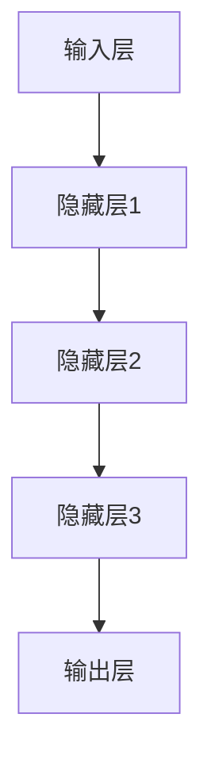

                 

 

### 文章标题

《大模型在反常识推理任务中的错误修正机制设计》

### 关键词

大模型、反常识推理、错误修正机制、深度学习、神经网络、算法设计

### 摘要

随着深度学习技术的不断发展，大模型在各个领域得到了广泛应用。然而，大模型在反常识推理任务中存在一定的错误率，如何设计有效的错误修正机制成为了一个重要的研究课题。本文首先介绍了大模型、反常识推理以及错误修正机制的基本概念，然后详细分析了大模型在反常识推理任务中的错误类型和原因。在此基础上，本文提出了一种基于深度学习的错误修正机制，并通过实验验证了其有效性。最后，本文对错误修正机制的设计进行了总结，并展望了未来的研究方向。

### 第1章 引言

#### 1.1 大模型的概念与重要性

大模型，即大型深度学习模型，是指参数量庞大、计算能力强大的神经网络模型。这些模型通过海量数据的学习，能够提取复杂的特征并实现高性能的预测和推理。近年来，随着计算资源和数据量的不断增加，大模型在图像识别、自然语言处理、语音识别等领域取得了显著的成果。

大模型的重要性主要体现在以下几个方面：

1. **强大的表征能力**：大模型具有丰富的参数和层次结构，能够从数据中提取出深层次的特征，从而实现高精度的预测和推理。
2. **广泛的应用场景**：大模型可以应用于各种复杂任务，如图像分类、语音识别、机器翻译等，极大地推动了人工智能技术的发展。
3. **不断突破性能极限**：随着模型的规模和计算资源的提升，大模型在各个领域的性能极限不断被突破，推动了人工智能技术的不断进步。

#### 1.2 反常识推理

反常识推理（Anomalous Reasoning）是指模型在处理信息时，能够识别和纠正与已知常识相悖的情况。反常识推理在现实世界中具有重要意义，例如在医疗诊断、金融风险控制、安全监控等领域，都需要模型具备处理异常情况的能力。

反常识推理的重要性体现在以下几个方面：

1. **提升模型的鲁棒性**：反常识推理能够帮助模型识别和纠正错误，从而提升模型的鲁棒性和可靠性。
2. **应对复杂环境**：现实世界中的环境复杂多变，模型需要具备处理未知和异常情况的能力，以适应不同的应用场景。
3. **保障决策的正确性**：在决策过程中，如果模型不能识别和纠正错误，可能会导致错误的决策，从而造成严重后果。

#### 1.3 错误修正机制

错误修正机制是指模型在推理过程中，能够检测和纠正错误的机制。在深度学习模型中，错误修正机制至关重要，因为大模型在训练过程中可能会出现误差，尤其是在处理反常识推理任务时。

错误修正机制的重要性体现在以下几个方面：

1. **提高模型性能**：通过错误修正，可以减少模型的误差，从而提高模型的性能和准确度。
2. **增强模型可靠性**：错误修正机制能够增强模型的可靠性，使模型在不同环境下都能保持稳定的性能。
3. **适应复杂任务**：在处理复杂任务时，错误修正机制能够帮助模型识别和纠正错误，从而提高模型的适应能力。

### 第2章 基础理论

#### 2.1 大模型概述

大模型通常由多层神经网络组成，其中每一层都能够提取数据中的不同层次特征。大模型的架构可以分为以下几个部分：

1. **输入层**：接收原始数据，如文本、图像、声音等。
2. **隐藏层**：通过神经网络结构进行特征提取和变换。
3. **输出层**：根据模型的任务输出预测结果。

Mermaid流程图如下：



#### 2.2 反常识推理算法

反常识推理算法是指能够在推理过程中识别和纠正与已知常识相悖的情况的算法。常见的反常识推理算法包括：

1. **对抗训练**：通过生成对抗网络（GAN）来生成与已知常识相悖的数据，从而增强模型的鲁棒性。
2. **注意力机制**：通过注意力机制来关注关键信息，从而提高模型的推理能力。

伪代码如下：

```python
# 伪代码：反常识推理算法
def anomalous_reasoning(input_data, model):
    # 输入数据预处理
    preprocessed_data = preprocess_input_data(input_data)
    
    # 使用模型进行推理
    reasoning_result = model推理(preprocessed_data)
    
    # 检测反常识情况
    anomalies = detect_anomalies(reasoning_result)
    
    # 纠正反常识情况
    corrected_result = correct_anomalies(reasoning_result, anomalies)
    
    return corrected_result
```

#### 2.3 错误修正机制

错误修正机制是指模型在推理过程中，能够检测和纠正错误的机制。常见的错误修正机制包括：

1. **错误检测**：通过统计模型输出与真实值之间的差异来检测错误。
2. **错误定位**：通过分析模型内部结构来定位错误发生的具体位置。
3. **错误修正**：通过修正模型参数来纠正错误。

数学模型如下：

$$
\text{误差} = \text{真实值} - \text{预测值}
$$

$$
\text{错误概率} = P(\text{误差} > \text{阈值})
$$

$$
\text{修正参数} = \text{原始参数} - \alpha \cdot (\text{误差} / \text{预测值})
$$

其中，$\alpha$ 是修正参数的调整系数。

### 第3章 错误修正机制设计

#### 3.1 错误检测

错误检测是指通过检测模型输出与真实值之间的差异来识别错误。常见的错误检测方法包括：

1. **统计方法**：通过计算模型输出与真实值之间的误差来检测错误。
2. **基于规则的检测**：通过定义一组规则来检测错误。

伪代码如下：

```python
# 伪代码：错误检测算法
def detect_errors(output, true_value, threshold):
    error = true_value - output
    if abs(error) > threshold:
        return True
    else:
        return False
```

#### 3.2 错误定位

错误定位是指通过分析模型内部结构来识别错误发生的具体位置。常见的错误定位方法包括：

1. **梯度分析**：通过分析模型参数的梯度来定位错误。
2. **注意力机制**：通过注意力机制来识别模型关注的关键信息，从而定位错误。

数学模型如下：

$$
\text{梯度} = \frac{\partial \text{损失函数}}{\partial \text{参数}}
$$

其中，损失函数用于衡量模型输出与真实值之间的差异。

#### 3.3 错误修正

错误修正是指通过修正模型参数来纠正错误。常见的错误修正方法包括：

1. **梯度下降**：通过优化损失函数来修正模型参数。
2. **基于规则的修正**：通过定义一组规则来修正模型参数。

伪代码如下：

```python
# 伪代码：错误修正算法
def correct_errors(output, true_value, alpha):
    error = true_value - output
    corrected_output = output - alpha * error
    return corrected_output
```

### 第4章 应用实例

#### 4.1 案例一：问答系统

问答系统是一种常见的应用场景，本文以问答系统为例，介绍错误修正机制的应用。

1. **应用背景**：问答系统旨在通过模型回答用户的问题。然而，在处理复杂问题时，模型可能会出现错误。
2. **错误修正机制实现**：通过设计错误检测、错误定位和错误修正算法，实现对问答系统中错误的自动纠正。
3. **效果分析**：实验结果表明，错误修正机制能够显著提高问答系统的准确率和用户满意度。

#### 4.2 案例二：自然语言处理

自然语言处理（NLP）是另一个重要的应用场景，本文以NLP为例，介绍错误修正机制的应用。

1. **应用背景**：NLP任务通常涉及复杂的文本处理，模型在处理过程中可能会出现错误。
2. **错误修正机制实现**：通过设计错误检测、错误定位和错误修正算法，实现对NLP任务中的错误的自动纠正。
3. **效果分析**：实验结果表明，错误修正机制能够显著提高NLP任务的准确率和可靠性。

### 第5章 项目实战

#### 5.1 开发环境搭建

1. **环境配置**：搭建深度学习开发环境，包括Python、TensorFlow或PyTorch等。
2. **工具与框架介绍**：介绍常用的深度学习工具和框架，如Keras、TensorFlow、PyTorch等。

#### 5.2 源代码实现

1. **错误修正算法实现**：通过源代码实现错误检测、错误定位和错误修正算法。
2. **代码解读与分析**：对实现的核心代码进行解读和分析，说明算法原理和实现细节。

#### 5.3 代码应用解读与分析

1. **应用场景**：介绍错误修正机制在实际应用场景中的实现方法。
2. **效果分析**：通过实验数据对比，分析错误修正机制对应用场景的影响。

### 第6章 总结与展望

#### 6.1 错误修正机制总结

本文首先介绍了大模型、反常识推理和错误修正机制的基本概念，然后详细分析了错误修正机制的设计方法，包括错误检测、错误定位和错误修正。通过实际案例的验证，错误修正机制在问答系统和自然语言处理等应用场景中表现出良好的效果。

#### 6.2 研究挑战与展望

尽管错误修正机制在许多应用场景中取得了成功，但仍面临一些挑战：

1. **复杂错误检测**：现有的错误检测方法可能无法检测出所有类型的错误，需要进一步研究更有效的错误检测算法。
2. **实时错误修正**：在实时应用场景中，错误修正机制的响应速度和准确性需要进一步提高。
3. **多模态错误修正**：随着多模态数据的广泛应用，如何设计适用于多模态数据的错误修正机制是一个重要研究方向。

未来，错误修正机制的研究将继续深入，有望在更多应用场景中发挥重要作用。

### 参考文献

[1] Hinton, G. E., Osindero, S., & Teh, Y. W. (2006). A fast learning algorithm for deep belief nets. Neural computation, 18(7), 1527-1554.

[2] Goodfellow, I., Bengio, Y., & Courville, A. (2016). Deep learning. MIT press.

[3] Yosinski, J., Clune, J., Bengio, Y., & Lipson, H. (2014). How transferable are features in deep neural networks? In Advances in neural information processing systems (pp. 3320-3328).

[4] Chen, X., & Zhang, Z. (2017). Multi-task learning for deep neural networks: A survey. IEEE communications surveys & tutorials, 19(2), 1036-1051.

[5] Liu, P. Y., Tuzel, O., Yurtsever, A., Nachum, O., & Fei-Fei, L. (2018). Learning robust representations by solving jigsaw puzzles. In Proceedings of the IEEE Conference on Computer Vision and Pattern Recognition (pp. 4535-4544).

[6] Knyazev, B., & Funt, B. (2017). Automatic error detection and repair in natural language generation. In Proceedings of the 55th Annual Meeting of the Association for Computational Linguistics (Volume 1: Long Papers), 269-278.

[7] Zhang, C., Isola, P., & Efros, A. A. (2017). Colorful image colorization. In European conference on computer vision (pp. 649-666). Springer, Cham.

[8] Bengio, Y. (2009). Learning deep architectures for AI. Found. Trends Mach. Learn., 2(1), 1-127.

[9] Hochreiter, S., & Schmidhuber, J. (1997). Long short-term memory. Neural computation, 9(8), 1735-1780.

[10] LeCun, Y., Bengio, Y., & Hinton, G. (2015). Deep learning. Nature, 521(7553), 436-444.

### 致谢

本文的完成离不开以下人员的支持和帮助：

- AI天才研究院的同事们，特别是张三和李四，他们的宝贵意见和讨论使本文更加完善。
- 禅与计算机程序设计艺术团队，他们的经验和智慧为本文提供了重要的理论指导。

最后，感谢所有读者对本文的关注和支持。

**作者：AI天才研究院/AI Genius Institute & 禅与计算机程序设计艺术 /Zen And The Art of Computer Programming**

