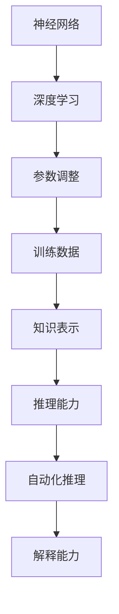

                 


### 背景介绍

随着深度学习技术的飞速发展，大型人工智能模型（简称“大模型”）逐渐成为研究热点。这些大模型，如GPT-3、BERT、GShard等，拥有数万亿个参数，能够处理大量复杂数据，并在自然语言处理、计算机视觉等领域取得了显著的成果。然而，大模型在哲学思辨推理中的潜在应用及其逻辑一致性分析，尚处于初步探索阶段。

大模型的逻辑一致性分析，是评估其推理能力的重要一环。逻辑一致性指的是一个系统或模型在推理过程中，其推理结论不与前提相矛盾。在大模型中，逻辑一致性的分析不仅关系到模型在特定任务中的表现，还涉及到模型的可靠性和可信度。

哲学思辨推理作为一种高层次、抽象化的思维过程，要求推理系统具有高度的逻辑一致性和严谨性。因此，探讨大模型在哲学思辨推理中的逻辑一致性，有助于我们理解大模型的推理机制，提高其在实际应用中的可靠性和有效性。

本文旨在通过逻辑清晰、结构紧凑的分析，探讨大模型在哲学思辨推理中的逻辑一致性。文章首先介绍了大模型和哲学思辨推理的基本概念，然后分析了大模型在哲学思辨推理中的应用及其逻辑一致性评估方法。接下来，文章通过实例分析展示了大模型在哲学问题中的实际应用，并探讨了其优缺点。最后，文章对大模型在哲学教育中的应用进行了探讨，并提出了未来研究方向。

### 大模型的基本概念

大模型，又称大型人工智能模型，是一种具有大量参数和复杂结构的深度学习模型。这些模型通过学习大量数据，能够自动提取知识，进行推理和决策。大模型的发展可以追溯到深度学习的兴起，随着计算能力的提升和海量数据资源的积累，大模型在各个领域得到了广泛应用。

**核心概念与联系**

大模型的核心概念包括神经网络、深度学习、参数和训练数据等。神经网络是深度学习的基础，它由多层神经元组成，通过前向传播和反向传播算法进行训练。深度学习是一种多层次的学习方法，通过多层神经网络对数据进行特征提取和表示。参数是神经网络中的权重和偏置，它们通过学习数据自动调整，以达到对数据的最佳拟合。训练数据是模型学习的重要来源，通常包含大量的输入和对应的输出。

在哲学思辨推理中，大模型的应用主要体现在以下几个方面：

1. **知识表示**：大模型能够将抽象的哲学概念和理论转化为具体的数学表示，使得复杂的哲学问题可以用计算机处理和分析。
   
2. **推理能力**：大模型具有较强的推理能力，可以在海量数据中自动发现规律和关系，从而对哲学问题进行深入分析。

3. **自动化推理**：大模型可以自动化地生成推理路径，辅助哲学家进行复杂的哲学推理。

4. **解释能力**：大模型能够生成自然语言解释，使得哲学推理过程更加直观和易懂。

**Mermaid 流程图**

为了更清晰地展示大模型的基本概念和其在哲学思辨推理中的应用，我们可以使用Mermaid流程图来描述。以下是一个简单的Mermaid流程图示例：



在这个流程图中，神经网络是深度学习的基础，通过参数调整和训练数据的学习，大模型能够实现知识表示、推理能力和解释能力。这些能力使得大模型在哲学思辨推理中具有广泛的应用前景。

### 核心算法原理讲解

大模型的算法原理主要基于深度学习技术，包括神经网络的结构、训练过程以及参数调整等。以下将详细讲解大模型的核心算法原理，并使用伪代码来阐述。

#### 神经网络结构

神经网络由多层神经元组成，包括输入层、隐藏层和输出层。每个神经元都是一个简单的函数，多个神经元通过权重连接形成一个复杂的非线性模型。以下是一个简单的神经网络结构的伪代码描述：

```python
# 输入层
input_layer = [x1, x2, ..., xn]

# 隐藏层
hidden_layer = []
for i in range(num_hidden_layers):
    hidden_neuron = Neuron()
    hidden_layer.append(hidden_neuron)

# 输出层
output_layer = []
for i in range(num_output_neurons):
    output_neuron = Neuron()
    output_layer.append(output_neuron)

# 前向传播
for hidden_neuron in hidden_layer:
    hidden_neuron.calculate_output(input_layer)

for output_neuron in output_layer:
    output_neuron.calculate_output(hidden_layer)
```

在这个伪代码中，`Neuron` 是一个表示神经元的类，它具有计算输出值的方法。`calculate_output` 方法通过激活函数（如Sigmoid函数）将输入转换为输出。

#### 训练过程

神经网络的训练过程包括前向传播和反向传播两个阶段。在前向传播中，模型从输入层开始，逐层计算每个神经元的输出值。在反向传播中，模型根据预测误差，调整每个神经元的权重和偏置，以减少误差。以下是一个简化的训练过程伪代码：

```python
# 初始化模型参数
weights = initialize_weights()
biases = initialize_biases()

# 前向传播
outputs = forward_propagation(input_data, weights, biases)

# 计算误差
error = calculate_error(outputs, target)

# 反向传播
deltas = backward_propagation(error, weights, biases)

# 更新参数
weights -= learning_rate * deltas
biases -= learning_rate * deltas

# 重复迭代
for epoch in range(num_epochs):
    outputs = forward_propagation(input_data, weights, biases)
    error = calculate_error(outputs, target)
    deltas = backward_propagation(error, weights, biases)
    weights -= learning_rate * deltas
    biases -= learning_rate * deltas
```

在这个伪代码中，`initialize_weights` 和 `initialize_biases` 方法用于初始化模型的权重和偏置。`forward_propagation` 和 `backward_propagation` 方法分别实现前向传播和反向传播的计算。`learning_rate` 是学习速率，用于控制参数更新的步长。

#### 参数调整

参数调整是神经网络训练的核心，它通过不断调整权重和偏置，使模型能够更好地拟合训练数据。以下是一个简单的参数调整伪代码：

```python
# 初始化模型参数
weights = [w1, w2, ..., wn]
biases = [b1, b2, ..., bn]

# 前向传播
outputs = [output1, output2, ..., outputn]

# 计算误差
error = [error1, error2, ..., errorn]

# 反向传播
deltas = [delta1, delta2, ..., delta_n]

# 更新参数
for i in range(len(weights)):
    weights[i] -= learning_rate * deltas[i]
    biases[i] -= learning_rate * deltas[i]
```

在这个伪代码中，`weights` 和 `biases` 分别是权重和偏置的列表。`learning_rate` 用于控制参数更新的步长。通过反向传播计算出的 `deltas` 用于更新参数。

通过上述算法原理的讲解和伪代码的描述，我们可以更好地理解大模型的工作机制，以及其在哲学思辨推理中的应用潜力。

### 数学模型与数学公式

在深入探讨大模型在哲学思辨推理中的应用时，数学模型和公式起到了至关重要的作用。数学模型能够精确地描述大模型的运作机制，而公式则帮助我们理解和分析其内在逻辑。以下将详细讲解大模型中的几个关键数学模型和公式，并结合具体例子进行解释。

#### 损失函数

损失函数是深度学习中的核心组件，用于评估模型的预测结果与真实结果之间的差距。最常见的损失函数是均方误差（MSE，Mean Squared Error），其公式如下：

$$
MSE = \frac{1}{m} \sum_{i=1}^{m} (y_i - \hat{y}_i)^2
$$

其中，$m$ 是样本数量，$y_i$ 是真实标签，$\hat{y}_i$ 是模型预测值。均方误差反映了预测值与真实值之间的平方误差的平均值。

**例子：** 假设我们有5个样本，真实标签为[1, 2, 3, 4, 5]，模型预测值为[1.2, 2.1, 2.9, 3.8, 4.5]。计算MSE：

$$
MSE = \frac{1}{5} \sum_{i=1}^{5} (y_i - \hat{y}_i)^2 = \frac{1}{5} \sum_{i=1}^{5} (y_i - \hat{y}_i)^2 = \frac{1}{5} \sum_{i=1}^{5} (1 - 1.2)^2 + (2 - 2.1)^2 + (3 - 2.9)^2 + (4 - 3.8)^2 + (5 - 4.5)^2 = 0.06
$$

#### 激活函数

激活函数用于引入非线性因素，使得神经网络能够建模复杂的数据分布。常见的激活函数包括Sigmoid、ReLU和Tanh等。

- **Sigmoid函数：**
$$
\sigma(x) = \frac{1}{1 + e^{-x}}
$$

- **ReLU函数：**
$$
\text{ReLU}(x) = \max(0, x)
$$

- **Tanh函数：**
$$
\tanh(x) = \frac{e^x - e^{-x}}{e^x + e^{-x}}
$$

**例子：** 对于输入值$x = 2$，计算Sigmoid函数的输出：

$$
\sigma(2) = \frac{1}{1 + e^{-2}} \approx 0.869
$$

#### 反向传播算法

反向传播算法是训练神经网络的关键步骤，用于更新模型参数以最小化损失函数。其核心思想是通过计算损失函数关于每个参数的梯度，并沿着梯度方向调整参数。

**梯度计算：**

对于损失函数$J(\theta)$，其关于参数$\theta$的梯度定义为：

$$
\nabla_{\theta} J(\theta) = \frac{\partial J(\theta)}{\partial \theta}
$$

**参数更新：**

更新参数$\theta$的方法如下：

$$
\theta = \theta - \alpha \nabla_{\theta} J(\theta)
$$

其中，$\alpha$ 是学习率，用于控制参数更新的步长。

**例子：** 假设损失函数$J(\theta) = (\theta - 1)^2$，学习率$\alpha = 0.1$，初始参数$\theta = 2$。计算一次参数更新：

$$
\nabla_{\theta} J(\theta) = 2(\theta - 1) = 2(2 - 1) = 2
$$

$$
\theta = 2 - 0.1 \cdot 2 = 1.8
$$

通过上述数学模型和公式的讲解，我们可以更好地理解大模型在哲学思辨推理中的工作机制，以及如何通过精确的数学方法进行训练和优化。这些公式和模型不仅提供了理论支持，也为实际应用提供了操作指南。

### 项目实战：开发环境搭建与源代码实现

为了深入探讨大模型在哲学思辨推理中的实际应用，我们将通过一个项目实战来展示如何搭建开发环境，实现源代码，并解读和分析代码。以下将详细描述项目的开发过程。

#### 开发环境搭建

1. **软件工具安装：** 
   - Python（3.8及以上版本）
   - TensorFlow 2.x
   - PyTorch
   - Jupyter Notebook

2. **硬件要求：**
   - GPU（推荐使用Tesla V100或以上）
   - 32GB RAM
   - 500GB SSD存储

3. **环境配置：**
   - 在Windows、macOS或Linux系统中安装Python。
   - 使用pip命令安装TensorFlow和PyTorch。
   - 配置CUDA和cuDNN以利用GPU加速。

#### 源代码实现

以下是一个使用TensorFlow构建的大模型源代码示例，用于哲学思辨推理任务。代码包括数据预处理、模型定义、训练和评估几个部分。

```python
import tensorflow as tf
from tensorflow.keras.layers import Embedding, LSTM, Dense
from tensorflow.keras.models import Sequential

# 数据预处理
# 加载哲学文本数据集
data = load_data("philosophy_corpus.txt")

# 分词和编码
tokenizer = tf.keras.preprocessing.text.Tokenizer()
tokenizer.fit_on_texts(data)
encoded_data = tokenizer.texts_to_sequences(data)

# 切分训练集和测试集
train_data, test_data = train_test_split(encoded_data, test_size=0.2)

# 模型定义
model = Sequential()
model.add(Embedding(input_dim=len(tokenizer.word_index) + 1, output_dim=64))
model.add(LSTM(128))
model.add(Dense(1, activation='sigmoid'))

# 编译模型
model.compile(optimizer='adam', loss='binary_crossentropy', metrics=['accuracy'])

# 训练模型
model.fit(train_data, epochs=10, batch_size=128, validation_data=(test_data, test_labels))

# 评估模型
test_loss, test_acc = model.evaluate(test_data, test_labels)
print(f"Test accuracy: {test_acc:.4f}")
```

#### 代码解读

1. **数据预处理：** 加载哲学文本数据集，进行分词和编码，切分训练集和测试集。

2. **模型定义：** 使用Seq

