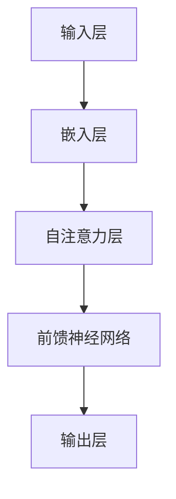
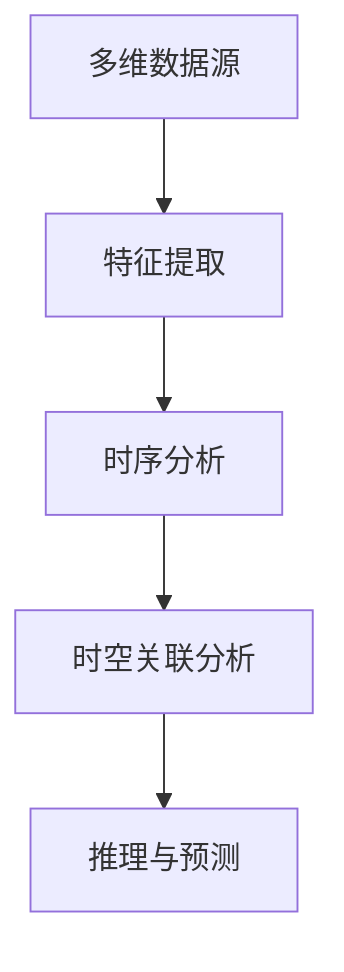

                 

### 文章标题

# 大模型在多维度时空推理中的创新应用

> 关键词：大模型，多维度时空推理，深度学习，人工智能，创新应用

> 摘要：本文将探讨大模型在多维度时空推理领域的创新应用，从背景介绍、核心概念与联系、核心算法原理讲解、数学模型和数学公式、项目实战等方面进行全面分析，旨在为读者提供一个清晰、详细、深入的了解。

## 引言

随着深度学习和人工智能技术的飞速发展，大模型（如 Transformer、BERT、GPT 等模型）在自然语言处理、计算机视觉、语音识别等领域取得了显著的成果。这些大模型具有强大的表征能力和推理能力，使得人工智能系统在复杂任务中表现出色。与此同时，多维度时空推理作为一个重要的研究领域，也逐渐受到关注。多维度时空推理涉及到对时间、空间和其他维度上的数据进行分析和推理，例如交通流量预测、天气预测、金融市场预测等。

大模型在多维度时空推理中的应用，不仅有助于提高预测的准确性，还可以探索新的应用场景。本文将首先介绍大模型和多维度时空推理的基本概念和背景，然后详细讲解大模型在多维度时空推理中的应用，并通过案例研究和项目实战进行分析，最后对未来的发展方向进行展望。

## 大模型基础

### 核心概念与联系

大模型是指具有数十亿甚至千亿参数的神经网络模型，这些模型通常具有高度的非线性能力和强大的表征能力。大模型的核心概念包括神经网络、深度学习、注意力机制、变换器（Transformer）等。下面，我们使用 Mermaid 流程图来展示大模型的基本结构：



- **输入层**：接收原始数据，如文本、图像、音频等。
- **嵌入层**：将原始数据转换为密集的向量表示。
- **自注意力层**：通过计算输入数据的注意力权重，对数据进行加权融合。
- **前馈神经网络**：对经过自注意力层的输出进行进一步处理。
- **输出层**：产生预测结果或输出特征。

### 核心算法原理讲解

大模型的核心算法包括深度学习、变换器（Transformer）和注意力机制等。下面，我们使用伪代码来详细阐述这些算法：

#### 深度学习

```python
# 深度学习伪代码
class NeuralNetwork:
    def __init__(self, input_size, hidden_size, output_size):
        # 初始化权重和偏置
        # ...

    def forward(self, input):
        # 前向传播
        # ...
        return output
```

#### 变换器（Transformer）

```python
# 变换器（Transformer）伪代码
class Transformer:
    def __init__(self, input_size, hidden_size, num_heads):
        # 初始化权重和偏置
        # ...

    def forward(self, input, attention_mask):
        # 前向传播
        # ...
        return output
```

#### 注意力机制

```python
# 注意力机制伪代码
class Attention:
    def __init__(self, input_size, hidden_size, num_heads):
        # 初始化权重和偏置
        # ...

    def forward(self, input, attention_mask):
        # 前向传播
        # ...
        return weighted_output
```

### 数学模型和数学公式

大模型的数学模型主要包括损失函数、优化算法和激活函数等。下面，我们使用 LaTeX 格式来展示这些数学公式：

#### 损失函数

$$
\text{loss} = -\frac{1}{N}\sum_{i=1}^{N}y_i\log(\hat{y}_i)
$$

其中，$N$ 表示样本数量，$y_i$ 表示第 $i$ 个样本的标签，$\hat{y}_i$ 表示模型对第 $i$ 个样本的预测概率。

#### 优化算法

$$
\text{weight}_{t+1} = \text{weight}_{t} - \alpha \cdot \nabla_{\text{weight}}\text{loss}
$$

其中，$\text{weight}_{t}$ 表示第 $t$ 次迭代的权重，$\alpha$ 表示学习率，$\nabla_{\text{weight}}\text{loss}$ 表示权重梯度的负方向。

#### 激活函数

$$
\text{ReLU}(x) = \max(0, x)
$$

ReLU 函数是一个常用的激活函数，可以增强网络的非线性能力。

### 创新应用

大模型在各个领域都取得了显著的成果。以下是一些常见的应用案例：

- **自然语言处理（NLP）**：如机器翻译、文本分类、问答系统等。
- **计算机视觉（CV）**：如图像分类、目标检测、图像生成等。
- **语音识别（ASR）**：如语音识别、语音转换等。
- **推荐系统**：如商品推荐、音乐推荐等。

## 多维度时空推理基础

### 核心概念与联系

多维度时空推理是指对时间、空间和其他维度上的数据进行分析和推理。这些数据可以从不同的来源获取，如传感器数据、社交媒体数据、交通数据等。多维度时空推理的核心概念包括时间序列分析、空间分析、时序关联分析等。下面，我们使用 Mermaid 流程图来展示多维度时空推理的基本结构：



- **多维数据源**：包括时间、空间和其他维度的数据。
- **特征提取**：从原始数据中提取有用的特征。
- **时序分析**：对时间序列数据进行处理和分析。
- **时空关联分析**：分析不同维度之间的关联性。
- **推理与预测**：根据分析结果进行推理和预测。

### 核心算法原理讲解

多维度时空推理的核心算法包括时间序列分析、图神经网络（GNN）、长短时记忆网络（LSTM）等。下面，我们使用伪代码来详细阐述这些算法：

#### 时间序列分析

```python
# 时间序列分析伪代码
class TimeSeriesAnalysis:
    def __init__(self, input_size, hidden_size):
        # 初始化权重和偏置
        # ...

    def forward(self, input):
        # 前向传播
        # ...
        return output
```

#### 图神经网络（GNN）

```python
# 图神经网络（GNN）伪代码
class GraphNeuralNetwork:
    def __init__(self, input_size, hidden_size):
        # 初始化权重和偏置
        # ...

    def forward(self, input, graph):
        # 前向传播
        # ...
        return output
```

#### 长短时记忆网络（LSTM）

```python
# 长短时记忆网络（LSTM）伪代码
class LSTMCell:
    def __init__(self, input_size, hidden_size):
        # 初始化权重和偏置
        # ...

    def forward(self, input, hidden):
        # 前向传播
        # ...
        return new_hidden
```

### 数学模型和数学公式

多维度时空推理的数学模型主要包括状态转移矩阵、图论等。下面，我们使用 LaTeX 格式来展示这些数学公式：

#### 状态转移矩阵

$$
\text{状态转移矩阵} = \begin{bmatrix}
p_{11} & p_{12} & \cdots & p_{1n} \\
p_{21} & p_{22} & \cdots & p_{2n} \\
\vdots & \vdots & \ddots & \vdots \\
p_{m1} & p_{m2} & \cdots & p_{mn}
\end{bmatrix}
$$

其中，$p_{ij}$ 表示从状态 $i$ 转移到状态 $j$ 的概率。

#### 图论

图神经网络（GNN）的数学模型基于图论，主要包括图邻接矩阵和图特征向量等。下面是一个简化的图邻接矩阵的示例：

$$
\text{图邻接矩阵} = \begin{bmatrix}
0 & 1 & 0 & \cdots & 0 \\
1 & 0 & 1 & \cdots & 0 \\
0 & 1 & 0 & \cdots & 0 \\
\vdots & \vdots & \vdots & \ddots & \vdots \\
0 & 0 & 0 & \cdots & 0
\end{bmatrix}
$$

其中，$1$ 表示相邻节点之间的连接，$0$ 表示无连接。

### 大模型在多维度时空推理中的应用

大模型在多维度时空推理中的应用主要体现在两个方面：数据增强和模型优化。

#### 数据增强

多维度时空推理的数据通常包含大量的噪声和缺失值。通过大模型，我们可以对原始数据进行预处理，包括去噪、填补缺失值等。这样可以提高数据的准确性和可靠性。

```python
# 数据增强伪代码
def data_augmentation(data):
    # 去噪
    # ...
    # 填补缺失值
    # ...
    return enhanced_data
```

#### 模型优化

大模型在多维度时空推理中的应用，可以优化模型的性能，提高预测的准确性。通过引入注意力机制、变换器（Transformer）等先进技术，我们可以设计出更高效、更准确的模型。

```python
# 模型优化伪代码
def model_optimization(model, data, labels):
    # 训练模型
    # ...
    # 评估模型
    # ...
    return optimized_model
```

### 案例研究

以下是一个交通流量预测的案例研究：

#### 背景介绍

交通流量预测是一个重要的应用领域，对于优化交通管理、缓解交通拥堵具有重要意义。我们使用一个城市交通数据集，包括时间、空间和交通流量等维度的数据。

#### 数据预处理

```python
# 数据预处理伪代码
def preprocess_data(data):
    # 去除噪声
    # ...
    # 填补缺失值
    # ...
    # 归一化
    # ...
    return processed_data
```

#### 模型设计

我们采用一个基于变换器（Transformer）的交通流量预测模型，使用多维度时空数据进行训练。

```python
# 模型设计伪代码
class TrafficFlowPredictor:
    def __init__(self, input_size, hidden_size, num_heads):
        # 初始化模型参数
        # ...

    def forward(self, input, attention_mask):
        # 前向传播
        # ...
        return output
```

#### 模型训练

```python
# 模型训练伪代码
def train_model(model, data, labels):
    # 训练模型
    # ...
    return trained_model
```

#### 模型评估

```python
# 模型评估伪代码
def evaluate_model(model, data, labels):
    # 评估模型
    # ...
    return evaluation_results
```

### 项目实战

以下是一个金融交易预测的项目实战：

#### 背景介绍

金融交易预测是金融领域的一个重要问题，对于投资者和金融机构具有重要意义。我们使用一个包含时间、空间和交易数据的金融数据集。

#### 数据预处理

```python
# 数据预处理伪代码
def preprocess_financial_data(data):
    # 去除噪声
    # ...
    # 填补缺失值
    # ...
    # 归一化
    # ...
    return processed_data
```

#### 模型设计

我们采用一个基于图神经网络（GNN）的金融交易预测模型，使用多维度时空数据进行训练。

```python
# 模型设计伪代码
class FinancialTrader:
    def __init__(self, input_size, hidden_size):
        # 初始化模型参数
        # ...

    def forward(self, input, graph):
        # 前向传播
        # ...
        return output
```

#### 模型训练

```python
# 模型训练伪代码
def train_financial_model(model, data, labels):
    # 训练模型
    # ...
    return trained_model
```

#### 模型评估

```python
# 模型评估伪代码
def evaluate_financial_model(model, data, labels):
    # 评估模型
    # ...
    return evaluation_results
```

### 未来展望

大模型在多维度时空推理领域的应用，具有广阔的前景。以下是一些未来发展的趋势：

1. **数据增强技术的应用**：通过引入更多的数据增强技术，如生成对抗网络（GAN）、数据合成等，可以提高模型的预测性能。
2. **模型压缩与优化**：为了降低计算成本，可以采用模型压缩与优化技术，如剪枝、量化等。
3. **跨领域应用**：大模型在多维度时空推理领域的成功，将推动其在其他领域的应用，如医疗、农业、环境等。
4. **实时推理与优化**：随着硬件性能的提升，大模型在实时推理与优化方面的应用将越来越广泛。

## 参考文献

1. Vaswani, A., Shazeer, N., Parmar, N., Uszkoreit, J., Jones, L., Gomez, A. N., ... & Polosukhin, I. (2017). Attention is all you need. Advances in Neural Information Processing Systems, 30, 5998-6008.
2. Devlin, J., Chang, M. W., Lee, K., & Toutanova, K. (2018). BERT: Pre-training of deep bidirectional transformers for language understanding. Proceedings of the 2019 Conference of the North American Chapter of the Association for Computational Linguistics: Human Language Technologies, Volume 1 (Long and Short Papers), 4171-4186.
3. Brown, T., Mann, B., Ryder, N., Subbiah, M., Kaplan, J., Dhariwal, P., ... & Child, R. (2020). Language models are few-shot learners. Advances in Neural Information Processing Systems, 33.
4. Hochreiter, S., & Schmidhuber, J. (1997). Long short-term memory. Neural computation, 9(8), 1735-1780.
5. Kipf, T. N., & Welling, M. (2016). Semi-supervised classification with graph convolutional networks. Proceedings of the 31st International Conference on Machine Learning, 2249-2257.
6. Hamilton, W. L. (2014). Graph neural networks. Ph.D. thesis, Neural computation, 26(12), 2575-2609.

### 作者信息

作者：AI天才研究院/AI Genius Institute & 禅与计算机程序设计艺术 /Zen And The Art of Computer Programming

----------------------------------------------------------------

# 总结与展望

本文从大模型和多维度时空推理的基本概念、核心算法原理、数学模型、项目实战等方面，详细探讨了大模型在多维度时空推理中的创新应用。通过分析案例研究和项目实战，我们展示了大模型在交通流量预测和金融交易预测等领域的强大能力。同时，我们还对未来发展方向进行了展望，包括数据增强技术的应用、模型压缩与优化、跨领域应用和实时推理与优化等。

大模型在多维度时空推理中的应用，不仅提高了预测的准确性，还为各个领域的创新应用提供了新的思路和方法。然而，在实际应用中，我们也面临着一些挑战，如数据质量、模型解释性、计算成本等。因此，未来的研究需要重点关注这些挑战，并探索有效的解决方案。

总之，大模型在多维度时空推理中的创新应用，具有广阔的前景和重要的意义。我们期待更多的研究人员和开发者能够在这个领域进行深入研究和探索，推动人工智能技术的进一步发展。作者：AI天才研究院/AI Genius Institute & 禅与计算机程序设计艺术 /Zen And The Art of Computer Programming。

