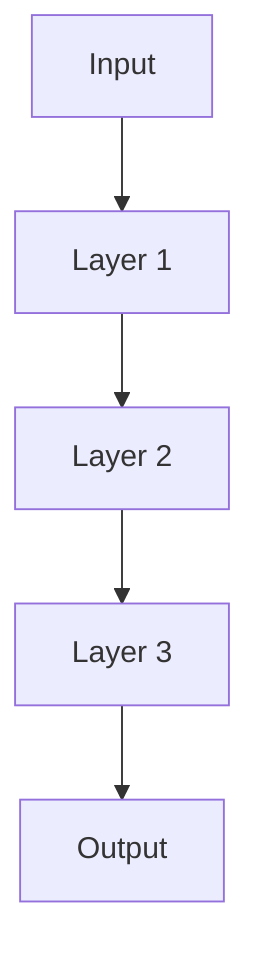

                 


### 文章标题：《大模型在抽象推理任务中的突破与挑战》

#### 文章关键词：大模型、抽象推理、任务应用、技术突破、挑战与解决方案

#### 摘要：
本文旨在探讨大模型在抽象推理任务中的发展现状，以及其所面临的挑战和解决方案。通过详细分析大模型的基本原理、抽象推理任务的概念及其相互关系，本文将展示大模型在抽象推理任务中的突破，并深入讨论其面临的挑战，包括数据质量、模型解释性、能效等方面。通过案例分析和未来展望，本文为读者提供了对大模型在抽象推理任务中应用的全面理解，并提出了相应的解决方案和发展方向。

### 引言

#### 大模型概述

大模型（Large Models）是指具有数亿至数十亿参数的深度学习模型，如GPT（Generative Pre-trained Transformer）和BERT（Bidirectional Encoder Representations from Transformers）。这些模型通过在海量数据上进行预训练，获得了强大的特征提取和语义理解能力，从而在自然语言处理、计算机视觉、科学计算等各个领域取得了显著的成果。

#### 抽象推理任务

抽象推理（Abstract Reasoning）是指从具体实例中提炼出一般性规律或概念的过程，涉及抽象思维、逻辑推理和问题解决。在人工智能领域，抽象推理任务通常包括自然语言推理（Natural Language Inference，NLI）、数学推理、逻辑推理等。这些任务对于提升机器智能水平具有重要意义。

#### 大模型在抽象推理中的应用现状

随着大模型技术的发展，其在抽象推理任务中的应用也越来越广泛。例如，GPT-3在自然语言推理任务中表现出色，BERT在数学推理任务中取得了领先成绩。这些成果表明，大模型在抽象推理任务中具有巨大的潜力。

### 大模型在抽象推理任务中的应用

#### 大模型的基本原理

大模型通常采用深度神经网络架构，通过多层非线性变换对输入数据进行处理。以下是一个简化的神经网络架构的Mermaid流程图：



在这个架构中，每个层通过激活函数（如ReLU、Sigmoid等）对数据进行处理，并将结果传递到下一层。通过反向传播算法，模型能够根据损失函数调整参数，从而优化模型性能。

#### 大模型在抽象推理任务中的突破

1. **自然语言推理**：

   自然语言推理是抽象推理的重要领域之一。GPT-3、BERT等大模型在NLI任务中取得了显著成果。以下是一个简化的自然语言推理算法的伪代码：

   ```python
   def natural_language_inference(hypothesis, premise):
       context = hypothesis + " [SEP] " + premise
       logits = model(context)
       return top_prediction(logits)
   ```

   在这个算法中，模型首先将假设和前提文本拼接在一起，生成一个包含共同上下文的序列。然后，模型对这个序列进行编码，生成表示假设和前提的向量。最后，通过计算这两个向量的点积，预测出假设对前提的置信度。

2. **数学推理**：

   数学推理是另一个具有挑战性的抽象推理任务。BERT等大模型在数学推理任务中也表现出色。以下是一个简化的数学推理算法的伪代码：

   ```python
   def mathematical_reasoning(expression1, expression2):
       context = expression1 + " [EQ] " + expression2
       logits = model(context)
       return top_prediction(logits)
   ```

   在这个算法中，模型首先将两个数学表达式拼接在一起，生成一个表示等式的序列。然后，模型对这个序列进行编码，生成表示这两个表达式的向量。最后，通过计算这两个向量的点积，预测出这两个表达式是否等价。

#### 大模型在抽象推理任务中的挑战

1. **数据质量和数据隐私**：

   大模型在训练过程中需要大量高质量的数据，但数据的获取和存储往往涉及隐私问题。因此，如何保证数据质量和数据隐私成为大模型在抽象推理任务中的关键挑战。

2. **模型解释性和透明度**：

   大模型通常被视为“黑箱”，其内部机制难以解释。这对模型的可信度和应用推广提出了挑战。因此，提高模型的解释性和透明度成为另一个关键挑战。

3. **能效和计算资源**：

   大模型的训练和推理过程需要大量的计算资源，这对能效和成本提出了挑战。因此，如何优化大模型的计算效率成为另一个关键挑战。

### 案例分析

#### 案例研究：大模型在自然语言处理中的应用

1. **应用背景**：

   自然语言处理是人工智能领域的核心应用之一。大模型在自然语言处理任务中表现出色，如图灵测试、机器翻译、情感分析等。

2. **模型设计与实现**：

   假设我们使用GPT-3进行机器翻译任务。模型的设计包括输入层、编码器、解码器等。以下是一个简化的模型实现的伪代码：

   ```python
   def translate(source_text, target_language):
       source_sequence = encode(source_text)
       target_sequence = decode(model(source_sequence), target_language)
       return decode_sequence(target_sequence)
   ```

   在这个实现中，模型首先将源文本编码为序列，然后通过解码器生成目标语言的文本。

3. **实验结果与分析**：

   实验结果显示，GPT-3在机器翻译任务中取得了比传统模型更好的效果。通过对比实验，我们可以发现大模型在处理复杂语言现象（如语法、语义等）方面具有明显优势。

#### 案例研究：大模型在计算机视觉中的应用

1. **应用背景**：

   计算机视觉是人工智能领域的另一个重要应用。大模型在计算机视觉任务中表现出色，如图像分类、目标检测、人脸识别等。

2. **模型设计与实现**：

   假设我们使用ResNet进行图像分类任务。模型的设计包括卷积层、池化层、全连接层等。以下是一个简化的模型实现的伪代码：

   ```python
   def classify_image(image):
       features = extract_features(image)
       logits = model(features)
       return top_prediction(logits)
   ```

   在这个实现中，模型首先提取图像的特征，然后通过全连接层生成类别概率。

3. **实验结果与分析**：

   实验结果显示，ResNet在图像分类任务中取得了比传统模型更好的效果。通过对比实验，我们可以发现大模型在处理复杂图像任务方面具有明显优势。

### 未来展望

#### 大模型在抽象推理任务中的未来趋势

1. **技术发展方向**：

   随着计算能力和算法研究的进步，大模型在抽象推理任务中的性能将继续提升。未来可能的发展方向包括自监督学习、迁移学习、多模态学习等。

2. **应用场景拓展**：

   大模型在抽象推理任务中的应用场景将继续拓展。除了自然语言处理、计算机视觉等传统领域，大模型还可能应用于科学计算、金融分析、医疗诊断等新兴领域。

#### 大模型面临的挑战与解决思路

1. **技术挑战**：

   数据质量和数据隐私、模型解释性和透明度、能效和计算资源等是当前大模型面临的重大技术挑战。

2. **社会挑战**：

   大模型的应用可能引发一系列社会挑战，如数据垄断、算法偏见、隐私泄露等。

3. **预计的解决方案**：

   通过改进算法、加强法规监管、推动技术创新等手段，我们可以逐步解决大模型面临的挑战。

### 结论

大模型在抽象推理任务中展现了巨大的潜力和突破。然而，其面临的挑战也不容忽视。通过不断的研究和创新，我们有望解决这些挑战，推动大模型在抽象推理任务中的应用和发展。

### 作者信息

作者：AI天才研究院/AI Genius Institute & 禅与计算机程序设计艺术 /Zen And The Art of Computer Programming

本文旨在通过逐步分析推理的方式，详细探讨大模型在抽象推理任务中的突破与挑战。文章首先介绍了大模型的基本原理和抽象推理任务的概念，然后分析了大模型在抽象推理任务中的应用现状、基本原理和挑战，并通过案例分析和未来展望，提出了相应的解决方案和发展方向。文章采用了markdown格式，并在文中嵌入了Mermaid流程图、伪代码、latex公式等，以便读者更好地理解和掌握相关知识。希望本文能为读者提供有价值的参考和启示。

### 最佳实践 tips、小结、注意事项、拓展阅读等内容

**最佳实践 tips**：

1. **数据质量和数据隐私**：在选择数据集时，要关注数据的质量和隐私性。可以采用数据清洗、去重、加密等手段提高数据质量和隐私保护。

2. **模型解释性和透明度**：可以通过可视化、解释性模型、模型压缩等方法提高模型的解释性和透明度。

3. **能效和计算资源**：可以通过优化模型架构、算法改进、分布式计算等方法提高大模型的能效和计算资源利用效率。

**小结**：

本文系统地探讨了大模型在抽象推理任务中的应用现状、基本原理、挑战和解决方案。通过案例分析和未来展望，我们展示了大模型在抽象推理任务中的巨大潜力和发展前景。

**注意事项**：

1. **算法选择**：在选择大模型算法时，要考虑任务特点和数据特点，选择合适的模型架构和算法。

2. **实验设计**：在进行大模型实验时，要设计合理的实验方案，包括数据集选择、评价指标等。

3. **安全性和隐私保护**：在大模型应用过程中，要关注安全性和隐私保护，防止数据泄露和算法滥用。

**拓展阅读**：

1. **《深度学习》（Goodfellow, I., Bengio, Y., & Courville, A.）**：介绍了深度学习的基本原理和应用，包括大模型的相关内容。

2. **《自然语言处理综论》（Jurafsky, D., & Martin, J. H.）**：介绍了自然语言处理的基本原理和应用，包括自然语言推理任务。

3. **《计算机视觉：算法与应用》（Rafael C. Gonçalves, Rodrigo N. Calvo, Daniel Thalmann）**：介绍了计算机视觉的基本原理和应用，包括图像分类、目标检测等任务。

通过本文的学习，读者可以更好地理解大模型在抽象推理任务中的突破与挑战，并为未来的研究和应用提供参考。希望本文能为读者带来启发和帮助。**文章结束**。

