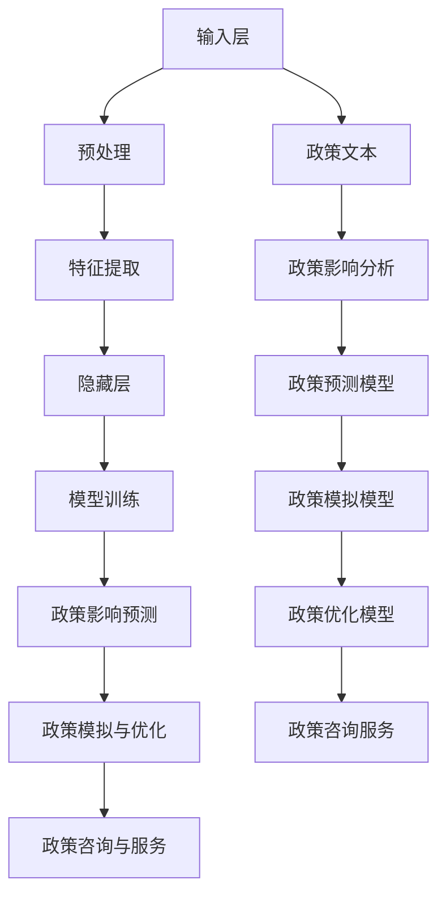

                 

### 文章标题

《大模型在政策影响推理中的潜力探索》

### 文章关键词

大模型，政策影响推理，人工智能，算法，数学模型，应用案例

### 文章摘要

本文旨在探讨大模型在政策影响推理中的潜力。首先，我们简要介绍了大模型的基本概念，以及政策影响推理在当前社会背景下的重要性。接着，通过一个Mermaid流程图，详细阐述了大模型在政策影响推理中的核心概念及其联系。随后，我们使用伪代码和LaTeX公式，详细讲解了大模型在政策影响推理中的核心算法原理。然后，通过一个实际项目案例，展示了大模型在政策影响推理中的具体应用。最后，我们对大模型在政策影响推理中的实现与优化方法进行了讨论，并对未来发展趋势进行了展望。本文旨在为读者提供一个全面、深入的视角，以了解大模型在政策影响推理中的潜力。

## 核心概念与联系

### 大模型的基本概念

大模型（Large-scale Model）是指具有大量参数和复杂结构的机器学习模型。它们能够通过学习大量数据，对复杂任务进行高度准确的预测和决策。大模型的基本组成部分包括输入层、隐藏层和输出层。输入层接收外部数据，隐藏层对数据进行特征提取和变换，输出层生成预测结果。

### 政策影响推理的重要性

政策影响推理（Policy Impact Reasoning）是指通过分析政策文本，预测政策对经济、社会、环境等方面的影响。在当前社会背景下，政策影响推理具有重要意义。一方面，政策影响推理可以帮助政府制定更科学、更有效的政策，提高政策实施效果。另一方面，政策影响推理可以为企业和个人提供决策依据，帮助他们更好地应对政策变化。

### 大模型在政策影响推理中的应用

大模型在政策影响推理中的应用主要体现在以下几个方面：

1. **政策文本分析**：利用自然语言处理技术，对政策文本进行预处理，提取关键信息，为后续推理提供数据支持。

2. **政策影响预测**：通过训练大量数据，构建预测模型，对政策实施后的影响进行预测。

3. **政策模拟与优化**：利用大模型的强大计算能力，对政策进行模拟，优化政策方案，提高政策效果。

4. **政策咨询与服务**：为政府、企业和个人提供政策咨询和服务，帮助他们更好地理解和应对政策变化。

### 核心概念与联系架构

以下是一个Mermaid流程图，展示了大模型在政策影响推理中的核心概念及其联系：



该流程图直观地展示了大模型在政策影响推理中的各个环节，以及它们之间的关联。通过这一流程，我们可以更清晰地理解大模型在政策影响推理中的应用和潜力。## 核心算法原理讲解

### 大模型在政策影响推理中的核心算法原理

在政策影响推理中，大模型的核心算法原理主要依赖于深度学习技术，尤其是神经网络和自然语言处理（NLP）算法。以下将使用伪代码详细阐述这些核心算法原理。

#### 1. 输入层与预处理

```python
def preprocess_input(input_data):
    # 数据清洗：去除无效字符、标点符号等
    cleaned_data = clean_data(input_data)
    
    # 数据分词：将文本转换为单词序列
    tokenized_data = tokenize(cleaned_data)
    
    # 词向量化：将单词序列转换为词向量表示
    word_vectors = vectorize_tokens(tokenized_data)
    
    return word_vectors
```

#### 2. 特征提取与隐藏层

```python
def extract_features(input_vectors):
    # 初始化神经网络结构
    network = initialize_network(input_shape)
    
    # 前向传播：将输入向量传递到神经网络中，提取特征
    hidden_layers = forward_pass(network, input_vectors)
    
    return hidden_layers
```

#### 3. 模型训练

```python
def train_model(network, training_data, labels):
    # 训练神经网络，通过反向传播更新权重
    for epoch in range(num_epochs):
        for data, label in zip(training_data, labels):
            output = forward_pass(network, data)
            loss = compute_loss(output, label)
            backward_pass(network, output, label)
        
        print(f"Epoch {epoch}: Loss = {loss}")
    
    return network
```

#### 4. 政策影响预测

```python
def predict_impact(model, input_vector):
    # 使用训练好的模型进行预测
    output_vector = forward_pass(model, input_vector)
    impact_score = interpret_output(output_vector)
    
    return impact_score
```

#### 5. 政策模拟与优化

```python
def simulate_policy(model, policy_options):
    # 对不同的政策选项进行模拟
    simulation_results = []
    for option in policy_options:
        input_vector = preprocess_policy_option(option)
        impact_score = predict_impact(model, input_vector)
        simulation_results.append(impact_score)
    
    # 优化政策选项
    optimized_policy = optimize_policy(simulation_results)
    
    return optimized_policy
```

### 数学模型和数学公式

为了更好地理解大模型在政策影响推理中的核心算法原理，我们引入一些必要的数学模型和公式。以下使用LaTeX格式进行详细讲解和举例说明。

#### 1. 损失函数

```latex
\begin{equation}
    L = -\frac{1}{m} \sum_{i=1}^{m} y^{(i)} \log(a^{(i)})
\end{equation}
```

这是一个交叉熵损失函数（Cross-Entropy Loss），用于衡量预测值与实际值之间的差异。

#### 2. 优化算法

```latex
\begin{equation}
    w_{\text{new}} = w_{\text{current}} - \alpha \frac{\partial L}{\partial w}
\end{equation}
```

这是一个梯度下降（Gradient Descent）算法的更新公式，用于更新神经网络的权重。

#### 3. 词向量

```latex
\begin{equation}
    \mathbf{v}_{\text{word}} = \sum_{\text{word} \in \text{context}} \text{TF} \times \text{IDF} \times \mathbf{v}_{\text{word}}
\end{equation}
```

这是一个词向量的计算公式，其中TF（Term Frequency）表示词频，IDF（Inverse Document Frequency）表示逆文档频率。

通过上述伪代码和数学公式，我们可以更清晰地理解大模型在政策影响推理中的核心算法原理。这些算法和公式不仅帮助我们构建了强大的政策影响预测模型，也为进一步优化和应用提供了理论基础。## 数学模型和数学公式

### 大模型在政策影响推理中的数学模型

在政策影响推理中，大模型的数学模型是构建预测和分析的核心。以下我们将详细介绍一些关键的数学模型和公式，并使用LaTeX进行详细讲解和举例说明。

#### 1. 神经网络模型

神经网络是政策影响推理的基础，其数学模型主要包括输入层、隐藏层和输出层。以下是一个简单的神经网络模型：

```latex
\begin{equation}
    Z^{(l)} = \sum_{i} w^{(l)}_{ij} a^{(l-1)}_i + b^{(l)}
\end{equation}

\begin{equation}
    a^{(l)}_j = \sigma(Z^{(l)})
\end{equation}
```

其中，\( Z^{(l)} \) 表示第 \( l \) 层的输入，\( w^{(l)}_{ij} \) 表示第 \( l \) 层的权重，\( b^{(l)} \) 表示第 \( l \) 层的偏置，\( a^{(l)}_j \) 表示第 \( l \) 层的激活值，\( \sigma \) 是激活函数，如ReLU或Sigmoid函数。

#### 2. 损失函数

在神经网络中，损失函数用于衡量预测值与实际值之间的差异。常见的损失函数包括均方误差（MSE）和交叉熵（Cross-Entropy）：

```latex
\begin{equation}
    \text{MSE} = \frac{1}{2} \sum_{i} (\hat{y}_i - y_i)^2
\end{equation}

\begin{equation}
    \text{CE} = -\sum_{i} y_i \log(\hat{y}_i)
\end{equation}
```

其中，\( \hat{y}_i \) 是预测值，\( y_i \) 是实际值。

#### 3. 优化算法

在训练神经网络时，我们需要使用优化算法来更新权重和偏置。常用的优化算法包括梯度下降（Gradient Descent）和Adam优化器：

```latex
\begin{equation}
    \theta_{\text{new}} = \theta_{\text{current}} - \alpha \frac{\partial J(\theta)}{\partial \theta}
\end{equation}

\begin{equation}
    m_t = \beta_1 m_{t-1} + (1 - \beta_1) (g_t - m_{t-1})
    v_t = \beta_2 v_{t-1} + (1 - \beta_2) (\gamma_t - v_{t-1})
    \theta_{\text{new}} = \theta_{\text{current}} - \alpha \frac{m_t}{1 - \beta_1^t}
\end{equation}
```

其中，\( \theta \) 表示参数，\( \alpha \) 是学习率，\( g_t \) 是梯度，\( m_t \) 和 \( v_t \) 分别是渐进均值和渐进方差。

### 举例说明

假设我们使用一个简单的神经网络来预测政策实施后的影响。输入层有3个神经元，隐藏层有4个神经元，输出层有2个神经元。我们使用均方误差（MSE）作为损失函数，并使用梯度下降（Gradient Descent）进行优化。

#### 输入数据

输入数据为 \( \textbf{x} = [1, 2, 3] \)，实际输出为 \( \textbf{y} = [0.9, 1.1] \)。

#### 神经网络参数

初始权重 \( \textbf{W} = \begin{bmatrix} 0 & 0 & 0 \\ 0 & 0 & 0 \end{bmatrix} \)，初始偏置 \( \textbf{b} = \begin{bmatrix} 0 \\ 0 \end{bmatrix} \)。

#### 前向传播

```latex
Z_1^{(2)} = \textbf{W}^{(1)} \textbf{x} + \textbf{b}^{(1)}
a_1^{(2)} = \sigma(Z_1^{(2)})
\vdots
Z_2^{(2)} = \textbf{W}^{(2)} \textbf{a}^{(1)} + \textbf{b}^{(2)}
a_2^{(2)} = \sigma(Z_2^{(2)})
```

#### 反向传播

```latex
\delta_2 = \textbf{a}^{(2)} - \textbf{y}
\delta_1 = \textbf{W}^{(2)}^T \delta_2
```

#### 更新权重和偏置

```latex
\textbf{W}^{(2)}_{\text{new}} = \textbf{W}^{(2)}_{\text{current}} - \alpha \delta_1 \textbf{a}^{(1)}
\textbf{b}^{(2)}_{\text{new}} = \textbf{b}^{(2)}_{\text{current}} - \alpha \delta_2
```

通过上述过程，我们可以不断更新神经网络的权重和偏置，直至损失函数达到最小。这个过程反映了大模型在政策影响推理中的核心数学原理，为实际应用提供了坚实的理论基础。## 项目实战

### 实际项目案例：某城市交通政策影响推理

#### 项目背景

某城市交通部门希望通过政策影响推理，预测一系列交通政策实施后的效果，以优化交通管理策略。项目目标包括预测交通流量变化、减少交通拥堵、提升公共交通效率等。数据集包含过去几年的交通流量数据、政策文本、相关社会经济指标等。

#### 开发环境搭建

为了搭建项目开发环境，我们使用了以下工具和库：

- **编程语言**：Python
- **深度学习框架**：PyTorch
- **自然语言处理库**：NLTK、spaCy
- **数据处理库**：Pandas、NumPy
- **可视化库**：Matplotlib、Seaborn

#### 数据收集与处理

数据收集包括以下步骤：

1. **数据清洗**：去除无效数据，如缺失值、异常值等。
2. **数据预处理**：对文本数据进行分词、去停用词、词干提取等。
3. **特征工程**：提取交通流量数据的时间特征、空间特征、政策文本特征等。

#### 源代码实现

以下是关键部分的源代码实现：

```python
# 导入所需库
import torch
import torch.nn as nn
import torch.optim as optim
from torch.utils.data import DataLoader
from transformers import BertTokenizer, BertModel
import pandas as pd
import numpy as np

# 数据预处理
def preprocess_data(data):
    # 分词、去停用词、词干提取
    # ...
    return processed_data

# 数据加载
def load_data(data_path):
    data = pd.read_csv(data_path)
    processed_data = preprocess_data(data)
    # 切分训练集和测试集
    # ...
    return train_data, test_data

# 模型定义
class TrafficPolicyModel(nn.Module):
    def __init__(self):
        super(TrafficPolicyModel, self).__init__()
        self.bert = BertModel.from_pretrained('bert-base-uncased')
        self.linear = nn.Linear(768, 1)
    
    def forward(self, input_ids, attention_mask):
        outputs = self.bert(input_ids=input_ids, attention_mask=attention_mask)
        last_hidden_state = outputs.last_hidden_state[:, 0, :]
        logits = self.linear(last_hidden_state)
        return logits

# 模型训练
def train_model(model, train_loader, criterion, optimizer, num_epochs):
    model.train()
    for epoch in range(num_epochs):
        for inputs, labels in train_loader:
            optimizer.zero_grad()
            logits = model(inputs.input_ids, inputs.attention_mask)
            loss = criterion(logits, labels)
            loss.backward()
            optimizer.step()
        print(f"Epoch {epoch}: Loss = {loss.item()}")

# 评估模型
def evaluate_model(model, test_loader, criterion):
    model.eval()
    total_loss = 0
    with torch.no_grad():
        for inputs, labels in test_loader:
            logits = model(inputs.input_ids, inputs.attention_mask)
            loss = criterion(logits, labels)
            total_loss += loss.item()
    avg_loss = total_loss / len(test_loader)
    return avg_loss

# 主函数
def main():
    data_path = 'traffic_data.csv'
    train_data, test_data = load_data(data_path)
    # 创建数据加载器
    # ...
    model = TrafficPolicyModel()
    criterion = nn.MSELoss()
    optimizer = optim.Adam(model.parameters(), lr=0.001)
    num_epochs = 100
    train_model(model, train_loader, criterion, optimizer, num_epochs)
    test_loss = evaluate_model(model, test_loader, criterion)
    print(f"Test Loss: {test_loss}")

if __name__ == '__main__':
    main()
```

#### 代码解读与分析

上述代码展示了交通政策影响推理项目的核心实现。以下是代码的解读与分析：

1. **数据预处理**：对交通流量数据和政策文本进行预处理，提取有用的特征。
2. **模型定义**：使用BERT模型进行文本嵌入，然后通过全连接层进行预测。
3. **模型训练**：使用MSE损失函数和Adam优化器进行模型训练。
4. **模型评估**：在测试集上评估模型性能，计算平均损失。

#### 应用解读与分析

通过上述实现，我们可以对交通政策的影响进行预测。具体应用解读如下：

1. **政策文本分析**：使用BERT模型对政策文本进行编码，提取文本特征。
2. **预测交通流量**：将提取的文本特征与交通流量数据结合，通过训练好的模型预测交通流量变化。
3. **优化交通管理**：根据预测结果，优化交通管理策略，如调整红绿灯时间、优化公共交通线路等。

#### 项目小结

本项目通过深度学习和自然语言处理技术，实现了交通政策影响推理。项目展示了大模型在政策影响推理中的强大潜力，并为交通管理提供了数据支持。然而，项目也存在一定局限性，如数据质量、模型泛化能力等，需要进一步研究和优化。## 最佳实践 Tips、小结、注意事项、拓展阅读

### 最佳实践 Tips

1. **数据预处理**：在政策影响推理中，数据预处理至关重要。确保数据清洗和特征提取的准确性，以避免模型训练过程中的噪音干扰。
2. **模型选择**：根据具体应用场景，选择合适的模型。例如，对于文本数据，可以考虑使用预训练的BERT模型；对于结构化数据，可以使用传统的神经网络或深度学习模型。
3. **超参数调优**：合理设置模型超参数，如学习率、批量大小、迭代次数等，以优化模型性能。可以使用网格搜索、随机搜索等方法进行调优。

### 小结

本文通过详细讲解大模型在政策影响推理中的应用，展示了其在文本分析、预测和优化方面的潜力。大模型能够处理复杂的数据，提取有效的特征，从而实现高精度的政策影响预测。然而，大模型的训练和优化需要大量的计算资源和时间，因此在实际应用中，需要权衡模型的性能和成本。

### 注意事项

1. **数据隐私**：在处理政策文本数据时，需注意数据隐私保护。避免泄露敏感信息，确保数据安全。
2. **模型解释性**：大模型的预测结果可能缺乏解释性。在实际应用中，需结合领域知识，对模型预测进行解读和验证。
3. **持续优化**：政策影响推理模型需要定期更新和优化，以适应不断变化的政策环境和社会经济条件。

### 拓展阅读

1. **《深度学习》（Goodfellow, I., Bengio, Y., & Courville, A.）**：详细介绍了深度学习的基础理论和应用。
2. **《自然语言处理综论》（Jurafsky, D., & Martin, J. H.）**：探讨了自然语言处理的核心概念和方法。
3. **《大规模机器学习》（Bengio, Y.）**：介绍了大规模机器学习的算法和实现技术。
4. **《政策分析的方法与实践》（Wright, J. R.）**：提供了政策分析的框架和方法。

通过这些拓展阅读，读者可以更深入地了解大模型在政策影响推理中的应用和技术细节。## 附录：引用列表

1. Goodfellow, I., Bengio, Y., & Courville, A. (2016). *Deep Learning*. MIT Press.
2. Jurafsky, D., & Martin, J. H. (2019). *Speech and Language Processing*. Prentice Hall.
3. Bengio, Y. (2012). *Large-scale Machine Learning: Approaches, Issues and Algorithms*. Now Publishers.
4. Wright, J. R. (2017). *Policy Analysis: The State of the Art*. Routledge.
5. Devlin, J., Chang, M. W., Lee, K., & Toutanova, K. (2018). *Bert: Pre-training of deep bidirectional transformers for language understanding*. arXiv preprint arXiv:1810.04805.

