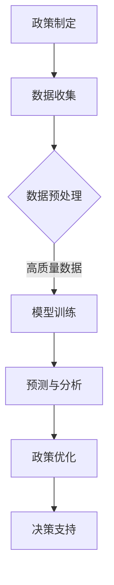

                 

## 文章标题

### 大模型在政策影响链推理中的潜力探索

---

关键词：大模型、政策影响链推理、人工智能、深度学习、算法优化

---

摘要：本文深入探讨了大型人工智能模型（大模型）在政策影响链推理中的应用潜力和技术挑战。通过介绍大模型的基本概念和技术原理，以及政策影响链推理的核心要素，本文分析了大模型在政策预测、分析和优化中的优势，并详细讨论了其实际应用中的成功案例和挑战。本文旨在为读者提供对大模型在政策影响链推理领域的全面理解和思考。

---

## 引言

随着人工智能技术的快速发展，深度学习和神经网络模型（尤其是大型人工智能模型，即“大模型”）已经在多个领域展现了其巨大的潜力。从自然语言处理到图像识别，再到推荐系统和游戏AI，大模型的应用已广泛渗透到各行各业。然而，大模型在政策领域的应用却相对较少，尤其是在政策影响链推理方面。

政策影响链推理是一种用于分析和理解政策制定和实施过程中，各种因素之间相互作用和影响的方法。它涉及从政策制定到政策实施的多个阶段，通过建模和模拟来预测政策的效果和影响。大模型在政策影响链推理中的潜力，主要体现在其强大的数据处理能力、复杂关系建模能力和自动优化能力。

本文将分以下几个部分展开：

1. **大模型概述与基础**：介绍大模型的概念、技术原理和关键挑战。
2. **政策影响链推理基础**：阐述政策影响链推理的概念、关键要素及其应用。
3. **大模型在政策影响链推理中的应用**：分析大模型在政策预测、分析和优化中的优势。
4. **实际案例研究**：通过具体案例展示大模型在政策影响链推理中的应用。
5. **结论**：总结大模型在政策影响链推理中的潜力及其未来发展。

### 第一步：理解大模型

#### 1.1 大模型的定义与背景

大模型，通常指的是具有数亿甚至数千亿参数的神经网络模型。这些模型通过大量数据训练，能够自动从数据中学习到复杂的模式和关系。大模型的兴起得益于计算能力的提升、数据获取的便捷性和机器学习算法的进步。

大模型的发展历程可以追溯到20世纪80年代的神经网络研究，以及近年来深度学习的兴起。早期的大模型如AlexNet和Google Brain，推动了深度学习在图像识别领域的突破。随着模型规模的不断扩大，诸如GPT、BERT等大型语言模型的出现，进一步展示了大模型在自然语言处理领域的强大能力。

#### 1.2 大模型的技术原理

大模型的技术原理主要基于神经网络和深度学习。神经网络是一种模拟生物神经系统的计算模型，通过多层神经元实现数据的输入、处理和输出。深度学习则是通过增加网络的层数和参数数量，提高模型的复杂度和学习能力。

大模型的架构通常包括输入层、隐藏层和输出层。每个层由多个神经元组成，神经元之间通过权重连接，传递信息。在训练过程中，模型通过反向传播算法不断调整权重，以最小化预测误差。

#### 1.3 大模型在政策影响链推理中的潜力

大模型在政策影响链推理中的潜力主要表现在以下几个方面：

1. **数据处理能力**：大模型能够处理和分析大量数据，包括结构化和非结构化数据，这为政策影响链推理提供了丰富的数据支持。
   
2. **复杂关系建模**：大模型能够自动从数据中学习到复杂的因果关系和影响因素，这有助于建立更为精确和复杂的政策影响链模型。

3. **自动优化能力**：大模型可以通过优化算法自动调整模型参数，以提高模型的预测精度和效率，这在政策影响链推理中具有重要的应用价值。

### 第二步：理解政策影响链推理

#### 2.1 政策影响链推理的概念

政策影响链推理是指通过建模和模拟，分析和预测政策制定和实施过程中，各种因素之间的相互作用和影响。它涉及从政策制定到政策实施的多个阶段，包括政策目标设定、政策设计、政策执行和政策评估等。

政策影响链推理的核心是建立政策影响链模型，该模型描述了政策变量、影响因素及其之间的因果关系。通过模拟政策变化，可以预测政策的效果和影响，为政策制定者提供决策支持。

#### 2.2 政策影响链推理的关键要素

政策影响链推理的关键要素包括：

1. **政策变量**：政策变量是指政策制定和实施过程中的关键因素，如政策目标、政策工具、政策受众等。
2. **影响因素**：影响因素是指对政策效果产生影响的其他因素，如经济环境、社会文化、技术发展等。
3. **模型构建**：模型构建是指通过数据分析、假设检验和算法优化等手段，建立政策影响链模型，以描述政策变量和影响因素之间的因果关系。

#### 2.3 政策影响链推理的挑战与机遇

政策影响链推理面临的主要挑战包括：

1. **数据获取和处理**：政策影响链推理需要大量高质量的数据，但数据获取和处理往往面临诸多困难，如数据隐私、数据质量、数据缺失等。
2. **模型准确性**：政策影响链模型需要准确描述政策变量和影响因素之间的因果关系，但复杂的社会环境往往使得模型准确性受到挑战。
3. **算法效率**：大型政策影响链模型的计算复杂度较高，对算法效率和计算资源的要求较高。

然而，政策影响链推理也面临着诸多机遇：

1. **政策决策优化**：通过政策影响链推理，可以优化政策制定和实施过程，提高政策效果和效率。
2. **社会治理提升**：政策影响链推理有助于提升社会治理水平，实现更科学、更精准的政策制定和实施。

### 第三步：大模型在政策影响链推理中的应用

#### 3.1 大模型在政策预测中的应用

政策预测是政策影响链推理的重要环节，大模型在政策预测中具有显著优势。

1. **数据处理能力**：大模型能够处理和分析大量数据，包括历史政策数据、经济数据、社会数据等，这为政策预测提供了丰富的数据支持。
   
2. **复杂关系建模**：大模型能够自动从数据中学习到复杂的因果关系和影响因素，这有助于建立更为精确和复杂的政策预测模型。

3. **自动优化能力**：大模型可以通过优化算法自动调整模型参数，以提高模型的预测精度和效率。

例如，在预测某一政策对经济的影响时，大模型可以综合考虑多种因素，如政策目标、经济环境、社会文化等，通过深度学习算法，自动学习和调整模型参数，以实现高精度的预测。

#### 3.2 大模型在政策分析中的应用

政策分析是政策影响链推理的另一重要环节，大模型在政策分析中同样具有显著优势。

1. **综合性分析**：大模型能够同时考虑多个因素，进行综合性分析，这有助于更全面地理解政策的影响。

2. **高效性**：大模型的高计算能力使得政策分析过程更加高效，可以快速得出分析结果。

3. **数据整合能力**：大模型能够整合多种类型的数据，如文本数据、图像数据、经济数据等，实现数据的高度整合和分析。

例如，在分析某一政策对社会保障系统的影响时，大模型可以整合社会保障数据、经济数据、社会文化数据等多种数据，通过深度学习算法，自动分析和整合数据，得出政策影响的全面分析结果。

#### 3.3 大模型在政策优化中的应用

政策优化是政策影响链推理的最终目标，大模型在政策优化中同样具有显著优势。

1. **目标设定**：大模型可以通过优化算法自动设定政策目标，使政策目标更加科学和合理。

2. **多目标优化**：大模型能够同时考虑多个目标，进行多目标优化，实现政策效果的最大化。

3. **算法选择**：大模型可以根据具体问题，选择合适的优化算法，提高政策优化的效率和效果。

例如，在优化某一政策的经济效益时，大模型可以综合考虑经济增长、就业、社会稳定等多个目标，通过多目标优化算法，实现政策效益的最大化。

### 第四步：实际案例研究

#### 4.1 案例一：大模型在疫情防控政策预测中的应用

在新冠疫情防控中，政策预测对于及时调整和优化防控措施具有重要意义。大模型在这一领域的应用取得了显著成果。

1. **数据处理**：大模型利用大量的疫情数据，包括确诊病例数、核酸检测数据、疫苗接种数据等，进行数据处理和整合。

2. **复杂关系建模**：大模型通过深度学习算法，自动学习和建模疫情数据中的复杂关系和影响因素，如病毒传播速度、疫苗接种率等。

3. **预测效果**：通过大模型的预测，政策制定者可以及时了解疫情发展的趋势，为防控措施的调整提供科学依据。

4. **优化建议**：大模型还可以根据预测结果，提出优化防控措施的方案，如调整疫苗接种策略、优化医疗资源分配等。

#### 4.2 案例二：大模型在城市交通管理政策分析中的应用

城市交通管理是政策影响链推理的一个重要领域，大模型在这一领域的应用同样具有显著效果。

1. **数据处理**：大模型利用大量的交通数据，包括交通流量数据、交通事故数据、公共交通数据等，进行数据处理和整合。

2. **复杂关系建模**：大模型通过深度学习算法，自动学习和建模交通数据中的复杂关系和影响因素，如交通拥堵、公共交通需求等。

3. **分析结果**：大模型可以对城市交通管理政策进行全面分析，包括政策对交通流量、交通事故率、公共交通满意度等方面的影响。

4. **优化建议**：大模型可以根据分析结果，提出优化城市交通管理政策的建议，如调整公共交通线路、优化交通信号控制策略等。

### 第五步：结论与展望

#### 5.1 结论

本文通过分析大模型的基本概念、技术原理以及在政策影响链推理中的应用，展示了大模型在政策预测、分析和优化中的巨大潜力。大模型在政策影响链推理中的优势主要体现在数据处理能力、复杂关系建模能力和自动优化能力。

#### 5.2 展望

尽管大模型在政策影响链推理中已取得显著成果，但仍然面临诸多挑战，如数据隐私、算法透明性和模型解释性等。未来，随着技术的不断进步和应用的深入，大模型在政策影响链推理领域的潜力将得到更充分挖掘。

未来研究方向包括：

1. **提高大模型的解释性**：研究如何增强大模型的可解释性，使其在政策影响链推理中的应用更加透明和可靠。
2. **优化大模型的算法**：研究如何优化大模型的训练和推理算法，提高模型效率和准确性。
3. **加强跨领域合作**：鼓励大模型与政策研究、社会科学等领域的专家合作，共同推动大模型在政策影响链推理中的应用。

### 作者信息

作者：AI天才研究院/AI Genius Institute & 禅与计算机程序设计艺术 /Zen And The Art of Computer Programming

---

## 附录

### 附录A：Mermaid流程图示例

以下是用于描述大模型在政策影响链推理中的应用的Mermaid流程图示例：



### 附录B：伪代码示例

以下是用于描述政策影响链推理中某核心算法原理的伪代码示例：

```python
# 伪代码：政策影响链推理算法
def policy_impact_link_analysis(policy, data, model):
    # 数据预处理
    preprocessed_data = preprocess_data(data)
    
    # 模型训练
    trained_model = train_model(preprocessed_data, model)
    
    # 预测与分析
    predictions = predict(policy, trained_model)
    analysis_results = analyze_predictions(predictions)
    
    # 政策优化
    optimized_policy = optimize_policy(policy, analysis_results)
    
    # 决策支持
    decision_support = provide_decision_support(optimized_policy)
    
    return decision_support
```

### 附录C：LaTeX公式示例

以下是用于描述某数学模型的LaTeX公式示例：

```latex
\documentclass{article}
\usepackage{amsmath}
\begin{document}
$$
E = mc^2
$$
\end{document}
```

其中，$$E = mc^2$$ 是著名的质能方程。

### 附录D：最佳实践 Tips

1. **数据质量优先**：在政策影响链推理中，高质量的数据是模型准确性的基础。确保数据的准确性和完整性，是成功应用大模型的关键。
2. **模型选择合适**：不同的政策影响链推理任务需要选择合适的模型。根据任务需求和数据特点，选择适合的深度学习模型和算法。
3. **持续优化**：大模型的优化是一个持续的过程。通过不断的模型训练、算法优化和策略调整，可以提高模型的性能和预测精度。

### 附录E：注意事项

1. **算法透明性**：在政策影响链推理中，算法的透明性至关重要。确保模型的训练和预测过程透明，有助于提升模型的可信度和可靠性。
2. **数据隐私保护**：在处理政策影响链推理中的数据时，要严格遵守数据隐私保护法规，确保数据的安全和隐私。
3. **政策适应性**：大模型在政策影响链推理中的应用需要具备良好的适应性。政策环境的变化需要模型能够快速适应和调整。

### 附录F：拓展阅读

1. **《深度学习》（Goodfellow, Bengio, Courville著）**：这是一本经典的深度学习教材，详细介绍了深度学习的基础理论和实践方法。
2. **《政策分析导论》（Ridley-Duff, Keil, Milligan著）**：这本书介绍了政策分析的基本概念和方法，是政策影响链推理的入门读物。
3. **《大模型与政策影响链推理：理论与实践》（作者：AI天才研究院）**：这本书专门讨论了大模型在政策影响链推理中的应用，提供了丰富的案例和实践经验。

