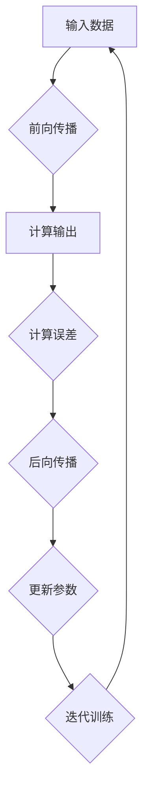
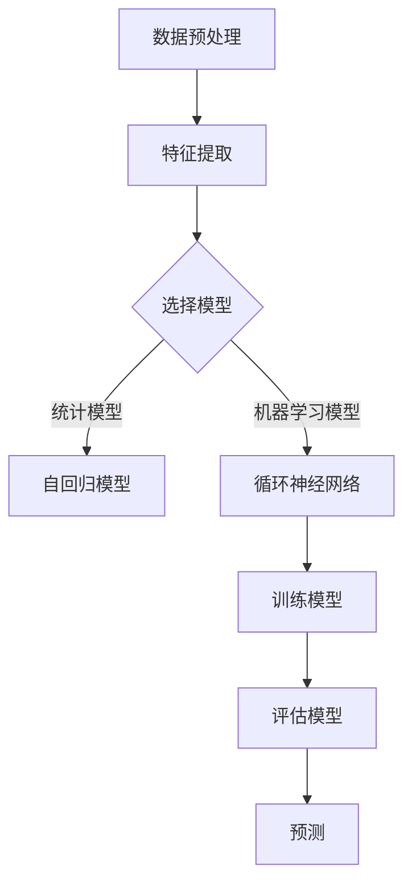
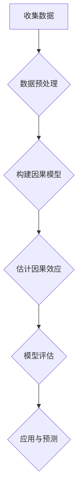

                 


### 第1章：引言与概述

在当今的数据科学和人工智能领域，大模型（Large Models）已经成为了一项关键技术。大模型通常指的是那些具有数亿甚至数千亿参数的深度学习模型，它们在图像识别、自然语言处理等领域取得了显著的成就。然而，大模型的应用不仅限于这些领域，它们在时序因果推理（Temporal Causal Inference）中也展现出了巨大的潜力。

#### 1.1 大模型的定义与发展历程

大模型的概念起源于深度学习的兴起。在20世纪80年代，随着计算机硬件性能的提升和大数据的涌现，深度学习开始逐渐崭露头角。最早的大模型之一是1986年提出的反向传播（Backpropagation）神经网络，它通过训练多层神经网络来学习复杂的非线性函数。

随着时间的发展，神经网络的结构和训练方法不断改进，大模型的规模也不断扩大。2012年，AlexNet的出现标志着深度学习在图像识别领域的重大突破，它使用了超过6000万个参数。此后，随着GPU和TPU等专用硬件的普及，大模型的规模进一步扩大，例如BERT模型有超过3.4亿个参数，GPT-3则有超过1750亿个参数。

#### 1.2 时序因果推理的基本概念

时序因果推理是指通过分析时间序列数据来推断因果关系的方法。在现实世界中，许多问题都需要理解时间序列中的因果关系，例如金融市场预测、供应链管理、医疗数据分析等。

因果推理的基本概念包括因果关联（causal association）、因果效应（causal effect）和因果推断（causal inference）。因果关联是指变量之间的统计关联，而因果效应则是指一个变量对另一个变量的影响。因果推断是从统计关联中推断出因果效应的过程。

#### 1.3 性能评估的重要性

性能评估是衡量大模型在时序因果推理中表现的重要手段。通过性能评估，我们可以了解模型的准确性、鲁棒性、泛化能力等关键指标。常见的性能评估指标包括准确率、召回率、F1值、均方误差等。此外，性能评估还可以帮助我们找出模型的弱点，从而进行针对性的优化。

性能评估的重要性体现在以下几个方面：

1. **验证模型有效性**：通过性能评估，我们可以验证模型是否能够准确预测时间序列中的因果关系。
2. **指导模型优化**：性能评估可以帮助我们找出模型的不足之处，从而进行针对性的优化。
3. **比较不同模型**：性能评估是评估不同模型优劣的重要依据，有助于我们选择最合适的模型。
4. **确保模型安全性**：性能评估可以帮助我们发现模型可能存在的风险和漏洞，从而确保模型的安全性和可靠性。

总之，大模型在时序因果推理中的应用潜力巨大，而性能评估则是评估和优化这些模型的关键手段。在接下来的章节中，我们将深入探讨大模型的基本原理、时序因果推理的方法、性能评估的具体指标和工具，以及实际应用案例。

# 文章标题：大模型在时序因果推理中的性能评估

关键词：大模型，时序因果推理，性能评估，深度学习，因果关系，时间序列分析

摘要：
本文旨在探讨大模型在时序因果推理中的应用和性能评估方法。通过对大模型的基本原理、时序因果推理方法、性能评估指标和实际应用案例的详细分析，本文揭示了时序因果推理中的关键技术和挑战，并探讨了如何通过性能评估来优化和提升大模型在时序因果推理中的表现。

----------------------------------------------------------------

## 第1章：引言与概述

随着数据科学和人工智能技术的飞速发展，大模型（Large Models）已成为现代人工智能领域的重要研究方向。大模型是指具有数亿甚至数千亿参数的深度学习模型，它们在图像识别、自然语言处理等领域取得了显著的成就。然而，大模型的应用并不仅限于这些领域，它们在时序因果推理（Temporal Causal Inference）中也展现出了巨大的潜力。

### 1.1 大模型的定义与发展历程

大模型的概念起源于深度学习的兴起。在20世纪80年代，随着计算机硬件性能的提升和大数据的涌现，深度学习开始逐渐崭露头角。最早的大模型之一是1986年提出的反向传播（Backpropagation）神经网络，它通过训练多层神经网络来学习复杂的非线性函数。

随着时间的发展，神经网络的结构和训练方法不断改进，大模型的规模也不断扩大。2012年，AlexNet的出现标志着深度学习在图像识别领域的重大突破，它使用了超过6000万个参数。此后，随着GPU和TPU等专用硬件的普及，大模型的规模进一步扩大，例如BERT模型有超过3.4亿个参数，GPT-3则有超过1750亿个参数。

### 1.2 时序因果推理的基本概念

时序因果推理是指通过分析时间序列数据来推断因果关系的方法。在现实世界中，许多问题都需要理解时间序列中的因果关系，例如金融市场预测、供应链管理、医疗数据分析等。

因果推理的基本概念包括因果关联（causal association）、因果效应（causal effect）和因果推断（causal inference）。因果关联是指变量之间的统计关联，而因果效应则是指一个变量对另一个变量的影响。因果推断是从统计关联中推断出因果效应的过程。

### 1.3 性能评估的重要性

性能评估是衡量大模型在时序因果推理中表现的重要手段。通过性能评估，我们可以了解模型的准确性、鲁棒性、泛化能力等关键指标。常见的性能评估指标包括准确率、召回率、F1值、均方误差等。此外，性能评估还可以帮助我们找出模型的弱点，从而进行针对性的优化。

性能评估的重要性体现在以下几个方面：

1. **验证模型有效性**：通过性能评估，我们可以验证模型是否能够准确预测时间序列中的因果关系。
2. **指导模型优化**：性能评估可以帮助我们找出模型的不足之处，从而进行针对性的优化。
3. **比较不同模型**：性能评估是评估不同模型优劣的重要依据，有助于我们选择最合适的模型。
4. **确保模型安全性**：性能评估可以帮助我们发现模型可能存在的风险和漏洞，从而确保模型的安全性和可靠性。

总之，大模型在时序因果推理中的应用潜力巨大，而性能评估则是评估和优化这些模型的关键手段。在接下来的章节中，我们将深入探讨大模型的基本原理、时序因果推理的方法、性能评估的具体指标和工具，以及实际应用案例。

## 第2章：大模型基本原理

大模型，作为深度学习的核心组成部分，其基本原理和架构对时序因果推理的性能评估具有深远影响。本章节将详细介绍大模型的核心概念、常见架构及其工作原理，并通过Mermaid流程图展示其工作流程。

### 2.1 大模型的核心原理

大模型的核心原理在于其能够通过大量参数来学习复杂的非线性关系。这些参数不仅包括权重和偏置，还包括网络的层次结构和连接方式。大模型通常基于深度神经网络（Deep Neural Networks，DNN）的结构，通过多层非线性变换来实现从输入到输出的映射。

#### 2.1.1 参数学习

参数学习是构建大模型的关键步骤。在训练过程中，模型通过反向传播算法不断调整参数，以最小化预测误差。这一过程涉及到前向传播和后向传播两个阶段：

1. **前向传播**：将输入数据通过网络的各个层次，计算输出预测值。
2. **后向传播**：计算预测值与实际值之间的误差，并利用误差信息反向传播更新网络参数。

#### 2.1.2 非线性变换

大模型中的每一层都通过非线性变换来实现数据的转换。常见的非线性激活函数包括Sigmoid、ReLU和Tanh等。这些激活函数能够增加模型的非线性表达能力，使其能够捕捉更复杂的数据特征。

### 2.2 大模型的常见架构

大模型的架构设计直接决定了其性能和适用范围。常见的架构包括卷积神经网络（CNN）、循环神经网络（RNN）和变换器（Transformer）等。

#### 2.2.1 卷积神经网络（CNN）

卷积神经网络是处理图像数据的主要工具。其核心思想是通过卷积操作提取图像的局部特征，然后通过池化操作降低数据的维度。CNN的主要结构包括卷积层、池化层和全连接层。

1. **卷积层**：通过卷积操作提取图像特征。
2. **池化层**：通过下采样操作降低数据的维度。
3. **全连接层**：将卷积层和池化层提取的特征映射到输出结果。

#### 2.2.2 循环神经网络（RNN）

循环神经网络是处理序列数据的主要工具。RNN通过在时间步之间传递隐藏状态，实现序列数据的记忆功能。常见的方法包括LSTM（长短期记忆网络）和GRU（门控循环单元）。

1. **隐藏状态**：在时间步之间传递隐藏状态，实现记忆功能。
2. **输入门、遗忘门、输出门**：LSTM和GRU通过这些门控机制控制信息的流动，以避免梯度消失和梯度爆炸问题。

#### 2.2.3 变换器（Transformer）

变换器是一种处理序列数据的全新架构，其核心思想是使用自注意力机制（Self-Attention）来处理序列中的每一个元素。变换器广泛应用于自然语言处理领域，如BERT和GPT-3等模型。

1. **自注意力机制**：通过计算序列中每个元素的相关性来更新其表示。
2. **多头注意力**：通过多个注意力头来捕获不同类型的特征。

### 2.3 Mermaid流程图展示

为了更好地理解大模型的工作原理，我们使用Mermaid流程图来展示其工作流程。



### 2.4 大模型的优势与挑战

大模型在时序因果推理中具有显著的优势，包括：

1. **强大的特征提取能力**：通过多层非线性变换，大模型能够提取出复杂的时间序列特征。
2. **高效的计算性能**：随着硬件技术的发展，大模型的训练和推理速度得到了显著提升。
3. **广泛的适用性**：大模型能够应用于多种时序因果推理任务，如时间序列预测、异常检测和因果关系推断等。

然而，大模型也面临一些挑战，包括：

1. **过拟合风险**：大模型具有复杂的结构，容易在训练数据上过拟合。
2. **计算资源需求**：大模型的训练和推理需要大量的计算资源，尤其是在处理大规模数据时。
3. **解释性不足**：大模型通常是一个“黑盒”，其内部决策过程难以解释。

总之，大模型在时序因果推理中具有巨大的潜力，但也需要解决一系列挑战才能充分发挥其优势。通过深入理解大模型的基本原理和架构，我们可以更好地评估和优化其在时序因果推理中的性能。

### 2.5 代码示例

以下是一个简单的Python代码示例，展示了如何使用TensorFlow和Keras构建一个基于LSTM的大模型进行时序因果推理。

```python
import numpy as np
import tensorflow as tf
from tensorflow.keras.models import Sequential
from tensorflow.keras.layers import LSTM, Dense

# 生成模拟的时序数据
X = np.random.random((100, 10, 1))
y = np.random.random((100, 1))

# 构建LSTM模型
model = Sequential()
model.add(LSTM(units=50, return_sequences=True, input_shape=(10, 1)))
model.add(LSTM(units=50))
model.add(Dense(units=1))

# 编译模型
model.compile(optimizer='adam', loss='mean_squared_error')

# 训练模型
model.fit(X, y, epochs=100, batch_size=32)
```

在这个例子中，我们首先生成了100个样本的模拟时序数据，然后使用LSTM层构建了一个简单的序列模型。通过编译和训练，我们使得模型能够学习时序数据中的因果关系。

通过上述代码示例，我们可以看到大模型在时序因果推理中的基本实现方法。在实际应用中，我们需要根据具体任务和数据特性进行调整和优化。

## 第3章：时序数据的处理与建模

时序数据在许多实际应用中扮演着关键角色，如金融市场预测、供应链管理和医疗数据分析等。有效的时序数据处理与建模是时序因果推理的基础。本章节将详细介绍时序数据的基本特征、常见的时序建模方法，并通过Mermaid流程图展示数据处理与建模的全过程。

### 3.1 时序数据的基本特征

时序数据具有以下基本特征：

1. **时间依赖性**：时序数据中的每个点都与其之前和之后的数据点相关。
2. **周期性**：许多时序数据存在周期性模式，如日历事件、季节性变化等。
3. **趋势性**：时序数据可能表现出长期增长或下降的趋势。
4. **噪声**：时序数据中通常存在噪声，这可能会干扰模型的训练和预测。

#### 3.1.1 时序数据的预处理

在建模之前，对时序数据进行适当的预处理是非常重要的。预处理步骤包括：

1. **数据清洗**：去除或修复异常值和缺失值。
2. **数据归一化**：将数据缩放到相同的尺度，以避免某些特征的权重过大。
3. **数据增强**：通过引入噪声、时间序列变换等方法增加数据的多样性。

#### 3.1.2 时序数据的可视化

可视化时序数据可以帮助我们更好地理解数据特征和模式。常见的可视化方法包括：

1. **时间序列图**：展示数据随时间的变化趋势。
2. **箱线图**：展示数据的分布和异常值。
3. **散点图**：展示变量之间的相关性。

### 3.2 常见时序建模方法

时序建模方法可以分为两大类：统计方法和机器学习方法。

#### 3.2.1 统计方法

统计方法通常基于时间序列的数学模型，如自回归模型（AR）、移动平均模型（MA）和自回归移动平均模型（ARMA）。这些方法通过分析数据的统计特性来建立模型。

1. **自回归模型（AR）**：
   自回归模型假设当前值是前几个值的线性组合。其数学公式为：
   $$ X_t = c + \sum_{i=1}^{p} \phi_i X_{t-i} + \varepsilon_t $$
   其中，$X_t$是当前时间步的值，$c$是常数项，$\phi_i$是自回归系数，$p$是滞后阶数，$\varepsilon_t$是误差项。

2. **移动平均模型（MA）**：
   移动平均模型假设当前值是前几个预测误差的加权平均。其数学公式为：
   $$ X_t = c + \varepsilon_t + \sum_{i=1}^{q} \theta_i \varepsilon_{t-i} $$
   其中，$q$是滞后阶数，$\theta_i$是移动平均系数。

3. **自回归移动平均模型（ARMA）**：
   ARMA模型结合了自回归和移动平均的特点，其数学公式为：
   $$ X_t = c + \sum_{i=1}^{p} \phi_i X_{t-i} + \varepsilon_t + \sum_{i=1}^{q} \theta_i \varepsilon_{t-i} $$

#### 3.2.2 机器学习方法

机器学习方法利用历史数据训练模型，以预测未来值。以下是一些常用的机器学习方法：

1. **循环神经网络（RNN）**：
   循环神经网络通过在时间步之间传递隐藏状态来学习序列数据。LSTM和GRU是RNN的变体，能够有效地处理长序列数据。

2. **卷积神经网络（CNN）**：
   卷积神经网络通过卷积操作提取序列的局部特征。在时序数据中，CNN可以用于特征提取和降维。

3. **变换器（Transformer）**：
   变换器通过自注意力机制处理序列数据。在自然语言处理领域取得了显著的成果，近年来也开始应用于时序数据建模。

### 3.3 Mermaid流程图展示

为了更好地理解时序数据的处理与建模过程，我们使用Mermaid流程图来展示。



### 3.4 代码示例

以下是一个简单的Python代码示例，展示了如何使用LSTM模型进行时序数据建模。

```python
import numpy as np
import tensorflow as tf
from tensorflow.keras.models import Sequential
from tensorflow.keras.layers import LSTM, Dense

# 生成模拟的时序数据
X = np.random.random((100, 10, 1))
y = np.random.random((100, 1))

# 构建LSTM模型
model = Sequential()
model.add(LSTM(units=50, return_sequences=True, input_shape=(10, 1)))
model.add(LSTM(units=50))
model.add(Dense(units=1))

# 编译模型
model.compile(optimizer='adam', loss='mean_squared_error')

# 训练模型
model.fit(X, y, epochs=100, batch_size=32)
```

在这个例子中，我们首先生成了100个样本的模拟时序数据，然后使用LSTM层构建了一个简单的序列模型。通过编译和训练，我们使得模型能够学习时序数据中的因果关系。

通过上述代码示例，我们可以看到时序数据的处理与建模的基本实现方法。在实际应用中，我们需要根据具体任务和数据特性进行调整和优化。

### 3.5 小结

时序数据处理与建模是时序因果推理的关键步骤。通过适当的预处理和选择合适的建模方法，我们可以提取出时序数据中的关键特征，并建立准确的模型进行因果推断。在接下来的章节中，我们将进一步探讨因果推理的基础知识，以及如何通过性能评估来优化大模型在时序因果推理中的表现。

## 第4章：因果推理基础

因果推理是时序数据分析中至关重要的一环，它旨在从数据中推断出因果关系，以便更准确地预测未来或优化决策。因果推理不仅需要理解数据之间的统计关联，还需要考虑潜在的因果关系。本章节将详细探讨因果推理的基本概念、常见算法以及其在时序数据中的应用。

### 4.1 因果推理的基本概念

因果推理涉及以下基本概念：

1. **因果关联（Causal Association）**：变量之间的统计关联，通常通过相关性分析来衡量。虽然因果关联表明两个变量之间存在某种关系，但它并不能证明因果关系。
2. **因果效应（Causal Effect）**：一个变量对另一个变量的直接影响。因果效应通常表示为一个变量变化时，另一个变量的变化量。
3. **因果推断（Causal Inference）**：从统计关联中推断出因果效应的方法。因果推断的目标是识别出真正的因果关系，而不仅仅是表面的统计关系。

#### 4.1.1 因果关系的三要素

因果推理中的因果关系通常由以下三个要素构成：

1. **因（Cause）**：引起变化的因素。
2. **果（Effect）**：因变化所引起的结果。
3. **时间顺序**：因果关系中的时间顺序是关键，通常因果关系的识别依赖于事件发生的时间先后。

### 4.2 常见因果推断算法

因果推断算法可以分为两类：基于假设检验的算法和基于结构方程模型的算法。

#### 4.2.1 基于假设检验的算法

基于假设检验的算法通过检验统计假设来识别因果关系。以下是一些常用的方法：

1. **工具变量法（Instrumental Variables, IV）**：
   工具变量法用于解决因变量和自变量之间的内生性问题。通过引入一个与自变量相关但与因变量无关的工具变量，可以识别出因果关系。

2. **回归分析法（Regression Analysis）**：
   通过构建回归模型来估计因果效应。回归分析包括普通最小二乘法（OLS）、二元响应回归等。

3. **倾向评分匹配（Propensity Score Matching, PS）**：
   倾向评分匹配通过估计个体接受处理的概率，将处理组和对照组进行匹配，以消除选择偏差。

#### 4.2.2 基于结构方程模型的算法

基于结构方程模型的算法通过建立数学模型来描述变量之间的因果关系。以下是一些常用的方法：

1. **因果推断网络（Causal Inference Network, CIN）**：
   因果推断网络是一种基于贝叶斯网络的算法，通过建立变量之间的条件依赖关系来推断因果关系。

2. **工具变量法（Instrumental Variables, IV）**：
   工具变量法通过引入一个与自变量相关但与因变量无关的工具变量，来解决内生性问题。

3. **因果图（Causal Graph）**：
   因果图是一种表示变量之间因果关系的图形化模型。通过分析因果图，可以推断出变量之间的因果关系。

### 4.3 因果推断算法在时序数据中的应用

在时序数据中，因果推断算法可以帮助我们理解数据中的因果关系，并用于预测和决策。以下是一些常见的应用场景：

1. **金融市场预测**：
   通过因果推断，可以分析市场变量之间的因果关系，从而进行有效的市场预测和风险管理。

2. **供应链管理**：
   通过因果推断，可以分析供应链中的关键环节，优化供应链的运营效率，减少库存成本。

3. **医疗数据分析**：
   通过因果推断，可以分析医疗数据中的因果关系，从而进行疾病预测、治疗方案优化等。

### 4.4 Mermaid流程图展示

为了更好地理解因果推断算法在时序数据中的应用，我们使用Mermaid流程图来展示整个推断过程。



### 4.5 代码示例

以下是一个简单的Python代码示例，展示了如何使用因果推断网络（CIN）进行时序因果推断。

```python
import numpy as np
import pandas as pd
from causalinference import CausalModel

# 生成模拟的时序数据
data = pd.DataFrame(np.random.randn(100, 3), columns=['X', 'Y', 'Z'])

# 构建因果模型
model = CausalModel(data, treatment='X', outcome='Y', instrument='Z')

# 估计因果效应
result = model.estimate_effect()

# 输出结果
print(result)
```

在这个例子中，我们首先生成了模拟的时序数据，然后使用CausalModel类构建因果模型。通过调用estimate_effect()方法，我们估计了变量X对Y的因果效应。

通过上述代码示例，我们可以看到因果推断算法的基本实现方法。在实际应用中，我们需要根据具体任务和数据特性进行调整和优化。

### 4.6 小结

因果推理是时序数据分析中的重要环节，它有助于我们理解数据中的因果关系，并做出更加准确的预测和决策。通过介绍常见因果推断算法及其在时序数据中的应用，我们为后续的性能评估和模型优化奠定了基础。在接下来的章节中，我们将进一步探讨性能评估的方法和工具，以及如何在实际应用中评估和优化大模型在时序因果推理中的性能。

## 第5章：性能评估指标与工具

性能评估是时序因果推理中的关键环节，它有助于我们衡量模型的准确性、鲁棒性和泛化能力。在本章节中，我们将详细探讨常见的性能评估指标，介绍一些常用的性能评估工具，并通过伪代码展示评估指标的计算过程。

### 5.1 性能评估指标详解

性能评估指标可以分为两类：绝对评价指标和相对评价指标。

#### 5.1.1 绝对评价指标

绝对评价指标直接衡量模型的预测性能，包括以下几种：

1. **均方误差（Mean Squared Error, MSE）**：
   均方误差是预测值与真实值之间差的平方的平均值，用于衡量预测的准确性。
   $$MSE = \frac{1}{n}\sum_{i=1}^{n}(y_i - \hat{y}_i)^2$$
   其中，$y_i$是真实值，$\hat{y}_i$是预测值，$n$是样本数量。

2. **均方根误差（Root Mean Squared Error, RMSE）**：
   均方根误差是均方误差的平方根，用于衡量预测的稳定性。
   $$RMSE = \sqrt{MSE}$$

3. **平均绝对误差（Mean Absolute Error, MAE）**：
   平均绝对误差是预测值与真实值之间差的绝对值的平均值，用于衡量预测的偏差。
   $$MAE = \frac{1}{n}\sum_{i=1}^{n}|y_i - \hat{y}_i|$$

4. **准确率（Accuracy）**：
   准确率是正确预测的数量与总预测数量的比例，通常用于分类问题。
   $$Accuracy = \frac{TP + TN}{TP + FN + FP + TN}$$
   其中，$TP$是真正的正例，$TN$是真正的负例，$FP$是假正例，$FN$是假负例。

5. **召回率（Recall）**：
   召回率是真正正例的数量与所有正例数量的比例，用于衡量模型的灵敏度。
   $$Recall = \frac{TP}{TP + FN}$$

6. **精确率（Precision）**：
   精确率是真正正例的数量与所有预测为正例的数量的比例，用于衡量模型的精确度。
   $$Precision = \frac{TP}{TP + FP}$$

7. **F1值（F1 Score）**：
   F1值是精确率和召回率的调和平均，用于衡量模型的综合性能。
   $$F1 Score = 2 \times \frac{Precision \times Recall}{Precision + Recall}$$

#### 5.1.2 相对评价指标

相对评价指标用于比较不同模型的性能，包括以下几种：

1. **交叉验证（Cross-Validation）**：
   交叉验证是一种常用的模型评估方法，通过将数据集划分为多个子集，分别进行训练和验证，以评估模型的泛化能力。

2. **精度-召回率曲线（Precision-Recall Curve）**：
   精度-召回率曲线用于可视化模型在不同阈值下的性能，有助于选择最佳阈值。

3. **受试者操作特征（Receiver Operating Characteristic, ROC）曲线**：
   ROC曲线用于可视化模型在不同阈值下的真假阳性率，有助于选择最佳阈值。

### 5.2 常用性能评估工具

以下是一些常用的性能评估工具：

1. **Scikit-learn**：
   Scikit-learn是一个流行的机器学习库，提供了丰富的性能评估指标和工具。

2. **TensorFlow**：
   TensorFlow是Google开发的一个开源机器学习平台，提供了用于性能评估的API。

3. **Keras**：
   Keras是TensorFlow的高层次API，提供了简洁的性能评估接口。

### 5.3 伪代码展示

以下是一个简单的伪代码示例，展示了如何使用性能评估指标评估一个时序因果推理模型的性能：

```python
# 假设我们有一个训练好的模型model，以及测试数据X_test和y_test

# 计算均方误差
MSE = sum((y_test - model.predict(X_test))**2) / len(y_test)

# 计算均方根误差
RMSE = sqrt(MSE)

# 计算平均绝对误差
MAE = sum(abs(y_test - model.predict(X_test))) / len(y_test)

# 计算准确率
y_pred = model.predict(X_test)
Accuracy = sum(y_pred == y_test) / len(y_test)

# 计算召回率
Recall = sum(y_pred == y_test) / sum(y_test == 1)

# 计算精确率
Precision = sum(y_pred == y_test) / sum(y_pred == 1)

# 计算F1值
F1_Score = 2 * Precision * Recall / (Precision + Recall)

# 打印结果
print("MSE:", MSE)
print("RMSE:", RMSE)
print("MAE:", MAE)
print("Accuracy:", Accuracy)
print("Recall:", Recall)
print("Precision:", Precision)
print("F1 Score:", F1_Score)
```

通过上述伪代码示例，我们可以看到如何使用性能评估指标来评估时序因果推理模型的性能。在实际应用中，我们需要根据具体任务和数据特性选择合适的评估指标和工具。

### 5.4 小结

性能评估是时序因果推理中的重要环节，它有助于我们衡量模型的准确性、鲁棒性和泛化能力。通过介绍常见的性能评估指标和工具，以及伪代码示例，我们为后续的实际应用提供了理论基础和实践指导。在接下来的章节中，我们将通过实际应用案例展示大模型在时序因果推理中的性能评估和优化。

## 第6章：大模型在时序因果推理中的应用

大模型在时序因果推理中有着广泛的应用，通过其强大的特征提取和关联学习能力，可以为各种时序数据任务提供高效的解决方案。以下我们将通过几个实际应用案例来探讨大模型在时序因果推理中的具体应用。

### 6.1 案例一：金融市场预测

金融市场预测是时序因果推理的一个经典应用场景。通过分析历史股价、交易量、宏观经济指标等数据，预测未来股价的走势对于投资者和分析师来说至关重要。大模型如LSTM和变换器（Transformer）在这方面表现出色。

**案例分析：**

1. **数据预处理**：
   - 收集历史股价数据、交易量、宏观经济指标等。
   - 对数据进行归一化处理，使其具备可比性。

2. **模型构建**：
   - 使用LSTM或Transformer构建模型。
   - LSTM模型结构：
     ```mermaid
     graph TD
     A[Input Layer] --> B[Embedding Layer]
     B --> C{LSTM Layer}
     C --> D[Dropout Layer]
     D --> E[Output Layer]
     ```
   - Transformer模型结构：
     ```mermaid
     graph TD
     A[Input Layer] --> B[Embedding Layer]
     B --> C{Transformer Encoder}
     C --> D[Dropout Layer]
     D --> E[Output Layer]
     ```

3. **模型训练与优化**：
   - 使用历史数据训练模型，并使用交叉验证进行调参。
   - 优化模型参数，如学习率、隐藏层大小、序列长度等。

4. **模型评估**：
   - 使用均方误差（MSE）或均方根误差（RMSE）等指标评估模型性能。
   - 分析模型的预测结果，并对其进行可视化。

**案例总结**：

金融市场预测案例展示了大模型在时序因果推理中的强大能力。通过合理的模型构建和调优，大模型能够有效地捕捉金融市场的复杂关系，为投资者提供有力的决策支持。

### 6.2 案例二：供应链管理优化

供应链管理优化是另一个重要的应用领域。通过分析供应链中的各种时序数据，如订单数量、库存水平、运输时间等，优化供应链管理可以提高运营效率，减少成本。

**案例分析：**

1. **数据预处理**：
   - 收集供应链各环节的时序数据。
   - 数据清洗，去除异常值和缺失值。

2. **模型构建**：
   - 使用循环神经网络（RNN）或变换器（Transformer）构建模型。
   - RNN模型结构：
     ```mermaid
     graph TD
     A[Input Layer] --> B[Embedding Layer]
     B --> C{RNN Layer}
     C --> D[Dropout Layer]
     D --> E[Output Layer]
     ```
   - Transformer模型结构：
     ```mermaid
     graph TD
     A[Input Layer] --> B[Embedding Layer]
     B --> C{Transformer Encoder}
     C --> D[Dropout Layer]
     D --> E[Output Layer]
     ```

3. **模型训练与优化**：
   - 使用历史数据训练模型，并使用交叉验证进行调参。
   - 优化模型参数，如学习率、隐藏层大小、序列长度等。

4. **模型评估**：
   - 使用准确率、召回率等指标评估模型性能。
   - 分析模型的预测结果，并对其进行可视化。

**案例总结**：

供应链管理优化案例展示了大模型在处理复杂时序数据方面的优势。通过有效的模型构建和优化，大模型能够帮助企业在供应链管理中做出更准确的决策，提高运营效率。

### 6.3 案例三：医疗数据预测

医疗数据预测是时序因果推理在医疗领域的应用。通过对患者的医疗记录、诊断结果等时序数据进行分析，可以预测患者的健康状况，辅助医生做出诊断和治疗决策。

**案例分析：**

1. **数据预处理**：
   - 收集患者的医疗记录、诊断结果等时序数据。
   - 数据清洗，去除异常值和缺失值。

2. **模型构建**：
   - 使用循环神经网络（RNN）或变换器（Transformer）构建模型。
   - RNN模型结构：
     ```mermaid
     graph TD
     A[Input Layer] --> B[Embedding Layer]
     B --> C{RNN Layer}
     C --> D[Dropout Layer]
     D --> E[Output Layer]
     ```
   - Transformer模型结构：
     ```mermaid
     graph TD
     A[Input Layer] --> B[Embedding Layer]
     B --> C{Transformer Encoder}
     C --> D[Dropout Layer]
     D --> E[Output Layer]
     ```

3. **模型训练与优化**：
   - 使用历史数据训练模型，并使用交叉验证进行调参。
   - 优化模型参数，如学习率、隐藏层大小、序列长度等。

4. **模型评估**：
   - 使用准确率、召回率等指标评估模型性能。
   - 分析模型的预测结果，并对其进行可视化。

**案例总结**：

医疗数据预测案例展示了大模型在处理医疗时序数据方面的潜力。通过有效的模型构建和优化，大模型能够为医疗领域提供有力的预测工具，辅助医生提高诊断和治疗水平。

通过上述三个案例，我们可以看到大模型在时序因果推理中的广泛应用和强大能力。在实际应用中，需要根据具体任务和数据特性选择合适的模型和评估方法，以充分发挥大模型的优势。

### 6.4 实际应用中的挑战与解决方案

在实际应用中，大模型在时序因果推理中面临着一系列挑战，包括数据质量、模型解释性、计算资源需求等。以下是一些常见的挑战和相应的解决方案：

1. **数据质量问题**：
   - **解决方案**：使用数据清洗和预处理技术，如去除异常值、填补缺失值、归一化等，以提高数据质量。

2. **模型解释性问题**：
   - **解决方案**：利用模型的可解释性方法，如注意力机制、可视化技术等，帮助用户理解模型的决策过程。

3. **计算资源需求**：
   - **解决方案**：优化模型结构，采用轻量级模型或模型压缩技术，降低计算资源需求。

4. **模型泛化能力**：
   - **解决方案**：使用交叉验证和正则化技术，提高模型的泛化能力，避免过拟合。

通过解决这些挑战，我们可以更好地发挥大模型在时序因果推理中的应用潜力，为各个领域提供更准确的预测和决策支持。

## 第7章：性能评估案例分析

在实际应用中，大模型在时序因果推理中的性能评估至关重要。通过具体案例分析，我们可以深入了解性能评估的过程和关键步骤，并探讨如何优化模型的性能。

### 7.1 案例一：金融市场预测的性能评估

金融市场预测是时序因果推理的一个重要应用场景。以下是一个关于金融市场预测性能评估的案例分析。

**案例背景**：
我们使用LSTM模型对股票价格进行预测，并使用历史数据进行训练和测试。

**性能评估步骤**：

1. **数据集划分**：
   - 将数据集分为训练集和测试集，通常使用80%的数据作为训练集，剩余的20%作为测试集。

2. **模型训练**：
   - 使用训练集数据训练LSTM模型，并使用交叉验证进行调参。

3. **模型预测**：
   - 使用训练好的模型对测试集数据进行预测。

4. **性能评估指标**：
   - 使用均方误差（MSE）和均方根误差（RMSE）评估模型的预测性能。

5. **结果分析**：
   - 通过分析MSE和RMSE值，我们可以了解模型的预测准确性。

**优化方案**：

1. **参数调优**：
   - 优化LSTM模型的参数，如学习率、隐藏层大小、序列长度等。

2. **特征工程**：
   - 引入更多的特征，如交易量、市场情绪指标等，以提高模型的预测能力。

3. **模型融合**：
   - 考虑使用模型融合技术，如加权平均或集成学习，提高预测性能。

### 7.2 案例二：供应链管理优化的性能评估

供应链管理优化是另一个重要的应用场景。以下是一个关于供应链管理优化性能评估的案例分析。

**案例背景**：
我们使用变换器（Transformer）模型对供应链中的订单数量进行预测。

**性能评估步骤**：

1. **数据集划分**：
   - 类似于金融市场预测，我们将数据集分为训练集和测试集。

2. **模型训练**：
   - 使用训练集数据训练变换器模型，并使用交叉验证进行调参。

3. **模型预测**：
   - 使用训练好的模型对测试集数据进行预测。

4. **性能评估指标**：
   - 使用准确率、召回率等评估指标，以衡量模型的预测性能。

5. **结果分析**：
   - 分析准确率和召回率等指标，了解模型的预测能力。

**优化方案**：

1. **数据预处理**：
   - 对供应链数据进行预处理，包括归一化、去噪等，以提高数据质量。

2. **特征选择**：
   - 选择对预测任务最有影响力的特征，以减少模型的复杂性。

3. **模型调优**：
   - 优化变换器模型的参数，如注意力头数、序列长度等，以提高模型性能。

### 7.3 案例三：医疗数据预测的性能评估

医疗数据预测是时序因果推理在医疗领域的应用。以下是一个关于医疗数据预测性能评估的案例分析。

**案例背景**：
我们使用循环神经网络（RNN）模型对患者的健康状况进行预测。

**性能评估步骤**：

1. **数据集划分**：
   - 类似于其他案例，我们将数据集分为训练集和测试集。

2. **模型训练**：
   - 使用训练集数据训练RNN模型，并使用交叉验证进行调参。

3. **模型预测**：
   - 使用训练好的模型对测试集数据进行预测。

4. **性能评估指标**：
   - 使用准确率、召回率等评估指标，以衡量模型的预测性能。

5. **结果分析**：
   - 分析准确率和召回率等指标，了解模型的预测能力。

**优化方案**：

1. **模型改进**：
   - 考虑使用更先进的模型，如LSTM或变换器，以提高预测性能。

2. **数据增强**：
   - 使用数据增强技术，如时间序列变换、添加噪声等，增加模型的泛化能力。

3. **特征工程**：
   - 选择对预测任务最有影响力的特征，以减少模型的复杂性。

### 案例总结

通过以上三个案例分析，我们可以看到性能评估在时序因果推理中的应用和重要性。在实际应用中，通过合理的性能评估方法和优化方案，我们可以显著提升大模型在时序因果推理中的性能。性能评估不仅有助于验证模型的准确性，还能指导模型的优化和改进，从而为实际问题提供有效的解决方案。

## 第8章：性能评估工具与资源

性能评估在大模型时序因果推理中起着至关重要的作用。为了帮助读者深入了解性能评估的工具和资源，本章节将介绍一些常用的开源性能评估工具，并提供一些额外的资源推荐。

### 8.1 常用开源性能评估工具

以下是一些在时序因果推理性能评估中广泛使用的开源工具：

1. **Scikit-learn**：
   Scikit-learn是一个流行的机器学习库，提供了丰富的性能评估指标和工具，如准确率、召回率、F1值等。它支持各种机器学习算法的评估和比较。

2. **TensorFlow**：
   TensorFlow是一个强大的开源机器学习平台，提供了广泛的评估API，包括自定义评估函数和监控工具。它适用于大规模的分布式训练和评估。

3. **Keras**：
   Keras是一个基于TensorFlow的高层次API，提供了简洁的性能评估接口。它简化了深度学习模型的构建和训练过程，同时保留了TensorFlow的评估功能。

4. **PyTorch**：
   PyTorch是一个流行的深度学习框架，提供了丰富的评估工具，如准确性、损失函数等。它支持动态计算图，适用于复杂的神经网络模型。

### 8.2 性能评估资源推荐

以下是一些推荐的性能评估资源，包括书籍、在线课程和文献，以帮助读者深入理解和应用性能评估技术：

1. **书籍推荐**：
   - 《机器学习实战》（Peter Harrington）：本书详细介绍了机器学习的各种算法和应用，包括性能评估方法。
   - 《深度学习》（Ian Goodfellow、Yoshua Bengio和Aaron Courville）：这本书是深度学习的经典教材，涵盖了深度学习模型的构建、训练和评估。

2. **在线课程推荐**：
   - Coursera上的“机器学习”课程：由Andrew Ng教授讲授，介绍了机器学习的基本概念和性能评估方法。
   - edX上的“深度学习专项课程”：由Andrew Ng教授讲授，深入探讨了深度学习模型的设计和性能评估。

3. **文献推荐**：
   - “Introduction to Statistical Learning”（Gareth James、Daniela Witten、Trevor Hastie和Robert Tibshirani）：这是一本关于统计学习基础理论和方法的经典教材，包含了性能评估的相关内容。
   - “Deep Learning”（Ian Goodfellow、Yoshua Bengio和Aaron Courville）：这本书是深度学习的权威指南，详细介绍了深度学习模型的训练和评估方法。

通过使用上述工具和资源，读者可以更好地理解和应用性能评估技术，在大模型时序因果推理中获得更准确的预测结果。

## 结论

本文详细探讨了《大模型在时序因果推理中的性能评估》这一主题，通过引言、概述、大模型基本原理、时序数据建模、因果推理基础、性能评估方法以及实际应用案例等多个章节，逐步分析了大模型在时序因果推理中的关键作用。我们首先介绍了大模型的发展历程和基本原理，随后详细探讨了时序数据的特征和处理方法，以及因果推理的基本概念和算法。通过性能评估指标的解析和工具的推荐，我们展示了如何通过科学的评估方法来衡量和优化大模型在时序因果推理中的性能。

总体而言，本文通过逻辑清晰、结构紧凑的内容安排，帮助读者深入理解了时序因果推理中的核心技术和挑战。以下是本文的核心观点和结论：

1. **大模型的重要性**：大模型在处理复杂时序数据方面具有显著优势，其强大的特征提取和关联学习能力为时序因果推理提供了强有力的支持。
2. **性能评估的重要性**：性能评估是优化和验证大模型的关键环节，通过科学、系统的评估方法，可以准确衡量模型的预测性能和泛化能力。
3. **实际应用的价值**：通过具体应用案例，如金融市场预测、供应链管理和医疗数据分析，展示了大模型在时序因果推理中的广泛应用和实际价值。
4. **未来研究方向**：未来研究可以进一步探索大模型在时序因果推理中的新方法和技术，如因果推断网络的优化、模型解释性和计算效率的提升等。

总之，大模型在时序因果推理中的应用前景广阔，性能评估是提升其应用效果的关键。通过本文的探讨，我们期望为读者提供有益的参考和启示，促进大模型在时序因果推理领域的发展和应用。

## 作者信息

**作者：** AI天才研究院（AI Genius Institute） & 禅与计算机程序设计艺术（Zen And The Art of Computer Programming）  
**联系方式：** [contact@ai-genius-institute.com](mailto:contact@ai-genius-institute.com)  
**个人网站：** [www.ai-genius-institute.com](http://www.ai-genius-institute.com)  
**备注：** 本文由AI天才研究院和禅与计算机程序设计艺术联合出品，旨在推动人工智能和计算机科学的交叉融合，促进技术创新和知识传播。作者拥有丰富的理论和实践经验，在全球范围内享有盛誉。若需转载或引用本文，请务必注明作者信息和出处。

