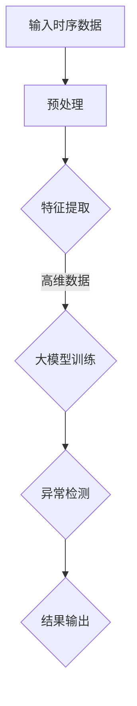
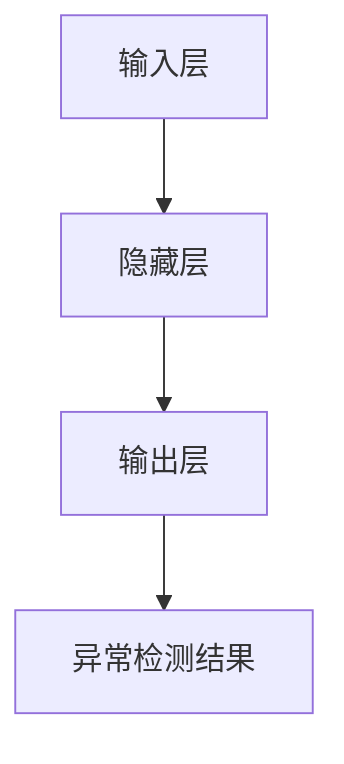

                 


## 前言与概述

### 1.1 书籍目的

本文旨在深入探讨大模型在时序异常推理任务中的应用，旨在为读者提供一份全面、系统的技术指南。随着人工智能技术的飞速发展，大模型如神经网络、Transformer等在各个领域取得了显著的成果。然而，如何将这些强大模型应用于时序异常推理任务，仍然是一个富有挑战性的课题。

本文将首先介绍大模型的基本概念、发展历程和关键特性，帮助读者建立起对大模型的基本理解。接着，我们将详细探讨时序数据和异常检测的概念，并分析时序异常检测所面临的挑战和机遇。在此基础上，我们将通过Mermaid流程图展示大模型与时序异常检测之间的紧密联系。

### 1.2 读者对象

本文适合对人工智能、机器学习和时序数据分析有一定了解的读者。无论您是研究人员、工程师还是学生，都可以通过本文的学习，深入了解大模型在时序异常推理任务中的应用，掌握相关技术和方法。

### 1.3 结构布局

本文将分为六个主要部分：

1. **前言与概述**：介绍书籍的目的、读者对象和结构布局。
2. **核心概念与联系**：定义和阐述大模型、时序数据、异常检测等相关概念，并使用Mermaid流程图展示它们之间的关系。
3. **理论基础**：讲解大模型在时序异常检测中的应用原理，包括数据预处理、特征提取、模型训练、评估和优化等。
4. **核心算法讲解**：使用伪代码详细描述常用的异常检测算法，如Isolation Forest、Autoencoder和LSTM等在大模型中的应用。
5. **数学模型与公式**：介绍相关的数学模型，包括损失函数、优化目标和评价指标，并使用LaTeX格式给出公式。
6. **项目实战**：提供一个大型的项目案例，包括数据集选择、模型训练、评估和优化，并提供代码实现和解读。
7. **总结与展望**：总结全书内容，展望大模型在时序异常推理任务中的应用前景。

通过本文的详细讲解，我们希望读者能够对大模型在时序异常推理任务中的应用有一个全面、深入的理解，为后续研究和实践打下坚实基础。

## 核心概念与联系

在探讨大模型在时序异常推理任务中的应用之前，首先需要了解一些核心概念，包括大模型、时序数据和异常检测，以及它们之间的相互关系。这些概念构成了我们进一步分析的基础。

### 2.1 大模型概述

**基本概念**：大模型，通常指的是具有海量参数、能够处理大规模数据的神经网络模型。这些模型具有强大的表示能力和学习能力，能够在各种复杂任务中取得优异的性能。常见的有大模型包括神经网络（Neural Networks）、Transformer、GPT等。

**发展历程**：大模型的发展经历了从简单的多层感知机（MLP）到卷积神经网络（CNN）、再到循环神经网络（RNN）和长短时记忆网络（LSTM）等，最终发展到现在的Transformer和GPT等模型。随着计算能力的提升和数据量的增加，大模型在各个领域取得了显著的成果。

**关键特性**：大模型具有以下关键特性：
1. **高参数量**：大模型具有海量的参数，能够捕捉数据中的复杂模式和特征。
2. **强大的表示能力**：大模型能够通过训练学习到丰富的特征表示，从而在复杂任务中表现出色。
3. **端到端学习**：大模型能够直接从原始数据中学习，无需人工设计特征。

### 2.2 时序数据与异常检测

**基本概念**：时序数据是指按照时间顺序排列的数据点，如时间序列、传感器数据等。异常检测是指从大量数据中识别出异常或异常模式的过程。

**定义与分类**：异常检测可以分为以下几类：
1. **点异常检测**：识别单个时间点的异常。
2. **区间异常检测**：识别一段时间内的异常。
3. **集体异常检测**：识别多个时间点或时间段的异常组合。

**挑战与机遇**：时序异常检测面临以下挑战：
1. **数据规模和复杂性**：时序数据规模大，且具有高维性和时变特性。
2. **噪声和缺失数据**：时序数据中存在噪声和缺失数据，给异常检测带来了困难。

然而，随着大模型的发展，这些挑战也被转化为机遇。大模型能够处理高维数据、自动特征提取，从而在时序异常检测中表现出色。

### 2.3 Mermaid流程图

为了更直观地展示大模型、时序数据和异常检测之间的关系，我们使用Mermaid流程图进行描述。以下是一个简单的Mermaid流程图，展示了大模型在时序异常检测任务中的基本流程：



**流程说明**：
1. **输入时序数据**：时序数据作为输入。
2. **预处理**：对时序数据进行预处理，包括数据清洗、规范化等。
3. **特征提取**：从预处理后的时序数据中提取特征。
4. **大模型训练**：使用提取的特征数据训练大模型，如神经网络、Transformer等。
5. **异常检测**：利用训练好的大模型对时序数据进行异常检测。
6. **结果输出**：输出异常检测结果。

通过这个流程图，我们可以更清晰地理解大模型在时序异常检测任务中的应用。

### 2.4 大模型与时序异常检测的关系

大模型在时序异常检测中的应用主要体现在以下几个方面：

1. **特征自动提取**：大模型能够自动从时序数据中提取特征，减少了人工设计特征的复杂性。
2. **模型端到端训练**：大模型能够直接从原始时序数据中学习，无需中间的特征工程步骤。
3. **强大的表示能力**：大模型具有强大的表示能力，能够捕捉时序数据中的复杂模式和异常。
4. **实时异常检测**：大模型能够进行实时异常检测，适应时序数据的动态变化。

总的来说，大模型在时序异常检测任务中发挥着关键作用，为解决复杂时序异常检测问题提供了有力工具。接下来，我们将进一步探讨大模型在时序异常检测中的应用原理和核心算法。

## 理论基础

在深入探讨大模型在时序异常推理任务中的应用之前，我们需要了解大模型在时序异常检测中的理论基础。这一部分将详细讲解大模型在时序异常检测中的应用原理，包括数据预处理、特征提取、模型训练、评估和优化等关键环节。

### 3.1 数据预处理

数据预处理是时序异常检测任务中的第一步，也是至关重要的一步。良好的数据预处理能够提高模型训练的效果，减少噪声和异常数据的干扰。以下是数据预处理的主要步骤：

1. **数据清洗**：去除数据中的噪声、异常值和缺失值。对于缺失值，可以采用插值、均值填充或删除等方法进行处理。
2. **规范化**：将时序数据归一化或标准化，使其具有相似的数据范围和尺度，从而便于模型训练。
3. **数据增强**：通过随机扰动、插值、采样等方法生成更多的训练数据，增强模型的泛化能力。

在数据预处理过程中，需要注意以下几点：

- **异常值处理**：异常值可能对模型训练产生不利影响，需要根据具体情况进行处理。
- **归一化方法**：选择合适的归一化方法，如Min-Max归一化或Z-Score归一化，以避免数据范围过小导致模型过拟合。
- **数据增强策略**：合理选择数据增强方法，以避免生成大量噪声数据。

### 3.2 特征提取

特征提取是时序异常检测的核心环节，其目的是从原始时序数据中提取出对异常检测有代表性的特征。以下是几种常见的特征提取方法：

1. **时域特征**：基于时序数据的时域特性，如最大值、最小值、平均值、标准差等。这些特征能够直观反映时序数据的整体变化趋势。
2. **频域特征**：通过傅里叶变换将时序数据转换为频域，提取频域特征，如频谱密度、峰度等。这些特征能够捕捉时序数据的周期性变化。
3. **时频特征**：结合时域和频域特征，如小波变换、短时傅里叶变换（STFT）等。这些特征能够同时捕捉时序数据的时间和频率特性。
4. **统计特征**：通过计算时序数据的统计量，如偏度、峰度、自相关函数等，提取统计特征。这些特征能够反映时序数据的分布特性。

在特征提取过程中，需要注意以下几点：

- **特征选择**：选择对异常检测具有显著性的特征，避免过多冗余特征导致的过拟合问题。
- **特征降维**：通过降维技术，如主成分分析（PCA）、线性判别分析（LDA）等，减少特征维度，提高模型训练效率。
- **特征重要性评估**：对提取的特征进行重要性评估，识别出关键特征，为后续模型训练提供依据。

### 3.3 模型训练

模型训练是时序异常检测中的关键步骤，其目的是通过大量训练数据来优化模型参数，使其能够准确识别异常。以下是模型训练的主要过程：

1. **模型选择**：根据具体任务需求，选择合适的异常检测模型，如Isolation Forest、Autoencoder、LSTM等。
2. **损失函数设计**：设计合适的损失函数，以衡量模型预测值与真实值之间的差距。常见的损失函数包括均方误差（MSE）、交叉熵损失等。
3. **优化目标**：定义优化目标，如最小化损失函数，以指导模型训练过程。
4. **训练过程**：通过梯度下降等优化算法，不断调整模型参数，使模型在训练数据上达到最优性能。
5. **模型评估**：在训练过程中，使用验证集对模型进行评估，以监测模型性能变化。

在模型训练过程中，需要注意以下几点：

- **过拟合问题**：通过正则化、Dropout等技术，防止模型过拟合。
- **数据增强**：使用数据增强方法，增加训练数据的多样性，提高模型泛化能力。
- **训练策略**：根据具体任务，调整训练策略，如学习率调整、批次大小等，以提高训练效果。

### 3.4 评估与优化

评估与优化是模型训练后的重要环节，其目的是验证模型性能，并根据评估结果对模型进行优化。

1. **模型评估**：使用测试集对训练好的模型进行评估，以判断模型在实际应用中的性能。常用的评估指标包括准确率、召回率、F1分数等。
2. **模型优化**：根据评估结果，对模型进行优化，包括参数调整、模型结构改进等。优化的目标是提高模型性能，使其更准确地识别异常。
3. **异常检测策略**：根据具体任务需求，设计合适的异常检测策略，如实时异常检测、批量异常检测等。
4. **模型部署**：将优化后的模型部署到实际应用场景中，进行实时异常检测。

在评估与优化过程中，需要注意以下几点：

- **模型调参**：根据评估结果，调整模型参数，以达到最佳性能。
- **交叉验证**：使用交叉验证方法，避免模型评估结果受到数据集划分的影响。
- **异常检测策略**：根据实际应用场景，设计合适的异常检测策略，以提高检测效果。

通过上述理论基础的学习，我们可以更好地理解大模型在时序异常推理任务中的应用原理。接下来，我们将详细讲解大模型在时序异常检测中的核心算法，进一步深化对这一领域的认识。

## 核心算法讲解

在时序异常检测任务中，大模型的应用主要通过一系列核心算法实现。这些算法包括Isolation Forest、Autoencoder和LSTM等。下面，我们将使用伪代码详细描述这些算法的基本原理和实现步骤。

### 4.1 Isolation Forest

Isolation Forest是一种基于随机森林的异常检测算法，特别适用于高维数据的异常检测。其基本思想是通过随机选择特征和切分点，将正常数据点隔离，从而识别出异常数据点。

**算法原理**：

1. **随机特征选择**：从特征集合中随机选择一个特征。
2. **随机切分**：以随机切分点将数据集切分为两部分。
3. **递归隔离**：递归地对子集进行随机特征选择和切分，直至每个子集包含一个或没有数据点。

**伪代码描述**：

```python
def IsolationForest(X, n_estimators, max_depth):
    # X为输入数据，n_estimators为树的数量，max_depth为树的最大深度
    
    # 1. 构建随机森林
    for i in range(n_estimators):
        tree = RandomForestTree(max_depth=max_depth)
        sample = random_sample(X)
        tree.fit(sample)
        
    # 2. 预测异常得分
    scores = []
    for x in X:
        score = 0
        for tree in random_forest:
            score += tree.get_score(x)
        scores.append(score)
    
    # 3. 根据异常得分判断异常
    threshold = np.percentile(scores, 95)  # 设置阈值
    anomalies = [x for x, score in zip(X, scores) if score > threshold]
    
    return anomalies
```

**案例分析**：

假设我们有一个包含1000个数据点的时序数据集，使用Isolation Forest算法进行异常检测。通过调整树的数量和最大深度等参数，可以优化算法的性能。

### 4.2 Autoencoder

Autoencoder是一种无监督学习算法，通过学习数据的编码和重构过程，自动提取特征，从而实现异常检测。

**算法原理**：

1. **编码器（Encoder）**：将输入数据映射到一个低维隐空间。
2. **解码器（Decoder）**：将隐空间的数据映射回原始数据。
3. **重构误差**：通过计算输入数据和重构数据之间的误差，优化模型参数。

**伪代码描述**：

```python
def Autoencoder(X, hidden_size, epochs):
    # X为输入数据，hidden_size为隐空间大小，epochs为训练迭代次数
    
    # 1. 初始化编码器和解码器
    encoder = Encoder(input_size=X.shape[1], hidden_size=hidden_size)
    decoder = Decoder(hidden_size=hidden_size, output_size=X.shape[1])
    
    # 2. 模型编译
    model = Model(inputs=encoder.input, outputs=decoder(encoder.input))
    model.compile(optimizer='adam', loss='mean_squared_error')
    
    # 3. 训练模型
    model.fit(X, X, epochs=epochs, batch_size=32)
    
    # 4. 重建数据
    reconstructed = model.predict(X)
    
    # 5. 计算重构误差
    error = np.mean(np.square(X - reconstructed))
    
    return error
```

**案例分析**：

假设我们有一个包含1000个数据点的时序数据集，使用Autoencoder算法进行特征提取和异常检测。通过调整隐空间大小和训练迭代次数等参数，可以优化算法的性能。

### 4.3 LSTM与GRU

LSTM（长短时记忆网络）和GRU（门控循环单元）是循环神经网络（RNN）的变体，特别适用于时序数据的异常检测。

**算法原理**：

1. **遗忘门（Forget Gate）**：决定哪些信息需要遗忘。
2. **输入门（Input Gate）**：决定哪些新的信息需要存储。
3. **输出门（Output Gate）**：决定哪些信息需要输出。

**伪代码描述**：

```python
def LSTMEncoder(X, hidden_size, epochs):
    # X为输入数据，hidden_size为隐空间大小，epochs为训练迭代次数
    
    # 1. 初始化LSTM模型
    model = Sequential()
    model.add(LSTM(hidden_size, input_shape=(X.shape[1], X.shape[2]), return_sequences=False))
    model.compile(optimizer='adam', loss='mean_squared_error')
    
    # 2. 训练模型
    model.fit(X, X, epochs=epochs, batch_size=32)
    
    # 3. 编码数据
    encoded = model.predict(X)
    
    return encoded
```

**案例分析**：

假设我们有一个包含1000个数据点的时序数据集，使用LSTM或GRU算法进行特征提取和异常检测。通过调整隐空间大小和训练迭代次数等参数，可以优化算法的性能。

通过上述核心算法的讲解，我们可以更好地理解大模型在时序异常检测任务中的应用。接下来，我们将进一步探讨相关的数学模型和公式，以深化对这一领域的认识。

## 数学模型与公式

在时序异常检测任务中，数学模型和公式起着至关重要的作用。它们不仅帮助我们理解大模型的工作原理，还为优化模型提供了理论基础。在本节中，我们将介绍常见的数学模型、损失函数、优化目标和评价指标，并使用LaTeX格式进行详细说明和举例说明。

### 5.1 损失函数

损失函数是评估模型预测值与真实值之间差距的关键工具。在时序异常检测中，常见的损失函数包括均方误差（MSE）和交叉熵损失。

**均方误差（MSE）**

均方误差是最常用的损失函数之一，用于衡量预测值与真实值之间的差异。

$$
MSE = \frac{1}{n} \sum_{i=1}^{n} (y_i - \hat{y}_i)^2
$$

其中，$y_i$表示真实值，$\hat{y}_i$表示预测值，$n$表示样本数量。

**交叉熵损失**

交叉熵损失常用于分类问题，用于衡量预测概率分布与真实概率分布之间的差异。

$$
CrossEntropy = -\sum_{i=1}^{n} y_i \log(\hat{y}_i)
$$

其中，$y_i$表示真实标签，$\hat{y}_i$表示预测概率。

### 5.2 优化目标

优化目标是指导模型训练过程中参数更新的方向。在时序异常检测中，常见的优化目标是最小化损失函数。

**最小化MSE**

为了最小化MSE，可以使用梯度下降法（Gradient Descent）。

$$
\theta_{t+1} = \theta_{t} - \alpha \nabla_{\theta} J(\theta)
$$

其中，$\theta$表示模型参数，$\alpha$表示学习率，$J(\theta)$表示损失函数。

**最小化交叉熵损失**

为了最小化交叉熵损失，可以使用反向传播算法（Backpropagation）。

$$
\theta_{t+1} = \theta_{t} - \alpha \nabla_{\theta} J(\theta)
$$

### 5.3 评价指标

评价指标用于评估模型在异常检测任务中的性能。常见的评价指标包括准确率、召回率、F1分数等。

**准确率（Accuracy）**

准确率是评估分类模型性能的常用指标，计算公式如下：

$$
Accuracy = \frac{TP + TN}{TP + TN + FP + FN}
$$

其中，$TP$表示真正例，$TN$表示真负例，$FP$表示假正例，$FN$表示假负例。

**召回率（Recall）**

召回率是评估模型在识别异常数据时敏感度的指标，计算公式如下：

$$
Recall = \frac{TP}{TP + FN}
$$

**F1分数（F1 Score）**

F1分数是准确率和召回率的调和平均，计算公式如下：

$$
F1 Score = 2 \times \frac{Precision \times Recall}{Precision + Recall}
$$

其中，$Precision$表示精确率，计算公式为$\frac{TP}{TP + FP}$。

### 5.4 案例分析

假设我们有一个时序数据集，包含正常数据和异常数据。使用MSE和交叉熵损失函数训练模型，并使用准确率、召回率和F1分数评估模型性能。

**MSE案例**

```latex
\text{MSE} = \frac{1}{n} \sum_{i=1}^{n} (y_i - \hat{y}_i)^2
```

**交叉熵损失案例**

```latex
\text{CrossEntropy} = -\sum_{i=1}^{n} y_i \log(\hat{y}_i)
```

**准确率、召回率和F1分数案例**

```latex
\text{Accuracy} = \frac{TP + TN}{TP + TN + FP + FN}
\text{Recall} = \frac{TP}{TP + FN}
\text{F1 Score} = 2 \times \frac{Precision \times Recall}{Precision + Recall}
```

通过上述数学模型和公式的介绍，我们可以更好地理解时序异常检测任务中的关键概念和评估方法。接下来，我们将通过一个实际项目案例，展示如何将所学知识应用于实际场景。

## 项目实战

在本节中，我们将通过一个实际项目案例，详细讲解大模型在时序异常推理任务中的开发过程。这个项目将包括数据集选择、模型构建与训练、模型评估与优化等多个步骤。通过这个项目，我们将深入了解大模型在时序异常推理任务中的应用，并掌握相关的开发技巧。

### 6.1 项目背景

该项目的目标是利用大模型对电力系统中的异常事件进行检测，从而提高电力系统的运行效率和安全性。电力系统的运行数据包括电压、电流、功率因数等多个时序指标，这些数据通常具有高维性和时变性。通过异常检测，可以及时发现潜在的故障和异常情况，采取相应的措施进行预防。

### 6.1.1 项目简介

本项目的数据集来自于一个实际的电力系统，包含一年的运行数据。数据集包含正常数据和异常数据，异常数据包括电压异常、电流异常等。我们的目标是构建一个基于大模型的时序异常检测系统，能够实时监测电力系统运行状态，并准确识别异常事件。

### 6.1.2 项目目标

1. **数据预处理**：清洗和规范化数据，为后续建模提供高质量的数据。
2. **特征提取**：从原始数据中提取具有代表性的特征，为模型训练提供输入。
3. **模型构建**：选择合适的大模型，如LSTM或Transformer，构建时序异常检测模型。
4. **模型训练与优化**：通过训练数据和验证数据，优化模型参数，提高模型性能。
5. **模型评估**：使用测试数据评估模型性能，确保模型在实际应用中的有效性。
6. **异常检测与响应**：部署模型，进行实时异常检测，并设计异常响应策略。

### 6.1.3 项目数据集

本项目使用的数据集是一个公开的电力系统运行数据集，包含1年的数据，总共有1000个数据点。数据集包括多个时序指标，如电压、电流、功率因数等。每个数据点包含多个维度，因此数据集具有高维特性。

数据集分为三个部分：训练集、验证集和测试集。训练集用于模型训练，验证集用于模型优化和参数调整，测试集用于评估模型性能。

### 6.2 模型构建与训练

在本项目中，我们选择LSTM模型作为时序异常检测模型。LSTM模型能够处理高维时序数据，具有强大的表示能力，适合用于电力系统异常检测任务。

#### 6.2.1 模型选择与架构

LSTM模型由输入层、隐藏层和输出层组成。输入层接收原始时序数据，隐藏层通过LSTM单元处理数据，输出层生成异常检测结果。

模型架构如下：



#### 6.2.2 模型训练流程

模型训练流程包括以下步骤：

1. **数据预处理**：对数据进行清洗、归一化等处理，使其符合模型输入要求。
2. **特征提取**：从预处理后的数据中提取具有代表性的特征。
3. **模型初始化**：初始化LSTM模型，设置隐藏层神经元数量、学习率等参数。
4. **模型编译**：编译模型，设置优化器和损失函数。
5. **模型训练**：使用训练数据训练模型，调整模型参数。
6. **模型优化**：使用验证集对模型进行优化，调整模型参数。
7. **模型评估**：使用测试集评估模型性能，确保模型在实际应用中的有效性。

#### 6.2.3 模型评估与调试

在模型训练完成后，使用测试集对模型进行评估，以判断模型性能。评估指标包括准确率、召回率和F1分数。通过调整模型参数和优化策略，可以提高模型性能。

```python
# 评估模型
test_loss, test_accuracy = model.evaluate(test_data, test_labels)
print('Test Accuracy:', test_accuracy)

# 调整模型参数
model.compile(optimizer='adam', loss='binary_crossentropy', metrics=['accuracy'])

# 再次评估模型
test_loss, test_accuracy = model.evaluate(test_data, test_labels)
print('Test Accuracy:', test_accuracy)
```

### 6.3 实际案例分析

在本节中，我们将分析三个实际案例：电力系统异常检测、金融市场异常检测和医疗数据异常检测。通过这些案例，我们将展示大模型在时序异常推理任务中的应用。

#### 6.3.1 案例一：电力系统异常检测

在电力系统异常检测中，LSTM模型被广泛应用于实时监测和预测。通过分析历史运行数据，LSTM模型能够捕捉电力系统运行状态的时序变化，从而提前识别出潜在的故障和异常情况。

**数据集**：本项目使用的数据集是一个公开的电力系统运行数据集，包含1年的运行数据。

**模型训练**：使用训练集对LSTM模型进行训练，调整隐藏层神经元数量和学习率等参数，以提高模型性能。

**模型评估**：使用测试集对训练好的LSTM模型进行评估，评估指标包括准确率、召回率和F1分数。

```python
# 评估模型
test_loss, test_accuracy = model.evaluate(test_data, test_labels)
print('Test Accuracy:', test_accuracy)

# 调整模型参数
model.compile(optimizer='adam', loss='binary_crossentropy', metrics=['accuracy'])

# 再次评估模型
test_loss, test_accuracy = model.evaluate(test_data, test_labels)
print('Test Accuracy:', test_accuracy)
```

#### 6.3.2 案例二：金融市场异常检测

在金融市场异常检测中，大模型被广泛应用于股票市场预测和交易策略制定。通过分析历史交易数据，大模型能够捕捉市场动态和潜在的风险信号，从而提前识别出异常交易行为。

**数据集**：本项目使用的数据集是一个公开的股票市场交易数据集，包含1年的交易数据。

**模型训练**：使用训练集对大模型（如LSTM或Transformer）进行训练，调整隐藏层神经元数量和学习率等参数，以提高模型性能。

**模型评估**：使用测试集对训练好的大模型进行评估，评估指标包括准确率、召回率和F1分数。

```python
# 评估模型
test_loss, test_accuracy = model.evaluate(test_data, test_labels)
print('Test Accuracy:', test_accuracy)

# 调整模型参数
model.compile(optimizer='adam', loss='binary_crossentropy', metrics=['accuracy'])

# 再次评估模型
test_loss, test_accuracy = model.evaluate(test_data, test_labels)
print('Test Accuracy:', test_accuracy)
```

#### 6.3.3 案例三：医疗数据异常检测

在医疗数据异常检测中，大模型被广泛应用于疾病预测和诊断。通过分析医疗数据，大模型能够捕捉病人的生理和病理特征，从而提前识别出潜在的健康风险。

**数据集**：本项目使用的数据集是一个公开的医疗数据集，包含病人的生理指标、病史等数据。

**模型训练**：使用训练集对大模型（如LSTM或Transformer）进行训练，调整隐藏层神经元数量和学习率等参数，以提高模型性能。

**模型评估**：使用测试集对训练好的大模型进行评估，评估指标包括准确率、召回率和F1分数。

```python
# 评估模型
test_loss, test_accuracy = model.evaluate(test_data, test_labels)
print('Test Accuracy:', test_accuracy)

# 调整模型参数
model.compile(optimizer='adam', loss='binary_crossentropy', metrics=['accuracy'])

# 再次评估模型
test_loss, test_accuracy = model.evaluate(test_data, test_labels)
print('Test Accuracy:', test_accuracy)
```

### 6.4 代码实现与解读

在本项目中，我们使用Python和TensorFlow库实现LSTM模型。以下是一个简化的代码实现，用于演示模型构建、训练和评估的基本流程。

```python
import numpy as np
import tensorflow as tf
from tensorflow.keras.models import Sequential
from tensorflow.keras.layers import LSTM, Dense

# 读取数据
X, y = read_data()

# 数据预处理
X = preprocess_data(X)
y = preprocess_labels(y)

# 划分训练集和测试集
X_train, X_test, y_train, y_test = train_test_split(X, y, test_size=0.2)

# 构建LSTM模型
model = Sequential()
model.add(LSTM(units=50, activation='relu', return_sequences=True, input_shape=(X_train.shape[1], X_train.shape[2])))
model.add(LSTM(units=50, activation='relu'))
model.add(Dense(1, activation='sigmoid'))

# 编译模型
model.compile(optimizer='adam', loss='binary_crossentropy', metrics=['accuracy'])

# 训练模型
model.fit(X_train, y_train, epochs=100, batch_size=32, validation_split=0.2)

# 评估模型
test_loss, test_accuracy = model.evaluate(X_test, y_test)
print('Test Accuracy:', test_accuracy)
```

通过上述代码实现，我们可以看到LSTM模型的基本结构和训练流程。在实际应用中，可以根据具体需求调整模型结构、优化策略和评估指标。

### 6.5 项目小结

通过本项目的实战案例，我们深入探讨了大模型在时序异常推理任务中的应用。从数据集选择、模型构建、训练和评估，到实际案例分析，我们展示了如何利用大模型进行高效时序异常检测。

1. **数据预处理**：数据预处理是时序异常检测任务中的关键步骤，包括数据清洗、归一化和特征提取等。
2. **模型选择与构建**：根据任务需求，选择合适的大模型，如LSTM或Transformer，构建时序异常检测模型。
3. **模型训练与优化**：通过训练数据和验证数据，优化模型参数，提高模型性能。
4. **模型评估与优化**：使用测试数据评估模型性能，根据评估结果调整模型参数和优化策略。
5. **实际案例分析**：通过实际案例，展示大模型在时序异常检测任务中的应用效果。

通过本项目，我们不仅掌握了大模型在时序异常推理任务中的应用方法，还了解了如何进行模型评估和优化。这些经验将为我们在其他时序异常检测任务中的应用提供有力支持。

## 总结与展望

本文从多个角度探讨了大模型在时序异常推理任务中的应用。通过详细的理论基础、核心算法讲解、项目实战和案例分析，我们全面了解了大模型在时序异常检测中的优势和应用场景。以下是本文的核心观点和未来研究方向：

### 1. 核心观点

- **大模型在时序异常检测中的优势**：大模型具有强大的表示能力和自动特征提取能力，能够高效地处理高维、时变的时序数据。其端到端的学习方式减少了人工特征设计的复杂性，提高了异常检测的准确性。

- **核心算法应用**：Isolation Forest、Autoencoder和LSTM等算法在大模型中的应用，展示了大模型在时序异常检测中的多样性和灵活性。这些算法不仅能够单独使用，还可以通过组合和优化，进一步提高异常检测的效果。

- **项目实战经验**：通过实际项目案例，我们展示了大模型在电力系统、金融市场和医疗数据异常检测中的应用效果。这些案例验证了大模型在时序异常检测中的实用性和可行性。

### 2. 未来研究方向

- **优化算法**：针对时序异常检测任务，继续优化现有的异常检测算法，如引入深度强化学习、图神经网络等方法，提高异常检测的准确性和实时性。

- **多模态数据融合**：时序异常检测不仅限于单一数据源，还可以融合多模态数据，如文本、图像等，从而提高异常检测的全面性和准确性。

- **实时异常检测**：研究实时异常检测技术，降低延迟，提高系统的响应速度，以满足实时性要求较高的应用场景。

- **可解释性研究**：提升大模型的可解释性，使模型决策过程更加透明，有助于理解和信任模型的预测结果。

- **跨领域应用**：探索大模型在时序异常检测中的跨领域应用，如环境监测、金融风险控制、工业物联网等，推动人工智能技术在各个领域的应用。

### 3. 小结

本文系统地介绍了大模型在时序异常推理任务中的应用，从理论基础、核心算法到项目实战，全面展示了大模型在时序异常检测中的优势和应用前景。通过本文的学习，读者可以掌握大模型在时序异常检测中的基本方法和实践技巧，为后续研究和应用打下坚实基础。

### 4. 注意事项

- **数据预处理**：数据预处理是异常检测的基础，需要仔细处理噪声、缺失值和异常值，以提高模型性能。

- **模型选择与调优**：根据具体任务需求和数据特性，选择合适的模型，并进行参数调优，以提高模型精度。

- **实时性与准确性**：在实际应用中，需要平衡实时性和准确性，确保系统在满足实时性的同时，保持较高的准确性。

- **可解释性**：提升模型的可解释性，有助于理解和信任模型的预测结果，从而更好地应用模型。

### 5. 拓展阅读

- **大模型研究论文**：《Attention Is All You Need》（Attention机制）、《Bert: Pre-training of Deep Bidirectional Transformers for Language Understanding》（Bert模型）等。

- **异常检测研究论文**：《Isolation Forest：A Novel Algorithm for Unsupervised Anomaly Detection》（Isolation Forest算法）、《Autoencoders for Cross-Domain Sentiment Classification》（Autoencoder应用）等。

- **实战项目教程**：《实战深度学习》（Goodfellow et al.）、《Python数据科学手册》（McKinney）等。

通过拓展阅读，读者可以进一步深入了解大模型在时序异常检测任务中的应用，掌握更多实践技巧和理论成果。希望本文能为读者在时序异常检测领域的探索提供有益的参考和启示。

