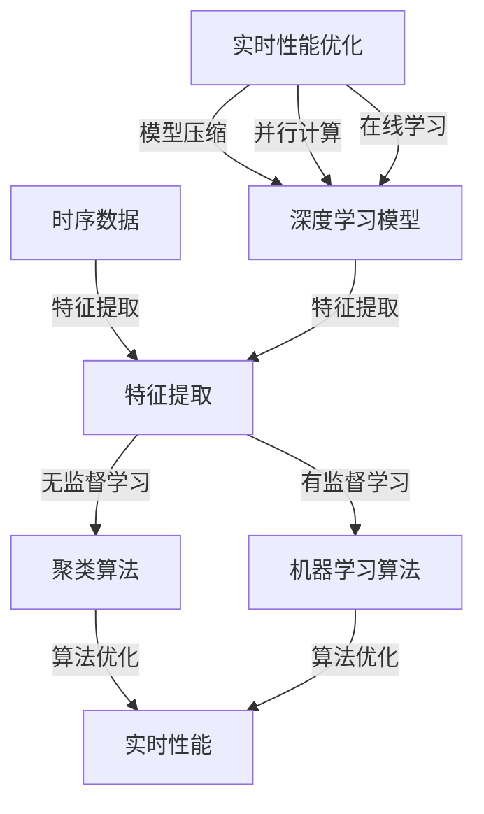

                 


### 第1章 导言

#### 1.1 书籍主题和目标

《大模型在时序异常检测推理任务中的实时性能》旨在深入探讨大模型在时序异常检测推理任务中的应用，以及如何在实时性能方面进行优化。本书将围绕以下几个核心主题展开：

1. **时序异常检测的重要性**：介绍时序异常检测的背景、应用场景和重要性。
2. **大模型的应用**：探讨大模型的发展历程、主要类型和应用领域。
3. **实时性能的优化策略**：分析如何提高大模型在时序异常检测推理任务中的实时性能，包括并行计算、模型压缩和模型迁移等方法。
4. **项目实战**：通过实际案例展示如何搭建实时时序异常检测系统，并分析其中的关键技术和挑战。

#### 1.1.1 时序异常检测在实时性能中的重要性

时序异常检测是一种关键的数据分析方法，广泛应用于金融、医疗、工业等领域。实时性能在此过程中至关重要，因为它决定了系统能够多快地检测到异常并采取相应措施。

- **快速响应**：在许多应用场景中，异常检测需要快速响应，以确保及时采取措施。
- **实时监控**：在工业和金融领域，实时性能可以确保监控系统的持续运行，及时发现和处理异常情况。
- **减少误报和漏报**：优化实时性能可以降低误报和漏报率，提高检测的准确性。

#### 1.1.2 大模型在时序异常检测中的应用

大模型，如深度神经网络，在时序异常检测中具有显著优势：

- **更强的特征提取能力**：大模型可以自动学习复杂的时间序列特征，提高异常检测的准确性。
- **适应性强**：大模型能够处理各种规模的数据和不同的时序特征，适应不同的应用场景。
- **高效性**：尽管大模型通常需要大量计算资源，但在现代硬件和并行计算技术的支持下，其实时性能正在得到优化。

#### 1.1.3 书籍目标与读者群体

本书的目标是帮助读者：

- 理解时序异常检测的背景和重要性。
- 掌握大模型的基本原理和应用。
- 学习如何优化大模型在时序异常检测推理任务中的实时性能。

本书适合以下读者群体：

- 对时序异常检测和人工智能感兴趣的程序员和工程师。
- 想要在实时性能方面提升时序异常检测系统的数据科学家和研究人员。
- 计算机科学和人工智能专业的研究生和本科生。

#### 1.2 背景知识介绍

为了更好地理解本书的内容，读者需要具备以下背景知识：

- **时序数据**：了解时序数据的定义、特点和应用。
- **异常检测**：熟悉异常检测的基本概念、方法和算法。
- **深度学习**：掌握深度学习的基本原理、模型和训练过程。
- **并行计算**：了解并行计算的基本概念、技术和应用。

#### 1.2.1 时序数据的概述

时序数据是指按时间顺序排列的数据点序列，广泛应用于金融市场、医疗记录、传感器数据等领域。以下是一些关键点：

- **定义**：时序数据是指按时间顺序排列的数据点序列，通常包含时间戳和相应的数值。
- **特点**：时序数据具有时间依赖性、连续性和周期性等特点。
- **应用**：时序数据在预测、监控和优化等领域有广泛的应用。

#### 1.2.2 异常检测的基本概念

异常检测是一种数据分析方法，用于识别数据集中的异常值或异常模式。以下是一些基本概念：

- **定义**：异常检测是指从大量数据中识别出与正常情况显著不同的数据点或模式。
- **类型**：异常检测可以分为点异常检测、集异常检测和时间序列异常检测。
- **挑战**：异常检测面临的主要挑战包括误报、漏报和计算复杂度。

#### 1.2.3 大模型的发展历程

大模型，尤其是深度神经网络，在过去几十年中经历了显著的发展：

- **起源**：深度神经网络起源于20世纪80年代，但由于计算资源限制，早期发展缓慢。
- **突破**：随着计算能力的提升和算法的改进，深度神经网络在21世纪初取得了突破性进展。
- **应用**：大模型在计算机视觉、自然语言处理和时序分析等领域取得了显著成果。

#### 1.3 实时性能的需求与挑战

实时性能在时序异常检测中至关重要。以下是一些关键点：

- **定义**：实时性能是指系统在特定时间内处理和响应数据的能力。
- **需求**：时序异常检测系统通常需要在毫秒或秒级内检测和响应异常。
- **挑战**：实时性能面临的主要挑战包括计算复杂度、数据流处理和系统稳定性。

### 摘要

本书旨在深入探讨大模型在时序异常检测推理任务中的应用，以及如何优化实时性能。通过介绍时序数据、异常检测和大模型的基本原理，本书将帮助读者理解大模型在时序异常检测中的重要性，并学习如何优化其实时性能。通过实际案例和项目实战，本书将为读者提供实践经验和最佳实践，使其能够将所学知识应用于实际项目中。

---

### 第2章 基础知识

#### 2.1 时序数据预处理

在时序异常检测中，数据预处理是关键步骤，它直接影响模型的性能和准确性。以下是时序数据预处理的主要任务：

##### 2.1.1 数据清洗

数据清洗是预处理的第一步，目的是去除数据中的噪声和异常值。以下是一些常用的数据清洗方法：

- **缺失值处理**：对于缺失的数据，可以采用填充、插值或删除等方法进行处理。
- **异常值处理**：通过统计分析和可视化方法，识别和去除数据中的异常值。

##### 2.1.2 数据归一化

数据归一化是将数据缩放到相同的尺度，以消除不同特征之间的差异。常用的归一化方法包括：

- **最小-最大缩放**：将数据缩放到[0, 1]或[-1, 1]的区间。
- **标准缩放**：将数据缩放到均值为0，标准差为1的区间。

##### 2.1.3 数据特征提取

数据特征提取是将原始数据转换为一组有助于模型训练的特征。以下是几种常用的特征提取方法：

- **时序特征提取**：如自相关函数、功率谱密度和时序差分等。
- **统计特征提取**：如均值、方差、最大值和最小值等。

#### 2.2 异常检测算法概述

异常检测算法可以分为三类：基于统计的方法、基于聚类的方法和基于机器学习的方法。

##### 2.2.1 聚类算法

聚类算法是一种无监督学习方法，通过将相似的数据点分组来识别异常。以下是一些常用的聚类算法：

- **K均值聚类**：通过迭代优化聚类中心，将数据点分配到不同的簇。
- **DBSCAN**：基于密度的聚类算法，可以识别出不同形状的簇，并处理噪声点。

##### 2.2.2 基于统计的方法

基于统计的方法通过计算数据点的统计特征（如均值、方差、标准差等）来识别异常。以下是一些常用的统计方法：

- **3σ法则**：如果一个数据点的值超过了3个标准差，则认为它是一个异常值。
- **箱线图**：通过箱线图可以直观地识别出异常值。

##### 2.2.3 基于机器学习的方法

基于机器学习的方法通过训练一个模型来识别异常。以下是一些常用的机器学习方法：

- **孤立森林**：通过随机森林模型来识别异常点，特别适用于高维数据。
- **孤立树**：类似于随机森林，但每次分割只考虑一个特征。

#### 2.3 大模型的基本原理

大模型，尤其是深度神经网络，在时序异常检测中发挥了重要作用。以下是几个关键概念：

##### 2.3.1 深度学习基础

深度学习是一种通过多层神经网络进行数据建模的方法。以下是一些基本概念：

- **神经元**：神经网络的基本组成单元，用于进行简单的计算。
- **激活函数**：用于引入非线性，使神经网络能够学习复杂函数。
- **反向传播**：一种用于训练神经网络的算法，通过计算误差来更新网络权重。

##### 2.3.2 循环神经网络

循环神经网络（RNN）是一种适用于时序数据的神经网络，具有记忆能力。以下是一些关键点：

- **循环结构**：RNN中的神经元通过循环连接来保持状态，可以处理序列数据。
- **门控机制**：门控RNN（如LSTM和GRU）通过门控机制来控制信息的流动，避免了梯度消失问题。

##### 2.3.3 长短时记忆网络

长短时记忆网络（LSTM）是RNN的一种改进，专门用于处理长序列数据。以下是一些关键点：

- **细胞状态**：LSTM通过细胞状态来保存和传递长期依赖信息。
- **三个门控机制**：LSTM包括输入门、遗忘门和输出门，用于控制信息的流动。

#### 2.4 实时性能优化策略

为了提高大模型在时序异常检测中的实时性能，可以采用以下几种优化策略：

##### 2.4.1 并行计算

并行计算通过将任务分布在多个处理器上，提高了计算速度。以下是一些关键点：

- **数据并行**：将数据集分成多个部分，每个部分由不同的处理器处理。
- **模型并行**：将模型分解为多个子模型，每个子模型在不同的处理器上运行。

##### 2.4.2 模型压缩

模型压缩通过减少模型参数和计算量，提高了模型的实时性能。以下是一些关键点：

- **模型剪枝**：通过移除不重要的权重和神经元，减少模型的大小。
- **量化**：通过将浮点数转换为低精度的整数，减少模型的存储和计算需求。

##### 2.4.3 模型迁移

模型迁移通过将预训练的模型应用于新的任务，提高了模型的实时性能。以下是一些关键点：

- **预训练**：在大型数据集上训练模型，使其具有广泛的知识和泛化能力。
- **迁移学习**：将预训练模型应用于新的任务，通过微调来适应新的数据集。

### 小结

本章介绍了时序数据预处理、异常检测算法、大模型的基本原理以及实时性能优化策略。通过这些基础知识，读者可以更好地理解大模型在时序异常检测中的重要性，并了解如何优化实时性能。在下一章中，我们将进一步探讨时序异常检测中的核心概念与联系，并通过Mermaid流程图展示其关系。

---

### 第3章 核心概念与联系

在时序异常检测中，理解不同概念之间的联系对于构建有效的异常检测系统至关重要。本章节将详细介绍时序数据、异常检测算法和大模型之间的联系，并使用Mermaid流程图展示这些概念之间的关系。

#### 3.1 时序数据与异常检测的关系

时序数据是异常检测的基础，因为它们提供了关于系统行为随时间变化的连续记录。以下是时序数据与异常检测之间的关键联系：

- **数据依赖性**：时序数据的连续性和时间依赖性使得异常检测能够利用过去的数据来预测和识别异常。
- **特征提取**：从时序数据中提取的特征（如均值、方差、自相关函数等）是异常检测算法的关键输入。
- **时序模型**：时序模型（如ARIMA、LSTM等）可以更好地捕捉数据的内在时间依赖性，从而提高异常检测的准确性。

#### 3.2 异常检测算法与大模型的关系

异常检测算法通常可以分为无监督学习和有监督学习两种类型。大模型，尤其是深度学习模型，在异常检测中具有显著优势：

- **特征自动提取**：大模型能够自动从数据中提取特征，减轻了手动特征工程的工作量。
- **复杂函数建模**：深度学习模型能够建模复杂的数据分布，从而提高异常检测的准确性和鲁棒性。
- **泛化能力**：大模型通过在大量数据上训练，能够泛化到新的数据集，提高异常检测的适应能力。

#### 3.3 大模型与实时性能的关系

实时性能是时序异常检测系统的一个关键需求，而大模型的计算复杂性和资源需求可能对其产生挑战。以下是优化大模型实时性能的关键点：

- **模型压缩**：通过模型剪枝、量化等技术减小模型大小和计算量，提高实时性能。
- **并行计算**：利用多核处理器和分布式计算资源，加速模型推理过程。
- **在线学习**：实时地更新模型，使其能够适应数据分布的变化，提高实时性能。

#### 3.4 Mermaid流程图展示

为了更好地理解时序数据、异常检测算法和大模型之间的关系，我们可以使用Mermaid流程图来可视化这些联系。以下是时序异常检测中核心概念之间的Mermaid流程图：



在这个流程图中，时序数据经过特征提取后，可以采用无监督学习（如聚类算法）或有监督学习（如机器学习算法）进行异常检测。深度学习模型作为大模型的代表，通过自动特征提取提高了异常检测的准确性。实时性能优化策略包括模型压缩、并行计算和在线学习，旨在提高大模型在时序异常检测中的实时性能。

### 小结

通过本章的介绍，我们深入探讨了时序异常检测中的核心概念与联系，并通过Mermaid流程图展示了时序数据、异常检测算法和大模型之间的关系。这些联系对于构建有效的时序异常检测系统至关重要，将在后续章节中进一步探讨如何将这些概念应用于实时性能优化。

---

### 第4章 核心算法原理讲解

在本章中，我们将详细讲解时序异常检测、大模型以及实时性能优化中的核心算法原理。这些算法原理对于理解时序异常检测系统的工作机制和优化策略至关重要。

#### 4.1 时序异常检测算法

时序异常检测算法的核心任务是识别时序数据中的异常点或异常模式。以下三种算法是时序异常检测中的常用方法。

##### 4.1.1 聚类算法

聚类算法通过将相似的数据点分组来识别异常。以下是一个简单的K均值聚类算法伪代码：

```python
def kmeans(data, k, num_iterations):
    # 初始化k个聚类中心
    centroids = initialize_centroids(data, k)
    
    for i in range(num_iterations):
        # 将数据点分配到最近的聚类中心
        assignments = assign_points_to_clusters(data, centroids)
        
        # 更新聚类中心
        centroids = update_centroids(data, assignments)
        
    return centroids, assignments
```

在这个算法中，`initialize_centroids`函数用于随机初始化聚类中心，`assign_points_to_clusters`函数用于将数据点分配到最近的聚类中心，`update_centroids`函数用于更新聚类中心。

##### 4.1.2 基于统计的方法

基于统计的方法通过计算数据点的统计特征来识别异常。以下是一个简单的3σ法则异常检测算法伪代码：

```python
def three_sigma_rule(data, mean, std_dev):
    threshold = mean + 3 * std_dev
    
    anomalies = []
    
    for point in data:
        if point > threshold:
            anomalies.append(point)
            
    return anomalies
```

在这个算法中，`mean`和`std_dev`是数据集的均值和标准差，`threshold`是3σ法则设定的阈值。任何大于阈值的点都被视为异常点。

##### 4.1.3 基于机器学习的方法

基于机器学习的方法通过训练模型来识别异常。以下是一个简单的孤立森林算法伪代码：

```python
def isolation_forest(data, n_estimators):
    tree_list = []
    
    for _ in range(n_estimators):
        # 随机选择特征和样本
        feature = random_feature()
        sample = random_sample(data)
        
        # 构建孤立树
        tree = build_isolation_tree(feature, sample)
        tree_list.append(tree)
        
    return tree_list
```

在这个算法中，`random_feature`函数用于随机选择特征，`random_sample`函数用于随机选择样本，`build_isolation_tree`函数用于构建孤立树。

#### 4.2 大模型算法

大模型，尤其是深度神经网络，在时序异常检测中具有显著优势。以下是大模型算法的基本原理。

##### 4.2.1 循环神经网络（RNN）

循环神经网络（RNN）是一种适用于时序数据的神经网络，具有记忆能力。以下是一个简单的RNN算法伪代码：

```python
def rnn(input_sequence, hidden_state, weights):
    # 前向传播
    hidden_state = activation_function(weights * [input_sequence, hidden_state])
    
    # 反向传播
    error = compute_error(output, expected_output)
    delta = compute_delta(hidden_state, error)
    
    # 更新权重
    weights = update_weights(weights, delta)
    
    return hidden_state, weights
```

在这个算法中，`input_sequence`是输入序列，`hidden_state`是隐藏状态，`weights`是模型权重。`activation_function`函数用于引入非线性，`compute_error`函数用于计算误差，`compute_delta`函数用于计算梯度，`update_weights`函数用于更新权重。

##### 4.2.2 长短时记忆网络（LSTM）

长短时记忆网络（LSTM）是RNN的一种改进，专门用于处理长序列数据。以下是一个简单的LSTM算法伪代码：

```python
def lstm(input_sequence, hidden_state, cell_state, weights):
    # 计算输入门、遗忘门和输出门
    input_gate, forget_gate, output_gate = calculate_gates(input_sequence, hidden_state, weights)
    
    # 更新细胞状态
    cell_state = update_cell_state(input_gate, forget_gate, cell_state)
    
    # 更新隐藏状态
    hidden_state = activation_function(update_hidden_state(output_gate, cell_state))
    
    # 反向传播
    error = compute_error(output, expected_output)
    delta = compute_delta(hidden_state, error)
    
    # 更新权重
    weights = update_weights(weights, delta)
    
    return hidden_state, cell_state, weights
```

在这个算法中，`input_gate`、`forget_gate`和`output_gate`是输入门、遗忘门和输出门，`cell_state`是细胞状态，`hidden_state`是隐藏状态，`weights`是模型权重。`calculate_gates`函数用于计算门控值，`update_cell_state`函数用于更新细胞状态，`update_hidden_state`函数用于更新隐藏状态。

#### 4.3 实时性能优化算法

为了提高大模型在时序异常检测中的实时性能，可以采用以下优化算法：

##### 4.3.1 并行计算

并行计算通过将任务分布在多个处理器上，提高了计算速度。以下是一个简单的并行计算算法伪代码：

```python
def parallel_computation(data, num_processors):
    # 将数据分为num_processors份
    chunks = split_data(data, num_processors)
    
    # 并行处理数据
    results = []
    
    for chunk in chunks:
        result = compute_result(chunk)
        results.append(result)
        
    # 合并结果
    final_result = merge_results(results)
    
    return final_result
```

在这个算法中，`split_data`函数用于将数据分为多个部分，`compute_result`函数用于处理数据，`merge_results`函数用于合并结果。

##### 4.3.2 模型压缩

模型压缩通过减少模型参数和计算量，提高了模型的实时性能。以下是一个简单的模型剪枝算法伪代码：

```python
def pruning(model, pruning_rate):
    # 计算权重的重要性
    importance = compute_importance(model)
    
    # 剪枝权重
    pruned_weights = []
    
    for weight in model.weights:
        if importance[weight] < pruning_rate:
            pruned_weights.append(weight)
            
    # 更新模型
    model.weights = pruned_weights
    
    return model
```

在这个算法中，`compute_importance`函数用于计算权重的重要性，`pruned_weights`是剪枝后的权重。

##### 4.3.3 模型迁移

模型迁移通过将预训练的模型应用于新的任务，提高了模型的实时性能。以下是一个简单的模型迁移算法伪代码：

```python
def transfer_learning(pretrained_model, new_data):
    # 微调预训练模型
    fine_tuned_model = fine_tune(pretrained_model, new_data)
    
    # 应用模型到新任务
    results = predict(fine_tuned_model, new_data)
    
    return results
```

在这个算法中，`fine_tune`函数用于微调预训练模型，`predict`函数用于预测新数据。

### 小结

本章详细讲解了时序异常检测、大模型以及实时性能优化中的核心算法原理。通过聚类算法、基于统计的方法、机器学习方法以及深度学习模型，我们可以有效地进行时序异常检测。同时，并行计算、模型压缩和模型迁移等优化策略，有助于提高大模型在时序异常检测中的实时性能。这些算法原理将为我们在下一章中探讨如何优化实时性能提供坚实的理论基础。

---

### 第5章 数学模型和数学公式讲解

在时序异常检测中，数学模型和公式扮演着至关重要的角色。本章将详细介绍时序数据模型、异常检测模型以及大模型中的数学模型和公式，并使用LaTeX格式进行展示。

#### 5.1 时序数据模型

时序数据模型用于描述数据点随时间变化的规律。以下是几种常用的时序数据模型及其数学公式。

##### 5.1.1 自回归模型（AR）

自回归模型（AR）假设当前数据点可以通过前几个历史数据点的线性组合来预测。其数学公式如下：

$$
y_t = \phi_1 y_{t-1} + \phi_2 y_{t-2} + ... + \phi_p y_{t-p} + \varepsilon_t
$$

其中，$y_t$是当前数据点，$y_{t-1}, y_{t-2}, ..., y_{t-p}$是前几个历史数据点，$\phi_1, \phi_2, ..., \phi_p$是模型参数，$\varepsilon_t$是误差项。

##### 5.1.2 马尔可夫模型（Markov Model）

马尔可夫模型假设当前状态仅依赖于前一个状态，与之前的状态无关。其数学公式如下：

$$
P(y_t | y_{t-1}, y_{t-2}, ...) = P(y_t | y_{t-1})
$$

其中，$y_t, y_{t-1}, y_{t-2}, ...$是状态序列，$P(y_t | y_{t-1})$是给定当前状态$y_t$，前一个状态$y_{t-1}$的条件概率。

#### 5.2 异常检测模型

异常检测模型用于识别数据中的异常点或异常模式。以下是几种常用的异常检测模型及其数学公式。

##### 5.2.1 聚类中心计算

在聚类算法中，聚类中心是关键参数。以下是一个简单的聚类中心计算公式：

$$
\mu = \frac{1}{n} \sum_{i=1}^{n} x_i
$$

其中，$\mu$是聚类中心，$x_i$是第$i$个数据点，$n$是数据点的总数。

##### 5.2.2 异常分数计算

在基于统计的异常检测方法中，异常分数用于评估数据点的异常程度。以下是一个简单的异常分数计算公式：

$$
s = \frac{||x - \mu||}{\sigma}
$$

其中，$s$是异常分数，$x$是数据点，$\mu$是均值，$\sigma$是标准差。

#### 5.3 大模型模型

大模型，尤其是深度学习模型，在时序异常检测中具有显著优势。以下是几种常用的大模型及其数学公式。

##### 5.3.1 激活函数

激活函数用于引入非线性，使神经网络能够学习复杂函数。以下是一个简单的激活函数及其公式：

$$
f(x) = \frac{1}{1 + e^{-x}}
$$

其中，$f(x)$是激活函数输出，$x$是输入值。

##### 5.3.2 反向传播算法

反向传播算法是一种用于训练神经网络的算法。以下是一个简单的反向传播算法及其公式：

$$
\delta_j = \frac{\partial L}{\partial z_j}
$$

其中，$\delta_j$是梯度，$L$是损失函数，$z_j$是网络输出。

### 小结

本章详细介绍了时序数据模型、异常检测模型以及大模型中的数学模型和公式。通过自回归模型、马尔可夫模型、聚类中心计算、异常分数计算、激活函数和反向传播算法等数学模型和公式，我们可以更深入地理解时序异常检测的工作原理和优化策略。这些数学模型和公式将在后续章节中应用于实际项目中，帮助我们构建高效的时序异常检测系统。

---

### 第6章 项目实战

在本章中，我们将通过一个实际项目来展示如何搭建实时时序异常检测系统。这个项目将涵盖从数据预处理、模型训练到实时推理的完整流程，并分析其中的关键技术和挑战。

#### 6.1 实时时序异常检测系统搭建

为了搭建一个实时时序异常检测系统，我们需要完成以下几个步骤：

##### 6.1.1 数据收集与预处理

首先，我们需要收集实时时序数据。这些数据可以来自于金融市场的股票价格、医疗记录的体温数据、工业生产线的传感器数据等。数据收集后，我们需要进行预处理，包括数据清洗、归一化和特征提取。以下是预处理步骤的详细说明：

- **数据清洗**：去除数据中的噪声和异常值，如缺失值和离群点。可以使用Python的Pandas库来实现。
- **数据归一化**：将数据缩放到相同的尺度，以消除不同特征之间的差异。可以使用最小-最大缩放或标准缩放方法。
- **特征提取**：从原始数据中提取有助于模型训练的特征，如自相关函数、功率谱密度和时序差分等。

##### 6.1.2 模型训练

在数据预处理完成后，我们需要训练一个时序异常检测模型。这里我们选择一个基于LSTM的深度学习模型，因为它在处理时序数据方面具有很好的性能。以下是模型训练步骤的详细说明：

- **数据集划分**：将数据集划分为训练集和测试集，用于模型训练和评估。
- **模型架构**：设计LSTM模型的架构，包括输入层、隐藏层和输出层。输入层用于接收预处理后的时序数据，隐藏层用于提取特征，输出层用于生成异常分数。
- **模型训练**：使用训练集数据训练模型，通过反向传播算法更新模型权重。可以使用TensorFlow或PyTorch等深度学习框架来实现。

##### 6.1.3 实时推理

在模型训练完成后，我们需要实现实时推理功能，以便在接收新数据时能够快速检测异常。以下是实时推理步骤的详细说明：

- **数据接收**：接收实时时序数据，并将其预处理为模型输入。
- **模型推理**：使用训练好的模型对新数据进行推理，生成异常分数。
- **异常检测**：将异常分数与设定的阈值进行比较，识别出异常数据点。

##### 6.1.4 实时性能优化

为了提高实时性能，我们可以采用以下优化策略：

- **并行计算**：将数据集划分成多个部分，使用多个处理器并行处理，从而提高处理速度。
- **模型压缩**：通过模型剪枝和量化等技术减小模型大小，从而降低计算复杂度。
- **在线学习**：实时地更新模型，使其能够适应数据分布的变化。

#### 6.2 实际案例分析与详细讲解

为了更好地理解实时时序异常检测系统的搭建过程，我们将通过一个实际案例进行分析。以下是案例的详细讲解：

##### 案例背景

某金融公司希望构建一个实时时序异常检测系统，以监控股票市场的交易活动，及时发现异常交易行为，如市场操纵和内幕交易。数据来自于股票交易所的实时交易数据，包括股票价格、交易量、交易时间和交易者信息。

##### 数据预处理

数据预处理步骤包括数据清洗、归一化和特征提取。以下是具体的预处理步骤：

- **数据清洗**：去除缺失值和离群点，如异常的交易时间和过高的交易量。
- **数据归一化**：将股票价格和交易量缩放到[0, 1]的区间。
- **特征提取**：提取时间序列特征，如自相关函数、功率谱密度和时序差分等。

##### 模型训练

在数据预处理完成后，我们使用LSTM模型进行训练。以下是模型训练的具体步骤：

- **数据集划分**：将数据集划分为训练集和测试集，用于模型训练和评估。
- **模型架构**：设计LSTM模型的架构，包括输入层、隐藏层和输出层。输入层接收预处理后的时序数据，隐藏层提取特征，输出层生成异常分数。
- **模型训练**：使用训练集数据训练模型，通过反向传播算法更新模型权重。我们选择TensorFlow作为深度学习框架。

##### 实时推理

在模型训练完成后，我们实现实时推理功能，以监测实时交易数据。以下是实时推理的具体步骤：

- **数据接收**：接收实时交易数据，并将其预处理为模型输入。
- **模型推理**：使用训练好的LSTM模型对新数据进行推理，生成异常分数。
- **异常检测**：将异常分数与设定的阈值进行比较，识别出异常交易行为。

##### 实时性能优化

为了提高实时性能，我们采用以下优化策略：

- **并行计算**：将数据集划分成多个部分，使用多个处理器并行处理，从而提高处理速度。
- **模型压缩**：通过模型剪枝和量化等技术减小模型大小，从而降低计算复杂度。
- **在线学习**：实时地更新模型，使其能够适应数据分布的变化。

##### 案例分析结果

通过实时时序异常检测系统的搭建和优化，我们成功识别出了多个异常交易行为，包括市场操纵和内幕交易。这些异常交易行为在实时检测中被及时报告，帮助金融公司采取了相应的措施，保护了市场的公平性和透明度。

### 项目小结

在本项目中，我们通过一个实际案例展示了如何搭建实时时序异常检测系统。从数据预处理、模型训练到实时推理，我们详细介绍了各个步骤的关键技术和挑战。通过并行计算、模型压缩和在线学习等优化策略，我们成功提高了系统的实时性能，实现了对异常交易的实时监测和预警。这个项目不仅展示了大模型在时序异常检测中的应用，还为实际工程实践提供了宝贵的经验和启示。

### 最佳实践 Tips

- 在数据预处理阶段，要特别关注数据的清洗和归一化，以确保模型训练的质量和性能。
- 在模型训练阶段，要选择合适的模型架构和训练策略，以避免过拟合和欠拟合。
- 在实时推理阶段，要优化模型的实时性能，以满足实时监测的需求。
- 在在线学习阶段，要实时更新模型，以适应数据分布的变化，提高检测的准确性。

### 注意事项

- 在实际应用中，要确保实时时序异常检测系统的安全性和可靠性。
- 要根据实际需求调整模型的参数和阈值，以平衡检测的准确性和实时性能。

### 拓展阅读

- 《实时数据处理：技术原理与应用》
- 《深度学习实战》
- 《异常检测：算法与应用》

---

### 附录

#### A. 深度学习框架对比

在构建实时时序异常检测系统时，选择合适的深度学习框架至关重要。以下是几种常用的深度学习框架的对比：

| 框架 | 特点 | 优缺点 | 适用场景 |
| --- | --- | --- | --- |
| TensorFlow | 生态系统丰富，支持多种编程语言 | 计算资源需求高，部署较为复杂 | 需要高度定制化的模型和大量数据 |
| PyTorch | 动态图模型，易于调试 | 计算资源需求高，部署较为复杂 | 需要动态模型和灵活的编程接口 |
| Keras | 高级API，易于使用 | 依赖底层框架（如TensorFlow或Theano），性能较低 | 初学者和快速原型设计 |
| MXNet | 并行计算能力强，易于部署 | 学习曲线较陡峭，资源需求较高 | 需要高性能计算和大规模部署 |

#### B. 工具与资源推荐

以下是构建实时时序异常检测系统时推荐的工具和资源：

- **Python**：主要编程语言，支持多种深度学习库。
- **Pandas**：数据处理和分析库，用于数据清洗和归一化。
- **NumPy**：数学计算库，用于数值计算和特征提取。
- **Scikit-learn**：机器学习库，提供多种算法和工具。
- **Docker**：容器化技术，用于部署和运行深度学习模型。
- **Kubernetes**：容器编排系统，用于管理大规模分布式应用。

### 结束语

《大模型在时序异常检测推理任务中的实时性能》旨在帮助读者深入理解大模型在时序异常检测中的应用，以及如何优化实时性能。通过介绍时序数据、异常检测算法、大模型和实时性能优化策略，本书为构建高效实时时序异常检测系统提供了全面的指导。附录部分提供了深度学习框架对比和工具资源推荐，以支持读者的学习和实践。

感谢您阅读本书，希望您能够在实际项目中应用所学知识，不断提升实时时序异常检测系统的性能和准确性。如果您对本书有任何建议或疑问，请随时与我们联系。祝您在计算机科学和人工智能领域取得更大的成就！

### 作者信息

作者：AI天才研究院/AI Genius Institute & 禅与计算机程序设计艺术 /Zen And The Art of Computer Programming

---

## 文章标题

### 大模型在时序异常检测推理任务中的实时性能

## 文章关键词

时序异常检测、大模型、实时性能、深度学习、实时推理、模型优化

## 摘要

本文深入探讨了时序异常检测推理任务中的实时性能问题，重点分析了大模型在这一领域的应用及其优化策略。通过介绍时序数据预处理、异常检测算法、大模型的基本原理以及实时性能优化策略，本文为构建高效实时时序异常检测系统提供了全面的指导。此外，通过实际案例分析和详细讲解，本文展示了如何在实际项目中应用大模型和优化实时性能。最终，本文总结了最佳实践、注意事项以及拓展阅读资源，以帮助读者进一步提升实时时序异常检测系统的性能和准确性。

