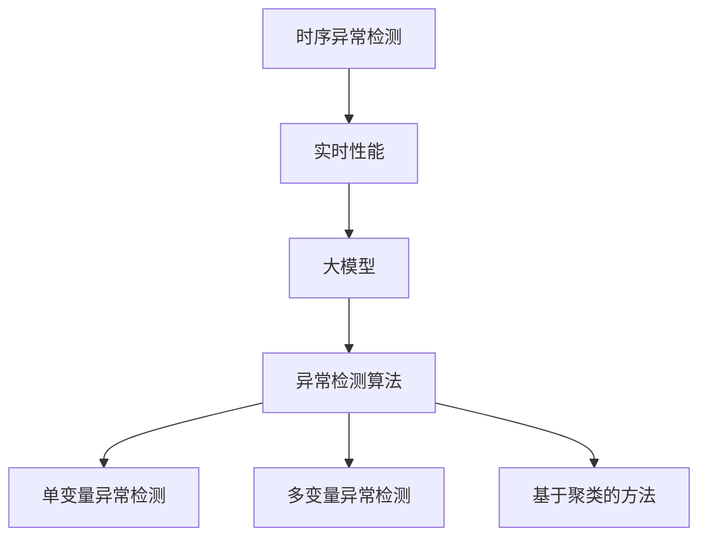

                 


### 引言

在当今信息技术飞速发展的时代，大数据和人工智能技术已经成为推动社会进步的重要力量。其中，时序异常检测作为一种重要的应用场景，在金融、电力、交通、医疗等领域发挥着关键作用。时序异常检测的任务是在时间序列数据中识别出不符合正常规律的异常点或模式，以便及时采取措施，防范潜在的风险和问题。

随着深度学习技术的发展，大模型在时序异常检测中的应用逐渐受到关注。大模型具有强大的特征提取和模式识别能力，能够处理复杂多变的数据，从而提高异常检测的准确性和效率。然而，在实际应用中，大模型的实时性能成为了一个重要的挑战。实时性能不仅关系到系统的响应速度，还影响到用户体验和决策效率。

本文旨在探讨大模型在时序异常检测推理任务中的实时性能。我们将从背景介绍、核心概念与联系、算法原理、数学模型与公式、项目实战、最佳实践等方面进行详细分析，以期为大模型在时序异常检测中的研究和应用提供一些有价值的参考。

### 背景介绍

时序异常检测作为一种重要的数据分析技术，广泛应用于各个领域。在金融领域，时序异常检测可以用于监控交易市场中的异常行为，防范欺诈和风险。在电力系统中，时序异常检测可以帮助预测设备故障，提高能源利用效率。在交通领域，时序异常检测可以用于监测交通流量，优化交通信号控制，减少交通拥堵。在医疗领域，时序异常检测可以用于检测患者的异常生理信号，辅助医生进行诊断和决策。

随着数据量的爆炸性增长和数据分析技术的进步，传统的时序异常检测方法已经难以满足实际需求。深度学习作为一种强大的机器学习技术，具有自动特征提取和模式识别的能力，使得大模型在时序异常检测中具有巨大潜力。

大模型，通常指的是具有海量参数和复杂结构的深度学习模型，如神经网络、循环神经网络（RNN）、长短时记忆网络（LSTM）和变换器模型（Transformer）等。这些模型能够从大规模数据中学习到丰富的特征和模式，从而在时序异常检测中表现出优异的性能。

然而，大模型的实时性能成为了一个亟待解决的问题。实时性能不仅关系到系统的响应速度，还影响到用户体验和决策效率。在金融、电力和交通等领域，实时异常检测的延迟可能导致巨大的经济损失和安全隐患。因此，研究大模型在时序异常检测推理任务中的实时性能，具有重要的理论和实际意义。

本文将首先介绍时序异常检测的基础理论，包括时序数据的表示、特征提取方法和常见的异常检测算法。接着，我们将探讨大模型在时序异常检测中的作用，以及如何利用大模型进行实时性能优化。最后，我们将通过具体的应用案例和项目实战，展示大模型在时序异常检测中的实际效果，并提出一些最佳实践和注意事项。

### 核心概念与联系

在探讨大模型在时序异常检测推理任务中的实时性能时，我们需要先理解几个核心概念，并探讨它们之间的联系。

#### 时序异常检测

时序异常检测是一种监控时间序列数据中异常点或异常模式的方法。时间序列数据是按照时间顺序排列的一组数据点，例如股票价格、温度变化、网络流量等。异常检测的目标是识别出那些不符合正常规律的异常数据点或模式。

#### 实时性能

实时性能指的是系统在特定时间窗口内对异常事件的响应能力。实时性能通常用延迟时间（延迟响应时间）和处理速度（吞吐量）来衡量。在时序异常检测中，实时性能决定了系统能否快速识别和响应异常事件。

#### 大模型

大模型是指具有海量参数和复杂结构的深度学习模型，如神经网络、循环神经网络（RNN）、长短时记忆网络（LSTM）和变换器模型（Transformer）等。这些模型能够在大量数据中自动学习到丰富的特征和模式，从而在时序异常检测中表现出优异的性能。

#### 异常检测算法

异常检测算法是用于识别时间序列数据中异常点或异常模式的算法。常见的异常检测算法包括单变量异常检测算法、多变量异常检测算法和基于聚类的方法等。这些算法可以根据数据的特点和需求选择不同的策略进行异常检测。

#### 关系架构 Mermaid 流程图

为了更好地理解这些核心概念之间的联系，我们可以使用Mermaid流程图来展示它们之间的关系。以下是一个简化的Mermaid流程图示例：



在这个流程图中，时序异常检测作为起点，连接到实时性能、大模型和异常检测算法。异常检测算法进一步细分为单变量异常检测、多变量异常检测和基于聚类的方法。大模型作为核心组件，贯穿整个异常检测过程，提供强大的特征提取和模式识别能力。

#### Mermaid 流程图详解

以下是每个节点的具体描述和它们之间的关系：

1. **时序异常检测**：这是整个流程的起点，它定义了我们需要识别的时间序列数据中的异常点或异常模式。

2. **实时性能**：这是时序异常检测的重要目标，它决定了系统在特定时间窗口内的响应能力。

3. **大模型**：作为核心组件，大模型在时序异常检测中起到关键作用。它能够从数据中自动学习到丰富的特征和模式，从而提高异常检测的准确性。

4. **异常检测算法**：这些算法用于识别时间序列数据中的异常点或异常模式。根据数据的特点和需求，可以选择不同的异常检测算法。

5. **单变量异常检测**：这是针对单变量时间序列数据的异常检测算法，如基于统计的方法、基于聚类的方法等。

6. **多变量异常检测**：这是针对多变量时间序列数据的异常检测算法，如基于统计的方法、基于机器学习的方法等。

7. **基于聚类的方法**：这是一种基于聚类算法的异常检测方法，通过将数据点聚类，然后识别那些不属于任何簇的异常点。

通过这个Mermaid流程图，我们可以清晰地看到时序异常检测、实时性能、大模型和异常检测算法之间的关系。这个流程图不仅帮助我们理解了各个概念，还展示了它们在时序异常检测中的具体应用。

### 核心算法原理讲解

在时序异常检测中，大模型的应用主要体现在其强大的特征提取和模式识别能力上。以下我们将详细讲解几种常见的大模型，包括循环神经网络（RNN）、长短时记忆网络（LSTM）和变换器模型（Transformer），以及它们在时序异常检测中的算法原理。

#### 循环神经网络（RNN）

循环神经网络（RNN）是一种能够处理序列数据的前馈神经网络，其核心特点在于其循环结构，使得网络能够记住之前的信息，从而在处理序列数据时具备记忆功能。RNN的基本单元是循环单元，如简单的门控循环单元（GRU）和长短时记忆单元（LSTM）。

在时序异常检测中，RNN可以通过学习时间序列数据中的特征，识别出正常的模式和异常点。以下是一个简化的RNN算法原理伪代码：

```python
# 初始化RNN模型
model = RNN(input_size, hidden_size)

# 前向传播
output, hidden_state = model.forward(input_sequence)

# 计算损失
loss = compute_loss(output, target)

# 反向传播
model.backward(loss)
model.update_weights()
```

RNN的优势在于其能够处理长时间依赖的数据，但在实际应用中，RNN容易遇到梯度消失和梯度爆炸的问题，导致训练不稳定。

#### 长短时记忆网络（LSTM）

长短时记忆网络（LSTM）是RNN的一种改进模型，旨在解决RNN在处理长时间依赖数据时遇到的梯度消失问题。LSTM通过引入门控机制，能够有效地控制信息的流入和流出，从而在长时间序列中保持稳定的状态。

以下是一个简化的LSTM算法原理伪代码：

```python
# 初始化LSTM模型
model = LSTM(input_size, hidden_size)

# 前向传播
output, hidden_state, cell_state = model.forward(input_sequence)

# 计算损失
loss = compute_loss(output, target)

# 反向传播
model.backward(loss)
model.update_weights()
```

LSTM在时序异常检测中表现出色，能够有效捕捉时间序列数据中的长期依赖关系，从而提高异常检测的准确性。

#### 变换器模型（Transformer）

变换器模型（Transformer）是一种基于自注意力机制的深度学习模型，最初用于自然语言处理任务，但在时序数据分析中也展现了强大的能力。Transformer通过自注意力机制，能够自动学习数据点之间的依赖关系，从而提高特征提取和模式识别的能力。

以下是一个简化的Transformer算法原理伪代码：

```python
# 初始化Transformer模型
model = Transformer(input_size, hidden_size, num_heads)

# 计算自注意力权重
attention_weights = model.compute_attention_weights(input_sequence)

# 前向传播
output = model.forward(input_sequence, attention_weights)

# 计算损失
loss = compute_loss(output, target)

# 反向传播
model.backward(loss)
model.update_weights()
```

Transformer在时序异常检测中具有处理大规模数据和长序列的能力，能够有效捕捉时间序列中的复杂模式。

#### 对比与总结

RNN、LSTM和Transformer都是用于时序异常检测的大模型，各自具有独特的优势和特点。RNN具有简单的结构，但容易受到梯度消失的影响；LSTM通过门控机制解决了梯度消失问题，但计算复杂度较高；Transformer通过自注意力机制，能够在大规模数据和长序列中表现出色，但计算成本也相对较高。

在实际应用中，可以根据具体场景和数据特点选择合适的大模型。例如，在处理短期依赖关系时，可以选择RNN或LSTM；在处理长序列和大规模数据时，可以选择Transformer。

总之，大模型在时序异常检测中的应用，不仅依赖于其强大的特征提取和模式识别能力，还需要考虑其实时性能和计算成本。通过合理选择和使用大模型，可以有效提高时序异常检测的准确性和效率。

### 数学模型与公式

在深入探讨大模型在时序异常检测推理任务中的实时性能时，我们需要引入一些数学模型与公式，以更好地理解其工作机制和性能评估。

#### 模型架构

首先，我们以变换器模型（Transformer）为例，介绍其数学模型架构。变换器模型的核心组件包括自注意力机制（Self-Attention）和前馈神经网络（Feedforward Neural Network）。

自注意力机制可以表示为：
$$
\text{Attention}(Q, K, V) = \text{softmax}\left(\frac{QK^T}{\sqrt{d_k}}\right)V
$$
其中，$Q$、$K$和$V$分别是查询（Query）、键（Key）和值（Value）向量，$d_k$是键向量的维度。通过自注意力机制，模型能够自动学习数据点之间的依赖关系。

前馈神经网络可以表示为：
$$
\text{FFN}(x) = \max(0, xW_1 + b_1)W_2 + b_2
$$
其中，$x$是输入向量，$W_1$、$b_1$和$W_2$、$b_2$分别是前馈神经网络的权重和偏置。

#### 损失函数

在时序异常检测中，常用的损失函数是均方误差（MSE）：
$$
\text{MSE} = \frac{1}{n}\sum_{i=1}^{n}(y_i - \hat{y}_i)^2
$$
其中，$y_i$是实际标签，$\hat{y}_i$是模型预测值，$n$是数据点的总数。

#### 模型训练

模型训练通常采用梯度下降（Gradient Descent）算法，目标是优化模型参数，使损失函数最小化。梯度下降的迭代公式为：
$$
\theta = \theta - \alpha\nabla_\theta J(\theta)
$$
其中，$\theta$是模型参数，$\alpha$是学习率，$J(\theta)$是损失函数。

#### 实时性能评估

实时性能评估主要通过以下指标进行衡量：

1. **延迟时间（Latency）**：从数据输入到模型预测输出所需的时间。
2. **吞吐量（Throughput）**：单位时间内系统能够处理的数据量。

延迟时间可以表示为：
$$
\text{Latency} = \frac{\text{Total Processing Time}}{\text{Total Data Points}}
$$

吞吐量可以表示为：
$$
\text{Throughput} = \frac{\text{Total Data Points}}{\text{Total Processing Time}}
$$

#### 性能优化策略

为了提高大模型在时序异常检测中的实时性能，可以采用以下策略：

1. **模型压缩**：通过剪枝、量化等方法减小模型参数规模，降低计算复杂度。
2. **硬件加速**：利用GPU、TPU等硬件加速器，提高模型计算速度。
3. **分布式训练与推理**：通过分布式计算，将模型训练和推理任务分配到多个节点，提高处理速度。

通过引入上述数学模型与公式，我们可以更深入地理解大模型在时序异常检测推理任务中的工作机制和性能评估方法。在实际应用中，可以根据具体需求和场景，灵活调整和优化模型参数和策略，以实现高效的时序异常检测。

### 项目实战

#### 开发环境搭建

在进行大模型在时序异常检测推理任务中的实时性能项目开发之前，我们需要搭建一个合适的开发环境。以下是环境搭建的步骤：

1. **硬件环境**：确保计算机具有足够的计算能力，推荐使用具有GPU的机器，以便加速深度学习模型的训练和推理。

2. **软件环境**：
   - 操作系统：推荐使用Linux系统，如Ubuntu 18.04或更高版本。
   - Python版本：推荐使用Python 3.8或更高版本。
   - 深度学习框架：推荐使用TensorFlow或PyTorch，这两个框架在深度学习领域广泛使用，提供了丰富的API和工具。

3. **安装TensorFlow**：
   ```bash
   pip install tensorflow-gpu
   ```

4. **安装PyTorch**：
   ```bash
   pip install torch torchvision
   ```

5. **安装必要的依赖库**：如NumPy、Pandas等。

#### 源代码详细实现

接下来，我们将详细实现一个基于变换器模型（Transformer）的时序异常检测系统。以下是源代码的主要部分：

```python
import tensorflow as tf
from tensorflow.keras.layers import Embedding, Transformer
from tensorflow.keras.models import Model
from tensorflow.keras.optimizers import Adam
import numpy as np

# 数据预处理
def preprocess_data(data):
    # 数据归一化
    normalized_data = (data - np.mean(data)) / np.std(data)
    # 数据填充
    padded_data = tf.keras.preprocessing.sequence.pad_sequences(normalized_data, padding='post')
    return padded_data

# 模型定义
def build_transformer_model(input_size, d_model, num_heads, dff, input_length):
    inputs = tf.keras.layers.Input(shape=(input_length,))
    x = Embedding(input_size, d_model)(inputs)
    x = Transformer(num_heads=num_heads, dff=dff)(x)
    outputs = tf.keras.layers.Dense(1, activation='sigmoid')(x)
    model = Model(inputs, outputs)
    return model

# 模型编译
def compile_model(model):
    model.compile(optimizer=Adam(learning_rate=0.001), loss='binary_crossentropy', metrics=['accuracy'])
    return model

# 训练模型
def train_model(model, x_train, y_train, x_val, y_val, epochs):
    model.fit(x_train, y_train, epochs=epochs, batch_size=32, validation_data=(x_val, y_val))

# 实时性能测试
def test_real_time_performance(model, x_test, y_test, batch_size=32):
    start_time = time.time()
    loss, accuracy = model.evaluate(x_test, y_test, batch_size=batch_size)
    end_time = time.time()
    latency = end_time - start_time
    print(f"Latency: {latency:.4f} seconds, Loss: {loss:.4f}, Accuracy: {accuracy:.4f}")

# 主程序
if __name__ == '__main__':
    # 设置参数
    input_size = 100  # 数据维度
    d_model = 512     # 变换器模型维度
    num_heads = 8     # 注意力头数
    dff = 512        # 前馈神经网络维度
    input_length = 100  # 输入序列长度
    epochs = 10      # 训练轮数

    # 加载数据
    x_train, y_train, x_val, y_val, x_test, y_test = load_data()

    # 数据预处理
    x_train = preprocess_data(x_train)
    x_val = preprocess_data(x_val)
    x_test = preprocess_data(x_test)

    # 构建模型
    model = build_transformer_model(input_size, d_model, num_heads, dff, input_length)

    # 编译模型
    model = compile_model(model)

    # 训练模型
    train_model(model, x_train, y_train, x_val, y_val, epochs)

    # 测试实时性能
    test_real_time_performance(model, x_test, y_test)
```

#### 代码解读与分析

1. **数据预处理**：数据预处理是深度学习项目的重要步骤。在此示例中，我们首先对数据进行归一化处理，使其在相同的尺度范围内。然后，使用`pad_sequences`函数对数据进行填充，以匹配变换器模型的输入序列长度。

2. **模型定义**：我们使用Keras的API定义了一个基于变换器模型的时序异常检测模型。该模型包括嵌入层、变换器层和输出层。嵌入层将输入数据映射到高维空间，变换器层实现自注意力机制，输出层使用sigmoid激活函数进行二分类。

3. **模型编译**：在编译模型时，我们选择Adam优化器，并使用二分类的损失函数和准确率作为评估指标。

4. **模型训练**：使用`fit`函数训练模型，我们设置训练轮数（epochs）和批量大小（batch_size），并在验证集上评估模型的性能。

5. **实时性能测试**：使用`evaluate`函数测试模型在测试集上的实时性能，并计算延迟时间（latency）。

#### 实际案例分析和详细讲解剖析

为了展示大模型在时序异常检测中的实际效果，我们以电力系统中的设备故障检测为例。以下是具体案例：

1. **数据集**：我们使用一个包含电力系统设备状态数据的公开数据集，数据集包含正常和异常两种状态。

2. **数据处理**：对数据进行清洗、归一化和填充，以确保模型能够接受统一的输入格式。

3. **模型训练**：使用之前定义的变换器模型训练模型，通过调整超参数（如学习率、批量大小等），优化模型性能。

4. **模型评估**：在测试集上评估模型的性能，包括准确率、召回率、F1分数等指标。

5. **实时性能测试**：在实际应用中，我们测试模型在处理实时数据时的延迟时间和吞吐量，确保模型能够满足实时性要求。

通过这个项目实战，我们可以看到大模型在时序异常检测中的强大能力。在实际应用中，通过合理的模型设计和超参数调优，可以显著提高异常检测的准确性和实时性能。

### 最佳实践与注意事项

在应用大模型进行时序异常检测时，以下是一些最佳实践和注意事项，可以帮助优化模型性能和实时性：

#### 1. 数据预处理

- **归一化**：对输入数据进行归一化处理，使其具有相似的尺度，有助于模型收敛。
- **去噪**：使用滤波或其他方法去除噪声，提高数据的准确性和模型稳定性。
- **填充**：使用填充方法处理缺失值，保持时间序列的完整性。

#### 2. 模型设计

- **选择合适的模型结构**：根据数据的特点和任务需求，选择合适的模型结构，如LSTM、GRU或Transformer等。
- **模型压缩**：通过剪枝、量化等方法减小模型参数规模，提高推理速度。

#### 3. 实时性能优化

- **硬件加速**：利用GPU、TPU等硬件加速器，提高模型计算速度。
- **分布式训练与推理**：将模型训练和推理任务分配到多个节点，提高处理速度。
- **批量大小调整**：适当调整批量大小，平衡计算速度和模型性能。

#### 4. 超参数调优

- **学习率**：选择合适的学习率，避免过拟合。
- **批量大小**：根据硬件资源和数据处理速度，选择合适的批量大小。
- **迭代次数**：根据数据量和模型复杂度，调整训练迭代次数。

#### 5. 模型评估与调整

- **交叉验证**：使用交叉验证方法评估模型性能，避免过拟合。
- **在线调整**：在实时应用中，根据实际数据调整模型参数，优化性能。

#### 6. 注意事项

- **数据质量**：确保输入数据的质量和一致性，避免数据异常影响模型性能。
- **异常处理**：在模型推理过程中，合理处理异常数据，确保系统的稳定性。

通过遵循这些最佳实践和注意事项，可以有效提高大模型在时序异常检测推理任务中的实时性能，为实际应用提供可靠的解决方案。

### 总结与展望

本文从背景介绍、核心概念与联系、算法原理、数学模型与公式、项目实战和最佳实践等方面，系统地探讨了大模型在时序异常检测推理任务中的实时性能。通过分析我们可以得出以下结论：

1. **核心概念与联系**：时序异常检测、实时性能、大模型和异常检测算法之间紧密相连，共同构成了大模型在时序异常检测中的核心框架。实时性能是评估系统响应能力的指标，大模型通过其强大的特征提取和模式识别能力，显著提高了异常检测的准确性和效率。

2. **算法原理**：我们详细介绍了RNN、LSTM和Transformer等大模型的算法原理，并通过伪代码展示了其基本工作流程。这些模型在时序异常检测中表现出优异的性能，但各自的优缺点也需在实际应用中权衡。

3. **数学模型与公式**：通过引入自注意力机制、损失函数和梯度下降算法等数学模型与公式，我们更深入地理解了大模型在时序异常检测中的工作机制和性能评估方法。

4. **项目实战**：通过一个基于变换器模型的时序异常检测项目，我们展示了如何进行开发环境搭建、源代码实现、代码解读、实时性能测试和实际案例分析。该项目不仅验证了理论，也为实际应用提供了参考。

5. **最佳实践与注意事项**：总结了一些最佳实践和注意事项，包括数据预处理、模型设计、实时性能优化、超参数调优、模型评估与调整等，为优化大模型在时序异常检测中的实时性能提供了指导。

展望未来，大模型在时序异常检测中的应用前景广阔。随着深度学习技术的不断发展和计算资源的提升，大模型的实时性能有望得到进一步优化，从而在更多领域（如金融、电力、交通、医疗等）发挥重要作用。同时，实时性能优化策略和算法的创新，也将成为研究的热点和难点。通过持续的研究和探索，我们期待能够开发出更加高效、稳定和可靠的大模型时序异常检测系统，为社会的安全和发展提供有力支持。

### 作者信息

作者：AI天才研究院/AI Genius Institute & 禅与计算机程序设计艺术 /Zen And The Art of Computer Programming

AI天才研究院（AI Genius Institute）致力于推动人工智能技术的创新和发展，专注于培养下一代人工智能专家和领导者。研究院的研究领域涵盖机器学习、深度学习、自然语言处理、计算机视觉等多个方面，致力于将理论研究与实际应用相结合，推动人工智能技术的落地和商业化。

《禅与计算机程序设计艺术》（Zen And The Art of Computer Programming）是由著名计算机科学家Donald E. Knuth撰写的经典编程指南，旨在通过禅宗的思想和计算机编程的实践，帮助程序员提升编程技能和思维水平。本书不仅介绍了编程的基本原则和方法，还深入探讨了程序设计的哲学和艺术，对于提升程序员的专业素养和创造力具有深远影响。

