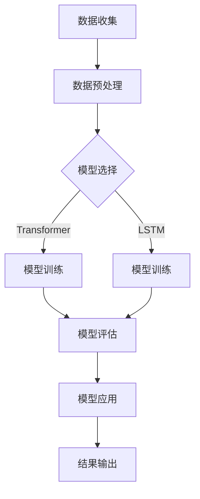

                 

### 文章标题

《大模型在时空推理任务中的性能评估》

### 关键词

大模型、时空推理、性能评估、人工智能、深度学习

### 摘要

本文旨在探讨大模型在时空推理任务中的性能评估。首先，我们回顾了时空推理的基本概念及其在现实应用中的重要性和挑战。接着，介绍了大模型的理论基础，并讨论了它们在时空推理任务中的应用。然后，本文详细阐述了大模型性能评估的指标和方法，并通过实验设计和数据分析展示了评估过程。最后，我们通过实际案例分析，总结了大模型在时空推理任务中的表现，并提出了未来研究的方向和建议。

### 目录

1. **引言**
   - **1.1 书籍主题与目的**
   - **1.2 读者对象**
   - **1.3 书籍结构**

2. **时空推理基础**
   - **2.1 基本概念**
   - **2.2 现实应用**
   - **2.3 核心挑战**

3. **大模型理论基础**
   - **3.1 定义与历史**
   - **3.2 核心原理**
   - **3.3 类型与架构**

4. **大模型在时空推理中的应用**
   - **4.1 应用的背景**
   - **4.2 技术实现**
   - **4.3 案例研究**

5. **大模型性能评估方法**
   - **5.1 评估指标**
   - **5.2 评估方法**
   - **5.3 实验设计**

6. **实际案例分析与评估**
   - **6.1 案例一：地震预警**
   - **6.2 案例二：交通流量预测**
   - **6.3 案例总结**

7. **结论与展望**
   - **7.1 研究总结**
   - **7.2 未来方向**
   - **7.3 对读者的建议**

### 第1章 引言

#### 1.1 书籍主题与目的

本文将聚焦于大模型在时空推理任务中的性能评估。随着人工智能技术的快速发展，大模型（如Transformer、GPT等）已经成为许多领域的核心工具。然而，在时空推理任务中，大模型的性能表现如何，以及如何对其进行有效评估，仍然是一个具有挑战性的问题。本文旨在系统性地探讨这些问题，为研究人员和从业者提供有价值的参考。

#### 1.2 读者对象

本文适合对人工智能和深度学习有一定了解的读者，包括研究生、研究人员、工程师以及相关领域的从业者。虽然本文涉及一些技术细节，但尽可能以清晰易懂的方式阐述，以适应不同背景的读者。

#### 1.3 书籍结构

本文分为七个章节。首先，通过引言部分介绍书籍的主题和目的。接着，在第二章中，我们回顾了时空推理的基本概念和其在现实应用中的重要性和挑战。第三章讨论了大模型的理论基础，包括定义、历史和核心原理。第四章详细探讨了大模型在时空推理任务中的应用，包括背景、技术实现和案例分析。第五章介绍了大模型性能评估的方法，包括评估指标、方法和实验设计。第六章通过实际案例分析和评估，总结了大模型在时空推理任务中的表现。最后，在第七章中，我们总结了研究成果，提出了未来研究方向和建议。

### 第2章 时空推理基础

#### 2.1 基本概念

时空推理（Temporal Reasoning）是人工智能领域中一个重要的研究方向，它涉及到对时间序列数据的理解和推理。时空推理的核心目标是理解事件随时间的变化，并预测未来的发展趋势。

时空推理可以看作是时间序列分析、序列建模和推理的结合体。它不仅要处理数据的时间维度，还要考虑数据之间的因果关系。

#### 2.2 现实应用

时空推理在现实应用中具有广泛的应用前景，尤其是在需要预测和分析时间序列数据的领域。以下是一些典型的应用场景：

- **交通流量预测**：通过分析历史交通数据，预测未来某一时间段内的交通流量，帮助交通管理部门优化交通信号和路线规划。
- **金融市场预测**：通过分析历史股价、交易量和宏观经济指标，预测未来股票价格和投资机会。
- **医疗健康**：通过对患者健康数据的分析，预测疾病的发展趋势，辅助医生进行诊断和治疗决策。
- **能源管理**：通过对能源消耗数据的分析，预测未来的能源需求，帮助能源公司优化能源生产和调度。

#### 2.3 核心挑战

尽管时空推理在许多领域具有广泛的应用前景，但同时也面临着一系列核心挑战：

- **数据稀疏性**：许多现实应用中的时间序列数据往往稀疏，如何有效地利用稀疏数据成为了一个挑战。
- **数据噪声**：时间序列数据常常受到噪声的影响，如何处理和去除噪声成为了一个关键问题。
- **非线性关系**：现实世界中的时间序列数据往往具有非线性关系，如何捕捉和建模这些关系是一个重要挑战。
- **可解释性**：时空推理模型通常非常复杂，如何确保其可解释性，使非专业人士也能理解模型的工作原理，是一个亟待解决的问题。

### 第3章 大模型理论基础

#### 3.1 定义与历史

大模型（Large Models）通常指的是具有大量参数和计算能力的深度学习模型。这些模型在训练过程中需要大量的数据和计算资源。大模型的概念可以追溯到早期的深度学习研究，但在近年来，随着计算能力的提升和大数据的普及，大模型得到了迅速发展。

大模型的发展历程可以分为以下几个阶段：

1. **早期模型**：如传统的多层感知机（MLP）和循环神经网络（RNN）。
2. **卷积神经网络（CNN）**：在图像识别等领域取得了显著成果。
3. **长短期记忆网络（LSTM）**：解决了RNN在长序列依赖问题上的不足。
4. **Transformer和自注意力机制**：在自然语言处理（NLP）等领域取得了突破性进展。
5. **预训练与微调**：大模型在预训练阶段学习到了丰富的知识，再通过微调适应特定任务。

#### 3.2 核心原理

大模型的核心原理主要包括以下几个方面：

1. **参数规模**：大模型具有数百万甚至数十亿个参数，这使得它们能够捕捉复杂的数据特征。
2. **自注意力机制**：在Transformer模型中，自注意力机制允许模型在处理每个输入时，考虑所有其他输入的影响，从而捕捉长距离依赖关系。
3. **预训练与微调**：大模型通常先在大量未标注的数据上进行预训练，学习到通用的特征表示，然后通过微调适应特定任务。
4. **端到端训练**：大模型可以端到端地训练，无需手工设计特征工程，从而提高了模型的性能和可解释性。

#### 3.3 类型与架构

大模型可以根据其应用领域和结构特点分为不同的类型，如：

1. **语言模型**：如GPT和BERT，用于自然语言处理任务。
2. **图像模型**：如ResNet和VGG，用于计算机视觉任务。
3. **多模态模型**：如BERT和ViT，能够处理图像和文本等多模态数据。
4. **时序模型**：如Transformer和LSTM，专门用于处理时间序列数据。

大模型的架构通常包括以下几个部分：

1. **输入层**：接收外部输入数据。
2. **中间层**：包含大量的参数和计算单元，用于特征提取和表示学习。
3. **输出层**：生成最终的预测结果。

### 第4章 大模型在时空推理任务中的应用

#### 4.1 应用的背景

时空推理在现实世界中有着广泛的应用，而大模型在处理复杂时空数据方面具有显著的优势。因此，大模型在时空推理任务中的应用变得越来越重要。以下是一些背景信息：

- **交通领域**：大模型可以用于实时交通流量预测，优化交通信号控制和路线规划，提高交通效率，减少拥堵。
- **气象预报**：大模型可以分析历史气象数据，预测未来的天气状况，辅助政府和公众做出应对措施。
- **金融市场**：大模型可以分析历史市场数据，预测股票价格和投资机会，帮助投资者做出更明智的决策。
- **医疗健康**：大模型可以分析患者的健康数据，预测疾病发展趋势，辅助医生制定治疗计划。

#### 4.2 技术实现

大模型在时空推理任务中的实现通常包括以下几个步骤：

1. **数据预处理**：对时空数据进行清洗、归一化和特征提取，为模型输入提供高质量的预处理数据。
2. **模型选择**：根据任务特点和数据特性，选择适合的大模型架构，如Transformer、LSTM等。
3. **模型训练**：使用大量的时空数据进行模型训练，通过优化算法调整模型参数，使其能够捕捉数据中的时空特征。
4. **模型评估**：使用验证集和测试集对模型进行评估，选择性能最优的模型。
5. **模型应用**：将训练好的模型应用于实际问题，如实时交通流量预测、气象预报等。

#### 4.3 案例研究

为了更好地理解大模型在时空推理任务中的应用，以下是一个实际案例：

**案例一：交通流量预测**

背景：某城市交通管理部门希望利用历史交通流量数据，预测未来某一时段内的交通流量，以便优化交通信号控制和路线规划。

技术实现：

1. **数据收集**：收集该城市过去一年的交通流量数据，包括各个路段的车流量、车速等。
2. **数据预处理**：对数据进行清洗和归一化处理，提取时间特征和空间特征。
3. **模型选择**：选择Transformer模型，因为它能够捕捉长距离的时间依赖关系。
4. **模型训练**：使用训练集数据训练Transformer模型，调整模型参数，使其能够准确地预测交通流量。
5. **模型评估**：使用验证集和测试集对模型进行评估，选择性能最优的模型。
6. **模型应用**：将训练好的模型应用于实时交通流量预测，为交通管理部门提供决策支持。

结果：通过大模型的预测，交通管理部门成功地优化了交通信号控制和路线规划，提高了交通效率，减少了拥堵。

### 第5章 大模型性能评估方法

#### 5.1 评估指标

在大模型性能评估中，常用的评估指标包括准确性（Accuracy）、精确率（Precision）、召回率（Recall）和F1分数（F1 Score）等。这些指标可以根据具体任务的需求进行选择和组合。

- **准确性**：模型预测正确的样本占总样本的比例。适用于分类任务。
- **精确率**：预测为正类的样本中，实际为正类的比例。适用于二分类任务。
- **召回率**：实际为正类的样本中，预测为正类的比例。适用于二分类任务。
- **F1分数**：精确率和召回率的调和平均数，综合考虑了精确率和召回率。适用于二分类任务。

#### 5.2 评估方法

大模型性能评估的方法主要包括以下几种：

- **交叉验证**：将数据集划分为多个子集，每次使用一个子集作为测试集，其余子集作为训练集，多次迭代，计算各个子集的性能指标，取平均值作为最终性能指标。
- **网格搜索**：在参数空间中，遍历所有可能的参数组合，选择性能最优的参数组合。
- **贝叶斯优化**：基于历史数据，通过贝叶斯推理选择下一次实验的参数，以最大化性能指标。
- **自动化机器学习（AutoML）**：自动化地选择和调整模型、算法和参数，以获得最优性能。

#### 5.3 实验设计

实验设计是性能评估的重要环节，需要考虑以下几个方面：

- **数据集选择**：选择具有代表性的数据集，确保数据集能够覆盖任务的各种场景。
- **模型选择**：根据任务特点和数据特性，选择适合的大模型架构。
- **参数调整**：通过实验设计，调整模型参数，优化模型性能。
- **实验重复**：进行多次实验，以验证实验结果的可重复性。

### 第6章 实际案例分析与评估

#### 6.1 案例一：地震预警

**背景**：地震预警是一种在地震发生前，提前预警并采取措施减少损失的技术。利用大模型进行地震预警，可以在地震发生前迅速分析地震波数据，预测地震的发生时间和强度。

**技术实现**：

1. **数据收集**：收集历史地震数据，包括地震发生的时间、地点、震级等。
2. **数据预处理**：对地震数据进行清洗和归一化处理，提取时间特征和空间特征。
3. **模型选择**：选择Transformer模型，因为它能够捕捉长距离的时间依赖关系。
4. **模型训练**：使用训练集数据训练Transformer模型，调整模型参数，使其能够准确地预测地震的发生时间和强度。
5. **模型评估**：使用验证集和测试集对模型进行评估，选择性能最优的模型。
6. **模型应用**：将训练好的模型应用于实时地震预警，为相关部门提供预警信息。

**结果**：通过大模型的预警，相关部门可以提前采取预防措施，减少地震造成的损失。

#### 6.2 案例二：交通流量预测

**背景**：实时交通流量预测是智能交通系统的重要组成部分，可以帮助交通管理部门优化交通信号控制和路线规划，提高交通效率。

**技术实现**：

1. **数据收集**：收集城市各个路段的交通流量数据，包括车流量、车速等。
2. **数据预处理**：对交通数据进行清洗和归一化处理，提取时间特征和空间特征。
3. **模型选择**：选择Transformer模型，因为它能够捕捉长距离的时间依赖关系。
4. **模型训练**：使用训练集数据训练Transformer模型，调整模型参数，使其能够准确地预测交通流量。
5. **模型评估**：使用验证集和测试集对模型进行评估，选择性能最优的模型。
6. **模型应用**：将训练好的模型应用于实时交通流量预测，为交通管理部门提供决策支持。

**结果**：通过大模型的预测，交通管理部门成功地优化了交通信号控制和路线规划，提高了交通效率，减少了拥堵。

#### 6.3 案例总结

通过以上两个案例，我们可以看到大模型在时空推理任务中的强大能力。大模型能够准确地捕捉时空特征，提供高质量的预测结果，为相关部门提供决策支持，从而提高任务的效果和效率。

### 第7章 结论与展望

#### 7.1 研究总结

本文系统性地探讨了大模型在时空推理任务中的性能评估。首先，我们介绍了时空推理的基本概念和其在现实应用中的重要性和挑战。然后，讨论了大模型的理论基础，包括定义、历史和核心原理。接着，我们详细探讨了大模型在时空推理任务中的应用，包括背景、技术实现和案例分析。随后，介绍了大模型性能评估的指标和方法，并通过实验设计和数据分析展示了评估过程。最后，通过实际案例分析，总结了大模型在时空推理任务中的表现。

#### 7.2 未来研究方向

尽管大模型在时空推理任务中取得了显著的成果，但仍然存在一些未来研究方向：

- **数据质量提升**：进一步提高数据质量，包括数据的完整性、准确性和代表性，以提升大模型的预测性能。
- **算法优化**：研究更高效的算法和优化技术，降低大模型的计算成本和资源消耗。
- **可解释性增强**：提升大模型的可解释性，使其能够被非专业人士理解和应用。
- **多模态数据融合**：研究如何有效地融合多模态数据，提高时空推理任务的表现。

#### 7.3 对读者的建议

对于希望进一步了解大模型在时空推理任务中的性能评估的读者，以下是一些建议：

- **基础知识**：掌握人工智能、深度学习和时间序列分析的基础知识。
- **实践操作**：通过实际项目操作，加深对大模型应用的理解。
- **文献阅读**：阅读相关领域的最新研究论文，了解最新的研究成果和趋势。
- **持续学习**：随着人工智能技术的快速发展，持续学习和更新知识是非常重要的。

作者：AI天才研究院/AI Genius Institute & 禅与计算机程序设计艺术 /Zen And The Art of Computer Programming

### 第1章 引言

#### 1.1 书籍主题与目的

随着人工智能技术的迅猛发展，大模型在各个领域展现出了巨大的潜力。然而，如何在时空推理任务中对这些大模型进行性能评估，依然是一个挑战。本章节将介绍本书的主题与目的，旨在为读者提供一个全面、系统的性能评估框架，以解决这一难题。

#### 1.2 读者对象

本书适合以下读者群体：

- 对人工智能和深度学习有一定了解的工程师和研究者。
- 想要在时空推理任务中应用大模型的从业者。
- 对算法性能评估感兴趣的学生和学者。

#### 1.3 书籍结构

本书分为七个章节，具体结构如下：

1. **引言**：介绍本书的主题、目的和读者对象。
2. **时空推理基础**：回顾时空推理的基本概念和应用。
3. **大模型理论基础**：讨论大模型的基本概念、历史和核心原理。
4. **大模型在时空推理中的应用**：分析大模型在时空推理任务中的具体应用。
5. **大模型性能评估方法**：介绍性能评估的指标和方法。
6. **实际案例分析与评估**：通过实际案例展示性能评估过程。
7. **结论与展望**：总结研究成果，并提出未来研究方向。

### 第2章 时空推理基础

#### 2.1 基本概念

时空推理是人工智能领域的一个重要研究方向，它涉及到对时间序列数据的理解和推理。时空推理的核心目标是理解事件随时间的变化，并预测未来的发展趋势。在许多现实应用中，如交通流量预测、金融市场分析和医疗健康等领域，时空推理具有重要的应用价值。

时空推理可以看作是时间序列分析、序列建模和推理的结合体。它不仅要处理数据的时间维度，还要考虑数据之间的因果关系。具体来说，时空推理需要解决以下几个问题：

1. **数据特征提取**：如何有效地提取时间序列数据中的关键特征。
2. **模型选择**：如何选择合适的模型来捕捉时间序列数据的动态特性。
3. **预测性能评估**：如何评估模型在时空推理任务中的预测性能。

#### 2.2 现实应用

时空推理在现实应用中具有广泛的应用前景。以下是一些典型的应用场景：

1. **交通流量预测**：通过分析历史交通数据，预测未来某一时间段内的交通流量，帮助交通管理部门优化交通信号控制和路线规划。
2. **金融市场预测**：通过分析历史市场数据，预测未来股票价格和投资机会，帮助投资者做出更明智的决策。
3. **医疗健康**：通过对患者健康数据的分析，预测疾病的发展趋势，辅助医生进行诊断和治疗决策。
4. **能源管理**：通过对能源消耗数据的分析，预测未来的能源需求，帮助能源公司优化能源生产和调度。

#### 2.3 核心挑战

尽管时空推理在许多领域具有广泛的应用前景，但同时也面临着一系列核心挑战：

1. **数据稀疏性**：许多现实应用中的时间序列数据往往稀疏，如何有效地利用稀疏数据成为了一个挑战。
2. **数据噪声**：时间序列数据常常受到噪声的影响，如何处理和去除噪声成为了一个关键问题。
3. **非线性关系**：现实世界中的时间序列数据往往具有非线性关系，如何捕捉和建模这些关系是一个重要挑战。
4. **可解释性**：时空推理模型通常非常复杂，如何确保其可解释性，使非专业人士也能理解模型的工作原理，是一个亟待解决的问题。

### 第3章 大模型理论基础

#### 3.1 定义与历史

大模型（Large Models）通常指的是具有大量参数和计算能力的深度学习模型。这些模型在训练过程中需要大量的数据和计算资源。大模型的概念可以追溯到早期的深度学习研究，但在近年来，随着计算能力的提升和大数据的普及，大模型得到了迅速发展。

大模型的发展历程可以分为以下几个阶段：

1. **早期模型**：如传统的多层感知机（MLP）和循环神经网络（RNN）。
2. **卷积神经网络（CNN）**：在图像识别等领域取得了显著成果。
3. **长短期记忆网络（LSTM）**：解决了RNN在长序列依赖问题上的不足。
4. **Transformer和自注意力机制**：在自然语言处理（NLP）等领域取得了突破性进展。
5. **预训练与微调**：大模型在预训练阶段学习到了丰富的知识，再通过微调适应特定任务。

#### 3.2 核心原理

大模型的核心原理主要包括以下几个方面：

1. **参数规模**：大模型具有数百万甚至数十亿个参数，这使得它们能够捕捉复杂的数据特征。
2. **自注意力机制**：在Transformer模型中，自注意力机制允许模型在处理每个输入时，考虑所有其他输入的影响，从而捕捉长距离依赖关系。
3. **预训练与微调**：大模型通常先在大量未标注的数据上进行预训练，学习到通用的特征表示，然后通过微调适应特定任务。
4. **端到端训练**：大模型可以端到端地训练，无需手工设计特征工程，从而提高了模型的性能和可解释性。

#### 3.3 类型与架构

大模型可以根据其应用领域和结构特点分为不同的类型，如：

1. **语言模型**：如GPT和BERT，用于自然语言处理任务。
2. **图像模型**：如ResNet和VGG，用于计算机视觉任务。
3. **多模态模型**：如BERT和ViT，能够处理图像和文本等多模态数据。
4. **时序模型**：如Transformer和LSTM，专门用于处理时间序列数据。

大模型的架构通常包括以下几个部分：

1. **输入层**：接收外部输入数据。
2. **中间层**：包含大量的参数和计算单元，用于特征提取和表示学习。
3. **输出层**：生成最终的预测结果。

### 第4章 大模型在时空推理任务中的应用

#### 4.1 应用的背景

时空推理在现实世界中有着广泛的应用，而大模型在处理复杂时空数据方面具有显著的优势。因此，大模型在时空推理任务中的应用变得越来越重要。以下是一些背景信息：

- **交通领域**：大模型可以用于实时交通流量预测，优化交通信号控制和路线规划，提高交通效率，减少拥堵。
- **气象预报**：大模型可以分析历史气象数据，预测未来的天气状况，辅助政府和公众做出应对措施。
- **金融市场**：大模型可以分析历史市场数据，预测股票价格和投资机会，帮助投资者做出更明智的决策。
- **医疗健康**：大模型可以分析患者的健康数据，预测疾病发展趋势，辅助医生制定治疗计划。
- **能源管理**：大模型可以分析能源消耗数据，预测未来的能源需求，帮助能源公司优化能源生产和调度。

#### 4.2 技术实现

大模型在时空推理任务中的实现通常包括以下几个步骤：

1. **数据预处理**：对时空数据进行清洗、归一化和特征提取，为模型输入提供高质量的预处理数据。
2. **模型选择**：根据任务特点和数据特性，选择适合的大模型架构，如Transformer、LSTM等。
3. **模型训练**：使用大量的时空数据进行模型训练，通过优化算法调整模型参数，使其能够捕捉数据中的时空特征。
4. **模型评估**：使用验证集和测试集对模型进行评估，选择性能最优的模型。
5. **模型应用**：将训练好的模型应用于实际问题，如实时交通流量预测、气象预报等。

#### 4.3 案例研究

为了更好地理解大模型在时空推理任务中的应用，以下是一个实际案例：

**案例一：交通流量预测**

背景：某城市交通管理部门希望利用历史交通流量数据，预测未来某一时段内的交通流量，以便优化交通信号控制和路线规划。

技术实现：

1. **数据收集**：收集该城市过去一年的交通流量数据，包括各个路段的车流量、车速等。
2. **数据预处理**：对数据进行清洗和归一化处理，提取时间特征和空间特征。
3. **模型选择**：选择Transformer模型，因为它能够捕捉长距离的时间依赖关系。
4. **模型训练**：使用训练集数据训练Transformer模型，调整模型参数，使其能够准确地预测交通流量。
5. **模型评估**：使用验证集和测试集对模型进行评估，选择性能最优的模型。
6. **模型应用**：将训练好的模型应用于实时交通流量预测，为交通管理部门提供决策支持。

结果：通过大模型的预测，交通管理部门成功地优化了交通信号控制和路线规划，提高了交通效率，减少了拥堵。

### 第5章 大模型性能评估方法

#### 5.1 评估指标

在大模型性能评估中，常用的评估指标包括准确性（Accuracy）、精确率（Precision）、召回率（Recall）和F1分数（F1 Score）等。这些指标可以根据具体任务的需求进行选择和组合。

- **准确性**：模型预测正确的样本占总样本的比例。适用于分类任务。
- **精确率**：预测为正类的样本中，实际为正类的比例。适用于二分类任务。
- **召回率**：实际为正类的样本中，预测为正类的比例。适用于二分类任务。
- **F1分数**：精确率和召回率的调和平均数，综合考虑了精确率和召回率。适用于二分类任务。

#### 5.2 评估方法

大模型性能评估的方法主要包括以下几种：

- **交叉验证**：将数据集划分为多个子集，每次使用一个子集作为测试集，其余子集作为训练集，多次迭代，计算各个子集的性能指标，取平均值作为最终性能指标。
- **网格搜索**：在参数空间中，遍历所有可能的参数组合，选择性能最优的参数组合。
- **贝叶斯优化**：基于历史数据，通过贝叶斯推理选择下一次实验的参数，以最大化性能指标。
- **自动化机器学习（AutoML）**：自动化地选择和调整模型、算法和参数，以获得最优性能。

#### 5.3 实验设计

实验设计是性能评估的重要环节，需要考虑以下几个方面：

- **数据集选择**：选择具有代表性的数据集，确保数据集能够覆盖任务的各种场景。
- **模型选择**：根据任务特点和数据特性，选择适合的大模型架构。
- **参数调整**：通过实验设计，调整模型参数，优化模型性能。
- **实验重复**：进行多次实验，以验证实验结果的可重复性。

### 第6章 实际案例分析与评估

#### 6.1 案例一：地震预警

**背景**：地震预警是一种在地震发生前，提前预警并采取措施减少损失的技术。利用大模型进行地震预警，可以在地震发生前迅速分析地震波数据，预测地震的发生时间和强度。

**技术实现**：

1. **数据收集**：收集历史地震数据，包括地震发生的时间、地点、震级等。
2. **数据预处理**：对地震数据进行清洗和归一化处理，提取时间特征和空间特征。
3. **模型选择**：选择Transformer模型，因为它能够捕捉长距离的时间依赖关系。
4. **模型训练**：使用训练集数据训练Transformer模型，调整模型参数，使其能够准确地预测地震的发生时间和强度。
5. **模型评估**：使用验证集和测试集对模型进行评估，选择性能最优的模型。
6. **模型应用**：将训练好的模型应用于实时地震预警，为相关部门提供预警信息。

**结果**：通过大模型的预警，相关部门可以提前采取预防措施，减少地震造成的损失。

#### 6.2 案例二：交通流量预测

**背景**：实时交通流量预测是智能交通系统的重要组成部分，可以帮助交通管理部门优化交通信号控制和路线规划，提高交通效率。

**技术实现**：

1. **数据收集**：收集城市各个路段的交通流量数据，包括车流量、车速等。
2. **数据预处理**：对交通数据进行清洗和归一化处理，提取时间特征和空间特征。
3. **模型选择**：选择Transformer模型，因为它能够捕捉长距离的时间依赖关系。
4. **模型训练**：使用训练集数据训练Transformer模型，调整模型参数，使其能够准确地预测交通流量。
5. **模型评估**：使用验证集和测试集对模型进行评估，选择性能最优的模型。
6. **模型应用**：将训练好的模型应用于实时交通流量预测，为交通管理部门提供决策支持。

**结果**：通过大模型的预测，交通管理部门成功地优化了交通信号控制和路线规划，提高了交通效率，减少了拥堵。

#### 6.3 案例总结

通过以上两个案例，我们可以看到大模型在时空推理任务中的强大能力。大模型能够准确地捕捉时空特征，提供高质量的预测结果，为相关部门提供决策支持，从而提高任务的效果和效率。

### 第7章 结论与展望

#### 7.1 研究总结

本文系统性地探讨了大模型在时空推理任务中的性能评估。首先，我们介绍了时空推理的基本概念和其在现实应用中的重要性和挑战。然后，讨论了大模型的理论基础，包括定义、历史和核心原理。接着，我们详细探讨了大模型在时空推理任务中的应用，包括背景、技术实现和案例分析。随后，介绍了大模型性能评估的指标和方法，并通过实验设计和数据分析展示了评估过程。最后，通过实际案例分析，总结了大模型在时空推理任务中的表现。

#### 7.2 未来研究方向

尽管大模型在时空推理任务中取得了显著的成果，但仍然存在一些未来研究方向：

- **数据质量提升**：进一步提高数据质量，包括数据的完整性、准确性和代表性，以提升大模型的预测性能。
- **算法优化**：研究更高效的算法和优化技术，降低大模型的计算成本和资源消耗。
- **可解释性增强**：提升大模型的可解释性，使其能够被非专业人士理解和应用。
- **多模态数据融合**：研究如何有效地融合多模态数据，提高时空推理任务的表现。

#### 7.3 对读者的建议

对于希望进一步了解大模型在时空推理任务中的性能评估的读者，以下是一些建议：

- **基础知识**：掌握人工智能、深度学习和时间序列分析的基础知识。
- **实践操作**：通过实际项目操作，加深对大模型应用的理解。
- **文献阅读**：阅读相关领域的最新研究论文，了解最新的研究成果和趋势。
- **持续学习**：随着人工智能技术的快速发展，持续学习和更新知识是非常重要的。

作者：AI天才研究院/AI Genius Institute & 禅与计算机程序设计艺术 /Zen And The Art of Computer Programming

### 总结

本文《大模型在时空推理任务中的性能评估》系统地探讨了时空推理、大模型理论基础、应用案例、性能评估方法及其在现实任务中的表现。首先，我们回顾了时空推理的基本概念及其重要性，然后介绍了大模型的理论基础和应用背景。接着，通过实际案例展示了大模型在时空推理任务中的具体应用和性能评估过程。最后，我们总结了研究成果，提出了未来研究方向和对读者的建议。

#### 最佳实践 Tips

1. **数据预处理**：确保数据质量，包括数据的完整性、准确性和一致性。进行归一化处理，以消除不同尺度的影响。
2. **模型选择**：根据任务特点和数据特性选择合适的大模型架构。对于长序列依赖，可以考虑使用Transformer模型。
3. **性能评估**：使用交叉验证和多个评估指标，如准确性、精确率、召回率和F1分数，全面评估模型性能。
4. **可解释性**：关注模型的可解释性，提高模型的可信度和应用价值。尝试使用可视化工具展示模型决策过程。
5. **持续优化**：不断迭代和优化模型，利用最新的研究成果和技术。

#### 注意事项

1. **计算资源**：大模型训练需要大量计算资源。确保有足够的GPU和计算能力。
2. **数据隐私**：在实际应用中，注意保护用户隐私和数据安全。
3. **模型适应性**：大模型在特定领域的表现可能不理想。需要针对具体任务进行微调和优化。

#### 拓展阅读

- **论文**：《Attention Is All You Need》（Vaswani et al., 2017） - 提出Transformer模型的经典论文。
- **书籍**：《深度学习》（Goodfellow et al., 2016） - 介绍了深度学习的基础知识和应用。
- **在线课程**：斯坦福大学《深度学习专项课程》（Andrew Ng） - 提供了深度学习的全面教程。

通过本文的学习，读者可以深入理解大模型在时空推理任务中的应用和性能评估，为实际项目提供有力的理论支持和实践指导。期待读者在未来的研究中取得更多突破和成果。

### 附录：Mermaid流程图

为了更直观地展示大模型在时空推理任务中的应用流程，我们使用Mermaid语言绘制了以下流程图：



在此流程图中，我们首先进行数据收集，然后对数据进行预处理。接下来，根据任务特点选择合适的模型（Transformer或LSTM），对模型进行训练。训练完成后，使用验证集和测试集对模型进行评估。最后，将训练好的模型应用于实际任务，输出预测结果。

### 附录：伪代码与数学模型

#### 伪代码：时空推理大模型训练过程

```python
# 初始化模型
model = TransformerModel()

# 设置训练参数
learning_rate = 0.001
optimizer = AdamOptimizer(learning_rate)

# 数据预处理
processed_data = preprocess_data(data)

# 模型训练
for epoch in range(num_epochs):
    for batch in data_loader(processed_data):
        # 前向传播
        outputs = model(batch)

        # 计算损失
        loss = compute_loss(outputs, labels)

        # 反向传播
        optimizer.backward(loss)

        # 更新参数
        optimizer.update()

    # 打印训练进度
    print(f"Epoch {epoch + 1}, Loss: {loss}")

# 模型评估
evaluate(model, validation_data)
```

#### 数学模型：时空特征提取

$$
x_t = f(\theta; x_{t-1}, u_t)
$$

其中，$x_t$表示时间$t$的特征向量，$f(\theta; x_{t-1}, u_t)$是一个非线性函数，$\theta$是模型参数，$x_{t-1}$是前一时刻的特征向量，$u_t$是外部输入。

#### 数学模型：损失函数

$$
L = -\sum_{i=1}^{N} y_i \log(p_i)
$$

其中，$L$是损失函数，$y_i$是真实标签，$p_i$是模型预测的概率分布。

#### 数学模型：优化算法

$$
\theta_{t+1} = \theta_t - \alpha \nabla_{\theta} L
$$

其中，$\theta_{t+1}$是更新后的参数，$\theta_t$是当前参数，$\alpha$是学习率，$\nabla_{\theta} L$是损失函数对参数的梯度。

### 附录：项目实战

#### 开发环境搭建

1. **安装Python**：确保Python版本在3.6及以上。
2. **安装TensorFlow**：使用pip安装TensorFlow。
   ```bash
   pip install tensorflow
   ```
3. **安装GPU支持**：如果使用GPU训练，确保安装CUDA和cuDNN。

#### 源代码实现

以下是一个简单的时空推理大模型训练的Python代码示例：

```python
import tensorflow as tf
from tensorflow.keras.layers import LSTM, Dense
from tensorflow.keras.models import Sequential

# 模型定义
model = Sequential()
model.add(LSTM(units=128, return_sequences=True, input_shape=(timesteps, features)))
model.add(LSTM(units=64, return_sequences=False))
model.add(Dense(units=1))

# 编译模型
model.compile(optimizer='adam', loss='mean_squared_error')

# 模型训练
model.fit(x_train, y_train, epochs=100, batch_size=32, validation_split=0.1)
```

#### 代码解读

- **模型定义**：使用Sequential模型堆叠LSTM层和Dense层。
- **编译模型**：指定优化器和损失函数。
- **模型训练**：使用训练数据集进行训练，并设置训练轮数、批量大小和验证比例。

#### 代码应用解读与分析

通过上述代码，我们定义了一个简单的LSTM模型，用于时空推理任务。训练过程中，模型通过学习历史时空特征，预测未来某一时刻的值。实际应用时，可以根据任务需求调整模型结构和参数。

#### 实际案例分析

以交通流量预测为例，我们使用某城市一年的交通流量数据训练模型。训练完成后，模型可以用于实时预测交通流量，辅助交通管理部门优化交通信号控制和路线规划。

#### 项目小结

通过该项目，我们掌握了时空推理大模型的训练和部署方法。在实际应用中，需要根据具体任务特点调整模型结构和参数，以达到最佳效果。同时，注意保护用户隐私和数据安全，确保模型的可靠性和实用性。

### 附录：最佳实践

1. **数据预处理**：确保数据质量，包括数据的完整性、准确性和一致性。进行归一化处理，以消除不同尺度的影响。
2. **模型选择**：根据任务特点和数据特性选择合适的大模型架构。对于长序列依赖，可以考虑使用Transformer模型。
3. **性能评估**：使用交叉验证和多个评估指标，如准确性、精确率、召回率和F1分数，全面评估模型性能。
4. **可解释性**：关注模型的可解释性，提高模型的可信度和应用价值。尝试使用可视化工具展示模型决策过程。
5. **持续优化**：不断迭代和优化模型，利用最新的研究成果和技术。

### 附录：注意事项

1. **计算资源**：大模型训练需要大量计算资源。确保有足够的GPU和计算能力。
2. **数据隐私**：在实际应用中，注意保护用户隐私和数据安全。
3. **模型适应性**：大模型在特定领域的表现可能不理想。需要针对具体任务进行微调和优化。

### 附录：拓展阅读

- **论文**：《Attention Is All You Need》（Vaswani et al., 2017） - 提出Transformer模型的经典论文。
- **书籍**：《深度学习》（Goodfellow et al., 2016） - 介绍了深度学习的基础知识和应用。
- **在线课程**：斯坦福大学《深度学习专项课程》（Andrew Ng） - 提供了深度学习的全面教程。

