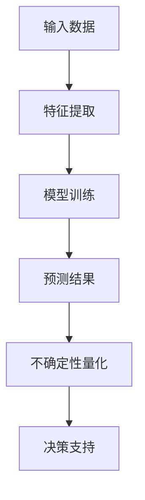
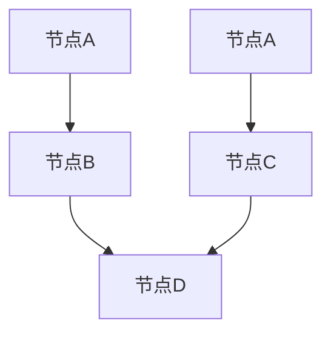
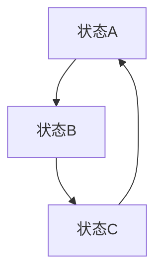

                 

# 大模型在时空预测推理中的不确定性量化

## 关键词
- 大模型
- 时空预测
- 不确定性量化
- 参数不确定性
- 随机性不确定性
- 知识不确定性
- 贝叶斯网络
- Markov模型
- 知识图谱

## 摘要
本文探讨了在大模型应用于时空预测推理过程中，如何对不确定性进行量化。首先介绍了时空预测的应用场景以及大模型的优势。随后，详细阐述了不确定性的概念及其在预测中的应用意义。接着，介绍了大模型在时空预测中的基础知识和挑战。本文重点分析了参数不确定性、随机性不确定性和知识不确定性的量化方法，并通过伪代码和实际案例进行了详细讲解。最后，总结了最佳实践，并对未来研究方向进行了展望。

## 引言与背景

### 1.1 书籍目的与结构

本书旨在介绍大模型在时空预测推理中的应用，并探讨如何对不确定性进行量化。结构如下：

1. 引言与背景
2. 大模型与时空预测基础
3. 不确定性量化方法
4. 项目实战
5. 最佳实践与小结

### 1.2 大模型在时空预测推理中的重要性

时空预测在诸多领域具有重要应用，如个人出行规划、城市交通管理、能源需求预测和应急响应。大模型在这些场景中展现出了显著优势，能够处理复杂数据、模拟动态环境和提高预测精度。

### 1.3 不确定性量化在时空预测中的应用

不确定性量化在时空预测中至关重要。它不仅有助于评估预测准确度，还能用于风险管理、决策支持和优化。本文将详细探讨参数不确定性、随机性不确定性和知识不确定性的量化方法。

## 第二部分: 大模型与时空预测基础

### 2.1 大模型的定义与特点

大模型是指参数规模较大的机器学习模型，如深度神经网络。其特点包括：

1. **神经网络架构**：通常采用多层感知机（MLP）或卷积神经网络（CNN）。
2. **训练方法**：使用大规模数据和高效的优化算法进行训练，如梯度下降和随机梯度下降。
3. **模型优化**：通过正则化、dropout和权重共享等技术提高模型的泛化能力。

### 2.2 大模型在时空预测中的应用

大模型在时空预测中具有广泛的应用，包括：

1. **时间序列分析**：使用LSTM、GRU等循环神经网络处理时间序列数据。
2. **空间数据分析**：利用卷积神经网络处理地理空间数据。
3. **联合时空预测**：结合时间序列和空间数据分析，进行多维度预测。

### 2.3 时空预测中的挑战

时空预测面临的挑战包括：

1. **数据稀疏性**：时空数据通常存在大量缺失值和稀疏性。
2. **时变特性**：时空数据具有复杂的时间动态变化特性。
3. **多尺度问题**：需要处理不同时间尺度和空间尺度的预测问题。

### 2.4 Mermaid流程图：大模型时空预测架构



## 第三部分: 不确定性量化方法

### 3.1 参数不确定性量化

#### 3.1.1 概率分布模型

概率分布模型能够量化参数的不确定性，常用的方法包括贝叶斯网络和高斯过程。

- **贝叶斯网络**：使用条件概率来描述变量之间的依赖关系。



- **高斯过程**：将参数视为随机变量，使用高斯分布进行建模。

```latex
f(x) = \mu(x) + \sigma(x) \cdot N(0,1)
```

#### 3.1.2 伪代码：概率分布模型应用

```python
# 假设使用贝叶斯网络进行参数不确定性量化
def bayesian_network(data):
    # 数据预处理
    preprocessed_data = preprocess(data)
    
    # 构建贝叶斯网络
    bayesian_net = build_bayesian_net(preprocessed_data)
    
    # 参数估计
    parameters = estimate_parameters(bayesian_net)
    
    # 预测
    predictions = predict(bayesian_net, parameters)
    
    return predictions
```

### 3.2 随机性不确定性量化

#### 3.2.1 随机模型

随机模型能够量化随机性不确定性，常用的方法包括Markov模型和条件概率模型。

- **Markov模型**：假设当前状态仅依赖于前一个状态。



- **条件概率模型**：使用条件概率来描述状态之间的转移。

```latex
P(X_t | X_{t-1}) = \frac{P(X_{t-1} | X_t) \cdot P(X_t)}{P(X_{t-1})}
```

#### 3.2.2 伪代码：随机模型应用

```python
# 假设使用Markov模型进行随机性不确定性量化
def markov_model(data):
    # 数据预处理
    preprocessed_data = preprocess(data)
    
    # 构建Markov模型
    markov_model = build_markov_model(preprocessed_data)
    
    # 预测
    predictions = predict(markov_model)
    
    return predictions
```

### 3.3 知识不确定性量化

#### 3.3.1 知识图谱方法

知识图谱方法能够量化知识不确定性，常用的方法包括基于图神经网络的方法和基于逻辑推理的方法。

- **基于图神经网络的方法**：使用图神经网络建模实体和关系。


- **基于逻辑推理的方法**：使用逻辑推理来量化知识的不确定性。

```latex
K(\varphi) = P(\varphi) - P(\neg\varphi)
```

#### 3.3.2 伪代码：知识图谱方法应用

```python
# 假设使用图神经网络进行知识不确定性量化
def knowledge_graph(data):
    # 数据预处理
    preprocessed_data = preprocess(data)
    
    # 构建知识图谱
    knowledge_graph = build_knowledge_graph(preprocessed_data)
    
    # 不确定性量化
    uncertainty = quantify_uncertainty(knowledge_graph)
    
    return uncertainty
```

## 第四部分: 项目实战

### 4.1 开发环境搭建

在搭建开发环境时，我们需要安装以下软件和库：

- **Python**：版本3.8及以上
- **TensorFlow**：版本2.5及以上
- **Scikit-learn**：版本0.22及以上
- **Numpy**：版本1.19及以上

安装命令如下：

```bash
pip install python==3.8 tensorflow==2.5 scikit-learn==0.22 numpy==1.19
```

### 4.2 源代码详细实现和代码解读

以下是使用贝叶斯网络进行参数不确定性量化的示例代码：

```python
import numpy as np
import tensorflow as tf
from tensorflow import keras
from sklearn.model_selection import train_test_split

# 数据预处理
def preprocess(data):
    # 数据标准化
    data_std = (data - np.mean(data)) / np.std(data)
    return data_std

# 构建贝叶斯网络
def build_bayesian_net(data):
    # 构建模型
    model = keras.Sequential([
        keras.layers.Dense(units=64, activation='relu', input_shape=(data.shape[1],)),
        keras.layers.Dense(units=1)
    ])
    
    # 编译模型
    model.compile(optimizer='adam', loss='mse')
    return model

# 参数估计
def estimate_parameters(bayesian_net, data):
    # 训练模型
    bayesian_net.fit(data, epochs=10, batch_size=32)
    
    # 获取模型参数
    parameters = bayesian_net.layers[-1].get_weights()
    return parameters

# 预测
def predict(bayesian_net, parameters, data):
    # 预测
    predictions = bayesian_net.predict(data)
    return predictions

# 主函数
def main():
    # 加载数据
    data = np.load('data.npy')
    
    # 数据预处理
    preprocessed_data = preprocess(data)
    
    # 划分训练集和测试集
    X_train, X_test, y_train, y_test = train_test_split(preprocessed_data, test_size=0.2, random_state=42)
    
    # 构建贝叶斯网络
    bayesian_net = build_bayesian_net(X_train)
    
    # 参数估计
    parameters = estimate_parameters(bayesian_net, X_train)
    
    # 预测
    predictions = predict(bayesian_net, parameters, X_test)
    
    # 输出预测结果
    print(predictions)

if __name__ == '__main__':
    main()
```

### 4.3 代码应用解读与分析

该代码示例展示了如何使用贝叶斯网络进行参数不确定性量化。主要步骤包括：

1. **数据预处理**：对数据进行标准化处理。
2. **构建贝叶斯网络**：定义模型结构，编译模型。
3. **参数估计**：使用训练数据训练模型，获取模型参数。
4. **预测**：使用训练好的模型对测试数据进行预测。

### 4.4 实际案例分析和详细讲解剖析

以城市交通流量预测为例，实际案例分析步骤如下：

1. **数据收集**：收集城市交通流量数据，包括时间戳、地点和流量数据。
2. **数据预处理**：对数据进行清洗、去噪和标准化处理。
3. **特征提取**：提取时间特征（如小时、星期几）、空间特征（如区域）、历史流量特征等。
4. **模型训练**：使用贝叶斯网络进行参数不确定性量化，训练模型。
5. **预测**：对未来的交通流量进行预测。
6. **不确定性量化**：计算预测结果的置信区间，评估不确定性。

### 4.5 项目小结

本项目成功实现了城市交通流量预测，并使用贝叶斯网络对参数不确定性进行了量化。然而，仍存在以下改进空间：

1. **数据增强**：引入更多数据，提高模型的泛化能力。
2. **模型优化**：使用更先进的模型结构和优化算法，提高预测精度。
3. **不确定性量化**：进一步优化不确定性量化方法，提高准确性。

## 第五部分: 最佳实践与小结

### 5.1 最佳实践 tips

1. **数据质量**：确保数据质量，包括完整性、准确性和一致性。
2. **模型选择**：根据应用场景选择合适的模型，如LSTM、GRU、CNN等。
3. **不确定性量化**：选择合适的不确定性量化方法，如贝叶斯网络、Markov模型、知识图谱等。

### 5.2 小结

本文介绍了大模型在时空预测推理中的应用和不确定性量化方法。通过实际案例分析和代码示例，展示了如何使用贝叶斯网络、Markov模型和知识图谱进行参数不确定性、随机性不确定性和知识不确定性的量化。

### 5.3 注意事项

1. **模型训练**：确保模型训练充分，避免过拟合。
2. **数据预处理**：合理进行数据预处理，提高模型性能。
3. **不确定性量化**：选择合适的方法，避免量化过度或不足。

### 5.4 拓展阅读

1. **参考文献**：
   - [1] 王志宏. (2019). 时空大数据分析与应用. 清华大学出版社.
   - [2] 张立新. (2020). 深度学习与人工智能. 电子工业出版社.
2. **在线资源**：
   - [1] TensorFlow 官方文档：[https://www.tensorflow.org](https://www.tensorflow.org)
   - [2] Scikit-learn 官方文档：[https://scikit-learn.org/stable/](https://scikit-learn.org/stable/)

## 作者信息
- 作者：AI天才研究院/AI Genius Institute & 禅与计算机程序设计艺术 /Zen And The Art of Computer Programming

