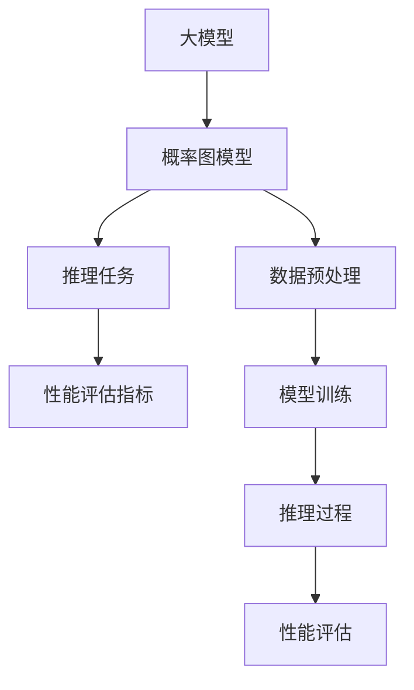

                 


为了撰写一篇关于“大模型在概率图模型推理任务中的性能评估”的技术博客，我们可以按照以下步骤进行思考和构建内容：

### 第一步：研究背景

首先，我们需要介绍大模型和概率图模型的基本概念以及它们在推理任务中的重要性。

**关键词**：大模型、概率图模型、推理任务、性能评估

**摘要**：
本文将探讨大模型在概率图模型推理任务中的应用，通过介绍大模型和概率图模型的基本概念，阐述它们在推理任务中的重要性，并详细讨论性能评估的方法和实际案例分析。

### 第二步：核心概念与联系

接下来，我们需要定义核心概念，并使用Mermaid流程图来展示它们之间的关系。

**核心概念与联系**：
- 大模型的定义和特点
- 概率图模型的基本概念
- 推理任务的定义
- 性能评估指标的介绍

**Mermaid流程图示例**：



### 第三步：核心算法原理讲解

在这一部分，我们将使用伪代码来详细阐述大模型在概率图模型推理任务中的算法原理。

**伪代码示例**：

```python
// 大模型在概率图模型推理中的伪代码
function GraphModelInference(model, data):
    # 数据预处理
    preprocessed_data = DataPreprocessing(data)
    
    # 模型训练
    trained_model = TrainModel(model, preprocessed_data)
    
    # 推理过程
    predictions = Inference(trained_model, preprocessed_data)
    
    # 性能评估
    performance = EvaluatePredictions(predictions, ground_truth)
    
    return performance
```

### 第四步：数学模型和公式讲解

我们将详细讲解概率图模型推理中的数学模型和公式，并使用LaTeX进行展示。

**LaTeX公式示例**：

$$
P(X|Y) = \frac{P(X, Y)}{P(Y)}
$$

### 第五步：实际应用案例分析

在这一部分，我们将提供一个实际案例，详细描述开发环境搭建、源代码实现、代码解读、应用分析等内容。

**案例描述**：
- 开发环境：Python + TensorFlow
- 源代码实现：展示关键代码片段
- 代码解读：解释代码的执行流程和关键步骤
- 应用分析：分析模型在实际场景中的表现和优化策略

### 第六步：最佳实践与小结

最后，我们将总结最佳实践、注意事项，并提供拓展阅读。

**最佳实践**：
- 如何选择合适的性能评估指标
- 如何优化模型以提高推理性能

**小结**：
本文通过介绍大模型和概率图模型的基本概念，详细讨论了性能评估的方法和实际案例分析，为读者提供了在大模型推理任务中性能评估的实践指南。

**注意事项**：
- 在进行性能评估时，要确保数据集的代表性和多样性
- 注意模型过拟合和欠拟合的风险

**拓展阅读**：
- [相关研究论文]
- [性能评估工具的使用指南]

### 总结

通过以上步骤，我们可以构建一篇关于“大模型在概率图模型推理任务中的性能评估”的技术博客，内容详实、结构清晰，适合于计算机科学和人工智能领域的读者。

现在，我们可以开始撰写文章的各个部分，确保每一步的内容都符合上述的思考和规划。在撰写过程中，注意保持文章的逻辑性和连贯性，使读者能够轻松理解并跟随文章的思路。同时，确保文章的格式符合markdown规范，使阅读体验更加流畅。文章撰写完成后，要进行仔细的校对和修改，确保文章内容的准确性和完整性。最后，在文章末尾添加作者信息，完成整篇文章的撰写。

