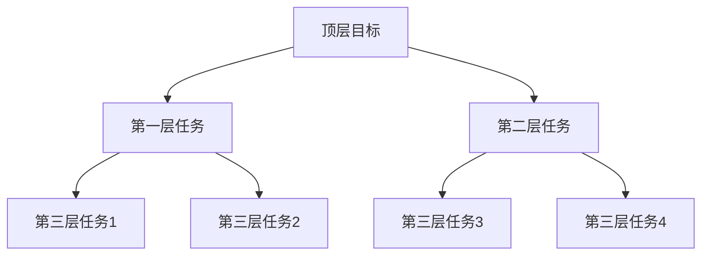

                 

根据您的要求，我将逐步构建这篇文章。由于字数限制，我将在这里提供一个文章的框架和关键部分的内容，然后在接下来的步骤中继续填充和扩展。以下是文章的开头部分：

---

# 大模型在模糊逻辑多级推理中的决策能力评估指标

## 关键词
大模型，模糊逻辑，多级推理，决策能力，评估指标

## 摘要
本文探讨了如何利用大模型对模糊逻辑多级推理的决策能力进行评估。首先介绍了模糊逻辑和模糊推理的基础概念，以及多级推理模型的架构。接着，本文重点讨论了大模型在模糊逻辑多级推理中的应用，包括模糊规则学习、推理过程优化以及多级推理中的大模型应用。最后，本文提出了一套基于大模型的决策能力评估指标，并通过实验和案例分析，验证了这些指标的有效性和实用性。

---

以下是摘要后的markdown格式内容：

## 第一部分：引言

### 1.1 背景与动机
模糊逻辑作为一种处理不确定性和模糊性的数学工具，在各个领域都有着广泛的应用。然而，传统的模糊逻辑推理系统在处理复杂问题时，往往需要大量的规则和复杂的推理过程。随着人工智能技术的发展，大模型在处理大规模数据和复杂任务方面展现出强大的能力。将大模型引入模糊逻辑多级推理中，有望提高决策能力，优化推理过程。

### 1.2 研究目的与意义
本文的研究目的是探索大模型在模糊逻辑多级推理中的应用，并提出一套有效的决策能力评估指标。研究意义在于为实际应用中模糊逻辑系统的优化和评估提供理论支持和实用工具。

### 1.3 文章结构
本文分为六个部分。第一部分是引言，介绍背景和目的。第二部分介绍相关理论，包括模糊逻辑和模糊推理的基础知识。第三部分探讨大模型在模糊逻辑多级推理中的应用。第四部分提出决策能力评估指标。第五部分通过实验和案例分析验证评估指标的有效性。第六部分是结论与展望，总结研究成果并探讨未来发展方向。

---

接下来，我们将逐步填充第二部分的“相关理论”，包括模糊逻辑基础、多级推理模型以及大模型在模糊逻辑推理中的应用。

### 2.1 模糊逻辑基础

#### 2.1.1 模糊集合的基本概念
模糊集合是模糊逻辑的基础概念。与经典集合不同，模糊集合中的元素对集合的隶属度可以用一个介于0和1之间的数值来表示。隶属度表示元素属于集合的程度。定义一个模糊集合F，需要使用隶属函数μF(x)来描述元素x对集合F的隶属度。

$$
\mu_F(x) = \begin{cases}
1 & \text{if } x \text{ is an element of } F \\
0 & \text{otherwise}
\end{cases}
$$

然而，在实际应用中，模糊集合的隶属函数往往更加复杂。例如，可以定义一个三角隶属函数：

$$
\mu_F(x) = \begin{cases}
0 & \text{if } x \leq a \\
\frac{x - a}{b - a} & \text{if } a < x \leq b \\
1 & \text{if } x > b
\end{cases}
$$

这里，a和b是模糊集合F的边界，x是待判断的元素。

#### 2.1.2 模糊规则与模糊推理
模糊规则是模糊逻辑推理的核心。一个模糊规则通常包含条件部分和结论部分，形式如下：

$$
\text{如果 } X \text{ 是 } A \text{，则 } Y \text{ 是 } B
$$

其中，X是输入变量，A是X的模糊集合；Y是输出变量，B是Y的模糊集合。模糊规则可以用模糊条件语句来表示：

$$
\text{if } X = A \text{，then } Y = B
$$

模糊推理过程包括以下步骤：

1. **模糊化**：将输入变量的实际值转化为模糊集合的隶属度。
2. **规则应用**：将模糊化后的输入值与模糊规则的条件部分进行匹配，并计算匹配度。
3. **聚合**：将所有规则的条件部分的匹配度进行聚合，以得到总的条件匹配度。
4. **推理**：使用聚合后的条件匹配度，结合结论部分的隶属函数，进行推理得到输出变量的隶属度。
5. **去模糊化**：将输出变量的隶属度转化为实际值。

一个简单的模糊推理过程可以用以下伪代码表示：

```
Input_value <- 输入变量的实际值
Fuzzyize(X, Input_value) <- 模糊化输入变量
Match(Rule.Conditions, Fuzzyized_X) <- 应用模糊规则并计算匹配度
Aggregate(Match_Degree) <- 聚合所有规则的匹配度
Fuzzyize(Y, Aggregate(Match_Degree)) <- 推理得到输出变量的隶属度
Defuzzyize(Y) <- 去模糊化输出变量，得到实际值
```

### 2.2 多级推理模型

#### 2.2.1 多级推理框架概述
多级推理模型是针对复杂问题的一种高级推理方法。它将问题分解为多个层次，每个层次都有自己的推理规则和目标。多级推理模型通常包括以下组成部分：

1. **层次结构**：定义问题的层次结构，包括顶层目标和底层任务。
2. **推理规则**：每个层次都有自己的推理规则，用于推导下一层次的目标或任务。
3. **层次连接**：定义层次之间的连接关系，用于传递信息和协调不同层次的任务。
4. **冲突解决**：当不同层次的推理结果冲突时，提供解决方案。

一个简单的多级推理模型可以用以下Mermaid流程图表示：



#### 2.2.2 多级推理的实现方法
多级推理的实现方法可以分为两类：基于规则的实现和基于学习的实现。

1. **基于规则的实现**：这种方法依赖于预先定义好的推理规则。每个层次都有自己的规则集，通过递归调用实现多级推理。以下是一个简单的伪代码示例：

```
Top_Level_Target <- 顶层目标
if (Top_Level_Target == "目标1") then [
    First_Level_Target <- "任务1"
    Second_Level_Target <- "任务2"
    Third_Level_Target <- "任务3"
    ...
]

if (Top_Level_Target == "目标2") then [
    First_Level_Target <- "任务4"
    Second_Level_Target <- "任务5"
    Third_Level_Target <- "任务6"
    ...
]

// 根据顶层目标执行相应的第二层和第三层任务
```

2. **基于学习的实现**：这种方法依赖于机器学习模型，特别是深度学习模型。通过学习大量数据，模型可以自动生成推理规则和层次结构。以下是一个简单的伪代码示例：

```
Model <- 加载预训练模型
Input <- 输入数据
Prediction <- 模型预测结果
Top_Level_Target <- Prediction["顶层目标"]
if (Top_Level_Target == "目标1") then [
    Second_Level_Targets <- 模型预测第二层任务
    Third_Level_Targets <- 模型预测第三层任务
]

if (Top_Level_Target == "目标2") then [
    Second_Level_Targets <- 模型预测第二层任务
    Third_Level_Targets <- 模型预测第三层任务
]

// 根据模型预测的结果执行相应的任务
```

### 2.3 大模型在模糊逻辑推理中的应用

#### 2.3.1 大模型在模糊规则学习中的应用
大模型在模糊规则学习中的应用主要体现在两个方面：规则提取和规则优化。

1. **规则提取**：通过分析大量数据，大模型可以自动提取模糊规则。以下是一个简单的伪代码示例：

```
Data <- 加载模糊逻辑推理数据集
Model <- 加载预训练大模型
Rules <- 模型自动提取模糊规则
```

2. **规则优化**：通过优化模糊规则，大模型可以改善推理结果。以下是一个简单的伪代码示例：

```
Data <- 加载模糊逻辑推理数据集
Model <- 加载预训练大模型
Rules <- 模型自动提取模糊规则
Optimized_Rules <- 模型优化模糊规则
```

#### 2.3.2 大模型在模糊推理系统优化中的应用
大模型在模糊推理系统优化中的应用主要体现在以下几个方面：推理速度优化、推理精度优化和推理效率优化。

1. **推理速度优化**：通过加速推理过程，大模型可以提高系统的响应速度。以下是一个简单的伪代码示例：

```
Data <- 加载模糊逻辑推理数据集
Model <- 加载预训练大模型
Optimized_Model <- 模型加速推理
```

2. **推理精度优化**：通过提高推理准确性，大模型可以改善系统的输出结果。以下是一个简单的伪代码示例：

```
Data <- 加载模糊逻辑推理数据集
Model <- 加载预训练大模型
Optimized_Model <- 模型提高推理精度
```

3. **推理效率优化**：通过优化推理过程，大模型可以减少系统的资源消耗。以下是一个简单的伪代码示例：

```
Data <- 加载模糊逻辑推理数据集
Model <- 加载预训练大模型
Optimized_Model <- 模型优化推理效率
```

---

以上是文章前几个部分的内容。接下来，我们将继续填充关于大模型在模糊逻辑多级推理中的应用，决策能力评估指标的具体设定，实验与案例分析等内容。如果您有其他要求或者需要进一步的细化，请随时告诉我。

