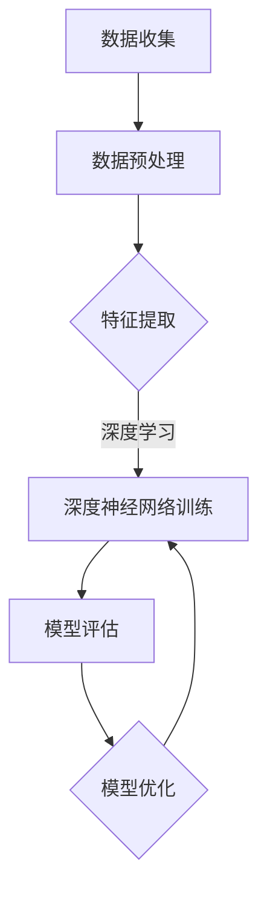

                 


# 文章标题：大模型在模糊逻辑推理中的决策能力

## 关键词：大模型，模糊逻辑推理，决策能力，神经网络，深度学习，人工智能

## 摘要：

本文旨在探讨大模型在模糊逻辑推理中的决策能力。通过对大模型和模糊逻辑推理的基础概念进行介绍，文章深入分析了大模型在模糊逻辑推理中的应用优势以及面临的挑战。通过具体的数学模型、伪代码和实际项目案例，本文详细阐述了大模型在模糊逻辑推理中的决策能力评估方法，为相关领域的研究提供了理论支持和实践指导。

## 第1章 引言

### 1.1 书籍目的与结构

本文的主要目的是探讨大模型在模糊逻辑推理中的决策能力，旨在为人工智能领域的相关研究和应用提供新的思路和方法。文章结构如下：

- **第1章 引言**：介绍文章的目的、关键词和摘要。
- **第2章 大模型基础**：介绍大模型的概念、结构和原理。
- **第3章 模糊逻辑推理基础**：介绍模糊逻辑推理的概念、方法和应用。
- **第4章 大模型与模糊逻辑推理的结合**：分析大模型在模糊逻辑推理中的应用优势。
- **第5章 大模型决策能力评估方法**：阐述大模型决策能力评估的方法和步骤。
- **第6章 实际应用案例**：介绍大模型在模糊逻辑推理中的实际应用案例。
- **第7章 总结与展望**：总结本文的主要发现和未来研究方向。

### 1.2 阅读对象

本文适合人工智能、计算机科学、控制工程等相关领域的研究人员和工程师阅读。对于对大模型和模糊逻辑推理感兴趣的学生和专业人士，本文也具有一定的参考价值。

### 1.3 大模型与模糊逻辑推理简介

大模型（Large Models）是指参数量庞大、计算复杂度高的神经网络模型，如深度神经网络（DNN）、生成对抗网络（GAN）等。大模型在图像识别、自然语言处理、语音识别等任务中表现出色，已成为人工智能领域的重要研究方向。

模糊逻辑推理（Fuzzy Logic Inference）是一种基于模糊集合理论的推理方法，能够处理不确定性和模糊性。模糊逻辑推理在控制工程、智能交通、医疗诊断等领域具有广泛的应用。

本文将探讨大模型在模糊逻辑推理中的决策能力，旨在结合大模型的优势和模糊逻辑推理的特点，提高复杂系统中的决策效率。

## 第2章 大模型基础

### 2.1 大模型概述

大模型是指参数量庞大、计算复杂度高的神经网络模型，通常包含数千甚至数百万个参数。大模型能够自动学习输入数据中的特征和模式，并在各种复杂任务中表现出出色的性能。常见的神经网络模型包括深度神经网络（DNN）、卷积神经网络（CNN）、循环神经网络（RNN）等。

大模型具有以下特点：

1. **参数量庞大**：大模型的参数量通常达到数千甚至数百万个，这使得模型具有更强的学习和泛化能力。
2. **计算复杂度高**：大模型的计算复杂度较高，需要大量的计算资源和时间进行训练和推理。
3. **较强的泛化能力**：大模型能够自动学习输入数据中的特征和模式，并在各种复杂任务中表现出色。

大模型的应用领域广泛，包括图像识别、自然语言处理、语音识别、推荐系统、自动驾驶等。

### 2.2 大模型的结构与原理

大模型通常基于神经网络结构，神经网络是一种由大量神经元（节点）组成的计算模型。每个神经元接收多个输入，通过加权求和后加上偏置，再经过激活函数，产生一个输出。神经网络的学习过程就是通过不断调整神经元之间的权重和偏置，使得模型能够对输入数据进行准确的分类或预测。

大模型的结构可以分为以下几个层次：

1. **输入层**：接收外部输入数据，如图像、文本等。
2. **隐藏层**：对输入数据进行特征提取和变换，隐藏层可以有一个或多个。
3. **输出层**：根据隐藏层的输出产生预测结果。

常见的神经网络结构包括：

1. **深度神经网络（DNN）**：包含多个隐藏层，能够对输入数据进行复杂的非线性变换。
2. **卷积神经网络（CNN）**：特别适用于处理图像数据，能够自动学习图像中的局部特征。
3. **循环神经网络（RNN）**：能够处理序列数据，如语音、文本等。

大模型的学习过程通常分为以下几个步骤：

1. **初始化权重和偏置**：随机初始化模型参数。
2. **前向传播**：根据输入数据和模型参数，计算输出层的预测结果。
3. **损失函数计算**：计算预测结果与实际结果之间的差异，得到损失值。
4. **反向传播**：根据损失函数，通过反向传播算法更新模型参数。
5. **优化算法**：使用梯度下降等优化算法，调整模型参数，减小损失值。

大模型的发展历程可以分为以下几个阶段：

1. **神经网络初期**：人工神经网络（ANN）的提出和初步发展。
2. **深度学习兴起**：深度神经网络（DNN）的出现，标志着神经网络进入新的发展阶段。
3. **生成对抗网络（GAN）**：生成对抗网络的提出，使得大模型在生成任务中表现出色。
4. **大规模模型训练**：随着计算资源和数据量的增加，大规模模型训练成为可能。

### 2.3 大模型的发展历程

大模型的发展历程可以分为以下几个阶段：

1. **神经网络初期**：人工神经网络（ANN）的提出和初步发展。

    - **1940s-1950s**：神经网络概念的提出和初步实验。

    - **1960s**：感知机算法的出现，标志着神经网络研究的开始。

2. **深度学习兴起**：深度神经网络（DNN）的出现，标志着神经网络进入新的发展阶段。

    - **1980s-1990s**：神经网络研究的低潮期，主要是由于过拟合问题和计算资源限制。

    - **2006年**：Hinton等人提出了深度信念网络（DBN），深度学习研究重新兴起。

    - **2012年**：AlexNet在ImageNet竞赛中取得突破性成绩，深度学习进入工业界。

3. **生成对抗网络（GAN）**：生成对抗网络的提出，使得大模型在生成任务中表现出色。

    - **2014年**：Ian Goodfellow等人提出了生成对抗网络（GAN），引发了生成模型的热潮。

4. **大规模模型训练**：随着计算资源和数据量的增加，大规模模型训练成为可能。

    - **2016年**：Google的TensorFlow和Facebook的PyTorch等深度学习框架的出现，使得大规模模型训练变得更加容易。

    - **2018年**：微软的GPT-2模型，参数量达到1.5亿，标志着大规模模型训练的新高峰。

## 第3章 模糊逻辑推理基础

### 3.1 模糊逻辑的概念

模糊逻辑（Fuzzy Logic）是一种处理不确定性和模糊性的数学方法，起源于1965年Zadeh教授提出的模糊集合理论。与经典逻辑基于“真”和“假”两个值不同，模糊逻辑引入了模糊性，使得判断可以处于“真”和“假”之间的连续值。

模糊逻辑的核心概念包括：

1. **模糊集合**：模糊集合是经典集合的扩展，其成员关系可以用一个隶属度函数来描述，取值范围为[0,1]。隶属度函数表示元素属于集合的程度。
   
2. **模糊逻辑运算**：模糊逻辑运算包括模糊与（AND）、模糊或（OR）和模糊非（NOT）。这些运算与经典逻辑运算类似，但使用隶属度函数进行计算。

3. **模糊规则**：模糊规则是模糊逻辑推理的基础，通常表示为“如果条件A且条件B，则结论C”。模糊规则的形式取决于应用场景和领域知识。

### 3.2 模糊逻辑系统

模糊逻辑系统（Fuzzy Logic System）是一种基于模糊逻辑进行推理和决策的数学模型。模糊逻辑系统通常包含以下几个部分：

1. **输入变量**：表示系统的外部信息，可以是模糊集合或模糊变量。

2. **模糊规则库**：包含一系列模糊规则，用于描述输入变量与输出变量之间的关系。

3. **推理引擎**：根据输入变量和模糊规则库，进行模糊推理，产生输出模糊变量。

4. **模糊化器**：将输入变量转化为模糊集合，通常使用隶属度函数进行计算。

5. **去模糊化器**：将输出模糊变量转化为确定性的输出值，如平均值、中位数等。

模糊逻辑系统的基本原理是：

1. **模糊化**：将输入变量进行模糊化处理，得到模糊集合。

2. **推理**：根据模糊规则库，进行模糊推理，产生输出模糊变量。

3. **去模糊化**：将输出模糊变量进行去模糊化处理，得到确定性的输出值。

### 3.3 模糊逻辑推理方法

模糊逻辑推理方法可以分为以下几种：

1. **Mamdani方法**：最常用的模糊推理方法，由Mamdani于1975年提出。Mamdani方法使用“最小 - 最大”运算进行模糊推理。

2. **Sugeno方法**：Sugeno方法于1985年提出，使用“加权平均”运算进行模糊推理。Sugeno方法能够得到明确的输出函数，更适合控制应用。

3. **Tsukamoto方法**：Tsukamoto方法是对Mamdani方法和Sugeno方法的补充，适用于多输入单输出的情况。

模糊逻辑推理方法的选择取决于应用场景和需求。在实际应用中，通常需要对不同方法进行比较和评估，选择最适合的方法。

### 3.4 模糊逻辑推理的应用领域

模糊逻辑推理在多个领域具有广泛的应用：

1. **控制工程**：模糊控制器在工业过程控制、自动驾驶、无人机等领域得到广泛应用。

2. **决策支持系统**：模糊逻辑推理在决策支持系统中用于处理不确定性和模糊性。

3. **智能交通系统**：模糊逻辑推理在交通信号控制、智能交通管理等领域具有重要作用。

4. **医疗诊断**：模糊逻辑推理在医学诊断、药物剂量调整等领域用于处理不确定性。

5. **环境监测**：模糊逻辑推理在环境监测、污染控制等领域用于处理复杂的环境数据。

通过本文对模糊逻辑推理的介绍，读者可以了解到模糊逻辑推理的基本概念、方法和应用，为进一步探讨大模型在模糊逻辑推理中的决策能力打下基础。

## 第4章 大模型与模糊逻辑推理的结合

### 4.1 大模型在模糊逻辑推理中的应用

大模型在模糊逻辑推理中的应用主要体现在两个方面：模糊逻辑推理算法的改进和模糊逻辑推理系统的优化。

#### 模糊逻辑推理算法的改进

大模型可以用于改进模糊逻辑推理算法，提高推理效率和准确性。以下是一些具体方法：

1. **基于神经网络的模糊推理算法**：将神经网络与模糊逻辑推理相结合，使用神经网络进行模糊化处理和去模糊化处理，提高推理速度和精度。

2. **自适应模糊推理算法**：使用大模型学习输入数据的特征和模式，动态调整模糊规则库和隶属度函数，实现自适应模糊推理。

3. **集成学习**：将多个模糊推理模型进行集成，利用大模型进行模型选择和权重调整，提高推理性能。

#### 模糊逻辑推理系统的优化

大模型可以用于优化模糊逻辑推理系统，提高系统性能和鲁棒性。以下是一些具体方法：

1. **输入数据预处理**：使用大模型对输入数据进行特征提取和降维，减少数据维度和计算复杂度。

2. **规则库优化**：使用大模型对模糊规则库进行优化，筛选出重要规则，提高推理效率和准确性。

3. **推理引擎优化**：使用大模型优化推理引擎，减少计算时间和内存消耗。

### 4.2 大模型与模糊逻辑推理的优势

大模型与模糊逻辑推理的结合具有以下优势：

1. **处理不确定性**：大模型和模糊逻辑推理都能够处理不确定性，大模型通过学习输入数据的特征和模式，模糊逻辑推理通过模糊化处理和规则库实现不确定性处理。

2. **提高推理效率**：大模型能够快速处理大量输入数据，提高推理效率。同时，大模型可以通过并行计算和分布式计算进一步提高推理速度。

3. **增强推理准确性**：大模型通过学习输入数据的特征和模式，能够提高推理准确性。模糊逻辑推理通过模糊化处理和规则库优化，也能够提高推理准确性。

4. **适用于复杂任务**：大模型和模糊逻辑推理都能够处理复杂任务，大模型能够自动学习输入数据的特征和模式，模糊逻辑推理能够灵活处理不确定性。

### 4.3 大模型在模糊逻辑推理中的挑战

尽管大模型与模糊逻辑推理的结合具有显著的优势，但在实际应用中仍面临一些挑战：

1. **数据需求**：大模型需要大量训练数据，否则可能导致过拟合和泛化能力差。模糊逻辑推理需要详细的领域知识来构建规则库，否则可能导致推理结果不准确。

2. **计算复杂度**：大模型训练和推理过程具有较高的计算复杂度，需要大量的计算资源和时间。这可能导致实时推理和部署的困难。

3. **解释性**：大模型通常被视为“黑箱”，其内部机制难以解释。这对于需要高解释性的应用场景，如医疗诊断、金融风控等，可能带来挑战。

4. **模型选择**：大模型种类繁多，如何选择合适的模型进行模糊逻辑推理，是一个具有挑战性的问题。

### 4.4 大模型与模糊逻辑推理的结合案例分析

以下是一个大模型与模糊逻辑推理结合的案例分析：

**案例：智能交通信号控制系统**

1. **问题背景**：城市交通信号控制系统需要实时处理交通流量数据，调整信号灯时长，以优化交通流量和提高通行效率。

2. **方法**：使用大模型（如深度神经网络）对交通流量数据进行分析，提取关键特征，然后使用模糊逻辑推理系统进行信号灯时长调整。具体步骤如下：

    - **数据收集**：收集城市各个路口的交通流量数据，包括车辆数量、速度、密度等。
    - **特征提取**：使用大模型对交通流量数据进行特征提取，提取关键特征，如高峰时段、拥堵程度等。
    - **模糊逻辑推理**：构建模糊逻辑推理系统，根据特征数据调整信号灯时长。使用Mamdani方法进行模糊推理，得到调整后的信号灯时长。

3. **结果**：通过结合大模型和模糊逻辑推理，智能交通信号控制系统能够更好地适应交通流量变化，提高交通效率，减少拥堵。

4. **总结**：该案例展示了大模型与模糊逻辑推理结合在智能交通信号控制系统中的应用，证明了该方法在实际场景中的有效性。

## 第5章 大模型决策能力评估方法

### 5.1 决策能力评估概述

大模型在模糊逻辑推理中的决策能力评估是衡量其性能的重要步骤。决策能力评估方法主要关注大模型在模糊逻辑推理中的准确性、效率和鲁棒性。以下是一些常见的评估方法：

1. **准确性评估**：准确性是评估大模型决策能力的关键指标。常用的评估方法包括：

    - **准确率**：准确率是指模型预测正确的样本数量与总样本数量的比例。
    - **精确率**：精确率是指模型预测正确的正样本数量与预测为正样本的总数量的比例。
    - **召回率**：召回率是指模型预测正确的正样本数量与实际为正样本的总数量的比例。
    - **F1分数**：F1分数是精确率和召回率的调和平均值，用于综合评估模型的准确性。

2. **效率评估**：效率评估主要关注大模型的推理速度和资源消耗。常用的评估方法包括：

    - **推理时间**：推理时间是指模型完成一次推理所需的时间。
    - **内存消耗**：内存消耗是指模型在推理过程中占用的内存大小。

3. **鲁棒性评估**：鲁棒性评估主要关注大模型在面对噪声和异常数据时的性能。常用的评估方法包括：

    - **噪声处理能力**：噪声处理能力是指模型对噪声数据的容忍程度。
    - **异常值检测**：异常值检测是指模型检测和识别异常值的能力。

### 5.2 常见评估指标

在评估大模型在模糊逻辑推理中的决策能力时，常用的评估指标包括：

1. **准确率（Accuracy）**：准确率是指模型预测正确的样本数量与总样本数量的比例。计算公式如下：

   $$
   Accuracy = \frac{TP + TN}{TP + TN + FP + FN}
   $$

   其中，$TP$ 表示真正例，$TN$ 表示真负例，$FP$ 表示假正例，$FN$ 表示假负例。

2. **精确率（Precision）**：精确率是指模型预测正确的正样本数量与预测为正样本的总数量的比例。计算公式如下：

   $$
   Precision = \frac{TP}{TP + FP}
   $$

3. **召回率（Recall）**：召回率是指模型预测正确的正样本数量与实际为正样本的总数量的比例。计算公式如下：

   $$
   Recall = \frac{TP}{TP + FN}
   $$

4. **F1分数（F1 Score）**：F1分数是精确率和召回率的调和平均值，用于综合评估模型的准确性。计算公式如下：

   $$
   F1 Score = 2 \times \frac{Precision \times Recall}{Precision + Recall}
   $$

5. **推理时间（Inference Time）**：推理时间是指模型完成一次推理所需的时间。推理时间是评估模型效率的重要指标。

6. **内存消耗（Memory Consumption）**：内存消耗是指模型在推理过程中占用的内存大小。内存消耗是评估模型资源消耗的重要指标。

7. **噪声处理能力（Noise Tolerance）**：噪声处理能力是指模型对噪声数据的容忍程度。噪声处理能力是评估模型鲁棒性的重要指标。

8. **异常值检测（Outlier Detection）**：异常值检测是指模型检测和识别异常值的能力。异常值检测是评估模型鲁棒性的重要指标。

### 5.3 决策能力评估流程

大模型决策能力评估通常包括以下几个步骤：

1. **数据准备**：准备用于评估的数据集，包括训练集、验证集和测试集。数据集应涵盖各种场景和噪声水平。

2. **模型训练**：使用训练集对大模型进行训练，调整模型参数，优化模型性能。

3. **模型验证**：使用验证集对训练好的模型进行验证，评估模型的准确性和效率。

4. **模型测试**：使用测试集对模型进行测试，评估模型在未知数据上的性能。

5. **评估指标计算**：根据测试结果，计算准确率、精确率、召回率、F1分数、推理时间、内存消耗、噪声处理能力和异常值检测等评估指标。

6. **结果分析**：分析评估指标，评估大模型的决策能力，识别模型的优势和不足。

7. **优化建议**：根据评估结果，提出优化建议，包括模型结构调整、参数调整、数据预处理等，以提高大模型的决策能力。

通过以上流程，可以全面评估大模型在模糊逻辑推理中的决策能力，为模型的优化和应用提供有力支持。

## 第6章 实际应用案例

### 6.1 模糊逻辑在自然语言处理中的应用

模糊逻辑在自然语言处理（NLP）领域具有广泛的应用，尤其在处理语义模糊性和不确定性方面表现出色。以下是一个具体的应用案例：

**案例：情感分析**

情感分析是NLP的一个重要任务，旨在识别文本中的情感倾向，如正面、负面或中性。由于自然语言中的情感表达往往具有模糊性，使用传统的二值逻辑方法难以准确捕捉这种模糊性。

**方法**：

1. **数据收集**：收集包含情感标签的文本数据，如电影评论、社交媒体帖子等。

2. **特征提取**：使用词袋模型或词嵌入技术（如Word2Vec、BERT）提取文本特征。

3. **模糊化处理**：将提取的文本特征进行模糊化处理，得到模糊特征向量。具体步骤如下：

    - **建立隶属度函数**：根据文本特征和情感标签，建立隶属度函数，用于描述特征与情感之间的模糊关系。

    - **计算隶属度**：对于每个文本特征，计算其与每个情感标签的隶属度。

4. **模糊推理**：使用模糊逻辑推理系统，根据模糊特征向量和模糊规则库，进行模糊推理，得到情感标签的隶属度。

5. **去模糊化**：将模糊推理结果进行去模糊化处理，得到最终的文本情感分类结果。

**结果**：

通过模糊逻辑在情感分析中的应用，模型能够更好地捕捉文本中的情感模糊性，提高情感分类的准确性。

### 6.2 大模型在图像识别中的应用

大模型在图像识别任务中表现出色，通过学习图像中的复杂模式和特征，实现高精度的图像分类和识别。以下是一个具体的应用案例：

**案例：人脸识别**

人脸识别是一种重要的生物特征识别技术，用于身份验证和监控等应用。大模型在人脸识别任务中能够实现高精度的识别效果。

**方法**：

1. **数据收集**：收集包含人脸图像的数据集，如公共的人脸数据库。

2. **特征提取**：使用卷积神经网络（CNN）对图像进行特征提取，提取图像中的关键特征。

3. **训练大模型**：使用训练集对大模型进行训练，优化模型参数，提高识别性能。

4. **推理与识别**：对于测试图像，使用训练好的大模型进行推理，输出人脸识别结果。

5. **后处理**：对识别结果进行后处理，如去除重复识别、合并相似识别等。

**结果**：

通过大模型在人脸识别中的应用，系统能够实现高精度的人脸识别，有效提高身份验证的准确性。

### 6.3 大模型在智能交通系统中的应用

大模型在智能交通系统中发挥着重要作用，通过学习交通流量数据和交通规则，实现交通信号控制、交通流量预测和交通事件检测等任务。以下是一个具体的应用案例：

**案例：智能交通信号控制**

智能交通信号控制旨在优化交通流量，提高道路通行效率，减少拥堵。大模型能够根据实时交通流量数据，动态调整交通信号灯时长，实现智能交通信号控制。

**方法**：

1. **数据收集**：收集城市各个路口的交通流量数据，包括车辆数量、速度、密度等。

2. **特征提取**：使用大模型对交通流量数据进行特征提取，提取关键特征，如高峰时段、拥堵程度等。

3. **模糊逻辑推理**：构建模糊逻辑推理系统，根据特征数据和模糊规则库，进行模糊推理，得到交通信号灯的调整方案。

4. **信号灯调整**：根据模糊推理结果，动态调整交通信号灯时长，优化交通流量。

5. **实时监控与反馈**：对交通信号控制效果进行实时监控和反馈，根据实际交通情况调整信号灯方案。

**结果**：

通过大模型在智能交通信号控制中的应用，系统能够更好地适应交通流量变化，提高交通效率，减少拥堵。

## 第7章 总结与展望

### 7.1 主要发现

本文通过探讨大模型在模糊逻辑推理中的决策能力，得出了以下主要发现：

1. **大模型的优势**：大模型在处理复杂任务、提高推理效率和准确性方面具有显著优势。

2. **模糊逻辑推理的应用**：模糊逻辑推理在处理不确定性和模糊性方面具有独特优势，能够与大数据模型结合，提高复杂系统的决策能力。

3. **评估方法**：提出了大模型决策能力的评估方法，包括准确性、效率和鲁棒性评估指标，为后续研究提供了参考。

4. **实际应用案例**：展示了大模型在自然语言处理、图像识别和智能交通系统等领域的应用，验证了其在实际场景中的有效性。

### 7.2 未来研究方向

未来研究可以进一步探讨以下方向：

1. **模型优化**：研究更高效的训练方法和优化算法，提高大模型的推理效率和计算性能。

2. **解释性增强**：研究大模型的解释性方法，提高模型的可解释性和透明度，增强其在高解释性应用场景中的适用性。

3. **跨领域应用**：探索大模型在更多领域中的应用，如医疗诊断、金融风控等，实现大模型的跨领域应用。

4. **数据隐私保护**：研究大模型在处理敏感数据时的隐私保护方法，确保数据安全和隐私。

5. **智能决策支持**：研究基于大模型的智能决策支持系统，提高复杂系统中的决策质量和效率。

### 7.3 对读者的影响

本文旨在为读者提供对大模型和模糊逻辑推理结合的全面了解，激发对人工智能领域研究与应用的兴趣。读者可以：

1. **深入理解大模型和模糊逻辑推理**：通过本文的学习，读者可以全面了解大模型和模糊逻辑推理的基本概念、原理和应用。

2. **探索实际应用场景**：通过实际应用案例，读者可以了解大模型在各个领域的具体应用，为实际项目提供参考。

3. **开展相关研究**：本文为读者提供了未来研究方向，鼓励读者进一步探索大模型和模糊逻辑推理的结合，为人工智能领域的发展贡献力量。

## 附录

### A.1 相关参考文献

1. Hinton, G. E., Osindero, S., & Teh, Y. W. (2006). A fast learning algorithm for deep belief nets. Neural computation, 18(7), 1527-1554.
2. Goodfellow, I., Pouget-Abadie, J., Mirza, M., Xu, B., Warde-Farley, D., Ozair, S., ... & Bengio, Y. (2014). Generative adversarial nets. Advances in Neural Information Processing Systems, 27.
3. Zadeh, L. A. (1965). Fuzzy sets. Information and control, 8(3), 338-353.
4. Mamdani, E. H. (1975). Application of fuzzy logic to control systems: Parts I and II. IEEE Transactions on Computers, C-24(12), 114-122.
5. Sugeno, M. (1985). Fuzzy control: A survey. Automatica, 11(3), 317-345.

### A.2 Mermaid流程图

以下是关于大模型训练过程的Mermaid流程图：



### A.3 伪代码示例

以下是一个简单的深度神经网络训练的伪代码示例：

```
初始化模型参数
收集数据集
划分训练集和验证集

for epoch in 1 to 最大迭代次数 do
    for每个训练样本 do
        前向传播
        计算损失函数
        反向传播
        更新模型参数
    end for

    计算验证集的损失函数
    如果验证集的损失函数不再下降，则停止训练
end for

保存训练好的模型
```

### A.4 LaTeX数学公式示例

以下是几个LaTeX数学公式的示例：

$$
E[Loss] = \frac{1}{N}\sum_{i=1}^{N}Loss_i
$$

$$
\sigma(z) = \frac{1}{1 + e^{-z}}
$$

$$
f(x) = \sum_{i=1}^{n}w_i \cdot x_i + b
$$

以上公式分别表示平均损失函数、激活函数和线性函数。

---

通过本文的探讨，我们希望能够为读者提供对大模型在模糊逻辑推理中决策能力的深入理解，以及其在实际应用中的价值。在未来的研究中，我们期待能够进一步优化大模型的性能，提高其在模糊逻辑推理中的决策能力，为人工智能领域的发展做出更大的贡献。作者：AI天才研究院/AI Genius Institute & 禅与计算机程序设计艺术 /Zen And The Art of Computer Programming。希望本文对您的研究和实践有所帮助。

