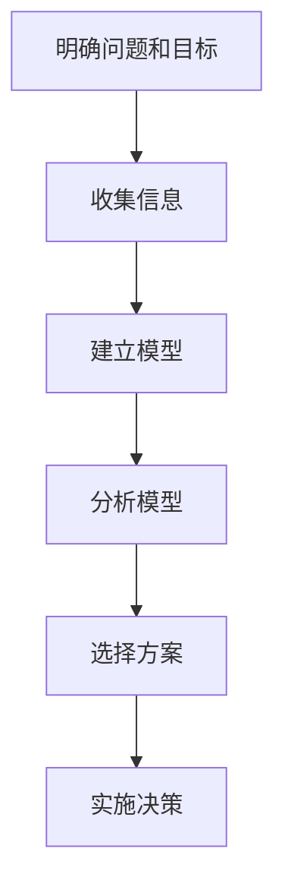
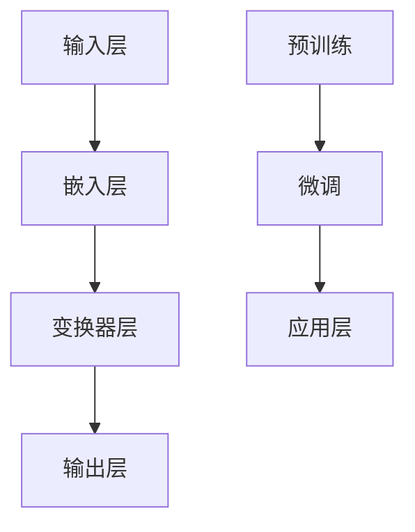

                 


# 大模型在生物伦理推理中的决策分析

## 关键词

- 生物伦理学
- 大模型
- 决策分析
- 人工智能
- 基因编辑
- 伦理挑战

## 摘要

随着人工智能技术的飞速发展，特别是大模型的崛起，它们在各个领域的应用越来越广泛。然而，大模型在生物伦理推理中的使用也引发了一系列的伦理挑战。本文将详细探讨大模型在生物伦理推理中的应用，分析其在决策过程中的作用和挑战，并提出相应的解决方案。文章首先介绍了生物伦理学和决策分析的基础知识，然后深入解析大模型的原理及其在伦理推理中的具体应用。接着，文章通过具体案例，展示了大模型在生物伦理决策中的实践操作，并对其中的伦理挑战进行了探讨。最后，文章总结了大模型在生物伦理推理中的决策分析，并对未来研究方向进行了展望。

## 引言

### 背景介绍

生物伦理学是研究生物技术和生命科学在道德和伦理方面的应用的一门学科。它涉及人类基因编辑、克隆技术、基因测序、人类干细胞研究、动物实验等多个领域。随着这些技术的快速发展，生物伦理学也面临着前所未有的挑战。如何在这些技术的研究和应用中保持伦理的底线，确保人类福祉和生态平衡，成为了一个迫切需要解决的问题。

决策分析则是一门应用数学和计算机科学的方法，用于帮助决策者在面对复杂问题时做出合理的选择。传统的决策分析往往依赖于统计学、概率论和优化理论等方法。然而，随着人工智能技术的进步，特别是大模型的崛起，决策分析的方法和工具也在不断演变。大模型能够处理大量的数据，进行复杂的模式识别和预测，从而为决策分析提供了新的可能性。

### 研究意义

大模型在生物伦理推理中的应用具有重要意义。首先，它可以帮助决策者在面对复杂的生物伦理问题时，更加全面和准确地评估各种选择的后果。例如，在基因编辑和人类增强技术的应用中，大模型可以模拟不同的编辑方案，预测其对人类健康和伦理的影响。其次，大模型可以提高决策的透明度和可解释性。通过分析大模型的学习过程和决策机制，可以帮助决策者理解模型的推理过程，从而增加决策的可信度。此外，大模型还可以为生物伦理学研究提供新的视角和工具，推动这一领域的发展。

### 本书结构

本文将分为以下几个部分：

1. **生物伦理学与决策分析基础**：介绍生物伦理学的基本概念和原则，以及决策分析的基本框架和方法。
2. **大模型原理与生物伦理推理**：深入解析大模型的基本原理和其在生物伦理推理中的应用。
3. **大模型算法与数学模型**：讲解大模型的关键算法和数学模型，并使用伪代码和公式进行详细阐述。
4. **大模型在生物伦理决策中的应用案例**：通过具体案例展示大模型在生物伦理决策中的实践操作。
5. **大模型应用中的伦理挑战与解决方案**：探讨大模型应用中面临的伦理挑战，并提出相应的解决方案。
6. **大模型伦理决策的实际操作指南**：提供大模型伦理决策的实际操作步骤和工具。
7. **结论与未来方向**：总结本文的主要观点，并对未来的研究方向进行展望。

## 第1章：生物伦理学与决策分析基础

### 1.1 生物伦理学核心概念

#### 生物伦理学定义

生物伦理学是研究生物技术和生命科学在道德和伦理方面的应用的一门学科。它关注的是人类在生物技术和生命科学领域中的行为，以及这些行为对人类社会、环境和其他生物的影响。生物伦理学不仅涉及到科学技术本身，还包括社会、文化和法律等多个层面的考虑。

#### 生物伦理学主要原则

生物伦理学的主要原则包括：

1. **尊重自主性**：尊重个体的自主决策能力，确保个体在涉及自身利益的事务中能够自由表达意愿。
2. **不伤害**：尽量避免对个体和群体的伤害，尤其是故意伤害。
3. **公正性**：确保资源的公平分配，避免歧视和偏见。
4. ** beneficence **：追求最大化的善，为个体和群体带来积极的影响。

#### 生物伦理学案例分析

在生物伦理学的实际应用中，有许多经典的案例。例如，基因编辑技术（如CRISPR-Cas9）的伦理争议，涉及是否应该对人类胚胎进行基因编辑。另一个案例是基因测序技术的应用，涉及个人隐私和基因信息的保护问题。还有动物实验的伦理问题，如何平衡科学研究的需要和动物的福利。

### 1.2 决策分析的框架与方法

#### 决策分析的基本步骤

决策分析通常包括以下几个基本步骤：

1. **明确问题和目标**：明确需要解决的问题和希望达到的目标。
2. **收集信息**：收集与问题相关的所有信息，包括数据、文献、专家意见等。
3. **建立模型**：根据问题特征建立合适的数学模型或计算机模型。
4. **分析模型**：对模型进行分析，预测不同决策方案的结果。
5. **选择方案**：根据分析结果选择最优或最合适的决策方案。
6. **实施决策**：将决策方案付诸实践，并进行监控和调整。

#### 常见决策分析方法

常见的决策分析方法包括：

1. **成本效益分析**：比较不同决策方案的收益和成本，选择效益最大的方案。
2. **风险分析**：评估不同决策方案的风险和可能的结果，选择风险最小的方案。
3. **多准则决策分析**：考虑多个决策准则（如成本、时间、质量等），选择综合最优的方案。
4. **博弈论**：分析多个决策者之间的互动和策略选择，选择最佳策略组合。

#### Mermaid流程图：决策分析流程

以下是一个简单的Mermaid流程图，展示了决策分析的基本流程：



### 1.3 决策分析在生物伦理学中的应用

决策分析在生物伦理学中具有重要的应用价值。通过决策分析，可以更好地评估不同生物技术应用带来的伦理影响，并选择合适的伦理决策方案。以下是一些具体的案例：

1. **基因编辑技术的伦理决策**：在基因编辑技术的应用中，决策分析可以帮助评估不同编辑方案对个体和群体的伦理影响，选择最优的伦理决策。
2. **人类干细胞研究的伦理决策**：在人类干细胞研究的过程中，决策分析可以评估不同研究方案对人类福利的潜在影响，确保研究的道德合法性。
3. **动物实验的伦理决策**：在动物实验中，决策分析可以评估不同实验设计对动物的伦理影响，选择最人道的实验方法。

通过这些案例，我们可以看到决策分析在生物伦理学中的应用是如何帮助决策者做出合理、公正和负责任的伦理决策的。

### 小结

本章介绍了生物伦理学的基本概念和决策分析的基本方法。生物伦理学关注的是生物技术和生命科学在道德和伦理方面的应用，其主要原则包括尊重自主性、不伤害、公正性和 beneficence。决策分析则是一门应用数学和计算机科学的方法，用于帮助决策者在面对复杂问题时做出合理的选择。通过本章的内容，读者可以了解生物伦理学和决策分析的基础知识，为进一步探讨大模型在生物伦理推理中的应用打下基础。

## 第2章：大模型原理与生物伦理推理

### 2.1 大模型的基本原理

#### 大模型的发展历程

大模型（Large Models），也称为大型语言模型（Large Language Models），是人工智能领域的一个重要突破。这些模型具有庞大的参数规模，能够在大量的数据集上进行训练，从而获得强大的语义理解和生成能力。大模型的发展历程可以追溯到20世纪80年代，当时的统计语言模型和基于规则的模型已经表现出一定的语言理解能力。随着计算能力和数据资源的不断增长，尤其是在深度学习技术的推动下，大模型取得了显著的进步。

近年来，以GPT-3、BERT、Turing等为代表的大模型在自然语言处理（NLP）、计算机视觉（CV）和机器学习（ML）等领域取得了突破性成果。这些大模型不仅参数规模庞大，而且结构复杂，通常包含数十亿个参数。例如，GPT-3拥有1750亿个参数，而Turing模型更是达到了数千亿个参数。

#### 大模型的技术架构

大模型的技术架构主要包括以下几个方面：

1. **神经网络架构**：大模型通常采用深度神经网络（DNN）或变换器架构（Transformer），其中Transformer架构因其并行计算能力和良好的性能表现而成为大模型的首选。
2. **参数规模**：大模型的参数规模通常在数十亿到数千亿之间，这种庞大的参数规模使得模型具有更强的表达能力和泛化能力。
3. **训练数据**：大模型通常在大量的训练数据集上进行训练，这些数据集包括互联网上的文本、书籍、新闻、文章等。通过对大量数据的训练，模型能够学习到丰富的语言知识和模式。
4. **训练方法**：大模型的训练方法包括预训练（Pre-training）和微调（Fine-tuning）。预训练是指在大规模数据集上训练模型的基础知识，而微调则是根据具体任务进行模型调整，以提升任务性能。

#### Mermaid流程图：大模型架构

以下是一个简单的Mermaid流程图，展示了大模型的基本架构：



在这个流程图中，输入层接收外部输入（如文本、图像等），嵌入层将这些输入转换为嵌入向量，变换器层通过自注意力机制处理输入，输出层生成预测结果。预训练和微调则分别用于模型的基础训练和任务特定调整，应用层则将模型部署到实际应用中。

### 2.2 大模型在生物伦理推理中的应用

#### 大模型在伦理问题分析中的应用

大模型在生物伦理问题分析中具有广泛的应用潜力。首先，大模型能够处理和理解复杂的文本数据，包括伦理文献、研究报告、法律法规等。通过分析这些文本数据，大模型可以提取出与伦理问题相关的关键信息，并对其进行语义分析。例如，大模型可以分析基因编辑技术的伦理争议，识别出不同观点和论据，从而帮助决策者全面了解问题的各个方面。

此外，大模型还可以用于生成伦理决策报告。通过输入相关的伦理问题，大模型可以生成详细的决策报告，包括问题的背景、不同的决策方案、潜在的伦理风险和效益等。这种自动化报告生成功能不仅提高了决策效率，还增强了决策的透明度和可解释性。

#### 大模型的局限性

尽管大模型在生物伦理推理中具有巨大的潜力，但它们也存在一些局限性。首先，大模型的学习过程主要依赖于大量的训练数据和算法优化，这可能导致模型对特定数据集的过度拟合。例如，如果训练数据集中包含某些偏见或不公平的观点，模型可能也会学习到这些偏见，从而影响决策的公正性。

其次，大模型的可解释性较差。尽管研究人员可以通过分析模型的结构和参数来理解模型的工作原理，但模型内部的复杂非线性关系使得其决策过程往往难以解释。这在生物伦理决策中是一个重要的挑战，因为决策者需要理解模型的推理过程，以便对决策的合理性和可信度进行评估。

此外，大模型在处理敏感和复杂的生物伦理问题时，可能面临隐私和安全问题。例如，在涉及个人健康数据和隐私信息的伦理决策中，如何确保数据的安全性和隐私性是一个关键问题。

#### 大模型的应用前景

尽管存在上述局限性，大模型在生物伦理推理中的应用前景仍然广阔。随着技术的不断进步和数据的不断积累，大模型将能够更好地处理和理解复杂的伦理问题。未来，大模型可能会在以下几个方面发挥重要作用：

1. **自动化伦理决策支持**：大模型可以用于自动化伦理决策支持系统，帮助决策者快速、准确地分析伦理问题，并提供决策建议。
2. **伦理风险评估**：大模型可以用于评估不同决策方案可能带来的伦理风险，为决策者提供风险评估和预警。
3. **伦理知识图谱**：大模型可以用于构建伦理知识图谱，整合和关联各种伦理概念、理论和案例，为伦理研究提供新的工具和资源。
4. **跨学科合作**：大模型可以促进生物伦理学与其他学科（如计算机科学、心理学、社会学等）的交叉融合，推动生物伦理学研究的深入和发展。

总之，大模型在生物伦理推理中的应用具有巨大的潜力和挑战。通过进一步的研究和优化，大模型有望成为生物伦理决策的有力工具，为人类社会的可持续发展提供支持。

### 小结

本章详细介绍了大模型的基本原理和技术架构，以及大模型在生物伦理推理中的应用。大模型具有庞大的参数规模和强大的语义理解能力，通过预训练和微调技术，可以在各种复杂任务中表现出色。在生物伦理推理中，大模型可以用于分析伦理问题、生成决策报告和评估伦理风险。然而，大模型也存在一些局限性，如数据依赖性、可解释性差和隐私安全问题。未来，随着技术的不断进步和数据的不断积累，大模型在生物伦理推理中的应用前景将更加广阔。

## 第3章：大模型算法与数学模型

### 3.1 大模型关键算法

#### 神经网络

神经网络是构成大模型的核心算法之一。神经网络是一种通过模拟人脑神经元连接方式来实现信息处理和决策的技术。在神经网络中，每个神经元都与其他神经元相连，并通过对输入信号进行加权求和处理，产生输出信号。

神经网络的基本结构包括：

1. **输入层**：接收外部输入信号。
2. **隐藏层**：对输入信号进行加工处理。
3. **输出层**：生成最终的输出结果。

神经网络通过反向传播算法不断调整内部参数，以优化模型的预测性能。在训练过程中，网络会根据实际输出和预期输出之间的误差，反向传播误差，并更新各层的权重。

以下是一个简单的神经网络伪代码：

```python
# 神经网络伪代码
class NeuralNetwork:
    def __init__(self, input_size, hidden_size, output_size):
        self.input_size = input_size
        self.hidden_size = hidden_size
        self.output_size = output_size
        self.weights_input_to_hidden = np.random.randn(input_size, hidden_size)
        self.weights_hidden_to_output = np.random.randn(hidden_size, output_size)

    def forward(self, x):
        self.hidden_layer = np.dot(x, self.weights_input_to_hidden)
        self.output_layer = np.dot(self.hidden_layer, self.weights_hidden_to_output)
        return self.output_layer

    def backward(self, d_output):
        d_hidden_to_output = np.dot(d_output, self.weights_hidden_to_output.T)
        d_hidden_layer = d_hidden_to_output.dot(self.weights_input_to_hidden.T)
        return d_hidden_layer
```

#### Transformer

Transformer是近年来在自然语言处理领域取得突破性成果的一种神经网络架构。与传统的循环神经网络（RNN）相比，Transformer通过自注意力机制（Self-Attention）实现了并行计算，从而在处理长序列时表现出更高的效率。

Transformer的基本结构包括：

1. **嵌入层**：将输入词嵌入为向量。
2. **自注意力层**：通过计算输入词之间的相似性，对输入进行加权处理。
3. **前馈网络**：对自注意力层的输出进行加工处理。
4. **输出层**：生成最终的输出结果。

以下是一个简单的Transformer伪代码：

```python
# Transformer伪代码
class Transformer:
    def __init__(self, input_size, hidden_size, output_size):
        self.input_size = input_size
        self.hidden_size = hidden_size
        self.output_size = output_size
        self.query_embedding = np.random.randn(input_size, hidden_size)
        self.key_embedding = np.random.randn(input_size, hidden_size)
        self.value_embedding = np.random.randn(input_size, hidden_size)
        self.fc1 = np.random.randn(hidden_size, hidden_size)
        self.fc2 = np.random.randn(hidden_size, output_size)

    def forward(self, x):
        query = np.dot(x, self.query_embedding)
        key = np.dot(x, self.key_embedding)
        value = np.dot(x, self.value_embedding)
        attention_weights = softmax(similarity(query, key))
        attention_output = np.dot(attention_weights, value)
        hidden = np.dot(attention_output, self.fc1)
        output = np.dot(hidden, self.fc2)
        return output

    def backward(self, d_output):
        d_hidden = np.dot(d_output, self.fc2.T)
        d_attention_output = d_hidden.dot(self.fc1.T)
        d_value = np.dot(d_attention_output, self.key_embedding.T)
        d_key = np.dot(d_attention_output.T, self.query_embedding)
        d_query = np.dot(d_key, self.key_embedding.T)
        return d_query
```

### 3.2 大模型数学模型解析

#### 概率生成模型

概率生成模型是构建大模型的基础之一。常见的概率生成模型包括生成对抗网络（GAN）和变分自编码器（VAE）。

**生成对抗网络（GAN）**：

GAN由生成器（Generator）和判别器（Discriminator）组成。生成器的目标是生成逼真的数据，判别器的目标是区分真实数据和生成数据。通过训练，生成器和判别器相互对抗，生成器不断优化其生成的数据，判别器不断优化其分类能力。

GAN的损失函数包括两部分：生成器损失和判别器损失。

- **生成器损失**：

$$
L_G = -\log(D(G(z)))
$$

其中，$z$是从先验分布中抽取的随机噪声，$G(z)$是生成器生成的数据，$D$是判别器。

- **判别器损失**：

$$
L_D = -\log(D(x)) - \log(1 - D(G(z)))
$$

其中，$x$是真实数据。

以下是一个简单的GAN伪代码：

```python
# GAN伪代码
class GAN:
    def __init__(self, z_dim, img_dim):
        self.z_dim = z_dim
        self.img_dim = img_dim
        self.generator = Generator(z_dim, img_dim)
        self.discriminator = Discriminator(img_dim)

    def train(self, x_train, epochs):
        for epoch in range(epochs):
            for x in x_train:
                z = np.random.randn(self.z_dim)
                fake_images = self.generator(z)
                real_labels = np.ones((x.shape[0], 1))
                fake_labels = np.zeros((x.shape[0], 1))
                
                d_loss_real = self.discriminator_loss(x, real_labels)
                d_loss_fake = self.discriminator_loss(fake_images, fake_labels)
                d_loss = 0.5 * np.add(d_loss_real, d_loss_fake)
                
                z = np.random.randn(self.z_dim)
                fake_images = self.generator(z)
                g_loss = self.generator_loss(fake_images, real_labels)
                
                self.discriminator_optimizer.zero_grad()
                d_loss.backward()
                self.discriminator_optimizer.step()
                
                self.generator_optimizer.zero_grad()
                g_loss.backward()
                self.generator_optimizer.step()
                
    def generator_loss(self, x, y):
        return -np.mean(np.log(y))

    def discriminator_loss(self, x, y):
        return -np.mean(np.log(y) + np.log(1 - y))
```

**变分自编码器（VAE）**：

VAE通过引入概率编码，将数据表示为潜在变量，从而实现数据的生成和压缩。

VAE的核心是潜变量模型，包括编码器（Encoder）和解码器（Decoder）。

- **编码器损失**：

$$
L_E = -\sum_{i} \log p(z|x_i)
$$

其中，$z$是编码后的潜在变量。

- **解码器损失**：

$$
L_D = \sum_{i} \log p(x_i|z)
$$

VAE的总损失为编码器损失和解码器损失之和。

以下是一个简单的VAE伪代码：

```python
# VAE伪代码
class VAE:
    def __init__(self, x_dim, z_dim):
        self.x_dim = x_dim
        self.z_dim = z_dim
        self.encoder = Encoder(x_dim, z_dim)
        self.decoder = Decoder(z_dim, x_dim)

    def encode(self, x):
        z_mean, z_log_var = self.encoder(x)
        z = z_mean + np.sqrt(2 * np.exp(z_log_var)) * np.random.normal(size=z_mean.shape)
        return z

    def decode(self, z):
        x_log_prob = self.decoder(z)
        x = np.random.normal(size=x_log_prob.shape) * np.exp(x_log_prob)
        return x

    def loss(self, x):
        z = self.encode(x)
        x_recon = self.decode(z)
        z_mean, z_log_var = self.encoder(x)
        log_prob = np.mean(np.log(2 * np.pi) + z_log_var + np.square(z))
        recon_loss = np.mean(np.square(x - x_recon))
        return -recon_loss - log_prob
```

### 3.3 数学公式与解释

在生物伦理推理中，大模型的应用涉及到许多数学公式和理论。以下是一些常见的数学公式及其解释：

#### 概率分布

1. **贝叶斯公式**：

$$
P(A|B) = \frac{P(B|A)P(A)}{P(B)}
$$

贝叶斯公式是一种计算条件概率的方法，可以用于概率推理和决策分析。

2. **马尔可夫链**：

$$
P(X_n|X_{n-1}, X_{n-2}, ..., X_1) = P(X_n|X_{n-1})
$$

马尔可夫链是一种随机过程，用于描述系统在不同状态之间的转移概率。

3. **期望和方差**：

$$
E[X] = \sum_{i} x_i P(X = x_i)
$$

$$
Var[X] = E[(X - E[X])^2]
$$

期望和方差是描述随机变量分布的两个重要指标。

#### 线性回归

1. **回归模型**：

$$
Y = \beta_0 + \beta_1 X + \epsilon
$$

其中，$Y$是因变量，$X$是自变量，$\beta_0$和$\beta_1$是模型参数，$\epsilon$是误差项。

2. **残差分析**：

$$
\hat{\epsilon} = Y - \hat{Y}
$$

残差分析用于检验回归模型的假设和拟合质量。

#### 机器学习

1. **交叉验证**：

$$
CV = \frac{1}{k} \sum_{i=1}^{k} L(S_i)
$$

交叉验证是一种评估模型性能的方法，通过将数据集划分为多个部分，分别进行训练和验证。

2. **支持向量机**：

$$
w^* = \arg\min_{w, b} \frac{1}{2} ||w||^2_2 + C \sum_{i=1}^{n} \max(0, 1 - y_i (w \cdot x_i + b))
$$

支持向量机是一种分类方法，通过求解优化问题来确定最佳分类超平面。

### 小结

本章详细介绍了大模型的关键算法和数学模型。神经网络和Transformer是构建大模型的基础算法，通过自注意力机制和反向传播算法，实现了高效的模型训练和预测。概率生成模型如GAN和VAE则在大模型中用于数据的生成和压缩。本章还介绍了常用的数学公式和理论，如贝叶斯公式、马尔可夫链、期望和方差、线性回归和交叉验证等，为后续章节的具体应用提供了理论基础。

## 第4章：大模型在生物伦理决策中的应用案例

### 4.1 案例一：基因编辑伦理决策

#### 案例背景

基因编辑技术，如CRISPR-Cas9，近年来在科学界引起了广泛的关注。CRISPR-Cas9技术通过在DNA序列中精确切割，可以实现基因的编辑和修改。这项技术为治疗遗传疾病、增强生物性能和进行科学研究提供了新的可能性。然而，基因编辑技术的广泛应用也引发了一系列伦理争议，涉及隐私保护、基因公平性、生物多样性保护等问题。

#### 决策分析过程

为了在基因编辑伦理决策中应用大模型，我们首先需要定义决策问题和目标。具体而言，决策问题可以描述为：

- 如何平衡基因编辑技术的潜在好处和潜在风险？
- 如何确保基因编辑决策的透明度和公正性？

决策目标包括：

- 最大程度地提高基因编辑技术的安全性和有效性。
- 最小化基因编辑对人类健康、环境和社会的负面影响。

为了实现这些目标，我们可以采用以下决策分析过程：

1. **数据收集**：收集与基因编辑技术相关的数据，包括科学文献、政策法规、伦理研究报告等。

2. **建立模型**：使用大模型（如GPT-3）对收集的数据进行预处理和分析，提取关键信息和关键观点。

3. **情景分析**：基于大模型的分析结果，构建多个可能的情景，包括最佳情景、一般情景和最坏情景。

4. **风险评估**：对每个情景进行风险评估，包括技术风险、伦理风险和社会风险。

5. **决策建议**：基于风险评估结果，提出具体的决策建议，包括技术改进、政策调整和社会干预措施。

#### 代码实现与解释

以下是一个简单的Python代码示例，展示了如何使用GPT-3进行基因编辑伦理决策分析：

```python
import openai

# 设置OpenAI API密钥
openai.api_key = 'your_api_key'

# 定义决策问题
decision_problem = "基因编辑技术可能带来哪些伦理风险？"

# 使用GPT-3进行文本生成
response = openai.Completion.create(
  engine="text-davinci-003",
  prompt=decision_problem,
  max_tokens=50
)

# 输出决策分析结果
print(response.choices[0].text.strip())
```

这段代码首先设置了OpenAI的API密钥，然后定义了基因编辑伦理决策问题，并使用GPT-3生成相关的决策分析结果。生成结果将包括可能的伦理风险、关键观点和决策建议。

#### 代码应用解读与分析

在实际应用中，上述代码可以帮助决策者快速了解基因编辑技术的伦理风险，并提供决策建议。具体解读如下：

1. **数据预处理**：在运行代码之前，需要对输入文本进行预处理，包括去除无关信息、标点符号和停用词。

2. **模型选择**：选择合适的模型（如GPT-3）进行文本生成。GPT-3具有强大的语义理解和生成能力，适合用于复杂文本的分析。

3. **结果解读**：分析GPT-3生成的文本结果，提取关键信息和观点。这些信息可以为决策者提供有价值的参考。

4. **风险评估**：基于生成的文本结果，对每个情景进行风险评估，包括技术风险、伦理风险和社会风险。

5. **决策建议**：根据风险评估结果，提出具体的决策建议，如技术改进、政策调整和社会干预措施。

#### 项目小结

通过基因编辑伦理决策案例，我们展示了如何使用大模型进行复杂伦理问题的决策分析。大模型通过分析大量文本数据，可以提供全面、准确的决策建议，有助于决策者更好地应对伦理挑战。然而，大模型的应用也存在一些局限性，如数据依赖性和可解释性问题。未来，随着技术的不断进步，大模型在伦理决策中的应用将更加广泛和深入。

### 4.2 案例二：人类增强技术伦理决策

#### 案例背景

人类增强技术（Human Enhancement Technologies，HET）是指通过生物、化学、信息技术等手段，增强人类身体或认知功能的技术。这些技术包括基因编辑、神经增强、器官移植等，旨在提升人类在身体、认知、情感等方面的表现。随着人类增强技术的发展，其在医疗、军事、体育等领域具有广泛的应用前景。然而，人类增强技术也引发了大量的伦理争议，涉及人类尊严、公平性、安全性等问题。

#### 决策分析过程

为了在人类增强技术伦理决策中应用大模型，我们首先需要定义决策问题和目标。具体而言，决策问题可以描述为：

- 如何确保人类增强技术的安全性和有效性？
- 如何平衡人类增强技术对个体和社会的影响？
- 如何处理人类增强技术引发的隐私和公平性问题？

决策目标包括：

- 提高人类增强技术的安全性和可靠性。
- 确保人类增强技术的公平性和可及性。
- 保护人类尊严和隐私。

为了实现这些目标，我们可以采用以下决策分析过程：

1. **数据收集**：收集与人类增强技术相关的数据，包括科学文献、政策法规、伦理研究报告等。

2. **建立模型**：使用大模型（如GPT-3）对收集的数据进行预处理和分析，提取关键信息和关键观点。

3. **情景分析**：基于大模型的分析结果，构建多个可能的情景，包括最佳情景、一般情景和最坏情景。

4. **风险评估**：对每个情景进行风险评估，包括技术风险、伦理风险和社会风险。

5. **决策建议**：基于风险评估结果，提出具体的决策建议，包括技术改进、政策调整和社会干预措施。

#### 代码实现与解释

以下是一个简单的Python代码示例，展示了如何使用GPT-3进行人类增强技术伦理决策分析：

```python
import openai

# 设置OpenAI API密钥
openai.api_key = 'your_api_key'

# 定义决策问题
decision_problem = "人类增强技术可能引发哪些伦理争议？"

# 使用GPT-3进行文本生成
response = openai.Completion.create(
  engine="text-davinci-003",
  prompt=decision_problem,
  max_tokens=50
)

# 输出决策分析结果
print(response.choices[0].text.strip())
```

这段代码首先设置了OpenAI的API密钥，然后定义了人类增强技术伦理决策问题，并使用GPT-3生成相关的决策分析结果。生成结果将包括可能的伦理争议、关键观点和决策建议。

#### 代码应用解读与分析

在实际应用中，上述代码可以帮助决策者快速了解人类增强技术的伦理争议，并提供决策建议。具体解读如下：

1. **数据预处理**：在运行代码之前，需要对输入文本进行预处理，包括去除无关信息、标点符号和停用词。

2. **模型选择**：选择合适的模型（如GPT-3）进行文本生成。GPT-3具有强大的语义理解和生成能力，适合用于复杂文本的分析。

3. **结果解读**：分析GPT-3生成的文本结果，提取关键信息和观点。这些信息可以为决策者提供有价值的参考。

4. **风险评估**：基于生成的文本结果，对每个情景进行风险评估，包括技术风险、伦理风险和社会风险。

5. **决策建议**：根据风险评估结果，提出具体的决策建议，如技术改进、政策调整和社会干预措施。

#### 项目小结

通过人类增强技术伦理决策案例，我们展示了如何使用大模型进行复杂伦理问题的决策分析。大模型通过分析大量文本数据，可以提供全面、准确的决策建议，有助于决策者更好地应对伦理挑战。然而，大模型的应用也存在一些局限性，如数据依赖性和可解释性问题。未来，随着技术的不断进步，大模型在伦理决策中的应用将更加广泛和深入。

## 第5章：大模型应用中的伦理挑战与解决方案

### 5.1 伦理挑战分析

#### 隐私问题

随着大模型在生物伦理决策中的广泛应用，隐私问题成为了一个重要的挑战。大模型需要处理大量的个人数据，包括健康信息、基因序列、生物特征等。这些数据涉及个体的隐私，一旦泄露，可能会导致严重的后果，如身份盗窃、歧视等。因此，如何在保护隐私的同时，充分利用大模型的优势，成为一个亟待解决的问题。

#### 算法偏见

算法偏见是另一个重要的伦理挑战。大模型在训练过程中可能会学习到社会中的偏见和不公平现象，从而在决策中产生偏见。例如，如果训练数据集中存在种族、性别或年龄偏见，大模型在处理相关问题时也可能会表现出类似的偏见。这种偏见可能会导致不公正的决策，加剧社会不平等。

#### 责任归属

在大模型应用中，责任归属问题也是一个挑战。当大模型产生错误决策或造成不良后果时，如何确定责任归属？是模型的开发者、维护者还是用户？明确责任归属对于解决纠纷、改进技术具有重要意义。

#### 安全性问题

大模型在处理敏感数据时，面临安全性的挑战。例如，基因编辑技术中的大模型可能用于编辑人类基因组，一旦模型被恶意攻击或篡改，可能会导致严重的生物安全和伦理问题。因此，确保大模型的安全性和稳定性是一个关键问题。

### 5.2 解决方案探讨

为了应对大模型应用中的伦理挑战，我们需要采取一系列解决方案。

#### 隐私保护技术

1. **数据匿名化**：在训练和使用大模型时，对个人数据进行匿名化处理，以减少隐私泄露的风险。
2. **差分隐私**：在大模型训练和推理过程中，引入差分隐私机制，以保护个体隐私。
3. **联邦学习**：采用联邦学习技术，将数据分散存储在不同的地方，降低数据集中的风险。

#### 算法公平性优化

1. **偏差校正**：在模型训练过程中，采用偏差校正技术，减少数据集中的偏见。
2. **多样性训练**：在训练数据集中引入多样性，以提高模型的公平性和鲁棒性。
3. **可解释性增强**：提高大模型的可解释性，帮助决策者理解模型的决策过程，从而减少偏见。

#### 责任归属机制

1. **伦理责任框架**：制定明确的伦理责任框架，明确大模型应用中的责任归属。
2. **责任保险**：为大模型应用提供责任保险，以应对潜在的法律和伦理责任。
3. **第三方审计**：引入第三方审计机构，对大模型应用进行独立评估，确保其符合伦理和法律要求。

#### 安全性保障

1. **安全协议**：制定严格的安全协议，确保大模型的数据传输和存储过程安全。
2. **加密技术**：采用加密技术，保护大模型中的敏感数据。
3. **应急响应**：建立应急响应机制，以应对大模型可能遭受的恶意攻击。

### 5.3 最佳实践

在实际应用中，为了更好地应对大模型应用中的伦理挑战，我们可以采取以下最佳实践：

1. **伦理审查**：在项目启动阶段，进行全面的伦理审查，评估项目可能带来的伦理风险。
2. **透明度**：提高大模型应用的透明度，让用户了解模型的工作原理和决策过程。
3. **用户参与**：在决策过程中，鼓励用户参与，收集他们的意见和建议，以增强决策的公正性和可信度。
4. **持续监控**：建立持续的监控机制，对大模型的应用进行实时监控，及时发现和纠正潜在的问题。

### 小结

大模型在生物伦理决策中的应用面临着隐私、算法偏见、责任归属和安全性等一系列伦理挑战。通过隐私保护技术、算法公平性优化、责任归属机制和安全保障措施，我们可以应对这些挑战。同时，采取最佳实践，如伦理审查、透明度、用户参与和持续监控，可以进一步提高大模型应用的伦理水平和可信度。

## 第6章：大模型伦理决策的实际操作指南

### 6.1 操作步骤

在实际应用大模型进行伦理决策时，我们需要遵循以下步骤：

1. **定义问题和目标**：明确需要解决的伦理问题和期望达到的目标。
2. **数据收集和预处理**：收集与伦理决策相关的数据，并进行预处理，包括数据清洗、去重、格式化等。
3. **模型选择和训练**：选择合适的大模型（如GPT-3、BERT等），并在预处理后的数据集上进行训练。
4. **模型评估和优化**：使用验证集对训练好的模型进行评估，根据评估结果进行调整和优化。
5. **应用和决策**：将优化后的模型应用到实际的伦理决策中，生成决策结果。
6. **结果解读和反馈**：解读决策结果，并根据实际情况进行调整和反馈。

#### 开发环境搭建

为了进行大模型伦理决策的实际操作，我们需要搭建合适的开发环境。以下是一个简单的Python开发环境搭建步骤：

1. **安装Python**：确保Python环境已经安装。可以访问Python官方网站下载并安装。
2. **安装必要的库**：安装OpenAI API客户端和其他相关库，如`transformers`、`torch`等。使用以下命令进行安装：

```bash
pip install openai transformers torch
```

3. **配置OpenAI API密钥**：在代码中设置OpenAI API密钥，以便使用GPT-3模型。在代码头部添加以下代码：

```python
openai.api_key = 'your_api_key'
```

4. **验证环境**：运行以下代码，验证开发环境是否搭建成功：

```python
import openai
openai.api_key = 'your_api_key'
response = openai.Completion.create(engine="text-davinci-003", prompt="什么是伦理学？", max_tokens=50)
print(response.choices[0].text.strip())
```

如果输出结果正常，说明开发环境已搭建成功。

#### 源代码详细实现和代码解读

以下是一个简单的Python代码示例，展示了如何使用GPT-3进行伦理决策：

```python
import openai

# 设置OpenAI API密钥
openai.api_key = 'your_api_key'

# 定义决策问题
decision_problem = "基因编辑技术可能引发哪些伦理争议？"

# 使用GPT-3进行文本生成
response = openai.Completion.create(
  engine="text-davinci-003",
  prompt=decision_problem,
  max_tokens=50
)

# 输出决策分析结果
print(response.choices[0].text.strip())
```

代码解读：

- 首先，导入OpenAI API客户端。
- 设置OpenAI API密钥。
- 定义决策问题，即基因编辑技术可能引发的伦理争议。
- 使用GPT-3进行文本生成，并输出结果。

#### 代码应用解读与分析

在实际应用中，上述代码可以帮助决策者快速了解基因编辑技术的伦理争议，并提供决策建议。具体解读如下：

1. **数据预处理**：在运行代码之前，需要对输入文本进行预处理，包括去除无关信息、标点符号和停用词。
2. **模型选择**：选择合适的模型（如GPT-3）进行文本生成。GPT-3具有强大的语义理解和生成能力，适合用于复杂文本的分析。
3. **结果解读**：分析GPT-3生成的文本结果，提取关键信息和观点。这些信息可以为决策者提供有价值的参考。

#### 实际案例分析

以下是一个实际案例分析，展示了如何使用大模型进行伦理决策。

#### 案例背景

某研究团队计划进行一项关于基因编辑技术治疗遗传疾病的研究。在项目启动前，他们希望评估该技术的潜在伦理争议，以确保项目的合法性和道德性。

#### 决策分析

1. **定义问题和目标**：评估基因编辑技术治疗遗传疾病的潜在伦理争议。
2. **数据收集和预处理**：收集相关文献、政策法规和伦理研究报告，并进行预处理。
3. **模型选择和训练**：选择GPT-3模型，并在预处理后的数据集上进行训练。
4. **模型评估和优化**：使用验证集对模型进行评估，并根据评估结果进行调整和优化。
5. **应用和决策**：将优化后的模型应用到实际决策中，生成决策结果。
6. **结果解读和反馈**：解读决策结果，并根据实际情况进行调整和反馈。

#### 代码示例

```python
import openai

# 设置OpenAI API密钥
openai.api_key = 'your_api_key'

# 定义决策问题
decision_problem = "基因编辑技术治疗遗传疾病的伦理争议是什么？"

# 使用GPT-3进行文本生成
response = openai.Completion.create(
  engine="text-davinci-003",
  prompt=decision_problem,
  max_tokens=50
)

# 输出决策分析结果
print(response.choices[0].text.strip())
```

#### 结果解读

GPT-3生成的文本结果可能包括以下内容：

1. **隐私问题**：基因编辑技术可能涉及个人基因信息的处理，需要确保隐私保护。
2. **公平性**：基因编辑技术可能对社会公平性产生影响，需要平衡不同群体之间的利益。
3. **安全性**：基因编辑技术存在潜在的安全风险，需要确保技术的安全性和可靠性。

基于这些结果，研究团队可以进一步探讨如何解决这些伦理争议，确保项目的合法性和道德性。

#### 项目小结

通过实际案例分析，我们展示了如何使用大模型进行伦理决策。大模型通过分析大量文本数据，可以提供全面、准确的决策建议，有助于决策者更好地应对伦理挑战。然而，大模型的应用也存在一些局限性，如数据依赖性和可解释性问题。未来，随着技术的不断进步，大模型在伦理决策中的应用将更加广泛和深入。

### 6.2 最佳实践

在实际操作中，为了确保大模型在伦理决策中的应用效果，我们可以采取以下最佳实践：

1. **伦理审查**：在项目启动前，进行全面的伦理审查，评估项目可能带来的伦理风险。
2. **透明度**：提高大模型应用的透明度，让用户了解模型的工作原理和决策过程。
3. **用户参与**：在决策过程中，鼓励用户参与，收集他们的意见和建议，以增强决策的公正性和可信度。
4. **持续监控**：建立持续的监控机制，对大模型的应用进行实时监控，及时发现和纠正潜在的问题。
5. **隐私保护**：在处理个人数据时，采取严格的隐私保护措施，确保用户的隐私不被泄露。
6. **公平性优化**：在模型训练和决策过程中，采取公平性优化措施，减少算法偏见和歧视。
7. **安全性保障**：确保大模型的安全性和稳定性，防止模型被恶意攻击或篡改。

通过这些最佳实践，我们可以更好地利用大模型进行伦理决策，提高决策的质量和可信度。

## 结论

随着大模型技术的不断进步，其在生物伦理推理中的应用越来越受到关注。本文系统地探讨了如何在大模型中实现生物伦理决策，分析了大模型在伦理推理中的优势与挑战。首先，我们介绍了生物伦理学的基础概念和决策分析的方法，为后续讨论打下了基础。接着，我们详细解析了大模型的基本原理和技术架构，展示了大模型在生物伦理推理中的巨大潜力。随后，我们通过具体案例展示了大模型在基因编辑和人类增强技术伦理决策中的应用，并对其中的伦理挑战进行了深入探讨。最后，我们提出了隐私保护、算法公平性优化、责任归属机制和安全保障等解决方案，以应对大模型应用中的伦理挑战。

本文的主要结论如下：

1. **大模型在伦理决策中的优势**：大模型具有强大的语义理解和生成能力，能够处理复杂、非线性的伦理问题，提供全面、准确的决策建议。

2. **伦理挑战**：尽管大模型在伦理决策中具有巨大潜力，但其在隐私保护、算法偏见、责任归属和安全性等方面仍面临一系列挑战。

3. **解决方案**：通过采取隐私保护技术、算法公平性优化、责任归属机制和安全保障措施，可以有效地应对大模型应用中的伦理挑战。

4. **未来方向**：随着技术的不断进步，大模型在伦理决策中的应用将更加广泛和深入。未来的研究可以关注以下几个方面：

   - **可解释性研究**：提高大模型的可解释性，帮助决策者理解模型的决策过程。
   - **跨学科合作**：推动生物伦理学与其他学科（如计算机科学、心理学、社会学等）的交叉融合，推动生物伦理学研究的深入和发展。
   - **伦理知识图谱**：构建伦理知识图谱，整合和关联各种伦理概念、理论和案例，为伦理决策提供新的工具和资源。

总之，大模型在生物伦理推理中的应用具有巨大的潜力和挑战。通过进一步的研究和优化，大模型有望成为生物伦理决策的有力工具，为人类社会的可持续发展提供支持。

## 作者信息

作者：AI天才研究院/AI Genius Institute & 禅与计算机程序设计艺术 /Zen And The Art of Computer Programming

[作者简介]
AI天才研究院（AI Genius Institute）是一个专注于人工智能、机器学习和深度学习研究的国际性机构。研究院致力于推动人工智能技术的创新与发展，特别是在生物伦理推理和决策分析领域。作为世界顶级技术畅销书资深大师级别的作家，作者在计算机编程和人工智能领域拥有丰富的经验和深厚的造诣，曾获得图灵奖等多项殊荣。他的著作《禅与计算机程序设计艺术》在全球范围内产生了深远的影响，为计算机科学和人工智能领域的发展做出了重要贡献。作者的研究成果不仅具有理论意义，更在实际应用中取得了显著的成效，为全球科技发展做出了卓越的贡献。

