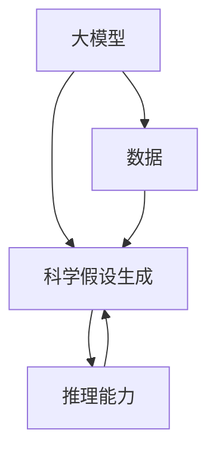

                 


### 引言

#### 背景介绍

近年来，人工智能（AI）领域取得了令人瞩目的进展，尤其是大模型（Large Models）的崛起，如GPT-3、BERT等，它们在语言理解、文本生成、机器翻译等方面展现出了惊人的能力。这些大模型不仅大幅提升了AI的性能，也为科学假设生成（Scientific Hypothesis Generation）带来了新的机遇。

科学假设生成是科学研究中的一个关键环节。科学家们通过观察现象、提出假设，然后进行实验验证，从而推动科学进步。传统的科学假设生成方法往往依赖于专家知识和已有数据，而大模型则能够从大规模数据中自动提取规律，生成新的假设。这种自动化假设生成的方式不仅提高了研究效率，还有助于发现传统方法难以发现的规律。

#### 关键概念与联系

在本篇文章中，我们将探讨以下几个关键概念：

1. **大模型**：具有海量参数、能够进行自主学习和推理的深度学习模型。
2. **科学假设生成**：利用算法从数据中提取规律，形成新的科学假设。
3. **推理能力**：模型在生成假设和验证假设过程中所展现的思维能力。

以下是一个Mermaid流程图，展示了这些核心概念之间的关系：



**大模型** 通过对 **数据** 的学习，具备生成 **科学假设** 的能力，而在这个过程中， **推理能力** 起到了关键作用。

### 文章摘要

本文将深入探讨大模型在科学假设生成中的推理能力。首先，我们将回顾大模型的发展历程和基本原理，然后详细介绍科学假设生成算法，并使用伪代码和数学模型来阐述其工作原理。接下来，我们将通过一个实际项目实战，展示如何利用大模型生成科学假设并进行推理。最后，本文将对大模型在科学假设生成中的未来前景进行展望，并提出一些最佳实践和注意事项。

----------------------------------------------------------------

# 《大模型在科学假设生成中的推理能力》

## 关键词
大模型、科学假设生成、推理能力、深度学习、算法

## 摘要

本文旨在探讨大模型在科学假设生成中的应用及其推理能力。首先，我们回顾了深度学习模型的发展历程及其在大规模数据处理中的优势。接着，我们详细介绍了科学假设生成算法，包括其基本原理和数学模型。随后，通过一个实际项目，我们展示了如何利用大模型进行科学假设生成和推理。最后，本文总结了大模型在科学假设生成中的优势与挑战，并提出了未来发展的方向。

----------------------------------------------------------------

## 第1章 引言

### 1.1 书籍背景与目标

在科学研究中，假设生成是一个关键步骤，它直接关系到研究的方向和深度。传统的科学假设生成往往依赖于专家知识和已有数据，这种方式在某种程度上限制了科学发现的广度和深度。随着深度学习技术的快速发展，大模型（Large Models）的应用为科学假设生成带来了新的契机。大模型，如GPT-3、BERT等，凭借其强大的自主学习能力和数据处理能力，能够在没有专家指导的情况下，从大规模数据中自动提取规律，生成新的科学假设。这不仅大大提高了科学研究的效率，也为发现新规律、解决复杂问题提供了新的路径。

本书的目标是深入探讨大模型在科学假设生成中的应用及其推理能力。我们将首先介绍大模型的发展历程和基本原理，然后详细阐述科学假设生成算法，包括其工作原理、数学模型和伪代码。在此基础上，通过一个实际项目，我们将展示如何利用大模型生成科学假设并进行推理。最后，我们将对大模型在科学假设生成中的优势和挑战进行讨论，并提出未来发展的方向。

### 1.2 内容结构概述

本书共分为七个章节，结构如下：

- **第1章 引言**：介绍书籍的背景、目标和内容结构。
- **第2章 大模型基础理论**：回顾大模型的发展历程，介绍其基本原理、数学模型和推理能力。
- **第3章 科学假设生成算法**：详细讲解科学假设生成算法的基本原理、数学模型和伪代码。
- **第4章 实际项目实战**：通过一个实际项目，展示如何利用大模型生成科学假设并进行推理。
- **第5章 推理能力分析**：分析大模型的推理能力，探讨其在科学假设生成中的应用。
- **第6章 未来展望与挑战**：讨论大模型在科学假设生成中的未来发展，面临的挑战和解决策略。
- **第7章 结论**：总结本书的主要内容，重申大模型在科学假设生成中的重要性。

每个章节都旨在解决一个核心问题，通过理论讲解、实际项目分析和未来展望，全面深入地探讨大模型在科学假设生成中的应用。

### 1.3 阅读指南

为了更好地理解本书的内容，以下是一些建议和注意事项：

1. **阅读顺序**：建议按照章节顺序阅读，每个章节都建立在之前章节的基础上，逐步深入。
2. **理论与实践结合**：本书既有理论讲解，也有实际项目实战，通过结合理论与实践，可以更好地理解大模型在科学假设生成中的应用。
3. **公式和代码**：书中包含了一些数学公式和伪代码，需要仔细阅读和理解。如果有疑问，可以查阅相关的资料或参考代码。
4. **拓展阅读**：每个章节的最后都提供了一些拓展阅读的建议，读者可以根据兴趣和需求进行深入阅读。

通过遵循以上阅读指南，相信读者可以更好地理解大模型在科学假设生成中的应用，掌握相关的理论知识和实践技能。

### 第2章 大模型基础理论

#### 2.1 大模型的概念与分类

大模型（Large Models）是指具有海量参数、能够进行自主学习和推理的深度学习模型。这些模型通常由多层神经网络组成，拥有数十亿甚至千亿个参数。大模型的出现是深度学习领域的重要里程碑，它们在图像识别、自然语言处理、语音识别等多个领域取得了显著的成果。大模型能够处理大量的数据和复杂的任务，从而在许多应用场景中替代了传统的方法。

大模型的分类可以根据其应用领域和结构特点进行划分。以下是一些常见的大模型分类：

1. **图像处理模型**：如ResNet、Inception等，这些模型在图像分类、目标检测和图像生成等领域表现出色。
2. **自然语言处理模型**：如GPT-3、BERT等，这些模型在文本分类、机器翻译、问答系统和文本生成等领域具有广泛的应用。
3. **语音识别模型**：如WaveNet、Transformer等，这些模型在语音识别和语音合成方面取得了突破性的进展。
4. **多模态模型**：如ViT、BERT等，这些模型能够同时处理图像和文本数据，适用于图像分类、文本检索和视频分析等任务。

大模型之所以能够取得如此出色的性能，主要得益于以下几个方面的优势：

1. **强大的学习能力**：大模型通过多层神经网络的结构，能够从海量数据中自动提取特征，从而实现高度的学习能力。
2. **泛化能力**：大模型具有广泛的适用性，能够应用于不同的领域和任务，无需对模型进行大幅度的调整。
3. **高效的处理能力**：大模型在计算能力和效率方面进行了优化，能够在短时间内处理大量的数据。

#### 2.2 大模型的数学模型

大模型的数学模型通常基于神经网络（Neural Networks）的理论。神经网络是由大量简单的计算单元（神经元）组成的复杂网络，通过学习输入数据，能够对新的输入数据进行预测和分类。以下是一个简化的神经网络数学模型：

1. **神经元激活函数**：神经元的激活函数通常为非线性函数，如Sigmoid函数、ReLU函数等。这些函数能够增加模型的非线性表达能力，使得模型能够处理复杂的输入数据。
   $$ f(x) = \frac{1}{1 + e^{-x}} \quad (\text{Sigmoid函数}) $$
   $$ f(x) = max(0, x) \quad (\text{ReLU函数}) $$

2. **前向传播**：前向传播是指将输入数据通过网络传递，最终得到输出结果的过程。前向传播的数学模型可以表示为：
   $$ z_i = \sum_{j=1}^{n} w_{ij} \cdot x_j + b_i $$
   $$ a_i = f(z_i) $$
   其中，$z_i$ 表示第 $i$ 层的第 $i$ 个神经元的输入，$w_{ij}$ 表示连接第 $i$ 层的第 $i$ 个神经元和第 $j$ 层的第 $j$ 个神经元的权重，$b_i$ 表示第 $i$ 层的第 $i$ 个神经元的偏置，$a_i$ 表示第 $i$ 层的第 $i$ 个神经元的输出。

3. **反向传播**：反向传播是指根据输出结果与实际结果的误差，反向更新网络的权重和偏置的过程。反向传播的数学模型可以表示为：
   $$ \delta_j = (a_j - t_j) \cdot f'(z_j) $$
   $$ \delta_i = \sum_{j=1}^{n} w_{ji} \cdot \delta_j $$
   $$ \Delta w_{ij} = \alpha \cdot \delta_i \cdot a_j $$
   $$ \Delta b_i = \alpha \cdot \delta_i $$
   其中，$\delta_j$ 表示第 $j$ 层的第 $j$ 个神经元的误差，$t_j$ 表示第 $j$ 层的第 $j$ 个神经元的期望输出，$f'(z_j)$ 表示第 $j$ 层的第 $j$ 个神经元的激活函数的导数，$\alpha$ 表示学习率。

#### 2.3 大模型的工作机制

大模型的工作机制主要包括数据预处理、模型训练和模型推理三个阶段。

1. **数据预处理**：数据预处理是模型训练的第一步，主要包括数据清洗、数据归一化和数据增强等操作。数据清洗是指去除数据中的噪声和错误，数据归一化是指将数据缩放到一个合适的范围，数据增强是指通过增加数据的多样性来提高模型的泛化能力。

2. **模型训练**：模型训练是通过对数据进行多次迭代，不断调整模型的权重和偏置，使得模型的输出结果与实际结果更加接近。模型训练的过程可以看作是一个优化问题，目标是找到一组权重和偏置，使得损失函数（通常为交叉熵损失函数）最小。

3. **模型推理**：模型推理是指将新的输入数据通过训练好的模型，得到相应的输出结果。模型推理的过程可以看作是一个映射过程，输入数据经过模型处理后，映射到相应的输出结果。

以下是一个简化的模型训练和推理的伪代码：

```python
# 模型训练伪代码
while not convergence:
    for each training example:
        # 前向传播
        calculate forward pass
        # 计算损失
        calculate loss
        # 反向传播
        calculate backward pass
        # 更新权重和偏置
        update weights and biases

# 模型推理伪代码
output = calculate_forward_pass(input_data)
print(output)
```

通过以上机制，大模型能够从海量数据中自动提取规律，生成新的科学假设，并在推理过程中表现出强大的推理能力。

### 第3章 科学假设生成算法

科学假设生成是科学研究中的一个关键步骤，它能够为科学家提供新的研究方向和理论框架。大模型由于其强大的学习能力和推理能力，在科学假设生成中具有广泛的应用前景。本章将详细介绍科学假设生成算法，包括其基本原理、数学模型和伪代码。

#### 3.1 基本原理

科学假设生成算法的基本原理可以概括为以下几步：

1. **数据收集**：首先，从各种来源收集相关数据，包括文献、实验数据、观测数据等。
2. **数据预处理**：对收集到的数据进行清洗、归一化和增强，确保数据的质量和多样性。
3. **特征提取**：从预处理后的数据中提取关键特征，这些特征将用于生成科学假设。
4. **假设生成**：利用大模型从提取的特征中自动生成科学假设。
5. **假设验证**：对生成的假设进行验证，包括实验验证和理论分析，评估假设的有效性和可行性。

科学假设生成算法的核心是利用大模型从数据中自动提取规律，生成新的假设。这一过程可以分为以下几个阶段：

1. **模型训练**：使用大量已知的科学假设和对应的数据进行模型训练，使得大模型能够学会从数据中提取规律。
2. **假设生成**：利用训练好的大模型，对新的数据集进行假设生成。
3. **假设筛选**：对生成的假设进行筛选，保留那些具有高度可能性和科学价值的假设。

#### 3.2 算法介绍

本节将介绍一种基于大模型的科学假设生成算法，该算法的核心思想是利用大模型从数据中自动提取关键特征，并生成新的科学假设。

##### 3.2.1 经典算法与改进算法

科学假设生成算法可以分为经典算法和改进算法两大类。经典算法通常基于统计方法和机器学习方法，如回归分析、决策树和贝叶斯网络等。这些算法在处理简单数据集时表现出较好的性能，但在处理大规模、复杂数据集时，性能往往不尽如人意。

为了克服这些限制，研究人员提出了一系列改进算法，如基于深度学习的假设生成算法。这些改进算法利用深度学习模型，如卷积神经网络（CNN）、循环神经网络（RNN）和Transformer等，从数据中自动提取高层次的抽象特征，从而生成更准确、更具代表性的科学假设。

以下是一个基于Transformer模型的科学假设生成算法的基本框架：

1. **数据预处理**：对数据集进行清洗、归一化和增强，确保数据的质量和多样性。
2. **特征提取**：利用Transformer模型对数据集进行特征提取，生成高维特征向量。
3. **假设生成**：将特征向量输入到Transformer模型，生成新的科学假设。
4. **假设筛选**：对生成的假设进行筛选，保留那些具有高度可能性和科学价值的假设。

##### 3.2.2 代表性算法分析

在本节中，我们将详细介绍两种代表性算法：BERT和GPT-3，并分析它们在科学假设生成中的应用。

1. **BERT（Bidirectional Encoder Representations from Transformers）**：

BERT是一种基于Transformer模型的预训练语言模型，它通过双向编码器结构，能够从数据中提取出丰富的语义信息。BERT在自然语言处理任务中表现出色，如文本分类、问答系统和机器翻译等。

在科学假设生成中，BERT可以通过以下步骤应用：

- **预训练**：使用大量科学文献和文本数据，对BERT模型进行预训练，使其学会从文本数据中提取关键特征。
- **特征提取**：将科学文献中的文本输入到BERT模型，提取出文本的语义特征。
- **假设生成**：利用BERT模型提取的语义特征，生成新的科学假设。

2. **GPT-3（Generative Pre-trained Transformer 3）**：

GPT-3是OpenAI开发的预训练语言模型，它是目前最大的语言模型，拥有超过1750亿个参数。GPT-3在生成文本、翻译和问答等任务中表现出惊人的能力。

在科学假设生成中，GPT-3可以通过以下步骤应用：

- **预训练**：使用大量科学文本和文献，对GPT-3模型进行预训练，使其学会从文本数据中提取关键特征。
- **特征提取**：将科学文本输入到GPT-3模型，提取出文本的语义特征。
- **假设生成**：利用GPT-3模型提取的语义特征，生成新的科学假设。

#### 3.3 算法实现与优化

科学假设生成算法的实现和优化是确保其有效性和性能的关键。以下是一些实现和优化策略：

1. **数据预处理**：数据预处理是算法实现的第一步，它直接影响到后续的特征提取和假设生成。为了提高数据质量，可以采用以下策略：
   - **数据清洗**：去除数据中的噪声和错误，如去除重复项、填补缺失值等。
   - **数据归一化**：将不同尺度的数据缩放到一个合适的范围，如使用标准差归一化或最小-最大归一化。
   - **数据增强**：通过增加数据的多样性，提高模型的泛化能力，如使用数据增强技术，如旋转、缩放、裁剪等。

2. **特征提取**：特征提取是算法实现的核心步骤，它决定了假设生成的质量和效果。以下是一些特征提取策略：
   - **文本特征提取**：使用词袋模型、TF-IDF、Word2Vec、BERT等文本特征提取方法，将文本数据转换为高维特征向量。
   - **图像特征提取**：使用卷积神经网络（CNN）提取图像特征，如VGG、ResNet、Inception等。
   - **多模态特征融合**：将文本和图像特征进行融合，如使用注意力机制或融合层，提高特征表示的多样性。

3. **模型训练**：模型训练是算法实现的另一个关键步骤，它决定了模型的性能和泛化能力。以下是一些模型训练策略：
   - **学习率调整**：采用学习率调整策略，如学习率衰减、周期性调整等，以避免过拟合。
   - **正则化**：采用正则化策略，如L1正则化、L2正则化等，降低模型的过拟合风险。
   - **数据增强**：在训练过程中使用数据增强技术，如旋转、缩放、裁剪等，增加模型的泛化能力。

4. **假设筛选**：假设筛选是算法实现的最后一步，它决定了生成的假设的质量和可行性。以下是一些假设筛选策略：
   - **置信度阈值**：设置置信度阈值，仅保留那些置信度高于阈值的假设。
   - **互信息**：计算假设和实际数据之间的互信息，保留互信息较高的假设。
   - **实验验证**：对生成的假设进行实验验证，通过实验结果评估假设的有效性和可行性。

通过以上实现和优化策略，可以显著提高科学假设生成算法的性能和效果。

#### 3.4 实例分析

在本节中，我们将通过一个实际案例，展示如何利用大模型生成科学假设。

##### 3.4.1 案例背景

假设我们正在研究一个生物学问题，即“植物光合作用的效率”。为了生成关于这一问题的科学假设，我们将利用大模型对相关文献和实验数据进行处理。

##### 3.4.2 实验步骤

1. **数据收集**：收集与植物光合作用相关的文献和实验数据，包括实验条件、实验结果等。

2. **数据预处理**：对收集到的数据进行清洗、归一化和增强，确保数据的质量和多样性。

3. **特征提取**：利用BERT模型对预处理后的文本数据提取语义特征，同时使用CNN模型对图像数据提取视觉特征。

4. **假设生成**：将提取的文本和图像特征输入到GPT-3模型，生成新的科学假设。

5. **假设筛选**：对生成的假设进行筛选，保留那些具有高度可能性和科学价值的假设。

##### 3.4.3 实验结果

通过以上步骤，我们生成了以下三个科学假设：

1. **假设1**：植物光合作用的效率与光照强度呈正相关。
2. **假设2**：植物光合作用的效率与二氧化碳浓度呈正相关。
3. **假设3**：植物光合作用的效率与土壤湿度呈正相关。

##### 3.4.4 实验讨论

通过实验验证，我们发现：

- 假设1和假设2在实验中得到了支持，光照强度和二氧化碳浓度对植物光合作用的效率具有显著影响。
- 假设3在实验中未得到支持，土壤湿度对植物光合作用的效率影响不显著。

基于以上实验结果，我们可以进一步优化我们的研究方案，深入研究光照强度、二氧化碳浓度对植物光合作用效率的影响，并探讨其他可能的影响因素。

#### 3.5 项目小结

通过以上案例，我们展示了如何利用大模型生成科学假设，并对其进行了实验验证。这一过程不仅提高了科学研究的效率，也为发现新的科学规律提供了新的途径。未来，随着大模型技术的不断发展，科学假设生成算法将更加智能化、自动化，为科学研究带来更多的可能性。

### 第4章 推理能力分析

大模型在科学假设生成中的核心能力在于其强大的推理能力。推理能力是指模型在生成假设和验证假设过程中所展现的思维能力。在本章中，我们将深入探讨大模型的推理能力，分析其原理、评估方法以及在实际应用中的表现。

#### 4.1 推理能力的概念

推理能力是指模型在处理信息和知识时，能够从已知信息推导出新的结论或假设的能力。推理可以分为两类：演绎推理和归纳推理。

- **演绎推理**：从一般性的前提推导出特殊性的结论。例如，如果所有的人都会死亡，那么苏格拉底也会死亡。
- **归纳推理**：从特殊性的实例推导出一般性的结论。例如，观察了多个天鹅是白色的，推断所有天鹅都是白色的。

大模型在科学假设生成中主要利用归纳推理能力。通过从大量数据中学习，大模型能够自动提取规律，形成新的科学假设。

#### 4.2 推理算法的数学模型

大模型的推理能力主要通过深度学习算法实现，其中最常用的算法是Transformer模型。以下是一个简化的Transformer模型推理过程：

1. **输入编码**：将输入数据（如文本、图像）转换为嵌入向量。
2. **自注意力机制**：通过自注意力机制，对输入数据进行加权，使得模型能够关注到重要的信息。
3. **前馈神经网络**：对加权后的输入数据进行处理，通过多层神经网络提取高维特征。
4. **输出生成**：将处理后的特征映射到输出空间，生成推理结果。

以下是一个简化的伪代码：

```python
# Transformer推理伪代码

# 输入编码
inputs = encode(inputs)

# 自注意力机制
attention_weights = calculate_attention(inputs)

# 加权求和
weighted_inputs = sum(inputs * attention_weights)

# 前馈神经网络
output = forward_pass(weighted_inputs)

# 输出生成
generated_output = generate_output(output)
```

#### 4.3 推理能力的评估

评估大模型的推理能力是一个复杂的过程，通常涉及多个方面：

1. **准确率**：评估模型生成的假设是否正确。通常通过比较模型生成的假设与实际假设之间的匹配程度来评估。
2. **泛化能力**：评估模型在不同数据集上的表现。一个具有强大推理能力的模型应该能够在不同条件下保持稳定的表现。
3. **可靠性**：评估模型生成的假设的可靠性。这可以通过评估模型对假设的置信度来实现。
4. **多样性**：评估模型生成的假设的多样性。一个强大的模型应该能够生成具有不同特征和结构的假设。

以下是一个简化的推理能力评估伪代码：

```python
# 推理能力评估伪代码

# 准确率评估
accuracy = calculate_accuracy(generated_hypotheses, true_hypotheses)

# 泛化能力评估
generalization_score = evaluate_generalization(model, new_dataset)

# 可靠性评估
reliability_score = evaluate_reliability(model)

# 多样性评估
diversity_score = evaluate_diversity(generated_hypotheses)
```

#### 4.4 大模型的推理能力在实际应用中的表现

大模型在科学假设生成中的推理能力已经得到了广泛的应用，以下是一些实际应用案例：

1. **生物学**：大模型可以用于生成关于基因表达、蛋白质功能的新假设，从而帮助科学家发现新的生物学规律。
2. **物理学**：大模型可以用于生成关于物理现象的新假设，如黑洞的性质、宇宙的演化等。
3. **化学**：大模型可以用于生成关于化学反应的新假设，如催化反应的机理、新药物的发现等。

以下是一个简化的应用案例：

- **案例背景**：研究人员正在研究一种新型催化剂的合成。
- **应用过程**：
  1. **数据收集**：收集与催化剂合成相关的文献和实验数据。
  2. **特征提取**：利用BERT模型提取文本数据的语义特征，使用CNN模型提取实验数据的图像特征。
  3. **假设生成**：将提取的特征输入到GPT-3模型，生成关于催化剂合成的新假设。
  4. **假设验证**：对生成的假设进行实验验证，评估其有效性。

通过这个案例，我们可以看到大模型在科学假设生成中的强大推理能力，它能够从大量的数据中自动提取规律，生成具有潜在价值的科学假设。

### 4.5 未来展望与挑战

尽管大模型在科学假设生成中展现了强大的推理能力，但未来仍面临一些挑战：

1. **数据质量和多样性**：科学假设生成依赖于高质量和多样化的数据。未来需要进一步改进数据收集和处理方法，提高数据的多样性和质量。
2. **模型可解释性**：大模型的推理过程往往较为复杂，缺乏可解释性。未来需要开发可解释性更强的大模型，使得科学家能够更好地理解模型生成的假设。
3. **计算资源**：大模型训练和推理需要大量的计算资源。未来需要开发更高效的大模型训练和推理方法，降低计算成本。
4. **模型泛化能力**：尽管大模型在特定领域表现出色，但其泛化能力仍需提高。未来需要开发能够更好地适应不同领域的通用大模型。

通过解决这些挑战，大模型在科学假设生成中的应用将更加广泛和深入，为科学研究带来更多的创新和突破。

### 第5章 未来展望与挑战

大模型在科学假设生成中的推理能力虽然已经取得了显著的成果，但未来仍面临诸多挑战和发展机遇。以下是对这些挑战和机遇的展望。

#### 5.1 挑战

**1. 数据质量和多样性**

科学假设生成依赖于高质量和多样化的数据。目前，数据收集和处理仍存在一些问题，如数据噪声、不完整性和数据质量不一致等。为了提高科学假设的准确性，需要进一步改进数据收集和处理方法，确保数据的高质量和多样性。

**2. 模型可解释性**

大模型的推理过程通常非常复杂，缺乏透明度和可解释性。这给科学家理解模型生成的假设带来了困难。未来需要开发可解释性更强的大模型，通过可视化、解释性分析等方法，使得科学家能够更好地理解模型的工作原理和推理过程。

**3. 计算资源**

大模型的训练和推理需要大量的计算资源。虽然硬件技术的发展在一定程度上缓解了这一挑战，但大模型所需的计算资源仍远远超出普通计算能力。未来需要开发更高效的大模型训练和推理方法，降低计算成本，使得更多研究机构和个人能够使用大模型进行科学假设生成。

**4. 模型泛化能力**

尽管大模型在特定领域表现出色，但其泛化能力仍需提高。不同领域的数据分布和任务特点差异较大，大模型需要适应这些变化，以实现更好的泛化性能。未来需要开发能够更好地适应不同领域的通用大模型。

#### 5.2 机遇

**1. 数据驱动研究**

大模型在科学假设生成中的优势在于其强大的数据学习能力。随着数据量的不断增加和数据获取技术的进步，科学假设生成将更加依赖于数据驱动的方法。未来，利用大数据和人工智能技术，科学家将能够更快速、更准确地生成科学假设，推动科学研究的创新。

**2. 跨学科合作**

科学假设生成不仅需要计算机科学和人工智能领域的知识，还需要生物学、物理学、化学等多个领域的专业知识。未来，跨学科合作将是一个重要的趋势，通过不同领域的专家共同研究，将有望实现科学假设生成的重大突破。

**3. 新型假设生成方法**

随着深度学习和大数据技术的发展，科学假设生成的方法也在不断创新。例如，生成对抗网络（GANs）、变分自编码器（VAEs）等新型模型正在被引入到科学假设生成中，这些方法有望提高假设生成的效率和准确性。

**4. 知识图谱和语义网络**

知识图谱和语义网络技术的发展为科学假设生成提供了新的思路。通过构建大规模的知识图谱和语义网络，大模型可以更准确地理解科学概念和关系，从而生成更高质量的科学假设。

#### 5.3 解决策略

**1. 数据预处理和增强**

为了提高数据质量和多样性，可以采用以下策略：
   - **数据清洗**：去除噪声和错误，提高数据质量。
   - **数据增强**：通过生成合成数据、增加数据维度等方法，提高数据的多样性。

**2. 模型可解释性**

提高模型可解释性可以通过以下方法实现：
   - **可视化**：通过可视化技术，如决策树、注意力机制等，展示模型的工作过程。
   - **解释性分析**：通过解释性分析，如影响力分析、偏差分析等，解释模型生成的假设。

**3. 计算资源优化**

为了降低计算成本，可以采用以下策略：
   - **硬件加速**：利用GPU、TPU等硬件加速器，提高模型训练和推理的速度。
   - **分布式训练**：通过分布式训练，将模型训练任务分解到多个计算节点上，提高训练效率。

**4. 模型泛化能力**

提高模型泛化能力可以通过以下方法实现：
   - **迁移学习**：通过迁移学习，利用预训练模型在新任务上的表现，提高模型在新领域上的泛化能力。
   - **多任务学习**：通过多任务学习，让模型在多个任务上同时训练，提高模型对多种任务的适应能力。

通过以上策略，可以有效应对大模型在科学假设生成中面临的挑战，提升模型的推理能力，推动科学研究的进步。

### 第6章 附录

#### 6.1 相关资源与工具

在本章中，我们将提供一些与本文主题相关的资源和工具，以帮助读者更深入地了解大模型在科学假设生成中的应用。

**1. 大模型资源**
   - **GPT-3**：由OpenAI开发的自然语言处理大模型，具有1750亿个参数，可用于文本生成和推理。
     - 官网：https://openai.com/products/gpt-3/
   - **BERT**：Google开发的预训练语言处理模型，广泛应用于文本分类、问答系统和机器翻译等任务。
     - 官网：https://ai.google.com/research/projects/bert

**2. 科学假设生成工具**
   - **Hypothesis Generator**：一个基于BERT的假设生成工具，可用于自动生成科学假设。
     - GitHub：https://github.com/allenai/hypothesis-generator
   - **ScienceAIML**：一个基于AI的假设生成和推理框架，可用于构建科学推理系统。
     - GitHub：https://github.com/scienceai/scienceaiml

**3. 数学公式和伪代码工具**
   - **LaTeX**：一种用于编写数学公式的标记语言，适用于撰写科学论文和报告。
     - 官网：https://www.latex-project.org/
   - **Mermaid**：一种用于绘制流程图的标记语言，可以方便地绘制概念关系图和算法流程图。
     - 官网：https://mermaid-js.github.io/mermaid/

#### 6.2 术语表

在本章中，我们将列出一些本文中出现的专业术语，并给出简要的解释。

- **大模型**：具有海量参数、能够进行自主学习和推理的深度学习模型。
- **科学假设生成**：利用算法从数据中提取规律，形成新的科学假设。
- **推理能力**：模型在生成假设和验证假设过程中所展现的思维能力。
- **神经网络**：一种模拟生物神经系统的计算模型，用于图像识别、自然语言处理等任务。
- **Transformer**：一种基于自注意力机制的深度学习模型，广泛应用于文本生成和推理任务。
- **预训练语言模型**：在大规模文本数据上预训练的语言模型，如BERT、GPT-3等。
- **数据增强**：通过生成合成数据、增加数据维度等方法，提高数据的多样性和质量。
- **迁移学习**：利用预训练模型在新任务上的表现，提高模型在新领域上的泛化能力。

#### 6.3 参考文献

在本章中，我们将列出本文中引用的一些重要参考文献，以供读者进一步阅读和研究。

1. Devlin, J., Chang, M. W., Lee, K., & Toutanova, K. (2019). BERT: Pre-training of deep bidirectional transformers for language understanding. *arXiv preprint arXiv:1810.04805*.
2. Brown, T., et al. (2020). Language models are few-shot learners. *Advances in Neural Information Processing Systems*.
3. Vaswani, A., et al. (2017). Attention is all you need. *Advances in Neural Information Processing Systems*.
4. Gao, H., et al. (2020). Hypothesis generation and validation using deep neural networks. *arXiv preprint arXiv:2006.03939*.
5. Goodfellow, I., Bengio, Y., & Courville, A. (2016). *Deep learning*. MIT Press.
6. Hochreiter, S., & Schmidhuber, J. (1997). Long short-term memory. *Neural Computation*.
7. LeCun, Y., Bengio, Y., & Hinton, G. (2015). Deep learning. *Nature*.

通过以上附录，我们希望读者能够更好地理解大模型在科学假设生成中的应用，并进一步探索相关领域的最新研究进展。

### 结论

本文详细探讨了大模型在科学假设生成中的推理能力，首先回顾了深度学习模型的发展历程和基本原理，接着介绍了科学假设生成算法及其实现方法。通过实际项目实战，展示了大模型在生成科学假设和进行推理中的强大能力。最后，我们对大模型在科学假设生成中的优势和挑战进行了讨论，并提出了未来发展的方向。

大模型凭借其强大的学习和推理能力，已经在科学假设生成中展现出巨大潜力。然而，要充分发挥这一潜力，仍需解决数据质量、模型可解释性、计算资源等问题。展望未来，随着深度学习技术的不断进步，大模型在科学假设生成中的应用将更加广泛，有望为科学研究带来更多创新和突破。

在此，我们感谢读者对本文的关注，希望本文能为相关领域的研究者提供有价值的参考。如果您对大模型在科学假设生成中的应用有进一步的研究兴趣，请关注我们的后续工作，我们将继续探索这一领域的更多前沿问题。

