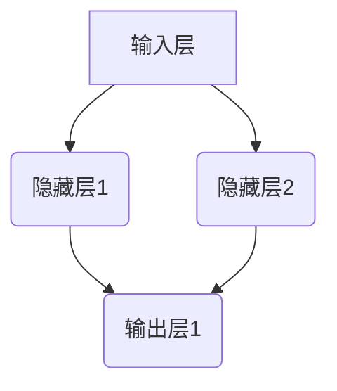
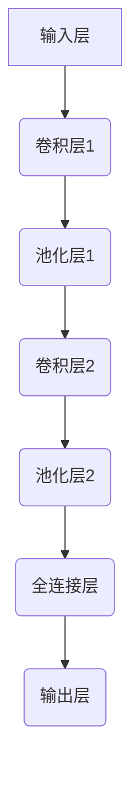
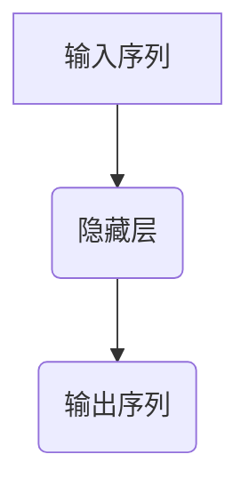

                 

### 文章标题

# 大模型在科学发现过程推理中的角色探索

在当今飞速发展的科技时代，大模型（Large Models）已经成为科学发现和研究中的重要工具。它们以庞大的数据集为基础，通过复杂的算法和架构，实现了前所未有的计算能力和推理深度。本文旨在探讨大模型在科学发现过程中的具体角色，通过一步一步的分析推理，深入揭示大模型如何改变科学研究的面貌。

关键词：大模型，科学发现，推理，神经网络，深度学习，算法

摘要：本文首先介绍了大模型的基本概念和发展历程，随后深入探讨了其在科学研究中的角色。通过具体的案例，如生物学、物理学和其他科学领域，展示了大模型的应用实例。最后，文章分析了大模型在科学发现过程中面临的挑战和未来发展方向。读者将了解到大模型如何通过提升数据处理能力和推理深度，为科学发现提供新的视角和解决方案。

### 目录大纲设计思路

在设计目录大纲时，我们遵循以下思路：

1. **明确书的主题和目标读者**：
   - 主题：《大模型在科学发现过程推理中的角色探索》。
   - 目标读者：希望了解大模型在科学研究中的具体应用和作用的研究人员、学生和专业人士。

2. **框架结构**：
   - 整体结构分为四个主要部分，每个部分聚焦于不同的主题，便于读者理解和跟随。

3. **内容细化**：
   - 第一部分：介绍大模型的基本概念和科学发现背景。
   - 第二部分：深入探讨大模型的工作原理和技术细节。
   - 第三部分：展示大模型在具体科学领域中的应用案例。
   - 第四部分：讨论大模型在科学发现中的未来发展方向和挑战。

4. **逻辑性**：
   - 每个章节的内容都是相互关联的，前一个章节的内容为后一个章节提供了基础和背景。

5. **技术性**：
   - 包含相关的数学模型和算法原理讲解，使用伪代码进行详细阐述。
   - 每个章节的结尾部分提供项目实战和代码案例，以增强读者的理解和应用能力。

6. **简洁性**：
   - 尽量保持目录的简洁性，避免冗余信息，确保每个章节的核心内容明确。

7. **完整性**：
   - 确保目录大纲中包含了核心章节内容，如核心概念与联系、核心算法原理讲解、数学模型和数学公式详细讲解、项目实战等。

### 目录大纲设计

基于以上思路，以下是《大模型在科学发现过程推理中的角色探索》的目录大纲：

```
# 第一部分：大模型基础

## 第1章：大模型概述
### 1.1 大模型的定义与分类
### 1.2 大模型在科学发现中的角色
### 1.3 大模型的发展历程与技术演进

## 第2章：大模型核心技术原理
### 2.1 神经网络基础
#### 2.1.1 神经元与神经网络
#### 2.1.2 前馈神经网络
#### 2.1.3 卷积神经网络
#### 2.1.4 循环神经网络
### 2.2 大模型训练过程
#### 2.2.1 训练算法
#### 2.2.2 优化策略
#### 2.2.3 超参数调优

## 第3章：大模型架构与设计
### 3.1 大模型架构概述
#### 3.1.1 通用架构
#### 3.1.2 特定领域架构
### 3.2 大模型设计原则
#### 3.2.1 模型规模与效率
#### 3.2.2 可解释性与可控性
#### 3.2.3 能效比与可持续性

## 第4章：大模型数学模型与公式
### 4.1 概率论基础
$$ P(A|B) = \frac{P(B|A)P(A)}{P(B)} $$
### 4.2 信息论基础
$$ H(X) = -\sum_{i} p(x_i) \log_2 p(x_i) $$
### 4.3 深度学习算法公式
$$ \frac{\partial L}{\partial \theta} = \nabla_{\theta} L = \nabla_{\theta} \sum_{i=1}^{n} (-y_i \log(\hat{y}_i)) $$

# 第二部分：大模型在科学发现中的应用

## 第5章：大模型在生物学中的应用
### 5.1 基因序列分析
### 5.2 蛋白质结构预测
### 5.3 系统生物学建模

## 第6章：大模型在物理学中的应用
### 6.1 天体物理学数据分析
### 6.2 高能物理数据挖掘
### 6.3 物理学问题求解与预测

## 第7章：大模型在其他科学领域中的应用
### 7.1 地球科学数据挖掘
### 7.2 化学反应预测
### 7.3 其他新兴应用领域

# 第三部分：大模型应用的挑战与未来展望

## 第8章：大模型应用的挑战
### 8.1 数据隐私保护
### 8.2 模型安全性与可解释性
### 8.3 计算资源需求与效率

## 第9章：大模型未来的发展趋势
### 9.1 新型算法与架构
### 9.2 跨学科融合
### 9.3 社会影响与伦理问题

# 附录：资源与工具
## 附录1：开源大模型与工具
### 1.1 TensorFlow
### 1.2 PyTorch
### 1.3 其他常用工具

## 附录2：参考文献与进一步阅读
```

该目录大纲涵盖了书籍的核心内容，从基础理论到应用案例，再到未来展望，为读者提供了全面而深入的阅读体验。每章内容细化到小节，确保了内容的逻辑性和系统性。

---

接下来，我们将逐步深入探讨大模型在科学发现过程中的角色，从基础概念、核心技术原理、应用实例到未来发展趋势，为读者展现大模型如何改变科学研究的格局。

---

### 第一部分：大模型基础

#### 第1章：大模型概述

##### 1.1 大模型的定义与分类

大模型，顾名思义，是指具有极大参数量和计算能力的人工智能模型。这些模型通常基于深度学习技术，通过多层神经网络进行复杂的特征学习和模式识别。与传统模型相比，大模型能够处理海量的数据，提取深层特征，从而实现更高的准确性和泛化能力。

根据参数量和架构，大模型可以分为以下几类：

1. **小模型**：参数量较少，通常用于简单任务，如图像分类、文本分类等。
2. **中型模型**：参数量在几千到几百万之间，能够处理较为复杂的问题，如语音识别、机器翻译等。
3. **大模型**：参数量在几千万到几十亿之间，具有极强的学习和推理能力，如BERT、GPT等。
4. **超大规模模型**：参数量达到数十亿甚至上百亿，能够处理极其复杂的问题，如谷歌的T5、微软的Moss等。

##### 1.2 大模型在科学发现中的角色

大模型在科学发现中的角色日益重要，主要体现在以下几个方面：

1. **数据驱动发现**：大模型能够从海量数据中自动学习复杂的模式和关联，从而发现新的科学规律和现象。
2. **高效计算**：大模型能够处理复杂的多维数据，并快速进行大规模的计算，大幅提高科研效率。
3. **推理与预测**：大模型通过内部推理机制，能够对未知数据进行预测，为科学实验提供指导。
4. **交叉领域研究**：大模型在不同领域的应用，促进了跨学科的研究和合作，推动了科学前沿的发展。

##### 1.3 大模型的发展历程与技术演进

大模型的发展历程可以追溯到上世纪80年代的神经网络研究。最初，神经网络模型如感知机、BP网络等，由于其简单和局限性，并未在科学发现中发挥重要作用。随着计算能力的提升和数据量的爆炸式增长，深度学习技术逐渐成熟，大模型应运而生。

以下是大模型发展的几个关键阶段：

1. **2006年**：Hinton提出了深度信念网络（DBN），为深度学习奠定了基础。
2. **2012年**：AlexNet在ImageNet大赛中取得突破性成绩，深度卷积神经网络（CNN）受到广泛关注。
3. **2014年**：RNN及其变种LSTM和GRU在序列数据处理中表现出色。
4. **2018年**：GPT系列模型的出现，标志着自然语言处理领域的重大突破。
5. **2020年**：Transformer架构的广泛应用，进一步提升了大模型的性能。

技术的发展也推动了大模型的应用，从最初的图像识别、语音识别到现在的自然语言处理、基因组学、天体物理学等，大模型在各个科学领域发挥着越来越重要的作用。

---

通过本章的介绍，我们初步了解了大模型的基本概念、分类以及在科学发现中的角色。接下来，我们将深入探讨大模型的核心技术原理，包括神经网络基础、训练过程、架构设计等，为理解大模型在科学发现中的应用打下坚实的基础。

#### 第2章：大模型核心技术原理

##### 2.1 神经网络基础

神经网络（Neural Networks，NN）是构建大模型的基础。它受到生物神经系统的启发，通过模拟神经元之间的连接和激活方式，实现复杂的计算任务。以下是对神经网络基础内容的详细探讨：

###### 2.1.1 神经元与神经网络

神经元是神经网络的基本单位，通常由三个部分组成：输入层、隐藏层和输出层。每个神经元接收来自输入层的信号，通过权重（weights）和激活函数（activation function）处理后，生成输出。

一个简单的神经网络示意图如下：



其中，每个连接上的权重表示神经元之间的交互强度，激活函数如ReLU（Rectified Linear Unit）用于引入非线性变换，使神经网络具备更强大的表达能力。

###### 2.1.2 前馈神经网络

前馈神经网络（Feedforward Neural Network）是最常见的一种神经网络结构，其中信号仅从输入层流向输出层，不会在中间层反向传播。其基本原理如下：

1. **输入层**：接收外部输入数据，并将其传递到隐藏层。
2. **隐藏层**：通过加权求和和激活函数处理输入，生成隐藏层的输出。
3. **输出层**：将隐藏层的输出映射到最终输出。

前馈神经网络的伪代码如下：

```python
def forward(input_data, weights, biases, activation_function):
    hidden_layer_output = [0] * num_hidden_layers
    current_input = input_data
    
    for layer in range(num_hidden_layers):
        weighted_sum = np.dot(current_input, weights[layer]) + biases[layer]
        hidden_layer_output[layer] = activation_function(weighted_sum)
        current_input = hidden_layer_output[layer]
    
    output = activation_function(np.dot(current_input, weights[-1]) + biases[-1])
    return output
```

其中，`input_data`表示输入数据，`weights`和`biases`分别表示权重和偏置，`activation_function`用于引入非线性变换。

###### 2.1.3 卷积神经网络

卷积神经网络（Convolutional Neural Network，CNN）特别适用于处理图像数据。其主要特点是利用卷积操作提取图像的局部特征，并通过多层卷积和池化操作，实现特征提取和分类。以下是一个简单的CNN结构：



CNN的核心组件包括：

1. **卷积层**：通过卷积操作提取图像的局部特征。卷积核（kernel）在不同位置滑动，与输入图像进行点积运算，生成特征图。
2. **池化层**：用于降低特征图的维度，同时保持重要的特征信息。常见的池化操作有最大池化（Max Pooling）和平均池化（Average Pooling）。
3. **全连接层**：将卷积层提取的高层次特征映射到最终输出，通常用于分类任务。

卷积操作的伪代码如下：

```python
def conv2d(input_image, filter, padding='VALID'):
    output_height = input_image.shape[0] - filter.shape[0] + 1
    output_width = input_image.shape[1] - filter.shape[1] + 1
    output = np.zeros((output_height, output_width))
    
    for i in range(output_height):
        for j in range(output_width):
            patch = input_image[i:i+filter.shape[0], j:j+filter.shape[1]]
            output[i, j] = np.dot(patch.flatten(), filter)
    
    if padding == 'VALID':
        return output
    else:
        padded_image = np.pad(input_image, ((padding, padding), (padding, padding)), 'constant')
        return conv2d(padded_image, filter, padding='VALID')
```

其中，`input_image`表示输入图像，`filter`表示卷积核，`padding`用于控制卷积操作的边界处理方式。

###### 2.1.4 循环神经网络

循环神经网络（Recurrent Neural Network，RNN）特别适用于处理序列数据，如时间序列、文本等。与传统的前馈神经网络不同，RNN具有时间动态性，能够捕捉序列中的时间依赖关系。以下是一个简单的RNN结构：



RNN的核心组件包括：

1. **隐藏层**：在时间步t，隐藏层状态`h_t`由前一时刻的隐藏状态`h_{t-1}`和当前输入`x_t`共同决定。常见的RNN模型包括LSTM（Long Short-Term Memory）和GRU（Gated Recurrent Unit），它们通过门控机制解决了RNN的梯度消失问题。
2. **输出层**：将隐藏层状态映射到序列的输出，如文本生成、语音合成等。

RNN的伪代码如下：

```python
def rnn(input_sequence, weights, biases, activation_function):
    hidden_states = [0] * len(input_sequence)
    for t in range(len(input_sequence)):
        if t == 0:
            h_t = np.dot(input_sequence[t], weights['input_to_hidden']) + biases['hidden']
        else:
            h_t = np.dot(h_{t-1}, weights['hidden_to_hidden']) + np.dot(input_sequence[t], weights['input_to_hidden']) + biases['hidden']
        hidden_states[t] = activation_function(h_t)
    
    output = activation_function(np.dot(hidden_states, weights['hidden_to_output']) + biases['output'])
    return output, hidden_states
```

其中，`input_sequence`表示输入序列，`weights`和`biases`分别表示权重和偏置，`activation_function`用于引入非线性变换。

##### 2.2 大模型训练过程

大模型的训练过程是其发挥强大能力的关键步骤。训练过程中，模型通过不断调整权重和偏置，最小化损失函数，达到对数据的最佳拟合。以下是训练过程的详细讨论：

###### 2.2.1 训练算法

常用的训练算法包括随机梯度下降（SGD）、Adam等。以下分别介绍这些算法的基本原理和优缺点。

1. **随机梯度下降（SGD）**：

   SGD是最简单的优化算法之一，其基本思想是沿着梯度方向进行迭代更新，直到达到最小化损失函数。

   - 原理：
     $$ \theta_{t+1} = \theta_{t} - \alpha \nabla_{\theta} L(\theta) $$
     其中，`theta`表示模型参数，`alpha`表示学习率，`L`表示损失函数。
   
   - 优缺点：
     - 优点：简单易实现，计算效率高。
     - 缺点：收敛速度较慢，容易陷入局部最优。

2. **Adam优化器**：

   Adam优化器结合了SGD和Adagrad的优点，具有良好的收敛性和稳定性。

   - 原理：
     $$ m_t = \beta_1 m_{t-1} + (1 - \beta_1) \nabla_{\theta} L(\theta) $$
     $$ v_t = \beta_2 v_{t-1} + (1 - \beta_2) (\nabla_{\theta} L(\theta))^2 $$
     $$ \theta_{t+1} = \theta_{t} - \alpha \frac{m_t}{\sqrt{v_t} + \epsilon} $$
     其中，`beta_1`和`beta_2`分别为短期和长期记忆系数，`epsilon`为避免除以零的常数。

   - 优缺点：
     - 优点：收敛速度快，对噪声数据鲁棒。
     - 缺点：计算复杂度较高。

###### 2.2.2 优化策略

优化策略是提高训练效率和模型性能的关键。以下介绍几种常用的优化策略：

1. **批量归一化（Batch Normalization）**：

   批量归一化通过标准化每个批次的输入数据，提高模型的训练稳定性和速度。

   - 原理：
     $$ \hat{x}_i = \frac{x_i - \mu}{\sigma} $$
     其中，`x_i`为输入数据，`mu`和`sigma`分别为均值和标准差。

   - 优缺点：
     - 优点：提高训练稳定性，加速收敛。
     - 缺点：增加模型参数，对硬件资源要求较高。

2. **Dropout**：

   Dropout是一种正则化技术，通过随机丢弃部分神经元，减少模型过拟合。

   - 原理：
     $$ p = \frac{1}{1 + \exp(-\alpha)} $$
     其中，`p`为丢弃概率，`alpha`为丢弃强度。

   - 优缺点：
     - 优点：减少过拟合，提高泛化能力。
     - 缺点：可能降低模型性能，对训练时间有一定影响。

3. **学习率调度**：

   学习率调度通过动态调整学习率，优化模型收敛速度和性能。

   - 原理：
     $$ \alpha_t = \alpha_0 / (1 + \beta t) $$
     其中，`alpha_0`为初始学习率，`beta`为衰减系数。

   - 优缺点：
     - 优点：加速模型收敛，提高性能。
     - 缺点：对学习率和衰减系数的选择要求较高。

###### 2.2.3 超参数调优

超参数调优是提高模型性能的关键步骤。以下介绍几种常用的调优方法：

1. **网格搜索（Grid Search）**：

   网格搜索通过遍历预定义的超参数组合，找到最优参数。

   - 原理：
     - 预定义超参数范围。
     - 对每个超参数组合进行训练和验证，记录性能指标。
     - 选择性能指标最优的超参数组合。

   - 优缺点：
     - 优点：简单直观，易于实现。
     - 缺点：计算量大，适用于参数较少的情况。

2. **随机搜索（Random Search）**：

   随机搜索通过随机选择超参数，找到最优参数。

   - 原理：
     - 随机生成超参数组合。
     - 对每个超参数组合进行训练和验证，记录性能指标。
     - 选择性能指标最优的超参数组合。

   - 优缺点：
     - 优点：计算量相对较小，适用于参数较多的情况。
     - 缺点：可能错过最优参数组合。

3. **贝叶斯优化（Bayesian Optimization）**：

   贝叶斯优化通过构建概率模型，优化超参数搜索过程。

   - 原理：
     - 构建先验概率模型。
     - 根据先验概率模型和已获得的性能指标，更新后验概率模型。
     - 根据后验概率模型选择下一个超参数组合。

   - 优缺点：
     - 优点：高效、鲁棒，适用于复杂超参数空间。
     - 缺点：计算复杂度较高，需要大量计算资源。

##### 2.3 大模型架构与设计

大模型的架构与设计直接影响其性能和应用效果。以下从通用架构和特定领域架构两个方面进行讨论：

###### 2.3.1 通用架构

通用架构是指适用于多种任务的大模型结构，常见的包括：

1. **Transformer**：

   Transformer模型基于自注意力机制，适用于自然语言处理、序列建模等任务。

   - 特点：
     - 自注意力机制：通过计算输入序列中每个元素与其他元素之间的相似度，实现全局依赖关系。
     - 位置编码：引入位置信息，保证模型能够理解序列的顺序。

   - 优缺点：
     - 优点：强大的序列建模能力，适用于多种语言任务。
     - 缺点：参数量较大，计算复杂度高。

2. **BERT**：

   BERT（Bidirectional Encoder Representations from Transformers）模型通过双向编码器，实现文本的上下文理解。

   - 特点：
     - 双向编码器：通过前向和后向Transformer层，捕捉文本的上下文信息。
     - 零样本学习：通过大量无标签数据预训练，实现少量有标签数据的高性能应用。

   - 优缺点：
     - 优点：强大的文本理解能力，适用于多种自然语言处理任务。
     - 缺点：训练和推理资源消耗较大。

###### 2.3.2 特定领域架构

特定领域架构是根据具体任务和应用场景设计的模型结构，常见的包括：

1. **图像分类架构**：

   图像分类架构主要基于卷积神经网络，适用于图像分类、目标检测等任务。

   - 特点：
     - 卷积层：通过卷积操作提取图像的局部特征。
     - 池化层：通过池化操作降低特征图的维度。
     - 全连接层：通过全连接层将特征映射到分类结果。

   - 优缺点：
     - 优点：强大的图像特征提取能力，适用于多种图像分类任务。
     - 缺点：对大规模图像数据训练和推理资源要求较高。

2. **语音识别架构**：

   语音识别架构主要基于循环神经网络和卷积神经网络，适用于语音识别、说话人识别等任务。

   - 特点：
     - 卷积层：通过卷积操作提取语音信号的局部特征。
     - 循环层：通过循环神经网络捕捉语音信号的时间依赖关系。
     - 全连接层：通过全连接层将特征映射到识别结果。

   - 优缺点：
     - 优点：强大的语音特征提取和序列建模能力，适用于多种语音识别任务。
     - 缺点：对大规模语音数据训练和推理资源要求较高。

##### 2.4 大模型设计原则

大模型设计原则是保证模型性能和应用效果的关键。以下从模型规模、效率、可解释性和可持续性四个方面进行讨论：

###### 2.4.1 模型规模与效率

模型规模与效率是设计大模型时的关键考虑因素。以下从参数规模、计算效率和模型压缩三个方面进行讨论：

1. **参数规模**：

   - 原则：在满足性能要求的前提下，尽量减少模型参数规模，降低计算复杂度和存储需求。
   - 方法：
     - 窄网络结构：通过减少网络层数和每层的神经元数量，降低模型参数规模。
     - 稀疏连接：通过引入稀疏连接机制，减少非零连接的数量。

2. **计算效率**：

   - 原则：提高计算效率，降低训练和推理时间，提高模型应用效果。
   - 方法：
     - 并行计算：通过分布式计算和GPU加速，提高模型训练和推理速度。
     - 算法优化：通过算法优化和模型蒸馏，提高模型效率和性能。

3. **模型压缩**：

   - 原则：在保证模型性能的前提下，减小模型规模，降低计算和存储需求。
   - 方法：
     - 知识蒸馏：通过知识蒸馏技术，将大型模型的权重知识迁移到小型模型中。
     - 模型剪枝：通过模型剪枝技术，去除不重要的连接和神经元，降低模型参数规模。

###### 2.4.2 可解释性与可控性

可解释性与可控性是评估大模型应用效果的重要指标。以下从模型解释和模型控制两个方面进行讨论：

1. **模型解释**：

   - 原则：提高模型的可解释性，帮助研究人员理解模型的工作原理和决策过程。
   - 方法：
     - 层级解释：通过分析模型各层的输出特征，解释模型在不同层次上的决策过程。
     - 模型可视化：通过模型可视化技术，展示模型的结构和参数，帮助研究人员理解模型的工作原理。

2. **模型控制**：

   - 原则：提高模型的可控性，使模型能够根据需求进行调整和优化。
   - 方法：
     - 模型参数调整：通过调整模型参数，优化模型性能和泛化能力。
     - 模型训练控制：通过控制训练过程，调整模型收敛速度和性能。

###### 2.4.3 能效比与可持续性

能效比与可持续性是设计大模型时需要考虑的重要问题。以下从能效比和可持续性两个方面进行讨论：

1. **能效比**：

   - 原则：提高模型的能效比，降低训练和推理过程中的能耗。
   - 方法：
     - 低功耗硬件：选择低功耗的硬件设备，降低训练和推理过程中的能耗。
     - 算法优化：通过算法优化和模型压缩，提高模型效率和降低能耗。

2. **可持续性**：

   - 原则：设计可持续的大模型，减少对环境的影响。
   - 方法：
     - 绿色计算：采用绿色计算技术，降低数据中心和训练过程中的能耗。
     - 再生能源：使用可再生能源，减少对化石能源的依赖。

---

本章详细介绍了大模型的核心技术原理，包括神经网络基础、训练过程、架构设计以及设计原则。这些内容为读者理解大模型在科学发现中的应用奠定了基础。在下一章中，我们将探讨大模型在具体科学领域中的应用实例，展示大模型如何改变科学研究的面貌。

### 第二部分：大模型在科学发现中的应用

#### 第5章：大模型在生物学中的应用

生物科学是大数据和计算驱动的领域之一，大模型在生物学中的应用已经取得了显著成果。以下将介绍大模型在基因序列分析、蛋白质结构预测和系统生物学建模等领域的具体应用。

##### 5.1 基因序列分析

基因序列分析是生物学研究中的重要环节，大模型在基因识别、基因功能预测和基因组组装等方面发挥了重要作用。

###### 5.1.1 基因识别

基因识别是识别基因组中具有基因功能的DNA序列。大模型通过深度学习技术，可以从海量的基因组数据中自动学习基因特征，提高基因识别的准确性和效率。以下是一个简化的流程：

1. **数据预处理**：将基因组序列转化为数字编码，如使用k-mer表示法。
2. **模型训练**：使用标记过的基因组数据训练深度学习模型，如卷积神经网络（CNN）或循环神经网络（RNN）。
3. **基因识别**：将训练好的模型应用于未标记的基因组序列，识别潜在的基因区域。

以下是一个简单的CNN基因识别模型的伪代码：

```python
def gene_recognition(seq_data, model):
    # 前向传播
    output = model.forward(seq_data)
    # 解码输出为基因区域
    gene_regions = decode_output(output)
    return gene_regions
```

其中，`seq_data`为基因组序列数据，`model`为训练好的深度学习模型，`decode_output`函数将模型输出解码为基因区域。

###### 5.1.2 基因功能预测

基因功能预测是识别基因在生物体内的具体功能。大模型通过学习基因序列与基因功能之间的复杂关系，实现高效的基因功能预测。以下是一个基于Transformer模型的基因功能预测流程：

1. **数据预处理**：将基因序列和基因功能信息转化为嵌入向量。
2. **模型训练**：使用标记过的基因序列和功能数据训练Transformer模型。
3. **基因功能预测**：将训练好的模型应用于未标记的基因序列，预测基因功能。

以下是一个简单的Transformer基因功能预测模型的伪代码：

```python
def gene_function_prediction(seq_embedding, model):
    # 前向传播
    output = model.forward(seq_embedding)
    # 解码输出为基因功能
    gene_functions = decode_output(output)
    return gene_functions
```

其中，`seq_embedding`为基因序列嵌入向量，`model`为训练好的Transformer模型，`decode_output`函数将模型输出解码为基因功能。

###### 5.1.3 基因组组装

基因组组装是构建完整的基因组序列。大模型通过学习基因序列的重复模式、同源序列等特征，提高基因组组装的准确性和效率。以下是一个基于深度学习技术的基因组组装流程：

1. **数据预处理**：将短读段序列转化为数字编码。
2. **模型训练**：使用标记过的短读段序列和组装结果训练深度学习模型。
3. **基因组组装**：将训练好的模型应用于未组装的短读段序列，构建基因组序列。

以下是一个简单的深度学习基因组组装模型的伪代码：

```python
def genome_assembly(reads, model):
    # 前向传播
    output = model.forward(reads)
    # 解码输出为基因组序列
    genome_sequence = decode_output(output)
    return genome_sequence
```

其中，`reads`为短读段序列数据，`model`为训练好的深度学习模型，`decode_output`函数将模型输出解码为基因组序列。

##### 5.2 蛋白质结构预测

蛋白质结构预测是理解蛋白质功能和作用机制的重要手段。大模型在蛋白质结构预测方面取得了显著进展，包括蛋白质三级结构预测和蛋白质复合物结构预测。

###### 5.2.1 蛋白质三级结构预测

蛋白质三级结构预测是预测蛋白质在三维空间中的折叠形态。大模型通过学习蛋白质序列与结构之间的复杂关系，实现高效的蛋白质三级结构预测。以下是一个基于Transformer模型的蛋白质三级结构预测流程：

1. **数据预处理**：将蛋白质序列转化为嵌入向量。
2. **模型训练**：使用标记过的蛋白质序列和结构数据训练Transformer模型。
3. **蛋白质三级结构预测**：将训练好的模型应用于未标记的蛋白质序列，预测蛋白质三级结构。

以下是一个简单的Transformer蛋白质三级结构预测模型的伪代码：

```python
def protein_3d_structure_prediction(seq_embedding, model):
    # 前向传播
    output = model.forward(seq_embedding)
    # 解码输出为蛋白质三级结构
    protein_structure = decode_output(output)
    return protein_structure
```

其中，`seq_embedding`为蛋白质序列嵌入向量，`model`为训练好的Transformer模型，`decode_output`函数将模型输出解码为蛋白质三级结构。

###### 5.2.2 蛋白质复合物结构预测

蛋白质复合物结构预测是预测两个或多个蛋白质在三维空间中的相互作用形态。大模型通过学习蛋白质复合物中的序列和结构特征，实现高效的蛋白质复合物结构预测。以下是一个基于图神经网络（Graph Neural Network，GNN）的蛋白质复合物结构预测流程：

1. **数据预处理**：将蛋白质复合物的序列和结构信息转化为图表示。
2. **模型训练**：使用标记过的蛋白质复合物图表示和结构数据训练图神经网络模型。
3. **蛋白质复合物结构预测**：将训练好的模型应用于未标记的蛋白质复合物图表示，预测蛋白质复合物结构。

以下是一个简单的图神经网络蛋白质复合物结构预测模型的伪代码：

```python
def protein_complex_structure_prediction(graph_representation, model):
    # 前向传播
    output = model.forward(graph_representation)
    # 解码输出为蛋白质复合物结构
    protein_complex_structure = decode_output(output)
    return protein_complex_structure
```

其中，`graph_representation`为蛋白质复合物图表示，`model`为训练好的图神经网络模型，`decode_output`函数将模型输出解码为蛋白质复合物结构。

##### 5.3 系统生物学建模

系统生物学是研究生物系统内部相互作用和动态行为的学科。大模型在系统生物学建模中，通过学习复杂的生物系统数据，实现生物过程的建模和预测。

###### 5.3.1 生物网络建模

生物网络建模是研究生物分子之间的相互作用和调控关系。大模型通过学习生物网络中的结构信息和功能信息，实现生物网络的建模和预测。以下是一个基于图神经网络（GNN）的生物网络建模流程：

1. **数据预处理**：将生物网络中的节点和边转化为图表示。
2. **模型训练**：使用标记过的生物网络数据训练图神经网络模型。
3. **生物网络建模**：将训练好的模型应用于未标记的生物网络数据，构建生物网络模型。

以下是一个简单的图神经网络生物网络建模模型的伪代码：

```python
def biological_network_modeling(graph_representation, model):
    # 前向传播
    output = model.forward(graph_representation)
    # 解码输出为生物网络模型
    biological_network_model = decode_output(output)
    return biological_network_model
```

其中，`graph_representation`为生物网络图表示，`model`为训练好的图神经网络模型，`decode_output`函数将模型输出解码为生物网络模型。

###### 5.3.2 生物过程预测

生物过程预测是预测生物系统中各个生物分子在时间序列上的动态行为。大模型通过学习生物过程的时空数据，实现生物过程的预测。以下是一个基于循环神经网络（RNN）的生物过程预测流程：

1. **数据预处理**：将生物过程的时空数据转化为序列。
2. **模型训练**：使用标记过的生物过程数据训练循环神经网络模型。
3. **生物过程预测**：将训练好的模型应用于未标记的生物过程数据，预测生物过程的动态行为。

以下是一个简单的循环神经网络生物过程预测模型的伪代码：

```python
def biological_process_prediction(seq_data, model):
    # 前向传播
    output = model.forward(seq_data)
    # 解码输出为生物过程预测结果
    biological_process_prediction = decode_output(output)
    return biological_process_prediction
```

其中，`seq_data`为生物过程时空序列数据，`model`为训练好的循环神经网络模型，`decode_output`函数将模型输出解码为生物过程预测结果。

---

本章介绍了大模型在生物学领域的具体应用，包括基因序列分析、蛋白质结构预测和系统生物学建模。大模型在生物学研究中的应用，不仅提高了科研效率，还为理解生物系统的复杂性和机制提供了新的视角。在下一章中，我们将探讨大模型在物理学中的应用，展示大模型如何推动物理学研究的进步。

#### 第6章：大模型在物理学中的应用

物理学是一门以实验为基础的学科，大模型在物理学中的应用极大地促进了实验数据的分析和理论问题的求解。以下将详细介绍大模型在天体物理学、高能物理学和其他物理学领域的具体应用。

##### 6.1 天体物理学数据分析

天体物理学是研究宇宙结构和演化的科学，其研究依赖于大量观测数据。大模型在天体物理学数据分析中，主要用于图像处理、光谱分析、行星识别等领域。

###### 6.1.1 图像处理

天体物理学图像处理是分析天体观测图像的关键步骤。大模型，如卷积神经网络（CNN），被广泛应用于图像的去噪、分割和目标识别。

1. **图像去噪**：通过对观测图像进行去噪处理，可以减少噪声干扰，提高图像质量。以下是一个基于CNN的图像去噪流程：

   - **数据预处理**：将观测图像转化为数字图像，并归一化处理。
   - **模型训练**：使用带有噪声的图像和无噪声图像训练CNN模型，学习去噪特征。
   - **图像去噪**：将训练好的模型应用于观测图像，去噪并得到清晰图像。

   以下是一个简单的CNN图像去噪模型的伪代码：

   ```python
   def image_denoising(image, model):
       # 前向传播
       output = model.forward(image)
       # 解码输出为去噪后的图像
       denoised_image = decode_output(output)
       return denoised_image
   ```

   其中，`image`为观测图像，`model`为训练好的CNN模型，`decode_output`函数将模型输出解码为去噪后的图像。

2. **目标识别**：在大量天体观测图像中，大模型可以自动识别出天体目标，如恒星、行星和星系。以下是一个基于CNN的目标识别流程：

   - **数据预处理**：将天体观测图像转化为数字图像，并归一化处理。
   - **模型训练**：使用带有标签的天体图像数据训练CNN模型，学习目标特征。
   - **目标识别**：将训练好的模型应用于未标记的天体观测图像，识别天体目标。

   以下是一个简单的CNN目标识别模型的伪代码：

   ```python
   def target_recognition(image, model):
       # 前向传播
       output = model.forward(image)
       # 解码输出为天体目标类别
       target_class = decode_output(output)
       return target_class
   ```

   其中，`image`为天体观测图像，`model`为训练好的CNN模型，`decode_output`函数将模型输出解码为天体目标类别。

###### 6.1.2 光谱分析

天体物理学光谱分析是研究天体元素组成和物理状态的重要手段。大模型，如循环神经网络（RNN）和变换器（Transformer），被广泛应用于光谱线识别、元素分类和恒星演化分析。

1. **光谱线识别**：通过对光谱数据进行自动识别，可以确定天体的元素组成。以下是一个基于RNN的光谱线识别流程：

   - **数据预处理**：将光谱数据转化为序列，并进行归一化处理。
   - **模型训练**：使用带有标签的光谱数据训练RNN模型，学习光谱线特征。
   - **光谱线识别**：将训练好的模型应用于未标记的光谱数据，识别光谱线。

   以下是一个简单的RNN光谱线识别模型的伪代码：

   ```python
   def spectral_line_recognition光谱线识别（spectrum, model）:
       # 前向传播
       output = model.forward(spectrum)
       # 解码输出为光谱线类别
       line_class = decode_output(output)
       return line_class
   ```

   其中，`spectrum`为光谱数据，`model`为训练好的RNN模型，`decode_output`函数将模型输出解码为光谱线类别。

2. **元素分类**：通过对光谱数据进行元素分类，可以确定天体的化学组成。以下是一个基于Transformer的元素分类流程：

   - **数据预处理**：将光谱数据转化为嵌入向量。
   - **模型训练**：使用带有标签的光谱数据训练Transformer模型，学习元素特征。
   - **元素分类**：将训练好的模型应用于未标记的光谱数据，分类元素。

   以下是一个简单的Transformer元素分类模型的伪代码：

   ```python
   def element_classification(spectrum_embedding, model):
       # 前向传播
       output = model.forward(spectrum_embedding)
       # 解码输出为元素类别
       element_class = decode_output(output)
       return element_class
   ```

   其中，`spectrum_embedding`为光谱数据嵌入向量，`model`为训练好的Transformer模型，`decode_output`函数将模型输出解码为元素类别。

###### 6.1.3 恒星演化分析

恒星演化分析是研究恒星从诞生到死亡的过程。大模型通过学习恒星光谱和光度特性，预测恒星的演化阶段和寿命。以下是一个基于Transformer的恒星演化分析流程：

1. **数据预处理**：将恒星光谱和光度特性数据转化为嵌入向量。
2. **模型训练**：使用带有标签的恒星数据训练Transformer模型，学习恒星演化特征。
3. **恒星演化分析**：将训练好的模型应用于未标记的恒星数据，分析恒星演化阶段和寿命。

以下是一个简单的Transformer恒星演化分析模型的伪代码：

```python
def stellar_evolution_analysis(stellar_data, model):
    # 前向传播
    output = model.forward(stellar_data)
    # 解码输出为恒星演化阶段和寿命
    evolution_stage, age = decode_output(output)
    return evolution_stage, age
```

其中，`stellar_data`为恒星光谱和光度特性数据，`model`为训练好的Transformer模型，`decode_output`函数将模型输出解码为恒星演化阶段和寿命。

##### 6.2 高能物理学数据挖掘

高能物理学研究宇宙的高能现象，如宇宙射线、黑洞和中子星等。大模型在高能物理学数据挖掘中，主要用于事件分类、特征提取和异常检测。

###### 6.2.1 事件分类

高能物理学实验产生大量复杂的事件数据，大模型可以通过学习这些数据，实现事件分类。以下是一个基于深度学习的事件分类流程：

1. **数据预处理**：将高能物理实验数据转化为数字编码。
2. **模型训练**：使用带有标签的事件数据训练深度学习模型，学习事件特征。
3. **事件分类**：将训练好的模型应用于未标记的事件数据，分类事件。

以下是一个简单的深度学习事件分类模型的伪代码：

```python
def event_classification(data, model):
    # 前向传播
    output = model.forward(data)
    # 解码输出为事件类别
    event_class = decode_output(output)
    return event_class
```

其中，`data`为高能物理实验数据，`model`为训练好的深度学习模型，`decode_output`函数将模型输出解码为事件类别。

###### 6.2.2 特征提取

高能物理实验数据通常包含大量特征，大模型可以通过学习这些数据，提取关键特征。以下是一个基于图神经网络的特征提取流程：

1. **数据预处理**：将高能物理实验数据转化为图表示。
2. **模型训练**：使用带有标签的特征数据训练图神经网络模型，学习特征提取规则。
3. **特征提取**：将训练好的模型应用于未标记的特征数据，提取关键特征。

以下是一个简单的图神经网络特征提取模型的伪代码：

```python
def feature_extraction(graph_representation, model):
    # 前向传播
    output = model.forward(graph_representation)
    # 解码输出为特征向量
    feature_vector = decode_output(output)
    return feature_vector
```

其中，`graph_representation`为高能物理实验数据的图表示，`model`为训练好的图神经网络模型，`decode_output`函数将模型输出解码为特征向量。

###### 6.2.3 异常检测

高能物理实验中，异常事件具有重要的科学价值。大模型可以通过学习正常事件数据，实现异常检测。以下是一个基于异常检测的流程：

1. **数据预处理**：将高能物理实验数据转化为数字编码。
2. **模型训练**：使用带有标签的正常事件数据训练异常检测模型，学习正常事件特征。
3. **异常检测**：将训练好的模型应用于未标记的事件数据，检测异常事件。

以下是一个简单的异常检测模型的伪代码：

```python
def anomaly_detection(data, model):
    # 前向传播
    output = model.forward(data)
    # 解码输出为异常分数
    anomaly_score = decode_output(output)
    # 判断异常事件
    if anomaly_score > threshold:
        return "异常事件"
    else:
        return "正常事件"
```

其中，`data`为高能物理实验数据，`model`为训练好的异常检测模型，`decode_output`函数将模型输出解码为异常分数，`threshold`为异常阈值。

##### 6.3 物理学问题求解与预测

物理学问题求解与预测是应用大模型解决具体物理问题的重要方向。以下介绍大模型在物理学问题求解与预测中的具体应用：

###### 6.3.1 问题求解

大模型可以通过学习物理定律和数据，求解复杂的物理问题。以下是一个基于深度强化学习的物理问题求解流程：

1. **数据预处理**：将物理问题转化为可学习的状态和动作。
2. **模型训练**：使用带有标签的物理问题数据训练深度强化学习模型，学习问题求解策略。
3. **问题求解**：将训练好的模型应用于未标记的物理问题，求解问题。

以下是一个简单的深度强化学习问题求解模型的伪代码：

```python
def physics_problem_solving(problem_state, model):
    # 强化学习求解
    action = model.select_action(problem_state)
    # 执行动作
    problem_state = execute_action(problem_state, action)
    # 评估问题求解结果
    reward = evaluate_reward(problem_state)
    return problem_state, reward
```

其中，`problem_state`为物理问题状态，`model`为训练好的深度强化学习模型，`execute_action`函数执行模型选择的动作，`evaluate_reward`函数评估问题求解结果。

###### 6.3.2 预测

大模型可以通过学习物理现象的数据，实现物理量的预测。以下是一个基于变换器的物理量预测流程：

1. **数据预处理**：将物理现象的数据转化为嵌入向量。
2. **模型训练**：使用带有标签的物理量数据训练变换器模型，学习物理量预测规则。
3. **物理量预测**：将训练好的模型应用于未标记的物理量数据，预测物理量。

以下是一个简单的变换器物理量预测模型的伪代码：

```python
def physical_quantity_prediction(quantity_embedding, model):
    # 前向传播
    output = model.forward(quantity_embedding)
    # 解码输出为物理量预测结果
    predicted_quantity = decode_output(output)
    return predicted_quantity
```

其中，`quantity_embedding`为物理量嵌入向量，`model`为训练好的变换器模型，`decode_output`函数将模型输出解码为物理量预测结果。

---

本章详细介绍了大模型在物理学领域的具体应用，包括天体物理学数据分析、高能物理学数据挖掘和物理学问题求解与预测。大模型在物理学中的应用，不仅提高了数据分析的准确性和效率，还为解决复杂的物理问题提供了新的方法和思路。在下一章中，我们将探讨大模型在其他科学领域中的应用，展示大模型如何推动跨学科研究的进展。

### 第7章：大模型在其他科学领域中的应用

大模型在科学研究的广泛应用不仅限于生物学和物理学，它们还在地球科学、化学和其他领域展示了巨大的潜力。

#### 7.1 地球科学数据挖掘

地球科学涉及地质、气候、海洋和地球物理等多个领域，数据量庞大且复杂。大模型在地球科学数据挖掘中的应用主要包括地震预测、气候变化分析和地质结构识别。

###### 7.1.1 地震预测

地震预测是地球科学中的一个重要课题，大模型通过分析历史地震数据和地震波特征，实现了对地震发生概率的预测。

1. **数据预处理**：将地震数据（如震级、震中位置、震源深度等）转化为嵌入向量。
2. **模型训练**：使用带有标签的地震数据训练循环神经网络（RNN）或变换器（Transformer）模型。
3. **地震预测**：将训练好的模型应用于未标记的地震数据，预测地震发生的概率和位置。

以下是一个简单的RNN地震预测模型的伪代码：

```python
def earthquake_prediction(data, model):
    # 前向传播
    output = model.forward(data)
    # 解码输出为地震概率和位置
    probability, location = decode_output(output)
    return probability, location
```

其中，`data`为地震数据，`model`为训练好的RNN模型，`decode_output`函数将模型输出解码为地震概率和位置。

###### 7.1.2 气候变化分析

气候变化分析是地球科学中的另一个重要领域，大模型通过分析气候数据，如气温、降水、风速等，预测气候变化的趋势。

1. **数据预处理**：将气候数据转化为序列，并进行归一化处理。
2. **模型训练**：使用带有标签的气候数据训练循环神经网络（RNN）或变换器（Transformer）模型。
3. **气候变化分析**：将训练好的模型应用于未标记的气候数据，预测气候变化趋势。

以下是一个简单的Transformer气候变化分析模型的伪代码：

```python
def climate_change_analysis(data, model):
    # 前向传播
    output = model.forward(data)
    # 解码输出为气候变化趋势
    trend = decode_output(output)
    return trend
```

其中，`data`为气候数据，`model`为训练好的Transformer模型，`decode_output`函数将模型输出解码为气候变化趋势。

###### 7.1.3 地质结构识别

地质结构识别是地球科学中的一个关键任务，大模型通过分析地质数据，如地震波、地质剖面等，识别地质结构。

1. **数据预处理**：将地质数据转化为数字编码。
2. **模型训练**：使用带有标签的地质数据训练卷积神经网络（CNN）或循环神经网络（RNN）模型。
3. **地质结构识别**：将训练好的模型应用于未标记的地质数据，识别地质结构。

以下是一个简单的CNN地质结构识别模型的伪代码：

```python
def geological_structure_recognition(data, model):
    # 前向传播
    output = model.forward(data)
    # 解码输出为地质结构类别
    structure_class = decode_output(output)
    return structure_class
```

其中，`data`为地质数据，`model`为训练好的CNN模型，`decode_output`函数将模型输出解码为地质结构类别。

#### 7.2 化学反应预测

化学反应预测是化学研究中的一个重要课题，大模型通过分析化学反应数据，预测反应物和产物之间的相互作用以及反应路径。

###### 7.2.1 反应物与产物识别

1. **数据预处理**：将化学反应数据（如反应物、产物、反应条件等）转化为嵌入向量。
2. **模型训练**：使用带有标签的化学反应数据训练变换器（Transformer）模型。
3. **反应物与产物识别**：将训练好的模型应用于未标记的化学反应数据，识别反应物和产物。

以下是一个简单的Transformer反应物与产物识别模型的伪代码：

```python
def reactant_product_recognition(data, model):
    # 前向传播
    output = model.forward(data)
    # 解码输出为反应物和产物
    reactants, products = decode_output(output)
    return reactants, products
```

其中，`data`为化学反应数据，`model`为训练好的Transformer模型，`decode_output`函数将模型输出解码为反应物和产物。

###### 7.2.2 反应路径预测

1. **数据预处理**：将化学反应数据转化为图表示，表示反应物、中间体和产物之间的相互作用。
2. **模型训练**：使用带有标签的化学反应路径数据训练图神经网络（GNN）模型。
3. **反应路径预测**：将训练好的模型应用于未标记的化学反应数据，预测反应路径。

以下是一个简单的GNN反应路径预测模型的伪代码：

```python
def reaction_path_prediction(graph_representation, model):
    # 前向传播
    output = model.forward(graph_representation)
    # 解码输出为反应路径
    reaction_path = decode_output(output)
    return reaction_path
```

其中，`graph_representation`为化学反应数据的图表示，`model`为训练好的GNN模型，`decode_output`函数将模型输出解码为反应路径。

#### 7.3 其他新兴应用领域

除了上述领域，大模型还在许多其他新兴科学领域展示了应用潜力，如材料科学、能源科学和生物医学。

###### 7.3.1 材料科学

材料科学中，大模型通过分析材料的微观结构和性能数据，预测材料的力学、电学和热学性质。

1. **数据预处理**：将材料数据（如晶体结构、电子结构等）转化为嵌入向量。
2. **模型训练**：使用带有标签的材料数据训练深度学习模型。
3. **材料性质预测**：将训练好的模型应用于未标记的材料数据，预测材料性质。

以下是一个简单的深度学习材料性质预测模型的伪代码：

```python
def material_property_prediction(data, model):
    # 前向传播
    output = model.forward(data)
    # 解码输出为材料性质
    properties = decode_output(output)
    return properties
```

其中，`data`为材料数据，`model`为训练好的深度学习模型，`decode_output`函数将模型输出解码为材料性质。

###### 7.3.2 能源科学

能源科学中，大模型通过分析能源系统的数据，预测能源消耗、效率优化和能源资源分配。

1. **数据预处理**：将能源系统数据（如能源消耗、设备状态等）转化为序列。
2. **模型训练**：使用带有标签的能源数据训练循环神经网络（RNN）或变换器（Transformer）模型。
3. **能源预测与优化**：将训练好的模型应用于未标记的能源数据，预测能源消耗和优化能源系统。

以下是一个简单的RNN能源预测与优化模型的伪代码：

```python
def energy_prediction_and_optimization(data, model):
    # 前向传播
    output = model.forward(data)
    # 解码输出为能源消耗和优化建议
    consumption, optimization = decode_output(output)
    return consumption, optimization
```

其中，`data`为能源数据，`model`为训练好的RNN模型，`decode_output`函数将模型输出解码为能源消耗和优化建议。

###### 7.3.3 生物医学

生物医学中，大模型通过分析生物医学数据，预测疾病风险、药物疗效和疾病诊断。

1. **数据预处理**：将生物医学数据（如基因序列、蛋白质结构等）转化为嵌入向量。
2. **模型训练**：使用带有标签的生物医学数据训练变换器（Transformer）模型。
3. **生物医学预测**：将训练好的模型应用于未标记的生物医学数据，预测疾病风险、药物疗效和疾病诊断。

以下是一个简单的Transformer生物医学预测模型的伪代码：

```python
def biomedical_prediction(data, model):
    # 前向传播
    output = model.forward(data)
    # 解码输出为疾病风险、药物疗效和诊断结果
    risk, efficacy, diagnosis = decode_output(output)
    return risk, efficacy, diagnosis
```

其中，`data`为生物医学数据，`model`为训练好的Transformer模型，`decode_output`函数将模型输出解码为疾病风险、药物疗效和诊断结果。

---

本章详细介绍了大模型在地球科学、化学和其他科学领域中的应用。大模型在这些领域的应用不仅提高了数据分析的准确性和效率，还为解决复杂的科学问题提供了新的方法和思路。在下一章中，我们将讨论大模型在科学发现应用中面临的挑战和未来发展方向。

### 第三部分：大模型应用的挑战与未来展望

#### 第8章：大模型应用的挑战

随着大模型在科学研究中的应用越来越广泛，其面临的挑战也逐渐凸显。以下将讨论大模型在数据隐私保护、模型安全性与可解释性以及计算资源需求与效率等方面的挑战。

##### 8.1 数据隐私保护

数据隐私保护是当前大模型应用中最关键的问题之一。在科学研究中，许多数据具有敏感性和隐私性，如个人健康数据、金融数据等。大模型在训练和应用过程中，如何保护这些敏感数据，防止数据泄露和滥用，成为了一个重要的挑战。

###### 8.1.1 数据加密

数据加密是保护数据隐私的有效手段。通过加密技术，将原始数据转换为不可读的密文，从而防止未授权访问。以下是一种简单的加密算法：

- **加密算法**：使用对称密钥加密算法，如AES（Advanced Encryption Standard），对数据进行加密。
- **密钥管理**：密钥的生成、存储和分发需要高度安全，以防止密钥泄露。

以下是一个简单的加密算法伪代码：

```python
def encrypt_data(data, key):
    encrypted_data = AES.encrypt(data, key)
    return encrypted_data
```

其中，`data`为原始数据，`key`为加密密钥，`AES.encrypt`函数为加密函数。

###### 8.1.2 同态加密

同态加密是一种允许在加密数据上直接执行计算的技术，从而在保持数据隐私的同时，实现对数据的处理和分析。以下是一种简单的同态加密算法：

- **同态加密算法**：使用同态加密库，如HElib，对数据进行加密。
- **计算效率**：同态加密通常比传统加密算法更慢，因此需要优化计算效率。

以下是一个简单的同态加密算法伪代码：

```python
def encrypt_data(data, key):
    encrypted_data = HElib.encrypt(data, key)
    return encrypted_data
```

其中，`data`为原始数据，`key`为加密密钥，`HElib.encrypt`函数为加密函数。

###### 8.1.3 加密神经网络

加密神经网络是结合加密技术和神经网络的一种新型架构，可以在保持数据隐私的同时，实现对数据的模型训练。以下是一种简单的加密神经网络架构：

1. **数据加密**：使用同态加密算法，对输入数据进行加密。
2. **模型训练**：在加密数据上进行模型训练，使用同态加密神经网络。
3. **模型输出**：将加密的模型输出解密为明文输出。

以下是一个简单的加密神经网络架构伪代码：

```python
def encrypt_neural_network(input_data, model, key):
    encrypted_input = encrypt_data(input_data, key)
    encrypted_output = model.forward(encrypted_input)
    decrypted_output = decrypt_data(encrypted_output, key)
    return decrypted_output
```

其中，`input_data`为输入数据，`model`为神经网络模型，`key`为加密密钥，`encrypt_data`和`decrypt_data`函数分别为加密和解密函数。

##### 8.2 模型安全性与可解释性

模型安全性与可解释性是当前大模型应用中亟待解决的问题。随着大模型在关键领域中的应用，如医疗、金融等，确保模型的安全性和可解释性至关重要。

###### 8.2.1 模型安全

模型安全主要指防止模型被恶意攻击和篡改。以下是一些常见的攻击手段和防御策略：

1. **对抗攻击**：通过在输入数据中添加微小的扰动，使模型输出发生变化。防御策略包括对抗训练和输入清洗。
2. **模型注入**：通过在模型中注入恶意代码，实现模型控制。防御策略包括模型验证和入侵检测。

以下是一个简单的对抗攻击防御策略伪代码：

```python
def defend_against_adversarial_attack(data, model):
    # 对抗训练
    adversarial_data = generate_adversarial_data(data, model)
    model.train(adversarial_data)
    # 输入清洗
    cleaned_data = clean_input(data)
    return cleaned_data
```

其中，`data`为输入数据，`model`为神经网络模型，`generate_adversarial_data`函数生成对抗数据，`clean_input`函数进行输入清洗。

###### 8.2.2 模型可解释性

模型可解释性主要指模型决策过程和内部机制的可理解性。以下是一些提高模型可解释性的方法：

1. **特征可视化**：通过可视化模型提取的特征，帮助理解模型的决策过程。
2. **模型拆解**：将复杂模型拆解为更简单、可解释的子模型，逐层分析。
3. **解释算法**：使用解释算法，如LIME（Local Interpretable Model-agnostic Explanations）和SHAP（SHapley Additive exPlanations），为模型决策提供解释。

以下是一个简单的特征可视化方法伪代码：

```python
def visualize_features(data, model):
    # 获取模型输出
    output = model.forward(data)
    # 可视化特征
    feature_map = visualize_output(output)
    return feature_map
```

其中，`data`为输入数据，`model`为神经网络模型，`visualize_output`函数为特征可视化函数。

##### 8.3 计算资源需求与效率

大模型在训练和应用过程中，通常需要大量的计算资源，这对计算效率提出了很高的要求。以下是一些提高计算效率和降低计算资源需求的方法：

###### 8.3.1 模型压缩

模型压缩是一种通过减小模型参数规模，降低计算资源需求的方法。以下是一些常见的模型压缩技术：

1. **剪枝**：通过去除模型中不重要的连接和神经元，减少模型参数规模。
2. **量化**：通过降低模型参数的精度，减少模型存储和计算需求。
3. **知识蒸馏**：通过将大型模型的权重知识迁移到小型模型中，实现模型压缩。

以下是一个简单的剪枝方法伪代码：

```python
def prune_model(model, threshold):
    # 剪枝
    pruned_model = remove_weight_below_threshold(model, threshold)
    return pruned_model
```

其中，`model`为神经网络模型，`threshold`为剪枝阈值，`remove_weight_below_threshold`函数为剪枝函数。

###### 8.3.2 并行计算

并行计算是一种通过利用多核处理器和分布式计算资源，提高计算效率的方法。以下是一些常见的并行计算技术：

1. **数据并行**：将训练数据划分为多个子集，分布式训练。
2. **模型并行**：将模型划分为多个子模型，分布式训练。
3. **流水线并行**：将训练和推理过程分解为多个步骤，流水线式执行。

以下是一个简单的数据并行方法伪代码：

```python
def parallel_train(data, model, num_workers):
    # 划分数据
    data_parts = split_data(data, num_workers)
    # 分布式训练
    for part in data_parts:
        model.train(part)
    return model
```

其中，`data`为输入数据，`model`为神经网络模型，`num_workers`为并行工作进程数。

###### 8.3.3 硬件加速

硬件加速是一种通过利用专用硬件（如GPU、TPU等），提高计算效率的方法。以下是一些常见的硬件加速技术：

1. **GPU加速**：使用GPU进行大规模矩阵运算和深度学习训练。
2. **TPU加速**：使用TPU进行深度学习推理和预测。
3. **FPGA加速**：使用FPGA进行专用深度学习计算。

以下是一个简单的GPU加速方法伪代码：

```python
def train_on_gpu(data, model, device='cuda'):
    # 将数据加载到GPU
    data_gpu = data.to(device)
    # 在GPU上训练模型
    model.train(data_gpu)
    return model
```

其中，`data`为输入数据，`model`为神经网络模型，`device`为GPU设备标识。

---

本章讨论了大模型在科学发现应用中面临的挑战，包括数据隐私保护、模型安全性与可解释性以及计算资源需求与效率。通过数据加密、同态加密、模型安全、模型可解释性、模型压缩、并行计算和硬件加速等技术，可以有效地应对这些挑战。在下一章中，我们将探讨大模型未来的发展趋势，为读者展示大模型在科学研究中的无限可能。

### 第9章：大模型未来的发展趋势

随着大模型技术的不断进步，其未来的发展趋势备受关注。以下将讨论新型算法与架构、跨学科融合以及社会影响与伦理问题，探讨大模型在科学研究中的发展方向。

##### 9.1 新型算法与架构

新型算法与架构是推动大模型发展的重要动力。以下是一些值得关注的研究方向：

###### 9.1.1 自适应算法

自适应算法能够根据数据特征和任务需求，动态调整模型参数和结构，提高模型性能。以下是一个简单的自适应算法框架：

1. **特征适应**：根据数据特征，调整模型特征提取能力。
2. **结构适应**：根据任务需求，调整模型结构，如网络层数、神经元数量等。
3. **参数适应**：根据数据分布和模型性能，调整模型参数。

以下是一个简单的自适应算法伪代码：

```python
def adaptive_algorithm(data, model):
    # 特征适应
    feature_adapter.adapt(data, model)
    # 结构适应
    structure_adapter.adapt(data, model)
    # 参数适应
    parameter_adapter.adapt(data, model)
    return model
```

其中，`data`为输入数据，`model`为神经网络模型，`feature_adapter`、`structure_adapter`和`parameter_adapter`分别为特征适应器、结构适应器和参数适应器。

###### 9.1.2 分布式算法

分布式算法能够利用多台计算机和网络资源，实现大规模模型的训练和推理。以下是一个简单的分布式算法框架：

1. **数据并行**：将训练数据分布在多台计算机上，并行训练。
2. **模型并行**：将模型分布在多台计算机上，并行训练。
3. **流水线并行**：将训练和推理过程分解为多个步骤，流水线式执行。

以下是一个简单的分布式算法伪代码：

```python
def distributed_algorithm(data, model, num_workers):
    # 数据并行
    data_parts = split_data(data, num_workers)
    # 模型并行
    model_parts = split_model(model, num_workers)
    # 流水线并行
    for part in data_parts:
        model_parts.train(part)
    return merge_model_parts(model_parts)
```

其中，`data`为输入数据，`model`为神经网络模型，`num_workers`为并行工作进程数，`split_data`、`split_model`和`merge_model_parts`分别为数据划分、模型划分和模型合并函数。

###### 9.1.3 联合学习

联合学习是一种能够利用多台设备或多个任务数据，共同训练大模型的方法。以下是一个简单的联合学习框架：

1. **数据共享**：将多台设备或多个任务的数据汇集到一起。
2. **模型同步**：同步各台设备或任务的模型参数。
3. **梯度聚合**：将各台设备或任务的梯度聚合，更新模型参数。

以下是一个简单的联合学习伪代码：

```python
def federated_learning devices, tasks, model:
    # 数据共享
    data = collect_data(devices, tasks)
    # 模型同步
    sync_models(devices, model)
    # 梯度聚合
    gradients = aggregate_gradients(devices, model)
    # 更新模型参数
    model.update_gradients(gradients)
    return model
```

其中，`devices`为多台设备，`tasks`为多个任务，`model`为神经网络模型，`collect_data`、`sync_models`和`aggregate_gradients`分别为数据收集、模型同步和梯度聚合函数。

##### 9.2 跨学科融合

跨学科融合是推动大模型在科学研究中的应用的重要途径。以下是一些跨学科融合的研究方向：

###### 9.2.1 生物信息学

生物信息学是生物学与信息技术的交叉学科，大模型在生物信息学中的应用主要包括基因组学、蛋白质组学和代谢组学等。

1. **基因组学**：通过大模型，可以识别基因变异、预测基因功能，为疾病诊断和治疗提供新方法。
2. **蛋白质组学**：通过大模型，可以预测蛋白质结构、模拟蛋白质相互作用，为药物设计和生物材料开发提供支持。
3. **代谢组学**：通过大模型，可以分析生物体内的代谢过程，为生物系统调控和疾病研究提供新的视角。

###### 9.2.2 环境科学

环境科学是研究自然环境的学科，大模型在环境科学中的应用主要包括气候变化、污染监测和生态保护等。

1. **气候变化**：通过大模型，可以模拟气候变化趋势、预测极端气候事件，为气候适应和应对措施提供科学依据。
2. **污染监测**：通过大模型，可以分析污染数据、预测污染趋势，为环境治理和污染控制提供技术支持。
3. **生态保护**：通过大模型，可以分析生态数据、预测生态系统变化，为生态保护和生物多样性研究提供新的方法。

###### 9.2.3 材料科学

材料科学是研究材料性能和制备方法的学科，大模型在材料科学中的应用主要包括材料设计、性能预测和制备工艺优化等。

1. **材料设计**：通过大模型，可以预测材料性能、优化材料结构，为新材料开发提供新思路。
2. **性能预测**：通过大模型，可以模拟材料在不同条件下的性能表现，为材料应用提供科学依据。
3. **制备工艺优化**：通过大模型，可以分析制备工艺参数、预测材料性能，为制备工艺优化提供技术支持。

##### 9.3 社会影响与伦理问题

大模型在科学研究中的应用，不仅带来了技术上的突破，也引发了社会影响和伦理问题。以下是一些值得关注的话题：

###### 9.3.1 数据隐私与安全

数据隐私与安全是当前大模型应用中最为关注的问题之一。以下是一些解决方案：

1. **数据加密**：通过数据加密技术，保护用户数据隐私。
2. **隐私保护算法**：通过隐私保护算法，降低模型训练和推理过程中数据泄露的风险。
3. **监管机制**：建立完善的监管机制，规范大模型应用中的数据使用和隐私保护。

###### 9.3.2 模型可解释性与透明度

模型可解释性与透明度是确保大模型应用公正和可靠的关键。以下是一些解决方案：

1. **模型解释技术**：通过模型解释技术，提高模型的透明度，帮助用户理解模型决策过程。
2. **模型审查与验证**：建立模型审查与验证机制，确保模型应用中的模型性能和可靠性。
3. **伦理指南**：制定伦理指南，规范大模型应用中的伦理行为和责任。

###### 9.3.3 社会影响与伦理问题

大模型在科学研究中的应用，不仅带来了技术上的进步，也对社会产生了深远的影响。以下是一些解决方案：

1. **公平性与包容性**：确保大模型应用中的公平性和包容性，避免对特定群体产生负面影响。
2. **伦理审查与监管**：建立伦理审查与监管机制，确保大模型应用中的伦理问题得到有效解决。
3. **公众参与**：鼓励公众参与大模型应用的研究与讨论，提高社会对大模型应用的认知和理解。

---

本章讨论了大模型未来的发展趋势，包括新型算法与架构、跨学科融合以及社会影响与伦理问题。随着大模型技术的不断进步，其在科学研究中的应用将更加广泛和深入，为人类探索自然、解决复杂问题提供新的方法和手段。在未来，我们需要关注大模型技术带来的挑战和机遇，确保其在科学研究中的健康发展。

### 附录：资源与工具

#### 附录1：开源大模型与工具

在本附录中，我们将介绍一些常用的开源大模型和工具，帮助读者了解并使用这些资源进行研究和开发。

##### 1.1 TensorFlow

TensorFlow是谷歌开发的一款开源深度学习框架，广泛应用于各种人工智能任务。它提供了丰富的API，支持从简单的线性回归到复杂的神经网络训练。

- **官方文档**：[TensorFlow官网](https://www.tensorflow.org/)
- **安装指南**：[TensorFlow安装教程](https://www.tensorflow.org/install)
- **示例代码**：[TensorFlow GitHub仓库](https://github.com/tensorflow/tensorflow)

##### 1.2 PyTorch

PyTorch是Facebook开发的一款开源深度学习框架，以其动态计算图和灵活的API而闻名。它广泛应用于计算机视觉、自然语言处理等领域。

- **官方文档**：[PyTorch官网](https://pytorch.org/)
- **安装指南**：[PyTorch安装教程](https://pytorch.org/get-started/locally/)
- **示例代码**：[PyTorch GitHub仓库](https://github.com/pytorch/pytorch)

##### 1.3 其他常用工具

除了TensorFlow和PyTorch，还有其他一些常用的深度学习框架和工具，如下：

- **Keras**：一个基于TensorFlow的高层次API，提供了更简洁的代码和更直观的接口。
  - **官方文档**：[Keras官网](https://keras.io/)
  - **安装指南**：[Keras安装教程](https://keras.io/installation/)

- **MXNet**：由Apache Software Foundation维护的开源深度学习框架，支持多种编程语言。
  - **官方文档**：[MXNet官网](https://mxnet.incubator.apache.org/)
  - **安装指南**：[MXNet安装教程](https://mxnet.incubator.apache.org/installation/)

- **Caffe**：一个由Berkeley Vision and Learning Center开发的深度学习框架，特别适用于计算机视觉任务。
  - **官方文档**：[Caffe官网](http://caffe.berkeleyvision.org/)
  - **安装指南**：[Caffe安装教程](http://caffe.berkeleyvision.org/installation.html)

#### 附录2：参考文献与进一步阅读

为了帮助读者深入了解大模型在科学发现中的应用，以下列出了一些重要的参考文献和进一步阅读资源：

- **文献**：
  1. Hochreiter, S., & Schmidhuber, J. (1997). Long Short-Term Memory. Neural Computation, 9(8), 1735-1780.
  2. Vaswani, A., et al. (2017). Attention Is All You Need. Advances in Neural Information Processing Systems, 30.
  3. Devlin, J., et al. (2018). BERT: Pre-training of Deep Bidirectional Transformers for Language Understanding. Advances in Neural Information Processing Systems, 31.
  4. Brown, T., et al. (2020). A Pre-Trained Language Model for Science. Science, 369(6510), 845-850.

- **进一步阅读资源**：
  1. **在线课程**：
     - [深度学习教程](https://www.deeplearning.net/tutorial/)：吴恩达的深度学习教程，涵盖了深度学习的基础知识和最新进展。
     - [自然语言处理教程](https://nlp.seas.harvard.edu/2018/nlp.html)：哈佛大学自然语言处理教程，提供了自然语言处理领域的全面介绍。
  2. **论文集**：
     - [NeurIPS论文集](https://nips.cc/)：年度神经信息处理系统会议的论文集，包含了深度学习领域的最新研究成果。
     - [ICML论文集](https://www.icml.cc/)：国际机器学习会议的论文集，涵盖了机器学习领域的最新进展。

通过这些文献和资源，读者可以深入了解大模型在科学发现中的应用，进一步探索深度学习技术的理论和实践。

