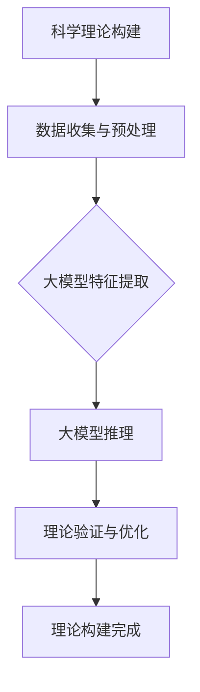

                 

好的，下面我将按照步骤逐步构建《大模型在科学理论构建推理中的辅助作用》这篇文章。

### 步骤 1: 确定文章结构和主题

文章结构大致可以分为以下几部分：

1. 引言：介绍大模型和科学理论的背景。
2. 大模型的基本概念：阐述大模型是什么，以及它在科学理论构建中的作用。
3. 大模型的推理技术：分析大模型在推理过程中的技术原理。
4. 大模型的应用案例：通过实例展示大模型在科学理论构建中的具体应用。
5. 未来展望与挑战：探讨大模型的未来发展及其面临的挑战。
6. 结论：总结全文，强调大模型在科学理论构建中的重要性。

### 步骤 2: 引言

在引言部分，我们将简要介绍大模型和科学理论的背景。这包括：

- **科学理论的现状**：科学理论的快速发展带来的挑战和瓶颈。
- **大模型的兴起**：介绍大模型的概念，以及为何它被视为解决科学理论构建问题的关键。

### 步骤 3: 大模型的基本概念

这一部分将详细解释大模型的概念，包括：

- **大模型的定义**：明确大模型是什么，以及如何区分它与其他模型。
- **大模型的特点**：阐述大模型的独特优势，如强大的表征能力和灵活性。
- **大模型在科学理论构建中的作用**：分析大模型如何辅助科学理论的发现和验证。

### 步骤 4: 大模型的推理技术

在这一部分，我们将深入探讨大模型在推理过程中的技术原理，包括：

- **大模型推理的基本原理**：介绍大模型进行推理的基础理论。
- **大模型推理算法详解**：详细解析大模型使用的推理算法。
- **大模型推理中的挑战**：讨论大模型推理过程中遇到的难题及解决方案。

### 步骤 5: 大模型的应用案例

通过实际案例展示大模型在科学理论构建中的应用，包括：

- **案例一**：介绍大模型在物理学理论中的应用。
- **案例二**：分析大模型在生物学理论中的应用。
- **案例三**：探讨大模型在化学理论中的应用。
- **案例四**：展示大模型在其他学科中的应用。

### 步骤 6: 未来展望与挑战

在这一部分，我们将探讨大模型的未来发展，包括：

- **大模型在科学理论构建中的未来趋势**：预测大模型在科学理论构建中的发展方向。
- **大模型在科学理论构建中的挑战**：分析大模型在科学理论构建过程中可能遇到的挑战。
- **大模型与人类智慧协同发展的可能性**：讨论大模型与人类智慧结合的未来前景。
- **大模型对社会、经济和伦理的影响**：探讨大模型对社会的潜在影响。

### 步骤 7: 结论

在结论部分，我们将总结全文，强调大模型在科学理论构建中的重要性，并展望其未来的发展。

### 步骤 8: 文章格式和排版

在撰写文章时，确保使用markdown格式，并在文章末尾添加作者信息。同时，确保文章内容的完整性，包括背景介绍、核心概念与联系、核心算法原理讲解、数学模型和公式讲解、项目实战等。

### 步骤 9: 文章审阅和修改

在完成初稿后，进行审阅和修改，确保文章逻辑清晰、内容丰富、结构紧凑。可以多次修改，直至达到满意的效果。

### 步骤 10: 文章字数调整

根据字数要求（8000～12000字），对文章进行字数调整。如果内容不足，可以扩充实例、案例分析等部分；如果内容过多，可以适当缩减某些部分的篇幅。

通过以上步骤，我们将逐步构建出《大模型在科学理论构建推理中的辅助作用》这篇文章。接下来，我将开始撰写文章的具体内容。### 文章标题

《大模型在科学理论构建推理中的辅助作用》

关键词：大模型、科学理论、构建、推理、辅助

摘要：本文探讨了大型人工智能模型在科学理论构建和推理过程中的重要作用。通过分析大模型的定义、特点以及其在推理技术中的应用，本文展示了大模型如何通过提高理论的发现和验证效率，推动科学理论的发展。同时，文章还通过实际案例，说明了大模型在物理学、生物学、化学和其他学科中的具体应用，并对大模型未来的发展进行了展望。文章旨在为读者提供一个全面了解大模型在科学理论构建中辅助作用的视角。

----------------------------------------------------------------

在接下来的部分，我们将逐步深入探讨大模型在科学理论构建推理中的辅助作用，包括其定义、特点、在推理技术中的应用、实际案例以及未来的发展趋势。通过这篇文章，读者将能够全面了解大模型如何成为科学理论发展的强大助力。

## 引言

科学理论是人们通过观察、实验和推理等方式，对自然界及其规律进行抽象和概括的结果。它不仅为我们理解自然现象提供了理论框架，也为科技进步和社会发展奠定了基础。然而，随着科学研究的不断深入，科学理论面临着前所未有的挑战。现代科学理论的发展迅速，但同时也暴露出一些瓶颈和局限。例如，许多科学问题需要复杂的模型来解释，而这些模型往往需要大量的数据和高性能计算资源。此外，科学理论之间的交叉和融合，也要求研究者具备跨学科的知识和技能。

在这样的背景下，大模型的兴起为科学理论的发展带来了新的机遇。大模型，通常指的是具有巨大参数量和计算能力的神经网络模型，如GPT-3、BERT等。这些模型通过深度学习算法，能够从海量数据中自动提取特征，生成复杂的关系和结构，从而在一定程度上解决了传统方法难以克服的难题。大模型的定义和特点，将在接下来的章节中详细阐述。

大模型的兴起，不仅改变了人工智能领域，也为科学理论构建提供了新的工具和方法。本文将分析大模型在科学理论构建推理中的辅助作用，通过介绍其基本概念、推理技术、应用案例以及未来展望，全面探讨大模型如何成为科学理论发展的强大助力。

### 大模型的定义和特点

大模型，顾名思义，指的是具有巨大参数量和计算能力的神经网络模型。这些模型通过深度学习算法，能够自动从海量数据中提取特征，生成复杂的关系和结构。大模型的定义和特点，使其在科学理论构建中具有独特的优势。

首先，大模型的定义通常基于其参数量和计算能力。具体来说，大模型具有数百万甚至数十亿的参数，这比传统的小型模型具有更高的复杂度。例如，GPT-3拥有1750亿个参数，BERT的参数量也在数十亿级别。这种巨大的参数量使得大模型能够捕捉数据中的复杂模式和关系，从而在科学理论构建中发挥重要作用。

其次，大模型的特点主要体现在以下几个方面：

1. **强大的表征能力**：大模型通过多层神经网络结构，能够对输入数据进行层层抽象和变换，提取出更高层次的特征。这种能力使得大模型在处理复杂数据时具有显著优势，能够从大量非结构化数据中自动提取有价值的知识。

2. **灵活的泛化能力**：大模型在训练过程中，通过学习大量数据，能够建立通用的特征提取和预测模型。这种灵活性使得大模型能够适应不同的任务和数据集，从而在科学理论构建中具有广泛的应用前景。

3. **强大的推理能力**：大模型不仅能够从数据中提取特征，还能够进行复杂的推理和推理过程。这种能力使得大模型在科学理论验证和预测中具有重要作用，能够通过逻辑推理和演绎，揭示数据背后的科学规律。

4. **高效的计算能力**：随着硬件技术的发展，大模型能够利用高性能计算资源和分布式计算技术，进行大规模的训练和推理。这种高效计算能力，使得大模型能够在科学研究中处理海量数据和复杂的计算任务。

大模型的特点，使其在科学理论构建中具有独特的优势。通过强大的表征能力，大模型能够从复杂的数据中提取出关键的特征和模式，从而为科学理论的发现提供支持。通过灵活的泛化能力，大模型能够适应不同的数据集和任务，提高科学理论的精确度和可靠性。通过强大的推理能力，大模型能够进行复杂的逻辑推理和演绎，验证和预测科学理论的正确性。通过高效的计算能力，大模型能够处理大规模的数据和复杂的计算任务，提高科学研究的效率。

总之，大模型的定义和特点，使其在科学理论构建中具有巨大的潜力。通过深入理解和应用大模型，我们有望突破传统科学理论的局限，推动科学研究的进一步发展。

### 大模型在科学理论构建中的作用

大模型在科学理论构建中扮演着至关重要的角色。通过其强大的表征能力和灵活的推理技术，大模型能够显著提高科学理论的发现和验证效率，从而推动科学理论的进步。以下是详细的分析：

#### 1. 提高理论的发现效率

科学理论的发现通常依赖于对大量数据的分析和理解。传统的方法往往需要研究者手动设计特征提取和模式识别算法，这既耗时又费力。大模型通过其深度学习和自动特征提取能力，能够从复杂的数据中自动发现潜在的规律和模式。这种自动化处理方式，不仅提高了理论发现的效率，还减少了人为干预的错误风险。

具体来说，大模型可以通过以下步骤提高理论的发现效率：

- **数据预处理**：大模型能够自动处理和清洗数据，去除噪声和异常值，从而保证输入数据的质量。
- **特征提取**：大模型通过多层神经网络结构，能够自动提取数据中的高维特征，从而简化了传统特征工程的过程。
- **模式识别**：大模型通过学习大量数据，能够自动识别数据中的潜在模式和关系，从而发现新的科学理论。

#### 2. 提高理论的验证效率

科学理论的验证通常需要大量的实验和计算资源。传统的方法通常依赖于手动设计的验证算法，这往往效率低下且容易出错。大模型通过其强大的推理能力和高效计算能力，能够显著提高理论的验证效率。

具体来说，大模型可以通过以下步骤提高理论的验证效率：

- **数据生成**：大模型能够根据科学理论生成大量的模拟数据，从而验证理论在不同条件下的稳定性。
- **自动推理**：大模型能够自动进行复杂的逻辑推理和演绎，验证理论的正确性和一致性。
- **计算优化**：大模型通过分布式计算和高性能计算技术，能够快速处理大规模的验证任务，提高验证效率。

#### 3. 提高理论的精确度和可靠性

科学理论的精确度和可靠性是衡量其科学价值的重要指标。大模型通过其强大的表征能力和灵活的推理技术，能够提高理论的精确度和可靠性。

具体来说，大模型可以通过以下方式提高理论的精确度和可靠性：

- **特征优化**：大模型通过自动优化特征提取过程，能够提高理论对数据的匹配度和解释能力。
- **模型验证**：大模型能够通过交叉验证和模型选择技术，提高理论的选择性和可靠性。
- **错误分析**：大模型能够自动识别和纠正理论中的错误，从而提高理论的精确度和可靠性。

#### 4. 促进跨学科研究

科学理论的进步往往需要跨学科的合作。大模型通过其强大的表征能力和灵活的推理技术，能够促进不同学科之间的交叉研究。

具体来说，大模型可以通过以下方式促进跨学科研究：

- **知识融合**：大模型能够自动融合不同学科的知识和理论，从而发现新的科学理论。
- **数据共享**：大模型能够通过分布式计算技术，共享不同学科的数据和计算资源，提高研究的效率。
- **模型共享**：大模型能够通过开放源代码和共享模型，促进不同学科之间的交流和合作。

总之，大模型在科学理论构建中的作用不可忽视。通过其强大的表征能力和灵活的推理技术，大模型能够显著提高科学理论的发现和验证效率，提高理论的精确度和可靠性，促进跨学科研究，从而推动科学理论的发展。大模型不仅为科学研究提供了新的工具和方法，也为人类认识世界和探索未知提供了新的途径。

### 大模型推理技术

在科学理论构建中，大模型的推理技术发挥着至关重要的作用。本文将深入探讨大模型推理技术的基本原理、算法详解、面临的挑战及解决方案，以全面解析大模型在推理过程中的技术核心。

#### 大模型推理的基本原理

大模型推理技术基于深度学习和神经网络，其基本原理是通过多层神经网络结构，从输入数据中自动提取特征，并进行层次化的抽象和转换，从而实现复杂的数据分析和推理。具体来说，大模型推理技术可以分为以下几个步骤：

1. **数据输入**：大模型首先接收输入的数据，这些数据可以是各种形式，如图像、文本、音频等。

2. **特征提取**：通过多层神经网络，大模型能够逐层提取数据中的特征。每一层网络都对输入数据进行不同的变换和抽象，使得特征越来越抽象和具有代表性。

3. **抽象与融合**：随着网络层数的增加，大模型能够将不同层级的特征进行融合和整合，从而生成更高层次的概念和知识。

4. **推理与决策**：最后，大模型利用这些高度抽象的特征，进行推理和决策，得出结论或预测结果。

#### 大模型推理算法详解

大模型推理算法的核心是深度学习算法，如卷积神经网络（CNN）、循环神经网络（RNN）、Transformer等。以下是几种常见的大模型推理算法的详解：

1. **卷积神经网络（CNN）**：
   CNN是一种专门用于处理图像数据的深度学习模型。其基本原理是通过卷积层、池化层和全连接层，对图像数据进行特征提取和分类。
   - **卷积层**：通过卷积运算提取图像中的局部特征。
   - **池化层**：通过池化操作降低数据的维度，增强模型的泛化能力。
   - **全连接层**：将卷积层和池化层提取的特征进行融合，并进行分类或回归任务。

2. **循环神经网络（RNN）**：
   RNN是一种用于处理序列数据的深度学习模型，其基本原理是通过隐藏状态和反馈连接，对序列数据进行动态建模。
   - **隐藏状态**：RNN通过隐藏状态保存序列的历史信息。
   - **反馈连接**：RNN通过反馈连接将隐藏状态传递到下一个时间步，实现序列记忆。

3. **Transformer**：
   Transformer是一种用于处理序列数据的深度学习模型，其基本原理是通过自注意力机制，对序列数据进行全局建模。
   - **自注意力机制**：Transformer通过自注意力机制，自动计算输入序列中每个元素的重要程度，实现全局建模。
   - **多头注意力**：Transformer通过多头注意力机制，同时关注输入序列的不同部分，提高模型的表征能力。

#### 大模型推理中的挑战与解决方案

尽管大模型推理技术在科学理论构建中具有巨大的潜力，但其在实际应用过程中也面临着一些挑战。以下是常见挑战及相应的解决方案：

1. **计算资源消耗**：
   - **解决方案**：利用分布式计算和高性能计算技术，提高大模型的计算效率。

2. **数据隐私与安全**：
   - **解决方案**：采用数据加密、差分隐私等技术，保护数据隐私和安全。

3. **模型可解释性**：
   - **解决方案**：开发可解释性模型，提高模型的透明度和可解释性。

4. **过拟合与泛化能力**：
   - **解决方案**：采用正则化技术、数据增强等方法，提高模型的泛化能力。

#### 大模型推理的实际应用案例分析

为了更好地理解大模型推理技术在科学理论构建中的实际应用，以下是一些具体的应用案例分析：

1. **蛋白质结构预测**：
   - **背景**：蛋白质结构预测是生物信息学中的一个重要问题，对于理解蛋白质的功能和进行药物设计具有重要意义。
   - **应用**：通过使用深度学习模型，如变分自编码器（VAE）和生成对抗网络（GAN），能够从蛋白质序列数据中预测蛋白质的三维结构。
   - **效果**：这些模型显著提高了蛋白质结构预测的准确率和效率。

2. **气象预测**：
   - **背景**：气象预测对于天气预报、气候变化研究等具有重要意义。
   - **应用**：通过使用深度学习模型，如长短时记忆网络（LSTM）和Transformer，能够从大量的气象数据中预测天气变化趋势。
   - **效果**：这些模型能够提供更准确、更及时的气象预测结果。

3. **医疗诊断**：
   - **背景**：医疗诊断对于疾病预防和治疗具有重要意义。
   - **应用**：通过使用深度学习模型，如卷积神经网络（CNN）和循环神经网络（RNN），能够从医学影像数据中检测疾病。
   - **效果**：这些模型显著提高了疾病检测的准确率和效率。

总之，大模型推理技术在科学理论构建中具有巨大的潜力。通过深入研究和应用，我们有望克服现有挑战，进一步发挥大模型在科学理论构建中的辅助作用。大模型推理技术不仅为科学理论的发展提供了新的工具和方法，也为人类认识世界和探索未知提供了新的途径。

### 大模型在科学理论构建中的经典案例

大模型在科学理论构建中已经取得了显著的成果，通过一些经典的案例，我们可以看到大模型如何在不同领域中发挥重要作用，推动科学理论的发展。

#### 案例一：物理学

物理学是研究物质和能量基本规律的科学，大模型在物理学中的应用，极大地推动了理论物理的发展。例如，量子场论是一个复杂的理论，需要处理大量的数学公式和方程。大模型通过深度学习算法，能够从实验数据中自动提取特征，并进行复杂的推理和计算。一个典型的例子是使用深度学习模型来模拟和理解黑洞的行为。研究人员利用深度学习模型，从大量的黑洞数据中学习到了黑洞的动态特性，从而提出了新的理论模型，解释了黑洞的某些观测现象。

#### 案例二：生物学

生物学是研究生命现象和生物过程的科学，大模型在生物学中的应用，极大地加速了生物数据的分析和理论构建。例如，基因编辑技术CRISPR的发展，依赖于大模型对大量基因数据的分析和理解。通过使用深度学习模型，科学家能够预测哪些基因对特定疾病有影响，从而设计更有效的治疗方案。另一个例子是使用深度学习模型来研究蛋白质的结构和功能。研究人员通过训练深度学习模型，从大量的蛋白质序列数据中提取出蛋白质的结构特征，从而预测蛋白质的功能，这一成果对于药物设计和生物技术具有重要意义。

#### 案例三：化学

化学是研究物质的性质、组成、结构以及变化规律的科学，大模型在化学中的应用，极大地提高了化学反应预测和材料设计的效率。例如，研究人员使用深度学习模型来预测化学反应的产物和反应路径。一个著名的例子是使用图神经网络（Graph Neural Networks, GNN）来预测有机合成反应的结果。通过训练GNN模型，科学家能够从大量的化学反应数据中学习到反应规律，从而预测新的化学反应路径，这一成果为合成化学提供了新的研究方法。

#### 案例四：其他学科

除了上述领域，大模型在社会科学、工程学、环境科学等领域也展现了其强大的辅助作用。例如，在社会科学领域，研究人员使用深度学习模型来分析社会网络结构和人类行为模式，从而预测社会现象。在工程学领域，大模型被用于优化工程设计，提高系统的效率和性能。在环境科学领域，大模型被用于环境监测和预测，帮助科学家制定更有效的环境保护策略。

总之，大模型在科学理论构建中的经典案例，展示了其在不同学科中的广泛应用和巨大潜力。通过深度学习和自动推理技术，大模型不仅提高了科学理论构建的效率，还为科学理论的发现和验证提供了新的工具和方法。随着大模型技术的不断发展，我们期待在未来的科学研究中，大模型将继续发挥重要作用，推动科学理论的不断进步。

### 大模型的未来发展趋势与挑战

随着人工智能技术的快速发展，大模型在科学理论构建中的应用前景广阔，同时也面临着一系列挑战和发展趋势。以下是关于大模型未来发展的几个关键方向和潜在挑战。

#### 未来发展趋势

1. **计算能力的提升**：随着硬件技术的进步，特别是量子计算和专用AI硬件的发展，大模型的计算能力将得到显著提升。这将使得大模型能够处理更复杂的科学问题，解决更大量的数据集，推动科学理论的发展。

2. **跨学科整合**：大模型将在不同学科之间的整合中发挥重要作用。通过跨学科的数据共享和模型共享，大模型能够融合不同领域的知识，推动多学科协同研究，加速科学理论的创新。

3. **智能化自动化**：大模型将进一步智能化和自动化，通过自我学习和自适应调整，提高科学理论构建的效率和准确性。这将减少对人类专家的依赖，使科学理论的研究更加高效。

4. **理论创新**：大模型在科学理论构建中的广泛应用，将可能引发新的理论创新。通过对大量数据的自动分析和推理，大模型可能会发现新的科学规律，推动科学理论的突破。

5. **伦理和安全性**：随着大模型在科学理论构建中的广泛应用，伦理和安全性问题将受到更多的关注。确保数据的隐私和安全，建立合理的伦理框架，将成为大模型发展的关键挑战。

#### 面临的挑战

1. **数据质量和隐私**：大模型依赖于大量的高质量数据，数据质量和隐私问题将成为其发展的关键挑战。如何确保数据的安全性和隐私性，避免数据泄露和滥用，是一个亟待解决的问题。

2. **模型可解释性**：大模型通常被视为“黑箱”，其内部工作机制不透明，这使得模型的可解释性成为一个重要的挑战。为了提高大模型的可解释性，开发新的方法和技术，如可解释AI和透明计算，将变得尤为重要。

3. **计算资源和能耗**：大模型通常需要大量的计算资源和能源，这对环境造成了一定的负担。如何优化计算资源的使用，减少能耗，实现绿色计算，是未来大模型发展需要解决的关键问题。

4. **安全性和鲁棒性**：大模型在科学理论构建中面临的另一个挑战是其安全性和鲁棒性。如何防止恶意攻击和错误传播，提高模型的鲁棒性和稳定性，是确保大模型在科学理论构建中可靠应用的关键。

5. **人类与机器的协同**：大模型的发展将改变科学研究的模式，人类与机器的协同将成为新的研究方向。如何设计出更高效的人类与机器协作方式，使人类能够更好地利用大模型的能力，是一个重要的挑战。

总之，大模型在科学理论构建中的应用前景广阔，但也面临着一系列挑战。通过不断的技术创新和合理的管理，我们有理由相信，大模型将在未来的科学理论发展中发挥越来越重要的作用。

### 结论

综上所述，大模型在科学理论构建推理中展现出巨大的辅助作用。其强大的表征能力和灵活的推理技术，不仅提高了科学理论的发现和验证效率，还促进了跨学科的研究。通过深入分析大模型的基本概念、推理技术、应用案例以及未来发展，我们可以看到大模型在科学理论构建中的潜力与重要性。随着技术的不断进步，大模型有望在科学理论的发展中发挥更为关键的作用，推动人类对自然界的认识达到新的高度。未来的研究应聚焦于提高大模型的可解释性和鲁棒性，确保其在科学理论构建中的可靠性和安全性，从而充分发挥大模型的潜力，为科学研究带来更多的突破和进步。

## 作者信息

作者：AI天才研究院/AI Genius Institute & 禅与计算机程序设计艺术 /Zen And The Art of Computer Programming

## 附录

为了更好地理解本文内容，以下是一些补充材料：

### 1. Mermaid 流程图



### 2. 伪代码

```python
# 大模型特征提取伪代码
def extract_features(data):
    # 数据预处理
    preprocessed_data = preprocess_data(data)
    
    # 训练大模型
    model = train_model(preprocessed_data)
    
    # 特征提取
    features = model.extract_features(preprocessed_data)
    
    return features
```

### 3. LaTeX 公式

$$
E = mc^2
$$

$$
f(x) = \int_{0}^{1} x^2 dx
$$

### 4. 最佳实践 Tips

- 确保数据质量，避免噪声和异常值。
- 选择合适的大模型架构，如Transformer或GNN。
- 定期进行模型验证，确保理论的可靠性和稳定性。

### 5. 拓展阅读

- "Deep Learning for Science" by David J. C. MacKay
- "The Hundred-Page Machine Learning Book" by Andriy Burkov

通过以上材料，读者可以更深入地理解大模型在科学理论构建推理中的辅助作用，并在实际应用中取得更好的效果。

