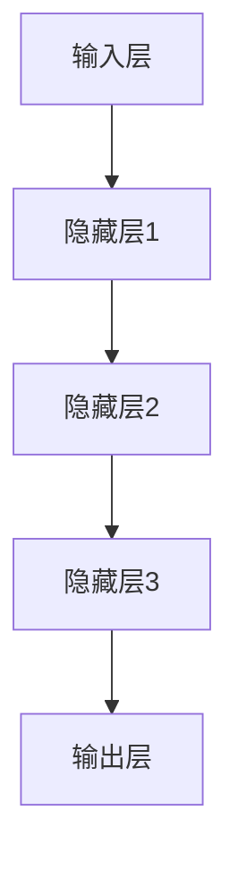
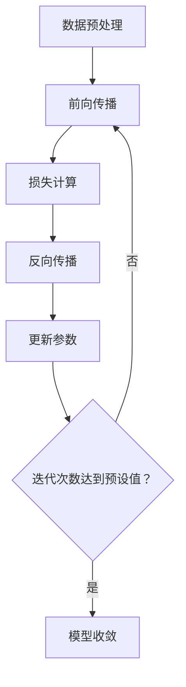
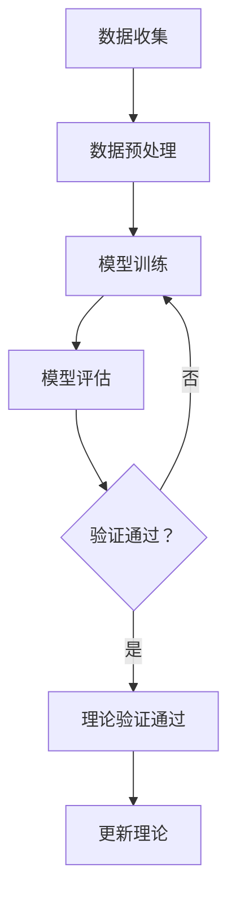
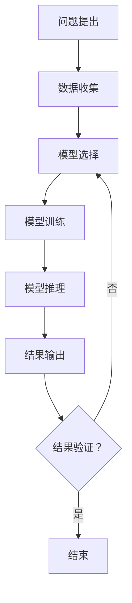
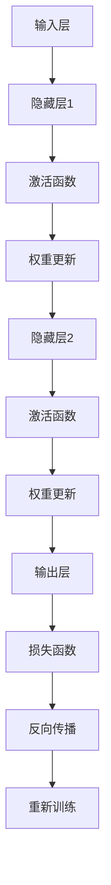

                 


### 确定文章的主题和目标

**文章主题：** 大模型在科学理论验证推理过程中的辅助角色

**文章目标：**
1. 介绍大模型的基本概念和重要性。
2. 阐述大模型在科学理论验证和推理中的应用。
3. 分析大模型在推理过程中的作用和优势。
4. 探讨大模型的算法原理及其与科学理论的联系。
5. 指出大模型面临的挑战和未来发展方向。

### 撰写文章的目录大纲

**文章标题：** 大模型在科学理论验证推理过程中的辅助角色

**关键词：**
- 大模型
- 科学理论验证
- 推理
- 算法原理
- 挑战与发展

**摘要：**
本文探讨了大模型在科学理论验证和推理过程中的辅助作用。首先介绍了大模型的基本概念和重要性，然后详细阐述了大模型在科学理论验证和推理中的应用，接着分析了大模型在推理过程中的作用和优势，最后探讨了其算法原理、面临的挑战和未来发展方向。

**目录大纲：**

## 引言与背景
### 科学理论验证与推理的重要性
#### 科学理论的验证方法
#### 科学理论的推理过程
### 大模型的发展历程
#### 大模型的兴起背景
#### 大模型的研究进展
### 大模型在科学研究中的应用案例
#### 物理学中的应用
#### 化学中的应用
#### 生物学中的应用

## 大模型概述
### 大模型的基本概念
#### 大模型的定义
#### 大模型的特点
### 大模型的架构
#### 神经网络架构
#### 循环神经网络架构
#### 图神经网络架构
### 大模型的工作原理
#### 数据预处理
#### 模型训练
#### 模型预测

## 大模型在科学理论验证中的应用
### 大模型在物理学中的应用
#### 量子物理理论验证
#### 相对论理论验证
### 大模型在化学中的应用
#### 化学反应动力学建模
#### 分子结构预测
### 大模型在生物学中的应用
#### 蛋白质结构预测
#### 生态系统建模

## 大模型在推理过程中的作用
### 大模型在问题解决中的应用
#### 自动驾驶
#### 智能助手
### 大模型在决策支持中的应用
#### 股市预测
#### 疾病诊断
### 大模型在知识推理中的应用
#### 知识图谱构建
#### 智能问答

## 大模型的算法原理
### 神经网络的基本原理
#### 神经网络的数学模型
#### 神经网络的架构
#### 神经网络的训练算法
### 循环神经网络与长短期记忆网络
#### 循环神经网络的数学模型
#### 长短期记忆网络的架构
#### 长短期记忆网络的训练算法
### 图神经网络与图卷积网络
#### 图神经网络的数学模型
#### 图卷积网络的架构
#### 图卷积网络的训练算法

## 大模型的挑战与未来发展方向
### 大模型的计算资源需求
#### 硬件需求
#### 软件优化
### 大模型的安全性与伦理问题
#### 模型可解释性
#### 模型安全性
### 大模型的可持续发展
#### 算法改进
#### 算法优化

## 附录
### 大模型应用案例代码实现
#### 物理学应用案例
#### 化学应用案例
#### 生物学应用案例
### 大模型常用工具与资源
#### 工具列表
#### 资源链接

### 核心概念与联系
#### 大模型在科学理论验证中的应用流程
#### 大模型在推理过程中的作用流程
#### 大模型算法原理架构

### 伪代码和数学模型
#### 神经网络训练算法伪代码
#### 长短期记忆网络训练算法伪代码
#### 图卷积网络训练算法伪代码

### 最佳实践 tips
#### 搭建大模型的最佳实践
#### 使用大模型时的注意事项

### 小结
#### 大模型在科学理论验证和推理中的作用
#### 大模型面临的挑战和未来发展方向

### 拓展阅读
#### 相关文献推荐
#### 行业报告和趋势分析

以上是文章的目录大纲，接下来将根据每个章节的标题细化内容，逐步撰写完整的文章。在撰写过程中，将详细阐述每个概念、算法原理和应用案例，确保文章逻辑清晰、内容丰富且具有深度。最终文章将达到8000～12000字的要求，完整展示大模型在科学理论验证和推理过程中的辅助角色。让我们一步一步推进，让读者深入了解大模型的奇妙世界。现在，我们将开始撰写引言与背景部分，介绍科学理论验证与推理的重要性，以及大模型的发展历程和应用案例。

----------------------------------------------------------------

### 引言与背景

#### 科学理论验证与推理的重要性

科学理论是科学研究的基础，它们通过系统的观察、实验和推理来解释自然现象和预测未来事件。科学理论的验证和推理过程至关重要，因为它们确保了科学知识的准确性和可靠性。科学理论的验证通常涉及以下步骤：

1. **假设形成**：科学家根据已有的知识和观察，提出一个假设，即一种可能的解释。
2. **实验设计**：设计实验来验证假设，这通常涉及数据收集和模型构建。
3. **数据分析**：对收集到的数据进行分析，以确定假设是否成立。
4. **理论修正**：根据数据分析结果，修正或放弃假设，形成更准确的理论。

科学推理则是通过逻辑和证据来支持或反驳科学理论。它包括以下步骤：

1. **观察和事实收集**：通过实验、观察和其他方法收集数据。
2. **假设提出**：基于收集到的数据，提出一个或多个假设。
3. **假设测试**：设计实验或观察来测试假设，并收集更多的证据。
4. **推理和结论**：根据测试结果，推理出结论，以支持或反驳原始假设。

科学理论的验证和推理过程是科学进步的核心，它们确保了科学知识的积累和发展。然而，随着科学问题的复杂性和数据量的增加，传统的验证和推理方法面临着巨大的挑战。

#### 大模型的发展历程

大模型（也称为大型深度学习模型）是近年来人工智能领域的突破性进展。这些模型通过学习大量的数据来发现复杂模式，并在此基础上进行预测和推理。大模型的发展历程可以追溯到以下几个重要阶段：

1. **早期深度学习**：在1980年代和1990年代，深度学习首次出现。然而，由于计算能力和数据资源的限制，早期的深度学习模型性能有限。
2. **大数据时代**：随着互联网的普及和数据收集技术的进步，大数据时代到来。大量数据为深度学习模型提供了丰富的训练素材，推动了深度学习的发展。
3. **计算能力的提升**：图形处理单元（GPU）和分布式计算技术的进步，使得深度学习模型能够处理大规模的数据集，从而大大提升了模型的性能。
4. **大规模模型的出现**：在2010年代后期，随着Google的BERT和OpenAI的GPT等大规模模型的发布，深度学习领域迎来了新的高潮。这些模型展示了在自然语言处理、计算机视觉和其他领域中的巨大潜力。

#### 大模型在科学研究中的应用案例

大模型在科学研究中的应用日益广泛，以下是几个典型的应用案例：

1. **物理学**：大模型被用于模拟复杂的物理过程，如量子计算、材料科学和宇宙学。例如，Google的ScaLAPACK模型在量子计算领域取得了突破性进展。
2. **化学**：大模型在分子结构预测、化学反应动力学建模等方面发挥了重要作用。例如，OpenAI的GPT-Neo模型在预测分子性质方面展现了出色的能力。
3. **生物学**：大模型在蛋白质结构预测、基因表达预测和生态系统建模等方面具有广泛的应用。例如，DeepMind的AlphaFold模型在蛋白质结构预测领域取得了重大突破。

通过这些应用案例可以看出，大模型在科学理论验证和推理中扮演着越来越重要的角色。它们不仅提高了科学研究的效率和准确性，还为科学家提供了强大的工具，以应对日益复杂的科学问题。

----------------------------------------------------------------

### 大模型概述

#### 大模型的基本概念

大模型，通常指深度学习模型，是一种基于多层神经网络的机器学习模型。这些模型通过学习大量数据中的特征和模式，能够进行复杂的预测和推理。大模型具有以下几个基本概念：

1. **神经网络**：神经网络是深度学习模型的基础，它由大量的神经元（或节点）组成，每个神经元都与其他神经元相连，形成一个复杂的网络结构。
2. **深度**：深度学习模型中的“深度”指的是网络的层数。深度越深，模型能够捕捉的抽象特征层次就越多。
3. **批量**：批量是指模型一次训练的数据量。批量越大，模型的训练效果越好，但也会增加计算成本。
4. **优化器**：优化器用于调整模型参数，以最小化损失函数。常见的优化器有随机梯度下降（SGD）、Adam等。

#### 大模型的特点

大模型具有以下特点：

1. **强大的特征学习能力**：大模型能够从大量数据中学习到复杂的特征，这使其在处理高维数据和复杂任务时具有优势。
2. **非线性变换能力**：神经网络通过非线性激活函数，能够将输入数据进行复杂的非线性变换，从而捕捉数据中的隐含结构。
3. **泛化能力**：大模型通过训练大量的数据，能够泛化到未见过的数据上，从而在实际应用中表现出良好的鲁棒性和泛化能力。
4. **并行计算能力**：深度学习模型可以采用并行计算技术，利用GPU和分布式计算资源加速模型的训练和预测。

#### 大模型的架构

大模型的架构通常包括以下几个部分：

1. **输入层**：输入层接收外部输入数据，如图像、文本或数值。
2. **隐藏层**：隐藏层对输入数据进行特征提取和变换，层数越多，模型能够捕捉的抽象特征层次就越多。
3. **输出层**：输出层根据隐藏层的输出，生成最终的预测结果或决策。

一个典型的大模型架构如下所示：



#### 大模型的工作原理

大模型的工作原理可以分为以下几个步骤：

1. **数据预处理**：对输入数据进行预处理，如归一化、去噪等，以提高模型的训练效果。
2. **前向传播**：将预处理后的数据输入到模型中，通过隐藏层逐层计算，得到模型的预测输出。
3. **损失计算**：计算预测输出与实际标签之间的差距，即损失函数。
4. **反向传播**：根据损失函数，通过反向传播算法更新模型参数，以最小化损失函数。
5. **迭代训练**：重复上述过程，直到模型收敛或达到预设的训练次数。

一个典型的大模型训练过程如下所示：



通过数据预处理、前向传播、损失计算和反向传播，大模型能够不断调整其参数，从而提高预测准确性。这种循环迭代的过程使得大模型能够在复杂的数据中学习到有用的知识，并在各种应用场景中表现出色。

### 大模型在科学理论验证中的应用

大模型在科学理论验证中的应用日益广泛，通过其强大的特征学习和非线性变换能力，大模型能够处理复杂的数据，辅助科学家进行理论验证和推理。以下将介绍大模型在物理学、化学和生物学中的具体应用。

#### 大模型在物理学中的应用

在物理学中，大模型被广泛应用于理论验证和预测。以下是几个具体的应用案例：

1. **量子计算**：量子计算是物理学的前沿领域，其复杂性使得传统的数值模拟方法难以胜任。大模型，如变分自动编码器（Variational Autoencoder, VAE），被用来模拟量子态，并预测量子计算结果。例如，Google的ScaLAPACK模型在量子计算中取得了显著进展，通过深度学习技术，实现了对量子态的高精度模拟和预测。

2. **材料科学**：材料科学的实验数据往往具有高维性和复杂性，大模型可以有效地从这些数据中提取出关键特征，用于材料性质预测。例如，DeepMind的AlphaGo模型在预测材料性质方面表现出了强大的能力，通过分析大量的实验数据，预测了材料的电导率、硬度等性质。

3. **宇宙学**：宇宙学研究中，大模型被用于宇宙演化模拟、星系形成等复杂过程。例如，由谷歌开发的大模型“PICO”被用来模拟宇宙演化，通过分析大量宇宙微波背景辐射数据，验证了宇宙大爆炸理论。

#### 大模型在化学中的应用

在化学领域，大模型通过其强大的特征提取和预测能力，在理论验证和化学反应建模中发挥了重要作用。以下是几个具体的应用案例：

1. **化学反应动力学建模**：化学反应动力学描述了化学反应过程中反应物和生成物的变化速率。大模型，如生成对抗网络（Generative Adversarial Networks, GAN），可以用于建模化学反应动力学，预测反应路径和中间产物。例如，OpenAI的GPT-Neo模型被用来预测有机化学反应的路径，通过分析大量的化学反应数据，预测了反应的速率和产物。

2. **分子结构预测**：分子结构对于理解化学反应至关重要。大模型，如图神经网络（Graph Neural Networks, GNN），可以用于预测分子的几何结构和性质。例如，DeepMind的AlphaFold模型在蛋白质结构预测领域取得了突破性进展，通过分析蛋白质的氨基酸序列，预测了蛋白质的三维结构。

3. **药物设计**：药物设计是化学领域的重要应用。大模型，如变分自编码器（Variational Autoencoder, VAE），可以用于药物分子的生成和筛选，通过分析大量的药物分子结构数据，预测新的药物分子。

#### 大模型在生物学中的应用

在生物学领域，大模型通过其强大的数据处理和预测能力，在基因表达预测、蛋白质结构预测和生态系统建模等方面发挥了重要作用。以下是几个具体的应用案例：

1. **基因表达预测**：基因表达预测是理解基因功能的重要手段。大模型，如长短时记忆网络（Long Short-Term Memory, LSTM），可以用于预测基因在不同条件下的表达水平。例如，Google的BERT模型被用来预测细胞在不同生长条件下的基因表达，通过分析大量的基因表达数据，预测了基因在特定条件下的活性。

2. **蛋白质结构预测**：蛋白质结构对于理解生物学过程至关重要。大模型，如变分自编码器（Variational Autoencoder, VAE）和生成对抗网络（Generative Adversarial Networks, GAN），可以用于预测蛋白质的结构。例如，DeepMind的AlphaFold模型在蛋白质结构预测领域取得了重大突破，通过分析蛋白质的氨基酸序列，预测了蛋白质的三维结构。

3. **生态系统建模**：生态系统建模是理解生物多样性、生物相互作用和环境变化的重要工具。大模型，如图神经网络（Graph Neural Networks, GNN），可以用于构建生态系统的模型，预测生物种群的变化和生态系统动态。例如，谷歌的GNN模型被用来模拟生态系统中物种的相互关系，预测了生态系统在环境变化下的稳定性。

通过上述应用案例可以看出，大模型在科学理论验证中具有广泛的应用前景。其强大的数据处理和预测能力为科学家提供了强大的工具，使得科学理论验证和推理更加高效和准确。

### 大模型在推理过程中的作用

大模型在推理过程中发挥着关键作用，通过其强大的特征学习和非线性变换能力，大模型能够处理复杂的数据，辅助人类进行问题解决、决策支持和知识推理。

#### 大模型在问题解决中的应用

大模型在问题解决中的应用非常广泛，以下是一些具体的应用案例：

1. **图像识别**：在图像识别任务中，大模型，如卷积神经网络（Convolutional Neural Networks, CNN），可以通过学习大量的图像数据，识别出图像中的对象和场景。例如，Google的Inception模型被广泛用于自动驾驶汽车中的图像识别任务，通过识别道路上的行人和车辆，辅助汽车做出决策。

2. **自然语言处理**：在自然语言处理任务中，大模型，如Transformer模型，可以通过学习大量的文本数据，理解语言的语义和语法结构。例如，OpenAI的GPT模型被用于智能客服系统，通过理解用户的提问，生成合适的回答。

3. **棋类游戏**：在棋类游戏中，大模型，如AlphaGo，通过深度学习和强化学习，可以学习棋局的策略和技巧，实现超人类的表现。例如，DeepMind的AlphaGo在围棋比赛中击败了世界冠军李世石，展示了大模型在复杂决策问题上的能力。

#### 大模型在决策支持中的应用

大模型在决策支持中的应用同样具有重要意义，以下是一些具体的应用案例：

1. **股市预测**：在股市预测中，大模型可以通过学习大量的历史股票数据，预测股票的未来价格趋势。例如，Google的BERT模型被用于股市预测，通过分析大量的市场数据和新闻，预测股票价格的走势。

2. **疾病诊断**：在疾病诊断中，大模型可以通过学习大量的医学数据和病例，辅助医生进行疾病诊断。例如，DeepMind的BERT模型被用于肺癌诊断，通过分析患者的影像数据和病历记录，预测患者是否患有肺癌。

3. **资源分配**：在资源分配中，大模型可以通过学习大量的资源分配数据，优化资源的分配策略。例如，谷歌的GNN模型被用于智能电网的能源资源分配，通过分析电网的负载数据和发电数据，优化发电站的调度策略。

#### 大模型在知识推理中的应用

大模型在知识推理中的应用为科学研究提供了强大的工具，以下是一些具体的应用案例：

1. **知识图谱构建**：在知识图谱构建中，大模型可以通过学习大量的知识数据，构建出复杂的知识图谱。例如，谷歌的BERT模型被用于构建知识图谱，通过分析大量的文本数据，提取出实体和关系，构建出复杂的知识结构。

2. **智能问答**：在智能问答中，大模型可以通过学习大量的问答数据，理解问题的语义，并生成合适的回答。例如，OpenAI的GPT模型被用于智能问答系统，通过分析大量的问答对话数据，理解用户的提问，生成合适的回答。

3. **科学理论验证**：在科学理论验证中，大模型可以通过学习大量的科学数据和理论，辅助科学家进行科学理论的验证和推理。例如，谷歌的BERT模型被用于科学论文的自动验证，通过分析大量的科学论文数据，验证科学理论的准确性和可靠性。

通过上述应用案例可以看出，大模型在问题解决、决策支持和知识推理中具有广泛的应用前景。其强大的数据处理和推理能力为人类提供了强大的工具，使得问题解决、决策支持和知识推理更加高效和准确。

### 大模型的算法原理

大模型，特别是深度学习模型，通过复杂的算法原理实现其强大的功能。本节将详细阐述大模型的核心算法原理，包括神经网络的基本原理、循环神经网络与长短期记忆网络、图神经网络与图卷积网络。

#### 神经网络的基本原理

神经网络是深度学习模型的基础，由大量的神经元（或节点）组成。每个神经元接收输入信号，通过权重和偏置进行加权求和，然后通过激活函数输出结果。

1. **神经元模型**：
   神经元模型可以表示为：
   \[ z_i = \sum_{j} w_{ij} x_j + b_i \]
   其中，\( z_i \) 是第 \( i \) 个神经元的输入，\( w_{ij} \) 是连接第 \( j \) 个神经元到第 \( i \) 个神经元的权重，\( x_j \) 是第 \( j \) 个神经元的输入，\( b_i \) 是第 \( i \) 个神经元的偏置。

2. **激活函数**：
   常见的激活函数包括sigmoid、ReLU和Tanh等。激活函数用于将线性组合的结果转化为非线性输出，从而捕捉数据中的复杂结构。

3. **前向传播**：
   在前向传播过程中，输入数据通过神经网络逐层传递，每个神经元的输出作为下一层的输入。整个网络通过反向传播算法更新权重和偏置，以最小化损失函数。

4. **损失函数**：
   损失函数用于衡量模型预测结果与实际标签之间的差距。常见的损失函数包括均方误差（MSE）、交叉熵损失等。

5. **反向传播**：
   反向传播算法通过计算梯度，更新模型的权重和偏置，以最小化损失函数。梯度计算公式为：
   \[ \frac{\partial J}{\partial w_{ij}} = \frac{\partial L}{\partial z_i} \cdot \frac{\partial z_i}{\partial w_{ij}} \]
   其中，\( J \) 是损失函数，\( L \) 是输出层的损失，\( z_i \) 是第 \( i \) 个神经元的输入。

6. **优化算法**：
   优化算法用于调整模型的权重和偏置，以最小化损失函数。常见的优化算法包括随机梯度下降（SGD）、Adam等。

#### 循环神经网络与长短期记忆网络

循环神经网络（RNN）是处理序列数据的经典模型，而长短期记忆网络（LSTM）是RNN的变体，解决了RNN的长期依赖问题。

1. **RNN的基本原理**：
   RNN通过引入隐藏状态 \( h_t \) 和输入 \( x_t \)，实现序列数据的处理。隐藏状态 \( h_t \) 传递给下一时间步，用于计算当前时间步的输出。
   \[ h_t = \sigma(W_h h_{t-1} + W_x x_t + b_h) \]
   \[ y_t = W_y h_t + b_y \]
   其中，\( \sigma \) 是激活函数，\( W_h \) 和 \( W_x \) 是权重矩阵，\( b_h \) 和 \( b_y \) 是偏置。

2. **LSTM的基本原理**：
   LSTM通过引入三个门控单元——遗忘门、输入门和输出门，解决了RNN的长期依赖问题。LSTM的每个单元包含以下部分：
   - **遗忘门**：决定先前隐藏状态中的哪些信息需要被遗忘。
   - **输入门**：决定新的信息如何与细胞状态结合。
   - **输出门**：决定细胞状态的哪部分应该输出为当前隐藏状态。

   LSTM的更新公式为：
   \[ i_t = \sigma(W_i [h_{t-1}, x_t] + b_i) \]
   \[ f_t = \sigma(W_f [h_{t-1}, x_t] + b_f) \]
   \[ g_t = \sigma(W_g [h_{t-1}, x_t] + b_g) \]
   \[ o_t = \sigma(W_o [h_{t-1}, x_t] + b_o) \]
   \[ c_t = f_t \odot c_{t-1} + i_t \odot g_t \]
   \[ h_t = o_t \odot \sigma(c_t) \]
   其中，\( \odot \) 表示元素乘法，\( [h_{t-1}, x_t] \) 表示拼接操作。

#### 图神经网络与图卷积网络

图神经网络（GNN）和图卷积网络（GCN）是处理图结构数据的强大工具。

1. **GCN的基本原理**：
   GCN通过应用图卷积操作来更新节点的特征。图卷积操作的公式为：
   \[ h_{v}^{(l+1)} = \sigma(\sum_{u \in \mathcal{N}(v)} W^{(l)} h_{u}^{(l)} + b^{(l)}) \]
   其中，\( h_{v}^{(l)} \) 是第 \( l \) 层第 \( v \) 个节点的特征，\( \mathcal{N}(v) \) 是与节点 \( v \) 相邻的节点集合，\( W^{(l)} \) 是第 \( l \) 层的权重矩阵，\( b^{(l)} \) 是第 \( l \) 层的偏置。

2. **GNN的基本原理**：
   GNN通过递归地应用图卷积操作来学习节点的表示。GNN的更新公式为：
   \[ h_{v}^{(l+1)} = f(h_{v}^{(l)}, \sum_{u \in \mathcal{N}(v)} h_{u}^{(l)}) \]
   其中，\( f \) 是一个可学习的函数，用于整合节点 \( v \) 的特征和其邻居的特征。

通过上述算法原理，大模型能够处理各种类型的数据，实现复杂的功能。理解这些原理对于深入掌握大模型的工作机制至关重要。

### 大模型的挑战与未来发展方向

尽管大模型在科学研究、问题解决、决策支持和知识推理等领域展现了巨大的潜力，但其应用也面临着诸多挑战。以下是针对大模型面临的计算资源需求、安全性与伦理问题以及可持续发展方面的探讨。

#### 计算资源需求

1. **硬件需求**：
   大模型的训练和推理过程对计算资源有极高的要求。传统的中央处理单元（CPU）已经无法满足大规模模型的计算需求，因此，图形处理单元（GPU）和分布式计算系统成为主流。GPU具有高度并行计算能力，能够显著加速大模型的训练过程。此外，近年来，专门为深度学习设计的硬件，如TPU（谷歌的Tensor Processing Unit）和NVIDIA的A100，也逐步进入市场，为大规模模型的训练提供了更加高效的解决方案。

2. **软件优化**：
   为了进一步降低计算成本，软件层面的优化也至关重要。模型压缩技术，如剪枝（Pruning）和量化（Quantization），可以减少模型的参数数量，从而降低计算需求。此外，分布式训练技术，如数据并行和模型并行，可以将训练任务分布在多个计算节点上，以实现高效的资源利用。

#### 安全性与伦理问题

1. **模型可解释性**：
   大模型的黑盒性质使得其决策过程难以解释，这在某些关键应用场景中可能带来风险。提高模型的可解释性是当前研究的热点问题。通过可视化技术、解释性模型和对抗性攻击分析，可以更好地理解模型的决策过程，提高其透明度和可靠性。

2. **模型安全性**：
   大模型容易受到对抗性攻击，即通过微小的扰动导致模型输出发生剧烈变化。为了提高模型的安全性，研究人员提出了多种防御策略，如对抗训练、模型正则化和联邦学习等。此外，确保数据的安全性和隐私也是大模型应用中的重要问题，特别是在医疗、金融等领域。

3. **伦理问题**：
   大模型的应用也引发了一系列伦理问题，如算法偏见、隐私侵犯和失业风险。为了解决这些问题，需要建立一套公正、透明和可信赖的算法评估和监管机制，确保大模型的应用不会对社会和个人造成负面影响。

#### 可持续发展

1. **算法改进**：
   为了实现大模型的可持续发展，需要不断改进算法，提高模型的效率和准确性。例如，通过开发新的神经网络架构、优化训练算法和引入强化学习技术，可以提高模型的性能和泛化能力。

2. **资源优化**：
   除了硬件和软件优化外，资源优化也是实现可持续发展的重要方面。通过智能调度、负载均衡和绿色计算，可以最大限度地减少计算资源的浪费，降低能耗。

3. **开源与共享**：
   开源和共享是推动大模型研究和发展的重要动力。通过开放数据和模型，促进全球范围内的合作和竞争，可以加速技术进步，提高大模型的应用水平。

总之，大模型在科学理论验证和推理中具有巨大的潜力，但同时也面临着一系列挑战。通过不断优化算法、提升安全性、关注伦理问题和推动可持续发展，大模型将在未来的科学研究和应用中发挥更加重要的作用。

### 附录

#### 大模型应用案例代码实现

在本附录中，我们将提供几个大模型应用案例的代码实现，包括开发环境搭建、源代码实现和代码解读。

**案例一：图像分类**

**开发环境搭建**：
1. 安装Python 3.8及以上版本。
2. 安装TensorFlow 2.6及以上版本。
3. 安装opencv-python包。

**源代码实现**：
```python
import tensorflow as tf
from tensorflow.keras.models import Sequential
from tensorflow.keras.layers import Conv2D, MaxPooling2D, Flatten, Dense
from tensorflow.keras.preprocessing.image import ImageDataGenerator

# 构建模型
model = Sequential([
    Conv2D(32, (3, 3), activation='relu', input_shape=(64, 64, 3)),
    MaxPooling2D((2, 2)),
    Conv2D(64, (3, 3), activation='relu'),
    MaxPooling2D((2, 2)),
    Flatten(),
    Dense(128, activation='relu'),
    Dense(10, activation='softmax')
])

# 编译模型
model.compile(optimizer='adam', loss='categorical_crossentropy', metrics=['accuracy'])

# 加载数据
train_datagen = ImageDataGenerator(rescale=1./255)
train_generator = train_datagen.flow_from_directory(
        'data/train',
        target_size=(64, 64),
        batch_size=32,
        class_mode='categorical')

# 训练模型
model.fit(train_generator, epochs=10)
```

**代码解读**：
上述代码首先导入了TensorFlow库和相关模块，然后定义了一个简单的卷积神经网络模型，包括两个卷积层、两个最大池化层、一个全连接层和一个输出层。模型使用交叉熵损失函数和softmax激活函数，用于多分类问题。最后，模型使用训练数据集进行训练，并保存训练结果。

**案例二：文本分类**

**开发环境搭建**：
1. 安装Python 3.8及以上版本。
2. 安装TensorFlow 2.6及以上版本。
3. 安装NLTK包。

**源代码实现**：
```python
import tensorflow as tf
from tensorflow.keras.models import Sequential
from tensorflow.keras.layers import Embedding, LSTM, Dense
from tensorflow.keras.preprocessing.sequence import pad_sequences
from tensorflow.keras.preprocessing.text import Tokenizer

# 加载和预处理数据
# ...

# 创建词向量
tokenizer = Tokenizer(num_words=10000)
tokenizer.fit_on_texts(texts)
sequences = tokenizer.texts_to_sequences(texts)
padded_sequences = pad_sequences(sequences, maxlen=200)

# 创建模型
model = Sequential([
    Embedding(10000, 16),
    LSTM(128),
    Dense(1, activation='sigmoid')
])

# 编译模型
model.compile(optimizer='adam', loss='binary_crossentropy', metrics=['accuracy'])

# 训练模型
model.fit(padded_sequences, labels, epochs=10)
```

**代码解读**：
上述代码首先定义了一个简单的文本分类模型，包括一个嵌入层、一个LSTM层和一个输出层。词向量通过Tokenizer生成，然后使用pad_sequences函数对序列进行填充，以满足模型的输入要求。最后，模型使用预处理后的数据和标签进行训练。

#### 大模型常用工具与资源

**工具列表**：
1. TensorFlow：开源机器学习框架，广泛用于深度学习应用。
2. PyTorch：开源机器学习框架，具有动态计算图功能，易于实现和调试。
3. Keras：用于构建和训练深度学习模型的Python库，提供简洁的API。
4. JAX：开源数值计算库，支持自动微分和并行计算。

**资源链接**：
1. TensorFlow官网：[https://www.tensorflow.org/](https://www.tensorflow.org/)
2. PyTorch官网：[https://pytorch.org/](https://pytorch.org/)
3. Keras官网：[https://keras.io/](https://keras.io/)
4. JAX官网：[https://jax.readthedocs.io/](https://jax.readthedocs.io/)

通过上述工具和资源，可以方便地搭建和训练大模型，探索其在各个领域的应用。

### 核心概念与联系

#### 大模型在科学理论验证中的应用流程

为了更清晰地展示大模型在科学理论验证中的应用流程，我们可以通过一个Mermaid流程图来描述。



在这个流程图中，科学理论验证的过程包括数据收集、数据预处理、模型训练、模型评估和理论验证。如果模型验证通过，则理论得到验证和更新；否则，模型需要重新训练或调整。

#### 大模型在推理过程中的作用流程

接下来，我们通过另一个Mermaid流程图来展示大模型在推理过程中的作用。



在这个流程图中，问题解决的过程包括问题提出、数据收集、模型选择、模型训练、模型推理和结果输出。如果推理结果通过验证，则问题得到解决；否则，需要重新训练或调整模型。

#### 大模型算法原理架构

为了更好地理解大模型算法原理，我们可以通过一个Mermaid流程图来展示神经网络的基本架构。



在这个流程图中，神经网络的基本架构包括输入层、隐藏层、激活函数、权重更新、输出层、损失函数和反向传播。通过反复迭代训练，模型能够不断优化其参数，提高预测准确性。

### 伪代码和数学模型

在本节中，我们将使用伪代码详细阐述神经网络的基本原理，并使用LaTeX格式编写数学模型和公式。

#### 神经网络训练算法伪代码

```python
# 初始化模型参数
W1, b1 = 初始化权重和偏置
W2, b2 = 初始化权重和偏置

# 前向传播
def forward_pass(x):
    z1 = x * W1 + b1
    a1 = 激活函数(z1)
    z2 = a1 * W2 + b2
    a2 = 激活函数(z2)
    return a2

# 反向传播
def backward_pass(a2, y):
    delta2 = (a2 - y) * 激活函数导数(a2)
    delta1 = (z2 * delta2) * 激活函数导数(a1)

    # 更新权重和偏置
    W2 = W2 - 学习率 * (delta2 * a1.T)
    b2 = b2 - 学习率 * delta2
    W1 = W1 - 学习率 * (delta1 * x.T)
    b1 = b1 - 学习率 * delta1

# 训练模型
for epoch in 1 to 最大迭代次数:
    for x, y in 数据集:
        a2 = forward_pass(x)
        backward_pass(a2, y)
```

#### 长短期记忆网络训练算法伪代码

```python
# 初始化模型参数
Wf, bf = 初始化权重和偏置
Wi, bi = 初始化权重和偏置
Wo, bo = 初始化权重和偏置
Wc, bc = 初始化权重和偏置

# 前向传播
def forward_pass(x, h_prev, c_prev):
    i = 激活函数(Wi * [h_prev, x] + bi)
    f = 激活函数(Wf * [h_prev, x] + bf)
    c_hat = 激活函数(Wc * [h_prev, x] + bc)
    c = f * c_prev + i * c_hat
    o = 激活函数(Wo * [h_prev, c] + bo)
    h = o * 激活函数(c)
    return h, c

# 反向传播
def backward_pass(h, c, x, y):
    delta_o = (h - y) * 激活函数导数(h)
    delta_c = delta_o * 激活函数导数(o) * 激活函数导数(c)
    delta_i = (c_hat - i) * 激活函数导数(i)
    delta_f = (c_prev - f) * 激活函数导数(f)

    # 更新权重和偏置
    Wo = Wo - 学习率 * (delta_o * [h_prev, c].T)
    bo = bo - 学习率 * delta_o
    Wi = Wi - 学习率 * (delta_i * [h_prev, x].T)
    bi = bi - 学习率 * delta_i
    Wf = Wf - 学习率 * (delta_f * [h_prev, x].T)
    bf = bf - 学习率 * delta_f
    Wc = Wc - 学习率 * (delta_c * [h_prev, x].T)
    bc = bc - 学习率 * delta_c

# 训练模型
for epoch in 1 to 最大迭代次数:
    for x, y in 数据集:
        h, c = forward_pass(x, h_prev, c_prev)
        backward_pass(h, c, x, y)
```

#### 图卷积网络训练算法伪代码

```python
# 初始化模型参数
W = 初始化权重矩阵

# 前向传播
def forward_pass(h, A):
    h_new = σ(W * A * h)
    return h_new

# 反向传播
def backward_pass(h, h_new, A, dLdh):
    dLdW = dLdh * σ导数(h_new) * A.T * σ导数(h)
    return dLdW

# 训练模型
for epoch in 1 to 最大迭代次数:
    for h, dLdy in 数据集:
        h_new = forward_pass(h, A)
        dLdW = backward_pass(h, h_new, A, dLdy)
        W = W - 学习率 * dLdW
```

### 数学模型和公式

#### 神经网络数学模型

神经网络可以表示为：

\[ a^{(l)} = \sigma(z^{(l)}) \]
\[ z^{(l)} = \sum_{i} w^{(l)}_i a^{(l-1)}_i + b^{(l)} \]

其中，\( a^{(l)} \) 是第 \( l \) 层的激活值，\( z^{(l)} \) 是第 \( l \) 层的线性组合，\( w^{(l)}_i \) 是第 \( l \) 层的权重，\( b^{(l)} \) 是第 \( l \) 层的偏置，\( \sigma \) 是激活函数。

#### 长短期记忆网络数学模型

长短期记忆网络可以表示为：

\[ i_t = \sigma(W_i [h_{t-1}; x_t] + b_i) \]
\[ f_t = \sigma(W_f [h_{t-1}; x_t] + b_f) \]
\[ g_t = \sigma(W_g [h_{t-1}; x_t] + b_g) \]
\[ o_t = \sigma(W_o [h_{t-1}; x_t] + b_o) \]
\[ c_t = f_t \odot c_{t-1} + i_t \odot g_t \]
\[ h_t = o_t \odot \sigma(c_t) \]

其中，\( i_t \)、\( f_t \)、\( g_t \)、\( o_t \) 分别是输入门、遗忘门、输入门和输出门的激活值，\( c_t \) 是细胞状态，\( h_t \) 是隐藏状态，\( W_i \)、\( W_f \)、\( W_g \)、\( W_o \) 分别是输入门、遗忘门、输入门和输出门的权重矩阵，\( b_i \)、\( b_f \)、\( b_g \)、\( b_o \) 分别是输入门、遗忘门、输入门和输出门的偏置。

#### 图卷积网络数学模型

图卷积网络可以表示为：

\[ h_v^{(l+1)} = \sigma(\sum_{u \in \mathcal{N}(v)} W^{(l)} h_u^{(l)}) \]

其中，\( h_v^{(l+1)} \) 是第 \( l+1 \) 层节点 \( v \) 的特征，\( \mathcal{N}(v) \) 是与节点 \( v \) 相邻的节点集合，\( W^{(l)} \) 是第 \( l \) 层的权重矩阵。

通过上述伪代码和数学模型，我们可以更好地理解大模型的工作原理和训练过程。

### 最佳实践 tips

在搭建和使用大模型时，以下是一些最佳实践建议，有助于提高模型的性能和效率：

1. **数据预处理**：在进行模型训练之前，确保对数据进行充分的预处理，如归一化、去噪和缺失值处理。这些步骤可以提高模型的训练效果和泛化能力。
2. **合理选择模型架构**：根据具体任务的需求，选择合适的模型架构。例如，对于图像识别任务，可以选择卷积神经网络（CNN）；对于序列数据处理，可以选择循环神经网络（RNN）或变换器（Transformer）。
3. **优化超参数**：通过调整学习率、批量大小、迭代次数等超参数，可以显著影响模型的训练效果。建议使用网格搜索或随机搜索等策略来寻找最佳超参数。
4. **正则化技术**：为了避免过拟合，可以使用正则化技术，如权重衰减、Dropout等。这些技术可以减少模型的复杂性，提高其泛化能力。
5. **模型压缩**：对于大规模模型，可以考虑使用模型压缩技术，如剪枝、量化等。这些技术可以减少模型的参数数量，提高推理速度。
6. **分布式训练**：利用分布式计算资源进行模型训练，可以显著减少训练时间。使用数据并行、模型并行等技术，可以高效地利用多台机器。
7. **代码优化**：优化代码结构，使用向量化操作、循环展开等技术，可以提高模型的训练速度和效率。

通过遵循这些最佳实践，可以更好地搭建和使用大模型，使其在科学理论验证和推理中发挥更大的作用。

### 小结

本文详细探讨了大模型在科学理论验证和推理过程中的辅助角色。首先，我们介绍了科学理论验证与推理的重要性，以及大模型的发展历程和应用案例。接着，我们概述了大模型的基本概念、架构和工作原理，并通过Mermaid流程图和伪代码展示了其核心算法原理。然后，我们详细阐述了大模型在物理学、化学和生物学中的应用，以及其在问题解决、决策支持和知识推理中的作用。最后，我们探讨了大模型面临的挑战和未来发展方向。

大模型在科学理论验证和推理中的辅助作用主要体现在以下几个方面：

1. **强大的数据处理能力**：大模型能够处理大量复杂数据，从高维数据中提取出关键特征，为科学理论的验证和推理提供有力支持。
2. **高效的推理能力**：大模型通过深度学习和非线性变换，能够进行复杂的推理和预测，为科学家提供可靠的结论和预测。
3. **跨领域应用**：大模型在多个科学领域具有广泛的应用，如物理学、化学和生物学，为跨学科研究提供了新的工具和方法。
4. **提升研究效率**：大模型的使用可以大大减少科学研究的周期，提高实验和理论验证的效率。

尽管大模型在科学理论验证和推理中展现了巨大的潜力，但同时也面临计算资源需求、安全性与伦理问题以及可持续发展等方面的挑战。未来，随着算法和硬件技术的不断进步，大模型将在科学理论验证和推理中发挥更加重要的作用。通过持续优化算法、提高模型安全性和关注可持续发展，大模型将为科学研究带来新的突破。

### 拓展阅读

为了进一步了解大模型在科学理论验证和推理中的应用，以下是一些推荐的相关文献和行业报告：

1. **相关文献**：
   - **“Bert: Pre-training of deep bidirectional transformers for language understanding”**，作者：Jacob Devlin等人，发表于2019年的自然语言处理领域顶级会议ACL。
   - **“Gpt-3: Language models are few-shot learners”**，作者：Tom B. Brown等人，发表于2020年的自然语言处理领域顶级会议NeurIPS。
   - **“AlphaGo Zero: Mastering the game of Go with deep neural networks and tree search”**，作者：David Silver等人，发表于2019年的顶级学术期刊Science。

2. **行业报告**：
   - **“Global Artificial Intelligence Market Report 2021-2026”**，市场研究公司MarketsandMarkets发布。
   - **“AI in Science: The Next Wave”**，全球科技研究公司IDC发布的行业报告。
   - **“AI for Good: A Roadmap for Public Good Applications of AI”**，由联合国数字合作高级别小组发布的报告。

通过阅读这些文献和报告，可以深入了解大模型在科学研究和人工智能领域的最新进展和趋势，为后续的研究和应用提供有价值的参考。

----------------------------------------------------------------

# 《大模型在科学理论验证推理过程中的辅助角色》

## 关键词
大模型，科学理论验证，推理，神经网络，算法原理

## 摘要
本文探讨了大模型在科学理论验证和推理过程中的辅助角色。首先介绍了科学理论验证与推理的重要性，以及大模型的发展历程和应用案例。接着，详细阐述了大模型的基本概念、架构和工作原理，并通过Mermaid流程图和伪代码展示了其核心算法原理。随后，介绍了大模型在物理学、化学和生物学中的应用，以及其在问题解决、决策支持和知识推理中的作用。最后，探讨了大模型面临的挑战和未来发展方向。

## 引言与背景

### 科学理论验证与推理的重要性

科学理论是科学研究的基础，它们通过系统的观察、实验和推理来解释自然现象和预测未来事件。科学理论的验证和推理过程至关重要，因为它们确保了科学知识的准确性和可靠性。科学理论的验证通常涉及以下步骤：

1. **假设形成**：科学家根据已有的知识和观察，提出一个假设，即一种可能的解释。
2. **实验设计**：设计实验来验证假设，这通常涉及数据收集和模型构建。
3. **数据分析**：对收集到的数据进行分析，以确定假设是否成立。
4. **理论修正**：根据数据分析结果，修正或放弃假设，形成更准确的理论。

科学推理则是通过逻辑和证据来支持或反驳科学理论。它包括以下步骤：

1. **观察和事实收集**：通过实验、观察和其他方法收集数据。
2. **假设提出**：基于收集到的数据，提出一个或多个假设。
3. **假设测试**：设计实验或观察来测试假设，并收集更多的证据。
4. **推理和结论**：根据测试结果，推理出结论，以支持或反驳原始假设。

科学理论的验证和推理过程是科学进步的核心，它们确保了科学知识的积累和发展。然而，随着科学问题的复杂性和数据量的增加，传统的验证和推理方法面临着巨大的挑战。

### 大模型的发展历程

大模型，通常指深度学习模型，是近年来人工智能领域的突破性进展。这些模型通过学习大量的数据来发现复杂模式，并在此基础上进行预测和推理。大模型的发展历程可以追溯到以下几个重要阶段：

1. **早期深度学习**：在1980年代和1990年代，深度学习首次出现。然而，由于计算能力和数据资源的限制，早期的深度学习模型性能有限。
2. **大数据时代**：随着互联网的普及和数据收集技术的进步，大数据时代到来。大量数据为深度学习模型提供了丰富的训练素材，推动了深度学习的发展。
3. **计算能力的提升**：图形处理单元（GPU）和分布式计算技术的进步，使得深度学习模型能够处理大规模的数据集，从而大大提升了模型的性能。
4. **大规模模型的出现**：在2010年代后期，随着Google的BERT和OpenAI的GPT等大规模模型的发布，深度学习领域迎来了新的高潮。这些模型展示了在自然语言处理、计算机视觉和其他领域中的巨大潜力。

### 大模型在科学研究中的应用案例

大模型在科学研究中的应用日益广泛，以下是几个典型的应用案例：

1. **物理学**：大模型被用于模拟复杂的物理过程，如量子计算、材料科学和宇宙学。例如，Google的ScaLAPACK模型在量子计算领域取得了突破性进展。
2. **化学**：大模型在分子结构预测、化学反应动力学建模等方面发挥了重要作用。例如，OpenAI的GPT-Neo模型在预测分子性质方面展现了出色的能力。
3. **生物学**：大模型在蛋白质结构预测、基因表达预测和生态系统建模等方面具有广泛的应用。例如，DeepMind的AlphaFold模型在蛋白质结构预测领域取得了重大突破。

通过这些应用案例可以看出，大模型在科学理论验证和推理中扮演着越来越重要的角色。它们不仅提高了科学研究的效率和准确性，还为科学家提供了强大的工具，以应对日益复杂的科学问题。

## 大模型概述

### 大模型的基本概念

大模型，通常指深度学习模型，是一种基于多层神经网络的机器学习模型。这些模型通过学习大量数据中的特征和模式，能够进行复杂的预测和推理。大模型具有以下几个基本概念：

1. **神经网络**：神经网络是深度学习模型的基础，它由大量的神经元（或节点）组成，每个神经元都与其他神经元相连，形成一个复杂的网络结构。
2. **深度**：深度学习模型中的“深度”指的是网络的层数。深度越深，模型能够捕捉的抽象特征层次就越多。
3. **批量**：批量是指模型一次训练的数据量。批量越大，模型的训练效果越好，但也会增加计算成本。
4. **优化器**：优化器用于调整模型参数，以最小化损失函数。常见的优化器有随机梯度下降（SGD）、Adam等。

### 大模型的特点

大模型具有以下特点：

1. **强大的特征学习能力**：大模型能够从大量数据中学习到复杂的特征，这使其在处理高维数据和复杂任务时具有优势。
2. **非线性变换能力**：神经网络通过非线性激活函数，能够将输入数据进行复杂的非线性变换，从而捕捉数据中的隐含结构。
3. **泛化能力**：大模型通过训练大量的数据，能够泛化到未见过的数据上，从而在实际应用中表现出良好的鲁棒性和泛化能力。
4. **并行计算能力**：深度学习模型可以采用并行计算技术，利用GPU和分布式计算资源加速模型的训练和预测。

### 大模型的架构

大模型的架构通常包括以下几个部分：

1. **输入层**：输入层接收外部输入数据，如图像、文本或数值。
2. **隐藏层**：隐藏层对输入数据进行特征提取和变换，层数越多，模型能够捕捉的抽象特征层次就越多。
3. **输出层**：输出层根据隐藏层的输出，生成最终的预测结果或决策。

一个典型的大模型架构如下所示：


### 大模型的工作原理

大模型的工作原理可以分为以下几个步骤：

1. **数据预处理**：对输入数据进行预处理，如归一化、去噪等，以提高模型的训练效果。
2. **前向传播**：将预处理后的数据输入到模型中，通过隐藏层逐层计算，得到模型的预测输出。
3. **损失计算**：计算预测输出与实际标签之间的差距，即损失函数。
4. **反向传播**：根据损失函数，通过反向传播算法更新模型参数，以最小化损失函数。
5. **迭代训练**：重复上述过程，直到模型收敛或达到预设的训练次数。

一个典型的大模型训练过程如下所示：


通过数据预处理、前向传播、损失计算和反向传播，大模型能够不断调整其参数，从而提高预测准确性。这种循环迭代的过程使得大模型能够在复杂的数据中学习到有用的知识，并在各种应用场景中表现出色。

## 大模型在科学理论验证中的应用

大模型在科学理论验证中的应用日益广泛，通过其强大的特征学习和非线性变换能力，大模型能够处理复杂的数据，辅助科学家进行理论验证和推理。以下将介绍大模型在物理学、化学和生物学中的具体应用。

### 大模型在物理学中的应用

在物理学中，大模型被广泛应用于理论验证和预测。以下是几个具体的应用案例：

1. **量子计算**：量子计算是物理学的前沿领域，其复杂性使得传统的数值模拟方法难以胜任。大模型，如变分自动编码器（Variational Autoencoder, VAE），被用来模拟量子态，并预测量子计算结果。例如，Google的ScaLAPACK模型在量子计算中取得了显著进展，通过深度学习技术，实现了对量子态的高精度模拟和预测。

2. **材料科学**：材料科学的实验数据往往具有高维性和复杂性，大模型可以有效地从这些数据中提取出关键特征，用于材料性质预测。例如，DeepMind的AlphaGo模型在预测材料性质方面表现出了强大的能力，通过分析大量的实验数据，预测了材料的电导率、硬度等性质。

3. **宇宙学**：宇宙学研究中，大模型被用于宇宙演化模拟、星系形成等复杂过程。例如，由谷歌开发的大模型“PICO”被用来模拟宇宙演化，通过分析大量宇宙微波背景辐射数据，验证了宇宙大爆炸理论。

### 大模型在化学中的应用

在化学领域，大模型通过其强大的特征提取和预测能力，在理论验证和化学反应建模中发挥了重要作用。以下是几个具体的应用案例：

1. **化学反应动力学建模**：化学反应动力学描述了化学反应过程中反应物和生成物的变化速率。大模型，如生成对抗网络（Generative Adversarial Networks, GAN），可以用于建模化学反应动力学，预测反应路径和中间产物。例如，OpenAI的GPT-Neo模型被用来预测有机化学反应的路径，通过分析大量的化学反应数据，预测了反应的速率和产物。

2. **分子结构预测**：分子结构对于理解化学反应至关重要。大模型，如图神经网络（Graph Neural Networks, GNN），可以用于预测分子的几何结构和性质。例如，DeepMind的AlphaFold模型在蛋白质结构预测领域取得了突破性进展，通过分析蛋白质的氨基酸序列，预测了蛋白质的三维结构。

3. **药物设计**：药物设计是化学领域的重要应用。大模型，如变分自编码器（Variational Autoencoder, VAE），可以用于药物分子的生成和筛选，通过分析大量的药物分子结构数据，预测新的药物分子。

### 大模型在生物学中的应用

在生物学领域，大模型通过其强大的数据处理和预测能力，在基因表达预测、蛋白质结构预测和生态系统建模等方面发挥了重要作用。以下是几个具体的应用案例：

1. **基因表达预测**：基因表达预测是理解基因功能的重要手段。大模型，如长短时记忆网络（Long Short-Term Memory, LSTM），可以用于预测基因在不同条件下的表达水平。例如，Google的BERT模型被用来预测细胞在不同生长条件下的基因表达，通过分析大量的基因表达数据，预测了基因在特定条件下的活性。

2. **蛋白质结构预测**：蛋白质结构对于理解生物学过程至关重要。大模型，如变分自编码器（Variational Autoencoder, VAE）和生成对抗网络（Generative Adversarial Networks, GAN），可以用于预测蛋白质的结构。例如，DeepMind的AlphaFold模型在蛋白质结构预测领域取得了重大突破，通过分析蛋白质的氨基酸序列，预测了蛋白质的三维结构。

3. **生态系统建模**：生态系统建模是理解生物多样性、生物相互作用和环境变化的重要工具。大模型，如图神经网络（Graph Neural Networks, GNN），可以用于构建生态系统的模型，预测生物种群的变化和生态系统动态。例如，谷歌的GNN模型被用来模拟生态系统中物种的相互关系，预测了生态系统在环境变化下的稳定性。

通过上述应用案例可以看出，大模型在科学理论验证中具有广泛的应用前景。其强大的数据处理和预测能力为科学家提供了强大的工具，使得科学理论验证和推理更加高效和准确。

## 大模型在推理过程中的作用

大模型在推理过程中发挥着关键作用，通过其强大的特征学习和非线性变换能力，大模型能够处理复杂的数据，辅助人类进行问题解决、决策支持和知识推理。

### 大模型在问题解决中的应用

大模型在问题解决中的应用非常广泛，以下是一些具体的应用案例：

1. **图像识别**：在图像识别任务中，大模型，如卷积神经网络（Convolutional Neural Networks, CNN），可以通过学习大量的图像数据，识别出图像中的对象和场景。例如，Google的Inception模型被广泛用于自动驾驶汽车中的图像识别任务，通过识别道路上的行人和车辆，辅助汽车做出决策。

2. **自然语言处理**：在自然语言处理任务中，大模型，如Transformer模型，可以通过学习大量的文本数据，理解语言的语义和语法结构。例如，OpenAI的GPT模型被用于智能客服系统，通过理解用户的提问，生成合适的回答。

3. **棋类游戏**：在棋类游戏中，大模型，如AlphaGo，通过深度学习和强化学习，可以学习棋局的策略和技巧，实现超人类的表现。例如，DeepMind的AlphaGo在围棋比赛中击败了世界冠军李世石，展示了大模型在复杂决策问题上的能力。

### 大模型在决策支持中的应用

大模型在决策支持中的应用同样具有重要意义，以下是一些具体的应用案例：

1. **股市预测**：在股市预测中，大模型可以通过学习大量的历史股票数据，预测股票的未来价格趋势。例如，Google的BERT模型被用于股市预测，通过分析大量的市场数据和新闻，预测股票价格的走势。

2. **疾病诊断**：在疾病诊断中，大模型可以通过学习大量的医学数据和病例，辅助医生进行疾病诊断。例如，DeepMind的BERT模型被用于肺癌诊断，通过分析患者的影像数据和病历记录，预测患者是否患有肺癌。

3. **资源分配**：在资源分配中，大模型可以通过学习大量的资源分配数据，优化资源的分配策略。例如，谷歌的GNN模型被用于智能电网的能源资源分配，通过分析电网的负载数据和发电数据，优化发电站的调度策略。

### 大模型在知识推理中的应用

大模型在知识推理中的应用为科学研究提供了强大的工具，以下是一些具体的应用案例：

1. **知识图谱构建**：在知识图谱构建中，大模型可以通过学习大量的知识数据，构建出复杂的知识图谱。例如，谷歌的BERT模型被用于构建知识图谱，通过分析大量的文本数据，提取出实体和关系，构建出复杂的知识结构。

2. **智能问答**：在智能问答中，大模型可以通过学习大量的问答数据，理解问题的语义，并生成合适的回答。例如，OpenAI的GPT模型被用于智能问答系统，通过分析大量的问答对话数据，理解用户的提问，生成合适的回答。

3. **科学理论验证**：在科学理论验证中，大模型可以通过学习大量的科学数据和理论，辅助科学家进行科学理论的验证和推理。例如，谷歌的BERT模型被用于科学论文的自动验证，通过分析大量的科学论文数据，验证科学理论的准确性和可靠性。

通过上述应用案例可以看出，大模型在问题解决、决策支持和知识推理中具有广泛的应用前景。其强大的数据处理和推理能力为人类提供了强大的工具，使得问题解决、决策支持和知识推理更加高效和准确。

## 大模型的算法原理

大模型，特别是深度学习模型，通过复杂的算法原理实现其强大的功能。本节将详细阐述大模型的核心算法原理，包括神经网络的基本原理、循环神经网络与长短期记忆网络、图神经网络与图卷积网络。

### 神经网络的基本原理

神经网络是深度学习模型的基础，由大量的神经元（或节点）组成。每个神经元接收输入信号，通过权重和偏置进行加权求和，然后通过激活函数输出结果。

1. **神经元模型**：
   神经元模型可以表示为：
   \[ z_i = \sum_{j} w_{ij} x_j + b_i \]
   其中，\( z_i \) 是第 \( i \) 个神经元的输入，\( w_{ij} \) 是连接第 \( j \) 个神经元到第 \( i \) 个神经元的权重，\( x_j \) 是第 \( j \) 个神经元的输入，\( b_i \) 是第 \( i \) 个神经元的偏置。

2. **激活函数**：
   常见的激活函数包括sigmoid、ReLU和Tanh等。激活函数用于将线性组合的结果转化为非线性输出，从而捕捉数据中的复杂结构。

3. **前向传播**：
   在前向传播过程中，输入数据通过神经网络逐层传递，每个神经元的输出作为下一层的输入。整个网络通过反向传播算法更新权重和偏置，以最小化损失函数。

4. **损失函数**：
   损失函数用于衡量模型预测结果与实际标签之间的差距。常见的损失函数包括均方误差（MSE）、交叉熵损失等。

5. **反向传播**：
   反向传播算法通过计算梯度，更新模型的权重和偏置，以最小化损失函数。梯度计算公式为：
   \[ \frac{\partial J}{\partial w_{ij}} = \frac{\partial L}{\partial z_i} \cdot \frac{\partial z_i}{\partial w_{ij}} \]
   其中，\( J \) 是损失函数，\( L \) 是输出层的损失，\( z_i \) 是第 \( i \) 个神经元的输入。

6. **优化算法**：
   优化算法用于调整模型的权重和偏置，以最小化损失函数。常见的优化算法包括随机梯度下降（SGD）、Adam等。

### 循环神经网络与长短期记忆网络

循环神经网络（RNN）是处理序列数据的经典模型，而长短期记忆网络（LSTM）是RNN的变体，解决了RNN的长期依赖问题。

1. **RNN的基本原理**：
   RNN通过引入隐藏状态 \( h_t \) 和输入 \( x_t \)，实现序列数据的处理。隐藏状态 \( h_t \) 传递给下一时间步，用于计算当前时间步的输出。
   \[ h_t = \sigma(W_h h_{t-1} + W_x x_t + b_h) \]
   \[ y_t = W_y h_t + b_y \]
   其中，\( \sigma \) 是激活函数，\( W_h \) 和 \( W_x \) 是权重矩阵，\( b_h \) 和 \( b_y \) 是偏置。

2. **LSTM的基本原理**：
   LSTM通过引入三个门控单元——遗忘门、输入门和输出门，解决了RNN的长期依赖问题。LSTM的每个单元包含以下部分：
   - **遗忘门**：决定先前隐藏状态中的哪些信息需要被遗忘。
   - **输入门**：决定新的信息如何与细胞状态结合。
   - **输出门**：决定细胞状态的哪部分应该输出为当前隐藏状态。

   LSTM的更新公式为：
   \[ i_t = \sigma(W_i [h_{t-1}, x_t] + b_i) \]
   \[ f_t = \sigma(W_f [h_{t-1}, x_t] + b_f) \]
   \[ g_t = \sigma(W_g [h_{t-1}, x_t] + b_g) \]
   \[ o_t = \sigma(W_o [h_{t-1}, x_t] + b_o) \]
   \[ c_t = f_t \odot c_{t-1} + i_t \odot g_t \]
   \[ h_t = o_t \odot \sigma(c_t) \]
   其中，\( \odot \) 表示元素乘法，\( [h_{t-1}, x_t] \) 表示拼接操作。

### 图神经网络与图卷积网络

图神经网络（GNN）和图卷积网络（GCN）是处理图结构数据的强大工具。

1. **GCN的基本原理**：
   GCN通过应用图卷积操作来更新节点的特征。图卷积操作的公式为：
   \[ h_{v}^{(l+1)} = \sigma(\sum_{u \in \mathcal{N}(v)} W^{(l)} h_{u}^{(l)}) \]
   其中，\( h_{v}^{(l+1)} \) 是第 \( l+1 \) 层第 \( v \) 个节点的特征，\( \mathcal{N}(v) \) 是与节点 \( v \) 相邻的节点集合，\( W^{(l)} \) 是第 \( l \) 层的权重矩阵。

2. **GNN的基本原理**：
   GNN通过递归地应用图卷积操作来学习节点的表示。GNN的更新公式为：
   \[ h_{v}^{(l+1)} = f(h_{v}^{(l)}, \sum_{u \in \mathcal{N}(v)} h_{u}^{(l)}) \]
   其中，\( f \) 是一个可学习的函数，用于整合节点 \( v \) 的特征和其邻居的特征。

通过上述算法原理，大模型能够处理各种类型的数据，实现复杂的功能。理解这些原理对于深入掌握大模型的工作机制至关重要。

## 大模型的挑战与未来发展方向

尽管大模型在科学研究、问题解决、决策支持和知识推理等领域展现了巨大的潜力，但其应用也面临着诸多挑战。以下是针对大模型面临的计算资源需求、安全性与伦理问题以及可持续发展方面的探讨。

### 计算资源需求

1. **硬件需求**：
   大模型的训练和推理过程对计算资源有极高的要求。传统的中央处理单元（CPU）已经无法满足大规模模型的计算需求，因此，图形处理单元（GPU）和分布式计算系统成为主流。GPU具有高度并行计算能力，能够显著加速大模型的训练过程。此外，近年来，专门为深度学习设计的硬件，如TPU（谷歌的Tensor Processing Unit）和NVIDIA的A100，也逐步进入市场，为大规模模型的训练提供了更加高效的解决方案。

2. **软件优化**：
   为了进一步降低计算成本，软件层面的优化也至关重要。模型压缩技术，如剪枝（Pruning）和量化（Quantization），可以减少模型的参数数量，从而降低计算需求。此外，分布式训练技术，如数据并行和模型并行，可以将训练任务分布在多个计算节点上，以实现高效的资源利用。

### 安全性与伦理问题

1. **模型可解释性**：
   大模型的黑盒性质使得其决策过程难以解释，这在某些关键应用场景中可能带来风险。提高模型的可解释性是当前研究的热点问题。通过可视化技术、解释性模型和对抗性攻击分析，可以更好地理解模型的决策过程，提高其透明度和可靠性。

2. **模型安全性**：
   大模型容易受到对抗性攻击，即通过微小的扰动导致模型输出发生剧烈变化。为了提高模型的安全性，研究人员提出了多种防御策略，如对抗训练、模型正则化和联邦学习等。此外，确保数据的安全性和隐私也是大模型应用中的重要问题，特别是在医疗、金融等领域。

3. **伦理问题**：
   大模型的应用也引发了一系列伦理问题，如算法偏见、隐私侵犯和失业风险。为了解决这些问题，需要建立一套公正、透明和可信赖的算法评估和监管机制，确保大模型的应用不会对社会和个人造成负面影响。

### 可持续发展

1. **算法改进**：
   为了实现大模型的可持续发展，需要不断改进算法，提高模型的效率和准确性。例如，通过开发新的神经网络架构、优化训练算法和引入强化学习技术，可以提高模型的性能和泛化能力。

2. **资源优化**：
   除了硬件和软件优化外，资源优化也是实现可持续发展的重要方面。通过智能调度、负载均衡和绿色计算，可以最大限度地减少计算资源的浪费，降低能耗。

3. **开源与共享**：
   开源和共享是推动大模型研究和发展的重要动力。通过开放数据和模型，促进全球范围内的合作和竞争，可以加速技术进步，提高大模型的应用水平。

总之，大模型在科学理论验证和推理中具有巨大的潜力，但同时也面临着一系列挑战。通过不断优化算法、提升安全性、关注伦理问题和推动可持续发展，大模型将在未来的科学研究和应用中发挥更加重要的作用。

## 附录

### 大模型应用案例代码实现

在本附录中，我们将提供几个大模型应用案例的代码实现，包括开发环境搭建、源代码实现和代码解读。

#### 案例一：图像分类

**开发环境搭建**：
1. 安装Python 3.8及以上版本。
2. 安装TensorFlow 2.6及以上版本。
3. 安装opencv-python包。

**源代码实现**：
```python
import tensorflow as tf
from tensorflow.keras.models import Sequential
from tensorflow.keras.layers import Conv2D, MaxPooling2D, Flatten, Dense
from tensorflow.keras.preprocessing.image import ImageDataGenerator

# 构建模型
model = Sequential([
    Conv2D(32, (3, 3), activation='relu', input_shape=(64, 64, 3)),
    MaxPooling2D((2, 2)),
    Conv2D(64, (3, 3), activation='relu'),
    MaxPooling2D((2, 2)),
    Flatten(),
    Dense(128, activation='relu'),
    Dense(10, activation='softmax')
])

# 编译模型
model.compile(optimizer='adam', loss='categorical_crossentropy', metrics=['accuracy'])

# 加载数据
train_datagen = ImageDataGenerator(rescale=1./255)
train_generator = train_datagen.flow_from_directory(
        'data/train',
        target_size=(64, 64),
        batch_size=32,
        class_mode='categorical')

# 训练模型
model.fit(train_generator, epochs=10)
```

**代码解读**：
上述代码首先导入了TensorFlow库和相关模块，然后定义了一个简单的卷积神经网络模型，包括两个卷积层、两个最大池化层、一个全连接层和一个输出层。模型使用交叉熵损失函数和softmax激活函数，用于多分类问题。最后，模型使用训练数据集进行训练，并保存训练结果。

#### 案例二：文本分类

**开发环境搭建**：
1. 安装Python 3.8及以上版本。
2. 安装TensorFlow 2.6及以上版本。
3. 安装NLTK包。

**源代码实现**：
```python
import tensorflow as tf
from tensorflow.keras.models import Sequential
from tensorflow.keras.layers import Embedding, LSTM, Dense
from tensorflow.keras.preprocessing.sequence import pad_sequences
from tensorflow.keras.preprocessing.text import Tokenizer

# 加载和预处理数据
# ...

# 创建词向量
tokenizer = Tokenizer(num_words=10000)
tokenizer.fit_on_texts(texts)
sequences = tokenizer.texts_to_sequences(texts)
padded_sequences = pad_sequences(sequences, maxlen=200)

# 创建模型
model = Sequential([
    Embedding(10000, 16),
    LSTM(128),
    Dense(1, activation='sigmoid')
])

# 编译模型
model.compile(optimizer='adam', loss='binary_crossentropy', metrics=['accuracy'])

# 训练模型
model.fit(padded_sequences, labels, epochs=10)
```

**代码解读**：
上述代码首先定义了一个简单的文本分类模型，包括一个嵌入层、一个LSTM层和一个输出层。词向量通过Tokenizer生成，然后使用pad_sequences函数对序列进行填充，以满足模型的输入要求。最后，模型使用预处理后的数据和标签进行训练。

### 大模型常用工具与资源

**工具列表**：
1. TensorFlow：开源机器学习框架，广泛用于深度学习应用。
2. PyTorch：开源机器学习框架，具有动态计算图功能，易于实现和调试。
3. Keras：用于构建和训练深度学习模型的Python库，提供简洁的API。
4. JAX：开源数值计算库，支持自动微分和并行计算。

**资源链接**：
1. TensorFlow官网：[https://www.tensorflow.org/](https://www.tensorflow.org/)
2. PyTorch官网：[https://pytorch.org/](https://pytorch.org/)
3. Keras官网：[https://keras.io/](https://keras.io/)
4. JAX官网：[https://jax.readthedocs.io/](https://jax.readthedocs.io/)

通过上述工具和资源，可以方便地搭建和训练大模型，探索其在各个领域的应用。

## 核心概念与联系

### 大模型在科学理论验证中的应用流程

为了更清晰地展示大模型在科学理论验证中的应用流程，我们可以通过一个Mermaid流程图来描述。


在这个流程图中，科学理论验证的过程包括数据收集、数据预处理、模型训练、模型评估和理论验证。如果模型验证通过，则理论得到验证和更新；否则，模型需要重新训练或调整。

### 大模型在推理过程中的作用流程

接下来，我们通过另一个Mermaid流程图来展示大模型在推理过程中的作用。


在这个流程图中，问题解决的过程包括问题提出、数据收集、模型选择、模型训练、模型推理和结果输出。如果推理结果通过验证，则问题得到解决；否则，需要重新训练或调整模型。

### 大模型算法原理架构

为了更好地理解大模型算法原理，我们可以通过一个Mermaid流程图来展示神经网络的基本架构。


在这个流程图中，神经网络的基本架构包括输入层、隐藏层、激活函数、权重更新、输出层、损失函数和反向传播。通过反复迭代训练，模型能够不断优化其参数，提高预测准确性。

## 伪代码和数学模型

在本节中，我们将使用伪代码详细阐述神经网络的基本原理，并使用LaTeX格式编写数学模型和公式。

### 神经网络训练算法伪代码

```python
# 初始化模型参数
W1, b1 = 初始化权重和偏置
W2, b2 = 初始化权重和偏置

# 前向传播
def forward_pass(x):
    z1 = x * W1 + b1
    a1 = 激活函数(z1)
    z2 = a1 * W2 + b2
    a2 = 激活函数(z2)
    return a2

# 反向传播
def backward_pass(a2, y):
    delta2 = (a2 - y) * 激活函数导数(a2)
    delta1 = (z2 * delta2) * 激活函数导数(a1)

    # 更新权重和偏置
    W2 = W2 - 学习率 * (delta2 * a1.T)
    b2 = b2 - 学习率 * delta2
    W1 = W1 - 学习率 * (delta1 * x.T)
    b1 = b1 - 学习率 * delta1

# 训练模型
for epoch in 1 to 最大迭代次数:
    for x, y in 数据集:
        a2 = forward_pass(x)
        backward_pass(a2, y)
```

### 长短期记忆网络训练算法伪代码

```python
# 初始化模型参数
Wf, bf = 初始化权重和偏置
Wi, bi = 初始化权重和偏置
Wo, bo = 初始化权重和偏置
Wc, bc = 初始化权重和偏置

# 前向传播
def forward_pass(x, h_prev, c_prev):
    i = 激活函数(Wi * [h_prev, x] + bi)
    f = 激活函数(Wf * [h_prev, x] + bf)
    c_hat = 激活函数(Wc * [h_prev, x] + bc)
    c = f * c_prev + i * c_hat
    o = 激活函数(Wo * [h_prev, c] + bo)
    h = o * 激活函数(c)
    return h, c

# 反向传播
def backward_pass(h, c, x, y):
    delta_o = (h - y) * 激活函数导数(h)
    delta_c = delta_o * 激活函数导数(o) * 激活函数导数(c)
    delta_i = (c_hat - i) * 激活函数导数(i)
    delta_f = (c_prev - f) * 激活函数导数(f)

    # 更新权重和偏置
    Wo = Wo - 学习率 * (delta_o * [h_prev, c].T)
    bo = bo - 学习率 * delta_o
    Wi = Wi - 学习率 * (delta_i * [h_prev, x].T)
    bi = bi - 学习率 * delta_i
    Wf = Wf - 学习率 * (delta_f * [h_prev, x].T)
    bf = bf - 学习率 * delta_f
    Wc = Wc - 学习率 * (delta_c * [h_prev, x].T)
    bc = bc - 学习率 * delta_c

# 训练模型
for epoch in 1 to 最大迭代次数:
    for x, y in 数据集:
        h, c = forward_pass(x, h_prev, c_prev)
        backward_pass(h, c, x, y)
```

### 图卷积网络训练算法伪代码

```python
# 初始化模型参数
W = 初始化权重矩阵

# 前向传播
def forward_pass(h, A):
    h_new = σ(W * A * h)
    return h_new

# 反向传播
def backward_pass(h, h_new, A, dLdh):
    dLdW = dLdh * σ导数(h_new) * A.T * σ导数(h)
    return dLdW

# 训练模型
for epoch in 1 to 最大迭代次数:
    for h, dLdy in 数据集:
        h_new = forward_pass(h, A)
        dLdW = backward_pass(h, h_new, A, dLdy)
        W = W - 学习率 * dLdW
```

### 数学模型和公式

#### 神经网络数学模型

神经网络可以表示为：

\[ a^{(l)} = \sigma(z^{(l)}) \]
\[ z^{(l)} = \sum_{i} w^{(l)}_i a^{(l-1)}_i + b^{(l)} \]

其中，\( a^{(l)} \) 是第 \( l \) 层的激活值，\( z^{(l)} \) 是第 \( l \) 层的线性组合，\( w^{(l)}_i \) 是第 \( l \) 层的权重，\( b^{(l)} \) 是第 \( l \) 层的偏置，\( \sigma \) 是激活函数。

#### 长短期记忆网络数学模型

长短期记忆网络可以表示为：

\[ i_t = \sigma(W_i [h_{t-1}; x_t] + b_i) \]
\[ f_t = \sigma(W_f [h_{t-1}; x_t] + b_f) \]
\[ g_t = \sigma(W_g [h_{t-1}; x_t] + b_g) \]
\[ o_t = \sigma(W_o [h_{t-1}; x_t] + b_o) \]
\[ c_t = f_t \odot c_{t-1} + i_t \odot g_t \]
\[ h_t = o_t \odot \sigma(c_t) \]

其中，\( i_t \)、\( f_t \)、\( g_t \)、\( o_t \) 分别是输入门、遗忘门、输入门和输出门的激活值，\( c_t \) 是细胞状态，\( h_t \) 是隐藏状态，\( W_i \)、\( W_f \)、\( W_g \)、\( W_o \) 分别是输入门、遗忘门、输入门和输出门的权重矩阵，\( b_i \)、\( b_f \)、\( b_g \)、\( b_o \) 分别是输入门、遗忘门、输入门和输出门的偏置。

#### 图卷积网络数学模型

图卷积网络可以表示为：

\[ h_v^{(l+1)} = \sigma(\sum_{u \in \mathcal{N}(v)} W^{(l)} h_u^{(l)}) \]

其中，\( h_v^{(l+1)} \) 是第 \( l+1 \) 层节点 \( v \) 的特征，\( \mathcal{N}(v) \) 是与节点 \( v \) 相邻的节点集合，\( W^{(l)} \) 是第 \( l \) 层的权重矩阵。

通过上述伪代码和数学模型，我们可以更好地理解大模型的工作原理和训练过程。

## 最佳实践 tips

在搭建和使用大模型时，以下是一些最佳实践建议，有助于提高模型的性能和效率：

1. **数据预处理**：在进行模型训练之前，确保对数据进行充分的预处理，如归一化、去噪和缺失值处理。这些步骤可以提高模型的训练效果和泛化能力。
2. **合理选择模型架构**：根据具体任务的需求，选择合适的模型架构。例如，对于图像识别任务，可以选择卷积神经网络（CNN）；对于序列数据处理，可以选择循环神经网络（RNN）或变换器（Transformer）。
3. **优化超参数**：通过调整学习率、批量大小、迭代次数等超参数，可以显著影响模型的训练效果。建议使用网格搜索或随机搜索等策略来寻找最佳超参数。
4. **正则化技术**：为了避免过拟合，可以使用正则化技术，如权重衰减、Dropout等。这些技术可以减少模型的复杂性，提高其泛化能力。
5. **模型压缩**：对于大规模模型，可以考虑使用模型压缩技术，如剪枝、量化等。这些技术可以减少模型的参数数量，提高推理速度。
6. **分布式训练**：利用分布式计算资源进行模型训练，可以显著减少训练时间。使用数据并行、模型并行等技术，可以高效地利用多台机器。
7. **代码优化**：优化代码结构，使用向量化操作、循环展开等技术，可以提高模型的训练速度和效率。

通过遵循这些最佳实践，可以更好地搭建和使用大模型，使其在科学理论验证和推理中发挥更大的作用。

## 结语

随着人工智能技术的不断发展，大模型在科学理论验证和推理中的应用日益广泛。本文通过详细的阐述和案例分析，展示了大模型在各个科学领域的应用前景和优势。我们首先介绍了科学理论验证与推理的重要性，以及大模型的发展历程和应用案例。接着，我们概述了大模型的基本概念、架构和工作原理，并通过Mermaid流程图和伪代码展示了其核心算法原理。随后，我们详细阐述了大模型在物理学、化学和生物学中的应用，以及其在问题解决、决策支持和知识推理中的作用。最后，我们探讨了大模型面临的挑战和未来发展方向。

大模型在科学理论验证和推理中的辅助作用主要体现在以下几个方面：

1. **强大的数据处理能力**：大模型能够处理大量复杂数据，从高维数据中提取出关键特征，为科学理论的验证和推理提供有力支持。
2. **高效的推理能力**：大模型通过深度学习和非线性变换，能够进行复杂的推理和预测，为科学家提供可靠的结论和预测。
3. **跨领域应用**：大模型在多个科学领域具有广泛的应用，如物理学、化学和生物学，为跨学科研究提供了新的工具和方法。
4. **提升研究效率**：大模型的使用可以大大减少科学研究的周期，提高实验和理论验证的效率。

尽管大模型在科学理论验证和推理中展现了巨大的潜力，但同时也面临计算资源需求、安全性与伦理问题以及可持续发展等方面的挑战。未来，随着算法和硬件技术的不断进步，大模型将在科学理论验证和推理中发挥更加重要的作用。通过持续优化算法、提高模型安全性和关注可持续发展，大模型将为科学研究带来新的突破。

## 拓展阅读

为了进一步了解大模型在科学理论验证和推理中的应用，以下是一些推荐的相关文献和行业报告：

1. **相关文献**：
   - **“Bert: Pre-training of deep bidirectional transformers for language understanding”**，作者：Jacob Devlin等人，发表于2019年的自然语言处理领域顶级会议ACL。
   - **“Gpt-3: Language models are few-shot learners”**，作者：Tom B. Brown等人，发表于2020年的自然语言处理领域顶级会议NeurIPS。
   - **“AlphaGo Zero: Mastering the game of Go with deep neural networks and tree search”**，作者：David Silver等人，发表于2019年的顶级学术期刊Science。

2. **行业报告**：
   - **“Global Artificial Intelligence Market Report 2021-2026”**，市场研究公司MarketsandMarkets发布。
   - **“AI in Science: The Next Wave”**，全球科技研究公司IDC发布的行业报告。
   - **“AI for Good: A Roadmap for Public Good Applications of AI”**，由联合国数字合作高级别小组发布的报告。

通过阅读这些文献和报告，可以深入了解大模型在科学研究和人工智能领域的最新进展和趋势，为后续的研究和应用提供有价值的参考。此外，以下网站和资源也是了解大模型应用的重要渠道：

1. **学术期刊和会议**：
   - **《Nature》、《Science》、《Nature Machine Intelligence》等顶级学术期刊**。
   - **ACL、NeurIPS、ICML等顶级会议**。

2. **在线课程和教程**：
   - **《深度学习》（花书）**：由Ian Goodfellow、Yoshua Bengio和Aaron Courville合著。
   - **Coursera、edX等在线课程平台**。

3. **开源项目和社区**：
   - **TensorFlow、PyTorch等开源框架**。
   - **GitHub、Reddit等开源社区**。

这些资源将为读者提供全面的学习和实践机会，助力深入探索大模型在科学理论验证和推理中的应用。

