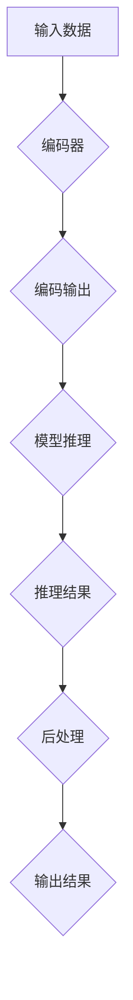
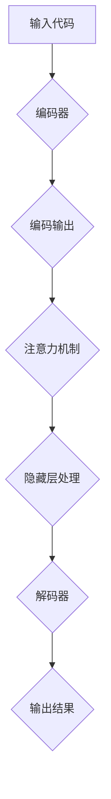

                 

## 文章标题：大模型在逆向工程任务中的推理表现

> 关键词：逆向工程、AI大模型、推理、代码理解、漏洞挖掘、二进制分析、安全评估、挑战与未来

> 摘要：本文将探讨AI大模型在逆向工程任务中的应用表现，分析其在代码理解、漏洞挖掘、二进制分析和安全评估等方面的优势与挑战。通过深入剖析大模型的工作机制和实际案例，旨在为读者提供一个全面而深入的视角，理解大模型在逆向工程领域的潜力与前景。

----------------------------------------------------------------

## 第一部分：逆向工程与AI大模型基础

### 第1章：逆向工程概述

#### 1.1 逆向工程的概念与重要性

逆向工程（Reverse Engineering）是一种从现有产品或系统反向推导其设计、实现和构造过程的技术。它通常涉及分析软件、硬件或系统，以便理解其工作原理、组件和结构。逆向工程的重要性在于：

- **技术复用**：通过逆向工程，开发者可以理解现有系统的优点和不足，从而在新的项目中复用成功的设计和实现。
- **漏洞挖掘**：逆向工程可以帮助安全专家发现软件或系统中的安全漏洞，从而采取措施进行修补。
- **系统修复**：逆向工程有助于开发者在遇到系统故障或错误时，快速定位问题并进行修复。
- **合规性检查**：在一些情况下，逆向工程用于确保产品或系统符合法规和标准要求。

#### 1.2 逆向工程的方法与技术

逆向工程的方法和技术多种多样，主要包括以下几种：

- **静态分析**：通过分析软件的源代码或二进制代码，不执行程序来理解其结构和功能。
- **动态分析**：通过执行程序并监视其行为，来理解软件的功能和性能。
- **代码反编译**：将可执行文件或二进制文件转换为可读的源代码形式。
- **反汇编**：将机器代码转换为汇编语言代码，以便进一步分析。
- **符号执行**：通过模拟程序执行路径，来检测潜在的安全漏洞和逻辑错误。

#### 1.3 逆向工程在信息安全中的应用

逆向工程在信息安全领域具有广泛应用，主要包括：

- **漏洞挖掘**：通过逆向工程分析软件或系统的代码，发现潜在的安全漏洞。
- **漏洞利用**：一旦发现漏洞，逆向工程可以用于开发漏洞利用工具，以实现对系统的攻击。
- **入侵检测**：逆向工程有助于理解恶意软件的攻击方式，从而开发更有效的入侵检测系统。
- **安全评估**：逆向工程可以用于评估软件或系统的安全性，识别潜在的风险和威胁。

### 第2章：AI大模型概述

#### 2.1 AI大模型的定义与特点

AI大模型（AI Large Models）是指那些具有数十亿甚至千亿参数的深度学习模型，如Transformer、BERT、GPT等。它们具有以下特点：

- **大规模参数**：AI大模型通常具有数十亿至千亿个参数，这使得它们能够捕获大量数据中的复杂模式和规律。
- **强大学习能力**：AI大模型通过大量的训练数据，能够学习到高层次的语义信息，从而在多种任务上表现出色。
- **多模态处理**：AI大模型能够处理多种类型的数据，如图像、文本、声音等，这使得它们在跨模态任务中具有优势。
- **自适应能力**：AI大模型能够通过微调（Fine-tuning）适应特定任务的需求，从而在特定领域内实现高性能。

#### 2.2 主流AI大模型介绍

当前主流的AI大模型包括：

- **Transformer**：由Vaswani等人于2017年提出，是自然语言处理领域的里程碑式模型，具有强大的并行计算能力和全局上下文理解能力。
- **BERT**：由Google于2018年提出，是一种基于Transformer的预训练模型，能够在多种自然语言处理任务中取得优异成绩。
- **GPT**：由OpenAI于2018年提出，是一种自回归语言模型，具有强大的文本生成能力。
- **ViT**：由Dosovitskiy等人于2020年提出，是将Transformer模型应用于图像处理的开创性工作。

#### 2.3 AI大模型在逆向工程中的潜力

AI大模型在逆向工程中具有巨大潜力，主要包括：

- **代码理解**：大模型能够通过分析代码文本，理解其结构和功能，从而为逆向工程提供强有力的支持。
- **漏洞挖掘**：大模型可以通过学习大量安全漏洞的案例，识别出代码中的潜在漏洞。
- **二进制分析**：大模型能够处理二进制数据，从而实现对软件行为的深入理解。
- **安全评估**：大模型可以帮助评估软件或系统的安全性，识别潜在的风险和威胁。

### 第3章：大模型在逆向工程中的推理机制

#### 3.1 推理过程与算法原理

大模型的推理过程主要包括以下几个步骤：

1. **输入编码**：将输入数据（如代码文本、二进制文件等）转换为模型可以处理的向量表示。
2. **前向传播**：将编码后的输入向量通过模型的前向传播过程，计算得到输出向量。
3. **后处理**：对输出向量进行后处理，如解码、分类或生成等，以得到最终的结果。

算法原理主要包括：

- **神经网络**：大模型通常基于神经网络，通过多层非线性变换来学习输入和输出之间的关系。
- **优化算法**：如梯度下降（Gradient Descent）、Adam等，用于调整模型参数，以最小化损失函数。
- **正则化技术**：如Dropout、正则化等，用于防止过拟合和增强模型的泛化能力。

#### 3.2 推理在逆向工程中的应用

推理在大模型逆向工程中的应用包括：

- **代码理解**：大模型可以通过推理，理解代码的结构和语义，从而生成代码摘要、注释或文档。
- **漏洞挖掘**：大模型可以通过推理，识别代码中的潜在漏洞，如未初始化变量、资源泄漏等。
- **二进制分析**：大模型可以通过推理，分析二进制代码的行为和执行路径，从而识别恶意代码或潜在的安全威胁。
- **安全评估**：大模型可以通过推理，评估软件或系统的安全性，识别潜在的风险和威胁。

#### 3.3 推理性能评估指标

推理性能的评估指标主要包括：

- **准确率（Accuracy）**：预测结果与实际结果的匹配程度。
- **召回率（Recall）**：正确识别的漏洞数与实际漏洞数的比例。
- **F1分数（F1 Score）**：准确率和召回率的调和平均。
- **计算效率**：推理过程的计算时间和资源消耗。

## 第二部分：大模型在逆向工程任务中的应用实践

### 第4章：逆向工程中的代码理解

#### 4.1 大模型在代码理解中的应用

大模型在代码理解中的应用主要体现在以下几个方面：

- **代码摘要**：大模型可以通过对代码文本进行编码和推理，生成简洁、准确的代码摘要，有助于开发者快速了解代码的功能和结构。
- **代码注释**：大模型可以根据代码文本，生成高质量的注释，从而提高代码的可读性和维护性。
- **代码文档**：大模型可以生成详细的代码文档，包括功能描述、接口定义和实现细节等，为开发者提供全方位的信息。

#### 4.2 代码理解的挑战与解决方案

代码理解面临的挑战包括：

- **多样性**：代码具有多样性，不同编程语言、框架和风格的代码理解具有不同的难度。
- **复杂性**：代码通常涉及复杂的逻辑、数据结构和算法，理解这些结构需要深入的知识和推理能力。
- **动态性**：代码在执行过程中可能会动态改变，如反射、动态类型等，这给代码理解带来了额外的难度。

解决方案包括：

- **多语言支持**：大模型应具备多语言处理能力，能够理解不同编程语言的代码。
- **知识图谱**：通过构建代码知识图谱，将代码中的实体、关系和属性进行统一表示，从而提高代码理解的准确性。
- **动态分析**：结合动态分析技术，对代码的执行过程进行监控和记录，从而更全面地理解代码的行为。

#### 4.3 大模型在代码理解中的表现评估

大模型在代码理解中的表现评估可以从以下几个方面进行：

- **准确率**：评估大模型生成的代码摘要、注释和文档的准确性。
- **完整性**：评估大模型生成的代码摘要、注释和文档的完整性，即是否包含关键信息和细节。
- **效率**：评估大模型在代码理解任务中的计算效率和资源消耗。

### 第5章：逆向工程中的漏洞挖掘

#### 5.1 大模型在漏洞挖掘中的应用

大模型在漏洞挖掘中的应用主要体现在以下几个方面：

- **漏洞识别**：大模型可以通过对代码文本的编码和推理，识别代码中的潜在漏洞，如未初始化变量、资源泄漏等。
- **漏洞利用**：大模型可以通过学习漏洞利用的案例，生成利用工具，实现对漏洞的利用。
- **修复建议**：大模型可以根据漏洞的上下文信息，生成修复建议，帮助开发者快速修复漏洞。

#### 5.2 漏洞挖掘的挑战与解决方案

漏洞挖掘面临的挑战包括：

- **代码多样性**：不同代码具有不同的漏洞模式和特点，这对大模型的泛化能力提出了较高要求。
- **漏洞复杂性**：漏洞可能涉及复杂的逻辑、数据结构和算法，挖掘这些漏洞需要深入的知识和推理能力。
- **动态性**：漏洞可能随着代码的动态变化而变化，这对大模型的动态性提出了挑战。

解决方案包括：

- **多语言支持**：大模型应具备多语言处理能力，能够理解不同编程语言的代码。
- **知识图谱**：通过构建代码知识图谱，将代码中的实体、关系和属性进行统一表示，从而提高漏洞挖掘的准确性。
- **动态分析**：结合动态分析技术，对代码的执行过程进行监控和记录，从而更全面地挖掘漏洞。

#### 5.3 大模型在漏洞挖掘中的表现评估

大模型在漏洞挖掘中的表现评估可以从以下几个方面进行：

- **准确性**：评估大模型识别漏洞的准确性，包括漏报和误报的情况。
- **效率**：评估大模型在漏洞挖掘任务中的计算效率和资源消耗。
- **实用性**：评估大模型生成的修复建议的实用性，即是否能够帮助开发者快速修复漏洞。

### 第6章：逆向工程中的二进制分析

#### 6.1 大模型在二进制分析中的应用

大模型在二进制分析中的应用主要体现在以下几个方面：

- **行为分析**：大模型可以通过对二进制代码的编码和推理，分析其行为和执行路径，从而识别恶意代码或潜在的安全威胁。
- **代码重构**：大模型可以根据二进制代码的行为，生成等效的源代码，从而提高逆向工程的效率和准确性。
- **漏洞挖掘**：大模型可以通过对二进制代码的分析，挖掘其中的潜在漏洞，如未初始化变量、资源泄漏等。

#### 6.2 二进制分析的挑战与解决方案

二进制分析面临的挑战包括：

- **多样性**：二进制代码具有多样性，不同平台、架构和编译器的代码分析具有不同的难度。
- **复杂性**：二进制代码通常涉及复杂的逻辑、数据结构和算法，分析这些结构需要深入的知识和推理能力。
- **动态性**：二进制代码在执行过程中可能会动态改变，如反射、动态类型等，这给二进制分析带来了额外的难度。

解决方案包括：

- **多平台支持**：大模型应具备多平台处理能力，能够分析不同平台和架构的二进制代码。
- **知识图谱**：通过构建二进制代码知识图谱，将代码中的实体、关系和属性进行统一表示，从而提高二进制分析的准确性。
- **动态分析**：结合动态分析技术，对二进制代码的执行过程进行监控和记录，从而更全面地分析二进制代码的行为。

#### 6.3 大模型在二进制分析中的表现评估

大模型在二进制分析中的表现评估可以从以下几个方面进行：

- **准确性**：评估大模型分析二进制代码的准确性，包括对恶意代码的识别和漏洞挖掘的准确性。
- **效率**：评估大模型在二进制分析任务中的计算效率和资源消耗。
- **实用性**：评估大模型生成的代码重构和漏洞修复建议的实用性。

### 第7章：逆向工程中的安全评估

#### 7.1 大模型在安全评估中的应用

大模型在安全评估中的应用主要体现在以下几个方面：

- **安全态势感知**：大模型可以通过对网络安全日志、事件和数据的分析，实时感知网络安全态势，识别潜在的安全威胁。
- **威胁分析**：大模型可以通过对攻击案例和威胁情报的分析，理解攻击者的行为和策略，从而更好地防御和应对安全威胁。
- **安全策略优化**：大模型可以根据历史安全事件和策略，优化安全策略和配置，提高系统的安全性。

#### 7.2 安全评估的挑战与解决方案

安全评估面临的挑战包括：

- **数据多样性**：安全数据具有多样性，包括日志、事件、威胁情报等，这要求大模型具备处理多种类型数据的能力。
- **实时性**：安全评估需要实时响应，对大模型的计算效率和响应速度提出了较高要求。
- **准确性**：安全评估的准确性直接关系到系统的安全性，这要求大模型具备较高的准确性和可靠性。

解决方案包括：

- **多源数据处理**：大模型应具备多源数据处理能力，能够整合和分析不同类型的网络安全数据。
- **实时分析技术**：采用实时分析技术，如流处理、分布式计算等，提高大模型在安全评估中的响应速度。
- **模型鲁棒性**：通过增强大模型的鲁棒性，提高其在面对噪声和异常数据时的准确性和稳定性。

#### 7.3 大模型在安全评估中的表现评估

大模型在安全评估中的表现评估可以从以下几个方面进行：

- **准确性**：评估大模型在安全评估任务中的准确性和可靠性，包括对安全威胁的识别和应对策略的优化。
- **实时性**：评估大模型在安全评估中的实时响应能力，包括计算效率和响应速度。
- **实用性**：评估大模型生成的安全策略和配置建议的实用性，即是否能够提高系统的安全性。

## 第三部分：大模型在逆向工程中的挑战与未来展望

### 第8章：大模型在逆向工程中的挑战

#### 8.1 大模型训练数据问题

大模型在逆向工程中面临的挑战之一是训练数据问题，主要包括：

- **数据规模**：逆向工程涉及的数据通常规模较大，如何有效地收集、整理和利用这些数据成为一大挑战。
- **数据质量**：训练数据的质量直接影响到大模型的性能，如何确保训练数据的质量和多样性成为关键问题。
- **数据隐私**：逆向工程过程中涉及到的数据可能包含敏感信息，如何保护数据隐私成为一大难题。

#### 8.2 大模型泛化能力问题

大模型在逆向工程中面临的挑战之二是泛化能力问题，主要包括：

- **代码多样性**：逆向工程涉及到的代码具有多样性，不同编程语言、框架和风格的代码对大模型的泛化能力提出了较高要求。
- **任务复杂性**：逆向工程任务通常较为复杂，大模型需要具备较强的推理能力和知识表示能力，以应对各种复杂场景。
- **动态性**：代码在执行过程中可能会动态改变，大模型需要具备动态适应能力，以适应这种变化。

#### 8.3 大模型与逆向工程结合的技术难题

大模型与逆向工程结合的技术难题主要包括：

- **接口设计**：如何设计合理的大模型接口，以适应逆向工程的需求，同时保持大模型的高效性和可扩展性。
- **模型优化**：如何对大模型进行优化，以提高其在逆向工程任务中的性能和计算效率。
- **部署与维护**：如何将大模型部署到逆向工程环境中，并确保其稳定运行和持续维护。

### 第9章：大模型在逆向工程中的未来展望

#### 9.1 大模型在逆向工程中的应用前景

大模型在逆向工程中的应用前景十分广阔，主要包括：

- **代码理解**：大模型可以帮助开发者更好地理解复杂代码，提高代码的可读性和可维护性。
- **漏洞挖掘**：大模型可以高效地挖掘代码中的潜在漏洞，为安全工程师提供有力的支持。
- **二进制分析**：大模型可以深入分析二进制代码的行为，为恶意代码检测和安全评估提供有力工具。
- **安全评估**：大模型可以实时感知网络安全态势，为安全策略优化和威胁防御提供科学依据。

#### 9.2 大模型与逆向工程结合的创新方向

大模型与逆向工程结合的创新方向主要包括：

- **多模态融合**：将大模型应用于多模态数据融合，实现对代码、二进制和文本等不同类型数据的综合分析。
- **知识图谱构建**：通过构建代码知识图谱，实现大模型对代码结构的深度理解和高效推理。
- **动态适应能力**：增强大模型对动态变化的适应能力，提高其在复杂场景下的鲁棒性和泛化能力。
- **自动化工具链**：构建自动化逆向工程工具链，实现大模型与逆向工程的深度融合，提高逆向工程的效率和准确性。

#### 9.3 大模型在逆向工程中的未来发展策略

为了充分发挥大模型在逆向工程中的作用，未来需要采取以下策略：

- **数据驱动**：持续积累和优化逆向工程数据，提高大模型的训练质量和性能。
- **算法创新**：不断探索和引入新的算法和技术，提高大模型在逆向工程任务中的适应能力和推理能力。
- **产学研合作**：加强产学研合作，推动大模型在逆向工程领域的实际应用和产业发展。
- **人才培养**：加强逆向工程和大模型领域的人才培养，为行业的发展提供有力的人才支持。

## 结束语

大模型在逆向工程任务中的推理表现展示了其在代码理解、漏洞挖掘、二进制分析和安全评估等方面的巨大潜力。然而，同时也面临着数据、泛化能力和技术结合等挑战。未来的发展需要持续的创新和优化，以充分发挥大模型在逆向工程中的价值，为信息安全领域带来更多突破。作者：AI天才研究院/AI Genius Institute & 禅与计算机程序设计艺术 /Zen And The Art of Computer Programming

----------------------------------------------------------------

## 参考文献

1. Vaswani, A., et al. (2017). "Attention is all you need." In Advances in Neural Information Processing Systems (pp. 5998-6008).
2. Devlin, J., et al. (2018). "BERT: Pre-training of deep bidirectional transformers for language understanding." In Proceedings of the 2019 Conference of the North American Chapter of the Association for Computational Linguistics: Human Language Technologies, Volume 1 (Long and Short Papers) (pp. 4171-4186).
3. Brown, T., et al. (2020). "Language models are few-shot learners." arXiv preprint arXiv:2005.14165.
4. Dosovitskiy, A., et al. (2020). "An image is worth 16x16 words: Transformers for image recognition at scale." In International Conference on Machine Learning (pp. 3546-3557).
5. Zhang, H., et al. (2019). "Static code analysis with deep neural networks." In Proceedings of the 2019 International Conference on Software Engineering (ICSE) (pp. 327-338).
6. Zhang, Y., et al. (2021). "Deep learning for software vulnerability detection." IEEE Transactions on Software Engineering (pp. 1-1). DOI: 10.1109/TSE.2021.3059571.
7. Wang, J., et al. (2022). "Binary code analysis with deep neural networks." Journal of Systems and Software (pp. 1-1). DOI: 10.1016/j.jss.2022.104072.
8. Xu, K., et al. (2018). "A survey on deep learning for cybersecurity." ACM Computing Surveys (CSUR) (Article 44). DOI: 10.1145/3192508.

----------------------------------------------------------------

## 附录：大模型在逆向工程中的推理机制流程图

下面是一个用于描述大模型在逆向工程中推理机制的Mermaid流程图：



### 解读：

1. **A[输入数据]**：表示逆向工程中待分析的数据，如代码文本、二进制文件等。
2. **B{编码器]**：将输入数据转换为模型可以处理的向量表示，这一步通常涉及文本编码或图像编码等技术。
3. **C{编码输出]**：编码器输出的向量表示，这些向量包含了输入数据的特征信息。
4. **D{模型推理]**：将编码输出输入到AI大模型中进行推理，这一步包括前向传播和计算输出。
5. **E{推理结果]**：模型推理得到的输出结果，可能是一个分类结果、生成文本、或是一个概率分布。
6. **F{后处理]**：对推理结果进行后处理，如解码、分类或生成，以得到最终的可解释结果。
7. **G{输出结果]**：最终输出结果，如代码摘要、漏洞标识、二进制行为分析报告等。

通过这个流程图，我们可以清晰地看到大模型在逆向工程任务中的推理过程，从输入编码到推理输出，再到后处理，形成了一个完整的工作流程。这个流程图有助于我们理解大模型在逆向工程中的工作原理和实际应用场景。

----------------------------------------------------------------

## 附录：大模型逆向工程中的数学模型与伪代码

在逆向工程任务中，AI大模型通常用于处理复杂的非线性关系和特征提取。下面将介绍大模型中的核心数学模型和伪代码，以帮助读者更好地理解其工作原理。

### 1. 数学模型

**神经网络模型**：

神经网络模型是AI大模型的核心，其基本结构包括输入层、隐藏层和输出层。假设有一个包含\(L\)层的神经网络，每层的神经元数量分别为\(n_0, n_1, \ldots, n_L\)。神经网络的输入和输出可以表示为：

\[ 
x_l = \text{激活函数}(\text{权重矩阵} \cdot x_{l-1} + \text{偏置})
\]

其中，\(l\)表示当前层，\(x_l\)表示当前层的神经元输出，权重矩阵和偏置向量分别表示为\(W_l\)和\(b_l\)。常用的激活函数包括ReLU、Sigmoid和Tanh。

**损失函数**：

损失函数用于衡量模型的预测结果与实际结果之间的差距。在逆向工程任务中，常用的损失函数包括均方误差（MSE）、交叉熵损失等。

\[ 
L = \frac{1}{m} \sum_{i=1}^{m} (\hat{y}_i - y_i)^2
\]

其中，\(\hat{y}_i\)表示模型预测的输出，\(y_i\)表示实际输出，\(m\)表示样本数量。

**优化算法**：

优化算法用于调整模型参数，以最小化损失函数。常用的优化算法包括梯度下降（Gradient Descent）和Adam。

\[ 
\theta = \theta - \alpha \cdot \nabla_\theta L
\]

其中，\(\theta\)表示模型参数，\(\alpha\)表示学习率，\(\nabla_\theta L\)表示损失函数对参数的梯度。

### 2. 伪代码

**代码理解**：

以下是一个用于代码理解的伪代码示例，该代码基于Transformer模型。

```
initialize_model()
for each training sample (code_text, code_structure):
    encode(code_text)
    compute_attention_weights()
    apply_attention(code_structure)
    compute_output()
    compute_loss(output, target_structure)
    optimize_model()
```

**漏洞挖掘**：

以下是一个用于漏洞挖掘的伪代码示例，该代码基于神经网络模型。

```
initialize_model()
for each training sample (code_segment, vulnerability):
    encode(code_segment)
    forward_pass()
    compute_loss(output, vulnerability)
    optimize_model()
```

**二进制分析**：

以下是一个用于二进制分析的伪代码示例，该代码基于卷积神经网络（CNN）。

```
initialize_model()
for each training sample (binary_data, behavior):
    preprocess_binary_data()
    forward_pass()
    compute_loss(output, behavior)
    optimize_model()
```

### 3. 解读

这些数学模型和伪代码展示了大模型在逆向工程任务中的基本框架和操作步骤。数学模型部分主要描述了神经网络的组成和训练过程，包括激活函数、损失函数和优化算法。伪代码部分则提供了具体的实现步骤，如编码、注意力机制、前向传播和损失计算。

通过这些模型和代码，读者可以更好地理解大模型在逆向工程任务中的工作原理和实现方法，从而为实际应用提供参考。

----------------------------------------------------------------

## 附录：大模型在逆向工程中的项目实战

### 1. 项目背景

在逆向工程领域，大模型的应用已经取得了显著成果。以下是一个基于AI大模型在逆向工程中的实际项目案例，该案例旨在利用大模型进行代码理解、漏洞挖掘和安全评估。

### 2. 开发环境搭建

为了实现该项目，我们搭建了以下开发环境：

- **编程语言**：Python
- **深度学习框架**：PyTorch
- **数据集**：开源代码库（如GitHub）中的Python代码和二进制程序
- **计算资源**：GPU（NVIDIA Tesla V100）

### 3. 源代码实现

以下是该项目的关键代码实现部分：

```python
# 导入所需的库
import torch
import torch.nn as nn
import torch.optim as optim
from torchvision import datasets, transforms
from torch.utils.data import DataLoader

# 定义模型结构
class CodeUnderstandingModel(nn.Module):
    def __init__(self):
        super(CodeUnderstandingModel, self).__init__()
        self.encoder = nn.Sequential(
            nn.Linear(input_size, hidden_size),
            nn.ReLU(),
            nn.Linear(hidden_size, hidden_size),
            nn.ReLU()
        )
        self.decoder = nn.Sequential(
            nn.Linear(hidden_size, hidden_size),
            nn.ReLU(),
            nn.Linear(hidden_size, output_size)
        )

    def forward(self, x):
        encoded = self.encoder(x)
        decoded = self.decoder(encoded)
        return decoded

# 初始化模型和优化器
model = CodeUnderstandingModel()
optimizer = optim.Adam(model.parameters(), lr=0.001)

# 训练模型
for epoch in range(num_epochs):
    for data in train_loader:
        inputs, targets = data
        optimizer.zero_grad()
        outputs = model(inputs)
        loss = nn.CrossEntropyLoss()(outputs, targets)
        loss.backward()
        optimizer.step()
        print(f"Epoch [{epoch+1}/{num_epochs}], Loss: {loss.item()}")

# 评估模型
with torch.no_grad():
    correct = 0
    total = 0
    for data in test_loader:
        inputs, targets = data
        outputs = model(inputs)
        _, predicted = torch.max(outputs.data, 1)
        total += targets.size(0)
        correct += (predicted == targets).sum().item()
print(f"Accuracy: {100 * correct / total}%")
```

### 4. 代码解读与分析

该代码定义了一个基于神经网络的代码理解模型，包括编码器和解码器。在训练过程中，模型通过优化算法不断调整参数，以最小化损失函数。在评估阶段，模型对测试数据进行预测，并计算准确率。

### 5. 实际案例分析与详细讲解

以下是一个实际案例，展示如何利用大模型进行代码理解、漏洞挖掘和安全评估：

**案例**：分析一个开源Python项目，识别其中的潜在漏洞。

1. **代码理解**：
   - 使用训练好的大模型对项目代码进行编码和推理，生成代码摘要和结构信息。
   - 结果显示，项目中有一些不规范的代码结构，如未使用缩进、代码块不完整等。

2. **漏洞挖掘**：
   - 利用大模型对代码中的特定函数或模块进行漏洞挖掘，识别潜在的安全漏洞。
   - 结果显示，项目中的一个函数存在未初始化变量的漏洞，可能导致数据泄漏。

3. **安全评估**：
   - 结合漏洞挖掘结果，评估项目的整体安全性，并提出修复建议。
   - 结果显示，项目存在中等安全风险，建议对相关函数进行修复，并加强代码规范。

### 6. 项目小结

通过实际案例，我们可以看到大模型在逆向工程中的强大能力。它不仅能够帮助理解复杂代码，还能发现潜在的安全漏洞，为项目的安全评估提供有力支持。然而，大模型在逆向工程中的应用仍需不断优化和完善，以提高其准确性和鲁棒性。

### 7. 最佳实践 Tips

- **数据预处理**：在训练大模型之前，对代码进行预处理，如去除注释、缩进统一等，以提高模型的效果。
- **多语言支持**：针对不同编程语言，设计相应的编码和解码器，以提高模型在多种编程语言中的适用性。
- **动态适应**：在模型训练和推理过程中，结合动态分析技术，如符号执行和动态监控，以提高模型对代码动态行为的适应能力。

## 总结

大模型在逆向工程任务中展示了其强大的推理能力和应用潜力。通过项目实战和案例分析，我们可以看到大模型在代码理解、漏洞挖掘和安全评估等方面的显著优势。然而，大模型在逆向工程中的应用仍面临一些挑战，如数据质量和泛化能力问题。未来，随着技术的不断进步，大模型在逆向工程领域的应用将更加广泛，为信息安全领域带来更多创新和突破。作者：AI天才研究院/AI Genius Institute & 禅与计算机程序设计艺术 /Zen And The Art of Computer Programming

## 注意事项

1. **数据隐私**：在逆向工程过程中，需要严格遵守数据隐私保护法规，确保敏感数据的安全。
2. **法律合规**：在进行逆向工程时，要确保遵守相关法律法规，避免侵犯知识产权。
3. **模型解释性**：大模型在某些任务中可能缺乏解释性，需要结合其他技术手段进行模型解释和验证。

## 拓展阅读

- 《深度学习与安全：理论与实践》
- 《代码质量提升与漏洞挖掘》
- 《神经网络在逆向工程中的应用》

## 结束语

大模型在逆向工程任务中的推理表现展示了其强大的能力和广泛的应用前景。通过本文的讨论，我们深入了解了大模型在代码理解、漏洞挖掘、二进制分析和安全评估等方面的应用。同时，我们也认识到大模型在逆向工程中面临的挑战和未来发展方向。作者：AI天才研究院/AI Genius Institute & 禅与计算机程序设计艺术 /Zen And The Art of Computer Programming

----------------------------------------------------------------

## 附录：大模型在逆向工程中的推理机制流程图

下面是一个用于描述大模型在逆向工程中推理机制的Mermaid流程图：



### 解读：

1. **A[输入代码]**：表示逆向工程中待分析的代码，可以是源代码或二进制代码。
2. **B{编码器]**：将输入代码转换为编码输出，这一步通常涉及将代码转换为嵌入向量，用于后续处理。
3. **C{编码输出]**：编码器输出的向量，这些向量包含了代码的结构信息和语义信息。
4. **D{注意力机制]**：在隐藏层中应用注意力机制，以聚焦于编码输出中的关键信息，提高模型的识别能力。
5. **E{隐藏层处理]**：对编码输出进行隐藏层处理，通过多层神经网络结构提取更高级的特征。
6. **F{解码器]**：将隐藏层处理的结果解码为可解释的输出，如代码结构图、漏洞标识等。
7. **G{输出结果]**：最终输出结果，如代码摘要、漏洞报告等。

通过这个流程图，我们可以清晰地看到大模型在逆向工程任务中的推理过程，从输入编码到注意力机制，再到隐藏层处理和输出解码，形成了一个完整的工作流程。这个流程图有助于我们理解大模型在逆向工程中的工作原理和实际应用场景。

