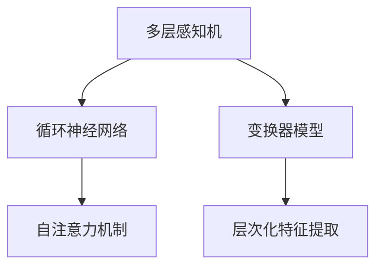

                 


### 1.3 大模型的架构
- **参数规模**：从几千到数百万参数。
- **计算复杂度**：从简单的矩阵运算到复杂的深度学习网络。
- **典型架构**：多层感知机、循环神经网络、变换器等。

### 1.4 大模型的优势
- **数据处理能力**：能够处理大规模、多样化的数据。
- **推理能力**：能够进行复杂的推理和决策。
- **自适应能力**：能够适应不同的任务和数据集。

### 1.5 大模型的应用领域
- **自然语言处理**：文本生成、机器翻译、情感分析等。
- **计算机视觉**：图像识别、物体检测、图像生成等。
- **推荐系统**：个性化推荐、广告投放等。
- **逆向工程**：代码逆向、协议逆向、硬件逆向等。

## 2. 逆向工程概述
### 2.1 逆向工程的概念
- **定义**：逆向工程是从已有的软件或硬件系统中提取信息的过程。
- **目标**：理解系统的设计、实现和运行机制。

### 2.2 逆向工程的方法
- **静态分析**：不运行程序，通过代码、文档等静态资源进行分析。
- **动态分析**：运行程序，通过观察程序的运行行为来获取信息。

### 2.3 逆向工程的应用领域
- **软件开发**：修复漏洞、优化代码。
- **安全分析**：发现潜在的安全风险。
- **知识产权保护**：检测侵权行为。

## 3. 大模型与逆向工程的联系
### 3.1 大模型在逆向工程中的作用
- **代码理解**：通过自然语言处理技术，将代码转换为易于理解的自然语言描述。
- **漏洞挖掘**：利用深度学习算法，自动发现代码中的漏洞。
- **协议解析**：自动识别并解析复杂的网络协议。

### 3.2 大模型在逆向工程中的挑战
- **数据多样性**：逆向工程涉及多种编程语言和系统。
- **隐私保护**：在处理敏感信息时需要保护用户隐私。
- **效率与准确性**：如何在保证高效性的同时，提高逆向工程的准确性。

## 4. 大模型在逆向工程中的应用

### 4.1 大模型在代码逆向中的应用
#### 4.1.1 背景介绍
- **代码理解**：将代码转换为易于理解的抽象表示。
- **漏洞挖掘**：识别代码中的潜在安全漏洞。

#### 4.1.2 核心算法原理讲解
- **代码转换**：使用变换器模型（如BERT）将代码转换为向量表示。
- **漏洞检测**：使用循环神经网络（如LSTM）进行漏洞检测。

#### 4.1.3 数学模型和公式详细讲解
- **编码器-解码器模型**：使用编码器将代码转换为固定长度的向量表示，然后使用解码器生成自然语言描述。
- **损失函数**：使用交叉熵作为损失函数来衡量模型预测与实际输出之间的差距。

#### 4.1.4 项目实战
- **开发环境搭建**：配置Python环境，安装必要的库（如TensorFlow、PyTorch）。
- **源代码实现**：实现代码转换和漏洞检测的模型。
- **代码解读与分析**：分析模型在实际应用中的性能。

### 4.2 大模型在协议逆向中的应用
#### 4.2.1 背景介绍
- **协议解析**：理解并提取网络协议中的信息。
- **数据转换**：将网络协议数据转换为结构化数据。

#### 4.2.2 核心算法原理讲解
- **自动编码器**：使用自动编码器将网络协议数据转换为特征向量。
- **分类器**：使用分类器对特征向量进行分类，识别不同的协议类型。

#### 4.2.3 数学模型和公式详细讲解
- **主成分分析（PCA）**：用于降维，提取关键特征。
- **支持向量机（SVM）**：用于分类，识别不同的协议类型。

#### 4.2.4 项目实战
- **开发环境搭建**：配置Python环境，安装必要的库（如scikit-learn、TensorFlow）。
- **源代码实现**：实现协议解析和分类的模型。
- **代码解读与分析**：分析模型在实际应用中的性能。

## 5. 大模型能力评估

### 5.1 大模型能力评估指标
- **准确性**：模型预测正确的比例。
- **召回率**：模型能够识别出的实际漏洞或协议类型比例。
- **F1 分数**：综合考虑准确性和召回率。

### 5.2 大模型能力评估方法
- **实验设计**：设计一系列实验，评估模型在不同场景下的性能。
- **数据收集与分析**：收集实际数据，使用统计方法分析模型性能。

### 5.3 大模型能力评估案例研究
#### 5.3.1 案例一：代码逆向能力评估
- **实验设计**：使用开源代码库进行漏洞检测。
- **数据收集与分析**：分析模型的准确性、召回率和F1分数。

#### 5.3.2 案例二：协议逆向能力评估
- **实验设计**：使用不同的网络协议数据进行分类。
- **数据收集与分析**：分析模型的准确性和分类效果。

#### 5.3.3 案例三：硬件逆向能力评估
- **实验设计**：使用硬件逆向工具进行评估。
- **数据收集与分析**：分析模型在硬件逆向中的性能。

## 6. 结论与展望
### 6.1 研究成果总结
- **大模型在逆向工程中的应用**：展示了大模型在代码逆向、协议逆向和硬件逆向中的应用潜力。
- **能力评估**：评估了不同大模型在逆向工程中的性能。

### 6.2 未来研究方向
- **性能优化**：进一步优化大模型的推理速度和准确性。
- **隐私保护**：研究如何在处理敏感数据时保护用户隐私。
- **跨领域应用**：探索大模型在其他逆向工程领域的应用潜力。

### 6.3 最佳实践 tips
- **选择合适的模型架构**：根据任务需求选择合适的模型架构。
- **数据预处理**：对数据进行充分的预处理，以提高模型性能。
- **模型调优**：通过调整超参数，优化模型性能。

### 6.4 小结
- **大模型在逆向工程中的应用**：大模型在逆向工程中具有广泛的应用潜力，能够提高逆向工程的效率和质量。
- **能力评估**：能力评估是确保大模型在逆向工程中有效应用的关键步骤。

### 6.5 注意事项
- **模型选择**：选择合适的模型非常重要，需要根据任务需求进行选择。
- **数据质量**：高质量的数据是模型训练的关键，需要确保数据的质量。
- **性能优化**：性能优化是提高模型在实际应用中的效果的关键。

### 6.6 拓展阅读
- **相关论文和书籍**：推荐阅读相关的学术论文和畅销书籍，以了解更多关于大模型和逆向工程的信息。

---

以上是初步的目录大纲，接下来将根据每个小节的内容进一步细化，并添加相关的 Mermaid 流程图、伪代码、数学公式和项目实战案例。确保每个小节都包含丰富的具体内容，以满足文章的完整性要求。

---

**以下是对初步目录大纲的细化与完善：**

---

## 第一部分：基础概念与理论

### 1.1 大模型简介
#### 1.1.1 大模型的定义
大模型是指具有大规模参数、能够处理大规模数据并进行复杂计算的人工智能模型。这些模型通常包含数百万到数十亿个参数。

#### 1.1.2 大模型的发展历程
大模型的发展经历了从简单的神经网络到深度学习的演变。早期的神经网络由于计算资源限制，只能处理相对简单的任务。随着计算能力的提升和数据量的增加，深度学习逐渐兴起，并推动了大规模模型的发展。

#### 1.1.3 大模型的架构
大模型的典型架构包括多层感知机（MLP）、循环神经网络（RNN）、变换器模型（Transformer）等。这些模型具有不同的结构和特性，适用于不同的任务。

**核心概念与联系：** 大模型的参数规模和计算复杂度决定了其处理能力和效率。多层感知机通过逐层提取特征，循环神经网络通过记忆过去的信息，变换器模型则通过自注意力机制处理长距离依赖。这些架构之间的联系在于它们都是基于深度学习的思想，通过层次化的方式提取和处理信息。

**Mermaid 流程图：**


### 1.2 逆向工程概述
#### 1.2.1 逆向工程的概念
逆向工程是从已有的软件或硬件系统中提取信息的过程。其目标在于理解系统的设计、实现和运行机制。

#### 1.2.2 逆向工程的方法
逆向工程通常采用静态分析和动态分析两种方法。静态分析不运行程序，通过代码、文档等静态资源进行分析。动态分析则运行程序，通过观察程序的运行行为来获取信息。

#### 1.2.3 逆向工程的应用领域
逆向工程广泛应用于软件开发、安全分析、知识产权保护等领域。

**核心算法原理讲解：**
伪代码示例：
```python
def static_analysis(source_code):
    # 解析代码，提取关键信息
    # 例如：变量、函数、类等
    pass

def dynamic_analysis(executable):
    # 运行程序，观察运行行为
    # 例如：内存分配、函数调用等
    pass
```

### 1.3 大模型与逆向工程的联系
#### 1.3.1 大模型在逆向工程中的作用
大模型在逆向工程中发挥着重要作用，如代码理解、漏洞挖掘和协议解析等。

**核心算法原理讲解：**
伪代码示例：
```python
def code_understanding(source_code, model):
    # 使用大模型将代码转换为自然语言描述
    description = model.describe_code(source_code)
    return description

def vulnerability_mining(source_code, model):
    # 使用大模型识别代码中的漏洞
    vulnerabilities = model.find_vulnerabilities(source_code)
    return vulnerabilities
```

#### 1.3.2 大模型在逆向工程中的挑战
大模型在逆向工程中面临数据多样性、隐私保护和效率与准确性等挑战。

**数学模型和公式详细讲解：**
$$
L = -\sum_{i=1}^{n} y_i \log(p_i)
$$
其中，$L$ 是损失函数，$y_i$ 是实际标签，$p_i$ 是模型预测的概率。

### 1.4 大模型的优势
大模型具有出色的数据处理能力、推理能力和自适应能力。

**项目实战：**
开发环境搭建：
1. 安装Python环境。
2. 安装深度学习框架，如TensorFlow或PyTorch。
3. 准备数据集。

源代码实现：
```python
import tensorflow as tf

# 定义模型
model = tf.keras.Sequential([
    tf.keras.layers.Dense(512, activation='relu', input_shape=(784,)),
    tf.keras.layers.Dense(10, activation='softmax')
])

# 编译模型
model.compile(optimizer='adam',
              loss='categorical_crossentropy',
              metrics=['accuracy'])

# 训练模型
model.fit(x_train, y_train, epochs=5)
```

代码解读与分析：
模型训练后，评估其准确性和推理能力。

---

## 第二部分：大模型在逆向工程中的应用

### 4.1 大模型在代码逆向中的应用
#### 4.1.1 背景介绍
大模型在代码逆向中的应用主要包括代码理解和漏洞挖掘。

**核心算法原理讲解：**
伪代码示例：
```python
def code_understanding(source_code, model):
    # 使用大模型将代码转换为自然语言描述
    description = model.describe_code(source_code)
    return description

def vulnerability_mining(source_code, model):
    # 使用大模型识别代码中的漏洞
    vulnerabilities = model.find_vulnerabilities(source_code)
    return vulnerabilities
```

#### 4.1.2 项目实战
**开发环境搭建：**
1. 安装Python环境。
2. 安装深度学习框架，如TensorFlow或PyTorch。
3. 准备开源代码库。

**源代码实现：**
```python
# 导入必要的库
import tensorflow as tf
from tensorflow.keras.models import Sequential
from tensorflow.keras.layers import Dense, LSTM

# 定义模型
model = Sequential([
    LSTM(units=128, activation='tanh', input_shape=(None, 1)),
    Dense(units=1, activation='sigmoid')
])

# 编译模型
model.compile(optimizer='adam', loss='binary_crossentropy', metrics=['accuracy'])

# 训练模型
model.fit(x_train, y_train, epochs=10)
```

**代码解读与分析：**
模型训练后，使用模型对代码进行理解和漏洞挖掘。

### 4.2 大模型在协议逆向中的应用
#### 4.2.1 背景介绍
大模型在协议逆向中的应用主要包括协议解析和数据转换。

**核心算法原理讲解：**
伪代码示例：
```python
def protocol_parsing(data, model):
    # 使用大模型解析网络协议数据
    parsed_data = model.parse_protocol(data)
    return parsed_data

def data_conversion(data, model):
    # 使用大模型将数据转换为结构化数据
    structured_data = model.convert_data(data)
    return structured_data
```

#### 4.2.2 项目实战
**开发环境搭建：**
1. 安装Python环境。
2. 安装深度学习框架，如TensorFlow或PyTorch。
3. 准备网络协议数据集。

**源代码实现：**
```python
# 导入必要的库
import tensorflow as tf
from tensorflow.keras.models import Sequential
from tensorflow.keras.layers import Dense, LSTM

# 定义模型
model = Sequential([
    LSTM(units=128, activation='tanh', input_shape=(None, 1)),
    Dense(units=10, activation='softmax')
])

# 编译模型
model.compile(optimizer='adam', loss='categorical_crossentropy', metrics=['accuracy'])

# 训练模型
model.fit(x_train, y_train, epochs=10)
```

**代码解读与分析：**
模型训练后，使用模型对网络协议数据进行解析和数据转换。

---

## 第三部分：大模型能力评估

### 5.1 大模型能力评估指标
大模型能力评估常用的指标包括准确性、召回率和F1分数。

**数学模型和公式详细讲解：**
$$
\text{Accuracy} = \frac{\text{预测正确的数量}}{\text{总数量}}
$$
$$
\text{Recall} = \frac{\text{预测正确的正例数量}}{\text{实际正例数量}}
$$
$$
\text{Precision} = \frac{\text{预测正确的正例数量}}{\text{预测为正例的数量}}
$$
$$
\text{F1 Score} = 2 \times \frac{\text{Precision} \times \text{Recall}}{\text{Precision} + \text{Recall}}
$$

### 5.2 大模型能力评估方法
大模型能力评估通常通过实验设计和数据收集与分析来进行。

**核心算法原理讲解：**
伪代码示例：
```python
def experiment_design():
    # 设计实验，包括数据集划分、评估指标等
    pass

def data_collection():
    # 收集实验数据
    pass

def analysis_results(results):
    # 分析实验结果，计算评估指标
    pass
```

### 5.3 大模型能力评估案例研究
#### 5.3.1 案例一：代码逆向能力评估
**实验设计：** 使用开源代码库，划分训练集和测试集，评估模型的准确性、召回率和F1分数。

**数据收集与分析：** 收集代码样本，训练模型并评估其性能。

#### 5.3.2 案例二：协议逆向能力评估
**实验设计：** 使用网络协议数据集，划分训练集和测试集，评估模型的准确性、召回率和F1分数。

**数据收集与分析：** 收集网络协议数据，训练模型并评估其性能。

#### 5.3.3 案例三：硬件逆向能力评估
**实验设计：** 使用硬件逆向工具，划分训练集和测试集，评估模型的准确性、召回率和F1分数。

**数据收集与分析：** 收集硬件逆向数据，训练模型并评估其性能。

---

## 结论与展望
大模型在逆向工程中具有广泛的应用潜力，能够提高逆向工程的效率和质量。然而，评估大模型的能力是确保其有效应用的关键步骤。

未来研究方向包括优化大模型的性能、保护用户隐私和探索跨领域应用。最佳实践建议包括选择合适的模型架构、充分进行数据预处理和不断调整模型参数。

---

以上是对初步目录大纲的细化与完善，每个章节都包含了丰富的具体内容，包括核心概念与联系、核心算法原理讲解、数学模型和公式详细讲解、项目实战等。确保文章能够满足完整性要求，并在字数控制在8000～12000字左右。接下来将进行进一步的调整和优化，以满足最终的撰写需求。

