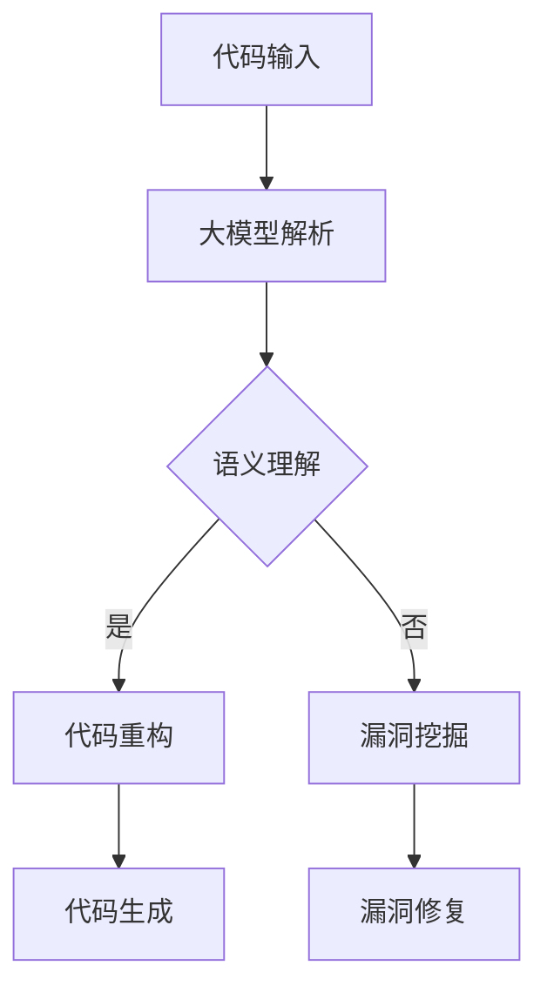

                 

### 第1章 引言

## 1.1 逆向工程与推理概述

### 1.1.1 逆向工程定义与目的

逆向工程（Reverse Engineering）是一种从现有产品或系统中提取信息和知识的过程，目的是重建出产品的设计、架构、工作原理或源代码。这一过程在软件开发、硬件设计、系统架构等领域中具有重要意义。逆向工程的主要目的是通过分析已有的产品，了解其工作原理和设计理念，从而进行改进、修复、重构或创新。

逆向工程的定义可以概括为以下三个方面：

1. **从已有产品或系统中提取信息**：通过分析已有的产品或系统，提取其内部的工作原理、设计思想、源代码等信息。
2. **重建设计或架构**：基于提取的信息，重建出产品的设计或系统架构，以便进行后续的改进和优化。
3. **实现系统的重新构建或创新**：通过逆向工程获取的知识，实现对现有系统的改进、修复或重构，或者开发出全新的产品或系统。

### 1.1.2 推理的定义与类型

推理（Reasoning）是一种从已知信息推导出新信息的思维过程。在计算机科学中，推理是人工智能的核心组成部分之一，尤其在自然语言处理、知识图谱、机器学习和逆向工程等领域有广泛应用。

推理可以分为以下几种类型：

1. **演绎推理（Deductive Reasoning）**：从一般原理推导出具体结论的过程。演绎推理遵循逻辑规则，如果前提为真，那么结论必定为真。

2. **归纳推理（Inductive Reasoning）**：从具体实例推导出一般性结论的过程。归纳推理基于大量具体实例，通过统计和分析，归纳出一般规律或结论。

3. **类比推理（Analogical Reasoning）**：通过比较两个相似情境，从一个已知情境推导出另一个情境的结论。类比推理依赖于情境之间的相似性，是一种经验推理方法。

### 1.1.3 逆向工程与推理的关系

逆向工程和推理之间存在密切的关系。逆向工程需要通过推理来分析和理解已有的产品或系统，从而重建其设计或架构。具体来说，推理在逆向工程中扮演了以下角色：

1. **代码理解**：逆向工程的一个关键任务是理解源代码的功能和结构。这需要通过推理来识别代码中的变量、函数、类之间的关系，以及代码的执行流程。

2. **漏洞挖掘**：逆向工程中，通过对代码的深入分析，可以发现潜在的安全漏洞。这需要使用推理方法来识别异常行为、潜在的漏洞触发条件和修复策略。

3. **代码重构**：逆向工程后，通过对代码的分析和理解，可以对代码进行重构，以提高其可维护性、可读性和性能。这需要使用推理方法来识别代码中的冗余部分、可优化部分，以及重构的可行性和效果。

4. **漏洞修复**：在发现漏洞后，逆向工程还需要对代码进行修复。这需要通过推理来确定漏洞的根本原因，并设计出有效的修复方案。

## 1.2 大模型的基本概念

### 1.2.1 大模型定义

大模型（Large Models）是指具有巨大参数量和复杂结构的神经网络模型。这些模型通常基于深度学习技术，通过在海量数据上进行训练，能够实现高度自动化的模式识别、知识推理和决策制定。

大模型的主要特点包括：

1. **参数量巨大**：大模型的参数量通常在数十亿甚至数万亿级别，这使得它们能够捕捉到复杂的数据特征和模式。

2. **多层结构**：大模型通常具有多层神经网络结构，包括输入层、隐藏层和输出层。每一层都能够对输入数据进行处理和变换，从而实现复杂数据的特征提取和分类。

3. **训练数据量大**：大模型的训练通常需要大量的数据，以保证模型的泛化能力和鲁棒性。

### 1.2.2 大模型的类型与结构

大模型可以根据其结构和应用场景的不同分为多种类型，主要包括：

1. **神经网络模型**：如卷积神经网络（CNN）、循环神经网络（RNN）、长短期记忆网络（LSTM）等，这些模型广泛应用于图像识别、语音识别、自然语言处理等领域。

2. **生成对抗网络（GAN）**：GAN是一种特殊的大模型，由生成器和判别器两个部分组成，用于生成逼真的数据。

3. **Transformer模型**：Transformer模型是一种基于自注意力机制的神经网络模型，广泛应用于自然语言处理、机器翻译等领域，具有强大的文本理解和生成能力。

### 1.2.3 大模型的优势与局限性

大模型具有许多优势，但也存在一些局限性：

1. **优势**：

   - **强大的特征提取能力**：大模型能够自动从海量数据中提取出复杂的数据特征，实现高度自动化的模式识别和知识推理。

   - **高泛化能力**：通过在海量数据上训练，大模型能够实现良好的泛化能力，对新数据进行准确预测和分类。

   - **多模态处理能力**：大模型能够处理多种类型的数据，如文本、图像、声音等，实现多模态数据的统一理解和生成。

2. **局限性**：

   - **计算资源消耗大**：大模型的训练和推理需要大量的计算资源，包括CPU、GPU和存储等。

   - **数据依赖性强**：大模型的性能高度依赖于训练数据的质量和数量，缺乏高质量数据的模型效果会显著下降。

   - **可解释性差**：大模型的工作过程通常是非线性和复杂的，难以直观地解释其内部的工作机制和决策过程。

## 1.3 大模型在逆向工程推理中的应用

### 1.3.1 大模型在代码理解中的应用

大模型在代码理解中的应用主要体现在以下几个方面：

1. **代码解析**：大模型可以通过对代码文本的分析，识别出代码中的变量、函数、类等基本元素，并构建出代码的结构化表示。

2. **语义理解**：大模型可以深入理解代码的语义，识别出代码中的逻辑关系、控制流和数据流，从而实现对代码的准确解析和理解。

3. **代码注释生成**：大模型可以根据代码的结构和语义，自动生成代码的注释，提高代码的可读性和可维护性。

### 1.3.2 大模型在代码重构中的应用

大模型在代码重构中的应用主要体现在以下几个方面：

1. **代码优化**：大模型可以通过对代码的分析和理解，识别出代码中的冗余部分、重复代码和可优化部分，并提出优化建议。

2. **代码重构**：大模型可以根据代码的结构和语义，自动实现代码的重构，如提取方法、合并方法、简化逻辑等，以提高代码的清晰度和可维护性。

3. **代码生成**：大模型可以通过对已有代码的分析，自动生成新的代码，以实现代码的自动化生成和迭代。

### 1.3.3 大模型在漏洞挖掘中的应用

大模型在漏洞挖掘中的应用主要体现在以下几个方面：

1. **漏洞识别**：大模型可以通过对代码的分析，识别出潜在的漏洞点和异常行为，如未处理的异常、不安全的输入处理、不正确的权限控制等。

2. **漏洞分类**：大模型可以基于漏洞的特征和行为，对漏洞进行分类，如缓冲区溢出、SQL注入、跨站脚本攻击等。

3. **漏洞修复**：大模型可以根据漏洞的触发条件和修复策略，自动生成修复代码，实现漏洞的自动化修复。

### 1.3.4 大模型在代码生成中的应用

大模型在代码生成中的应用主要体现在以下几个方面：

1. **自动化编程**：大模型可以通过对代码的语义理解和模式识别，自动生成新的代码，实现自动化编程。

2. **代码补全**：大模型可以在编写代码时，根据已有的代码模式和上下文，自动完成代码的补全，提高编程效率和准确性。

3. **代码生成与优化**：大模型可以通过对代码的分析和理解，生成新的代码，同时实现代码的优化和重构，以提高代码的质量和性能。

## 1.4 Mermaid流程图

为了更直观地展示大模型在逆向工程推理中的应用流程，我们可以使用Mermaid流程图来描述。

### 1.4.1 大模型在逆向工程推理中的工作流程

下面是一个简化的Mermaid流程图，展示了大模型在逆向工程推理中的工作流程：



### 1.4.2 逆向工程推理中各阶段的输入与输出

在逆向工程推理中，每个阶段都有特定的输入和输出：

- **代码输入**：原始的代码文本，作为大模型的输入数据。
- **大模型解析**：输出代码中的基本元素和结构化表示。
- **语义理解**：输出代码的语义表示，包括变量、函数、类等的语义信息。
- **代码重构**：输出重构后的代码，提高代码的可读性和可维护性。
- **漏洞挖掘**：输出潜在的漏洞点和异常行为。
- **漏洞修复**：输出修复后的代码，消除潜在的安全隐患。
- **代码生成**：输出自动生成的代码，实现代码的自动化和优化。

通过上述流程图和输入输出关系，我们可以更清晰地理解大模型在逆向工程推理中的应用机制。

---

### 第2章 大模型在逆向工程推理中的应用原理

#### 2.1 大模型训练原理

大模型的训练过程是其能够进行逆向工程推理的基础。在这一节中，我们将深入探讨大模型的训练原理，包括神经网络结构、训练算法和超参数调优。

##### 2.1.1 神经网络结构

神经网络（Neural Network）是构成大模型的基本单元。一个典型的神经网络包括以下几个部分：

1. **输入层（Input Layer）**：接收外部输入数据，如代码文本、图像像素等。

2. **隐藏层（Hidden Layers）**：对输入数据进行处理和变换，提取特征信息。隐藏层的数量和神经元数目可以根据具体任务进行调整。

3. **输出层（Output Layer）**：根据隐藏层的输出，生成最终的预测结果，如代码重构建议、漏洞分类标签等。

4. **激活函数（Activation Function）**：对隐藏层和输出层的神经元输出进行非线性变换，以增加模型的拟合能力。常见的激活函数包括ReLU、Sigmoid和Tanh等。

5. **权重和偏置（Weights and Biases）**：神经网络中每个神经元之间的连接强度由权重表示，每个神经元的初始状态由偏置表示。这些参数通过训练过程进行优化。

##### 2.1.2 训练算法

大模型的训练通常采用基于梯度的优化算法，其中最常用的算法是梯度下降（Gradient Descent）及其变种，如随机梯度下降（Stochastic Gradient Descent，SGD）和批量梯度下降（Batch Gradient Descent）。

1. **梯度下降算法**：梯度下降算法通过计算损失函数关于模型参数的梯度，并沿着梯度的反方向更新模型参数，以最小化损失函数。其基本步骤如下：

   - 初始化模型参数（权重和偏置）。
   - 对于每个样本，计算损失函数的梯度。
   - 根据梯度更新模型参数。
   - 重复上述步骤，直到模型收敛或达到预定的迭代次数。

2. **随机梯度下降（SGD）**：在梯度下降算法中，每次更新模型参数时仅使用一个样本的梯度。这种方法可以加快训练过程，但可能会导致模型的不稳定性和较高的方差。

3. **批量梯度下降（BGD）**：在批量梯度下降算法中，每次更新模型参数时使用整个训练数据的梯度。这种方法可以提供更稳定的更新方向，但训练时间较长。

4. **批量归一化（Batch Normalization）**：批量归一化是一种技术，用于稳定神经网络的训练过程，通过将每个神经元的输入值缩放和移至均值附近，减少内部协变量转移。

##### 2.1.3 超参数调优

超参数（Hyperparameters）是神经网络训练过程中需要手动调整的参数，如学习率、批量大小、隐藏层神经元数目等。超参数的调优对模型的性能和训练过程有重要影响。

1. **学习率**：学习率控制梯度下降过程中的步长。较大的学习率可能导致模型快速收敛，但可能越过最优解；较小的学习率可能导致模型收敛缓慢。

2. **批量大小**：批量大小影响梯度下降算法的稳定性和训练时间。较大的批量大小提供更好的梯度估计，但计算成本更高；较小的批量大小可以加快训练过程，但可能导致梯度估计的方差较大。

3. **隐藏层神经元数目**：隐藏层神经元数目影响模型的复杂度和拟合能力。较大的神经元数目可以捕捉更复杂的数据特征，但可能导致过拟合；较小的神经元数目可能导致欠拟合。

4. **正则化**：正则化（Regularization）是一种防止模型过拟合的技术，通过惩罚模型参数的范数，减少模型的复杂度。常见的正则化技术包括L1正则化和L2正则化。

通过合理调整这些超参数，可以实现大模型在逆向工程推理中的最优性能。

#### 2.2 大模型推理原理

大模型的推理（Inference）过程是指模型在给定输入数据时，根据训练期间学到的知识生成预测结果的过程。推理过程的核心是高效地计算模型的前向传播（Forward Propagation）和后向传播（Back Propagation）。

##### 2.2.1 推理算法

推理算法主要包括以下两种：

1. **前向传播**：前向传播是指将输入数据通过神经网络的不同层，逐步计算得到输出层的结果。每个神经元的输出基于其输入值和激活函数的复合结果。前向传播的公式可以表示为：

   $$z_i = \sum_{j} w_{ij} x_j + b_i$$
   $$a_i = \sigma(z_i)$$

   其中，$z_i$是第$i$个神经元的输入，$w_{ij}$是连接权重，$b_i$是偏置，$\sigma$是激活函数。

2. **后向传播**：后向传播是指根据预测结果和实际标签，反向计算各层的误差，并更新模型的权重和偏置。后向传播的公式可以表示为：

   $$\delta_{ij} = (\sigma'(z_i) \cdot (z_i - y_i))$$
   $$\Delta w_{ij} = \alpha \cdot \delta_{ij} \cdot x_j$$
   $$\Delta b_i = \alpha \cdot \delta_{ij}$$

   其中，$\delta_{ij}$是第$i$个神经元关于第$j$个神经元的误差，$\alpha$是学习率。

##### 2.2.2 推理策略

推理策略是指如何高效地利用大模型进行推理的过程。以下是一些常用的推理策略：

1. **动态规划（Dynamic Programming）**：动态规划是一种用于求解优化问题的高效算法。在逆向工程中，动态规划可以用于求解代码重构和漏洞修复问题，通过逐步优化子问题，得到全局最优解。

2. **深度搜索（Deep Search）**：深度搜索是一种用于探索问题空间的方法。在逆向工程中，深度搜索可以用于漏洞挖掘，通过逐步搜索代码的执行路径，找到潜在的漏洞点。

3. **贝叶斯推理（Bayesian Inference）**：贝叶斯推理是一种基于概率理论的推理方法。在逆向工程中，贝叶斯推理可以用于代码理解，通过计算代码片段的概率分布，识别出代码的语义和功能。

##### 2.2.3 推理效果评估

推理效果评估是评估大模型在逆向工程中性能的重要步骤。以下是一些常用的评估指标：

1. **准确率（Accuracy）**：准确率是衡量模型预测正确率的指标，计算公式为：

   $$Accuracy = \frac{TP + TN}{TP + TN + FP + FN}$$

   其中，$TP$是真正例，$TN$是真负例，$FP$是假正例，$FN$是假负例。

2. **精确率（Precision）**：精确率是衡量模型预测为正例的准确程度的指标，计算公式为：

   $$Precision = \frac{TP}{TP + FP}$$

3. **召回率（Recall）**：召回率是衡量模型能够识别出所有正例的能力的指标，计算公式为：

   $$Recall = \frac{TP}{TP + FN}$$

4. **F1分数（F1 Score）**：F1分数是精确率和召回率的加权平均，用于综合评估模型的性能，计算公式为：

   $$F1 Score = 2 \cdot \frac{Precision \cdot Recall}{Precision + Recall}$$

通过合理设计推理策略和评估指标，可以有效地评估大模型在逆向工程推理中的性能，并不断优化模型的性能。

#### 2.3 伪代码

为了更好地理解大模型在逆向工程推理中的实现过程，我们将使用伪代码详细描述大模型的训练和推理步骤。

##### 2.3.1 大模型训练过程的伪代码

```python
# 大模型训练过程伪代码

# 初始化模型参数
weights, biases = initialize_parameters()

# 初始化超参数
learning_rate = 0.001
batch_size = 64
epochs = 100

# 训练模型
for epoch in range(epochs):
    for batch in batches(train_data, batch_size):
        # 前向传播
        inputs, targets = prepare_batch(batch)
        predictions = forward_pass(inputs, weights, biases)
        
        # 计算损失
        loss = compute_loss(predictions, targets)
        
        # 后向传播
        gradients = backward_pass(inputs, predictions, targets, weights, biases)
        
        # 更新参数
        update_parameters(weights, biases, gradients, learning_rate)
        
    print(f"Epoch {epoch}: Loss = {loss}")

# 保存训练好的模型
save_model(weights, biases)
```

##### 2.3.2 大模型推理过程的伪代码

```python
# 大模型推理过程伪代码

# 加载训练好的模型
weights, biases = load_model()

# 输入待推理的数据
input_data = prepare_input(data)

# 前向传播
predictions = forward_pass(input_data, weights, biases)

# 输出推理结果
print(f"Prediction: {predictions}")
```

通过上述伪代码，我们可以看到大模型在逆向工程推理中的基本步骤，包括初始化参数、前向传播、计算损失、后向传播和参数更新等。这些步骤通过迭代优化，使大模型能够逐步提高在逆向工程中的性能。

---

### 第3章 数学模型和数学公式

大模型在逆向工程推理中的应用离不开数学模型的支持。在这一章中，我们将详细讲解大模型中的关键数学模型和数学公式，包括损失函数、优化算法以及相关的数学公式和举例。

#### 3.1 损失函数

损失函数（Loss Function）是评估模型预测结果与实际结果之间差异的指标，是训练大模型的重要依据。常见的损失函数包括均方误差（Mean Squared Error，MSE）、交叉熵（Cross-Entropy）等。

##### 3.1.1 损失函数的定义

损失函数通常定义为预测值与真实值之间的差异，其数学表达式如下：

$$L(y, \hat{y}) = \frac{1}{n} \sum_{i=1}^{n} (y_i - \hat{y_i})^2$$

其中，$y$表示真实值，$\hat{y}$表示预测值，$n$表示样本数量。

##### 3.1.2 常见的损失函数

1. **均方误差（MSE）**

   均方误差是最常用的损失函数之一，其优点是简单易计算，适合回归问题。MSE的数学表达式如下：

   $$MSE = \frac{1}{n} \sum_{i=1}^{n} (y_i - \hat{y_i})^2$$

   其中，$y_i$和$\hat{y_i}$分别是第$i$个样本的真实值和预测值。

2. **交叉熵（Cross-Entropy）**

   交叉熵是用于分类问题的损失函数，其数学表达式如下：

   $$H(y, \hat{y}) = -\sum_{i=1}^{n} y_i \cdot \log(\hat{y_i})$$

   其中，$y$是one-hot编码的真

