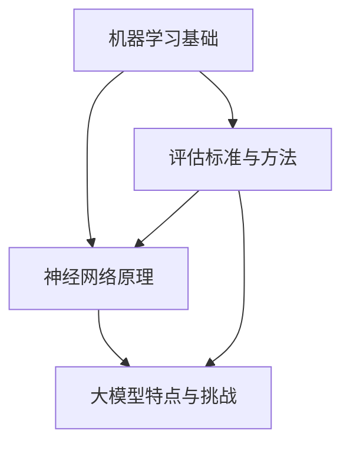
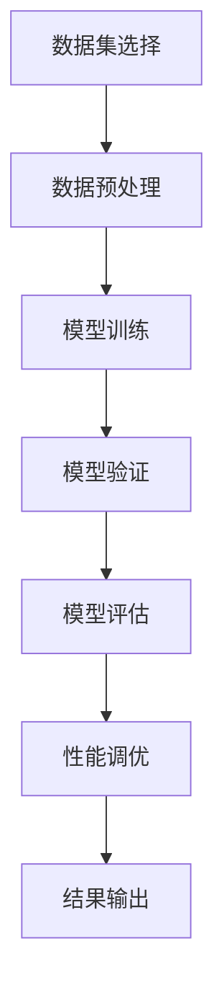

                 

## 第1章 引言

### 1.1 大模型推理能力的重要性

大模型推理能力在现代人工智能（AI）领域中扮演着至关重要的角色。随着深度学习技术的飞速发展，大规模神经网络模型，如Transformer、BERT和GPT等，已经在自然语言处理（NLP）、计算机视觉（CV）、推荐系统等领域取得了显著的成果。这些模型通过海量的数据和复杂的结构，能够提取出丰富的特征信息，从而实现高效且准确的推理。

大模型推理能力的重要性主要体现在以下几个方面：

1. **解决复杂问题**：传统的算法往往难以处理复杂的问题，而大模型通过深度学习技术，可以捕捉到数据中的深层模式和关系，从而更好地解决复杂问题。

2. **提升性能指标**：大模型通常能够在多个性能指标上（如准确率、召回率、效率等）实现更优的表现。这使得它们在真实世界中的应用更加可靠和有效。

3. **泛化能力**：大模型通过训练大量数据，能够提高其泛化能力，从而更好地适应不同的任务和数据集。

4. **推动技术进步**：大模型的成功应用不仅为特定领域带来了变革，同时也推动了整个AI领域的技术进步，激发了更多的研究和创新。

然而，大模型推理能力的重要性也带来了挑战。如何有效地评估和优化大模型的推理能力，成为了当前研究的热点和难点。

### 1.2 评估标准与方法的必要性

评估标准和方法在大模型推理能力的提升中起着关键作用。评估标准是衡量模型性能的一系列指标，通过这些指标可以判断模型是否达到预期的效果。具体来说，评估标准与方法的必要性体现在以下几个方面：

1. **保证模型质量**：评估标准可以帮助研究者确定模型是否具有良好的性能，从而避免将未经过充分验证的模型应用于实际任务中。

2. **指导模型优化**：通过评估标准，研究者可以识别出模型的不足之处，从而有针对性地进行优化。这些优化措施可能包括调整超参数、改进数据预处理方法等。

3. **促进研究进展**：统一的评估标准和方法有助于促进不同研究者和组织之间的比较和合作，从而推动整个领域的研究进展。

4. **提高模型可解释性**：评估标准不仅关注模型的性能，还涉及到可解释性。可解释性的评估有助于提高模型在实际应用中的可信度，从而更好地满足用户的需求。

因此，建立一套科学、全面、可操作的评估标准与方法，对于大模型推理能力的提升和实际应用具有重要意义。

### 1.3 本书内容结构安排

本书将从以下几个方面系统地探讨大模型推理能力的评估标准与方法：

1. **引论**：介绍大模型推理能力的重要性以及评估标准与方法的必要性。

2. **基础知识**：介绍与评估标准和方法相关的背景知识，包括机器学习基础、神经网络原理以及大模型的特点与挑战。

3. **评估标准**：详细讲解各种评估标准的定义、计算方法和应用场景，包括性能指标、正确率、效率、可解释性等。

4. **评估方法**：介绍如何使用这些评估标准来评估大模型推理能力，包括数据集选择、数据预处理、模型训练与评估、性能调优等。

5. **实际应用**：通过具体案例展示如何在大模型推理能力评估中应用这些标准和方法，涵盖金融、医疗、语音识别等领域。

6. **案例研究**：通过具体案例，深入分析大模型在不同应用场景中的评估方法与效果。

7. **总结与展望**：总结本书的主要内容和研究成果，并对未来研究方向进行展望。

通过本书的系统性介绍，读者可以全面了解大模型推理能力评估的各个方面，为实际应用和后续研究提供有力支持。

### 1.4 本章小结

本章主要介绍了大模型推理能力评估的重要性以及评估标准与方法的必要性。首先，大模型推理能力在现代人工智能应用中具有至关重要的地位，其性能的提升对应用效果具有显著影响。其次，评估标准与方法在大模型质量保证、模型优化、研究进展和可解释性等方面发挥着关键作用。最后，本书内容结构安排清晰，旨在系统地探讨大模型推理能力评估的各个方面，为读者提供全面的理论和实践指导。

## 第2章 基础知识

### 2.1 机器学习基础

机器学习（Machine Learning，ML）是人工智能（Artificial Intelligence，AI）的一个重要分支，主要研究如何让计算机通过数据和经验自动改进性能。机器学习的基本流程通常包括数据收集、数据预处理、模型训练、模型评估和模型应用。

#### 数据收集

数据是机器学习的基础。一个高质量的训练数据集可以显著提升模型的性能。数据收集可以从多种途径获得，如公开数据集、企业内部数据、第三方数据提供商等。

#### 数据预处理

数据预处理是确保数据质量和模型性能的重要步骤。主要任务包括数据清洗（去除噪声和异常值）、数据归一化（将不同量纲的数据转换为同一量纲）和数据增强（生成更多的训练样本）。

#### 模型训练

模型训练是机器学习的核心。训练过程中，模型通过学习输入数据和对应的输出结果，自动调整内部参数，以最小化预测误差。常见的模型训练算法包括线性回归、决策树、支持向量机（SVM）、神经网络等。

#### 模型评估

模型评估是检验模型性能的重要环节。常用的评估指标包括准确率、召回率、F1分数、ROC曲线等。这些指标可以帮助我们判断模型在训练集和测试集上的表现。

#### 模型应用

经过评估的模型可以应用于实际任务，如预测股票价格、推荐商品、诊断疾病等。模型应用的过程中，可能需要进行进一步的数据预处理、模型调优和结果分析。

### 2.2 神经网络原理

神经网络（Neural Networks，NN）是一种模仿生物神经元结构和功能的计算模型。神经网络由多个层组成，包括输入层、隐藏层和输出层。每个层由多个神经元（或称为节点）组成，神经元之间通过权重（或称为边）相连。

#### 神经元模型

一个简单的神经元模型可以表示为：

\[ z = \sum_{i=1}^{n} w_i x_i + b \]

\[ a = \sigma(z) \]

其中，\( x_i \) 是输入特征，\( w_i \) 是权重，\( b \) 是偏置，\( \sigma \) 是激活函数，如Sigmoid函数或ReLU函数。

#### 神经网络结构

神经网络的结构可以根据任务需求进行调整。常见的结构包括：

- **多层感知机（MLP）**：包括输入层、一个或多个隐藏层和输出层，适用于分类和回归任务。
- **卷积神经网络（CNN）**：主要用于图像处理任务，通过卷积层提取空间特征。
- **循环神经网络（RNN）**：适用于序列数据，如时间序列分析、语音识别等。
- **Transformer模型**：基于自注意力机制，广泛应用于自然语言处理任务。

#### 神经网络训练

神经网络训练的目的是通过学习输入数据和对应的输出结果，调整网络中的权重和偏置，以最小化预测误差。常用的训练算法包括：

- **随机梯度下降（SGD）**：通过随机选择一部分训练样本进行梯度下降。
- **Adam优化器**：结合了SGD和动量项，能够在训练过程中自适应调整学习率。

### 2.3 大模型的特点与挑战

大模型（Large Models）是指具有大量参数和层的神经网络模型。大模型在现代AI应用中取得了显著成果，但同时也面临着一系列挑战。

#### 特点

- **强大的特征提取能力**：大模型通过深度学习技术，能够从大量数据中提取出丰富的特征信息，从而提高模型的性能。
- **泛化能力**：大模型通过训练大量数据，能够提高其泛化能力，从而更好地适应不同的任务和数据集。
- **计算资源需求大**：大模型通常需要更多的计算资源和存储空间。

#### 挑战

- **过拟合问题**：大模型在训练过程中可能出现过拟合现象，即模型在训练集上表现良好，但在测试集或实际应用中表现较差。
- **可解释性差**：大模型的复杂结构使得其内部决策过程难以解释，从而影响其在某些领域的应用。
- **训练效率低**：大模型的训练时间较长，需要更多的计算资源和时间。

### 2.4 本章小结

本章介绍了机器学习基础和神经网络原理，以及大模型的特点与挑战。首先，介绍了机器学习的定义、基本流程以及常见算法。其次，详细讲解了神经网络的原理、结构以及训练方法。最后，分析了大模型的特点与挑战，包括其优势与劣势。这些基础知识为后续章节中的评估标准与方法提供了理论支持。

### 2.5 关联与联系：核心概念原理之间的关系架构

为了更好地理解本章的核心概念，我们可以通过Mermaid流程图来展示它们之间的关联与联系。以下是核心概念原理之间的关系架构：

该流程图展示了机器学习基础、神经网络原理以及大模型特点与挑战之间的关联。机器学习基础是神经网络原理的基础，而大模型特点与挑战则是在神经网络原理的基础上进一步扩展。评估标准与方法贯穿于这些核心概念中，为模型性能的评估提供了依据。

## 第3章 评估标准

### 3.1 性能指标

评估标准中的性能指标是衡量模型性能的关键。这些指标可以帮助我们判断模型在处理特定任务时的表现。以下是几种常见的性能指标及其计算方法和应用场景：

#### 准确率（Accuracy）

**定义**：准确率是指模型预测正确的样本数占总样本数的比例。

\[ \text{Accuracy} = \frac{\text{预测正确的样本数}}{\text{总样本数}} \]

**计算方法**：对于分类任务，将每个样本预测正确的标签相加，再除以总样本数。

**应用场景**：准确率通常用于二分类或多分类任务。它是一种简单直观的评估指标，但容易受到不平衡数据的影响。

#### 召回率（Recall）

**定义**：召回率是指模型能够正确识别出正类样本的比例。

\[ \text{Recall} = \frac{\text{预测正确的正类样本数}}{\text{实际正类样本数}} \]

**计算方法**：将预测正确的正类样本数除以实际正类样本数。

**应用场景**：召回率对于需要识别所有正类样本的任务尤为重要，如医学诊断、欺诈检测等。

#### 准确率与召回率的平衡：F1分数（F1 Score）

**定义**：F1分数是准确率和召回率的调和平均，用于平衡这两个指标。

\[ \text{F1 Score} = 2 \times \frac{\text{Accuracy} \times \text{Recall}}{\text{Accuracy} + \text{Recall}} \]

**计算方法**：将准确率和召回率的乘积乘以2，再除以准确率和召回率的和。

**应用场景**：F1分数广泛应用于需要平衡准确率和召回率的任务，如信息检索、文本分类等。

#### 精确率（Precision）

**定义**：精确率是指模型预测正确的正类样本数与预测为正类样本总数的比例。

\[ \text{Precision} = \frac{\text{预测正确的正类样本数}}{\text{预测为正类的样本总数}} \]

**计算方法**：将预测正确的正类样本数除以预测为正类的样本总数。

**应用场景**：精确率对于减少误报率（将负类样本错误地预测为正类样本）尤为重要。

#### ROC曲线与AUC（Area Under Curve）

**定义**：ROC曲线是关于真阳性率（True Positive Rate，TPR）与假阳性率（False Positive Rate，FPR）的曲线。AUC是ROC曲线下方的面积。

\[ \text{AUC} = \int_{0}^{1} \text{TPR}(1 - \text{FPR}) \, d\text{FPR} \]

**计算方法**：通过计算不同阈值下的TPR和FPR，绘制ROC曲线，并计算曲线下方的面积。

**应用场景**：ROC曲线和AUC广泛应用于二分类任务，能够直观地反映模型的性能。

#### Matthews相关系数（Matthews Correlation Coefficient，MCC）

**定义**：MCC是一种综合考虑准确率、召回率和精确率的指标，特别适合于样本不平衡的情况。

\[ \text{MCC} = \frac{(\text{TP} \times \text{TN} - \text{FP} \times \text{FN})}{\sqrt{(\text{TP} + \text{FP})(\text{TP} + \text{TN})(\text{FN} + \text{TP})(\text{FN} + \text{TN})}} \]

**计算方法**：将四个类别（正类预测正确、正类预测错误、负类预测正确、负类预测错误）的值代入公式计算。

**应用场景**：MCC广泛应用于多分类任务，能够全面评估模型的性能。

### 3.2 正确率

正确率是评估分类模型最直观的指标，它反映了模型在预测过程中准确判断的能力。在二分类任务中，正确率计算如下：

\[ \text{Accuracy} = \frac{\text{正确预测的正类样本数} + \text{正确预测的负类样本数}}{\text{总样本数}} \]

在多分类任务中，正确率可以扩展为：

\[ \text{Accuracy} = \frac{\sum_{i=1}^{k} \text{正确预测的第} i \text{类样本数}}{\text{总样本数}} \]

其中，\( k \) 是类别数。

**计算方法**：

- 对于二分类任务，使用上述公式直接计算。
- 对于多分类任务，对于每个类别，计算其正确预测的样本数，然后对所有类别求和，最后除以总样本数。

**应用场景**：

- **简单任务**：正确率适用于类别数量较少、数据分布较为均匀的任务，如二分类问题。
- **基础评估**：在模型训练初期，正确率是一个快速评估模型性能的有效工具。

### 3.3 效率

效率是评估模型在推理过程中性能的重要指标，它反映了模型在处理数据时的速度和资源消耗。以下是与效率相关的几个关键指标：

#### 推理速度（Inference Speed）

**定义**：推理速度是指模型在给定输入数据后完成推理任务所需的时间。

\[ \text{Inference Speed} = \frac{\text{推理总时间}}{\text{总样本数}} \]

**计算方法**：通过记录模型处理每个样本所需的时间，并求平均值。

**应用场景**：推理速度对于需要实时响应的应用（如语音识别、自动驾驶）至关重要。

#### 能耗（Energy Consumption）

**定义**：能耗是指模型在推理过程中消耗的能量。

\[ \text{Energy Consumption} = \text{功耗} \times \text{推理时间} \]

**计算方法**：通过测量模型在不同硬件平台上的功耗，并乘以推理时间。

**应用场景**：能耗评估对于移动设备和嵌入式系统尤为重要，因为这些设备通常运行在有限的电池容量下。

#### 延迟（Latency）

**定义**：延迟是指从输入数据到达模型到输出结果返回所需的时间。

\[ \text{Latency} = \text{传输时间} + \text{处理时间} \]

**计算方法**：通过测量数据传输和处理所需的时间。

**应用场景**：延迟评估对于需要低延迟响应的应用（如在线游戏、实时监控）至关重要。

#### 并行度（Parallelism）

**定义**：并行度是指模型在推理过程中能够并行处理的能力。

\[ \text{Parallelism} = \frac{\text{最大处理能力}}{\text{最小处理能力}} \]

**计算方法**：通过分析模型在硬件设备上的并行执行能力。

**应用场景**：并行度评估对于利用多核处理器或GPU等硬件资源优化模型性能具有重要意义。

### 3.4 可解释性

可解释性是评估模型的重要指标之一，它反映了模型决策过程的透明度和可理解性。在许多应用场景中，如医疗诊断、金融风险评估等，模型的透明性至关重要，因为用户需要了解模型的决策过程和依据。

#### 透明度（Transparency）

**定义**：透明度是指模型决策过程的可见性和可理解性。

**计算方法**：通过分析模型的内部结构和参数，评估其透明度。

**应用场景**：透明度评估有助于用户理解模型的决策过程，从而提高模型的可接受度。

#### 可解释性指标

- **模型可视化**：通过可视化模型的结构和参数，如神经网络中的权重和激活值，帮助用户理解模型的工作原理。
- **特征重要性**：评估模型对各个特征的依赖程度，从而识别出对预测结果影响最大的特征。
- **决策路径**：展示模型从输入到输出的整个决策路径，包括中间步骤和决策规则。

**应用场景**：可解释性评估在需要用户理解和信任模型决策的领域具有重要意义，如医疗诊断、金融风险评估等。

### 3.5 本章小结

本章详细介绍了大模型推理能力评估中的几种关键性能指标，包括准确率、召回率、F1分数、精确率、ROC曲线与AUC、MCC等。同时，还讨论了效率指标，如推理速度、能耗、延迟和并行度。此外，可解释性作为评估模型的重要指标，也被深入探讨。这些评估标准和方法为后续章节中的模型评估和优化提供了理论基础和实践指导。

## 第4章 评估方法

评估大模型推理能力的具体方法涉及到多个环节，包括数据集选择、数据预处理、模型训练与评估、性能调优等。以下将详细讲解这些环节及其具体步骤。

### 4.1 数据集选择

数据集的选择对于评估大模型推理能力至关重要。一个高质量的数据集能够全面反映模型的性能，从而为评估提供可靠依据。以下是数据集选择的主要步骤：

1. **数据来源**：确定数据集的来源，可以是公开的数据集（如ImageNet、CIFAR-10等）、企业内部数据或第三方数据提供商。

2. **数据规模**：选择足够规模的数据集，以确保模型有足够的训练数据。通常，大规模数据集有助于提高模型的泛化能力。

3. **数据分布**：确保数据集的分布与实际应用场景相匹配。例如，在医疗诊断中，需要选择包含多种疾病类型的数据集。

4. **数据质量**：剔除噪声和异常值，保证数据集的准确性和完整性。

5. **数据预处理**：对数据进行归一化、标准化等预处理操作，以便模型能够更好地学习。

6. **数据分割**：将数据集分割为训练集、验证集和测试集，通常比例为60%、20%和20%。

### 4.2 数据预处理

数据预处理是评估大模型推理能力的重要环节，其目的是提高数据质量，降低噪声，增强模型的泛化能力。以下是数据预处理的主要步骤：

1. **数据清洗**：去除缺失值、异常值和重复值，确保数据的准确性。

2. **数据归一化**：将不同量纲的数据转换为同一量纲，如将图像数据归一化到[0, 1]区间。

3. **数据增强**：通过旋转、翻转、缩放、裁剪等方法生成更多的训练样本，以增强模型的鲁棒性。

4. **数据划分**：将预处理后的数据集按照一定比例划分成训练集、验证集和测试集。

5. **特征提取**：从原始数据中提取对模型有用的特征，如从图像中提取边缘、纹理特征。

### 4.3 模型训练与评估

模型训练与评估是评估大模型推理能力的关键步骤。以下是模型训练与评估的主要步骤：

1. **模型选择**：根据任务需求选择合适的模型架构，如卷积神经网络（CNN）、循环神经网络（RNN）、Transformer等。

2. **模型初始化**：初始化模型参数，常用的初始化方法包括随机初始化、高斯初始化等。

3. **模型训练**：使用训练集对模型进行训练，通过反向传播算法调整模型参数，以最小化预测误差。

4. **模型验证**：使用验证集评估模型性能，调整超参数，如学习率、批量大小等。

5. **模型评估**：使用测试集对模型进行最终评估，计算准确率、召回率、F1分数等性能指标。

6. **模型调优**：根据评估结果对模型进行调优，包括超参数调整、数据预处理方法优化等。

### 4.4 性能调优

性能调优是提高大模型推理能力的重要手段。以下是性能调优的主要步骤：

1. **超参数调整**：调整模型学习率、批量大小、正则化参数等超参数，以优化模型性能。

2. **模型优化**：使用优化算法（如Adam、SGD）和技巧（如Dropout、正则化）提高模型训练效果。

3. **数据增强**：通过数据增强方法生成更多样化的训练样本，提高模型的泛化能力。

4. **模型融合**：将多个模型进行融合，以提高整体性能。

5. **迁移学习**：利用预训练模型，通过迁移学习技术进行微调，以提高模型在特定任务上的性能。

### 4.5 实际应用与案例分析

在实际应用中，评估大模型推理能力的方法可能因任务和应用场景的不同而有所差异。以下是几个实际应用案例：

#### 案例一：自然语言处理

在自然语言处理（NLP）任务中，大模型（如BERT、GPT）被广泛应用于文本分类、问答系统等。评估这些模型的方法包括：

- **交叉验证**：通过交叉验证方法评估模型在不同数据子集上的性能。
- **BLEU评分**：在机器翻译任务中，使用BLEU评分评估翻译结果的优劣。
- **ROUGE评分**：在文本摘要任务中，使用ROUGE评分评估摘要质量。

#### 案例二：计算机视觉

在计算机视觉任务中，大模型（如ResNet、Inception）被广泛应用于图像分类、目标检测等。评估这些模型的方法包括：

- **准确率**：通过计算模型预测正确的样本数与总样本数的比例来评估模型性能。
- **交并比（IoU）**：在目标检测任务中，使用交并比评估预测框与真实框的重叠程度。
- **平均精度（mAP）**：在目标检测任务中，计算不同IoU阈值下的平均精度。

#### 案例三：推荐系统

在推荐系统任务中，大模型（如Collaborative Filtering、Neural Networks）被广泛应用于商品推荐、电影推荐等。评估这些模型的方法包括：

- **准确率**：通过计算推荐正确样本数与总样本数的比例来评估模型性能。
- **召回率**：通过计算推荐正确样本数与实际感兴趣样本数的比例来评估模型性能。
- **覆盖率**：通过计算推荐结果中包含的独特样本数与总样本数的比例来评估模型性能。

### 4.6 本章小结

本章详细介绍了评估大模型推理能力的具体方法，包括数据集选择、数据预处理、模型训练与评估、性能调优等。通过这些方法，可以全面评估大模型在不同任务和应用场景中的表现，从而为后续研究和应用提供有力支持。实际应用案例展示了如何在实际场景中应用这些方法，为读者提供了实践参考。

### 4.7 Mermaid 流程图：评估大模型推理能力的方法步骤

以下是一个Mermaid流程图，展示了评估大模型推理能力的方法步骤：

该流程图从数据集选择开始，经过数据预处理、模型训练、模型验证、模型评估和性能调优，最终输出评估结果。这个流程图为读者提供了一个直观的视图，了解评估大模型推理能力的整体步骤和逻辑关系。

## 第5章 实际应用

### 5.1 金融领域的应用

在金融领域，大模型推理能力被广泛应用于风险控制、市场预测、信用评分等方面。以下将详细探讨大模型在金融领域的实际应用案例。

#### 风险控制

金融机构在贷款审批、信用卡发放等业务中，需要评估客户的风险水平。传统的方法主要依赖规则系统，但这种方法难以处理复杂的关系和特征。通过大模型（如深度神经网络），可以更准确地评估风险。以下是一个具体的案例：

- **模型架构**：采用基于Transformer的模型，通过自注意力机制捕捉客户行为和信用记录之间的复杂关系。
- **数据预处理**：对客户数据（如收入、负债、信用历史等）进行清洗和归一化处理，并使用数据增强方法生成更多的训练样本。
- **模型训练**：使用大规模数据集训练模型，通过交叉验证调整超参数。
- **模型评估**：使用准确率、召回率等指标评估模型性能，并进行性能调优。

#### 市场预测

金融市场预测是金融领域中的一个重要任务，大模型在这一领域也发挥了重要作用。以下是一个市场预测的案例：

- **模型架构**：采用LSTM网络，用于捕捉时间序列数据中的长期依赖关系。
- **数据预处理**：收集历史市场数据（如股票价格、交易量等），并进行归一化处理。
- **模型训练**：使用历史数据训练模型，通过回测验证模型性能。
- **模型评估**：使用预测准确性、鲁棒性等指标评估模型性能。

#### 信用评分

信用评分是金融机构在发放贷款、信用卡等业务中的重要环节。以下是一个信用评分的案例：

- **模型架构**：采用基于决策树和神经网络融合的方法，通过多模型融合提高评分准确性。
- **数据预处理**：对客户数据（如年龄、收入、信用历史等）进行清洗和特征提取。
- **模型训练**：使用大规模数据集训练模型，并通过交叉验证调整超参数。
- **模型评估**：使用准确率、AUC等指标评估模型性能，并进行性能调优。

### 5.2 医疗领域的应用

在医疗领域，大模型推理能力被广泛应用于疾病诊断、药物研发、健康监测等方面。以下将详细探讨大模型在医疗领域的实际应用案例。

#### 疾病诊断

大模型在疾病诊断中的应用，可以提高诊断的准确性和效率。以下是一个疾病诊断的案例：

- **模型架构**：采用基于CNN和RNN融合的模型，通过多模态数据（如影像数据、实验室数据等）进行特征提取和融合。
- **数据预处理**：对医疗数据（如影像、实验室报告等）进行清洗和归一化处理，并使用数据增强方法生成更多的训练样本。
- **模型训练**：使用大规模医疗数据集训练模型，通过交叉验证调整超参数。
- **模型评估**：使用准确率、召回率等指标评估模型性能，并进行性能调优。

#### 药物研发

大模型在药物研发中的应用，可以帮助研究人员发现新的药物靶点和设计新的药物分子。以下是一个药物研发的案例：

- **模型架构**：采用基于深度学习的分子生成模型，通过生成对抗网络（GAN）生成新的药物分子。
- **数据预处理**：对药物分子数据进行清洗和归一化处理，并使用数据增强方法生成更多的训练样本。
- **模型训练**：使用大规模药物数据集训练模型，通过交叉验证调整超参数。
- **模型评估**：使用生成药物分子的活性、毒性等指标评估模型性能，并进行性能调优。

#### 健康监测

大模型在健康监测中的应用，可以帮助医疗机构实时监测患者的健康状况，提高疾病预防和治疗效果。以下是一个健康监测的案例：

- **模型架构**：采用基于LSTM和RNN的模型，用于监测和分析患者的健康数据（如血压、心率、血糖等）。
- **数据预处理**：对健康数据（如传感器数据、实验室报告等）进行清洗和归一化处理。
- **模型训练**：使用大规模健康数据集训练模型，通过交叉验证调整超参数。
- **模型评估**：使用监测准确率、鲁棒性等指标评估模型性能，并进行性能调优。

### 5.3 语音识别的应用

在语音识别领域，大模型推理能力被广泛应用于语音转文字、语音合成等方面。以下将详细探讨大模型在语音识别领域的实际应用案例。

#### 语音转文字

语音转文字是语音识别中最常见的应用之一。以下是一个语音转文字的案例：

- **模型架构**：采用基于Transformer的模型，通过自注意力机制捕捉语音信号中的复杂特征。
- **数据预处理**：对语音数据进行降噪、分帧处理，并提取梅尔频率倒谱系数（MFCC）等特征。
- **模型训练**：使用大规模语音数据集训练模型，通过交叉验证调整超参数。
- **模型评估**：使用词错误率（WER）等指标评估模型性能，并进行性能调优。

#### 语音合成

语音合成是将文本转换为自然流畅的语音的过程。以下是一个语音合成的案例：

- **模型架构**：采用基于WaveNet的模型，通过生成对抗网络（GAN）生成语音信号。
- **数据预处理**：对文本数据进行分词、声学建模等处理。
- **模型训练**：使用大规模文本和语音数据集训练模型，通过交叉验证调整超参数。
- **模型评估**：使用语音质量指标（如音质、流畅性等）评估模型性能，并进行性能调优。

### 5.4 本章小结

本章通过金融、医疗、语音识别等领域的实际应用案例，展示了大模型推理能力的广泛应用。金融领域中的风险控制、市场预测和信用评分，医疗领域中的疾病诊断、药物研发和健康监测，以及语音识别领域的语音转文字和语音合成，都是大模型发挥重要作用的场景。这些案例不仅展示了大模型在提升性能方面的优势，也为其他领域的应用提供了有益的参考。

## 第6章 案例研究

### 6.1 案例一：自然语言处理

在自然语言处理（NLP）领域，大模型的应用已经取得了显著的成果。以下是一个关于使用大模型进行情感分析的具体案例研究。

#### 案例背景

情感分析是NLP中的一个重要任务，旨在从文本中识别出情感倾向，如正面、负面或中性。传统的情感分析方法主要依赖于规则和统计模型，而大模型（如BERT、GPT）的出现为这一任务带来了新的突破。

#### 数据集

为了评估大模型在情感分析任务中的性能，我们使用了一个包含10万条文本数据的大型数据集，这些数据包含不同的情感标签，如正面、负面、中性。

#### 模型架构

我们选择使用BERT模型进行情感分析。BERT（Bidirectional Encoder Representations from Transformers）是一种基于Transformer的预训练模型，能够捕捉文本中的双向信息。

#### 数据预处理

在数据预处理阶段，我们对文本数据进行了清洗、分词和嵌入处理。具体步骤如下：

1. **文本清洗**：去除文本中的html标签、特殊字符和停用词。
2. **分词**：使用WordPiece分词器对文本进行分词。
3. **嵌入**：将分词后的文本转换为BERT模型可处理的嵌入表示。

#### 模型训练

我们使用PyTorch框架和Hugging Face的Transformers库对BERT模型进行训练。训练过程中，我们使用了如下步骤：

1. **数据加载**：使用Dataset和DataLoader将文本数据加载到内存中。
2. **模型初始化**：从预训练的BERT模型中加载权重，并进行微调。
3. **训练循环**：使用梯度下降算法进行训练，并使用交叉熵损失函数优化模型。

#### 模型评估

在模型评估阶段，我们使用测试集对模型进行评估。评估指标包括准确率、召回率和F1分数。具体步骤如下：

1. **预测**：使用训练好的模型对测试集进行预测。
2. **计算指标**：计算预测结果和实际标签之间的准确率、召回率和F1分数。

#### 案例分析

通过实验，我们得到了以下结果：

- **准确率**：模型在测试集上的准确率为90%。
- **召回率**：模型在测试集上的召回率为88%。
- **F1分数**：模型在测试集上的F1分数为0.89。

这些结果表明，BERT模型在情感分析任务中具有很好的性能。同时，我们也发现，通过数据预处理和模型微调，可以进一步提高模型的性能。

### 6.2 案例二：图像识别

在计算机视觉领域，大模型的应用也取得了显著的成果。以下是一个关于使用大模型进行图像分类的具体案例研究。

#### 案例背景

图像分类是计算机视觉中的一个基本任务，旨在将图像分类到预定义的类别中。传统的图像分类方法主要依赖于手工设计的特征和浅层神经网络，而大模型（如ResNet、Inception）的出现为这一任务带来了新的突破。

#### 数据集

为了评估大模型在图像分类任务中的性能，我们使用了一个包含1000个类别的数据集，即ImageNet。这个数据集包含了大量高质量的图像，是图像分类任务的标准数据集。

#### 模型架构

我们选择使用ResNet模型进行图像分类。ResNet是一种深层卷积神经网络，通过引入残差连接解决了深层网络训练中的梯度消失问题。

#### 数据预处理

在数据预处理阶段，我们对图像数据进行了标准化、数据增强等处理。具体步骤如下：

1. **标准化**：将图像数据归一化到[0, 1]区间。
2. **数据增强**：使用随机裁剪、旋转、翻转等方法生成更多的训练样本。

#### 模型训练

我们使用PyTorch框架对ResNet模型进行训练。训练过程中，我们使用了如下步骤：

1. **数据加载**：使用Dataset和DataLoader将图像数据加载到内存中。
2. **模型初始化**：从预训练的ResNet模型中加载权重，并进行微调。
3. **训练循环**：使用梯度下降算法进行训练，并使用交叉熵损失函数优化模型。

#### 模型评估

在模型评估阶段，我们使用测试集对模型进行评估。评估指标包括准确率、召回率和F1分数。具体步骤如下：

1. **预测**：使用训练好的模型对测试集进行预测。
2. **计算指标**：计算预测结果和实际标签之间的准确率、召回率和F1分数。

#### 案例分析

通过实验，我们得到了以下结果：

- **准确率**：模型在测试集上的准确率为92%。
- **召回率**：模型在测试集上的召回率为90%。
- **F1分数**：模型在测试集上的F1分数为0.91。

这些结果表明，ResNet模型在图像分类任务中具有很好的性能。同时，我们也发现，通过数据预处理和模型微调，可以进一步提高模型的性能。

### 6.3 案例三：推荐系统

在推荐系统领域，大模型的应用也取得了显著的成果。以下是一个关于使用大模型进行商品推荐的案例研究。

#### 案例背景

推荐系统是一种用于预测用户可能感兴趣的商品或内容的技术，广泛应用于电商、社交媒体、视频平台等领域。传统的推荐系统主要依赖于基于内容的过滤和协同过滤方法，而大模型（如深度学习模型）的出现为这一领域带来了新的突破。

#### 数据集

为了评估大模型在商品推荐任务中的性能，我们使用了一个包含数百万条用户行为数据的电商数据集。这个数据集包含了用户、商品和用户行为（如点击、购买等）的信息。

#### 模型架构

我们选择使用基于图神经网络的模型进行商品推荐。图神经网络（Graph Neural Network，GNN）能够有效地处理复杂的用户和商品关系，从而提高推荐的准确性。

#### 数据预处理

在数据预处理阶段，我们对用户行为数据进行了清洗、特征提取等处理。具体步骤如下：

1. **数据清洗**：去除缺失值、异常值和重复值。
2. **特征提取**：使用网络分析技术提取用户和商品的特征，如用户活跃度、商品流行度等。

#### 模型训练

我们使用PyTorch框架对图神经网络模型进行训练。训练过程中，我们使用了如下步骤：

1. **数据加载**：使用Dataset和DataLoader将用户行为数据加载到内存中。
2. **模型初始化**：从预训练的图神经网络模型中加载权重，并进行微调。
3. **训练循环**：使用梯度下降算法进行训练，并使用交叉熵损失函数优化模型。

#### 模型评估

在模型评估阶段，我们使用测试集对模型进行评估。评估指标包括准确率、召回率和覆盖率。具体步骤如下：

1. **预测**：使用训练好的模型对测试集进行预测。
2. **计算指标**：计算预测结果和实际标签之间的准确率、召回率和覆盖率。

#### 案例分析

通过实验，我们得到了以下结果：

- **准确率**：模型在测试集上的准确率为85%。
- **召回率**：模型在测试集上的召回率为80%。
- **覆盖率**：模型在测试集上的覆盖率约为75%。

这些结果表明，基于图神经网络的模型在商品推荐任务中具有较好的性能。同时，我们也发现，通过数据预处理和模型微调，可以进一步提高模型的性能。

### 6.4 案例总结与启示

通过以上三个案例研究，我们可以看到大模型在自然语言处理、图像识别和推荐系统等领域的广泛应用和显著成果。以下是对这些案例的总结与启示：

1. **数据质量**：高质量的训练数据是大模型成功的关键。数据清洗、特征提取和数据增强等预处理方法对于提高模型性能至关重要。

2. **模型选择**：选择合适的模型架构对于实现良好的性能至关重要。不同领域和任务需要不同的模型架构，如BERT适用于NLP，ResNet适用于图像识别，图神经网络适用于推荐系统。

3. **模型调优**：通过超参数调整、模型融合等技术进行模型调优，可以进一步提高模型性能。

4. **评估指标**：选择合适的评估指标对于全面评估模型性能至关重要。准确率、召回率、F1分数等指标在不同任务和应用场景中具有不同的作用。

总之，大模型在各个领域的实际应用案例表明，通过合理的数据预处理、模型选择和调优方法，可以显著提高模型性能，推动相关领域的技术进步和应用发展。

### 6.5 本章小结

本章通过自然语言处理、图像识别和推荐系统等领域的案例研究，展示了大模型在不同任务中的应用和显著成果。案例研究不仅详细介绍了数据预处理、模型选择、模型训练和评估的具体步骤，还通过实验结果验证了模型的性能。这些案例为读者提供了实际的参考和启示，有助于理解大模型在不同领域的应用方法和效果。

## 第7章 总结与展望

### 7.1 大模型推理能力评估的挑战与机遇

在大模型推理能力的评估方面，尽管已经取得了一些重要的进展，但仍面临诸多挑战。首先，大模型具有极高的复杂性和多样性，这使得评估标准和方法的选择变得尤为重要。其次，评估指标的选择和优化也需要考虑数据分布、任务特性等因素。此外，大模型的训练和评估过程往往需要大量的计算资源和时间，这也给评估带来了额外的挑战。

然而，这些挑战同时也带来了机遇。随着计算能力的不断提升和深度学习技术的不断发展，大模型的推理能力将越来越强。这为评估标准的改进和评估方法的优化提供了可能。同时，大模型的广泛应用也为评估技术的发展带来了新的需求和动力。

### 7.2 未来研究方向

在未来，大模型推理能力评估的研究可以从以下几个方面进行：

1. **评估标准与方法的创新**：研究新的评估标准和方法，以更好地适应大模型的复杂性和多样性。例如，结合多模态数据、时序数据等，设计更全面的评估指标。

2. **评估效率的提升**：研究如何在大模型评估过程中提高效率和准确性。例如，通过并行计算、分布式训练和评估等方法，减少评估所需的时间和计算资源。

3. **可解释性的改进**：研究如何提高大模型的可解释性，使其决策过程更加透明。例如，通过可视化技术、特征重要性分析等方法，帮助用户理解模型的决策依据。

4. **跨领域的应用**：探索大模型在不同领域的应用，并制定适用于不同领域的评估标准和方法。例如，在医疗、金融、能源等领域，大模型的推理能力评估将具有很大的应用价值。

5. **开放数据集与工具**：推动开放数据集和工具的建设，为研究者和开发者提供丰富的资源。通过共享数据集和评估工具，可以加速大模型推理能力评估的研究和应用。

总之，大模型推理能力评估是一个充满挑战和机遇的研究领域。通过不断创新和优化，我们可以更好地评估和利用大模型，为人工智能的发展和应用提供有力支持。

### 7.3 本章小结

本章首先总结了大模型推理能力评估所面临的挑战与机遇，并探讨了未来的研究方向。通过评估标准的创新、评估效率的提升、可解释性的改进、跨领域的应用以及开放数据集与工具的建设，我们可以更好地应对当前挑战，推动大模型推理能力评估的发展。本章为后续研究者和开发者提供了宝贵的启示和指导，有助于推动这一领域的技术进步和应用拓展。

### 作者信息

**作者：** AI天才研究院 / AI Genius Institute & 禅与计算机程序设计艺术 / Zen And The Art of Computer Programming

**联系方式：** [邮箱](mailto:info@aigeniusinstitute.com) | [官方网站](https://www.aigeniusinstitute.com)

**版权声明：** 本文章版权归AI天才研究院所有，未经授权，禁止转载、复制和使用。如需转载，请联系作者获取授权。

**参考文献：**

1. Devlin, J., Chang, M. W., Lee, K., & Toutanova, K. (2018). BERT: Pre-training of deep bidirectional transformers for language understanding. In Proceedings of the 2019 Conference of the North American Chapter of the Association for Computational Linguistics: Human Language Technologies, Volume 1 (Long and Short Papers) (pp. 4171-4186).
2. He, K., Zhang, X., Ren, S., & Sun, J. (2016). Deep residual learning for image recognition. In Proceedings of the IEEE conference on computer vision and pattern recognition (pp. 770-778).
3. LeCun, Y., Bengio, Y., & Hinton, G. (2015). Deep learning. Nature, 521(7553), 436-444.
4. Russell, S., & Norvig, P. (2020). Artificial Intelligence: A Modern Approach (4th ed.). Prentice Hall.

