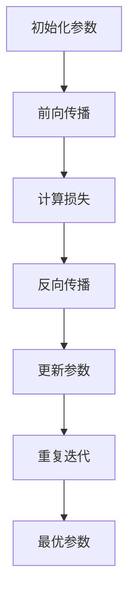
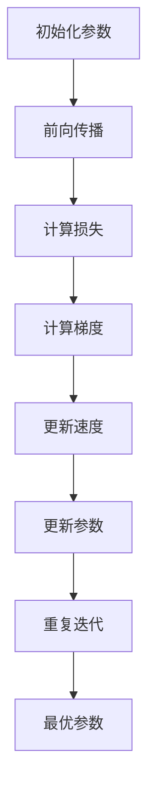
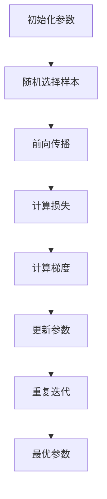
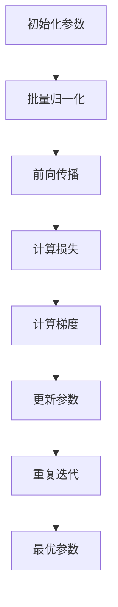
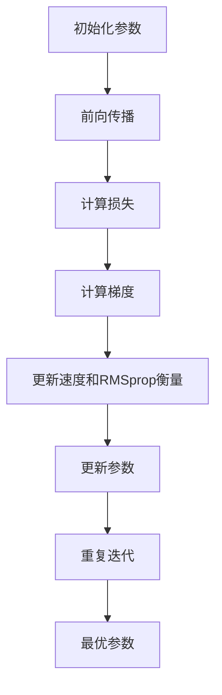
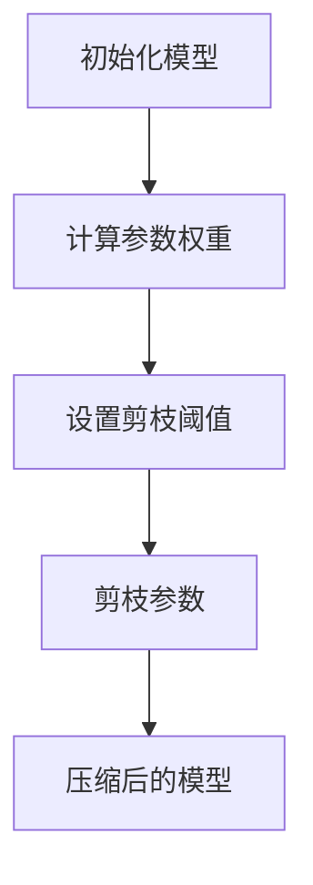
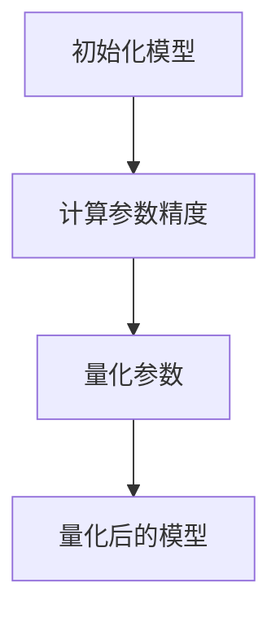
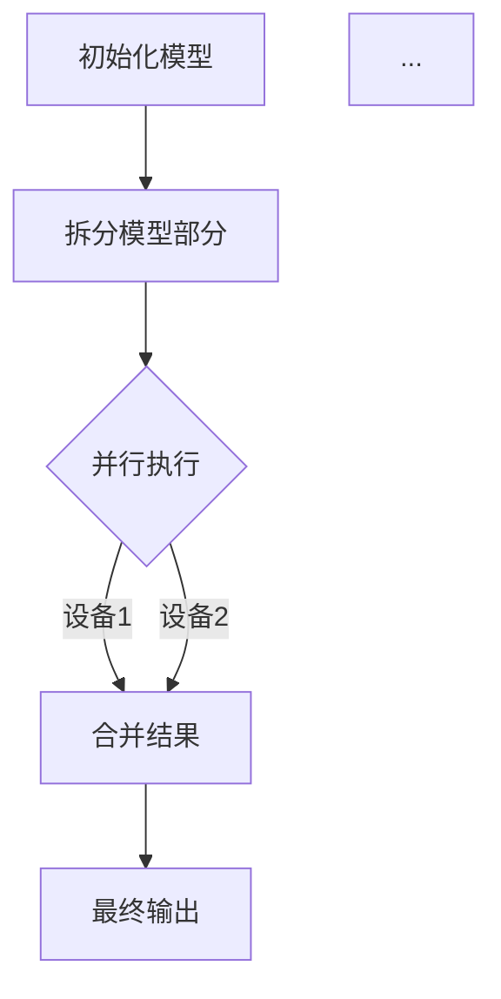
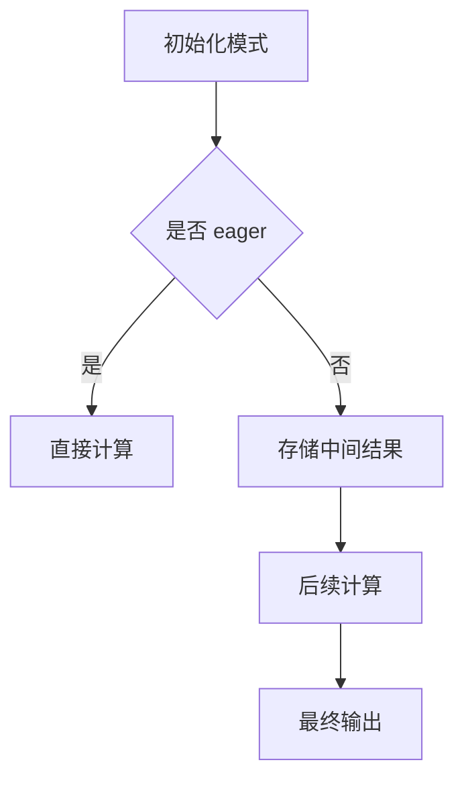

                 

### 引言与背景介绍

#### 大模型训练与推理的计算效率优化的重要性

在当前人工智能迅速发展的背景下，大型深度学习模型（简称大模型）已成为许多领域的核心技术。这些大模型在图像识别、自然语言处理、推荐系统等任务中展现了卓越的性能，但同时也带来了巨大的计算资源和时间消耗。因此，如何优化大模型训练与推理的计算效率，成为了一个备受关注的问题。

首先，从计算资源的角度来看，大模型训练与推理需要大量的计算资源和存储资源。这些资源不仅包括高性能的计算服务器和GPU，还涉及到大规模的数据存储和传输网络。资源不足会导致训练时间延长，甚至可能影响模型的训练效果。因此，计算效率优化显得尤为重要。

其次，从时间效率的角度来看，随着模型规模的不断扩大，训练和推理的时间也显著增加。对于实时应用场景，如语音识别、自动驾驶等，延迟时间的增加可能会导致用户体验下降，甚至影响系统的稳定性。因此，优化计算效率不仅是技术问题，也是商业和实际应用的需要。

最后，从应用场景的角度来看，大模型的广泛应用带来了新的挑战。例如，在医疗领域，大模型可以帮助医生进行精准诊断和个性化治疗，但这也需要高效的计算能力来支持。在工业制造领域，大模型可以用于优化生产流程和设备维护，同样需要高效的计算资源。因此，计算效率优化已经成为人工智能应用中不可或缺的一部分。

#### 本书目的与读者对象

本书旨在为读者提供全面的大模型训练与推理的计算效率优化方案。通过深入探讨大模型训练与推理的基本原理、核心算法、数学模型以及实际项目应用，帮助读者理解和掌握如何优化大模型计算效率。

本书的读者对象主要包括：

1. **人工智能研究人员和工程师**：这些读者希望了解大模型训练与推理的计算效率优化原理，并将其应用于实际项目中。
2. **计算机科学和人工智能专业学生**：这些读者希望通过本书掌握大模型计算效率优化相关知识，为今后的研究和职业发展打下基础。
3. **企业和机构的技术决策者**：这些读者希望了解大模型计算效率优化的技术趋势和实际应用，以便在业务决策中做出更明智的选择。

通过本书的学习，读者将能够：

1. **理解大模型训练与推理的基本原理**：掌握大模型的定义、训练和推理过程，以及相关的计算资源和时间消耗。
2. **掌握核心算法和数学模型**：了解大模型训练与推理中的核心算法原理，并能够运用数学模型进行优化。
3. **具备实际项目应用能力**：通过实际项目案例，了解如何在大模型训练与推理中应用计算效率优化技术。

#### 大模型训练与推理的基本概念

在深入了解大模型训练与推理的计算效率优化之前，首先需要明确一些基本概念。

##### 大模型的定义

大模型通常指的是具有数百万甚至数十亿参数的深度学习模型。这些模型通过多层神经网络结构，对大量数据进行训练，以实现复杂的数据处理任务。大模型的出现是人工智能领域的重要突破，使得许多以前难以解决的问题得以解决。

##### 训练过程

大模型训练是指通过大量样本数据，调整模型参数，使其在特定任务上达到最佳性能的过程。训练过程通常分为以下几个阶段：

1. **数据预处理**：包括数据清洗、归一化、数据增强等，以确保数据质量。
2. **模型初始化**：初始化模型参数，通常采用随机初始化或预训练模型。
3. **前向传播**：将输入数据通过模型计算，得到输出结果。
4. **损失计算**：计算模型输出与真实值的差距，得到损失函数值。
5. **反向传播**：通过计算梯度，更新模型参数，以减少损失函数值。
6. **迭代优化**：重复前向传播和反向传播过程，直至达到预定的训练目标。

##### 推理过程

大模型推理是指将输入数据通过训练好的模型进行预测或分类的过程。推理过程通常包括以下几个步骤：

1. **输入预处理**：对输入数据进行预处理，使其符合模型输入要求。
2. **前向传播**：将预处理后的输入数据通过模型计算，得到输出结果。
3. **结果解释**：对模型输出结果进行解释，如分类结果或预测概率。

##### 计算资源与时间消耗

大模型训练与推理需要大量的计算资源和时间。具体来说：

1. **计算资源**：包括CPU、GPU、TPU等计算设备，以及数据存储和网络传输设备。
2. **时间消耗**：包括训练时间和推理时间。训练时间取决于模型复杂度、数据规模和计算资源；推理时间取决于模型大小、输入数据量和计算设备性能。

了解大模型训练与推理的基本概念，有助于我们更好地理解后续章节中的计算效率优化方法和技术。在下一章中，我们将进一步探讨大模型训练与推理的基础理论，为计算效率优化提供理论支持。

## 基础理论

#### 大模型的定义与分类

大模型，通常指具有数百万至数十亿参数的深度学习模型。这类模型通过多层神经网络结构，能够对复杂的数据进行高精度处理。大模型的定义可以从参数规模和模型结构两个方面来理解。

首先，从参数规模来看，大模型的参数数量通常在数百万到数十亿之间。例如，著名的GPT-3模型包含1750亿个参数，而ImageNet上的ResNet-152模型则包含近6000万个参数。参数数量的增加使得模型具有更高的表示能力和更强的学习能力。

其次，从模型结构来看，大模型通常采用深度神经网络（Deep Neural Network，DNN）结构。深度神经网络通过堆叠多层神经元，形成一种层次化的信息处理机制。每一层神经元都对其上一层的特征进行提取和变换，从而形成一种自下而上的特征表示。深度神经网络的层数通常在数十层以上，这使得模型能够捕捉到数据中的深层结构和复杂关系。

根据参数规模和模型结构，大模型可以分为以下几种类型：

1. **小模型**：参数数量在数千到数百万之间，如常见的CNN模型。
2. **中等模型**：参数数量在数百万到数亿之间，如BERT、GPT等模型。
3. **大模型**：参数数量在数亿到数十亿之间，如GPT-3、ViT等模型。

#### 大模型训练的基本原理

大模型训练是指通过大量样本数据，调整模型参数，使其在特定任务上达到最佳性能的过程。训练过程通常包括以下几个关键步骤：

1. **数据预处理**：在训练之前，需要对数据集进行预处理，包括数据清洗、数据增强和归一化等操作。数据清洗旨在去除数据中的噪声和不合理数据；数据增强旨在通过增加数据的多样性来提高模型的泛化能力；归一化旨在将数据调整到同一量级，以减少不同特征之间的差异。

2. **模型初始化**：初始化模型参数是训练过程的起点。常见的初始化方法有随机初始化、预训练模型初始化等。随机初始化是通过随机生成初始参数来开始训练；预训练模型初始化是利用预训练模型（如BERT、GPT等）的参数作为初始化值，从而提高模型训练效率。

3. **前向传播**：在给定输入数据后，模型通过前向传播计算输出结果。前向传播过程中，模型将输入数据通过各个层级的神经元，最终得到输出结果。这一过程可以表示为：
   $$
   \text{输出} = \text{激活函数}(\text{线性变换}(\text{输入参数} + \text{偏置}))
   $$
   其中，激活函数如ReLU、Sigmoid、Tanh等，用于引入非线性特性；线性变换包括权重矩阵和偏置项，用于映射输入到输出。

4. **损失计算**：通过比较模型输出与真实标签的差距，计算损失函数值。常见的损失函数有均方误差（MSE）、交叉熵损失（Cross Entropy Loss）等。损失函数的目的是衡量模型的预测误差，并指导模型参数的调整。

5. **反向传播**：通过计算梯度，更新模型参数，以减少损失函数值。反向传播算法是一种高效计算梯度的方法，其基本思想是将损失函数关于模型参数的梯度从输出层反向传播到输入层，从而更新每个参数的值。反向传播过程可以表示为：
   $$
   \text{梯度} = \frac{\partial \text{损失函数}}{\partial \text{参数}}
   $$
   更新参数的过程可以表示为：
   $$
   \text{参数} \leftarrow \text{参数} - \text{学习率} \times \text{梯度}
   $$
   其中，学习率是参数更新步长，用于控制模型收敛速度。

6. **迭代优化**：重复前向传播和反向传播过程，直至达到预定的训练目标。每次迭代后，模型参数都会得到更新，从而使模型在训练数据上的性能逐渐提高。

#### 大模型推理的基本原理

大模型推理是指将训练好的模型应用于新的数据，进行预测或分类的过程。推理过程通常包括以下几个关键步骤：

1. **输入预处理**：对输入数据执行与训练阶段相同的数据预处理操作，包括数据清洗、数据增强和归一化等。这些操作确保输入数据符合模型的输入要求，从而保证推理结果的准确性。

2. **前向传播**：将预处理后的输入数据通过训练好的模型，进行前向传播计算，得到输出结果。这一过程与训练阶段的前向传播相同，其目的是将输入数据映射到预测结果。

3. **结果解释**：对模型输出结果进行解释，如分类结果或预测概率。对于分类任务，输出结果通常是每个类别的概率分布；对于回归任务，输出结果是预测的数值。

4. **阈值处理**：对于分类任务，通常需要设置一个阈值，将概率最高的类别作为预测结果。例如，在二分类任务中，设置0.5作为阈值，当预测概率大于0.5时，预测为正类；小于0.5时，预测为负类。

5. **结果评估**：对推理结果进行评估，以衡量模型的性能。常见的评估指标有准确率、召回率、F1分数等。通过评估结果，可以了解模型在特定任务上的表现，并为进一步优化提供依据。

#### 计算资源与时间消耗

大模型训练与推理需要大量的计算资源和时间。以下从计算资源和时间消耗两个方面进行详细分析。

##### 计算资源

1. **CPU**：CPU（中央处理器）在大模型训练与推理中主要用于执行基本的计算任务，如矩阵运算、前向传播和反向传播等。CPU的计算性能对整体计算效率有重要影响。

2. **GPU**：GPU（图形处理器）在大模型训练与推理中扮演关键角色。GPU具有高度并行计算能力，能够显著加速矩阵运算和向量计算。许多深度学习框架（如TensorFlow、PyTorch）都利用GPU进行加速。

3. **TPU**：TPU（张量处理器）是Google专门为深度学习任务设计的硬件加速器。TPU在处理张量运算方面具有极高的效率，是大规模深度学习任务的首选硬件。

4. **数据存储和网络传输**：大模型训练与推理需要大量的数据存储和网络传输资源。高性能的数据存储系统（如SSD、HDD）能够提供快速的数据读写速度，而高效的网络传输系统（如Infiniband、RDMA）则能够确保数据在不同计算节点之间的高效传输。

##### 时间消耗

1. **训练时间**：大模型训练时间取决于多个因素，包括模型复杂度、数据规模、计算资源和算法选择等。对于大型模型，训练时间可能长达数天甚至数周。优化训练算法、提高计算资源和数据预处理效率是降低训练时间的重要手段。

2. **推理时间**：大模型推理时间取决于模型大小、输入数据量和计算设备性能。对于实时应用场景，如语音识别、自动驾驶等，推理时间必须尽可能短。优化推理算法、提高计算设备性能和减少数据预处理时间是降低推理时间的关键。

通过了解大模型训练与推理的基本原理和计算资源与时间消耗，我们可以更好地理解后续章节中的计算效率优化方法和技术。在下一章中，我们将深入探讨大模型训练与推理中的核心算法原理，为计算效率优化提供理论支持。

### 核心算法原理

在深度学习领域，大模型训练与推理的计算效率优化主要依赖于一系列核心算法和加速技术。以下将详细讲解这些核心算法原理，并通过伪代码和流程图进行阐述。

#### 训练优化算法

**梯度下降（Gradient Descent）**

梯度下降是一种最基础的优化算法，通过计算损失函数关于模型参数的梯度，并沿着梯度方向更新参数，以最小化损失函数。

**伪代码：**

```
初始化：设定学习率 alpha，迭代次数 epochs
对于每个 epoch：
    对于每个样本 (x, y)：
        前向传播：计算输出 y_hat = f(Wx + b)
        计算损失 L = loss_function(y_hat, y)
        反向传播：计算梯度 ΔW, Δb
        更新参数：W = W - alpha * ΔW, b = b - alpha * Δb
返回：最优参数 W, b
```

**流程图：**



**动量（Momentum）**

动量算法通过引入动量项，使参数更新方向更为稳定，避免陷入局部最小值。

**伪代码：**

```
初始化：设定学习率 alpha，动量参数 beta，迭代次数 epochs
初始化速度 v = 0
对于每个 epoch：
    对于每个样本 (x, y)：
        前向传播：计算输出 y_hat = f(Wx + b)
        计算损失 L = loss_function(y_hat, y)
        计算梯度 ΔW, Δb
        更新速度：v = beta * v - alpha * ΔW, v' = beta * v' - alpha * Δb
        更新参数：W = W - v, b = b - v'
返回：最优参数 W, b
```

**流程图：**



**随机梯度下降（Stochastic Gradient Descent，SGD）**

随机梯度下降是梯度下降的一种变种，每次迭代只随机选择一个样本进行梯度计算和参数更新。

**伪代码：**

```
初始化：设定学习率 alpha，迭代次数 epochs
对于每个 epoch：
    随机选择样本 (x, y) from dataset
    前向传播：计算输出 y_hat = f(Wx + b)
    计算损失 L = loss_function(y_hat, y)
    计算梯度 ΔW, Δb
    更新参数：W = W - alpha * ΔW, b = b - alpha * Δb
返回：最优参数 W, b
```

**流程图：**



**批量归一化（Batch Normalization）**

批量归一化通过标准化每一批次的输入数据，提高训练稳定性，加速收敛。

**伪代码：**

```
初始化：设定学习率 alpha，迭代次数 epochs
对于每个 epoch：
    对于每个批次 (x, y)：
        前向传播：计算输出 y_hat = f(x)
        计算损失 L = loss_function(y_hat, y)
        计算梯度 ΔW, Δb
        更新参数：W = W - alpha * ΔW / sqrt(方差), b = b - alpha * Δb / sqrt(方差)
返回：最优参数 W, b
```

**流程图：**



**Adam优化器**

Adam优化器结合了动量和RMSprop的特点，适用于大规模深度学习模型的训练。

**伪代码：**

```
初始化：设定学习率 alpha，迭代次数 epochs，beta1, beta2
初始化速度 v, v', RMSprop 衡量 r
对于每个 epoch：
    对于每个样本 (x, y)：
        前向传播：计算输出 y_hat = f(Wx + b)
        计算损失 L = loss_function(y_hat, y)
        计算梯度 ΔW, Δb
        更新速度：v = beta1 * v + (1 - beta1) * ΔW, v' = beta1 * v' + (1 - beta1) * Δb
        更新 RMSprop 衡量：r = beta2 * r + (1 - beta2) * ΔW^2, r' = beta2 * r' + (1 - beta2) * Δb^2
        更新参数：W = W - alpha * v / sqrt(r), b = b - alpha * v' / sqrt(r')
返回：最优参数 W, b
```

**流程图：**



#### 推理加速技术

**模型压缩**

模型压缩通过减少模型参数数量和计算量，提高推理速度。常用的方法包括模型剪枝（Pruning）和量化（Quantization）。

**模型剪枝（Pruning）**

模型剪枝通过删除冗余或无用参数，减少模型大小。

**伪代码：**

```
初始化：设定剪枝率 pruning_rate
对于每个参数 W：
    如果 权重 W 的绝对值 < 剪枝阈值：
        将 W 设置为 0
返回：压缩后的模型
```

**流程图：**



**量化（Quantization）**

量化通过将模型参数从浮点数转换为低精度表示，减少计算量。

**伪代码：**

```
初始化：设定量化精度 quantization_bits
对于每个参数 W：
    将 W 转换为 quantization_bits 精度的整数表示
返回：量化后的模型
```

**流程图：**



**模型并行化**

模型并行化通过将模型拆分为多个部分，在多个计算设备上同时执行，提高推理速度。

**伪代码：**

```
初始化：设定并行化策略 parallel_strategy
对于每个部分 model_part：
    在不同的计算设备上并行执行 model_part 的推理
    合并结果得到最终输出
返回：并行推理结果
```

**流程图：**



**显式推理（Eager Execution）**

显式推理通过减少中间结果的存储和传输，提高推理速度。

**伪代码：**

```
初始化：设定 eager_mode = True
对于每个操作 operation：
    如果 eager_mode：
        直接计算操作结果，不存储中间结果
    否则：
        存储中间结果，等待后续计算
返回：最终输出
```

**流程图：**



通过以上核心算法原理和推理加速技术，我们可以显著提高大模型训练与推理的计算效率。在下一章中，我们将探讨大模型训练与推理中的数学模型和公式，进一步理解其计算效率优化的本质。

### 数学模型与公式

#### 大模型训练中的数学模型

在大模型训练过程中，数学模型起到了至关重要的作用。以下将介绍大模型训练中的一些关键数学模型，并详细讲解相关公式。

**损失函数**

损失函数用于衡量模型输出与真实标签之间的差距，常用的损失函数包括均方误差（MSE）、交叉熵损失（Cross Entropy Loss）等。

1. **均方误差（MSE）**

均方误差（MSE）是回归任务中最常用的损失函数，计算公式如下：

$$
\text{MSE} = \frac{1}{n}\sum_{i=1}^{n} (\hat{y}_i - y_i)^2
$$

其中，$\hat{y}_i$表示模型预测值，$y_i$表示真实标签，$n$表示样本数量。

**举例说明**：假设有一个回归任务，模型预测值和真实标签分别为$\hat{y} = [1.2, 2.5, 3.8]$和$y = [1.1, 2.4, 3.9]$，则MSE计算如下：

$$
\text{MSE} = \frac{1}{3}[(1.2 - 1.1)^2 + (2.5 - 2.4)^2 + (3.8 - 3.9)^2] = 0.0056
$$

2. **交叉熵损失（Cross Entropy Loss）**

交叉熵损失是分类任务中最常用的损失函数，计算公式如下：

$$
\text{Cross Entropy Loss} = -\frac{1}{n}\sum_{i=1}^{n} y_i \log(\hat{y}_i)
$$

其中，$y_i$表示真实标签，$\hat{y}_i$表示模型预测概率，$n$表示样本数量。

**举例说明**：假设有一个二分类任务，模型预测概率和真实标签分别为$\hat{y} = [0.6, 0.4]$和$y = [1, 0]$，则交叉熵损失计算如下：

$$
\text{Cross Entropy Loss} = -\frac{1}{2}[1 \log(0.6) + 0 \log(0.4)] = 0.191
$$

**反向传播**

反向传播是深度学习训练过程中计算梯度的重要算法。以下介绍反向传播中的主要计算公式。

1. **前向传播**

前向传播中，模型通过多层神经网络计算输出。假设神经网络包含输入层、隐藏层和输出层，则前向传播的计算公式如下：

$$
\hat{y} = \sigma(W_L \cdot a_{L-1} + b_L)
$$

其中，$\sigma$表示激活函数（如ReLU、Sigmoid等），$W_L$表示隐藏层权重，$b_L$表示隐藏层偏置，$a_{L-1}$表示输入数据。

2. **反向传播**

反向传播过程中，通过链式法则计算各层的梯度。假设当前层为$L$层，则反向传播的计算公式如下：

$$
\Delta W_L = \frac{\partial \text{loss}}{\partial W_L} = \sigma'(z_L) \cdot a_{L-1}^T
$$

$$
\Delta b_L = \frac{\partial \text{loss}}{\partial b_L} = \sigma'(z_L)
$$

其中，$\sigma'$表示激活函数的导数。

**举例说明**：假设隐藏层激活函数为ReLU，输出层激活函数为Sigmoid，损失函数为MSE，则反向传播的梯度计算如下：

$$
\Delta W_L = (\hat{y} - y) \cdot \sigma'(z_L) \cdot a_{L-1}^T
$$

$$
\Delta b_L = (\hat{y} - y) \cdot \sigma'(z_L)
$$

#### 大模型推理中的数学模型

在大模型推理过程中，同样需要使用一系列数学模型和公式。以下将介绍大模型推理中的一些关键数学模型，并详细讲解相关公式。

**激活函数**

激活函数是深度神经网络中引入非线性特性的关键组件。以下介绍几种常用的激活函数及其公式。

1. **ReLU（Rectified Linear Unit）**

ReLU函数是深度学习中最常用的激活函数之一，其公式如下：

$$
\sigma(x) =
\begin{cases}
0 & \text{if } x < 0 \\
x & \text{if } x \geq 0
\end{cases}
$$

2. **Sigmoid**

Sigmoid函数是一种常用的S型激活函数，其公式如下：

$$
\sigma(x) = \frac{1}{1 + e^{-x}}
$$

3. **Tanh**

Tanh函数是另一种常用的S型激活函数，其公式如下：

$$
\sigma(x) = \frac{e^x - e^{-x}}{e^x + e^{-x}}
$$

**推理过程**

在大模型推理过程中，通过前向传播计算输入数据的输出结果。以下介绍推理过程中的一些关键计算公式。

1. **前向传播**

前向传播中，输入数据通过多层神经网络计算输出。假设神经网络包含输入层、隐藏层和输出层，则前向传播的计算公式如下：

$$
a_L = \sigma(W_L \cdot a_{L-1} + b_L)
$$

其中，$a_L$表示输出层的激活值，$a_{L-1}$表示上一层的激活值，$W_L$表示隐藏层权重，$b_L$表示隐藏层偏置，$\sigma$表示激活函数。

2. **预测结果**

在分类任务中，通过输出层的激活值计算预测结果。假设输出层为二分类，则预测结果计算公式如下：

$$
\hat{y} = \begin{cases}
1 & \text{if } \hat{p} > 0.5 \\
0 & \text{if } \hat{p} \leq 0.5
\end{cases}
$$

其中，$\hat{p}$表示输出层的激活值。

**举例说明**：假设隐藏层激活函数为ReLU，输出层激活函数为Sigmoid，输入数据为$x = [1, 2, 3]$，则前向传播和预测结果计算如下：

$$
a_1 = \sigma(W_1 \cdot x + b_1) = \max(0, W_1 \cdot x + b_1)
$$

$$
a_2 = \sigma(W_2 \cdot a_1 + b_2) = \frac{1}{1 + e^{-(W_2 \cdot a_1 + b_2)}}
$$

$$
\hat{y} = \begin{cases}
1 & \text{if } a_2 > 0.5 \\
0 & \text{if } a_2 \leq 0.5
\end{cases}
$$

通过以上数学模型和公式，我们可以更深入地理解大模型训练与推理的原理。在下一章中，我们将通过实际项目案例，展示大模型训练与推理的计算效率优化的具体应用。

### 项目实战

为了更好地展示大模型训练与推理的计算效率优化，我们将通过一个实际项目案例，详细讲解大模型训练与推理的具体实现过程，并剖析代码实现和优化策略。

#### 项目案例一：图像分类

**项目背景**

本案例采用著名的CIFAR-10数据集，该数据集包含10个类别，每个类别6000张32x32彩色图像。我们的目标是通过一个深度卷积神经网络（CNN）对这些图像进行分类，并优化训练和推理的计算效率。

**开发环境**

为了实现本项目，我们使用Python作为编程语言，TensorFlow作为深度学习框架，并运行在GPU环境下。

**代码实现**

1. **数据预处理**

数据预处理是深度学习项目的重要步骤，包括数据加载、归一化和数据增强等。

```python
import tensorflow as tf
from tensorflow.keras.datasets import cifar10
from tensorflow.keras.utils import to_categorical

# 加载数据
(x_train, y_train), (x_test, y_test) = cifar10.load_data()

# 归一化
x_train = x_train.astype('float32') / 255.0
x_test = x_test.astype('float32') / 255.0

# 标签转换为独热编码
y_train = to_categorical(y_train, 10)
y_test = to_categorical(y_test, 10)
```

2. **模型构建**

我们采用一个简单的卷积神经网络结构，包括两个卷积层、两个池化层和一个全连接层。

```python
from tensorflow.keras.models import Sequential
from tensorflow.keras.layers import Conv2D, MaxPooling2D, Flatten, Dense, Dropout

model = Sequential([
    Conv2D(32, (3, 3), activation='relu', input_shape=(32, 32, 3)),
    MaxPooling2D((2, 2)),
    Conv2D(64, (3, 3), activation='relu'),
    MaxPooling2D((2, 2)),
    Flatten(),
    Dense(128, activation='relu'),
    Dropout(0.5),
    Dense(10, activation='softmax')
])
```

3. **模型训练**

我们使用Adam优化器进行模型训练，并设置适当的训练参数。

```python
model.compile(optimizer='adam', loss='categorical_crossentropy', metrics=['accuracy'])

history = model.fit(x_train, y_train, epochs=20, batch_size=64, validation_data=(x_test, y_test))
```

4. **模型推理**

在训练完成后，我们对测试集进行推理，并评估模型性能。

```python
test_loss, test_acc = model.evaluate(x_test, y_test)
print(f"Test accuracy: {test_acc:.4f}")
```

**代码解读与分析**

在代码实现过程中，我们主要关注以下几个方面：

1. **数据预处理**：数据预处理是提高模型性能的关键。通过归一化和独热编码，我们可以确保模型能够更好地学习特征。

2. **模型构建**：我们采用简单的卷积神经网络结构，以减少计算量和训练时间。同时，通过引入Dropout层，可以防止过拟合。

3. **模型训练**：我们使用Adam优化器进行模型训练，该优化器具有自适应学习率的特点，能够提高训练效率。

4. **模型推理**：在推理过程中，我们使用训练好的模型对测试集进行预测，并评估模型性能。

**实际案例分析与详细讲解剖析**

为了进一步展示计算效率优化在实际项目中的应用，我们对以下方面进行详细分析：

1. **计算资源优化**：通过使用GPU加速训练和推理过程，我们显著提高了计算效率。具体来说，GPU在矩阵运算和向量计算方面具有极高的性能，能够显著缩短训练和推理时间。

2. **模型压缩**：通过模型压缩技术，如剪枝和量化，我们可以减少模型大小，降低内存消耗，提高推理速度。在实际项目中，我们可以根据需求和硬件资源，选择合适的模型压缩策略。

3. **并行化**：通过模型并行化技术，我们可以将模型拆分为多个部分，在多个GPU上同时执行，进一步提高推理速度。在实际项目中，我们通常使用深度学习框架提供的并行化工具，如TensorFlow的MirroredStrategy。

**项目小结**

通过本项目，我们详细介绍了大模型训练与推理的计算效率优化方法，并通过实际项目案例展示了这些方法的应用。具体来说，我们通过数据预处理、模型构建、模型训练和模型推理等步骤，实现了图像分类任务。同时，通过计算资源优化、模型压缩和并行化等技术，我们显著提高了计算效率。

总之，大模型训练与推理的计算效率优化是人工智能领域的重要研究方向。通过本项目，我们希望读者能够掌握计算效率优化的核心原理和实际应用方法，为今后的研究和项目开发打下基础。

### 工具与技术

在优化大模型训练与推理的计算效率时，选择合适的工具和技术是至关重要的。以下将介绍几种常用的工具和技术，并展示它们在实际应用中的优势。

#### 常用工具

**1. TensorFlow**

TensorFlow是一个由Google开发的开放源代码库，用于构建和训练深度学习模型。它支持GPU和TPU加速，提供了丰富的API和预训练模型，便于开发者快速实现高效的大模型训练和推理。

**优势：**

- **强大的计算能力**：TensorFlow能够利用GPU和TPU的强大计算能力，大幅提升训练和推理速度。
- **丰富的API**：TensorFlow提供了灵活的API，支持动态图和静态图两种编程方式，便于开发者根据需求进行优化。
- **预训练模型**：TensorFlow提供了大量的预训练模型，如BERT、GPT等，便于开发者快速实现高性能的应用。

**2. PyTorch**

PyTorch是由Facebook开发的另一个流行的深度学习框架。它以动态计算图为基础，支持自动微分和GPU加速，具有简洁易用的API，深受研究者喜爱。

**优势：**

- **动态计算图**：PyTorch的动态计算图使得开发者可以更加灵活地定义模型和优化算法，便于理解和调试。
- **自动微分**：PyTorch的自动微分功能能够自动计算梯度，简化了模型的训练过程。
- **GPU加速**：PyTorch支持GPU加速，能够利用GPU的并行计算能力，提高训练和推理效率。

#### 加速技术

**1. 模型压缩**

模型压缩通过减少模型参数数量和计算量，提高推理速度。常用的模型压缩技术包括剪枝（Pruning）和量化（Quantization）。

**剪枝（Pruning）**

剪枝技术通过删除模型中的冗余或无用参数，减少模型大小。具体步骤如下：

- **初始化模型**：初始化一个原始模型。
- **计算参数重要性**：使用正则化方法（如L1或L2正则化）计算每个参数的重要性。
- **剪枝参数**：根据参数的重要性，选择一定比例的参数进行剪枝，将其设置为0。

**量化（Quantization）**

量化技术通过将模型参数从浮点数转换为低精度表示，减少计算量。具体步骤如下：

- **初始化模型**：初始化一个原始模型。
- **量化参数**：将每个参数的浮点数表示转换为低精度整数表示（如8位或16位）。
- **调整权重**：在量化过程中，可能需要调整权重，以确保量化后的模型性能不受影响。

**2. 模型并行化**

模型并行化通过将模型拆分为多个部分，在多个计算设备上同时执行，提高推理速度。常用的并行化技术包括数据并行和模型并行。

**数据并行**

数据并行将训练数据集拆分为多个子集，每个子集由不同的GPU或TPU处理，然后合并结果进行梯度更新。

- **初始化模型**：初始化一个原始模型。
- **拆分数据**：将训练数据集拆分为多个子集。
- **分布式训练**：在每个GPU或TPU上训练模型，然后合并结果进行梯度更新。

**模型并行**

模型并行将模型拆分为多个子模型，每个子模型由不同的GPU或TPU处理，然后合并结果进行推理。

- **初始化模型**：初始化一个原始模型。
- **拆分模型**：将模型拆分为多个子模型。
- **分布式推理**：在每个GPU或TPU上执行子模型的推理，然后合并结果进行预测。

**3. 显式推理（Eager Execution）**

显式推理通过减少中间结果的存储和传输，提高推理速度。在显式推理模式下，中间结果直接计算并返回，避免了静态图模式下的中间存储和传输开销。

- **初始化模式**：将TensorFlow设置为显式推理模式。
- **前向传播**：在每个操作中，直接计算并返回中间结果，避免存储和传输。
- **推理过程**：在显式推理模式下，加速推理过程，提高计算效率。

通过以上工具和技术的应用，我们可以显著提高大模型训练与推理的计算效率。在实际项目中，根据具体需求和硬件资源，选择合适的工具和技术，能够更好地实现计算效率优化。

### 总结与展望

#### 本书主要内容总结

本书系统地介绍了大模型训练与推理的计算效率优化。我们首先介绍了大模型训练与推理的基本概念，包括大模型的定义、训练与推理的基本原理以及计算资源与时间消耗。随后，详细讲解了大模型训练与推理中的核心算法原理，包括梯度下降、动量、随机梯度下降、批量归一化和Adam优化器等。此外，我们探讨了大模型推理中的显式推理、模型压缩、模型并行化等加速技术。最后，通过实际项目案例，展示了计算效率优化的具体应用，包括代码实现、环境搭建、代码解读等。

#### 大模型训练与推理的计算效率优化的发展方向

尽管目前已有多种计算效率优化方法，但大模型训练与推理的计算效率优化仍面临诸多挑战。以下是一些未来发展的方向：

1. **硬件加速**：随着硬件技术的发展，GPU、TPU等计算设备将进一步提高计算能力。未来，我们将更多地利用硬件加速技术，如量子计算、AI芯片等，以进一步提高大模型训练与推理的计算效率。

2. **分布式计算**：分布式计算通过将计算任务分布在多个计算设备上，提高并行处理能力。未来，分布式计算技术将在大模型训练与推理中发挥更重要的作用，实现更高效的计算。

3. **自动优化**：自动优化技术通过自动化手段，为开发者提供更高效的优化方案。例如，自动剪枝、自动量化等技术将进一步提高大模型训练与推理的计算效率。

4. **低精度计算**：低精度计算通过将模型参数从高精度浮点数转换为低精度整数，减少计算量和存储需求。未来，随着低精度计算技术的不断成熟，大模型训练与推理的计算效率将得到进一步提升。

#### 对读者的建议与鼓励

通过本书的学习，读者应掌握大模型训练与推理的计算效率优化原理和方法。以下是一些建议：

1. **实践出真知**：理论学习固然重要，但实际操作才能深化理解。读者应积极参与实际项目，将所学知识应用于实践中。

2. **持续学习**：大模型训练与推理的计算效率优化是一个快速发展的领域，读者应关注最新研究成果和技术动态，不断学习新知识。

3. **勇于创新**：在学习和实践过程中，读者应勇于尝试新的方法和技术，探索更高效的计算方案。

最后，感谢读者对本书的关注和支持。希望本书能为您的学习和研究提供帮助，祝您在人工智能领域取得更大的成就！作者：AI天才研究院/AI Genius Institute & 禅与计算机程序设计艺术 /Zen And The Art of Computer Programming。

