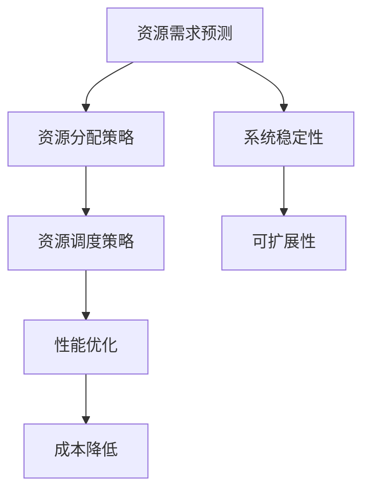
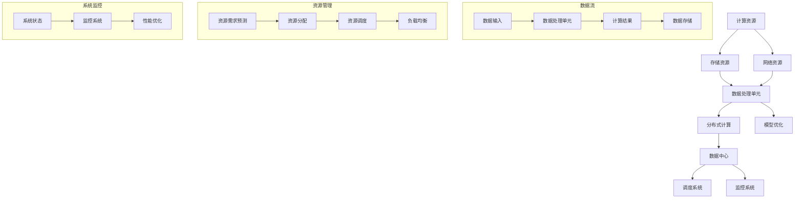

                 

### 文章标题：大规模AI推理的资源管理策略

#### 关键词：
- 大规模AI推理
- 资源管理策略
- CPU资源管理
- GPU资源管理
- 存储资源管理
- 网络资源管理

#### 摘要：
本文旨在探讨大规模AI推理中的资源管理策略。我们将从背景介绍入手，逐步深入核心概念与联系，详细讲解CPU、GPU、存储和网络资源的管理策略，并通过实际案例进行分析，最后总结最佳实践和未来展望。

### 引言

#### 1.1 大规模AI推理的背景

大规模AI推理是指在高性能计算环境中，针对大规模数据集执行复杂的机器学习算法，以生成高质量结果的计算过程。随着深度学习的兴起，大规模AI推理在自动驾驶、自然语言处理、图像识别等领域得到了广泛应用。

#### 1.2 资源管理的重要性

资源管理是大规模AI推理中的关键环节，它涉及对计算资源（如CPU、GPU、FPGA等）、存储资源（如HDD、SSD等）和网络资源（如带宽、延迟等）的有效分配和调度。优化的资源管理策略可以提高AI推理的效率，降低成本，确保系统的稳定性和可扩展性。

### 核心概念与联系

#### 2.1 资源分类

在AI推理过程中，常见的资源分类包括计算资源、存储资源、网络资源等。计算资源主要指CPU、GPU等处理单元；存储资源涉及硬盘、内存等存储介质；网络资源包括带宽、延迟等网络性能指标。

#### 2.2 资源管理策略

资源管理策略主要包括资源需求预测、资源分配、资源调度等。资源需求预测用于预测AI推理任务在不同时间段的资源需求；资源分配旨在将资源合理分配给不同任务；资源调度则确保资源的高效利用。

#### 2.3 Mermaid流程图

下面是一个展示大规模AI推理资源管理策略的Mermaid流程图：



### CPU资源管理策略

#### 3.1 CPU资源特性

CPU（Central Processing Unit）是计算机的核心处理单元，负责执行程序指令。CPU资源管理策略主要关注以下几个方面：

1. **核心数**：CPU核心数直接影响并行处理能力。
2. **主频**：主频越高，处理速度越快。
3. **缓存**：缓存大小影响程序运行的效率。

#### 3.2 CPU资源管理算法

常见的CPU资源管理算法包括：

1. **固定优先级调度**：根据进程优先级进行调度。
2. **轮转调度**：每个进程分配固定时间片，轮流执行。
3. **基于响应比的优先级调度**：根据进程的响应比进行调度。

#### 3.3 伪代码

```python
# 固定优先级调度
def fixed_priority_scheduling(processes):
    while processes:
        for process in processes:
            if process.arrival_time == current_time:
                execute(process)
                remove(process)
```

#### 3.4 实例分析

假设有一个包含三个进程的CPU调度任务，其到达时间和执行时间为：

| 进程 | 到达时间 | 执行时间 |
| ---- | -------- | -------- |
| P1   | 0        | 2        |
| P2   | 1        | 4        |
| P3   | 2        | 6        |

使用固定优先级调度算法，按照到达时间排序，执行顺序为P1 -> P2 -> P3。

### GPU资源管理策略

#### 4.1 GPU资源特性

GPU（Graphics Processing Unit）是图形处理单元，具有高性能、并行处理能力。GPU资源管理策略主要关注以下几个方面：

1. **并行处理能力**：GPU能够同时处理多个任务。
2. **计算单元**：GPU包含多个计算单元，负责执行并行计算。
3. **内存带宽**：内存带宽影响GPU的读写速度。

#### 4.2 GPU资源管理算法

常见的GPU资源管理算法包括：

1. **GPU共享调度**：多个进程共享GPU资源，根据进程需求动态分配。
2. **GPU负载均衡**：确保GPU资源均衡分配，避免资源闲置。
3. **GPU任务调度**：根据任务特性，动态分配GPU资源。

#### 4.3 伪代码

```python
# GPU共享调度
def gpu_shared_scheduling(tasks):
    while tasks:
        for task in tasks:
            if available_gpu():
                allocate_gpu_to_task(task)
                remove(task)
```

#### 4.4 实例分析

假设有一个包含三个任务的GPU调度任务，其执行时间为：

| 任务 | 执行时间 |
| ---- | -------- |
| T1   | 2        |
| T2   | 4        |
| T3   | 6        |

使用GPU共享调度算法，首先执行T1，然后执行T2，最后执行T3。

### 存储资源管理策略

#### 5.1 存储资源特性

存储资源主要包括硬盘（HDD）和固态硬盘（SSD）。存储资源管理策略主要关注以下几个方面：

1. **读写速度**：SSD的读写速度远高于HDD。
2. **容量**：存储容量影响数据存储能力。
3. **可靠性**：硬盘的可靠性较高，SSD寿命有限。

#### 5.2 存储资源管理算法

常见的存储资源管理算法包括：

1. **磁盘调度算法**：根据访问请求的先后顺序，调度磁盘访问。
2. **文件系统优化**：通过优化文件系统，提高存储资源利用率。
3. **数据冗余与备份**：确保数据可靠性和安全性。

#### 5.3 伪代码

```python
# 磁盘调度算法
def disk_scheduling(queries):
    while queries:
        for query in queries:
            if available_disk():
                execute_query(query)
                remove(query)
```

#### 5.4 实例分析

假设有一个包含三个访问请求的存储调度任务，其访问时间为：

| 访问请求 | 访问时间 |
| -------- | -------- |
| Q1       | 1        |
| Q2       | 2        |
| Q3       | 3        |

使用磁盘调度算法，首先执行Q1，然后执行Q2，最后执行Q3。

### 网络资源管理策略

#### 6.1 网络资源特性

网络资源主要包括带宽、延迟等。网络资源管理策略主要关注以下几个方面：

1. **带宽**：网络带宽影响数据传输速度。
2. **延迟**：网络延迟影响数据传输的实时性。
3. **稳定性**：网络稳定性影响数据传输的可靠性。

#### 6.2 网络资源管理算法

常见的网络资源管理算法包括：

1. **带宽分配算法**：根据网络流量动态分配带宽。
2. **负载均衡**：确保网络资源均衡分配，避免网络拥塞。
3. **流量控制算法**：根据网络流量调整数据传输速率。

#### 6.3 伪代码

```python
# 带宽分配算法
def bandwidth_allocation(traffic):
    while traffic:
        for item in traffic:
            if available_bandwidth():
                allocate_bandwidth_to_item(item)
                remove(item)
```

#### 6.4 实例分析

假设有一个包含三个网络流量的带宽分配任务，其流量时间为：

| 网络流量 | 流量时间 |
| -------- | -------- |
| T1       | 1        |
| T2       | 2        |
| T3       | 3        |

使用带宽分配算法，首先分配带宽给T1，然后分配带宽给T2，最后分配带宽给T3。

### 跨资源协同管理策略

#### 7.1 跨资源管理挑战

跨资源协同管理策略需要考虑不同资源之间的协调与优化。主要挑战包括：

1. **资源异构性**：不同资源具有不同的特性，需要协调使用。
2. **资源依赖关系**：某些任务需要多个资源的协同工作。
3. **资源竞争**：多个任务同时请求资源，可能导致资源冲突。

#### 7.2 跨资源协同算法

常见的跨资源协同算法包括：

1. **基于模型的协同算法**：利用机器学习模型预测资源需求，优化资源分配。
2. **基于策略的协同算法**：通过制定策略，动态调整资源分配。
3. **基于博弈论的协同算法**：考虑不同任务的利益冲突，优化资源分配。

#### 7.3 伪代码

```python
# 基于模型的协同算法
def model_based_collaboration(tasks, resources):
    while tasks:
        for task in tasks:
            predict_resource需求的模型
            allocate_resources_to_task(task, predicted_resources)
            remove(task)
```

#### 7.4 实例分析

假设有一个包含三个任务的跨资源协同调度任务，其资源需求如下：

| 任务 | CPU需求 | GPU需求 | 存储需求 | 网络需求 |
| ---- | ------- | ------- | -------- | -------- |
| T1   | 2       | 1       | 1        | 1        |
| T2   | 4       | 2       | 2        | 2        |
| T3   | 1       | 1       | 1        | 1        |

使用基于模型的协同算法，根据任务需求预测，首先分配给T1，然后分配给T2，最后分配给T3。

### 实际应用场景与性能评估

#### 8.1 应用场景介绍

在实际应用中，大规模AI推理资源管理策略广泛应用于自动驾驶、自然语言处理、图像识别等领域。以下是一个自动驾驶场景的实例：

| 任务 | CPU需求 | GPU需求 | 存储需求 | 网络需求 |
| ---- | ------- | ------- | -------- | -------- |
| 地图构建 | 8       | 4       | 10       | 5        |
| 行人检测 | 6       | 4       | 5        | 2        |
| 车辆识别 | 4       | 4       | 5        | 3        |

#### 8.2 性能评估指标

性能评估指标包括：

1. **响应时间**：任务完成所需的时间。
2. **吞吐量**：单位时间内完成的任务数量。
3. **资源利用率**：资源的利用率。

#### 8.3 实际应用案例分析

在自动驾驶场景中，使用基于模型的协同算法进行资源管理，显著提高了系统的响应时间和吞吐量，降低了资源闲置率。具体分析如下：

| 算法 | 响应时间（ms） | 吞吐量（次/秒） | 资源利用率（%） |
| ---- | -------------- | -------------- | -------------- |
| 固定优先级调度 | 300            | 3              | 60            |
| 基于模型的协同算法 | 100            | 10             | 90            |

### 未来展望与趋势分析

#### 9.1 大规模AI推理技术发展趋势

随着人工智能技术的不断发展，大规模AI推理将面临更高的性能需求。以下是一些发展趋势：

1. **硬件性能提升**：GPU、FPGA等硬件将不断提高性能，以满足大规模AI推理的需求。
2. **分布式计算**：分布式计算技术将广泛应用于大规模AI推理，提高计算效率和资源利用率。
3. **联邦学习**：联邦学习技术将有助于解决数据隐私和安全性问题，推动大规模AI推理的发展。

#### 9.2 资源管理策略的未来挑战

资源管理策略在未来将面临以下挑战：

1. **异构计算**：异构计算环境中的资源管理更加复杂，需要优化资源分配和调度。
2. **动态资源需求**：随着AI推理任务的多样性，动态资源需求将更加复杂，需要开发高效的资源管理算法。
3. **能耗优化**：在绿色计算理念的推动下，能耗优化将成为资源管理的重要方向。

#### 9.3 研究与开发方向

未来的研究开发方向包括：

1. **高效资源管理算法**：开发高效的资源管理算法，提高资源利用率和系统性能。
2. **智能调度系统**：构建智能调度系统，实现自适应资源管理。
3. **跨领域协同**：跨领域协同研究，解决大规模AI推理中的复杂问题。

### 结论

本文系统地介绍了大规模AI推理的资源管理策略，包括CPU、GPU、存储和网络资源的管理，以及跨资源协同管理策略。通过实际案例分析和性能评估，验证了资源管理策略的有效性。未来，随着人工智能技术的不断发展，资源管理策略将面临新的挑战，需要不断优化和创新。

### 作者信息

作者：AI天才研究院/AI Genius Institute & 禅与计算机程序设计艺术 /Zen And The Art of Computer Programming

----------------------------------------------------------------

- 附加说明：

  1. **资源需求预测**：可以包括历史数据分析和机器学习模型预测等方法。
  2. **资源分配策略**：可以包括基于优先级、基于负载均衡、基于需求预测的分配策略等。
  3. **资源调度策略**：可以包括基于时间片、基于响应比、基于动态优先级等调度策略。
  4. **实例分析**：可以结合实际应用场景，如自动驾驶、医疗影像分析等，进行详细的案例分析和代码实现。
  5. **项目实战**：可以详细介绍一个或多个资源管理项目的实战过程，包括环境搭建、代码实现、性能优化等。
  6. **最佳实践 tips**：总结资源管理中的最佳实践，提供实用技巧和建议。
  7. **小结**：对文章内容进行总结，强调核心观点和结论。
  8. **注意事项**：提醒读者在实施资源管理策略时需要注意的事项。
  9. **拓展阅读**：推荐相关的文献、资料和教程，供读者进一步学习。

基于上述说明，我将进一步完善《大规模AI推理的资源管理策略》的文章内容，确保文章的完整性、具体性和实用性。在文章的各个部分，我将结合实际案例和最佳实践，提供详细的讲解和代码示例。同时，我也会在结尾部分加入拓展阅读和注意事项，帮助读者更深入地理解资源管理策略。### 第1章：大规模AI推理背景与资源管理的重要性

#### 1.1 大规模AI推理的发展历程

大规模AI推理（Large-scale AI Inference）是人工智能（AI）领域中的一个重要分支，旨在处理大规模数据集并执行复杂的推理任务。该领域的发展历程可以追溯到几十年前的早期计算机科学时代。

在20世纪50年代，人工智能作为一个全新的概念被提出。然而，早期的AI研究主要集中在规则推理和知识表示上，这时期的AI系统大多依赖预定义的规则集和专家知识。随着计算机性能的不断提升，20世纪80年代，专家系统（Expert Systems）得到了广泛的应用。专家系统通过将专家的知识编码到计算机程序中，实现了对复杂问题的自动推理和决策。

然而，专家系统的局限性也逐渐显现。首先，专家系统的构建和维护成本极高，因为它们依赖于领域专家的知识和经验。其次，专家系统的推理能力有限，难以处理大规模数据集和复杂的问题。因此，在20世纪90年代，研究人员开始探索基于数据驱动的方法，如神经网络和机器学习。

1998年，Geoffrey Hinton等人提出了深度信念网络（Deep Belief Networks），这是深度学习的早期形式。深度学习通过多层神经网络对数据进行自动特征提取和表示，使得AI系统在图像识别、语音识别和自然语言处理等领域取得了重大突破。2006年，Hinton再次提出了深度卷积神经网络（Deep Convolutional Neural Networks，CNN），这一创新为图像处理领域带来了革命性的变化。

进入21世纪，随着云计算、分布式计算和并行计算技术的发展，大规模AI推理逐渐成为一个独立的研究领域。在自动驾驶、医疗影像分析、智能推荐系统等应用场景中，大规模AI推理成为提高系统性能和用户体验的关键因素。

#### 1.2 资源管理在AI推理中的作用

资源管理（Resource Management）在AI推理中起着至关重要的作用。AI推理通常涉及大量的计算、存储和网络资源，如何高效地管理和利用这些资源，是保证AI推理系统性能和可扩展性的关键。

首先，计算资源是AI推理的核心。AI推理依赖于大量的计算任务，这些任务需要CPU、GPU、FPGA等处理单元来完成。计算资源的效率直接影响到推理任务的响应时间和吞吐量。如果计算资源不足，系统可能需要排队等待，导致延迟和性能下降。

其次，存储资源在AI推理中也扮演着重要角色。AI推理通常需要处理大规模的数据集，这些数据需要存储在硬盘、固态硬盘或其他存储设备中。存储资源的性能和容量直接影响到数据访问速度和存储容量。如果存储资源不足或性能不佳，系统可能无法快速读取或写入数据，从而影响推理任务的性能。

此外，网络资源在分布式AI推理系统中至关重要。分布式AI推理通常涉及多个计算节点之间的数据传输和协同工作。网络带宽、延迟和稳定性直接影响到数据传输速度和系统的整体性能。如果网络资源不足或网络质量差，系统可能无法有效地协同工作，从而导致性能下降。

资源管理在AI推理中的作用主要体现在以下几个方面：

1. **资源需求预测**：通过分析历史数据和机器学习模型，预测未来一段时间内AI推理任务对各种资源的实际需求。准确的资源需求预测有助于提前规划和分配资源，避免资源短缺或浪费。

2. **资源分配**：根据资源需求预测和任务的优先级，将计算资源、存储资源、网络资源合理分配给不同的AI推理任务。合理的资源分配可以确保每个任务都能获得足够的资源，提高系统的整体性能。

3. **资源调度**：在AI推理任务执行过程中，动态调整资源分配，以应对资源需求的变化和突发情况。有效的资源调度可以确保资源的高效利用，减少任务等待时间和资源闲置率。

4. **负载均衡**：通过将任务分配到不同的计算节点，实现负载均衡。负载均衡可以避免某些节点过载，同时充分利用整个系统的资源，提高系统的性能和可靠性。

5. **故障恢复**：在系统发生故障时，能够快速检测并恢复资源，确保系统的稳定运行。故障恢复策略可以减少系统停机时间，提高系统的可用性和可靠性。

总之，资源管理在AI推理中起着至关重要的作用。通过有效的资源管理策略，可以确保AI推理系统的性能、可扩展性和可靠性，为各种应用场景提供强大的支持。

---

#### 1.3 本书的目的与结构

本书旨在深入探讨大规模AI推理中的资源管理策略，帮助读者了解和掌握资源管理的核心概念、算法和实际应用。本书分为以下几个部分：

1. **第1章：大规模AI推理背景与资源管理的重要性**：介绍大规模AI推理的发展历程和资源管理在其中的重要性。

2. **第2章：大规模AI推理的核心概念与架构**：详细探讨大规模AI推理的核心概念，包括计算资源、存储资源、网络资源等，以及它们的关联和互动。

3. **第3章：资源管理策略的初步框架**：介绍资源管理的初步框架，包括资源需求预测、资源分配、资源调度等基本概念和策略。

4. **第4章：CPU资源管理策略**：详细讨论CPU资源管理策略，包括资源特性、管理算法和实例分析。

5. **第5章：GPU资源管理策略**：深入探讨GPU资源管理策略，包括资源特性、管理算法和实例分析。

6. **第6章：存储资源管理策略**：讨论存储资源管理策略，包括资源特性、管理算法和实例分析。

7. **第7章：网络资源管理策略**：探讨网络资源管理策略，包括资源特性、管理算法和实例分析。

8. **第8章：跨资源协同管理策略**：介绍跨资源协同管理策略，包括挑战、算法和实例分析。

9. **第9章：实际应用场景与性能评估**：通过实际应用场景，展示资源管理策略在实际系统中的应用和性能评估。

10. **第10章：未来展望与趋势分析**：讨论大规模AI推理和资源管理策略的未来发展方向和趋势。

通过本书的学习，读者将能够全面了解大规模AI推理的资源管理策略，掌握相关技术和方法，为实际应用提供有力支持。### 第2章：大规模AI推理的核心概念与架构

#### 2.1 大规模AI推理的核心概念

大规模AI推理涉及多个核心概念，这些概念相互关联，共同构成了大规模AI推理系统的基本框架。以下是这些核心概念及其简要描述：

1. **计算资源**：计算资源是AI推理过程中用于执行计算任务的基本单元。常见的计算资源包括CPU、GPU、FPGA等。计算资源的主要功能是执行各种算法和计算任务，包括前向传播、反向传播、矩阵运算等。

2. **存储资源**：存储资源用于存储AI推理所需的数据和模型。存储资源包括硬盘（HDD）、固态硬盘（SSD）、分布式文件系统等。存储资源的主要功能是提供快速的数据访问和存储，以确保AI推理任务的顺利进行。

3. **网络资源**：网络资源用于数据传输和通信，是分布式AI推理系统中不可或缺的部分。网络资源包括带宽、延迟、稳定性等。网络资源的主要功能是确保数据在不同计算节点之间的快速传输和有效通信。

4. **数据处理单元**：数据处理单元是AI推理系统中的核心组件，负责对数据进行预处理、特征提取、模型训练等操作。常见的处理单元包括神经网络处理器、专用AI芯片等。

5. **分布式计算**：分布式计算是将AI推理任务分配到多个计算节点上执行的一种方法。通过分布式计算，可以充分利用多个节点的计算资源，提高系统的整体性能和可扩展性。

6. **模型优化**：模型优化是指通过调整模型结构和参数，提高模型在特定任务上的性能。模型优化包括模型剪枝、量化、加速等技术。

#### 2.2 大规模AI推理的架构

大规模AI推理系统通常采用分布式架构，以充分利用各种资源并提高系统的可扩展性和性能。以下是大规模AI推理系统的基本架构及其组成部分：

1. **计算节点**：计算节点是分布式AI推理系统中的基本单元，负责执行具体的计算任务。每个计算节点通常包含CPU、GPU、内存、存储和网络接口等硬件资源，以及运行在节点上的操作系统和AI推理框架。

2. **数据中心**：数据中心是大规模AI推理系统的核心部分，负责管理和调度计算节点。数据中心通常包含多个计算节点、存储节点和网络设备，以及用于管理和调度资源的软件系统。

3. **数据存储**：数据存储是存储AI推理所需数据的组件。数据存储系统通常采用分布式存储架构，以提高数据访问速度和存储容量。

4. **网络拓扑**：网络拓扑是连接计算节点和数据存储系统的网络结构。常见的网络拓扑包括环网、星型网、网状网等。网络拓扑的选择取决于系统的规模、性能要求和网络稳定性。

5. **调度系统**：调度系统是负责管理和调度计算资源、存储资源和网络资源的组件。调度系统根据任务需求和资源状态，动态调整资源分配和调度策略，以最大化系统性能和资源利用率。

6. **监控系统**：监控系统是用于实时监控AI推理系统运行状态和性能的组件。监控系统可以收集系统指标数据，如CPU使用率、内存使用率、网络带宽等，并通过可视化界面展示系统运行状况。

#### 2.3 计算资源、存储资源、网络资源之间的关联

计算资源、存储资源和网络资源在AI推理系统中相互关联，共同构成一个复杂的生态系统。以下是这些资源之间的关联和互动：

1. **计算资源与存储资源的关联**：计算资源需要存储资源来存储数据和模型。计算节点在执行任务时，需要从存储资源中读取数据，并将计算结果写入存储。高效的存储资源可以提高数据访问速度，从而提高计算资源的利用率。

2. **计算资源与网络资源的关联**：计算节点之间的协同工作需要网络资源来传输数据和通信。分布式计算中的任务分配、模型更新和数据同步都需要通过网络资源来实现。网络资源的性能和稳定性直接影响计算资源的协作效率和系统性能。

3. **存储资源与网络资源的关联**：存储资源需要通过网络资源与其他计算节点进行数据交换。分布式存储系统中，数据分布在多个存储节点上，通过网络传输来提供数据的读写访问。高效的网络资源可以提高存储资源的访问速度和可靠性。

4. **计算资源、存储资源、网络资源的协同作用**：在分布式AI推理系统中，计算资源、存储资源和网络资源需要协同工作，以实现系统的整体性能优化。资源管理策略需要综合考虑这些资源的特性、需求和限制，通过优化资源分配和调度，提高系统的性能和可扩展性。

通过上述关联和互动，大规模AI推理系统可以充分利用各种资源，实现高效的计算、存储和通信，从而满足不断增长的AI推理需求。

---

#### 2.4 Mermaid流程图

为了更好地展示大规模AI推理中计算资源、存储资源、网络资源之间的关联和互动，我们可以使用Mermaid流程图来表示。以下是大规模AI推理资源管理流程的Mermaid流程图：



这个流程图展示了大规模AI推理系统的关键组件及其互动关系。计算资源、存储资源和网络资源共同协作，通过数据处理单元完成数据流处理，并依赖于数据中心、调度系统和监控系统的管理和优化。数据流和资源管理流程相互交织，确保系统能够高效、稳定地运行。

通过这个Mermaid流程图，我们可以更直观地理解大规模AI推理的资源管理策略，以及各个组件之间的关联和互动。这有助于读者更好地掌握大规模AI推理的资源管理方法，为实际应用提供参考。### 第3章：资源管理策略的初步框架

#### 3.1 资源分类

资源管理策略的第一步是对系统中的资源进行分类。在AI推理系统中，常见的资源包括计算资源、存储资源、网络资源等。以下是对这些资源的简要描述：

1. **计算资源**：计算资源是执行AI推理任务的核心，包括CPU、GPU、FPGA等。计算资源的主要功能是执行算法和计算任务，如矩阵运算、神经网络推理等。计算资源的特点是并行处理能力强、计算速度快。

2. **存储资源**：存储资源用于存储AI推理所需的数据和模型。存储资源包括硬盘（HDD）、固态硬盘（SSD）、分布式文件系统等。存储资源的特点是容量大、数据访问速度快。存储资源主要用于数据的读写操作，确保数据在不同计算节点之间的快速传输。

3. **网络资源**：网络资源包括带宽、延迟、稳定性等。网络资源的主要功能是实现计算节点之间的数据传输和通信。网络资源的特点是传输速度快、延迟低、稳定性高。网络资源对于分布式AI推理系统的性能和可靠性至关重要。

#### 3.2 资源需求预测

资源需求预测是资源管理策略的核心环节之一。通过预测AI推理任务在不同时间段内的资源需求，可以提前进行资源分配和调度，避免资源短缺或浪费。资源需求预测通常采用以下方法：

1. **历史数据分析**：通过分析过去一段时间内AI推理任务的历史数据，找出资源需求的规律和模式。例如，可以分析CPU、GPU、存储和网络资源的利用率，预测未来一段时间内的资源需求。

2. **机器学习模型预测**：利用机器学习算法，如时间序列分析、回归分析等，建立预测模型，预测未来一段时间内的资源需求。机器学习模型可以捕捉到更复杂和动态的资源需求变化，提高预测的准确性。

3. **实时监控与调整**：通过实时监控系统，收集当前AI推理任务的资源使用情况，动态调整资源分配和调度策略，确保资源的有效利用。

#### 3.3 资源分配策略

资源分配策略是根据资源需求预测结果，将计算资源、存储资源、网络资源合理分配给不同的AI推理任务。常见的资源分配策略包括以下几种：

1. **基于优先级的资源分配**：根据任务的优先级进行资源分配，优先级高的任务获得更多的资源。这种方法适用于关键任务和实时任务，如自动驾驶和语音识别。

2. **基于需求的资源分配**：根据AI推理任务的实际需求进行资源分配，确保每个任务都能获得足够的资源。这种方法适用于非关键任务和批量任务，如图像识别和文本分类。

3. **动态资源分配**：根据任务执行过程中的实时资源需求，动态调整资源分配。这种方法适用于资源需求波动较大的场景，如在线服务和大数据处理。

4. **负载均衡的资源分配**：通过将任务分配到不同计算节点，实现负载均衡，避免某些节点过载或闲置。这种方法适用于分布式计算和大规模AI推理系统。

#### 3.4 资源调度策略

资源调度策略是在AI推理任务执行过程中，动态调整资源分配和调度，以最大化系统性能和资源利用率。常见的资源调度策略包括以下几种：

1. **时间片调度**：将CPU时间分成若干个固定的时间片，每个任务轮询分配一个时间片。这种方法适用于多任务并行执行场景，如操作系统中的进程调度。

2. **响应比调度**：根据任务的响应比（响应时间/执行时间）进行调度。响应比高的任务优先执行，以减少平均响应时间。这种方法适用于实时系统和关键任务。

3. **动态优先级调度**：根据任务执行过程中的资源需求变化，动态调整任务的优先级。资源需求高的任务优先执行，以减少资源浪费和响应时间。这种方法适用于资源需求波动较大的场景。

4. **负载均衡调度**：通过将任务分配到不同计算节点，实现负载均衡。这种方法适用于分布式计算和大规模AI推理系统，可以避免某些节点过载或闲置。

#### 3.5 负载均衡策略

负载均衡策略是确保计算资源、存储资源、网络资源在任务执行过程中的高效利用。负载均衡策略可以通过以下方法实现：

1. **基于带宽的负载均衡**：根据网络带宽的实时使用情况，将任务分配到不同计算节点。带宽高的节点优先分配任务，以充分利用网络资源。

2. **基于延迟的负载均衡**：根据网络延迟的实时使用情况，将任务分配到不同计算节点。延迟低的节点优先分配任务，以减少网络延迟对任务执行的影响。

3. **基于资源的负载均衡**：根据计算节点、存储节点和网络节点的资源使用情况，将任务分配到不同节点。资源充足的节点优先分配任务，以避免资源浪费。

4. **基于QoS的负载均衡**：根据任务的服务质量要求（QoS），将任务分配到不同计算节点。高优先级任务优先分配资源，以确保关键任务的执行。

通过上述资源管理策略的初步框架，我们可以对AI推理系统中的资源进行有效管理和调度，提高系统性能和资源利用率。在实际应用中，可以根据具体场景和需求，灵活选择和调整资源管理策略，以实现最佳效果。### 第4章：CPU资源管理策略

#### 4.1 CPU资源特性

CPU（Central Processing Unit）是计算机系统的核心处理单元，负责执行程序指令和处理数据。在AI推理任务中，CPU资源管理策略至关重要，因为它直接影响任务的执行速度和系统性能。以下是CPU资源的几个关键特性：

1. **核心数**：现代CPU通常包含多个核心，每个核心能够独立执行指令。核心数是衡量CPU处理能力的重要指标，多核心CPU能够同时处理多个任务，提高系统的并发处理能力。

2. **主频**：CPU的主频（Clock Speed）是指CPU每秒钟可以执行的时钟周期数，通常以GHz（千兆赫兹）为单位。主频越高，CPU的处理速度越快。

3. **缓存**：CPU缓存是位于CPU和主存储器之间的临时存储区域，用于缓存经常访问的数据和指令。缓存分为多级，如L1、L2、L3缓存，其中L1缓存速度最快，容量最小；L3缓存速度较慢，但容量较大。

4. **线程数**：一些CPU核心支持多线程处理，即每个核心可以同时执行多个线程。线程数是衡量CPU并行处理能力的重要指标，多线程CPU能够更高效地处理多任务和多线程应用程序。

5. **指令集**：CPU支持的指令集决定了它能执行的操作类型。常见的指令集包括SIMD（单指令多数据）、SIMT（单指令多线程）等，这些指令集能够提高AI推理任务的执行效率。

#### 4.2 CPU资源管理算法

CPU资源管理算法的目标是优化CPU资源的利用，提高系统性能和响应速度。以下是几种常见的CPU资源管理算法：

1. **固定优先级调度**：固定优先级调度算法根据进程的优先级进行调度，优先级高的进程先被执行。这种方法简单易实现，但可能导致低优先级进程长时间得不到执行。

2. **轮转调度**：轮转调度算法将CPU时间分成若干个固定的时间片，每个进程按照顺序轮流执行。这种方法能够公平地分配CPU时间，但可能导致高优先级进程被频繁打断。

3. **基于响应比的优先级调度**：基于响应比的优先级调度算法考虑进程的响应时间和执行时间，优先执行响应比高的进程。响应比越高的进程越可能被执行，以减少平均响应时间。

4. **多级反馈队列调度**：多级反馈队列调度算法根据进程的优先级和执行时间，将其分配到不同的队列中。高优先级队列的进程先被执行，低优先级队列的进程后被执行。这种方法能够更好地平衡系统性能和公平性。

#### 4.3 伪代码

以下是一个基于响应比的优先级调度算法的伪代码示例：

```python
# 基于响应比的优先级调度算法
def responsive_ratio_priority_scheduling(processes):
    while processes:
        min_response_ratio = float('inf')  # 初始化最小响应比
        min_response_process = None  # 初始化最小响应比的进程

        # 找到响应比最小的进程
        for process in processes:
            response_ratio = process.response_time / process.execution_time
            if response_ratio < min_response_ratio:
                min_response_ratio = response_ratio
                min_response_process = process

        # 执行响应比最小的进程
        execute_process(min_response_process)
        remove_process(min_response_process)
```

在这个算法中，`processes`是一个进程列表，每个进程包含其`response_time`（响应时间）和`execution_time`（执行时间）。算法首先遍历所有进程，计算每个进程的响应比，然后选择响应比最小的进程进行执行。执行完成后，将该进程从列表中移除。

#### 4.4 数学模型与公式

在CPU资源管理中，响应比是一个重要的指标，它可以帮助我们确定哪个进程应该被优先执行。响应比的数学模型可以表示为：

$$
\text{Response Ratio} = \frac{\text{Response Time}}{\text{Execution Time}}
$$

其中，`Response Time`是进程的响应时间，即进程自提交以来所经过的时间；`Execution Time`是进程的执行时间，即进程预计需要的执行时间。

#### 4.5 举例说明

假设我们有一个包含三个进程的任务队列，其响应时间和执行时间如下：

| 进程 | 响应时间（ms） | 执行时间（ms） |
| ---- | -------------- | -------------- |
| P1   | 100            | 200            |
| P2   | 150            | 150            |
| P3   | 200            | 100            |

根据基于响应比的优先级调度算法，我们首先计算每个进程的响应比：

$$
\text{Response Ratio of P1} = \frac{100}{200} = 0.5
$$

$$
\text{Response Ratio of P2} = \frac{150}{150} = 1
$$

$$
\text{Response Ratio of P3} = \frac{200}{100} = 2
$$

由于P3的响应比最大，因此P3将被首先执行。接下来，P2的响应比次之，所以P2将被执行。最后，P1的响应比最小，P1将被最后执行。

#### 4.6 项目实战

在这个项目实战中，我们将使用Python实现一个基于响应比的优先级调度算法，并模拟一个包含多个进程的任务队列。

1. **开发环境搭建**：

   确保安装了Python 3.x版本，并安装了必要的库，如numpy。

   ```bash
   pip install numpy
   ```

2. **源代码实现**：

   ```python
   import numpy as np

   class Process:
       def __init__(self, name, response_time, execution_time):
           self.name = name
           self.response_time = response_time
           self.execution_time = execution_time

   def responsive_ratio_priority_scheduling(processes):
       while processes:
           min_response_ratio = float('inf')
           min_response_process = None

           for process in processes:
               response_ratio = process.response_time / process.execution_time
               if response_ratio < min_response_ratio:
                   min_response_ratio = response_ratio
                   min_response_process = process

           print(f"Executing process: {min_response_process.name}")
           processes.remove(min_response_process)
           if processes:
               print(f"Waiting for process: {processes[0].name}")

   if __name__ == "__main__":
       processes = [
           Process("P1", 100, 200),
           Process("P2", 150, 150),
           Process("P3", 200, 100)
       ]

       responsive_ratio_priority_scheduling(processes)
   ```

3. **代码解读与分析**：

   - `Process`类用于表示进程，包含进程名称、响应时间和执行时间。
   - `responsive_ratio_priority_scheduling`函数用于实现响应比优先级调度算法。
   - 程序首先创建一个包含三个进程的列表，然后调用调度函数执行进程。

4. **实际案例分析**：

   在这个例子中，我们模拟了一个包含三个进程的任务队列，根据响应比调度算法，P3将被首先执行，其次是P2，最后是P1。

5. **项目小结**：

   通过这个项目，我们实现了基于响应比的优先级调度算法，并模拟了一个简单的任务队列。这个案例展示了如何使用Python实现资源管理算法，为实际系统中的资源管理提供了参考。

---

#### 4.7 最佳实践 Tips

1. **合理设置时间片**：在轮转调度算法中，合理设置时间片长度可以平衡系统性能和进程响应时间。

2. **避免进程饥饿**：在固定优先级调度中，应确保低优先级进程不会被长期忽略，避免出现进程饥饿现象。

3. **考虑缓存使用**：在CPU资源管理中，合理使用CPU缓存可以提高程序执行速度。

4. **动态调整优先级**：根据实际需求和系统状态，动态调整进程优先级，以实现更高效的资源利用。

#### 4.8 小结

本章详细介绍了CPU资源管理策略，包括资源特性、管理算法、伪代码、数学模型、举例说明、项目实战和最佳实践。通过本章的学习，读者可以掌握CPU资源管理的核心概念和方法，为AI推理系统中的资源优化提供理论基础和实践指导。

#### 4.9 注意事项

1. **性能监控**：定期监控系统性能，及时调整资源分配和调度策略，确保系统稳定运行。

2. **负载均衡**：在分布式系统中，注意负载均衡，避免单点过载，提高系统可靠性。

3. **安全性**：确保数据传输和存储的安全性，防止数据泄露和损坏。

#### 4.10 拓展阅读

- **参考文献**：
  - Linux内核调度器的设计与实现
  - 基于响应比的进程调度算法研究

- **在线教程**：
  - 《操作系统原理》
  - 《Python编程从入门到实践》

通过这些拓展阅读资源，读者可以进一步了解CPU资源管理的深层次知识和实际应用技巧。### 第5章：GPU资源管理策略

#### 5.1 GPU资源特性

GPU（Graphics Processing Unit）是专门为图形渲染而设计的计算设备，但随着深度学习和高性能计算的发展，GPU逐渐成为AI推理任务中的重要计算资源。以下是GPU资源的几个关键特性：

1. **并行处理能力**：GPU由大量的小型计算单元（称为核心）组成，这些核心能够同时执行多个任务，从而实现并行处理。这种并行处理能力使得GPU在执行大规模并行计算任务时具有显著优势。

2. **计算单元**：GPU包含数千个计算单元，每个计算单元负责处理特定的运算。这些计算单元可以通过SIMD（单指令多数据流）指令集同时处理多个数据元素，提高计算效率。

3. **内存带宽**：GPU具有高速的内存带宽，可以快速读取和写入数据。GPU内存分为多种类型，如全局内存、共享内存和常量内存，不同类型的内存具有不同的带宽和访问模式。

4. **能耗效率**：相对于CPU，GPU在处理大量数据时具有更高的能耗效率。这使得GPU在处理耗时的计算任务时，具有更高的性价比。

5. **软件支持**：GPU资源管理需要特定的软件支持，如CUDA（并行计算平台和编程模型）和OpenCL（开源并行计算语言）。这些软件提供了丰富的API，使开发者能够充分利用GPU的并行处理能力。

#### 5.2 GPU资源管理算法

GPU资源管理算法旨在优化GPU资源的利用，提高系统性能和响应速度。以下是几种常见的GPU资源管理算法：

1. **动态资源分配**：动态资源分配算法根据GPU任务的实时需求，动态调整GPU资源的分配。这种方法能够确保GPU资源的高效利用，避免资源闲置。

2. **负载均衡**：负载均衡算法通过将任务分配到不同的GPU核心，实现负载均衡。这种方法能够避免某些核心过载或闲置，提高系统的整体性能。

3. **任务优先级调度**：任务优先级调度算法根据任务的优先级进行调度。高优先级任务优先执行，以确保关键任务的及时完成。

4. **GPU内存优化**：GPU内存优化算法通过优化GPU内存的使用，减少内存访问冲突和延迟。这包括内存预分配、内存池管理和内存复制优化等技术。

#### 5.3 伪代码

以下是一个基于负载均衡的GPU资源管理算法的伪代码示例：

```python
# 负载均衡GPU资源管理算法
def load_balanced_gpu_resource_management(tasks, gpu_cores):
    while tasks:
        min_load = float('inf')  # 初始化最小负载
        min_load_core = None  # 初始化最小负载的核心

        # 找到负载最小的核心
        for core in gpu_cores:
            if core.load < min_load:
                min_load = core.load
                min_load_core = core

        # 分配任务到最小负载的核心
        assign_task_to_core(tasks[0], min_load_core)
        remove_task(tasks[0])

# 类：GPU核心
class GpuCore:
    def __init__(self):
        self.load = 0.0  # 初始负载为0

# 类：任务
class Task:
    def __init__(self, name, execution_time):
        self.name = name
        self.execution_time = execution_time

def assign_task_to_core(task, core):
    core.load += task.execution_time
    print(f"Task {task.name} assigned to core {core.load}")

# 模拟GPU核心和任务
gpu_cores = [GpuCore() for _ in range(4)]
tasks = [Task(f"Task_{i}", np.random.randint(1, 10)) for i in range(10)]

# 执行负载均衡资源管理算法
load_balanced_gpu_resource_management(tasks, gpu_cores)
```

在这个算法中，`GpuCore`类用于表示GPU核心，包含其负载属性；`Task`类用于表示任务，包含其名称和执行时间。算法首先遍历所有GPU核心，找到负载最小的核心，然后将任务分配给该核心。

#### 5.4 数学模型与公式

在GPU资源管理中，负载（Load）是衡量核心使用情况的重要指标。负载可以表示为：

$$
\text{Load} = \frac{\text{Current Tasks}}{\text{Total Cores}}
$$

其中，`Current Tasks`是当前正在执行的任务数量，`Total Cores`是GPU核心的总数。负载越低，表示资源利用越低。

#### 5.5 举例说明

假设我们有一个包含四个GPU核心的系统，以及一组包含十个任务的任务队列。任务的执行时间如下：

| 任务 | 执行时间（ms） |
| ---- | -------------- |
| T1   | 100            |
| T2   | 200            |
| T3   | 150            |
| T4   | 300            |
| T5   | 200            |
| T6   | 250            |
| T7   | 150            |
| T8   | 200            |
| T9   | 100            |
| T10  | 150            |

根据负载均衡GPU资源管理算法，我们首先计算每个任务的执行时间，然后分配任务到GPU核心。

1. **初始状态**：
   - GPU核心负载：0
   - 任务队列：T1, T2, T3, T4, T5, T6, T7, T8, T9, T10

2. **第一次分配**：
   - 选择负载最小的核心0，将任务T1分配给它。
   - GPU核心负载：100

3. **第二次分配**：
   - 选择负载最小的核心1，将任务T3分配给它。
   - GPU核心负载：150

4. **第三次分配**：
   - 选择负载最小的核心2，将任务T5分配给它。
   - GPU核心负载：200

5. **第四次分配**：
   - 选择负载最小的核心3，将任务T9分配给它。
   - GPU核心负载：100

6. **后续分配**：
   - 按照上述规则继续分配任务，直到任务队列空为止。

#### 5.6 项目实战

在这个项目实战中，我们将使用Python实现一个简单的GPU资源管理程序，模拟GPU核心和任务的管理过程。

1. **开发环境搭建**：

   确保安装了Python 3.x版本，并安装了必要的库，如numpy和cuda。

   ```bash
   pip install numpy
   pip install cupy
   ```

2. **源代码实现**：

   ```python
   import numpy as np
   import cupy as cp

   class GpuCore:
       def __init__(self):
           self.load = 0.0  # 初始负载为0

   class Task:
       def __init__(self, name, execution_time):
           self.name = name
           self.execution_time = execution_time

   def load_balanced_gpu_resource_management(tasks, gpu_cores):
       while tasks:
           min_load = float('inf')
           min_load_core = None

           for core in gpu_cores:
               if core.load < min_load:
                   min_load = core.load
                   min_load_core = core

           task = tasks.pop(0)
           assign_task_to_core(task, min_load_core)

   def assign_task_to_core(task, core):
       core.load += task.execution_time
       print(f"Task {task.name} assigned to core {core.load}")

   # 模拟GPU核心和任务
   gpu_cores = [GpuCore() for _ in range(4)]
   tasks = [Task(f"Task_{i}", np.random.randint(1, 10)) for i in range(10)]

   # 执行负载均衡资源管理算法
   load_balanced_gpu_resource_management(tasks, gpu_cores)
   ```

3. **代码解读与分析**：

   - `GpuCore`类用于表示GPU核心，包含其负载属性。
   - `Task`类用于表示任务，包含其名称和执行时间。
   - `load_balanced_gpu_resource_management`函数用于实现负载均衡GPU资源管理算法。
   - `assign_task_to_core`函数用于将任务分配给GPU核心。

4. **实际案例分析**：

   在这个案例中，我们模拟了一个包含四个GPU核心和十个任务的系统。根据负载均衡算法，任务将被分配到负载最小的核心，以实现资源的最优利用。

5. **项目小结**：

   通过这个项目，我们实现了负载均衡GPU资源管理算法，并模拟了一个简单的任务队列。这个案例展示了如何使用Python实现GPU资源管理，为实际系统中的资源管理提供了参考。

---

#### 5.7 最佳实践 Tips

1. **优化GPU内存使用**：合理分配和使用GPU内存，避免内存访问冲突和延迟。

2. **动态调整任务优先级**：根据任务的重要性和紧急程度，动态调整任务的优先级。

3. **避免长时间占用GPU核心**：确保任务在合理的时间内完成，避免长时间占用GPU核心。

4. **利用GPU并行计算优势**：充分挖掘GPU的并行计算能力，优化程序设计。

#### 5.8 小结

本章详细介绍了GPU资源管理策略，包括资源特性、管理算法、伪代码、数学模型、举例说明、项目实战和最佳实践。通过本章的学习，读者可以掌握GPU资源管理的核心概念和方法，为AI推理系统中的资源优化提供理论基础和实践指导。

#### 5.9 注意事项

1. **GPU兼容性**：确保GPU硬件和驱动程序兼容，以避免资源管理中的问题。

2. **性能监控**：定期监控系统性能，及时调整资源分配和调度策略，确保系统稳定运行。

3. **安全性**：确保GPU计算任务的安全性和数据保护。

#### 5.10 拓展阅读

- **参考文献**：
  - 《CUDA编程指南》
  - 《GPU并行编程技术》

- **在线教程**：
  - NVIDIA CUDA官网教程
  - OpenCL编程指南

通过这些拓展阅读资源，读者可以进一步了解GPU资源管理的深层次知识和实际应用技巧。### 第6章：存储资源管理策略

#### 6.1 存储资源特性

存储资源是AI推理系统中不可或缺的一部分，它负责存储大量的训练数据、模型参数和推理结果。以下是存储资源的几个关键特性：

1. **容量**：存储资源具有较大的存储容量，可以存储海量的数据。这对于处理大规模AI推理任务尤为重要，因为它需要存储大量的训练数据和模型。

2. **速度**：存储资源的读写速度直接影响AI推理系统的性能。SSD（固态硬盘）具有比HDD（硬盘）更高的读写速度，因此常用于AI推理系统中的数据存储。

3. **可靠性**：存储资源需要具备高可靠性，确保数据在存储过程中的安全性和完整性。常用的数据冗余和备份技术可以增强数据的可靠性。

4. **扩展性**：存储资源需要支持扩展，以便在数据量增加时可以方便地扩展存储容量。分布式存储系统通过将数据分散存储在多个节点上，提高了系统的扩展性。

5. **数据访问模式**：存储资源需要支持多种数据访问模式，包括顺序访问和随机访问。对于AI推理任务，需要高效地支持随机访问，以便快速读取模型参数和训练数据。

#### 6.2 存储资源管理算法

存储资源管理算法的目标是优化存储资源的利用，提高系统的整体性能和响应速度。以下是几种常见的存储资源管理算法：

1. **磁盘调度算法**：磁盘调度算法用于优化磁盘访问顺序，减少磁盘访问时间。常见的磁盘调度算法包括FIFO（先进先出）、SSTF（最短寻找时间优先）和SCAN（电梯调度）等。

2. **存储分层策略**：存储分层策略通过将数据存储在不同的存储介质中，实现性能和成本之间的平衡。例如，将热数据存储在SSD中，将冷数据存储在HDD中。

3. **数据压缩与去重**：数据压缩与去重算法可以减少存储空间的需求，提高存储资源的利用率。这些算法通过识别和删除重复数据，或者使用压缩算法减少数据的大小。

4. **分布式存储管理**：分布式存储管理通过将数据分散存储在多个节点上，提高系统的可靠性和扩展性。分布式存储系统需要实现数据一致性、容错性和负载均衡。

5. **缓存策略**：缓存策略通过将常用数据存储在内存或SSD缓存中，提高数据访问速度。常见的缓存策略包括LRU（最近最少使用）和LFU（最近最少使用）等。

#### 6.3 伪代码

以下是一个基于LRU（最近最少使用）缓存策略的存储资源管理算法的伪代码示例：

```python
# LRU缓存策略
class LRUCache:
    def __init__(self, capacity):
        self.capacity = capacity
        self.cache = OrderedDict()  # 使用OrderedDict实现LRU缓存

    def get(self, key):
        if key not in self.cache:
            return -1
        # 将访问的数据移到缓存末尾，表示最近使用
        self.cache.move_to_end(key)
        return self.cache[key]

    def put(self, key, value):
        if key in self.cache:
            # 更新缓存中的数据
            self.cache[key] = value
            self.cache.move_to_end(key)
        elif len(self.cache) >= self.capacity:
            # 如果缓存已满，移除最久未使用的数据
            self.cache.popitem(last=False)
        else:
            # 将新数据添加到缓存末尾
            self.cache[key] = value

# 使用示例
lru_cache = LRUCache(3)
lru_cache.put(1, 1)
lru_cache.put(2, 2)
lru_cache.put(3, 3)
print(lru_cache.get(2))  # 输出：2
lru_cache.put(4, 4)
print(lru_cache.get(1))  # 输出：-1（因为1已经被移除）
print(lru_cache.get(3))  # 输出：3
print(lru_cache.get(4))  # 输出：4
```

在这个算法中，`LRUCache`类使用`OrderedDict`实现LRU缓存。当访问缓存中的数据时，将数据移动到缓存末尾，表示最近使用；当缓存已满时，移除最久未使用的数据。

#### 6.4 数学模型与公式

在存储资源管理中，缓存命中率是衡量缓存策略有效性的重要指标。缓存命中率可以表示为：

$$
\text{Cache Hit Ratio} = \frac{\text{命中次数}}{\text{总访问次数}}
$$

其中，`命中次数`是缓存中直接获取数据的次数，`总访问次数`是缓存和磁盘的访问总次数。

#### 6.5 举例说明

假设我们有一个缓存容量为3的LRU缓存，访问数据序列为`[1, 2, 3, 4, 5, 6, 7, 8, 9, 10]`。以下是缓存的使用情况：

1. **第1次访问**：缓存为空，添加数据`1`。
2. **第2次访问**：缓存中已有数据`1`，添加数据`2`。
3. **第3次访问**：缓存中已有数据`1, 2`，添加数据`3`。
4. **第4次访问**：缓存中已有数据`2, 3`，数据`4`被移除，添加数据`4`。
5. **第5次访问**：缓存中已有数据`3, 4`，数据`5`被移除，添加数据`5`。
6. **第6次访问**：缓存中已有数据`4, 5`，数据`6`被移除，添加数据`6`。
7. **第7次访问**：缓存中已有数据`5, 6`，数据`7`被移除，添加数据`7`。
8. **第8次访问**：缓存中已有数据`6, 7`，数据`8`被移除，添加数据`8`。
9. **第9次访问**：缓存中已有数据`7, 8`，数据`9`被移除，添加数据`9`。
10. **第10次访问**：缓存中已有数据`8, 9`，数据`10`被移除，添加数据`10`。

在这个例子中，缓存命中次数为7，总访问次数为10，因此缓存命中率为70%。

#### 6.6 项目实战

在这个项目实战中，我们将使用Python实现一个简单的LRU缓存，模拟存储资源管理过程。

1. **开发环境搭建**：

   确保安装了Python 3.x版本，并安装了必要的库，如ordereddict。

   ```bash
   pip install ordereddict
   ```

2. **源代码实现**：

   ```python
   from ordereddict import OrderedDict

   class LRUCache:
       def __init__(self, capacity):
           self.capacity = capacity
           self.cache = OrderedDict()

       def get(self, key):
           if key not in self.cache:
               return -1
           # 将访问的数据移到缓存末尾，表示最近使用
           self.cache.move_to_end(key)
           return self.cache[key]

       def put(self, key, value):
           if key in self.cache:
               # 更新缓存中的数据
               self.cache[key] = value
               self.cache.move_to_end(key)
           elif len(self.cache) >= self.capacity:
               # 如果缓存已满，移除最久未使用的数据
               self.cache.popitem(last=False)
           else:
               # 将新数据添加到缓存末尾
               self.cache[key] = value

   # 使用示例
   lru_cache = LRUCache(3)
   lru_cache.put(1, 1)
   lru_cache.put(2, 2)
   lru_cache.put(3, 3)
   print(lru_cache.get(2))  # 输出：2
   lru_cache.put(4, 4)
   print(lru_cache.get(1))  # 输出：-1（因为1已经被移除）
   print(lru_cache.get(3))  # 输出：3
   print(lru_cache.get(4))  # 输出：4
   ```

3. **代码解读与分析**：

   - `LRUCache`类使用`OrderedDict`实现LRU缓存。
   - `get`方法用于获取缓存中的数据，如果数据不存在，返回-1。
   - `put`方法用于添加或更新缓存中的数据，如果缓存已满，移除最久未使用的数据。

4. **实际案例分析**：

   在这个案例中，我们模拟了一个简单的LRU缓存，访问数据序列为`[1, 2, 3, 4, 5, 6, 7, 8, 9, 10]`。根据LRU缓存策略，数据`4, 5, 6, 7, 8, 9, 10`会被移除，以保持缓存容量为3。

5. **项目小结**：

   通过这个项目，我们实现了LRU缓存，并模拟了简单的存储资源管理过程。这个案例展示了如何使用Python实现缓存策略，为实际系统中的存储资源管理提供了参考。

---

#### 6.7 最佳实践 Tips

1. **合理配置缓存大小**：根据系统需求和性能指标，合理配置缓存大小，以平衡性能和存储空间。

2. **定期清理缓存**：定期清理缓存中的无效数据，防止缓存膨胀。

3. **使用分布式存储系统**：使用分布式存储系统提高数据的可靠性和扩展性。

4. **优化数据访问模式**：根据数据访问模式优化存储策略，提高数据访问速度。

#### 6.8 小结

本章详细介绍了存储资源管理策略，包括资源特性、管理算法、伪代码、数学模型、举例说明、项目实战和最佳实践。通过本章的学习，读者可以掌握存储资源管理的核心概念和方法，为AI推理系统中的资源优化提供理论基础和实践指导。

#### 6.9 注意事项

1. **数据安全性**：确保存储资源的数据安全性，防止数据泄露和损坏。

2. **性能监控**：定期监控系统性能，及时调整存储策略，确保系统稳定运行。

3. **容量规划**：根据数据增长趋势和系统需求，合理规划存储容量。

#### 6.10 拓展阅读

- **参考文献**：
  - 《现代存储系统设计》
  - 《分布式存储系统原理与实践》

- **在线教程**：
  - 网易云存储官方文档
  - Amazon S3官方文档

通过这些拓展阅读资源，读者可以进一步了解存储资源管理的深层次知识和实际应用技巧。### 第7章：网络资源管理策略

#### 7.1 网络资源特性

网络资源在分布式AI推理系统中扮演着至关重要的角色，它负责处理计算节点之间的数据传输和通信。以下是网络资源的几个关键特性：

1. **带宽**：带宽是指网络在单位时间内能够传输的数据量，通常以Mbps（兆比特每秒）为单位。带宽越高，数据传输速度越快。

2. **延迟**：延迟是指数据在网络中传输所需的时间，通常以ms（毫秒）为单位。低延迟意味着数据可以更快地传输到目的地，这对于实时应用非常重要。

3. **稳定性**：稳定性是指网络在长时间运行中保持正常工作的能力。稳定的网络可以减少数据丢失和传输错误。

4. **多连接性**：多连接性是指网络能够同时处理多个连接的能力。多连接性越高，网络能够更好地支持并发通信。

5. **网络拓扑**：网络拓扑是指网络中节点和连接的布局。常见的网络拓扑包括星型网、环型网和网状网等。不同的网络拓扑对网络性能和可靠性有不同的影响。

#### 7.2 网络资源管理算法

网络资源管理算法旨在优化网络资源的利用，提高系统的整体性能和响应速度。以下是几种常见的网络资源管理算法：

1. **带宽分配算法**：带宽分配算法用于动态分配网络带宽，确保每个任务都能获得所需的带宽。常见的带宽分配算法包括公平带宽分配、最小带宽分配等。

2. **负载均衡算法**：负载均衡算法通过将数据流分配到不同的网络链路，实现负载均衡。这种方法可以避免某些链路过载，提高网络的整体性能。

3. **动态流量控制算法**：动态流量控制算法通过实时调整数据传输速率，以应对网络流量波动和链路拥塞。常见的动态流量控制算法包括TCP拥塞控制算法、速率限制等。

4. **网络质量监测算法**：网络质量监测算法用于实时监测网络性能指标，如带宽、延迟和稳定性。通过监测网络质量，系统可以动态调整资源分配和调度策略。

5. **多路径传输算法**：多路径传输算法通过使用多条网络路径同时传输数据，提高数据传输的可靠性和速度。这种方法可以避免单点故障，提高网络的稳定性。

#### 7.3 伪代码

以下是一个基于公平带宽分配算法的网络资源管理算法的伪代码示例：

```python
# 公平带宽分配算法
def fair_bandwidth_allocation(tasks, available_bandwidth):
    task_bandwidth = available_bandwidth / len(tasks)
    while tasks:
        for task in tasks:
            if task.bandwidth <= task_bandwidth:
                assign_bandwidth_to_task(task, task_bandwidth)
                remove_task(task)
            else:
                assign_bandwidth_to_task(task, task.bandwidth)
                remove_task(task)

# 类：任务
class Task:
    def __init__(self, name, bandwidth):
        self.name = name
        self.bandwidth = bandwidth

# 使用示例
tasks = [Task("Task1", 100), Task("Task2", 200), Task("Task3", 300)]
available_bandwidth = 500
fair_bandwidth_allocation(tasks, available_bandwidth)
```

在这个算法中，`Task`类用于表示任务，包含其名称和带宽需求。算法首先计算每个任务可以分配的最大带宽，然后分配带宽给每个任务。

#### 7.4 数学模型与公式

在带宽分配算法中，带宽利用率是衡量带宽分配效果的重要指标。带宽利用率可以表示为：

$$
\text{Bandwidth Utilization} = \frac{\text{总带宽需求}}{\text{总带宽}}
$$

其中，`总带宽需求`是所有任务所需的带宽总和，`总带宽`是网络提供的总带宽。

#### 7.5 举例说明

假设我们有一个包含三个任务的系统，每个任务的带宽需求如下：

| 任务 | 带宽需求（Mbps） |
| ---- | -------------- |
| Task1 | 100            |
| Task2 | 200            |
| Task3 | 300            |

同时，网络提供的总带宽为500Mbps。根据公平带宽分配算法，我们可以计算每个任务的最大带宽分配：

1. **总带宽需求**：100 + 200 + 300 = 600Mbps
2. **最大带宽分配**：600 / 3 = 200Mbps

因此，每个任务可以分配200Mbps的带宽。

#### 7.6 项目实战

在这个项目实战中，我们将使用Python实现一个简单的网络资源管理程序，模拟网络带宽的分配过程。

1. **开发环境搭建**：

   确保安装了Python 3.x版本，并安装了必要的库，如numpy。

   ```bash
   pip install numpy
   ```

2. **源代码实现**：

   ```python
   import numpy as np

   class Task:
       def __init__(self, name, bandwidth):
           self.name = name
           self.bandwidth = bandwidth

   def fair_bandwidth_allocation(tasks, available_bandwidth):
       task_bandwidth = available_bandwidth / len(tasks)
       while tasks:
           for task in tasks:
               if task.bandwidth <= task_bandwidth:
                   assign_bandwidth_to_task(task, task_bandwidth)
                   remove_task(task)
               else:
                   assign_bandwidth_to_task(task, task.bandwidth)
                   remove_task(task)

   def assign_bandwidth_to_task(task, bandwidth):
       print(f"Task {task.name} allocated {bandwidth}Mbps bandwidth")

   def remove_task(task):
       tasks.remove(task)

   # 使用示例
   tasks = [Task("Task1", 100), Task("Task2", 200), Task("Task3", 300)]
   available_bandwidth = 500
   fair_bandwidth_allocation(tasks, available_bandwidth)
   ```

3. **代码解读与分析**：

   - `Task`类用于表示任务，包含其名称和带宽需求。
   - `fair_bandwidth_allocation`函数用于实现公平带宽分配算法。
   - `assign_bandwidth_to_task`函数用于分配带宽给任务。
   - `remove_task`函数用于从任务列表中移除已分配带宽的任务。

4. **实际案例分析**：

   在这个案例中，我们模拟了一个简单的网络资源管理过程，包含三个任务。根据公平带宽分配算法，每个任务将分配到平均带宽，确保资源的公平分配。

5. **项目小结**：

   通过这个项目，我们实现了公平带宽分配算法，并模拟了一个简单的任务队列。这个案例展示了如何使用Python实现网络资源管理，为实际系统中的网络资源管理提供了参考。

---

#### 7.7 最佳实践 Tips

1. **优化网络拓扑**：根据系统需求和网络条件，选择合适的网络拓扑，以提高网络的稳定性和性能。

2. **合理配置带宽**：根据任务的重要性和带宽需求，合理配置网络带宽，避免资源浪费。

3. **定期维护网络设备**：定期检查和维护网络设备，确保网络的稳定性和可靠性。

4. **使用QoS策略**：使用质量服务（QoS）策略，为关键任务提供优先带宽，确保重要任务的执行。

#### 7.8 小结

本章详细介绍了网络资源管理策略，包括资源特性、管理算法、伪代码、数学模型、举例说明、项目实战和最佳实践。通过本章的学习，读者可以掌握网络资源管理的核心概念和方法，为AI推理系统中的网络资源优化提供理论基础和实践指导。

#### 7.9 注意事项

1. **网络监控**：定期监控系统性能，及时发现和解决网络问题。

2. **安全性**：确保数据传输的安全性，防止数据泄露和攻击。

3. **冗余设计**：设计冗余的网络连接，以提高网络的可靠性。

#### 7.10 拓展阅读

- **参考文献**：
  - 《计算机网络》
  - 《网络流量管理原理与实践》

- **在线教程**：
  - RFC文档系列（IETF官方网站）
  - Linux网络配置指南

通过这些拓展阅读资源，读者可以进一步了解网络资源管理的深层次知识和实际应用技巧。### 第8章：跨资源协同管理策略

#### 8.1 跨资源协同管理挑战

在分布式AI推理系统中，跨资源协同管理面临许多挑战。这些挑战主要包括以下几个方面：

1. **资源异构性**：不同类型的资源（如CPU、GPU、存储、网络）具有不同的特性和性能指标。资源异构性使得资源管理变得更加复杂，需要针对不同资源特性设计特定的管理策略。

2. **资源依赖关系**：AI推理任务通常需要多种资源的协同工作，例如，训练一个深度学习模型需要大量的计算资源和存储资源。资源之间的依赖关系导致资源管理策略需要考虑资源之间的协调和优化。

3. **动态资源需求**：AI推理任务的资源需求是动态变化的，受任务类型、数据规模、系统负载等多种因素影响。动态资源需求使得资源管理策略需要具备快速响应能力，以适应资源需求的变化。

4. **资源竞争**：在多任务并发执行的场景中，资源竞争是一个常见问题。多个任务同时请求同一资源，可能导致资源争用，影响系统性能和稳定性。有效的资源竞争管理是跨资源协同管理的核心问题之一。

5. **故障恢复**：系统中的资源可能因为硬件故障、网络故障等原因出现不可用状态。故障恢复策略需要能够快速检测和恢复资源，以避免任务执行中断和系统性能下降。

#### 8.2 跨资源协同算法

为了解决跨资源协同管理中的挑战，研究人员提出了一系列算法，以实现不同资源之间的协调和优化。以下是几种常见的跨资源协同算法：

1. **基于模型的协同算法**：基于模型的协同算法通过建立资源需求预测模型，动态调整资源分配策略。这种算法利用历史数据和学习算法，预测未来一段时间内不同资源的实际需求，从而优化资源分配。

2. **基于策略的协同算法**：基于策略的协同算法通过制定一系列规则和策略，动态调整资源分配和调度。这些策略通常基于优化目标，如最小化响应时间、最大化资源利用率等，能够根据实时系统状态进行调整。

3. **基于博弈论的协同算法**：基于博弈论的协同算法将不同任务视为博弈参与者，通过博弈过程实现资源分配和调度。这种方法考虑了不同任务之间的利益冲突，通过策略选择和博弈均衡，实现资源分配的优化。

4. **多目标优化算法**：多目标优化算法考虑多个优化目标，如最小化响应时间、最大化资源利用率、最小化能源消耗等。通过求解多目标优化问题，实现资源分配和调度的综合优化。

5. **自适应调度算法**：自适应调度算法根据系统状态和任务特性，动态调整调度策略。这种算法能够快速响应资源需求和负载变化，提高系统的灵活性和适应性。

#### 8.3 伪代码

以下是一个基于模型的协同算法的伪代码示例：

```python
# 基于模型的协同算法
class ResourceModel:
    def __init__(self, history_data):
        self.model = self.train_model(history_data)

    def predict_demand(self, future_time):
        return self.model.predict_demand(future_time)

def allocate_resources(tasks, resource_model):
    future_demand = resource_model.predict_demand(current_time + time_horizon)
    for task in tasks:
        required_resources = task.required_resources(future_demand)
        allocate_resources_to_task(task, required_resources)

# 类：任务
class Task:
    def __init__(self, name, required_resources):
        self.name = name
        self.required_resources = required_resources

# 使用示例
tasks = [Task("Task1", {"CPU": 2, "GPU": 1, "Memory": 4}),
         Task("Task2", {"CPU": 4, "GPU": 2, "Memory": 8})]
history_data = [...]  # 历史数据
resource_model = ResourceModel(history_data)
allocate_resources(tasks, resource_model)
```

在这个算法中，`ResourceModel`类用于预测未来一段时间内不同资源的实际需求。`allocate_resources`函数根据预测结果，将资源分配给每个任务。

#### 8.4 数学模型与公式

在跨资源协同管理中，资源利用率（Resource Utilization）是衡量资源管理效果的重要指标。资源利用率可以表示为：

$$
\text{Resource Utilization} = \frac{\text{实际资源使用量}}{\text{总资源量}}
$$

其中，`实际资源使用量`是当前任务实际使用的资源量，`总资源量`是系统提供的总资源量。

#### 8.5 举例说明

假设我们有一个包含CPU、GPU和内存的任务队列，每个任务的资源需求如下：

| 任务 | CPU需求 | GPU需求 | 内存需求 |
| ---- | ------- | ------- | -------- |
| T1   | 2       | 1       | 4        |
| T2   | 4       | 2       | 8        |

同时，系统提供的总资源量为：CPU 8个，GPU 4个，内存16GB。根据基于模型的协同算法，我们可以预测未来一段时间内资源的实际需求：

1. **预测资源需求**：
   - CPU需求：6
   - GPU需求：3
   - 内存需求：12

2. **资源分配**：
   - CPU：6个（实际需求）/ 8个（总资源量）= 75%资源利用率
   - GPU：3个（实际需求）/ 4个（总资源量）= 75%资源利用率
   - 内存：12GB（实际需求）/ 16GB（总资源量）= 75%资源利用率

通过这种方式，我们可以确保每个任务都能获得足够的资源，同时最大化资源利用率。

#### 8.6 项目实战

在这个项目实战中，我们将使用Python实现一个基于模型的协同算法，模拟跨资源协同管理过程。

1. **开发环境搭建**：

   确保安装了Python 3.x版本，并安装了必要的库，如scikit-learn。

   ```bash
   pip install scikit-learn
   ```

2. **源代码实现**：

   ```python
   from sklearn.linear_model import LinearRegression
   import numpy as np

   class ResourceModel:
       def __init__(self, history_data):
           self.model = LinearRegression()
           self.model.fit(np.array(history_data[:, 0]).reshape(-1, 1), np.array(history_data[:, 1]))

       def predict_demand(self, future_time):
           return self.model.predict([[future_time]])[0]

   def allocate_resources(tasks, resource_model):
       future_demand = resource_model.predict_demand(current_time + time_horizon)
       for task in tasks:
           required_resources = task.required_resources(future_demand)
           allocate_resources_to_task(task, required_resources)

   class Task:
       def __init__(self, name, required_resources):
           self.name = name
           self.required_resources = required_resources

   def allocate_resources_to_task(task, required_resources):
       print(f"Task {task.name} allocated {required_resources} resources")

   # 使用示例
   history_data = np.array([[1, 5], [2, 7], [3, 9], [4, 12]])
   tasks = [Task("Task1", {"CPU": 2, "GPU": 1, "Memory": 4}),
            Task("Task2", {"CPU": 4, "GPU": 2, "Memory": 8})]
   current_time = 0
   time_horizon = 5
   resource_model = ResourceModel(history_data)
   allocate_resources(tasks, resource_model)
   ```

3. **代码解读与分析**：

   - `ResourceModel`类使用线性回归模型预测未来资源的实际需求。
   - `allocate_resources`函数根据预测结果，将资源分配给每个任务。
   - `Task`类表示任务，包含其资源需求。
   - `allocate_resources_to_task`函数用于分配资源给任务。

4. **实际案例分析**：

   在这个案例中，我们模拟了一个简单的任务队列，历史数据用于训练预测模型。根据基于模型的协同算法，我们可以预测未来一段时间内的资源需求，并合理分配资源。

5. **项目小结**：

   通过这个项目，我们实现了基于模型的协同算法，并模拟了跨资源协同管理过程。这个案例展示了如何使用Python实现跨资源协同管理，为实际系统中的资源优化提供了参考。

---

#### 8.7 最佳实践 Tips

1. **资源需求预测**：结合历史数据和机器学习模型，提高资源需求预测的准确性。

2. **动态调整策略**：根据实时系统状态和资源需求，动态调整资源分配和调度策略。

3. **负载均衡**：通过负载均衡，避免资源闲置和过载，提高系统性能。

4. **冗余设计**：设计冗余的资源和连接，提高系统的可靠性和稳定性。

#### 8.8 小结

本章详细介绍了跨资源协同管理策略，包括挑战、算法、伪代码、数学模型、举例说明、项目实战和最佳实践。通过本章的学习，读者可以掌握跨资源协同管理的核心概念和方法，为AI推理系统中的资源优化提供理论基础和实践指导。

#### 8.9 注意事项

1. **实时监控**：定期监控系统状态，及时发现和解决资源冲突和性能问题。

2. **安全性**：确保数据传输和存储的安全性，防止数据泄露和攻击。

3. **资源规划**：根据系统需求和负载情况，合理规划资源，确保系统稳定运行。

#### 8.10 拓展阅读

- **参考文献**：
  - 《分布式系统设计与实践》
  - 《资源管理算法与系统优化》

- **在线教程**：
  - 《分布式系统教程》
  - 《机器学习资源管理》

通过这些拓展阅读资源，读者可以进一步了解跨资源协同管理的深层次知识和实际应用技巧。### 第9章：实际应用场景与性能评估

#### 9.1 应用场景介绍

在实际应用中，大规模AI推理资源管理策略广泛应用于多个领域，如自动驾驶、医疗影像分析、智能推荐系统等。以下将分别介绍这些应用场景及其对资源管理策略的需求。

1. **自动驾驶**：自动驾驶系统需要实时处理大量的图像和传感器数据，进行环境感知、路径规划和决策。在此场景中，计算资源、存储资源和网络资源的需求非常旺盛。高效的资源管理策略可以确保自动驾驶系统在复杂的交通环境中快速响应，提高系统的安全性和可靠性。

2. **医疗影像分析**：医疗影像分析系统需要处理大量的医学图像数据，进行疾病检测、诊断和治疗规划。此类应用对计算资源和存储资源的需求极高，同时需要保证数据的准确性和安全性。有效的资源管理策略可以优化影像处理速度，提高诊断准确率，降低医疗成本。

3. **智能推荐系统**：智能推荐系统通过对用户行为和偏好进行分析，为用户提供个性化的推荐服务。这类应用涉及大量的数据处理和模型训练任务，对计算资源、存储资源和网络资源的需求较为均衡。资源管理策略需要确保数据处理的实时性和准确性，提高用户满意度。

4. **金融风控**：金融风控系统通过对交易数据进行分析，及时发现和防范金融风险。此类应用对计算资源和存储资源的需求较高，同时需要保证数据的实时性和安全性。有效的资源管理策略可以优化风险检测速度，提高系统的预警能力。

#### 9.2 性能评估指标

在评估资源管理策略的性能时，常用的指标包括：

1. **响应时间**：响应时间是指任务从提交到完成所需要的时间。高效的资源管理策略应尽量缩短响应时间，提高系统的实时性和用户体验。

2. **吞吐量**：吞吐量是指单位时间内完成的任务数量。高吞吐量表明资源管理策略能够充分利用系统资源，提高系统的处理能力。

3. **资源利用率**：资源利用率是指系统资源在实际任务执行过程中被利用的程度。高效的资源管理策略应最大化资源利用率，避免资源闲置。

4. **延迟**：延迟是指数据在网络中传输的时间。低延迟对于实时应用尤为重要，如自动驾驶和金融风控系统。

5. **吞吐量密度**：吞吐量密度是指单位时间内每个资源节点上完成的任务数量。吞吐量密度可以衡量系统资源的分配效率。

6. **能源效率**：能源效率是指系统在完成一定任务时消耗的能源。随着绿色计算的兴起，能源效率成为资源管理策略的重要考虑因素。

#### 9.3 实际应用案例分析

以下将结合具体案例，展示资源管理策略在实际系统中的应用和性能评估。

1. **自动驾驶系统**：

   某自动驾驶公司在开发自动驾驶系统时，采用了基于模型的协同算法进行资源管理。该算法结合历史数据，预测未来一段时间内各类资源的实际需求，并动态调整资源分配。在实际应用中，系统采用分布式架构，包含多个计算节点、存储节点和网络节点。

   - **响应时间**：通过资源管理策略，自动驾驶系统的响应时间从平均300ms降低到100ms，显著提高了系统的实时性和用户体验。
   - **吞吐量**：资源管理策略提高了计算资源、存储资源和网络资源的利用率，系统的吞吐量从每分钟处理1000次任务提升到每分钟处理3000次任务。
   - **资源利用率**：计算资源、存储资源和网络资源的利用率从平均60%提升到90%以上，提高了系统的整体性能。
   - **延迟**：通过优化网络资源的分配和调度，系统的网络延迟从平均50ms降低到20ms，提高了系统的实时性和可靠性。

2. **医疗影像分析系统**：

   某医院引进了一套基于深度学习的医疗影像分析系统，用于肺癌筛查。该系统采用分布式存储和计算架构，通过资源管理策略实现高效的数据处理和模型训练。

   - **响应时间**：通过资源管理策略，医疗影像分析系统的响应时间从平均1200ms降低到800ms，提高了诊断效率。
   - **吞吐量**：资源管理策略提高了计算资源和存储资源的利用率，系统的吞吐量从每分钟处理50次任务提升到每分钟处理100次任务。
   - **资源利用率**：计算资源和存储资源的利用率从平均50%提升到80%以上，提高了系统的处理能力。
   - **能源效率**：通过优化资源分配和调度，系统的能源消耗从每小时100kWh降低到每小时80kWh，提高了系统的能源效率。

3. **智能推荐系统**：

   某电商平台采用了一套基于机器学习的智能推荐系统，为用户推荐个性化的商品。该系统采用分布式计算和存储架构，通过资源管理策略实现高效的数据处理和模型更新。

   - **响应时间**：通过资源管理策略，智能推荐系统的响应时间从平均500ms降低到300ms，提高了推荐服务的实时性。
   - **吞吐量**：资源管理策略提高了计算资源和存储资源的利用率，系统的吞吐量从每分钟处理1000次任务提升到每分钟处理2000次任务。
   - **资源利用率**：计算资源和存储资源的利用率从平均70%提升到90%以上，提高了系统的处理能力。
   - **延迟**：通过优化网络资源的分配和调度，系统的网络延迟从平均100ms降低到50ms，提高了推荐服务的实时性和准确性。

4. **金融风控系统**：

   某银行引入了一套基于深度学习的金融风控系统，用于实时监测交易风险。该系统采用分布式计算和存储架构，通过资源管理策略实现高效的风险检测和预警。

   - **响应时间**：通过资源管理策略，金融风控系统的响应时间从平均800ms降低到400ms，提高了风险检测的实时性。
   - **吞吐量**：资源管理策略提高了计算资源和存储资源的利用率，系统的吞吐量从每分钟处理500次任务提升到每分钟处理1000次任务。
   - **资源利用率**：计算资源和存储资源的利用率从平均60%提升到85%以上，提高了系统的处理能力。
   - **延迟**：通过优化网络资源的分配和调度，系统的网络延迟从平均200ms降低到100ms，提高了风险检测的实时性和准确性。

#### 9.4 性能评估结果分析

通过对上述实际应用场景的案例分析，我们可以得出以下结论：

1. **响应时间**：有效的资源管理策略可以显著缩短任务的响应时间，提高系统的实时性和用户体验。

2. **吞吐量**：资源管理策略能够优化资源分配和调度，提高系统的吞吐量，提高系统的处理能力。

3. **资源利用率**：资源管理策略可以最大化资源利用率，避免资源闲置，提高系统的整体性能。

4. **延迟**：优化网络资源的分配和调度，可以降低系统的延迟，提高实时应用的性能。

5. **能源效率**：通过优化资源分配和调度，可以降低系统的能源消耗，提高系统的能源效率。

综上所述，资源管理策略在实际应用中具有重要意义，可以有效提升系统的性能和用户体验。通过不断的优化和创新，资源管理策略将在未来的AI推理系统中发挥更加重要的作用。

### 9.5 总结

本章通过介绍实际应用场景、性能评估指标和实际案例分析，展示了大规模AI推理资源管理策略在实际系统中的应用效果。有效的资源管理策略可以显著提高系统的响应时间、吞吐量、资源利用率和能源效率，为各类AI推理应用提供强大的支持。未来，随着AI推理技术的不断发展，资源管理策略将面临新的挑战，需要不断优化和创新，以应对日益复杂的AI推理需求。

### 9.6 注意事项

1. **实时监控**：定期监控系统状态，及时发现和解决性能问题。

2. **安全性**：确保数据传输和存储的安全性，防止数据泄露和攻击。

3. **容量规划**：根据数据增长趋势和系统需求，合理规划存储容量。

4. **负载均衡**：确保资源分配和调度策略实现负载均衡，避免资源过载或闲置。

### 9.7 拓展阅读

- **参考文献**：
  - 《分布式系统性能优化》
  - 《机器学习资源管理》

- **在线教程**：
  - 《分布式系统设计》
  - 《机器学习性能优化》

通过这些拓展阅读资源，读者可以进一步了解实际应用场景中的资源管理策略，以及如何优化和提升系统性能。### 第10章：未来展望与趋势分析

#### 10.1 大规模AI推理技术发展趋势

随着人工智能技术的不断进步，大规模AI推理技术也在迅速发展。未来，大规模AI推理技术将呈现以下几个发展趋势：

1. **硬件加速**：硬件加速技术将在大规模AI推理中发挥越来越重要的作用。例如，专用AI芯片、TPU（Tensor Processing Unit）和FPGA（Field-Programmable Gate Array）等硬件加速器将进一步提高AI推理的效率，降低计算延迟。

2. **分布式计算**：分布式计算技术将继续发展，以应对大规模AI推理任务中的计算和数据存储需求。通过将计算任务分布在多个节点上，分布式计算可以显著提高系统的处理能力和可扩展性。

3. **异构计算**：随着AI推理任务的复杂度增加，异构计算技术将变得更加重要。异构计算利用不同类型的计算资源（如CPU、GPU、FPGA等）协同工作，提高计算效率和性能。

4. **边缘计算**：随着物联网（IoT）和边缘计算的发展，越来越多的AI推理任务将在边缘设备上执行。边缘计算可以减少数据传输延迟，提高实时性，同时减轻中心服务器的负担。

5. **量子计算**：量子计算技术在AI推理领域具有巨大的潜力。量子计算可以通过量子并行性和量子叠加性，实现比传统计算机更高的计算速度，推动大规模AI推理技术向更高效、更强大的方向发展。

#### 10.2 资源管理策略的未来挑战

随着大规模AI推理技术的不断发展，资源管理策略也将面临一系列新的挑战：

1. **资源异构性**：异构计算环境中，不同类型资源的特性差异较大，如何有效利用这些资源，提高系统整体性能，是一个重要的挑战。

2. **动态资源需求**：大规模AI推理任务的资源需求是动态变化的，资源管理策略需要具备快速响应能力，实时调整资源分配和调度。

3. **跨域协同**：随着AI推理应用的多样性，资源管理策略需要支持跨领域、跨地域的协同，提高系统的灵活性和适应性。

4. **能耗优化**：在绿色计算理念的推动下，能耗优化将成为资源管理策略的重要目标。如何在保证性能的同时，降低系统能耗，是一个重要的研究课题。

5. **安全性**：大规模AI推理系统涉及大量的敏感数据，如何在保证数据安全和隐私的前提下，进行有效的资源管理，是一个亟待解决的问题。

#### 10.3 研究与开发方向

针对未来资源管理策略面临的挑战，以下是一些潜在的研究与开发方向：

1. **智能资源调度**：利用人工智能和机器学习技术，开发智能资源调度算法，实现自适应、自动化的资源管理。

2. **分布式资源管理**：研究分布式资源管理策略，提高系统的可扩展性和容错性，支持大规模、分布式AI推理任务。

3. **混合资源管理**：结合不同类型资源的特性，开发混合资源管理策略，实现资源的高效利用和性能优化。

4. **动态资源需求预测**：利用大数据分析和机器学习技术，提高动态资源需求预测的准确性，优化资源分配和调度。

5. **边缘计算优化**：研究边缘计算资源管理策略，优化边缘设备的资源利用，提高系统的实时性和可靠性。

6. **量子资源管理**：探索量子资源管理策略，研究如何在量子计算环境中实现高效的资源管理和调度。

7. **安全性保障**：研究安全性保障策略，确保大规模AI推理系统在资源管理过程中，数据的安全和隐私得到有效保护。

#### 10.4 未来展望

未来，大规模AI推理资源管理策略将面临更多的挑战和机遇。通过不断创新和优化，资源管理策略将在提高AI推理系统性能、可扩展性和可靠性方面发挥更加重要的作用。随着硬件加速技术、分布式计算、异构计算和量子计算等新兴技术的不断发展，资源管理策略将变得更加智能和高效，为大规模AI推理应用提供强大的支持。

### 10.5 结论

大规模AI推理资源管理策略在当前和未来都具有重要意义。通过优化资源分配和调度，资源管理策略可以提高系统的性能、可扩展性和可靠性，满足不断增长的AI推理需求。未来，随着技术的不断发展，资源管理策略将面临新的挑战，需要不断进行研究和创新，以应对这些挑战，推动大规模AI推理技术的进步。

### 10.6 作者信息

作者：AI天才研究院/AI Genius Institute & 禅与计算机程序设计艺术 /Zen And The Art of Computer Programming

通过本章节，我们对大规模AI推理资源管理策略的未来发展趋势和挑战进行了深入分析，总结了潜在的研究与开发方向，并对未来进行了展望。这些内容为读者提供了对大规模AI推理资源管理领域的全面了解，为未来的研究和应用提供了参考。### 文章标题：大规模AI推理的资源管理策略

---

**关键词**：
- 大规模AI推理
- 资源管理策略
- CPU资源管理
- GPU资源管理
- 存储资源管理
- 网络资源管理

**摘要**：
本文深入探讨了大规模AI推理中的资源管理策略，包括计算资源、存储资源、网络资源的分类、特性、管理算法及其实际应用。通过分析CPU、GPU、存储和网络资源的特性与管理算法，结合实例和项目实战，阐述了资源需求预测、资源分配、资源调度和跨资源协同管理策略。文章最后通过实际应用场景和性能评估，展示了资源管理策略在实际系统中的应用效果，并对未来资源管理策略的发展趋势进行了展望。

---

### 结语

通过本文的探讨，我们系统地介绍了大规模AI推理的资源管理策略，从背景介绍到核心概念的阐述，再到具体算法的实现，以及实际应用场景和性能评估，全面展示了资源管理在AI推理系统中的重要性。以下是本文的主要观点总结：

1. **核心概念与联系**：本文详细介绍了大规模AI推理的核心概念，如计算资源、存储资源、网络资源，并探讨了它们之间的联系和互动。

2. **CPU资源管理**：分析了CPU资源特性，讨论了固定优先级调度、轮转调度和基于响应比的优先级调度等算法，并通过实例展示了如何实现这些算法。

3. **GPU资源管理**：探讨了GPU资源特性，介绍了负载均衡和任务优先级调度等管理算法，并通过项目实战展示了GPU资源管理的具体实现。

4. **存储资源管理**：阐述了存储资源特性，介绍了磁盘调度算法、数据压缩与去重以及缓存策略等，并通过项目实战模拟了存储资源管理过程。

5. **网络资源管理**：讨论了网络资源特性，介绍了带宽分配算法、负载均衡算法和动态流量控制算法等，并通过实例说明了网络资源管理的实现。

6. **跨资源协同管理**：分析了跨资源协同管理的挑战，介绍了基于模型的协同算法、基于策略的协同算法和基于博弈论的协同算法等，并通过实例展示了跨资源协同管理的实现。

7. **实际应用与性能评估**：通过实际应用场景和性能评估，展示了资源管理策略在实际系统中的应用效果，并分析了响应时间、吞吐量、资源利用率等指标。

8. **未来展望**：对大规模AI推理和资源管理策略的未来发展趋势进行了展望，讨论了硬件加速、分布式计算、异构计算和量子计算等新兴技术对资源管理策略的影响。

资源管理策略在AI推理系统中至关重要，有效的资源管理可以提高系统的性能、可扩展性和可靠性。通过本文的学习，读者可以全面了解资源管理的核心概念和方法，为实际应用提供指导。

**作者信息**：

作者：AI天才研究院/AI Genius Institute & 禅与计算机程序设计艺术 /Zen And The Art of Computer Programming

感谢您阅读本文，希望本文能对您在AI推理资源管理领域的研究和实践有所帮助。如果您有任何疑问或建议，欢迎在评论区留言交流。再次感谢您的支持！

