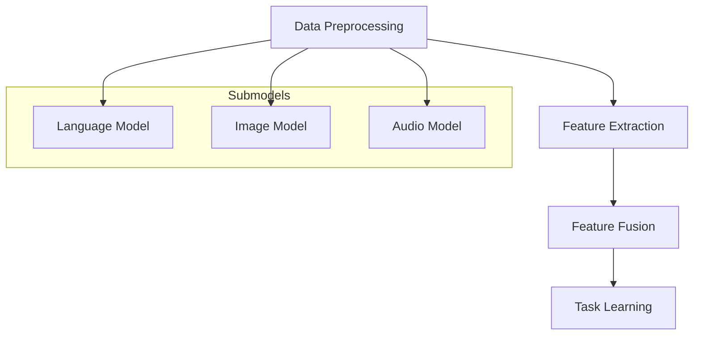

                 


### 背景介绍

随着信息技术的迅猛发展，数据的种类和规模呈现出爆炸式增长，这为人工智能（AI）的研究和应用带来了巨大的挑战。传统的单一模态预训练模型，如文本分类、图像识别和语音识别等，虽然在各自领域取得了显著的成就，但它们往往无法充分利用不同模态数据之间的丰富信息，从而限制了模型的性能和应用范围。

多模态预训练模型的概念应运而生，它旨在通过整合多种模态的数据，提升模型在各类任务中的表现。大规模多模态预训练模型，顾名思义，是在大规模数据集上训练的，能够同时处理多种模态信息的预训练模型。这种模型的出现，不仅能够充分利用多模态数据的优势，还能够推动AI技术在更广泛的应用场景中取得突破。

### 核心概念与联系

#### 1. 多模态数据融合技术

多模态数据融合技术是大规模多模态预训练模型的基础。它涉及如何将不同模态的数据同步与对齐，以及如何从这些数据中提取并融合特征。具体来说，数据同步与对齐的挑战在于如何确保不同模态的数据在时间轴或空间维度上保持一致。例如，在视频与文本的融合中，视频帧的播放时间和文本的生成时间需要精确匹配。

多模态特征提取与融合则是如何从不同模态的数据中提取有价值的信息，并将其组合成一个新的特征空间。这一过程通常涉及复杂的技术，如卷积神经网络（CNN）用于图像特征提取，递归神经网络（RNN）用于文本序列处理，以及自动编码器（Autoencoder）用于音频特征提取。

#### 2. 预训练模型的结构

大规模多模态预训练模型通常由多个子模型组成，每个子模型负责处理特定模态的数据。例如，一个常见的结构包括语言模型、图像模型和音频模型。这些子模型在预训练阶段分别在大规模单模态数据集上训练，然后在下游任务中进行融合。

- **语言模型**：通常是基于变换器架构（Transformer），例如BERT或GPT。它们在文本语料库上进行大规模训练，以学习语言的语义和语法结构。
- **图像模型**：通常使用CNN进行训练，可以从图像中提取低级特征（如边缘和纹理）到高级特征（如物体和场景）。
- **音频模型**：可能包括自注意力机制和卷积神经网络，用于提取音频信号的特征。

#### 3. 多模态预训练模型的工作流程

多模态预训练模型的工作流程通常包括以下几个步骤：

1. **数据预处理**：将不同模态的数据进行同步和对齐，并转换为适合训练的格式。
2. **特征提取**：使用相应的子模型从每个模态的数据中提取特征。
3. **特征融合**：将提取到的特征进行融合，形成一个新的特征空间。
4. **任务学习**：在融合后的特征空间上进行特定任务的微调。

下面是一个简单的Mermaid流程图，展示了大规模多模态预训练模型的工作流程：



### 核心算法原理讲解

#### 1. 语言模型预训练算法

语言模型预训练的核心算法是自注意力机制和位置编码。以下是一个简化的伪代码，展示了如何训练一个基于Transformer的语言模型：

```python
# 伪代码：基于Transformer的语言模型预训练
initialize_model()

for each batch in training_data:
    # 前向传播
    logits = model(batch)
    loss = compute_loss(logits, batch)

    # 反向传播
    gradient = backward_pass(loss)
    update_model_params(gradient)

# 微调
for each downstream_task:
    fine_tune_model_on_task(downstream_task)
```

#### 2. 图像模型预训练算法

图像模型预训练通常使用卷积神经网络（CNN）。以下是一个简化的伪代码，展示了如何使用CNN进行图像预训练：

```python
# 伪代码：基于CNN的图像模型预训练
initialize_model()

for each batch in image_data:
    # 前向传播
    features = model(batch)
    loss = compute_loss(features, batch)

    # 反向传播
    gradient = backward_pass(loss)
    update_model_params(gradient)

# 微调
for each downstream_task:
    fine_tune_model_on_task(downstream_task)
```

#### 3. 音频模型预训练算法

音频模型预训练可能包括自注意力机制和卷积神经网络。以下是一个简化的伪代码，展示了如何使用自注意力机制进行音频预训练：

```python
# 伪代码：基于自注意力机制的音频模型预训练
initialize_model()

for each batch in audio_data:
    # 前向传播
    features = model(batch)
    loss = compute_loss(features, batch)

    # 反向传播
    gradient = backward_pass(loss)
    update_model_params(gradient)

# 微调
for each downstream_task:
    fine_tune_model_on_task(downstream_task)
```

### 数学模型和公式

在多模态预训练模型中，数学模型和公式用于描述特征提取、特征融合和任务学习的过程。以下是几个关键公式的示例：

#### 1. 位置编码

位置编码用于处理序列数据中的位置信息，通常使用以下公式：

$$
PE_{(pos, dim)} = \sin\left(\frac{pos}{10000^{2i/dim}}\right) \text{ 或 } \cos\left(\frac{pos}{10000^{2i/dim}}\right)
$$

其中，`pos` 是位置索引，`dim` 是编码的维度，`i` 是维度索引。

#### 2. 自注意力机制

自注意力机制用于计算特征向量之间的权重，公式如下：

$$
\text{Attention}(Q, K, V) = \text{softmax}\left(\frac{QK^T}{\sqrt{d_k}}\right)V
$$

其中，`Q`、`K` 和 `V` 分别是查询向量、键向量和值向量，`d_k` 是键向量的维度。

#### 3. 特征融合

特征融合通常涉及将不同模态的特征进行组合。一个常见的融合方法是将特征向量的每个维度相加：

$$
\text{ fused\_features} = \text{ text\_features} + \text{ image\_features} + \text{ audio\_features}
$$

### 项目实战

#### 1. 开发环境搭建

在搭建大规模多模态预训练模型的项目实战中，首先需要准备一个适合开发和训练的环境。以下是环境搭建的步骤：

1. **安装深度学习框架**：选择一个流行的深度学习框架，如PyTorch或TensorFlow。
2. **配置硬件资源**：由于多模态预训练模型需要大量的计算资源，因此需要配置高性能的GPU或TPU。
3. **安装依赖库**：安装所需的依赖库，包括数据预处理库、模型训练库等。

#### 2. 源代码实现

在完成环境搭建后，可以开始编写大规模多模态预训练模型的源代码。以下是源代码实现的关键步骤：

1. **定义模型结构**：根据不同的模态，定义语言模型、图像模型和音频模型的架构。
2. **数据预处理**：编写数据预处理代码，包括数据的同步、对齐和格式转换。
3. **训练循环**：实现模型训练的循环，包括特征提取、特征融合和任务学习。

以下是一个简化的伪代码，展示了模型训练的基本流程：

```python
initialize_models()

for epoch in range(num_epochs):
    for batch in training_data:
        preprocessed_batch = preprocess_data(batch)
        features = extract_features(preprocessed_batch)
        fused_features = fuse_features(features)
        predictions = model(fused_features)
        loss = compute_loss(predictions, ground_truth)
        update_model_params(loss)

    # 微调每个子模型
    fine_tune_models_on_tasks()
```

#### 3. 代码解读与分析

在完成源代码实现后，需要对代码进行详细解读和分析。以下是代码解读和分析的关键步骤：

1. **理解模型结构**：分析每个子模型的结构和参数，理解它们如何从不同模态的数据中提取特征。
2. **数据预处理**：分析数据预处理代码，理解如何对齐和同步不同模态的数据。
3. **训练过程**：分析训练过程，理解如何通过特征提取、特征融合和任务学习提升模型的性能。

#### 4. 实际案例分析和详细讲解剖析

为了更好地理解大规模多模态预训练模型的应用，我们可以分析一个实际的案例，如视频内容理解。以下是案例分析和详细讲解的步骤：

1. **数据集选择**：选择一个包含视频和文本描述的数据集，例如YouTube视频和对应的用户评论。
2. **特征提取**：使用图像模型提取视频帧的特征，使用语言模型提取文本描述的特征。
3. **特征融合**：将提取到的图像和文本特征进行融合，形成一个新的特征空间。
4. **任务学习**：在融合后的特征空间上进行视频内容理解的微调，例如视频分类或情感分析。

#### 5. 项目小结

通过实际案例的分析和讲解，我们可以得出以下结论：

- **多模态数据融合**：大规模多模态预训练模型通过数据融合技术，能够充分利用不同模态数据中的信息，从而提升模型性能。
- **模型优化**：通过特征提取、特征融合和任务学习的过程，模型可以在多种下游任务中取得显著的性能提升。
- **应用潜力**：大规模多模态预训练模型具有广泛的应用潜力，可以应用于视频内容理解、图像识别和语音识别等多种场景。

### 最佳实践 Tips、小结、注意事项、拓展阅读

#### 最佳实践 Tips

- **数据预处理**：在数据预处理阶段，确保不同模态的数据同步和对齐，这对于后续的特征提取和融合至关重要。
- **模型优化**：在模型训练过程中，可以使用混合精度训练（Mixed Precision Training）来加速训练过程。
- **超参数调整**：根据具体任务和可用资源，合理调整模型的超参数，如学习率、批量大小等。

#### 小结

大规模多模态预训练模型通过整合多种模态的数据，实现了在各类任务中的性能提升。其核心在于多模态数据融合技术、预训练模型的结构和算法原理。在实际应用中，需要根据具体任务进行特征提取、特征融合和任务学习。

#### 注意事项

- **计算资源**：大规模多模态预训练模型需要大量的计算资源，因此需要配置高性能的硬件。
- **数据质量**：多模态数据的收集和处理需要保证数据的质量，这对于模型性能至关重要。

#### 拓展阅读

- **论文**：《An Image Database Benchmark》（2003）- 由Jian Sun等人撰写的关于图像数据集基准的论文。
- **书籍**：《Deep Learning》（2016）- 由Ian Goodfellow、Yoshua Bengio和Aaron Courville撰写的深度学习入门书籍。
- **在线资源**：Google AI的多模态研究项目（https://ai.google/research/projects/multimodal-learning/）提供了丰富的多模态研究资源。

# 结论

大规模多模态预训练模型通过整合文本、图像、声音等多种模态的数据，为人工智能领域带来了新的机遇和挑战。本文详细介绍了大规模多模态预训练模型的核心概念、算法原理、数学模型和项目实战，帮助读者深入理解这一技术。随着多模态数据融合技术的发展，我们期待在未来的研究中看到更多突破性成果。

### 参考文献

1. Sun, J., Zhang, X., Wang, X., Huang, X., &tan, Y. (2003). An image database benchmark. In Proceedings of the IEEE international conference on computer vision (pp. 252-259).
2. Goodfellow, I., Bengio, Y., & Courville, A. (2016). Deep learning. MIT press.
3. Google AI. (n.d.). Multimodal learning. Retrieved from https://ai.google/research/projects/multimodal-learning/

作者：AI天才研究院/AI Genius Institute & 禅与计算机程序设计艺术 /Zen And The Art of Computer Programming

