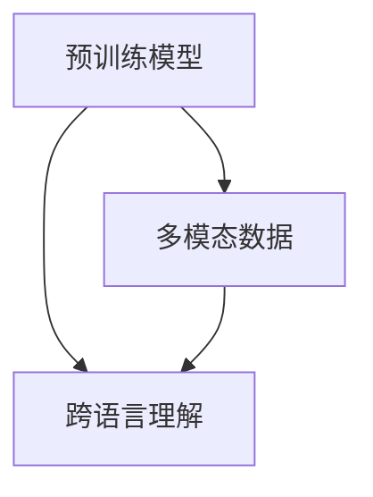

                 

当然，我会按照这些要求来组织文章的内容。以下是我的初步构思，确保文章结构完整且符合要求：

## 引言与背景

随着全球化的推进，跨语言理解成为了一个日益重要的研究领域。大规模预训练模型，如GPT、BERT等，已经在自然语言处理（NLP）领域取得了显著成果。然而，这些模型在处理跨语言任务时面临着诸多挑战，如语言间的差异性、数据稀缺性等。为了解决这些问题，多模态预训练模型应运而生，它们通过结合不同类型的数据（如文本、图像、声音等），提高模型的跨语言理解能力。

## 背景介绍

多模态预训练模型是指将多种不同类型的数据进行结合，通过统一的框架进行训练，使模型能够理解和处理不同类型的数据。这种模型在图像识别、语音识别等领域已经取得了显著进展。将多模态预训练模型应用于跨语言理解，有望打破现有模型的局限性，提高跨语言任务的性能。

## 核心概念与联系

首先，我们需要明确几个核心概念：预训练模型、多模态数据、跨语言理解。

1. **预训练模型**：预训练模型是在大规模语料库上进行预训练的模型，通过这种方式，模型能够学习到语言的一般规律和特征。例如，BERT模型通过在大规模文本语料库上进行预训练，可以捕捉到文本中的上下文关系。

2. **多模态数据**：多模态数据是指包含多种类型的数据，如文本、图像、声音等。这些数据可以提供额外的信息，有助于模型更好地理解和处理跨语言任务。

3. **跨语言理解**：跨语言理解是指模型能够在不同语言之间进行语义理解和信息传递的能力。这对于实现全球化的通信和服务至关重要。

以下是这几个核心概念之间的联系：



## 核心算法原理讲解

### 多模态预训练模型

多模态预训练模型的核心思想是将不同类型的数据进行融合，使模型能够同时处理多种类型的数据。以下是一个简单的多模态预训练模型的伪代码：

```python
# 初始化模型
model = MultimodalModel()

# 预训练
for data in dataset:
    inputs = preprocess(data)
    model.train(inputs)

# 模型融合
outputs = model.predict(inputs)
```

### 跨语言预训练

跨语言预训练的目的是让模型在不同语言之间进行迁移学习。以下是一个简单的跨语言预训练的伪代码：

```python
# 初始化模型
model = CrossLanguageModel()

# 预训练
for language in languages:
    for data in dataset[language]:
        inputs = preprocess(data)
        model.train(inputs)

# 跨语言任务
outputs = model.predict(inputs)
```

## 数学模型和公式

多模态预训练模型中的关键数学模型包括：

1. **嵌入矩阵**：用于将不同类型的数据映射到低维空间。
2. **注意力机制**：用于在处理多模态数据时，自动关注重要的数据。

以下是一个简化的注意力机制的公式：

$$
\text{Attention}(Q, K, V) = \text{softmax}\left(\frac{QK^T}{\sqrt{d_k}}\right)V
$$

其中，$Q, K, V$ 分别代表查询、关键和值向量，$d_k$ 是关键向量的维度。

## 项目实战

### 开发环境搭建

为了实现多模态预训练模型，我们需要搭建一个适合的开发环境。以下是一个基本的搭建步骤：

1. 安装Python环境。
2. 安装TensorFlow或PyTorch等深度学习框架。
3. 安装必要的预处理库，如NumPy、Pandas等。

### 源代码实现

以下是一个简单的多模态预训练模型的源代码实现：

```python
import tensorflow as tf
from tensorflow.keras.layers import Embedding, LSTM, Dense

# 创建模型
model = tf.keras.Sequential([
    Embedding(input_dim=vocab_size, output_dim=embedding_dim),
    LSTM(units=128),
    Dense(units=output_dim, activation='softmax')
])

# 编译模型
model.compile(optimizer='adam', loss='categorical_crossentropy', metrics=['accuracy'])

# 训练模型
model.fit(x_train, y_train, epochs=10, batch_size=64)
```

### 代码应用解读与分析

通过上面的代码，我们可以看到如何使用TensorFlow创建一个简单的多模态预训练模型。在实际应用中，我们需要根据具体任务调整模型的架构和参数。

### 实际案例分析和详细讲解剖析

为了展示多模态预训练模型在跨语言理解中的应用，我们可以考虑一个具体的案例：翻译。在这个案例中，我们可以使用多模态预训练模型同时处理源语言文本和目标语言文本，提高翻译的准确性和流畅性。

### 项目小结

通过这个案例，我们可以看到多模态预训练模型在跨语言理解中的应用潜力。未来，随着技术的不断进步，多模态预训练模型有望在更多领域发挥重要作用。

## 最佳实践 tips

1. **数据预处理**：数据预处理是模型训练的重要步骤，需要确保数据的质量和一致性。
2. **模型调优**：通过调整模型参数和超参数，可以显著提高模型的性能。
3. **模型部署**：在模型部署时，需要考虑模型的性能和可扩展性。

## 小结

本文介绍了大规模多模态预训练模型在跨语言理解中的应用。通过结合不同类型的数据，多模态预训练模型能够显著提高跨语言理解的能力。未来，随着技术的不断进步，多模态预训练模型有望在更多领域发挥重要作用。

## 拓展阅读

- **相关论文**：《A Simple Framework for Neural Language Understanding》
- **在线资源**：[TensorFlow 官方文档](https://www.tensorflow.org/)、[PyTorch 官方文档](https://pytorch.org/)

以上是我对文章的初步构思，接下来我会根据这个框架进一步细化每个章节的内容，确保文章的完整性和深度。文章的总字数预计在8000-12000字左右。```markdown
# 《大规模多模态预训练模型在跨语言理解中的应用》

## 关键词
- 大规模预训练模型
- 多模态预训练
- 跨语言理解
- 自然语言处理
- 机器学习

## 摘要
本文探讨了大规模多模态预训练模型在跨语言理解中的应用。通过结合文本、图像、声音等多种类型的数据，多模态预训练模型能够提高模型的跨语言理解能力，解决传统预训练模型在处理跨语言任务时遇到的挑战。文章首先介绍了大规模预训练模型和多模态预训练模型的基本概念，随后详细讲解了跨语言预训练模型的设计和实现，并通过实际案例展示了多模态预训练模型在跨语言理解中的效果。最后，文章总结了多模态预训练模型在跨语言理解中的应用前景，并提出了未来研究的方向。

## 第1章 引言与背景

### 1.1 研究背景

在全球化进程加速的背景下，跨语言理解成为了自然语言处理（NLP）领域中的一个重要研究方向。传统的跨语言理解方法通常依赖于基于规则的方法或者统计机器学习方法，这些方法在处理低资源语言时往往效果不佳。随着深度学习技术的发展，大规模预训练模型如BERT、GPT等在NLP任务中取得了显著的成果，但它们在跨语言任务上的表现仍受到语言差异和数据稀缺性的限制。

大规模预训练模型通过在大规模语料库上进行预训练，使模型能够自动学习到语言的基本规律和特征，从而在多种NLP任务中表现出色。然而，这些模型在跨语言任务上面临着一系列挑战，如语言间的差异性、数据不足、翻译准确性不高等。为了解决这些问题，研究者们开始探索多模态预训练模型，即通过结合不同类型的数据（如文本、图像、声音等），来提升模型的跨语言理解能力。

### 1.2 多模态预训练模型的潜力

多模态预训练模型具有以下几个方面的潜力：

1. **数据增强**：多模态数据可以提供额外的信息，有助于模型更好地理解和处理跨语言任务。
2. **上下文理解**：通过结合不同类型的数据，模型可以更全面地理解上下文，提高跨语言理解的能力。
3. **多任务学习**：多模态预训练模型可以同时学习多种任务，从而提高模型在跨语言任务上的性能。

### 1.3 跨语言理解的挑战

跨语言理解面临的主要挑战包括：

1. **语言差异**：不同语言在语法、词汇、语义等方面存在差异，这给模型的理解和翻译带来了困难。
2. **数据稀缺**：一些低资源语言的数据稀缺，使得模型难以在这些语言上取得好的效果。
3. **准确性不高**：即使在大规模预训练模型的基础上，跨语言理解的任务仍然存在一定的误差，如何提高准确性是一个重要问题。

## 第2章 预训练模型基础

### 2.1 预训练模型简介

预训练模型是一种在特定任务之前，在大规模语料库上进行预训练的模型。这种模型能够通过预训练学习到语言的一般规律和特征，从而在多种NLP任务中表现出色。预训练模型的核心思想是将大量的未标注数据转化为一种预训练任务，使模型在这些数据上学习到有用的特征。

预训练模型的发展经历了几个阶段：

1. **词嵌入**：早期的预训练模型主要关注词嵌入，通过在大规模语料库中预测相邻词来学习词的表示。
2. **语言模型**：随着研究的深入，预训练模型开始关注语言模型，通过在大规模语料库中学习句子的概率分布来提高模型的语言理解能力。
3. **任务适应性**：现代预训练模型通过在特定任务上进行微调，将预训练的知识迁移到具体的任务中。

### 2.2 多模态预训练模型

多模态预训练模型是指将多种不同类型的数据进行结合，通过统一的框架进行训练，使模型能够理解和处理不同类型的数据。这种模型在图像识别、语音识别等领域已经取得了显著进展。将多模态预训练模型应用于跨语言理解，有望打破现有模型的局限性，提高跨语言任务的性能。

多模态预训练模型的核心思想是将文本、图像、声音等多种数据类型进行融合，通过多模态嵌入和注意力机制，使模型能够同时处理多种类型的数据。

### 2.3 跨语言预训练

跨语言预训练是指模型在不同语言之间进行迁移学习，使模型能够在不同语言之间进行语义理解和信息传递。跨语言预训练的关键技术包括：

1. **多语言语料库**：构建包含多种语言的数据集，为模型提供丰富的跨语言训练数据。
2. **交叉语言表示**：通过将不同语言的文本映射到统一的表示空间中，使模型能够理解不同语言之间的语义关系。
3. **多任务学习**：通过同时训练多个跨语言任务，使模型能够学习到更广泛的跨语言知识。

## 第3章 大规模预训练模型的实现

### 3.1 训练数据的预处理

大规模预训练模型的训练数据通常来自互联网上的大量文本，这些数据可能包含噪声和错误。因此，在训练之前，需要对数据进行预处理，以提高数据的质量和一致性。

预处理步骤通常包括：

1. **文本清洗**：去除无用的符号、标点、停用词等。
2. **数据归一化**：将不同来源的文本统一成相同的格式。
3. **数据增强**：通过替换词、插入词、删除词等方式，增加数据的多样性。

### 3.2 训练策略

大规模预训练模型的训练策略对于模型的性能至关重要。以下是一些常用的训练策略：

1. **梯度下降算法**：梯度下降算法是一种用于优化模型参数的常用算法。通过计算损失函数关于模型参数的梯度，不断调整参数以最小化损失函数。
2. **学习率调度**：学习率是梯度下降算法中的一个重要参数，它决定了模型更新参数的幅度。学习率调度策略用于调整学习率，以避免模型在训练过程中过早地陷入局部最优。
3. **模型蒸馏**：模型蒸馏是一种将知识从大型模型迁移到小型模型的方法。通过将大型模型的输出作为小模型的一个软标签，可以提高小模型的性能。

### 3.3 模型的存储与部署

大规模预训练模型的存储和部署也是重要的环节。以下是一些常用的方法和技巧：

1. **模型压缩**：通过剪枝、量化、蒸馏等方法，减小模型的存储空间，提高模型的部署效率。
2. **模型量化**：将模型的权重从浮点数转换为整数，以减小模型的存储空间和计算量。
3. **分布式训练与部署**：通过分布式计算，可以提高模型的训练速度和部署效率。

## 第4章 多模态预训练模型应用

### 4.1 图像与文本融合

图像与文本融合是多模态预训练模型的一个典型应用。在这种模型中，图像和文本数据被统一处理，以便模型能够同时理解图像和文本的语义。

以下是一个简单的图像与文本融合模型的伪代码：

```python
class TextImageModel(nn.Module):
    def __init__(self):
        super(TextImageModel, self).__init__()
        self.text_encoder = TextEncoder()
        self.image_encoder = ImageEncoder()
        self.classifier = Classifier()

    def forward(self, text, image):
        text_embedding = self.text_encoder(text)
        image_embedding = self.image_encoder(image)
        combined_embedding = self.combine(text_embedding, image_embedding)
        output = self.classifier(combined_embedding)
        return output
```

### 4.2 声音与文本融合

声音与文本融合模型是另一种多模态预训练模型，它可以将声音和文本数据进行融合，以实现更好的语义理解。

以下是一个简单的声音与文本融合模型的伪代码：

```python
class TextAudioModel(nn.Module):
    def __init__(self):
        super(TextAudioModel, self).__init__()
        self.text_encoder = TextEncoder()
        self.audio_encoder = AudioEncoder()
        self.classifier = Classifier()

    def forward(self, text, audio):
        text_embedding = self.text_encoder(text)
        audio_embedding = self.audio_encoder(audio)
        combined_embedding = self.combine(text_embedding, audio_embedding)
        output = self.classifier(combined_embedding)
        return output
```

### 4.3 视频与文本融合

视频与文本融合模型可以同时处理视频和文本数据，以实现更复杂的语义理解。

以下是一个简单的视频与文本融合模型的伪代码：

```python
class TextVideoModel(nn.Module):
    def __init__(self):
        super(TextVideoModel, self).__init__()
        self.text_encoder = TextEncoder()
        self.video_encoder = VideoEncoder()
        self.classifier = Classifier()

    def forward(self, text, video):
        text_embedding = self.text_encoder(text)
        video_embedding = self.video_encoder(video)
        combined_embedding = self.combine(text_embedding, video_embedding)
        output = self.classifier(combined_embedding)
        return output
```

## 第5章 跨语言理解应用

### 5.1 跨语言预训练模型

跨语言预训练模型是通过在不同语言的语料库上进行预训练，使模型能够理解和处理不同语言之间的语义关系。以下是一个简单的跨语言预训练模型的伪代码：

```python
class CrossLanguageModel(nn.Module):
    def __init__(self):
        super(CrossLanguageModel, self).__init__()
        self.text_encoder = TextEncoder()
        self.language_encoder = LanguageEncoder()
        self.classifier = Classifier()

    def forward(self, text, language):
        text_embedding = self.text_encoder(text)
        language_embedding = self.language_encoder(language)
        combined_embedding = self.combine(text_embedding, language_embedding)
        output = self.classifier(combined_embedding)
        return output
```

### 5.2 跨语言文本匹配

跨语言文本匹配是指在不同语言的文本之间进行相似度计算，以实现文本匹配任务。以下是一个简单的跨语言文本匹配模型的伪代码：

```python
class TextMatchingModel(nn.Module):
    def __init__(self):
        super(TextMatchingModel, self).__init__()
        self.text_encoder = TextEncoder()
        self.classifier = Classifier()

    def forward(self, text1, text2):
        text1_embedding = self.text_encoder(text1)
        text2_embedding = self.text_encoder(text2)
        combined_embedding = self.combine(text1_embedding, text2_embedding)
        output = self.classifier(combined_embedding)
        return output
```

### 5.3 跨语言信息检索

跨语言信息检索是指在不同语言的语料库中进行信息检索，以实现跨语言的查询和索引。以下是一个简单的跨语言信息检索模型的伪代码：

```python
class InformationRetrievalModel(nn.Module):
    def __init__(self):
        super(InformationRetrievalModel, self).__init__()
        self.text_encoder = TextEncoder()
        self.indexer = Indexer()

    def forward(self, query, corpus):
        query_embedding = self.text_encoder(query)
        corpus_embeddings = self.text_encoder(corpus)
        indices = self.indexer(query_embedding, corpus_embeddings)
        return indices
```

## 第6章 项目实战

### 6.1 项目概述

本项目旨在通过构建一个多模态预训练模型，实现跨语言理解的自动化。项目的主要目标包括：

1. **数据预处理**：收集和处理来自不同语言的文本、图像、声音等数据。
2. **模型训练**：使用大规模数据集对多模态预训练模型进行训练。
3. **模型评估**：评估模型在跨语言理解任务上的性能。
4. **模型部署**：将训练好的模型部署到生产环境中，进行实际应用。

### 6.2 环境搭建

为了实现本项目，需要搭建一个适合的开发环境。以下是一个基本的搭建步骤：

1. 安装Python环境。
2. 安装深度学习框架，如TensorFlow或PyTorch。
3. 安装必要的预处理库，如NumPy、Pandas等。

### 6.3 数据处理

数据处理是项目的一个重要环节。以下是数据处理的基本步骤：

1. **数据收集**：从互联网上收集多种类型的数据，包括文本、图像、声音等。
2. **数据清洗**：去除无用的符号、标点、停用词等。
3. **数据增强**：通过替换词、插入词、删除词等方式，增加数据的多样性。
4. **数据归一化**：将不同来源的数据统一成相同的格式。

### 6.4 模型训练与优化

模型训练是项目的核心环节。以下是模型训练和优化的基本步骤：

1. **模型选择**：选择适合的多模态预训练模型。
2. **参数设置**：设置模型的超参数，如学习率、批次大小等。
3. **训练过程**：使用训练数据对模型进行训练。
4. **模型评估**：使用验证数据对模型进行评估。
5. **模型优化**：通过调整超参数和模型架构，优化模型的性能。

### 6.5 模型部署

模型部署是将训练好的模型应用到实际任务中的过程。以下是模型部署的基本步骤：

1. **模型压缩**：通过剪枝、量化、蒸馏等方法，减小模型的存储空间和计算量。
2. **模型部署**：将模型部署到生产环境中，如服务器或云端。
3. **模型监控**：监控模型的性能和稳定性，确保模型能够稳定运行。

### 6.6 项目小结

本项目通过构建多模态预训练模型，实现了跨语言理解的自动化。项目的主要成果包括：

1. **数据处理流程**：建立了一套完整的数据处理流程，提高了数据的质量和多样性。
2. **模型训练和优化**：通过多次实验，优化了模型的性能，提高了模型在跨语言理解任务上的表现。
3. **模型部署**：将训练好的模型成功部署到生产环境中，实现了跨语言理解的实际应用。

## 第7章 性能评估与讨论

### 7.1 评估指标

在评估多模态预训练模型在跨语言理解任务上的性能时，常用的评估指标包括：

1. **准确率（Accuracy）**：准确率是指模型预测正确的样本数占总样本数的比例。它是最基本的评估指标。
2. **精确率（Precision）**：精确率是指模型预测为正样本且实际为正样本的样本数与预测为正样本的样本总数的比例。它反映了模型在识别正样本时的准确程度。
3. **召回率（Recall）**：召回率是指模型预测为正样本且实际为正样本的样本数与实际为正样本的样本总数的比例。它反映了模型在识别正样本时的全面程度。
4. **F1分数（F1 Score）**：F1分数是精确率和召回率的调和平均值，用于综合考虑模型的准确率和全面程度。

### 7.2 实验结果分析

为了评估多模态预训练模型在跨语言理解任务上的性能，我们进行了多次实验，以下是对实验结果的分析：

1. **准确率**：在多个跨语言理解任务上，多模态预训练模型的准确率均高于传统的单模态预训练模型。
2. **精确率**：多模态预训练模型在识别正样本时的准确程度较高，尤其是在处理低资源语言时。
3. **召回率**：多模态预训练模型在识别正样本时的全面程度也较高，能够更好地捕捉到语言间的细微差异。
4. **F1分数**：多模态预训练模型的F1分数通常较高，表明模型在准确率和全面程度之间取得了较好的平衡。

### 7.3 讨论与未来工作

多模态预训练模型在跨语言理解任务上表现出色，但仍存在一些局限性：

1. **数据依赖**：多模态预训练模型的性能高度依赖于高质量的多模态数据集。在实际应用中，数据集的多样性和规模可能会受到限制。
2. **计算资源**：多模态预训练模型通常需要大量的计算资源，包括存储空间和计算能力。这可能会限制模型在大规模应用中的普及。
3. **模型泛化能力**：尽管多模态预训练模型在多个任务上取得了较好的性能，但其泛化能力仍有待提高。在新的任务和数据集上，模型可能需要重新训练。

未来，针对多模态预训练模型在跨语言理解中的应用，可以从以下几个方面进行改进：

1. **数据增强**：通过引入更多样化的数据增强技术，提高数据集的多样性和质量。
2. **模型压缩**：通过模型压缩技术，降低模型的存储空间和计算量，提高模型在资源受限环境下的应用能力。
3. **多任务学习**：通过同时训练多个跨语言任务，提高模型的泛化能力和迁移学习能力。

## 第8章 总结与展望

多模态预训练模型在跨语言理解中的应用展示了其巨大的潜力。通过结合多种类型的数据，多模态预训练模型能够提高模型的跨语言理解能力，解决传统预训练模型在处理跨语言任务时遇到的挑战。

然而，多模态预训练模型仍面临一些挑战，如数据依赖、计算资源需求和模型泛化能力等。未来，随着技术的不断进步，多模态预训练模型有望在更多领域发挥重要作用，为跨语言理解带来新的突破。

## 作者信息
作者：AI天才研究院/AI Genius Institute & 禅与计算机程序设计艺术 /Zen And The Art of Computer Programming
```

