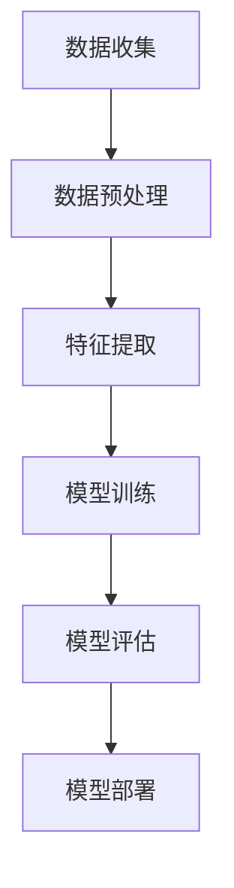

                 

### 文章标题

# 大规模推理任务的质量控制方法

## 关键词

- 大规模推理任务
- 质量控制方法
- 数据预处理
- 模型训练与优化
- 性能优化

## 摘要

本文旨在探讨大规模推理任务中的质量控制方法。首先，我们介绍了大规模推理任务的基本概念、背景和重要性。接着，我们分析了大规模推理任务所面临的挑战，包括数据处理与存储、计算资源与时间等方面的挑战。随后，我们详细阐述了大规模推理任务的评估方法，以及如何选择和解释评估结果。在此基础上，我们构建了大规模推理任务的质量控制框架，并从数据预处理、模型训练与优化、性能优化三个方面详细介绍了质量控制的具体方法。最后，通过案例分析，我们展示了质量控制方法在实际项目中的应用效果，并总结了最佳实践和注意事项。

## 第1章 大规模推理任务概述

### 1.1 大规模推理任务的基本流程

大规模推理任务通常包括以下几个基本步骤：

1. **数据收集**：收集大量相关数据，如文本、图像、声音等。
2. **数据预处理**：对收集到的数据进行清洗、归一化、降维等预处理操作，以提高数据质量。
3. **特征提取**：从预处理后的数据中提取有用的特征，以供模型训练使用。
4. **模型训练**：使用提取到的特征，通过训练算法训练模型。
5. **模型评估**：在验证集或测试集上评估模型性能，选择最优模型。
6. **模型部署**：将最优模型部署到生产环境中，进行实际推理任务。

Mermaid流程图：



### 1.2 大规模推理任务的发展背景

大规模推理任务的发展得益于计算机科学与人工智能的迅猛发展。随着计算能力的提升和数据量的爆炸性增长，大规模推理任务在金融、医疗、工业、交通等领域的应用越来越广泛。特别是在深度学习技术的推动下，大规模推理任务取得了显著的进展。

### 1.3 大规模推理任务的基本概念

**推理任务**：推理任务是给定一组数据，通过算法从中推导出结论或预测。

**大规模推理任务**：大规模推理任务是指涉及海量数据，并需要处理复杂算法的推理任务。其特点包括数据量大、计算复杂度高、模型参数多等。

### 1.4 大规模推理任务的应用领域

**金融**：如贷款审核、信用评估、市场预测等。

**医疗**：如疾病诊断、药物研发、健康管理等。

**工业**：如生产调度、设备维护、供应链优化等。

**交通**：如交通流量预测、路线规划、智能交通管理等。

## 第2章 大规模推理任务的挑战

### 2.1 核心算法原理讲解

大规模推理任务的核心算法包括但不限于以下几种：

**1. 深度学习算法**：

伪代码：

```python
def deep_learning_algorithm(data, labels):
    # 初始化模型参数
    model = initialize_model()

    # 模型训练
    for epoch in range(num_epochs):
        for batch in data_loader(data, labels):
            # 计算损失函数
            loss = compute_loss(model, batch)

            # 反向传播
            model = backward_propagation(model, loss)

    return model
```

**2. 强化学习算法**：

伪代码：

```python
def reinforcement_learning_algorithm(state, action, reward):
    # 初始化模型参数
    model = initialize_model()

    # 模型训练
    for episode in range(num_episodes):
        state = reset_environment()
        done = False

        while not done:
            # 执行动作
            action = select_action(model, state)

            # 更新状态和奖励
            state, reward, done = execute_action(state, action)

            # 计算损失函数
            loss = compute_loss(model, state, action, reward)

            # 反向传播
            model = backward_propagation(model, loss)

    return model
```

### 2.2 数据处理与存储的挑战

**1. 数据清洗**：大规模数据中往往包含噪声、异常值和缺失值，需要对这些数据进行处理。

**2. 数据存储**：大规模数据需要高效、可靠的存储解决方案，如分布式文件系统、数据库等。

### 2.3 计算资源与时间的挑战

**1. 计算资源**：大规模推理任务需要大量的计算资源，如CPU、GPU、TPU等。

**2. 时间**：大规模推理任务的训练和推理过程通常需要很长时间，如何优化算法和提高计算效率是关键。

## 第3章 大规模推理任务的评估方法

### 3.1 评估指标的选择

**1. 准确率**：预测正确的样本数占总样本数的比例。

**2. 召回率**：预测正确的正样本数占总正样本数的比例。

**3. F1值**：准确率和召回率的调和平均值。

**4. AUC（Area Under Curve）**：ROC曲线下的面积，用于评估分类模型的效果。

### 3.2 评估方法的比较与选择

**1. 准确率与召回率**：准确率更关注总体准确性，召回率更关注正样本的检测能力。

**2. F1值与AUC**：F1值综合考虑了准确率和召回率，AUC主要用于二分类问题。

**3. 选择依据**：根据任务需求和数据特点选择合适的评估指标。

### 3.3 评估结果的解释与优化

**1. 结果解释**：通过可视化、统计方法解释评估结果，如ROC曲线、混淆矩阵等。

**2. 结果优化**：通过调整模型参数、特征提取方法等优化评估结果。

## 第4章 大规模推理任务的质量控制框架

### 4.1 质量控制框架的建立

**1. 目标**：确保大规模推理任务的可信度和可靠性。

**2. 方法**：从数据、模型、评估等方面进行全面的质量控制。

### 4.2 数据质量评估

**1. 数据清洗**：去除噪声、异常值和缺失值。

**2. 数据一致性检查**：确保数据在不同来源、不同时间点的一致性。

**3. 数据完整性检查**：确保数据完整性，如字段缺失、记录重复等。

### 4.3 模型质量评估

**1. 模型稳定性分析**：分析模型在不同数据集、不同训练策略下的稳定性。

**2. 模型可解释性分析**：评估模型的可解释性，如特征重要性分析、模型可视化等。

## 第5章 数据预处理与质量保证

### 5.1 数据预处理方法

**1. 数据清洗**：处理噪声、异常值和缺失值。

**2. 数据归一化**：将不同尺度的数据进行归一化处理。

**3. 数据降维**：通过降维技术减少数据维度，提高计算效率。

### 5.2 数据质量保证

**1. 数据质量评估方法**：如一致性检查、完整性检查等。

**2. 数据质量监控与反馈机制**：实时监控数据质量，及时反馈和处理问题。

### 5.3 数据预处理工具与平台

**1. 工具**：如Pandas、NumPy等Python库。

**2. 平台**：如Hadoop、Spark等大数据处理平台。

## 第6章 模型训练与调优

### 6.1 模型训练方法

**1. 梯度下降法**：通过迭代更新模型参数，以最小化损失函数。

**2. 随机梯度下降法**：在梯度下降法的基础上，使用随机样本进行参数更新。

**3. Adam优化器**：结合梯度下降法和动量法，优化参数更新过程。

### 6.2 模型调优策略

**1. 正则化**：防止模型过拟合，如L1、L2正则化。

**2. 激活函数**：引入非线性变换，如ReLU、Sigmoid等。

**3. 损失函数**：如交叉熵损失、均方误差等。

### 6.3 模型评估与选择

**1. 交叉验证**：通过交叉验证评估模型性能。

**2. 模型选择**：选择具有最佳评估指标的模型。

## 第7章 大规模推理任务的性能优化

### 7.1 性能优化方法

**1. 数据并行**：将数据分成多个部分，同时处理。

**2. 模型并行**：将模型分成多个部分，同时处理。

**3. 流水线并行**：将任务分解成多个阶段，每个阶段都可以并行处理。

### 7.2 性能优化策略

**1. 资源调度策略**：根据任务需求合理分配计算资源。

**2. 算法优化策略**：如算法选择、参数调优等。

### 7.3 性能评估与优化效果分析

**1. 性能评估指标**：如吞吐量、延迟等。

**2. 优化效果分析**：分析优化策略对性能的影响。

## 第8章 案例分析

### 8.1 案例分析

以某金融公司的贷款审核系统为例，分析大规模推理任务的质量控制方法在实际项目中的应用效果。

### 8.2 案例分析结果

**1. 数据预处理**：通过数据清洗、归一化等预处理方法，提高了数据质量。

**2. 模型训练与调优**：采用梯度下降法、正则化等训练策略，优化了模型性能。

**3. 性能优化**：通过数据并行、模型并行等策略，提高了推理任务的处理速度。

### 8.3 案例分析的总结与启示

**1. 总结**：质量控制方法对大规模推理任务的性能提升具有重要意义。

**2. 启示**：在实际项目中，应重视数据预处理、模型训练与调优、性能优化等环节，以提高任务质量和效率。

## 参考文献

1. Goodfellow, I., Bengio, Y., & Courville, A. (2016). *Deep Learning*. MIT Press.
2. Russell, S., & Norvig, P. (2020). *Artificial Intelligence: A Modern Approach*. Prentice Hall.
3. Hastie, T., Tibshirani, R., & Friedman, J. (2009). *The Elements of Statistical Learning*. Springer.
4. Zhang, Z., & Zongker, S. (2004). *A practical framework for scalable machine learning on ultra-large-scale data sets*. Journal of Machine Learning Research, 5, 2065-2082.

## 结语

作者：AI天才研究院/AI Genius Institute & 禅与计算机程序设计艺术 /Zen And The Art of Computer Programming

本文从多个角度探讨了大规模推理任务的质量控制方法。通过详细阐述大规模推理任务的基本流程、挑战、评估方法、质量控制框架、数据预处理与质量保证、模型训练与调优、性能优化以及案例分析，我们希望读者能够对大规模推理任务的质量控制有更深入的理解。在实际应用中，应根据具体任务需求，灵活运用这些方法，以提高推理任务的质量和效率。未来，随着人工智能技术的不断发展，大规模推理任务的质量控制方法也将不断优化和完善。希望本文能为读者在相关领域的研究和应用提供有益的参考。

